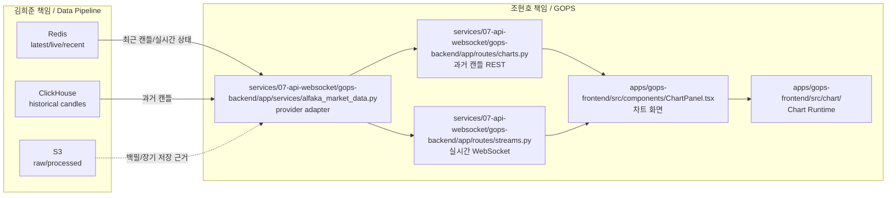

# 조현호 README - GOPS Chart/API/WebSocket 담당

이 문서는 조현호가 병합된 GOPS `Helix` 코드에서 김희준 시장 데이터 파이프라인을 읽을 때 봐야 하는 작업 기준입니다.

조현호의 책임은 GOPS Frontend, Chart Runtime, API Server, WebSocket Server입니다.

Alpaca, Kafka Raw, S3 저장 로직은 직접 다루지 않습니다. 실시간 데이터는 Redis/WebSocket으로 받고, 과거 데이터는 API Server에서 Redis/ClickHouse를 조회합니다.

## 1. 한 줄 책임

```text
Redis/ClickHouse -> API Server/WebSocket Server -> Frontend Chart Runtime
```

## 2. 조현호 담당 범위



## 3. 내가 주로 보는 GOPS 폴더

```text
apps/gops-frontend/                                      React UI
apps/gops-frontend/src/chart/                            Chart Runtime, renderer, command
apps/gops-frontend/src/components/ChartPanel.tsx
services/07-api-websocket/gops-backend/app/routes/charts.py
services/07-api-websocket/gops-backend/app/routes/streams.py
services/07-api-websocket/gops-backend/app/services/alfaka_market_data.py
services/07-api-websocket/gops-backend/app/core/config.py
shared/chart-contract/                                   chart command contract
```

## 4. 내가 직접 수정하지 않는 곳

```text
services/market-data-pipeline/
services/01-alpaca-connector/
services/02-kafka-event-publisher/
services/03-flink-stream-processor/
services/04-redis-state-store/
services/05-clickhouse-store/
services/06-s3-store/
packages/alfaka/
infra/clickhouse/
```

위 영역은 김희준 책임입니다.

단, `backend/app/services/market_data/dto.py` 같은 API 응답 변환 계약은 공동 수정할 수 있습니다.

## 5. GOPS에서 제거해야 하는 것

원본 `Helix` 기준 GOPS는 dummy 데이터를 만들었지만, 병합본에서는 운영 라우트에서 제거했습니다.

제거 대상:

```text
services/07-api-websocket/gops-backend/app/services/market_data.py 제거
services/07-api-websocket/gops-backend/app/routes/charts.py 의 source=dummy 응답 제거
services/07-api-websocket/gops-backend/app/routes/streams.py 의 asyncio sleep 기반 dummy WebSocket loop 제거
```

왜 제거해야 하는가:

```text
김희준 파이프라인에서 실제 Alpaca 데이터가 들어오는데,
GOPS가 dummy를 계속 만들면 화면 데이터 출처가 두 개가 됩니다.
```

운영 기준:

```text
dummy runtime 없음
테스트 fixture는 허용
실제 API 실패 시 fake candle 반환하지 않고 503 또는 empty 상태 반환
```

## 6. 과거 데이터 API 계약

프론트는 과거 데이터를 API Server로만 요청합니다.

```http
GET /api/charts/candles?symbol=AAPL&interval=1m&ma=5,20,60&limit=160
```

API Server 내부 읽기 순서:

```text
1. Redis에서 최근 캔들 확인
2. 부족하면 ClickHouse에서 과거 캔들 조회
3. 그래도 없으면 empty candles 또는 503 반환
```

응답 형식:

```json
{
  "symbol": "AAPL",
  "interval": "1m",
  "source": "alpaca",
  "feed": "sip",
  "isSynthetic": false,
  "indicators": {
    "ma": [5, 20, 60],
    "volume": true
  },
  "candles": [
    {
      "timestamp": "2026-06-26T12:14:00.000Z",
      "open": 276.26,
      "high": 276.40,
      "low": 275.15,
      "close": 276.26,
      "volume": 1796,
      "isClosed": true,
      "ma5": 275.11,
      "ma20": 274.80,
      "ma60": 273.90
    }
  ]
}
```

프론트 타입 기준:

```text
apps/gops-frontend/src/chart/types.ts
  CandleData
  CandleSnapshot
  CandleEvent
```

## 7. 실시간 WebSocket 계약

프론트는 실시간 데이터를 WebSocket으로만 받습니다.

```text
ws://localhost:8000/ws/charts?symbol=AAPL&interval=1m
```

event type:

```text
LIVE_CANDLE_UPDATE
CANDLE_CLOSED
CANDLE_CORRECTED
```

event 형식:

```json
{
  "type": "LIVE_CANDLE_UPDATE",
  "symbol": "AAPL",
  "interval": "1m",
  "source": "alpaca",
  "feed": "sip",
  "isSynthetic": false,
  "data": {
    "timestamp": "2026-06-26T12:14:00.000Z",
    "open": 276.26,
    "high": 276.40,
    "low": 275.15,
    "close": 276.26,
    "volume": 1796,
    "isClosed": false
  }
}
```

김희준 Redis Pub/Sub channel:

```text
market.events
market.events:{symbol}
```

## 8. 김희준 폴더에서 참고할 파일

이미 병합본 backend가 아래 provider를 import해서 사용합니다.

```text
packages/alfaka/serving/dto.py
packages/alfaka/serving/redis_provider.py
packages/alfaka/serving/clickhouse_provider.py
packages/alfaka/serving/provider.py
```

실제 병합 구조:

```text
services/07-api-websocket/gops-backend/app/services/alfaka_market_data.py
  -> packages/alfaka/serving/provider.py
  -> packages/alfaka/serving/redis_provider.py
  -> packages/alfaka/serving/clickhouse_provider.py
  -> packages/alfaka/serving/dto.py
```

## 9. 병합 후 확인할 것

| 순서 | 작업 | 완료 기준 |
|---:|---|---|
| 1 | 실제 데이터 API 확인 | `/api/charts/candles`가 `source=alpaca` 반환 |
| 2 | Redis provider 확인 | API/WebSocket이 Redis key를 읽음 |
| 3 | ClickHouse provider 확인 | Redis 부족분을 ClickHouse에서 조회 |
| 4 | WebSocket 실시간 연결 | `/ws/charts`가 `LIVE_CANDLE_UPDATE` push |
| 5 | frontend adapter 확인 | `normalizeCandleSnapshot`, `normalizeCandleEvent` 통과 |
| 6 | contract fixture 추가 | sample REST/WS payload 테스트 통과 |

## 10. 조현호가 지켜야 할 원칙

- 프론트는 Alpaca, Kafka, S3를 직접 알면 안 됩니다.
- API Server는 과거 데이터 조회 책임입니다.
- WebSocket Server는 실시간 데이터 push 책임입니다.
- dummy 데이터는 runtime에서 제거합니다.
- 김희준 Redis key, Kafka topic, ClickHouse table 이름은 임의 변경하지 않습니다.
- 데이터 필드 변경이 필요하면 먼저 김희준과 `README-GOPS-MERGE.md`를 수정합니다.

## 11. 병합 완료 기준

```text
1. /api/charts/candles가 Redis/ClickHouse 기반 실제 데이터를 반환한다.
2. /ws/charts가 Redis 기반 실시간 event를 push한다.
3. GOPS Frontend는 기존 Chart Runtime 구조를 유지한다.
4. 김희준 Alpaca 수집기를 끄면 실시간 차트 업데이트가 멈춘다.
5. 테스트 fixture 외 runtime dummy 데이터가 없다.
```
