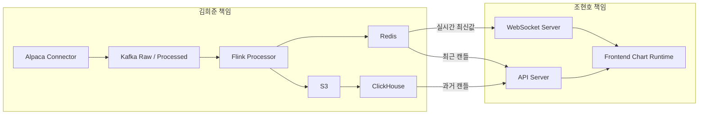

# GOPS x Alfaka 통합 README

이 문서는 김희준의 `alfaka` 시장 데이터 파이프라인과 조현호의 `gops Helix` 차트 렌더링 코드를 실제 병합한 공동 README다.

병합 기준:

```text
GOPS Helix commit: ea0eaf443e20785643eba36178e66a9a52d81fd9
Frontend 위치: apps/gops-frontend
Backend 위치: services/07-api-websocket/gops-backend
Shared contract 위치: shared/chart-contract
```

담당자별로 먼저 볼 문서:

- 김희준: [README-KIM-HEEJUN.md](/Users/heejunkim/Desktop/alfaka/README-KIM-HEEJUN.md)
- 조현호: [README-CHO-HYUNHO.md](/Users/heejunkim/Desktop/alfaka/README-CHO-HYUNHO.md)

## 1. 사람별 책임

| 담당자 | 폴더/영역 | 책임 |
|---|---|---|
| 김희준 | `services/01-*` ~ `services/06-*`, `packages/alfaka/`, `infra/clickhouse/`, Kafka/Redis/S3/ClickHouse 계약 | Alpaca 데이터 수집, Kafka/Flink 처리, Redis/S3/ClickHouse 저장 |
| 조현호 | `apps/gops-frontend/`, `services/07-api-websocket/gops-backend/app/routes/` | Chart API, WebSocket, React Chart Runtime, 렌더링 |
| 공동 | `packages/alfaka/serving/`, `shared/chart-contract/`, `services/07-api-websocket/gops-backend/app/services/alfaka_market_data.py` | API 응답 DTO, WebSocket event, provider 연결 |



## 2. 병합 원칙

김희준 코드는 데이터 파이프라인이고, 조현호 코드는 차트 앱이다.

두 코드는 Redis와 ClickHouse에서 만난다.

```text
김희준:
Alpaca -> Kafka -> Flink -> Redis/S3/ClickHouse

조현호:
Redis/ClickHouse -> API/WebSocket -> Frontend Chart
```

따라서 프론트는 Alpaca, Kafka, S3를 직접 알면 안 된다.

API Server와 WebSocket Server는 Alpaca 원본 API를 직접 호출하지 않는다.

## 3. 최종 병합 폴더 구조

```text
alfaka/
  apps/gops-frontend/                        조현호
    src/chart/
    src/components/ChartPanel.tsx

  services/07-api-websocket/gops-backend/    조현호
    app/routes/charts.py                     과거 캔들 REST API
    app/routes/streams.py                    실시간 차트 WebSocket
    app/services/alfaka_market_data.py       공동 provider adapter

  services/01-alpaca-connector/              김희준
  services/02-kafka-event-publisher/         김희준
  services/03-flink-stream-processor/        김희준
  services/04-redis-state-store/             김희준
  services/05-clickhouse-store/              김희준
  services/06-s3-store/                      김희준

  packages/alfaka/                           김희준
    serving/                                 공동 DTO/provider

  shared/chart-contract/                     조현호 원본 contract

  infra/
    docker/                                  공동 Dockerfile
    clickhouse/                              김희준
    k8s/                                     공동
    aws/                                     공동

  docs/
    spec/20-market-data/                     김희준 주도
    architecture/service-boundaries.md       조현호 주도
```

## 4. 과거 데이터 계약

과거 데이터는 API Server로만 요청한다.

```http
GET /api/charts/candles?symbol=AAPL&interval=1m&ma=5,20,60&limit=160
```

API Server 읽기 순서:

```text
1. Redis에서 최근 캔들 확인
2. Redis에 부족하면 ClickHouse에서 과거 캔들 조회
3. ClickHouse에 없는 구간은 김희준 backfill/S3 적재 대상
```

응답 형식:

```json
{
  "symbol": "AAPL",
  "interval": "1m",
  "source": "alpaca",
  "feed": "sip",
  "isSynthetic": false,
  "indicators": {
    "ma": [5, 20, 60],
    "volume": true
  },
  "candles": []
}
```

## 5. 실시간 데이터 계약

실시간 데이터는 WebSocket으로만 전달한다.

```text
ws://localhost:8000/ws/charts?symbol=AAPL&interval=1m
```

event type:

```text
LIVE_CANDLE_UPDATE
CANDLE_CLOSED
CANDLE_CORRECTED
```

event 형식:

```json
{
  "type": "LIVE_CANDLE_UPDATE",
  "symbol": "AAPL",
  "interval": "1m",
  "source": "alpaca",
  "feed": "sip",
  "isSynthetic": false,
  "data": {
    "timestamp": "2026-06-26T11:36:00.000Z",
    "open": 276.26,
    "high": 276.4,
    "low": 275.15,
    "close": 276.26,
    "volume": 1796,
    "isClosed": false
  }
}
```

## 6. 김희준 제공 계약

Kafka topic:

```text
market.raw.bars
market.raw.updated-bars
market.raw.trades
market.ticks.v1
market.candles.live.1m.v1
market.candles.closed.v1
```

Redis key:

```text
price:{symbol}:latest
candle:{symbol}:1m:live
candle:{symbol}:{interval}:latest
candles:{symbol}:{interval}
```

ClickHouse table:

```text
market_data.trade_ticks
market_data.chart_candles
```

S3 prefix:

```text
market-data/raw/source=alpaca/channel={channel}/symbol={symbol}/...
market-data/processed/trades/symbol={symbol}/...
market-data/processed/candles/interval={interval}/symbol={symbol}/...
```

## 7. 조현호 수정 계약

GOPS의 dummy runtime은 제거한다.

수정 대상:

```text
services/07-api-websocket/gops-backend/app/routes/charts.py
services/07-api-websocket/gops-backend/app/routes/streams.py
services/07-api-websocket/gops-backend/app/services/alfaka_market_data.py
services/07-api-websocket/gops-backend/app/core/config.py
```

변경 방향:

```text
dummy candle 생성
  -> Redis/ClickHouse provider 사용

dummy WebSocket loop
  -> Redis 기반 live event push
```

프론트는 `CandleData`, `CandleSnapshot`, `CandleEvent` 타입을 유지한다.

## 8. 수정 금지선

김희준은 원칙적으로 아래 영역을 수정하지 않는다.

```text
apps/gops-frontend/src/chart/
apps/gops-frontend/src/components/ChartPanel.tsx
```

조현호는 원칙적으로 아래 영역을 수정하지 않는다.

```text
services/01-alpaca-connector/
services/02-kafka-event-publisher/
services/03-flink-stream-processor/
services/04-redis-state-store/
services/05-clickhouse-store/
services/06-s3-store/
packages/alfaka/
infra/clickhouse/
```

둘 다 건드릴 수 있는 영역:

```text
packages/alfaka/serving/dto.py
services/07-api-websocket/gops-backend/app/services/alfaka_market_data.py
shared/chart-contract/
contract fixture
```

## 9. 병합 후 확인 작업

| 순서 | 작업 | 담당 |
|---:|---|---|
| 1 | GOPS runtime이 `source=dummy`를 반환하지 않는지 확인 | 조현호 |
| 2 | Redis provider가 최신/최근 캔들을 읽는지 확인 | 조현호 |
| 3 | ClickHouse provider가 과거 캔들을 읽는지 확인 | 조현호 |
| 4 | ClickHouse 적재 job이 closed candle을 저장하는지 확인 | 김희준 |
| 5 | Historical backfill 실행 검증 | 김희준 |
| 6 | REST/WS DTO fixture 추가 | 공동 |
| 7 | 로컬 통합 docker compose 실행 확인 | 김희준 |
| 8 | 프론트 차트 렌더링 회귀 확인 | 조현호 |

## 10. 병합 완료 기준

다음이 모두 되면 1차 병합 완료로 본다.

```text
1. 더미 데이터 없이 /api/charts/candles가 실제 Redis/ClickHouse 데이터를 반환한다.
2. 더미 loop 없이 /ws/charts가 실제 Redis 기반 live candle을 push한다.
3. 김희준 Alpaca 수집기를 끄면 실시간 차트가 멈춘다.
4. 김희준 backfill을 실행하면 과거 캔들이 API에서 조회된다.
5. 조현호 프론트는 Alpaca/Kafka/S3를 직접 모른다.
```

## 11. 현재 구현 반영

이번 단계에서 김희준 폴더에 병합 준비용 adapter와 loader가 추가됐다.

```text
services/05-clickhouse-store/processed_loader.py
packages/alfaka/storage/clickhouse_loader.py
packages/alfaka/serving/
services/07-api-websocket/chart-api/gops_provider_example.py
services/07-api-websocket/websocket-gateway/gops_stream_example.py
```

이 코드는 GOPS에 바로 덮어쓰는 코드가 아니라, 조현호 backend에 provider를 붙일 때 기준이 되는 구현 샘플이다.

로컬 검증 결과:

```text
market_data.trade_ticks   1996 rows
market_data.chart_candles 15 rows
Redis live event adapter   LIVE_CANDLE_UPDATE 생성 확인
ClickHouse provider        CandleSnapshot timestamp 확인
```
