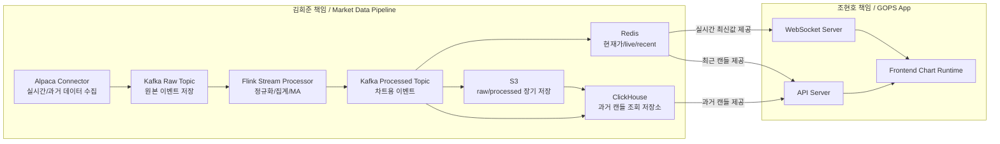

# 김희준 README - Market Data Pipeline 담당

이 문서는 김희준이 GOPS 병합 후 봐야 하는 작업 기준입니다.

김희준의 책임은 Alpaca에서 데이터를 받아 Kafka, Flink 처리, Redis, S3, ClickHouse까지 안정적으로 보내는 것입니다.

조현호의 차트 렌더링 코드는 직접 수정하지 않습니다. 조현호 코드는 Redis와 ClickHouse를 통해 김희준 데이터를 읽습니다.

## 1. 한 줄 책임

```text
Alpaca -> Kafka Raw -> Flink Processor -> Kafka Processed -> Redis/S3/ClickHouse
```

## 2. 김희준 담당 범위



## 3. 내가 주로 보는 폴더

```text
services/01-alpaca-connector/      Alpaca WebSocket, Historical REST
services/02-kafka-event-publisher/ Kafka topic 계약
services/03-flink-stream-processor/ Raw -> Processed, Redis 저장
services/04-redis-state-store/     Redis key 계약
services/05-clickhouse-store/      ClickHouse loader와 조회 저장소
services/06-s3-store/              S3 raw/processed 저장
packages/alfaka/                   실제 Python 공통 코드
infra/clickhouse/                  ClickHouse schema
docker-compose.yml                 로컬 검증 환경
```

## 4. 내가 직접 수정하지 않는 곳

```text
apps/gops-frontend/
apps/gops-frontend/src/chart/
apps/gops-frontend/src/components/ChartPanel.tsx
services/07-api-websocket/gops-backend/app/routes/charts.py
services/07-api-websocket/gops-backend/app/routes/streams.py
```

위 영역은 조현호 책임입니다.

단, `packages/alfaka/serving/`와 `services/07-api-websocket/gops-backend/app/services/alfaka_market_data.py` 같은 데이터 계약 파일은 공동 수정할 수 있습니다.

## 5. 내가 제공해야 하는 계약

Kafka Raw Topic:

```text
market.raw.bars
market.raw.updated-bars
market.raw.trades
```

Kafka Processed Topic:

```text
market.ticks.v1
market.candles.live.1m.v1
market.candles.closed.v1
```

Redis key:

```text
price:{symbol}:latest
candle:{symbol}:1m:live
candle:{symbol}:{interval}:latest
candles:{symbol}:{interval}
```

Redis Pub/Sub:

```text
market.events
market.events:{symbol}
```

ClickHouse table:

```text
market_data.trade_ticks
market_data.chart_candles
```

S3 prefix:

```text
market-data/raw/source=alpaca/channel={channel}/symbol={symbol}/...
market-data/processed/trades/symbol={symbol}/...
market-data/processed/candles/interval={interval}/symbol={symbol}/...
```

## 6. 로컬 실행

기본 인프라와 worker 실행:

```sh
docker compose up -d --build
```

Alpaca 실제 실시간 수집까지 실행:

```sh
docker compose --profile alpaca up -d --build
```

과거 데이터 백필 실행:

```sh
docker compose --profile backfill run --rm historical-backfill
```

## 7. 로컬 검증

Redis 확인:

```sh
PYTHONPATH=packages python scripts/local/check-redis.py AAPL --interval 1m
```

S3 확인:

```sh
PYTHONPATH=packages python scripts/local/check-s3.py AAPL --interval 1m
```

ClickHouse 확인:

```sh
scripts/local/check-clickhouse.sh
```

컨테이너 로그:

```sh
docker logs -f alfaka-alpaca-ingestor
docker logs -f alfaka-local-stream-processor
docker logs -f alfaka-clickhouse-loader
docker logs -f alfaka-s3-sink
```

## 8. 현재 구현된 연결

```text
packages/alfaka/storage/clickhouse_loader.py
services/05-clickhouse-store/processed_loader.py
packages/alfaka/serving/
services/07-api-websocket/chart-api/gops_provider_example.py
services/07-api-websocket/websocket-gateway/gops_stream_example.py
services/07-api-websocket/gops-backend/
apps/gops-frontend/
```

`clickhouse-loader`는 `market.ticks.v1`, `market.candles.closed.v1`을 읽어 ClickHouse에 넣습니다.

`packages/alfaka/serving/`은 조현호 GOPS backend가 Redis/ClickHouse를 읽을 때 참고할 provider adapter입니다.

## 9. GOPS와 만나는 지점

과거 데이터:

```text
ClickHouse -> 조현호 API Server -> Frontend Chart
```

실시간 데이터:

```text
Redis latest/live/PubSub -> 조현호 WebSocket Server -> Frontend Chart
```

즉, 프론트는 Alpaca, Kafka, S3를 직접 알면 안 됩니다.

## 10. 내가 병합 전에 끝내야 할 것

| 순서 | 작업 | 완료 기준 |
|---:|---|---|
| 1 | Alpaca 실시간 수집 검증 | trades/bars가 Kafka Raw로 들어감 |
| 2 | Redis 최신값 검증 | `price:{symbol}:latest`, `candle:{symbol}:1m:live` 생성 |
| 3 | ClickHouse loader 검증 | `market_data.chart_candles` row count 증가 |
| 4 | S3 processed 저장 검증 | `market-data/processed/...` 파일 생성 |
| 5 | Historical backfill 검증 | `market-data/raw/...` 파일 생성 |
| 6 | 조현호에게 provider 계약 전달 | REST/WS sample DTO 공유 |

## 11. 주의

- Alpaca API key는 코드에 넣지 않습니다.
- 로컬은 `.env`, 운영은 AWS Secrets Manager를 사용합니다.
- Kafka topic, Redis key, ClickHouse table 이름은 임의로 바꾸지 않습니다.
- 필드명을 바꿔야 하면 먼저 `README-GOPS-MERGE.md`와 `docs/gops-helix-merge-report.md`를 수정합니다.
