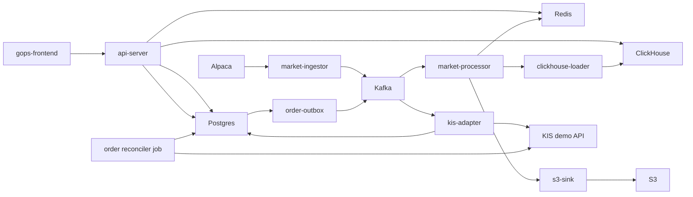

# GOPS

GOPS is a real-time market-data, chart, and order-control platform.

Product direction: **종목을 찾는 사람에게 기준을, 시장을 읽는 사람에게 방향을.**
See `docs/PRODUCT_CONTEXT.md` for the product vision. Future-facing product ideas are context, not implemented guarantees.

## Current Scope

The repository currently includes:

- React frontend and shared chart engine.
- FastAPI chart/order/WebSocket API server.
- Alpaca market-data ingest and historical backfill.
- Kafka-compatible stream processing.
- Redis, ClickHouse, and S3 market-data serving/storage.
- KIS demo order API, Postgres persistence, outbox, broker adapter, migrations, and reconciliation.
- Local Docker Compose and early AWS/EKS deployment assets.

## Read First

| File | Use |
| --- | --- |
| `docs/README.md` | Index for project reference docs. |
| `docs/PRODUCT_CONTEXT.md` | Product intent and future direction. |
| `docs/STRUCTURE_GUIDE.md` | Where new code, pods, jobs, images, and platform contracts belong. |
| `docs/ARCHITECTURE.md` | Current runtime architecture and system boundaries. |
| `docs/IMAGE_STRATEGY.md` | Docker image boundaries. |
| `docs/ENVIRONMENT.md` | Env, secret, and platform contracts. |
| `AGENTS.md` | Rules for Codex and future contributors. |

## Repository Map

```text
apps/gops-frontend/                React frontend
apps/chart-engine/                 chart document/runtime/canvas engine

systems/api-server/                FastAPI chart/order/WebSocket gateway
systems/market-data/               config, ingest, processing, storage, serving helpers, backfill
systems/order/                     KIS demo order domain, outbox, adapter, jobs

platform/kafka/topics.txt          market/order Kafka topic contract
platform/*/README.md               local -> pod -> managed-service transition notes

infra/docker/                      Dockerfiles
infra/k8s/                         Kubernetes base and AWS overlay
infra/aws/terraform/               ECR/S3/Secrets/IRSA foundation
infra/clickhouse/initdb/           local ClickHouse schema

scripts/local/                     local smoke and inspection scripts
scripts/aws/                       AWS image/topic/apply helpers
shared/chart-contract/             cross-system chart command contract notes
docs/                              project reference docs
```

## Runtime Flow



## Local Setup

First-time Docker setup should follow `docs/ONBOARDING_LOCAL_DOCKER.md`.

Create `.env` from `.env.example`.

Use one official local Python environment at the repository root:

```sh
python -m venv .venv
. .venv/bin/activate
python -m pip install --upgrade pip
python -m pip install -r requirements-dev.txt
python --version
```

The expected local Python version is `3.12.x`. Do not create duplicate project virtualenvs under `/tmp` or other ad hoc paths.

For AWS-backed local work, leave `S3_ENDPOINT_URL` and `DOCKER_S3_ENDPOINT_URL` empty and use:

```text
ALPACA_SECRET_NAME=dev/alpaca
S3_BUCKET=gops-market-data-<aws-account-id>-ap-northeast-2-an
AWS_REGION=ap-northeast-2
AWS_ACCESS_KEY_ID=<local restricted key if needed>
AWS_SECRET_ACCESS_KEY=<local restricted secret if needed>
AWS_SESSION_TOKEN=
```

Start the local stack:

```sh
docker compose --env-file .env up -d --build
```

Open:

```text
Frontend: http://localhost:5173
Backend:  http://localhost:8000/health
Symbols:  http://localhost:8000/api/charts/symbols
Candles:  http://localhost:8000/api/charts/candles?symbol=AAPL&interval=1m&limit=160
```

Start live Alpaca ingestion only when needed:

```sh
docker compose --profile alpaca up -d --build alpaca-ingestor
```

The live ingestor is profile-gated so normal UI/backend work does not automatically open Alpaca WebSocket sessions.

## API Contract

Chart API:

```text
GET  /api/charts/candles
POST /api/charts/backfill
GET  /api/charts/backfill/status
GET  /api/charts/symbols
WS   /ws/charts
```

Order API:

```text
GET  /api/order-contract
POST /api/orders
GET  /api/orders/{order_id}
GET  /api/orders/{order_id}/events
WS   /ws/orders/{order_id}
```

Order rules:

- `POST /api/orders` requires the `Idempotency-Key` header.
- `KIS_ENV=real` is disabled for v1. Use demo/fake local flow unless the release policy changes.

Auth rules:

- Set `AUTH_ENABLED=true` to require Google login for `/api/orders`, `/ws/orders/{order_id}`, and `/api/llm/*`.
- Chart and market-data APIs remain public in v1.
- Sessions are stored in Redis and scoped by `AUTH_REDIS_KEY_PREFIX`.

## Operating Rules

- Chart API serves from Redis and ClickHouse, not directly from S3.
- S3 is durable replay/rematerialization storage.
- ClickHouse `chart_candles` is the serving projection.
- Local runtime must not invent fake market candles.
- `.env`, access-key CSV files, KIS token caches, `node_modules`, `dist`, and local caches must not be committed.

## Verification

Run the relevant checks before sharing changes:

```sh
PYTHONPATH=systems/market-data/shared:systems/order/shared:systems/order:systems/api-server/pods/api-server/gops-backend python -m compileall -q systems
PYTHONPATH=systems/market-data/shared:systems/order/shared:systems/order:systems/api-server/pods/api-server/gops-backend python -m unittest discover systems/market-data/tests
PYTHONPATH=systems/market-data/shared:systems/order/shared:systems/order:systems/api-server/pods/api-server/gops-backend python -m unittest discover systems/api-server/tests
PYTHONPATH=systems/market-data/shared:systems/order/shared:systems/order:systems/api-server/pods/api-server/gops-backend python -m pytest systems/order/tests/kis_trader
npm run test:chart --prefix apps/gops-frontend
npm run build --prefix apps/gops-frontend
docker compose config --quiet
kubectl kustomize infra/k8s/base >/tmp/gops-k8s-base.yaml
kubectl kustomize infra/k8s/overlays/aws >/tmp/gops-k8s-aws.yaml
git diff --check
```

Runtime smoke:

```sh
curl -fsS http://localhost:8000/health
curl -fsS http://localhost:8000/api/charts/symbols
curl -fsS 'http://localhost:8000/api/charts/candles?symbol=NVDA&interval=1m&limit=2'
curl -fsS http://localhost:8000/api/order-contract
```
