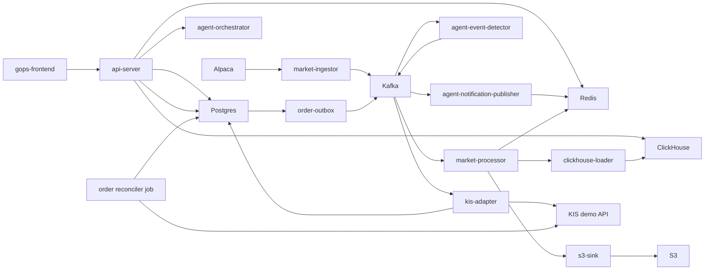

# GOPS

GOPS is a real-time market-data, chart, and order-control platform.

Product direction: **종목을 찾는 사람에게 기준을, 시장을 읽는 사람에게 방향을.**
See `docs/AGENT_ARCHITECTURE.md` for the current agent direction and handoff boundaries. Future-facing product ideas are context, not implemented guarantees.

## Current Scope

The repository currently includes:

- React frontend and shared chart engine.
- FastAPI chart/order/WebSocket API server.
- Alpaca market-data ingest and on-demand historical fill.
- Kafka-compatible stream processing.
- Redis, ClickHouse, and S3 market-data serving/storage.
- KIS demo order API, Postgres persistence, outbox, broker adapter, migrations, and reconciliation.
- Agent-orchestration v1 with role-agent skeletons, market-event detection, and notification publishing.
- Local Docker Compose and early AWS/EKS deployment assets.

## Read First

| File | Use |
| --- | --- |
| `docs/README.md` | Index for agent handoff docs. |
| `docs/AGENT_ARCHITECTURE.md` | Agent runtime, provider boundary, snapshots, synthesis, and report contracts. |
| `docs/AGENT_BACKEND_INTEGRATION.md` | Agent API, idempotency, Kafka async path, Redis report store, polling, SSE, and alert WebSocket contracts. |
| `docs/AGENT_FRONTEND_INTEGRATION.md` | Agent chat submit, `analysisId`, report rendering, and layout/chart proposal handling. |
| `docs/AGENT_AWS_BUILD.md` | Agent image, EKS resources, Kafka, Redis/Valkey, ClickHouse, GraphDB, S3, secrets, and smoke checks. |
| `AGENTS.md` | Rules for Codex and future contributors. |

## Repository Map

```text
apps/gops-frontend/                React frontend
apps/chart-engine/                 chart document/runtime/canvas engine

systems/api-server/                FastAPI chart/order/WebSocket gateway
systems/market-data/               config, ingest, processing, storage, serving helpers, on-demand fill
systems/order/                     KIS demo order domain, outbox, adapter, jobs
systems/agent-orchestration/       role agents, event detector, notification publisher

platform/kafka/topics.txt          market/order Kafka topic contract
platform/*/README.md               local -> pod -> managed-service transition notes

infra/docker/                      Dockerfiles
infra/k8s/                         Kubernetes base and AWS overlay
infra/aws/terraform/               ECR/S3/Secrets/IRSA foundation
infra/clickhouse/initdb/           local ClickHouse schema

scripts/local/                     local smoke and inspection scripts
scripts/aws/                       AWS image/topic/apply helpers
shared/chart-contract/             cross-system chart command contract notes
docs/                              project reference docs
```

## Runtime Flow



## Local Setup

### `backup` branch usage and data boundary

This `backup` branch contains the complete application source and recovery
scripts, but it deliberately does **not** include the portable data backup,
`.env`, AWS credentials, API keys, token caches, or any other secret material.
Keep the private portable backup outside the repository and point the restore
script at it only on your own machine.

There are two ways to run GOPS locally:

| Goal | What you need |
| --- | --- |
| Open the application code and UI | Docker Desktop and a local `.env`; no AWS account is required. |
| Replay the preserved market-data simulation | The private portable backup in addition to Docker Desktop. The replay data is large, so reserve at least 25 GB of free Docker disk space. |

The commands below assume this repository is already checked out on the
`backup` branch.

### 1. Prepare the local environment

Create `.env` from `.env.example`.

```sh
cp .env.example .env
```

For an isolated local run, edit the uncommitted `.env` and keep real service
credentials empty. These values make the browser use the local Docker
simulator, allow simulator controls without a Google login, and keep the app
away from AWS/Alpaca/KIS/OpenAI:

```text
AUTH_ENABLED=false
SIMULATOR_LOCAL_CONTROL_ENABLED=true
SIM_AUTH_MODE=off
GOPS_SIMULATOR_URL=http://gops-simulator:8765

AWS_EC2_METADATA_DISABLED=true
AWS_ACCESS_KEY_ID=
AWS_SECRET_ACCESS_KEY=
AWS_SESSION_TOKEN=
ALPACA_CREDENTIAL_SOURCE=local-env
ALPACA_SECRET_NAME=
APCA_API_KEY_ID=
APCA_API_SECRET_KEY=
KIS_ENV=demo
KIS_CREDENTIAL_SOURCE=local-env
KIS_DEMO_APP_KEY=
KIS_DEMO_APP_SECRET=
KIS_DEMO_ACCOUNT_NO=
OPENAI_API_KEY=
AGENT_FINAL_ANSWER_PROVIDER=disabled
AGENT_FINANCIAL_FINAL_ANSWER_PROVIDER=disabled
CHART_COMMENTARY_PROVIDER=disabled

DOCKER_S3_ENDPOINT_URL=http://minio:9000
S3_ACCESS_KEY_ID=minioadmin
S3_SECRET_ACCESS_KEY=minioadmin
S3_BUCKET=gops-local
POSTGRES_PASSWORD=gops_dev_password
```

`AUTH_ENABLED=false` means this is suitable only for a private machine. Do not
expose its ports to a shared network or deploy these local-only values to AWS.

### 2. Start a fresh local stack

This starts the frontend, API, database containers, local MinIO object storage,
and the replay simulator container. It does not download data from AWS.

```sh
docker compose --env-file .env --profile local-s3 --profile simulator up -d --build
```

Open the frontend at http://localhost:5173. The key local endpoints are:

```text
Frontend:    http://localhost:5173
Backend:     http://localhost:8000/health
Agent API:   http://localhost:8100/health
Simulator:   http://localhost:8765/health
```

Without a private data backup, the application starts but historical market
candles and replay simulation data are intentionally empty. The project never
generates fake market data to fill this gap.

### 3. Restore the private replay backup (optional)

Use this only when you have the private portable backup created for this
project. The backup ZIP is about 10 GB and is not part of this public branch.
The script restores only four local ClickHouse tables required by simulation:
the replay dataset metadata, replay events, replay candles, and canonical chart
candles used as the previous-close baseline. It verifies the ZIP SHA-256 before
making any changes.

First start ClickHouse by itself, then give the script the private backup root:

```sh
docker compose --env-file .env --profile local-s3 up -d clickhouse
GOPS_PORTABLE_BACKUP_ROOT="/absolute/path/to/aws-portable-backup/20260727T030132Z" \
  scripts/local/restore-simulator-backup.sh --execute
```

The restore replaces those four **local** ClickHouse tables. If the full app is
already running, stop the API and simulation matcher first so they do not read
the tables during replacement:

```sh
docker compose --env-file .env --profile local-s3 --profile simulator \
  stop gops-backend simulation-paper-matcher
```

After a successful restore, start or refresh the full local stack:

```sh
docker compose --env-file .env --profile local-s3 --profile simulator up -d --build
```

### 4. Run the simulation without login

With the local-only `.env` values above, no Google account or simulator operator
account is needed. Use the SIM control in the frontend header to start, pause,
resume, restart, or change the replay speed.

You can also verify the API directly. The status response should contain
`"available": true` and `"canControl": true`:

```sh
curl -fsS http://localhost:8000/api/simulator/status
curl -fsS -X POST http://localhost:8000/api/simulator/action \
  -H 'Content-Type: application/json' \
  -d '{"action":"start"}'
```

The replay always uses the preserved dataset timeline. Paper orders made during
SIM are stored only in the local PostgreSQL container; they do not call KIS or
place real orders.

### 5. Stop or reset local services

Stop containers while keeping local data volumes:

```sh
docker compose --env-file .env --profile local-s3 --profile simulator stop
```

Remove containers and networks while keeping volumes:

```sh
docker compose --env-file .env --profile local-s3 --profile simulator down
```

To start again, rerun the command from step 2. Do not run `down --volumes`
unless you intentionally want to delete all local databases and restore the
private replay backup again.

### 6. Local troubleshooting

| Symptom | What to check |
| --- | --- |
| `gops-simulator` is unavailable | Confirm `docker compose ... ps` shows both `clickhouse` and `gops-simulator` as healthy. Then check `docker compose ... logs --tail=120 gops-simulator`. |
| Replay says the dataset is not ready | Run the private backup restore from step 3, then recreate the simulator with `docker compose --env-file .env --profile local-s3 --profile simulator up -d --force-recreate gops-simulator`. |
| Restore rejects the backup | Check that `GOPS_PORTABLE_BACKUP_ROOT` points to the directory containing `data/clickhouse/gops-market-data-20260727T030132Z.zip` and its `SHA256SUMS.txt`. Never bypass the checksum failure. |
| Docker runs out of space | Free Docker disk space and retry. The ClickHouse archive and restored tables need significant local storage. |
| Port is already in use | Stop the conflicting process or Docker container for ports `5173`, `8000`, `8100`, `8123`, `8765`, `9000`, `9092`, `6379`, or `5433`. |

### Development-only Python environment

Use one official local Python environment at the repository root:

```sh
python -m venv .venv
. .venv/bin/activate
python -m pip install --upgrade pip
python -m pip install -r requirements-dev.txt
python --version
```

The expected local Python version is `3.12.x`. Do not create duplicate project virtualenvs under `/tmp` or other ad hoc paths.

### AWS-connected local runtime (advanced)

This is an alternative to the isolated local setup above. It can use real AWS
S3 and credentials, so do not combine it with the local-only backup simulator
settings or expose credentials in `.env`.

For AWS-backed local work, leave `S3_ENDPOINT_URL` and `DOCKER_S3_ENDPOINT_URL` empty and use:

```text
ALPACA_SECRET_NAME=dev/alpaca
S3_BUCKET=gops-market-data-<aws-account-id>-ap-northeast-2-an
AWS_REGION=ap-northeast-2
AWS_ACCESS_KEY_ID=<local restricted key if needed>
AWS_SECRET_ACCESS_KEY=<local restricted secret if needed>
AWS_SESSION_TOKEN=
```

Start this AWS-connected local stack:

```sh
docker compose --env-file .env up -d --build
```

Open:

```text
Frontend: http://localhost:5173
Backend:  http://localhost:8000/health
Agents:   http://localhost:8100/health
Symbols:  http://localhost:8000/api/charts/symbols
Candles:  http://localhost:8000/api/charts/candles?symbol=AAPL&interval=1m&limit=160
```

Start live Alpaca ingestion only when needed:

```sh
docker compose --profile alpaca up -d --build alpaca-ingestor
```

The live ingestor is profile-gated so normal UI/backend work does not automatically open Alpaca WebSocket sessions.

## API Contract

Chart API:

```text
GET  /api/charts/candles
GET  /api/charts/symbols
WS   /ws/charts
```

Deprecated chart backfill queue routes return `410 Gone`. `GET /api/charts/candles`
is the single chart read/fill entrypoint and includes a `fill` trace when data is
missing or partially filled.

Agent API:

```text
POST /api/agents/analyze
GET  /api/agents/reports/{analysis_id}
GET  /api/agents/reports/{analysis_id}/stream
WS   /ws/agent-alerts
```

Order API:

```text
GET  /api/order-contract
GET  /api/orders/balance
POST /api/orders
GET  /api/orders/{order_id}
GET  /api/orders/{order_id}/events
WS   /ws/orders/{order_id}
```

Order rules:

- `POST /api/orders` requires the `Idempotency-Key` header.
- `GET /api/orders/balance` queries KIS demo overseas orderable cash for the selected symbol/exchange.
- `KIS_ENV=real` is disabled for v1.
- v1 order submit supports KIS overseas demo limit orders only.
- KIS demo credentials are read from AWS Secrets Manager `tead/gops/kis` by default.

Auth rules:

- Set `AUTH_ENABLED=true` to require Google login for `/api/orders`, `/ws/orders/{order_id}`, and `/api/llm/*`.
- Chart and market-data APIs remain public in v1.
- Sessions are stored in Redis and scoped by `AUTH_REDIS_KEY_PREFIX`.
- Google OAuth env values are read directly first; when they are empty, set `GOOGLE_OAUTH_SECRET_NAME` to read them from AWS Secrets Manager.

## Operating Rules

- Chart API serves from Redis and ClickHouse, not directly from S3.
- S3 is durable replay/rematerialization storage.
- ClickHouse `chart_candles` is the serving projection.
- Local runtime must not invent fake market candles.
- Agent-orchestration must not execute orders or call account-control flows.
- Agent provider failures should degrade to no-data evidence instead of crashing the whole analysis path.
- `.env`, access-key CSV files, KIS token caches, `node_modules`, `dist`, and local caches must not be committed.

## Verification

Run the relevant checks before sharing changes:

```sh
PYTHONPATH=systems/market-data/shared:systems/order/shared:systems/order:systems/api-server/pods/api-server/gops-backend python -m compileall -q systems
PYTHONPATH=systems/market-data/shared:systems/order/shared:systems/order:systems/api-server/pods/api-server/gops-backend python -m unittest discover systems/market-data/tests
PYTHONPATH=systems/market-data/shared:systems/order/shared:systems/order:systems/api-server/pods/api-server/gops-backend python -m unittest discover systems/api-server/tests
PYTHONPATH=systems/market-data/shared:systems/order/shared:systems/order:systems/api-server/pods/api-server/gops-backend python -m pytest systems/order/tests/kis_trader
npm run test:chart --prefix apps/gops-frontend
npm run build --prefix apps/gops-frontend
docker compose config --quiet
kubectl kustomize infra/k8s/base >/tmp/gops-k8s-base.yaml
kubectl kustomize infra/k8s/overlays/aws >/tmp/gops-k8s-aws.yaml
git diff --check
```

Runtime smoke:

```sh
curl -fsS http://localhost:8000/health
curl -fsS http://localhost:8000/api/charts/symbols
curl -fsS 'http://localhost:8000/api/charts/candles?symbol=NVDA&interval=1m&limit=2'
curl -fsS http://localhost:8000/api/order-contract
curl -fsS 'http://localhost:8000/api/orders/balance?symbol=NVDA&exchange=NASD&price=1.00'
```
