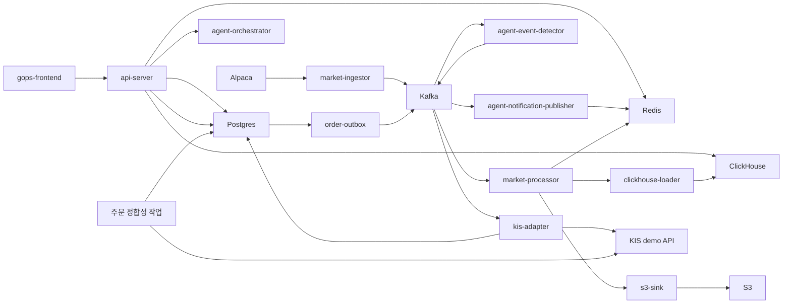

# GOPS

GOPS는 실시간 시장 데이터, 차트, 주문 제어 기능을 제공하는 플랫폼이다.

현재 에이전트의 방향과 책임 경계는 `docs/AGENT_ARCHITECTURE.md`에서 확인할 수 있다.
미래 제품 아이디어는 방향을 설명하는 참고 사항이며, 이미 구현된 기능을 보장하지 않는다.

## 현재 범위

이 저장소에는 현재 다음 구성 요소가 포함되어 있다.

- React 프론트엔드와 공용 차트 엔진
- FastAPI 기반 차트·주문·WebSocket API 서버
- Alpaca 시장 데이터 수집과 필요 시 실행하는 과거 데이터 보충
- Kafka 호환 스트림 처리
- Redis, ClickHouse, S3 기반 시장 데이터 조회·저장
- KIS 모의투자 주문 API, PostgreSQL 영속화, Outbox, 브로커 어댑터, 마이그레이션, 정합성 확인
- 역할별 에이전트 골격, 시장 이벤트 감지, 알림 발행을 포함한 에이전트 오케스트레이션 v1
- 로컬 Docker Compose와 AWS/EKS 배포 구성

## 먼저 읽을 문서

| 파일 | 용도 |
| --- | --- |
| `docs/README.md` | 에이전트 인수인계 문서 색인 |
| `docs/AGENT_ARCHITECTURE.md` | 에이전트 런타임, 제공자 경계, 스냅샷, 종합 분석, 리포트 계약 |
| `docs/AGENT_BACKEND_INTEGRATION.md` | 에이전트 API, 멱등성, Kafka 비동기 처리, Redis 리포트 저장소, 폴링, SSE, 알림 WebSocket 계약 |
| `docs/AGENT_FRONTEND_INTEGRATION.md` | 에이전트 채팅 제출, `analysisId`, 리포트 표시, 레이아웃·차트 제안 처리 |
| `docs/AGENT_AWS_BUILD.md` | 에이전트 이미지, EKS 리소스, Kafka, Redis/Valkey, ClickHouse, GraphDB, S3, 비밀값, 스모크 검사 |
| `AGENTS.md` | Codex와 이후 기여자가 따라야 할 규칙 |

## 저장소 구조

```text
apps/gops-frontend/                React 프론트엔드
apps/chart-engine/                 차트 문서·런타임·캔버스 엔진

systems/api-server/                FastAPI 차트·주문·WebSocket 게이트웨이
systems/market-data/               설정, 수집, 처리, 저장, 조회 도우미, 필요 시 데이터 보충
systems/order/                     KIS 모의투자 주문 도메인, Outbox, 어댑터, 작업
systems/agent-orchestration/       역할별 에이전트, 이벤트 감지기, 알림 발행기

platform/kafka/topics.txt          시장·주문 Kafka 토픽 계약
platform/*/README.md               로컬 -> Pod -> 관리형 서비스 전환 설명

infra/docker/                      Dockerfile 모음
infra/k8s/                         Kubernetes 기본 구성과 AWS 오버레이
infra/aws/terraform/               ECR·S3·Secrets·IRSA 기반 구성
infra/clickhouse/initdb/           로컬 ClickHouse 스키마

scripts/local/                     로컬 스모크 검사·점검 스크립트
scripts/aws/                       AWS 이미지·토픽·적용 도우미
shared/chart-contract/             시스템 간 차트 명령 계약 설명
docs/                              프로젝트 참고 문서
```

## 런타임 흐름



## 로컬 실행

### `backup` 브랜치 사용법과 데이터 경계

이 `backup` 브랜치에는 전체 애플리케이션 소스 코드와 복구 스크립트가 들어 있습니다.
다만 이동식 데이터 백업, `.env`, AWS 자격 증명, API 키, 토큰 캐시와 같은 비밀값은
의도적으로 포함하지 않습니다. 비공개 이동식 백업은 저장소 밖의 안전한 위치에 보관하고,
복원 스크립트는 개인 컴퓨터에서만 실행하세요.

GOPS를 로컬에서 실행하는 방법은 두 가지입니다.

| 목적 | 필요한 것 |
| --- | --- |
| 애플리케이션 코드와 UI 열기 | Docker Desktop과 로컬 `.env`만 필요합니다. AWS 계정은 필요하지 않습니다. |
| 보존된 시장 데이터 시뮬레이션 재생 | Docker Desktop과 비공개 이동식 백업이 필요합니다. 재생 데이터가 크므로 Docker 디스크 여유 공간을 최소 25GB 확보하세요. |

아래 명령은 이 저장소를 `backup` 브랜치로 체크아웃한 상태를 기준으로 합니다.

### 1. 로컬 환경 준비

`.env.example`을 복사해 `.env`를 만듭니다.

```sh
cp .env.example .env
```

외부 서비스와 분리된 로컬 실행을 위해, Git에 포함되지 않는 `.env`를 수정하고 실제
서비스 자격 증명은 비워 둡니다. 아래 값은 브라우저가 로컬 Docker 시뮬레이터를 사용하게
하고, Google 로그인 없이 시뮬레이터를 제어하게 하며, AWS·Alpaca·KIS·OpenAI 호출을
막습니다.

```text
AUTH_ENABLED=false
SIMULATOR_LOCAL_CONTROL_ENABLED=true
SIM_AUTH_MODE=off
GOPS_SIMULATOR_URL=http://gops-simulator:8765

AWS_EC2_METADATA_DISABLED=true
AWS_ACCESS_KEY_ID=
AWS_SECRET_ACCESS_KEY=
AWS_SESSION_TOKEN=
ALPACA_CREDENTIAL_SOURCE=local-env
ALPACA_SECRET_NAME=
APCA_API_KEY_ID=
APCA_API_SECRET_KEY=
KIS_ENV=demo
KIS_CREDENTIAL_SOURCE=local-env
KIS_DEMO_APP_KEY=
KIS_DEMO_APP_SECRET=
KIS_DEMO_ACCOUNT_NO=
OPENAI_API_KEY=
AGENT_FINAL_ANSWER_PROVIDER=disabled
AGENT_FINANCIAL_FINAL_ANSWER_PROVIDER=disabled
CHART_COMMENTARY_PROVIDER=disabled

DOCKER_S3_ENDPOINT_URL=http://minio:9000
S3_ACCESS_KEY_ID=minioadmin
S3_SECRET_ACCESS_KEY=minioadmin
S3_BUCKET=gops-local
POSTGRES_PASSWORD=gops_dev_password
```

`AUTH_ENABLED=false` 설정은 개인 컴퓨터에서만 사용해야 합니다. 포트를 공유 네트워크에
노출하거나 이 로컬 전용 값을 AWS에 배포하지 마세요.

### 2. 새 로컬 스택 실행

이 명령은 프론트엔드, API, 데이터베이스 컨테이너, 로컬 MinIO 객체 저장소, 재생
시뮬레이터 컨테이너를 실행합니다. AWS에서 데이터를 내려받지 않습니다.

```sh
docker compose --env-file .env --profile local-s3 --profile simulator up -d --build
```

프론트엔드는 http://localhost:5173 에서 엽니다. 주요 로컬 주소는 다음과 같습니다.

```text
프론트엔드:     http://localhost:5173
백엔드:         http://localhost:8000/health
에이전트 API:   http://localhost:8100/health
시뮬레이터:     http://localhost:8765/health
```

비공개 데이터 백업이 없더라도 애플리케이션은 실행되지만, 과거 시장 캔들과 재생
시뮬레이션 데이터는 비어 있습니다. 이 프로젝트는 부족한 데이터를 채우기 위해 가짜
시장 데이터를 만들지 않습니다.

### 3. 비공개 재생 백업 복원 (선택)

이 프로젝트를 위해 만든 비공개 이동식 백업이 있을 때만 사용하세요. 백업 ZIP은 약
10GB이며 공개 브랜치에는 포함되지 않습니다. 스크립트는 시뮬레이션에 필요한 로컬
ClickHouse 테이블 네 개만 복원합니다. 재생 데이터셋 메타데이터, 재생 이벤트, 재생
캔들, 그리고 전일 종가 기준값으로 쓰이는 정규 차트 캔들이 대상입니다. 변경 전에
ZIP의 SHA-256을 검증합니다.

먼저 ClickHouse만 실행한 뒤, 스크립트에 비공개 백업 루트 경로를 전달합니다.

```sh
docker compose --env-file .env --profile local-s3 up -d clickhouse
GOPS_PORTABLE_BACKUP_ROOT="/absolute/path/to/aws-portable-backup/20260727T030132Z" \
  scripts/local/restore-simulator-backup.sh --execute
```

복원은 위 네 개의 **로컬** ClickHouse 테이블을 교체합니다. 전체 앱이 이미 실행 중이면,
테이블 교체 중 읽기가 발생하지 않도록 API와 시뮬레이션 매처를 먼저 중지하세요.

```sh
docker compose --env-file .env --profile local-s3 --profile simulator \
  stop gops-backend simulation-paper-matcher
```

복원이 성공하면 전체 로컬 스택을 실행하거나 새로고침합니다.

```sh
docker compose --env-file .env --profile local-s3 --profile simulator up -d --build
```

### 4. 로그인 없이 시뮬레이션 실행

위 로컬 전용 `.env` 값을 사용하면 Google 계정이나 시뮬레이터 운영자 계정이 필요하지
않습니다. 프론트엔드 헤더의 SIM 제어 영역에서 재생을 시작·일시정지·재개·재시작하거나
속도를 바꿀 수 있습니다.

API를 직접 확인할 수도 있습니다. 상태 응답에는 `"available": true`와
`"canControl": true`가 포함되어야 합니다.

```sh
curl -fsS http://localhost:8000/api/simulator/status
curl -fsS -X POST http://localhost:8000/api/simulator/action \
  -H 'Content-Type: application/json' \
  -d '{"action":"start"}'
```

재생은 항상 보존된 데이터셋의 시간 흐름을 사용합니다. SIM 중 생성한 모의 주문은
로컬 PostgreSQL 컨테이너에만 저장되며, KIS를 호출하거나 실제 주문을 내지 않습니다.

### 5. 로컬 서비스 중지 또는 초기화

로컬 데이터 볼륨을 유지한 채 컨테이너만 중지합니다.

```sh
docker compose --env-file .env --profile local-s3 --profile simulator stop
```

볼륨을 유지한 채 컨테이너와 네트워크를 제거합니다.

```sh
docker compose --env-file .env --profile local-s3 --profile simulator down
```

다시 시작하려면 2단계 명령을 다시 실행하세요. 모든 로컬 데이터베이스를 삭제하고
비공개 재생 백업을 다시 복원하려는 경우가 아니라면 `down --volumes`를 실행하지 마세요.

### 6. 로컬 문제 해결

| 증상 | 확인할 내용 |
| --- | --- |
| `gops-simulator`를 사용할 수 없음 | `docker compose ... ps`에서 `clickhouse`와 `gops-simulator`가 모두 healthy인지 확인합니다. 이어서 `docker compose ... logs --tail=120 gops-simulator`를 확인하세요. |
| 재생 데이터셋이 준비되지 않았다는 메시지 | 3단계의 비공개 백업 복원을 실행한 뒤, `docker compose --env-file .env --profile local-s3 --profile simulator up -d --force-recreate gops-simulator`로 시뮬레이터를 다시 만드세요. |
| 복원에서 백업을 거부함 | `GOPS_PORTABLE_BACKUP_ROOT`가 `data/clickhouse/gops-market-data-20260727T030132Z.zip`과 `SHA256SUMS.txt`를 포함한 경로를 가리키는지 확인합니다. 체크섬 실패를 우회하지 마세요. |
| Docker 디스크 공간 부족 | Docker 디스크 공간을 비운 뒤 다시 시도하세요. ClickHouse 아카이브와 복원된 테이블에는 상당한 로컬 저장 공간이 필요합니다. |
| 포트가 이미 사용 중 | `5173`, `8000`, `8100`, `8123`, `8765`, `9000`, `9092`, `6379`, `5433` 중 충돌한 포트를 사용하는 프로세스나 Docker 컨테이너를 중지하세요. |

### 개발용 Python 환경

저장소 루트에 공식 로컬 Python 가상환경 하나만 사용합니다.

```sh
python -m venv .venv
. .venv/bin/activate
python -m pip install --upgrade pip
python -m pip install -r requirements-dev.txt
python --version
```

로컬 Python 버전은 `3.12.x`를 사용합니다. `/tmp`나 임시 경로에 중복 프로젝트 가상환경을 만들지 마세요.

### AWS 연결 로컬 실행 (고급)

이 설정은 위의 분리된 로컬 실행 방식과 다른 대안입니다. 실제 AWS S3와 자격 증명을
사용할 수 있으므로, 로컬 전용 백업 시뮬레이터 설정과 섞지 말고 자격 증명을 `.env`에
노출하지 마세요.

AWS를 연결한 로컬 작업에서는 `S3_ENDPOINT_URL`과 `DOCKER_S3_ENDPOINT_URL`을 비워 두고 아래 값을 사용합니다.

```text
ALPACA_SECRET_NAME=dev/alpaca
S3_BUCKET=gops-market-data-<aws-account-id>-ap-northeast-2-an
AWS_REGION=ap-northeast-2
AWS_ACCESS_KEY_ID=<필요한 경우 제한된 로컬 키>
AWS_SECRET_ACCESS_KEY=<필요한 경우 제한된 로컬 비밀키>
AWS_SESSION_TOKEN=
```

이 AWS 연결 로컬 스택을 실행합니다.

```sh
docker compose --env-file .env up -d --build
```

접속 주소:

```text
프론트엔드: http://localhost:5173
백엔드:     http://localhost:8000/health
에이전트:   http://localhost:8100/health
종목 목록:  http://localhost:8000/api/charts/symbols
캔들:       http://localhost:8000/api/charts/candles?symbol=AAPL&interval=1m&limit=160
```

실시간 Alpaca 수집은 필요할 때만 실행합니다.

```sh
docker compose --profile alpaca up -d --build alpaca-ingestor
```

실시간 수집기는 profile로 분리되어 있으므로, 일반 UI·백엔드 작업에서 Alpaca WebSocket 세션을 자동으로 열지 않습니다.

## API 계약

차트 API:

```text
GET  /api/charts/candles
GET  /api/charts/symbols
WS   /ws/charts
```

사용 중단된 차트 백필 큐 경로는 `410 Gone`을 반환한다. `GET /api/charts/candles`는
차트를 조회하고 누락 데이터를 보충하는 단일 진입점이며, 데이터가 없거나 일부만 채워진
경우 응답에 `fill` 추적 정보를 포함한다.

에이전트 API:

```text
POST /api/agents/analyze
GET  /api/agents/reports/{analysis_id}
GET  /api/agents/reports/{analysis_id}/stream
WS   /ws/agent-alerts
```

주문 API:

```text
GET  /api/order-contract
GET  /api/orders/balance
POST /api/orders
GET  /api/orders/{order_id}
GET  /api/orders/{order_id}/events
WS   /ws/orders/{order_id}
```

주문 규칙:

- `POST /api/orders`는 `Idempotency-Key` 헤더가 반드시 필요하다.
- `GET /api/orders/balance`는 선택한 종목과 거래소를 기준으로 KIS 모의투자 해외주식 주문 가능 금액을 조회한다.
- v1에서는 `KIS_ENV=real`을 사용할 수 없다.
- v1 주문 제출은 KIS 해외주식 모의투자 지정가 주문만 지원한다.
- KIS 모의투자 자격 증명은 기본적으로 AWS Secrets Manager의 `tead/gops/kis`에서 읽는다.

인증 규칙:

- `AUTH_ENABLED=true`로 설정하면 `/api/orders`, `/ws/orders/{order_id}`, `/api/llm/*`에서 Google 로그인을 요구한다.
- v1에서 차트와 시장 데이터 API는 공개 상태를 유지한다.
- 세션은 Redis에 저장되며 `AUTH_REDIS_KEY_PREFIX`로 범위를 분리한다.
- Google OAuth 환경 변수를 먼저 직접 읽고, 값이 비어 있으면 `GOOGLE_OAUTH_SECRET_NAME`에 지정한 AWS Secrets Manager 비밀값에서 읽는다.

## 운영 규칙

- 차트 API는 S3를 직접 읽지 않고 Redis와 ClickHouse에서 응답한다.
- S3는 재생과 재구성을 위한 영구 저장소다.
- ClickHouse의 `chart_candles`가 조회용 프로젝션이다.
- 로컬 런타임은 가짜 시장 캔들을 만들면 안 된다.
- 에이전트 오케스트레이션은 주문을 실행하거나 계좌 제어 흐름을 호출하면 안 된다.
- 에이전트 제공자 호출이 실패하면 전체 분석을 중단하지 않고 데이터 없음 근거로 안전하게 축소해야 한다.
- `.env`, 액세스 키 CSV, KIS 토큰 캐시, `node_modules`, `dist`, 로컬 캐시는 커밋하면 안 된다.

## 검증

변경 사항을 공유하기 전에 관련 검사를 실행한다.

```sh
PYTHONPATH=systems/market-data/shared:systems/order/shared:systems/order:systems/api-server/pods/api-server/gops-backend python -m compileall -q systems
PYTHONPATH=systems/market-data/shared:systems/order/shared:systems/order:systems/api-server/pods/api-server/gops-backend python -m unittest discover systems/market-data/tests
PYTHONPATH=systems/market-data/shared:systems/order/shared:systems/order:systems/api-server/pods/api-server/gops-backend python -m unittest discover systems/api-server/tests
PYTHONPATH=systems/market-data/shared:systems/order/shared:systems/order:systems/api-server/pods/api-server/gops-backend python -m pytest systems/order/tests/kis_trader
npm run test:chart --prefix apps/gops-frontend
npm run build --prefix apps/gops-frontend
docker compose config --quiet
kubectl kustomize infra/k8s/base >/tmp/gops-k8s-base.yaml
kubectl kustomize infra/k8s/overlays/aws >/tmp/gops-k8s-aws.yaml
git diff --check
```

실행 중인 서비스의 스모크 검사:

```sh
curl -fsS http://localhost:8000/health
curl -fsS http://localhost:8000/api/charts/symbols
curl -fsS 'http://localhost:8000/api/charts/candles?symbol=NVDA&interval=1m&limit=2'
curl -fsS http://localhost:8000/api/order-contract
curl -fsS 'http://localhost:8000/api/orders/balance?symbol=NVDA&exchange=NASD&price=1.00'
```
