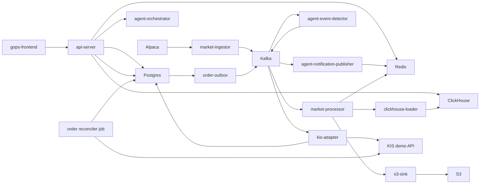

# GOPS

GOPS is a real-time market-data, chart, and order-control platform.

See `docs/AGENT_ARCHITECTURE.md` for the current agent direction and handoff boundaries. Future-facing product ideas are context, not implemented guarantees.

## Current Scope

The repository currently includes:

- React frontend and shared chart engine.
- FastAPI chart/order/WebSocket API server.
- Alpaca market-data ingest and on-demand historical fill.
- Kafka-compatible stream processing.
- Redis, ClickHouse, and S3 market-data serving/storage.
- KIS demo order API, Postgres persistence, outbox, broker adapter, migrations, and reconciliation.
- Agent-orchestration v1 with role-agent skeletons, market-event detection, and notification publishing.
- Local Docker Compose and early AWS/EKS deployment assets.

## Read First

| File | Use |
| --- | --- |
| `docs/README.md` | Index for agent handoff docs. |
| `docs/AGENT_ARCHITECTURE.md` | Agent runtime, provider boundary, snapshots, synthesis, and report contracts. |
| `docs/AGENT_BACKEND_INTEGRATION.md` | Agent API, idempotency, Kafka async path, Redis report store, polling, SSE, and alert WebSocket contracts. |
| `docs/AGENT_FRONTEND_INTEGRATION.md` | Agent chat submit, `analysisId`, report rendering, and layout/chart proposal handling. |
| `docs/AGENT_AWS_BUILD.md` | Agent image, EKS resources, Kafka, Redis/Valkey, ClickHouse, GraphDB, S3, secrets, and smoke checks. |
| `AGENTS.md` | Rules for Codex and future contributors. |

## Repository Map

```text
apps/gops-frontend/                React frontend
apps/chart-engine/                 chart document/runtime/canvas engine

systems/api-server/                FastAPI chart/order/WebSocket gateway
systems/market-data/               config, ingest, processing, storage, serving helpers, on-demand fill
systems/order/                     KIS demo order domain, outbox, adapter, jobs
systems/agent-orchestration/       role agents, event detector, notification publisher

platform/kafka/topics.txt          market/order Kafka topic contract
platform/*/README.md               local -> pod -> managed-service transition notes

infra/docker/                      Dockerfiles
infra/k8s/                         Kubernetes base and AWS overlay
infra/aws/terraform/               ECR/S3/Secrets/IRSA foundation
infra/clickhouse/initdb/           local ClickHouse schema

scripts/local/                     local smoke and inspection scripts
scripts/aws/                       AWS image/topic/apply helpers
shared/chart-contract/             cross-system chart command contract notes
docs/                              project reference docs
```

## Runtime Flow



## Local Setup

### `backup` 브랜치 사용법과 데이터 경계

이 `backup` 브랜치에는 전체 애플리케이션 소스 코드와 복구 스크립트가 들어 있습니다.
다만 이동식 데이터 백업, `.env`, AWS 자격 증명, API 키, 토큰 캐시와 같은 비밀값은
의도적으로 포함하지 않습니다. 비공개 이동식 백업은 저장소 밖의 안전한 위치에 보관하고,
복원 스크립트는 개인 컴퓨터에서만 실행하세요.

GOPS를 로컬에서 실행하는 방법은 두 가지입니다.

| 목적 | 필요한 것 |
| --- | --- |
| 애플리케이션 코드와 UI 열기 | Docker Desktop과 로컬 `.env`만 필요합니다. AWS 계정은 필요하지 않습니다. |
| 보존된 시장 데이터 시뮬레이션 재생 | Docker Desktop과 비공개 이동식 백업이 필요합니다. 재생 데이터가 크므로 Docker 디스크 여유 공간을 최소 25GB 확보하세요. |

아래 명령은 이 저장소를 `backup` 브랜치로 체크아웃한 상태를 기준으로 합니다.

### 1. 로컬 환경 준비

`.env.example`을 복사해 `.env`를 만듭니다.

```sh
cp .env.example .env
```

외부 서비스와 분리된 로컬 실행을 위해, Git에 포함되지 않는 `.env`를 수정하고 실제
서비스 자격 증명은 비워 둡니다. 아래 값은 브라우저가 로컬 Docker 시뮬레이터를 사용하게
하고, Google 로그인 없이 시뮬레이터를 제어하게 하며, AWS·Alpaca·KIS·OpenAI 호출을
막습니다.

```text
AUTH_ENABLED=false
SIMULATOR_LOCAL_CONTROL_ENABLED=true
SIM_AUTH_MODE=off
GOPS_SIMULATOR_URL=http://gops-simulator:8765

AWS_EC2_METADATA_DISABLED=true
AWS_ACCESS_KEY_ID=
AWS_SECRET_ACCESS_KEY=
AWS_SESSION_TOKEN=
ALPACA_CREDENTIAL_SOURCE=local-env
ALPACA_SECRET_NAME=
APCA_API_KEY_ID=
APCA_API_SECRET_KEY=
KIS_ENV=demo
KIS_CREDENTIAL_SOURCE=local-env
KIS_DEMO_APP_KEY=
KIS_DEMO_APP_SECRET=
KIS_DEMO_ACCOUNT_NO=
OPENAI_API_KEY=
AGENT_FINAL_ANSWER_PROVIDER=disabled
AGENT_FINANCIAL_FINAL_ANSWER_PROVIDER=disabled
CHART_COMMENTARY_PROVIDER=disabled

DOCKER_S3_ENDPOINT_URL=http://minio:9000
S3_ACCESS_KEY_ID=minioadmin
S3_SECRET_ACCESS_KEY=minioadmin
S3_BUCKET=gops-local
POSTGRES_PASSWORD=gops_dev_password
```

`AUTH_ENABLED=false` 설정은 개인 컴퓨터에서만 사용해야 합니다. 포트를 공유 네트워크에
노출하거나 이 로컬 전용 값을 AWS에 배포하지 마세요.

### 2. 새 로컬 스택 실행

이 명령은 프론트엔드, API, 데이터베이스 컨테이너, 로컬 MinIO 객체 저장소, 재생
시뮬레이터 컨테이너를 실행합니다. AWS에서 데이터를 내려받지 않습니다.

```sh
docker compose --env-file .env --profile local-s3 --profile simulator up -d --build
```

프론트엔드는 http://localhost:5173 에서 엽니다. 주요 로컬 주소는 다음과 같습니다.

```text
Frontend:    http://localhost:5173
Backend:     http://localhost:8000/health
Agent API:   http://localhost:8100/health
Simulator:   http://localhost:8765/health
```

비공개 데이터 백업이 없더라도 애플리케이션은 실행되지만, 과거 시장 캔들과 재생
시뮬레이션 데이터는 비어 있습니다. 이 프로젝트는 부족한 데이터를 채우기 위해 가짜
시장 데이터를 만들지 않습니다.

### 3. 비공개 재생 백업 복원 (선택)

이 프로젝트를 위해 만든 비공개 이동식 백업이 있을 때만 사용하세요. 백업 ZIP은 약
10GB이며 공개 브랜치에는 포함되지 않습니다. 스크립트는 시뮬레이션에 필요한 로컬
ClickHouse 테이블 네 개만 복원합니다. 재생 데이터셋 메타데이터, 재생 이벤트, 재생
캔들, 그리고 전일 종가 기준값으로 쓰이는 canonical 차트 캔들이 대상입니다. 변경 전에
ZIP의 SHA-256을 검증합니다.

먼저 ClickHouse만 실행한 뒤, 스크립트에 비공개 백업 루트 경로를 전달합니다.

```sh
docker compose --env-file .env --profile local-s3 up -d clickhouse
GOPS_PORTABLE_BACKUP_ROOT="/absolute/path/to/aws-portable-backup/20260727T030132Z" \
  scripts/local/restore-simulator-backup.sh --execute
```

복원은 위 네 개의 **로컬** ClickHouse 테이블을 교체합니다. 전체 앱이 이미 실행 중이면,
테이블 교체 중 읽기가 발생하지 않도록 API와 시뮬레이션 매처를 먼저 중지하세요.

```sh
docker compose --env-file .env --profile local-s3 --profile simulator \
  stop gops-backend simulation-paper-matcher
```

복원이 성공하면 전체 로컬 스택을 실행하거나 새로고침합니다.

```sh
docker compose --env-file .env --profile local-s3 --profile simulator up -d --build
```

### 4. 로그인 없이 시뮬레이션 실행

위 로컬 전용 `.env` 값을 사용하면 Google 계정이나 시뮬레이터 운영자 계정이 필요하지
않습니다. 프론트엔드 헤더의 SIM 제어 영역에서 재생을 시작·일시정지·재개·재시작하거나
속도를 바꿀 수 있습니다.

API를 직접 확인할 수도 있습니다. 상태 응답에는 `"available": true`와
`"canControl": true`가 포함되어야 합니다.

```sh
curl -fsS http://localhost:8000/api/simulator/status
curl -fsS -X POST http://localhost:8000/api/simulator/action \
  -H 'Content-Type: application/json' \
  -d '{"action":"start"}'
```

재생은 항상 보존된 데이터셋의 시간 흐름을 사용합니다. SIM 중 생성한 모의 주문은
로컬 PostgreSQL 컨테이너에만 저장되며, KIS를 호출하거나 실제 주문을 내지 않습니다.

### 5. 로컬 서비스 중지 또는 초기화

로컬 데이터 볼륨을 유지한 채 컨테이너만 중지합니다.

```sh
docker compose --env-file .env --profile local-s3 --profile simulator stop
```

볼륨을 유지한 채 컨테이너와 네트워크를 제거합니다.

```sh
docker compose --env-file .env --profile local-s3 --profile simulator down
```

다시 시작하려면 2단계 명령을 다시 실행하세요. 모든 로컬 데이터베이스를 삭제하고
비공개 재생 백업을 다시 복원하려는 경우가 아니라면 `down --volumes`를 실행하지 마세요.

### 6. 로컬 문제 해결

| 증상 | 확인할 내용 |
| --- | --- |
| `gops-simulator`를 사용할 수 없음 | `docker compose ... ps`에서 `clickhouse`와 `gops-simulator`가 모두 healthy인지 확인합니다. 이어서 `docker compose ... logs --tail=120 gops-simulator`를 확인하세요. |
| 재생 데이터셋이 준비되지 않았다는 메시지 | 3단계의 비공개 백업 복원을 실행한 뒤, `docker compose --env-file .env --profile local-s3 --profile simulator up -d --force-recreate gops-simulator`로 시뮬레이터를 다시 만드세요. |
| 복원에서 백업을 거부함 | `GOPS_PORTABLE_BACKUP_ROOT`가 `data/clickhouse/gops-market-data-20260727T030132Z.zip`과 `SHA256SUMS.txt`를 포함한 경로를 가리키는지 확인합니다. 체크섬 실패를 우회하지 마세요. |
| Docker 디스크 공간 부족 | Docker 디스크 공간을 비운 뒤 다시 시도하세요. ClickHouse 아카이브와 복원된 테이블에는 상당한 로컬 저장 공간이 필요합니다. |
| 포트가 이미 사용 중 | `5173`, `8000`, `8100`, `8123`, `8765`, `9000`, `9092`, `6379`, `5433` 중 충돌한 포트를 사용하는 프로세스나 Docker 컨테이너를 중지하세요. |

### 개발용 Python 환경

저장소 루트에 공식 로컬 Python 가상환경 하나만 사용합니다.

```sh
python -m venv .venv
. .venv/bin/activate
python -m pip install --upgrade pip
python -m pip install -r requirements-dev.txt
python --version
```

로컬 Python 버전은 `3.12.x`를 사용합니다. `/tmp`나 임시 경로에 중복 프로젝트 가상환경을 만들지 마세요.

### AWS 연결 로컬 실행 (고급)

이 설정은 위의 분리된 로컬 실행 방식과 다른 대안입니다. 실제 AWS S3와 자격 증명을
사용할 수 있으므로, 로컬 전용 백업 시뮬레이터 설정과 섞지 말고 자격 증명을 `.env`에
노출하지 마세요.

AWS를 연결한 로컬 작업에서는 `S3_ENDPOINT_URL`과 `DOCKER_S3_ENDPOINT_URL`을 비워 두고 아래 값을 사용합니다.

```text
ALPACA_SECRET_NAME=dev/alpaca
S3_BUCKET=gops-market-data-<aws-account-id>-ap-northeast-2-an
AWS_REGION=ap-northeast-2
AWS_ACCESS_KEY_ID=<local restricted key if needed>
AWS_SECRET_ACCESS_KEY=<local restricted secret if needed>
AWS_SESSION_TOKEN=
```

이 AWS 연결 로컬 스택을 실행합니다.

```sh
docker compose --env-file .env up -d --build
```

접속 주소:

```text
Frontend: http://localhost:5173
Backend:  http://localhost:8000/health
Agents:   http://localhost:8100/health
Symbols:  http://localhost:8000/api/charts/symbols
Candles:  http://localhost:8000/api/charts/candles?symbol=AAPL&interval=1m&limit=160
```

실시간 Alpaca 수집은 필요할 때만 실행합니다.

```sh
docker compose --profile alpaca up -d --build alpaca-ingestor
```

실시간 수집기는 profile로 분리되어 있으므로, 일반 UI·백엔드 작업에서 Alpaca WebSocket 세션을 자동으로 열지 않습니다.

## API Contract

Chart API:

```text
GET  /api/charts/candles
GET  /api/charts/symbols
WS   /ws/charts
```

Deprecated chart backfill queue routes return `410 Gone`. `GET /api/charts/candles`
is the single chart read/fill entrypoint and includes a `fill` trace when data is
missing or partially filled.

Agent API:

```text
POST /api/agents/analyze
GET  /api/agents/reports/{analysis_id}
GET  /api/agents/reports/{analysis_id}/stream
WS   /ws/agent-alerts
```

Order API:

```text
GET  /api/order-contract
GET  /api/orders/balance
POST /api/orders
GET  /api/orders/{order_id}
GET  /api/orders/{order_id}/events
WS   /ws/orders/{order_id}
```

Order rules:

- `POST /api/orders` requires the `Idempotency-Key` header.
- `GET /api/orders/balance` queries KIS demo overseas orderable cash for the selected symbol/exchange.
- `KIS_ENV=real` is disabled for v1.
- v1 order submit supports KIS overseas demo limit orders only.
- KIS demo credentials are read from AWS Secrets Manager `tead/gops/kis` by default.

Auth rules:

- Set `AUTH_ENABLED=true` to require Google login for `/api/orders`, `/ws/orders/{order_id}`, and `/api/llm/*`.
- Chart and market-data APIs remain public in v1.
- Sessions are stored in Redis and scoped by `AUTH_REDIS_KEY_PREFIX`.
- Google OAuth env values are read directly first; when they are empty, set `GOOGLE_OAUTH_SECRET_NAME` to read them from AWS Secrets Manager.

## Operating Rules

- Chart API serves from Redis and ClickHouse, not directly from S3.
- S3 is durable replay/rematerialization storage.
- ClickHouse `chart_candles` is the serving projection.
- Local runtime must not invent fake market candles.
- Agent-orchestration must not execute orders or call account-control flows.
- Agent provider failures should degrade to no-data evidence instead of crashing the whole analysis path.
- `.env`, access-key CSV files, KIS token caches, `node_modules`, `dist`, and local caches must not be committed.

## Verification

Run the relevant checks before sharing changes:

```sh
PYTHONPATH=systems/market-data/shared:systems/order/shared:systems/order:systems/api-server/pods/api-server/gops-backend python -m compileall -q systems
PYTHONPATH=systems/market-data/shared:systems/order/shared:systems/order:systems/api-server/pods/api-server/gops-backend python -m unittest discover systems/market-data/tests
PYTHONPATH=systems/market-data/shared:systems/order/shared:systems/order:systems/api-server/pods/api-server/gops-backend python -m unittest discover systems/api-server/tests
PYTHONPATH=systems/market-data/shared:systems/order/shared:systems/order:systems/api-server/pods/api-server/gops-backend python -m pytest systems/order/tests/kis_trader
npm run test:chart --prefix apps/gops-frontend
npm run build --prefix apps/gops-frontend
docker compose config --quiet
kubectl kustomize infra/k8s/base >/tmp/gops-k8s-base.yaml
kubectl kustomize infra/k8s/overlays/aws >/tmp/gops-k8s-aws.yaml
git diff --check
```

Runtime smoke:

```sh
curl -fsS http://localhost:8000/health
curl -fsS http://localhost:8000/api/charts/symbols
curl -fsS 'http://localhost:8000/api/charts/candles?symbol=NVDA&interval=1m&limit=2'
curl -fsS http://localhost:8000/api/order-contract
curl -fsS 'http://localhost:8000/api/orders/balance?symbol=NVDA&exchange=NASD&price=1.00'
```
