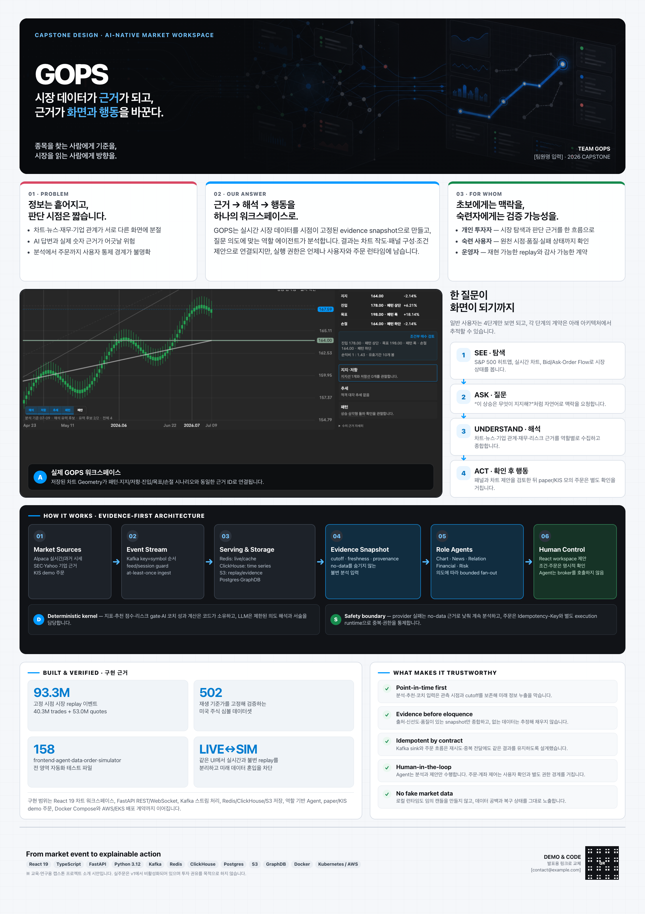
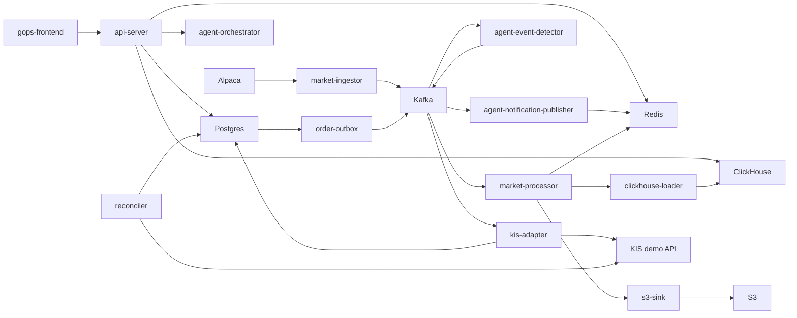

# 📈 GOPS Backend

> **종목을 찾는 사람에게 기준을, 시장을 읽는 사람에게 방향을.**

GOPS는 실시간 미국 주식(S&P 500) 시장 데이터, 기업 관계 맥락, 역할별 AI 에이전트를 하나의
트레이딩 워크스페이스로 묶은 플랫폼입니다.<br>
이 저장소는 **데이터 수집·스트림 처리·API·주문·AI 에이전트·인프라**를 담당합니다.
프론트엔드는 [GOPS-FE](https://github.com/seunglee10/GOPS-FE)에 있습니다.

## 목차

| 번호 | 섹션 | 설명 |
|:---:|:---|:---|
| **1** | [프로젝트 개요](#프로젝트-개요) | 프로젝트 소개 및 개발 목적 |
| **2** | [주요 기능](#주요-기능) | 핵심 기능 및 특징 |
| **3** | [트러블 슈팅](#트러블-슈팅) | 개발 중 발생한 문제와 해결 과정 |
| **4** | [시스템 아키텍처](#시스템-아키텍처) | 전체 시스템 구조 및 기술 스택 |
| **5** | [데이터 플로우](#데이터-플로우) | 시장 데이터·주문·에이전트 흐름 |
| **6** | [ERD](#erd) | 테이블 구조 |
| **7** | [프로젝트 구조](#프로젝트-구조) | 코드 구조 |
| **8** | [실행 방법](#실행-방법) | 로컬 환경 실행 가이드 |
| **9** | [API](#api) | 주요 엔드포인트 |

<br>

## 프로젝트 개요

GOPS는 정보를 더 많이 보여주는 데서 그치지 않고, **사용자가 시장의 관계를 읽고 지금 필요한 화면을
바로 얻도록** 돕는 것을 목표로 합니다.

백엔드는 다음 세 가지 문제에 집중했습니다.

- **실시간 데이터 파이프라인**: Alpaca 시세를 Kafka로 받아 Redis(실시간)·ClickHouse(조회)·S3(영구 보존)로
  나눠 적재하고, 차트 API는 S3를 직접 읽지 않고 Redis와 ClickHouse에서만 응답합니다.
- **안전한 주문 흐름**: KIS 모의투자 주문을 Postgres Outbox → Kafka → 어댑터로 비동기 처리하고,
  `Idempotency-Key`와 정합성 작업(reconciler)으로 중복·유실을 막습니다.
- **역할별 AI 에이전트**: LangGraph 기반 오케스트레이터가 질의 이해 → 데이터 스냅샷 → 종합 분석을 거쳐
  리포트를 만들고, 차트 명령·레이아웃 제안까지 프론트엔드에 전달합니다. 에이전트는 주문을 실행하지 않습니다.

로컬은 Docker Compose 한 번으로, 운영은 AWS EKS 위에서 Kustomize·Terraform으로 구성합니다.

<br>

## 주요 기능

- **실시간 차트·시장 데이터**: 캔들·지표·매물대·오더플로우·비교 차트, 증시지도 히트맵, 지수, 장 상태.
  누락 구간은 `GET /api/charts/candles` 한 곳에서 조회와 보충을 함께 처리합니다.
- **AI 에이전트 분석**: 한국어 질의를 의도 단위로 분해해 분석하고, 결과를 SSE로 스트리밍합니다.
  차트 해설, 기업 비교, GraphDB 온톨로지 확장, 뉴스 현지화, 레이아웃 제안을 포함합니다.
- **시장 이벤트 알림**: 이벤트 감지기가 Kafka 스트림에서 이상 신호를 잡아 WebSocket 알림으로 발행합니다.
- **주문·페이퍼 트레이딩**: KIS 해외주식 모의투자 지정가 주문, 가상계좌 체결(live/replay 매처),
  사전 리스크 점검, 조건 주문.
- **틱 리플레이 시뮬레이터**: 실제 Alpaca trade/quote를 원래 시각 순서대로 재생합니다
  (S&P 500 502개 종목, 1×~10× 배속). 미래 정보가 섞이지 않도록 point-in-time으로 차단합니다.
- **추천·AI 코치·기업저널**: 투자 성향 기반 종목 추천, AI 투자 코치 리포트, AI 기업저널.
- **인증**: Google OAuth, Kakao OAuth2(리프레시 토큰, 연결 끊기, 이메일 없는 계정 지원). 세션은 Redis에 저장합니다.

<br>

## 트러블 슈팅

| Category | Topic | 원인과 해결 |
| :--- | :--- | :--- |
| **ClickHouse** | **마이그레이션 실패** | `DateTime64` 컬럼에 `isoformat()`의 `+00:00` 오프셋이 들어가 JSONEachRow 파싱이 실패했고, 집계 뷰는 `argMax` 인자가 어느 관계의 컬럼인지 모호해 생성되지 않았습니다. 저장소 공통 시각 포맷으로 맞추고 별칭으로 컬럼을 명시했습니다. [`73bd118`](https://github.com/seunglee10/GOPS-BE/commit/73bd1188) |
| | **일별 뉴스 요약이 항상 빈 결과** | `toString(date) AS date` 별칭이 WHERE 절의 원본 컬럼을 가려 ClickHouse 24.12 analyzer에서 쿼리가 실패했습니다. 호출부가 예외를 삼켜 `200 OK` + 빈 배열로 보였던 것이 원인을 숨겼습니다. [`f725b29`](https://github.com/seunglee10/GOPS-BE/commit/f725b29f) |
| | **틱 시각 처리** | ClickHouse 틱 시각의 UTC·ISO 변환 불일치를 바로잡았습니다. [`9f2941c`](https://github.com/seunglee10/GOPS-BE/commit/9f2941ce) · [`9a64484`](https://github.com/seunglee10/GOPS-BE/commit/9a644842) |
| **Performance** | **SIM 재생·가상계좌 병목** | 리플레이를 sequence 기반으로 읽고, 매처는 활성 종목만 소배치로 처리하며, 호가는 배치 조회합니다. 일시 장애는 WebSocket 재연결로 자동 복구합니다. [`613981e`](https://github.com/seunglee10/GOPS-BE/commit/613981e8) |
| | **히트맵 응답 지연** | stale 캐시를 즉시 반환하고 갱신은 single-flight로 하나만 돌립니다. 응답 필드도 렌더링에 필요한 것만 남겼습니다. [`2cbef6d`](https://github.com/seunglee10/GOPS-BE/commit/2cbef6d3) · [`cfbc376`](https://github.com/seunglee10/GOPS-BE/commit/cfbc3762) |
| | **페이퍼 WebSocket이 API 응답을 막음** | 가상계좌 WebSocket이 백엔드의 다른 응답을 막던 문제를 고치고, 끊긴 연결에 오류를 계속 보내던 동작을 멈췄습니다. [`248706f`](https://github.com/seunglee10/GOPS-BE/commit/248706f2) · [`d4be8e7`](https://github.com/seunglee10/GOPS-BE/commit/d4be8e70) |
| **Simulator** | **대량 리플레이 적재** | 25만 행 단위 배치 insert로 작은 MergeTree part 폭증을 막고, 15분 구간별 정렬로 메모리 피크를 제한했습니다. 429/5xx는 지수 백오프로 재시도합니다. [문서](systems/simulator/README.md) |
| | **재생 중 제어 평면 정지** | 재생 중에도 시작·정지·배속 같은 제어 요청에 응답하도록 고쳤습니다. [`7cc2f93`](https://github.com/seunglee10/GOPS-BE/commit/7cc2f934) |
| **Auth** | **소셜 계정 500 오류** | Kakao 계정은 이메일이 `None`일 수 있어 운영자 확인 코드의 `.strip()`에서 500이 났습니다. 감사 기록의 actor도 `sub`로 대체했습니다. [`accd399`](https://github.com/seunglee10/GOPS-BE/commit/accd3990) |
| **Infra** | **EKS 롤아웃 정지** | 상시 시뮬레이터와 이중화 백엔드가 함께 배치될 CPU가 부족해 롤아웃이 막혔습니다. 앱 노드 풀을 늘려 복구하고, 리소스 사용을 별도로 점검했습니다. [`f2ab471`](https://github.com/seunglee10/GOPS-BE/commit/f2ab471a) · [점검 문서](docs/EKS_RESOURCE_WASTE_AUDIT_2026-07-15.md) |

> 분야별 회고는 [docs/SEUNGLEE_IMPLEMENTATION_RETROSPECTIVE.md](docs/SEUNGLEE_IMPLEMENTATION_RETROSPECTIVE.md)에서 확인할 수 있습니다.

<br>

## 시스템 아키텍처



<br>

| 카테고리 | 기술 | 설명 |
|:---|:---|:---|
| **Backend** | Python 3.12 + FastAPI 0.115 + Uvicorn | REST·WebSocket·SSE API 게이트웨이 |
| **Streaming** | Apache Kafka | 시세·주문·에이전트 이벤트 토픽 ([topics.txt](platform/kafka/topics.txt)) |
| **Realtime Store** | Redis 7 | 실시간 캔들, 세션, 에이전트 리포트 저장소 |
| **Analytics DB** | ClickHouse 24.12 | 차트 캔들·뉴스·리플레이 조회용 프로젝션 |
| **RDB** | PostgreSQL 16 | 주문·Outbox·가상계좌·사용자 설정 |
| **Object Store** | AWS S3 (로컬 MinIO) | 원본 시세 영구 보존, 재생·재구성용 |
| **Graph DB** | Ontotext GraphDB 11 | 기업·섹터·공급망 온톨로지 |
| **AI** | LangGraph + OpenAI Responses API | 역할별 에이전트 오케스트레이션 |
| **External** | Alpaca, KIS, SEC, Yahoo Finance | 시세·뉴스, 모의주문, 펀더멘털 |
| **Infra** | Docker Compose, AWS EKS, Kustomize, Terraform | 로컬 실행 및 클라우드 배포 |
| **CI/CD** | GitHub Actions → ECR → EKS | 변경된 서비스만 빌드·배포 |
| **Test** | pytest | 시스템별 단위·통합 테스트 |

<br>

## 데이터 플로우


```mermaid
flowchart LR
  FE["gops-frontend"] --> API["api-server"]
  API --> Redis["Redis"]
  API --> CH["ClickHouse"]
  API --> PG["Postgres"]
  API --> AgentOrch["agent-orchestrator"]

  Alpaca["Alpaca"] --> Ingestor["market-ingestor"]
  Ingestor --> Kafka["Kafka"]
  Kafka --> Processor["market-processor"]
  Kafka --> EventDetector["agent-event-detector"]
  EventDetector --> Kafka
  Kafka --> AlertPublisher["agent-notification-publisher"] --> Redis
  Processor --> Redis
  Processor --> S3Sink["s3-sink"] --> S3["S3"]
  Processor --> CHLoader["clickhouse-loader"] --> CH

  PG --> Outbox["order-outbox"]
  Outbox --> Kafka
  Kafka --> KISAdapter["kis-adapter"]
  KISAdapter --> KIS["KIS demo API"]
  KISAdapter --> PG
  Reconciler["reconciler"] --> PG
  Reconciler --> KIS
```

| 구분 | 흐름 | 문서 |
| :--- | :--- | :--- |
| **시장 데이터** | Alpaca → ingestor → Kafka → processor → Redis / S3 / ClickHouse → API | [CHART_DATA_ARCHITECTURE](docs/CHART_DATA_ARCHITECTURE.md) |
| **주문** | API → Postgres → Outbox → Kafka → kis-adapter → KIS → Postgres, reconciler가 정합성 확인 | [KAFKA_ARCHITECTURE](docs/KAFKA_ARCHITECTURE.md) |
| **에이전트 분석** | `POST /api/agents/analyze` → Kafka → analysis-worker → 오케스트레이터 → Redis 리포트 → SSE | [AGENT_ARCHITECTURE](docs/AGENT_ARCHITECTURE.md) |
| **이벤트 알림** | event-detector → Kafka → notification-publisher → Redis → WebSocket | [ALERT_SYSTEM_DESIGN](docs/ALERT_SYSTEM_DESIGN.md) |

<br>

## ERD

테이블 정의는 저장소별로 나눠 관리합니다. ERDCloud에 바로 가져올 수 있는
[ERDCLOUD_IMPORT.sql](docs/ERDCLOUD_IMPORT.sql)도 함께 둡니다.

| 영역 | 스키마 |
| :--- | :--- |
| 주문·가상계좌 (Postgres) | [01-order-paper.sql](docs/erd/01-order-paper.sql) |
| 사용자·추천 (Postgres) | [02-users-recommendations.sql](docs/erd/02-users-recommendations.sql) |
| 차트 분석 자산 (Postgres) | [03-chart-assets.sql](docs/erd/03-chart-assets.sql) |
| 시장 데이터 (ClickHouse) | [04-clickhouse-market-data.sql](docs/erd/04-clickhouse-market-data.sql) |

> 각 테이블의 역할은 [docs/erd/TABLE_ROLES.md](docs/erd/TABLE_ROLES.md)에 정리되어 있습니다.

<br>

## 프로젝트 구조

```
gops-backend/
├── systems/
│   ├── api-server/            # FastAPI 게이트웨이 (auth, routes, market_data, recommendations, alerts …)
│   ├── market-data/           # 수집·처리·적재 (ingestor, processor, clickhouse-loader, s3-sink, news workers)
│   ├── order/                 # KIS 주문 도메인 (kis-adapter, order-outbox, paper matchers, reconciler)
│   ├── agent-orchestration/   # AI 에이전트 (analysis worker, event detector, notification publisher …)
│   ├── fundamentals/          # SEC companyfacts, 10-K 프로필, 실적 추정치 백필
│   └── simulator/             # 틱 리플레이 시뮬레이터
├── platform/                  # Kafka 토픽, 저장소별 로컬 → 관리형 전환 계약
├── shared/chart-contract/     # 차트 명령·분석 자산 JSON Schema (프론트와 공유하는 원본)
├── infra/
│   ├── docker/                # 서비스별 Dockerfile
│   ├── k8s/                   # Kustomize base + AWS overlays
│   ├── aws/terraform/         # ECR, S3, Secrets, IRSA
│   └── clickhouse/initdb/     # 로컬 ClickHouse 스키마
├── scripts/                   # 로컬 스모크 검사, AWS 빌드·배포·백업
└── docs/                      # 아키텍처, ERD, 데이터 계약, 회고
```

각 `systems/*`는 `pods/`(상시 실행 서비스), `jobs/`(일회성 작업), `shared/`(공용 모듈), `tests/`로 나뉩니다.

<br>

## 실행 방법

#### 1. 프로젝트 클론

프론트엔드와 나란히 클론하면 Docker Compose가 프론트엔드까지 함께 빌드합니다.

```sh
git clone https://github.com/seunglee10/GOPS-BE.git gops-backend
git clone https://github.com/seunglee10/GOPS-FE.git gops-frontend
cd gops-backend
```

#### 2. 환경 변수 설정

```sh
cp .env.example .env
```

외부 서비스 없이 로컬에서만 실행하려면 아래 값을 지정하고 실제 자격 증명은 비워 둡니다.
AWS·Alpaca·KIS·OpenAI 호출이 막히고, 로그인 없이 시뮬레이터를 제어할 수 있습니다.

```text
AUTH_ENABLED=false
SIMULATOR_LOCAL_CONTROL_ENABLED=true
SIM_AUTH_MODE=off
GOPS_SIMULATOR_URL=http://gops-simulator:8765

AWS_EC2_METADATA_DISABLED=true
ALPACA_CREDENTIAL_SOURCE=local-env
KIS_ENV=demo
KIS_CREDENTIAL_SOURCE=local-env
AGENT_FINAL_ANSWER_PROVIDER=disabled
AGENT_FINANCIAL_FINAL_ANSWER_PROVIDER=disabled
CHART_COMMENTARY_PROVIDER=disabled

DOCKER_S3_ENDPOINT_URL=http://minio:9000
S3_ACCESS_KEY_ID=minioadmin
S3_SECRET_ACCESS_KEY=minioadmin
S3_BUCKET=gops-local
POSTGRES_PASSWORD=gops_dev_password
```

> `AUTH_ENABLED=false`는 개인 컴퓨터에서만 사용하세요. 전체 변수 설명은 [docs/ENVIRONMENT.md](docs/ENVIRONMENT.md)에 있습니다.

#### 3. 빌드 및 실행

프론트엔드, API, 데이터베이스, MinIO, 시뮬레이터를 한 번에 띄웁니다. ClickHouse·Postgres 마이그레이션은 자동으로 실행됩니다.

```sh
docker compose --env-file .env --profile local-s3 --profile simulator up -d --build
```

실시간 Alpaca 수집은 필요할 때만 별도 profile로 켭니다.

```sh
docker compose --profile alpaca up -d --build alpaca-ingestor
```

#### 4. 애플리케이션 접속

| 서비스 | 주소 |
| :--- | :--- |
| 프론트엔드 | http://localhost:5173 |
| 백엔드 API | http://localhost:8000/health |
| 에이전트 API | http://localhost:8100/health |
| 시뮬레이터 | http://localhost:8765/health |

> 이 프로젝트는 부족한 데이터를 가짜 시장 데이터로 채우지 않습니다. 비공개 리플레이 백업 없이 실행하면
> 과거 캔들과 시뮬레이션 데이터는 비어 있습니다. 백업 복원 방법은
> [docs/ONBOARDING_LOCAL_DOCKER.md](docs/ONBOARDING_LOCAL_DOCKER.md)를 참고하세요.

#### 5. 테스트

```sh
python -m venv .venv && . .venv/bin/activate
pip install -r requirements-dev.txt
python -m pytest
```

<br>

## API

| 그룹 | 엔드포인트 |
| :--- | :--- |
| **차트** | `GET /api/charts/candles` · `GET /api/charts/symbols` · `WS /ws/charts` |
| **에이전트** | `POST /api/agents/analyze` · `GET /api/agents/reports/{id}` · `GET /api/agents/reports/{id}/stream` (SSE) · `WS /ws/agent-alerts` |
| **주문** | `POST /api/orders` (`Idempotency-Key` 필수) · `GET /api/orders/{id}` · `GET /api/orders/balance` · `WS /ws/orders/{id}` |
| **가상계좌** | `/api/paper/*` · `WS /ws/paper/account` · `WS /ws/paper/orders/{id}` |
| **시장** | `/api/market/heatmap` · `/api/market/news/*` · `/api/recommendations/*` · `/api/company-journal` |
| **시뮬레이터** | `GET /api/simulator/status` · `POST /api/simulator/action` |
| **인증** | `/api/auth/*` (Google, Kakao) |

> `AUTH_ENABLED=true`이면 주문·LLM 경로는 로그인이 필요하고, 차트와 시장 데이터 API는 공개 상태를 유지합니다.
