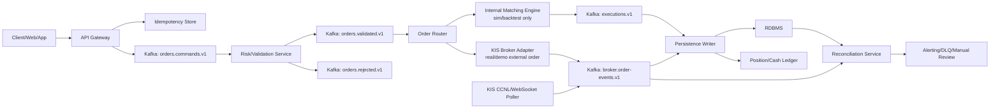

# 주식 플랫폼 보안/신뢰성 마일스톤

작성일: 2026-06-25 KST

이 문서는 현재 `gops-kis-trader`가 가진 한국투자증권 Open API 주문 CLI 골격을 기준으로, Kafka와 서비스 구조를 붙여 보안성과 신뢰성을 단계적으로 끌어올리는 실행 계획이다.

## 먼저 정해야 할 경계

현재 프로젝트는 KIS API로 해외주식 주문을 전송하는 클라이언트다. 따라서 실제 증권시장 주문의 체결은 한국투자증권/거래소 쪽에서 일어난다. 내부 Matching Engine은 다음 목적일 때만 필요하다.

- 모의투자/백테스트/가상거래용 내부 호가창
- 주문 유효성 검증과 리스크 체크를 빠르게 반복하기 위한 시뮬레이터
- KIS 응답과 체결내역을 이벤트 소싱 방식으로 재구성하는 상태 머신

실전 주문 경로에서는 내부 Matching Engine이 실제 체결을 결정하면 안 된다. 실전 경로의 핵심은 `주문 중복 방지`, `외부 API 호출의 정확한 기록`, `KIS 체결내역과 내부 원장의 대사`, `장애 후 복구`다.

## 목표 품질

### 보안 목표

- KIS `appkey`, `appsecret`, access token, 계좌번호가 클라이언트/로그/이벤트에 노출되지 않는다.
- 사용자는 본인 계좌/전략/주문만 접근할 수 있다.
- 같은 주문 요청이 여러 번 들어와도 같은 실전 주문이 중복 제출되지 않는다.
- 관리자 기능, 실전 주문 기능, 모의투자 기능의 권한이 분리된다.
- 모든 주문/취소/정정/체결/정산 이벤트는 추적 가능하고 위변조 탐지가 가능하다.

### 신뢰성 목표

- API 서버, Kafka consumer, DB writer 중 하나가 죽어도 주문 상태가 유실되지 않는다.
- Kafka 재처리, consumer rebalance, HTTP timeout, KIS 응답 지연이 있어도 내부 주문 상태가 결정적으로 수렴한다.
- 시스템 재시작 후 WAL/snapshot/Kafka/DB를 이용해 Order Book 또는 Order State를 복구할 수 있다.
- 장애 상황에서도 사용자는 `접수됨`, `제출중`, `제출됨`, `거부됨`, `체결됨`, `부분체결`, `취소됨`, `대사필요` 같은 명확한 상태를 본다.
- p50/p95/p99 지연시간, 처리량, 실패율, Kafka lag, 대사 불일치 건수가 관측된다.

## 목표 아키텍처



핵심 원칙은 API 서버가 곧바로 KIS에 주문을 보내지 않는 것이다. API 서버는 인증, 권한, 입력 검증, 멱등성 확인 후 Kafka에 명령을 기록하고, 실제 외부 부작용은 `KIS Broker Adapter`가 단일 책임으로 수행한다.

## Milestone 0: 기준선, 위협 모델, 상태 모델 확정

### 목적

구현 전에 무엇을 보호하고 무엇을 복구해야 하는지 확정한다. 이 단계가 없으면 Kafka, WAL, 락을 도입해도 중복 주문/대사 불일치/권한 오류를 놓치기 쉽다.

### 해야 할 일

1. 주문 상태 머신 정의

   ```text
   RECEIVED
   -> VALIDATED | REJECTED
   -> SUBMITTING
   -> SUBMITTED | SUBMIT_FAILED_UNKNOWN | SUBMIT_REJECTED
   -> PARTIALLY_FILLED | FILLED | CANCEL_REQUESTED | CANCELED | EXPIRED
   -> RECONCILIATION_REQUIRED
   ```

   `SUBMIT_FAILED_UNKNOWN`이 중요하다. KIS HTTP 요청이 timeout 되었을 때 실제 주문 접수 여부를 모르는 상태가 생긴다. 이 상태에서는 재전송을 즉시 하지 않고 KIS 주문체결내역 조회로 대사한다.

2. 데이터 분류

   | 데이터 | 예시 | 저장/로그 정책 |
   | --- | --- | --- |
   | Secret | KIS appsecret, access token | Secret Manager 또는 파일 권한 0600, 로그 금지 |
   | 금융식별정보 | 계좌번호, 주문번호 | DB 암호화 또는 마스킹, 이벤트에는 alias 사용 |
   | 주문 데이터 | symbol, side, qty, price | 감사 로그 보존, 변경 불가 이벤트 |
   | 운영 데이터 | latency, lag, error code | PII 제거 후 장기 보존 가능 |

3. 외부 API 실패 모드 정리

   - KIS 200 응답 + `rt_cd != 0`: 명시적 거부
   - HTTP 4xx: 요청 오류 또는 인증/권한 오류
   - HTTP 5xx: 외부 장애, 재시도 가능 후보
   - timeout/connection reset: 주문 접수 여부 불명, 대사 필요
   - 토큰 만료/발급 실패: 주문 제출 중지, 재시도 큐 이동

4. SLO 초안 정의

   - 주문 접수 API p95 latency: 100ms 이하
   - Kafka 명령 publish 성공률: 99.9% 이상
   - KIS 제출 후 상태 확정 p95: 5초 이하
   - 일별 대사 불일치: 0건 목표, 1건 이상 즉시 알림
   - 실전 주문 중복 제출: 0건

### 산출물

- `docs/order-state-machine.md`
- `docs/security-threat-model.md`
- `docs/reliability-slo.md`
- 상태 전이 테스트 케이스 목록

### 완료 기준

- timeout 이후 재시도 정책과 대사 정책이 문서화되어 있다.
- 주문 상태 전이가 코드/DB/이벤트 스키마에서 같은 이름으로 쓰인다.
- 어떤 서비스가 KIS secret에 접근할 수 있는지 명확하다.

## Milestone 1: 핵심 도메인 모델과 내부 체결 엔진

### 목적

네트워크/DB 없이 순수 메모리에서 주문 검증, Order Book 갱신, 체결 이벤트 생성을 검증한다. 단, 실전 KIS 주문과 내부 Matching Engine의 책임을 분리한다.

### 구현 범위

- `Order`, `OrderCommand`, `OrderEvent`, `Execution`, `OrderBook`, `PriceLevel` 모델
- 지정가 주문 우선 구현
- 가격 우선, 시간 우선 매칭
- 취소/정정은 별도 명령으로 모델링
- 실전 주문 경로와 분리된 `simulation` 모드

### 자료구조 권장안

Python 기준으로 시작한다면 직접 B+ Tree를 바로 구현하기보다 다음 순서가 현실적이다.

1. `dict[price, deque[Order]]`로 가격 레벨별 FIFO 큐를 둔다.
2. bid 가격은 max-heap, ask 가격은 min-heap으로 best price를 찾는다.
3. heap에 남아있는 빈 price level은 lazy deletion으로 제거한다.
4. 주문 취소는 `order_id -> OrderRef` 해시 인덱스로 O(1)에 접근하고, 큐에서는 canceled flag로 지연 제거한다.

복잡도 목표:

| 작업 | 목표 복잡도 |
| --- | --- |
| best bid/ask 조회 | O(1) amortized 또는 O(log P) |
| 새 가격 레벨 추가 | O(log P) |
| 같은 가격 내 FIFO 삽입 | O(1) |
| 주문 ID 조회 | O(1) |
| 매칭 | 체결 건수 K에 대해 O(K log P) 이하 |

`P`는 가격 레벨 수다. 전체 주문 수 `N`보다 가격 레벨 수가 작기 때문에 실전적인 병목은 `가격 레벨 탐색`보다 `이벤트 생성`, `로그/직렬화`, `락 경합`이 될 가능성이 높다.

### 벤치마크

- 시나리오 A: 단일 symbol, 100만 주문, 50% 체결
- 시나리오 B: 100 symbols, symbol별 독립 Order Book
- 시나리오 C: 취소 30%, 정정 20%, 신규 50%
- 측정: TPS, p50/p95/p99 처리시간, 메모리 사용량, GC 시간, hot function

Python에서는 `pytest-benchmark`, `cProfile`, `py-spy`를 우선 사용한다. 목표 TPS가 높고 Python이 병목이면, Matching Engine만 Rust/Go/C++로 분리할지 판단한다.

### 테스트

- 가격 우선/시간 우선 property test
- 부분체결 후 잔량 보존 테스트
- 취소된 주문이 체결되지 않는 테스트
- snapshot 저장 후 WAL replay로 같은 Order Book이 만들어지는 테스트
- deterministic replay: 같은 입력 이벤트를 같은 순서로 넣으면 같은 출력 이벤트가 나온다.

### 완료 기준

- 네트워크/DB 없이 재현 가능한 벤치마크가 있다.
- 체결 이벤트가 append-only로 생성된다.
- 특정 seed의 주문 스트림을 replay하면 항상 같은 결과가 나온다.

## Milestone 2: Kafka 명령/이벤트 파이프라인

### 목적

API 요청과 주문 처리를 분리하고, 장애 시 재처리 가능한 이벤트 기반 구조를 만든다.

### Topic 설계

| Topic | Key | Producer | Consumer | Retention |
| --- | --- | --- | --- | --- |
| `orders.commands.v1` | `account_alias:symbol` | API Gateway | Risk Service | 7-30일 |
| `orders.validated.v1` | `account_alias:symbol` | Risk Service | Order Router | 7-30일 |
| `orders.rejected.v1` | `request_id` | Risk Service | Persistence Writer | 90일 |
| `broker.submit-requests.v1` | `account_alias:symbol` | Order Router | KIS Adapter | 7-30일 |
| `broker.order-events.v1` | `broker_order_id` 또는 `client_order_id` | KIS Adapter/Poller | Persistence/Reconcile | 90일 이상 |
| `executions.v1` | `symbol` | Simulation Engine | Persistence Writer | 90일 이상 |
| `orders.dlq.v1` | `original_topic:partition:offset` | 모든 consumer | DLQ Processor | 30일 |
| `audit.security.v1` | `actor_id` | Gateway/Services | Audit Store | 1년 이상 |

주문 순서가 중요한 범위는 `account_alias:symbol`로 잡는다. 같은 계좌의 같은 종목에 대한 주문/취소/정정 순서를 한 partition에서 보존하기 위함이다. 여러 종목 간 전역 순서는 보장하지 않는다.

### 메시지 스키마

모든 메시지는 다음 공통 필드를 가진다.

```json
{
  "schema_version": 1,
  "event_id": "uuid",
  "request_id": "uuid",
  "idempotency_key_hash": "sha256",
  "occurred_at": "2026-06-25T00:00:00.000Z",
  "producer": "api-gateway",
  "account_alias": "acct_...",
  "env": "demo",
  "payload": {}
}
```

원문 idempotency key, 계좌번호, token, appsecret은 Kafka payload에 넣지 않는다. 계좌번호는 `account_alias` 또는 HMAC으로 대체한다.

### Producer 설정

- `acks=all`
- `enable.idempotence=true`
- `retries > 0`
- `max.in.flight.requests.per.connection <= 5`
- `delivery.timeout.ms`와 `request.timeout.ms`를 명시
- 메시지 키를 반드시 지정
- schema version을 필수화

### Consumer 처리 원칙

- `enable.auto.commit=false`
- 처리 성공 후 offset commit
- DB 쓰기와 후속 Kafka publish가 함께 필요한 consumer는 Outbox 패턴 또는 Kafka transaction을 사용
- KIS HTTP 호출 같은 외부 부작용은 Kafka transaction으로 원자화할 수 없으므로, idempotency table과 reconciliation으로 보완
- consumer 재시작 시 같은 메시지가 다시 처리되어도 결과가 같아야 한다.

### DLQ 정책

DLQ로 보내는 기준:

- 스키마 파싱 실패
- 권한/데이터 불일치처럼 재시도해도 성공하지 않는 오류
- 재시도 횟수 초과
- KIS 응답이 영구 거부로 분류되는 경우

DLQ 메시지에는 원본 topic/partition/offset, 에러 타입, 에러 메시지, 마지막 처리 시각, 재처리 가능 여부를 넣는다.

### 완료 기준

- API Gateway가 KIS에 직접 주문을 보내지 않는다.
- Kafka 메시지 replay로 주문 상태를 재구성할 수 있다.
- consumer를 강제 종료해도 처리 완료 전 메시지가 유실되지 않는다.

## Milestone 3: 영속성, WAL, Snapshot, 대사

### 목적

프로세스가 죽어도 주문 상태와 내부 Order Book을 복구하고, KIS 외부 상태와 내부 DB 상태가 수렴하도록 만든다.

### DB 모델 초안

| Table | 목적 |
| --- | --- |
| `orders` | 주문의 최신 materialized state |
| `order_events` | append-only 주문 이벤트 원장 |
| `executions` | 체결 이벤트 |
| `broker_submissions` | KIS 제출 시도와 응답 기록 |
| `idempotency_keys` | 중복 요청 차단 |
| `positions` | 현재 보유수량 materialized view |
| `cash_ledger` | 현금 변동 double-entry ledger |
| `outbox_events` | DB commit 후 Kafka publish 대상 |
| `reconciliation_runs` | KIS 대사 실행 이력 |
| `audit_logs` | 보안/운영 감사 로그 |

`orders`는 조회 최적화용 최신 상태이고, 진짜 근거는 `order_events`, `executions`, `broker_submissions`, `cash_ledger` 같은 append-only 테이블이어야 한다.

### WAL 설계

내부 Matching Engine 또는 Order State Machine이 메모리 상태를 바꾸기 전에 WAL에 먼저 쓴다.

WAL record 필드:

```text
magic
version
sequence_no
record_type
event_id
previous_hash
payload_length
payload_crc32
payload_json
record_hash
```

운영 정책:

- 실전 주문 상태 전이는 `fsync=always` 또는 짧은 batch fsync로 시작
- simulation 벤치마크는 `fsync=batch`로 별도 측정
- snapshot은 일정 이벤트 수 또는 시간마다 생성
- 복구 순서: 최신 snapshot load -> WAL replay -> Kafka/DB와 gap 확인
- WAL segment는 immutable로 보존하고 압축/아카이브 정책을 둔다.

### KIS 대사 로직

KIS는 외부 시스템이므로 내부 DB만 믿으면 안 된다.

1. KIS 주문 제출 시 `client_order_id`, 내부 `request_id`, 응답 원문, HTTP status, KIS 주문번호를 기록한다.
2. timeout 또는 응답 불명 상태는 `SUBMIT_FAILED_UNKNOWN`으로 저장한다.
3. 주기적으로 주문체결내역 또는 WebSocket 체결 이벤트를 수집한다.
4. 내부 `orders`/`executions`와 KIS 결과를 비교한다.
5. 불일치 시 자동 보정 가능한 항목은 보정 이벤트를 추가하고, 위험한 항목은 `RECONCILIATION_REQUIRED`로 올린다.

### Bulk Insert

체결 결과 DB 쓰기는 batch로 묶되, 유실 방지를 위해 다음 중 하나를 선택한다.

- Kafka consumer -> DB transaction -> offset commit
- Kafka consumer -> DB transaction + outbox insert -> outbox publisher -> offset commit

대량 insert 중 일부 실패가 발생하면 batch 전체 rollback 후 작은 batch로 쪼개 재시도한다. 중복 insert 방지를 위해 `event_id`, `execution_id`, `broker_order_id`에 unique constraint를 둔다.

### 장애 주입 테스트

- WAL append 직후 process kill
- 메모리 상태 변경 직후 process kill
- Kafka consume 후 DB commit 전 kill
- DB commit 후 offset commit 전 kill
- KIS timeout 후 동일 요청 재시도
- KIS 제출 성공 후 내부 DB 쓰기 실패
- snapshot 생성 중 kill

### 완료 기준

- 강제 종료 후 replay 결과가 종료 전 상태와 일치한다.
- 같은 Kafka 메시지를 여러 번 처리해도 DB row가 중복되지 않는다.
- KIS 체결내역과 내부 executions가 일 단위로 0건 불일치다.

## Milestone 4: API Gateway, 인증/인가, 멱등성

### 목적

외부 요청이 시스템에 들어오는 지점에서 인증, 권한, 입력 제한, 중복 요청 방지를 끝낸다.

### Gateway 책임

- 사용자 인증: OIDC/JWT 또는 세션 기반 인증
- 서비스 간 인증: mTLS 또는 signed service token
- 권한 확인: account, role, trading env, order permission
- 입력 검증: symbol, exchange, qty, price, side, order type
- rate limit: 사용자/IP/계좌/전략 단위
- idempotency key 필수화
- request body hash 저장
- 감사 로그 생성

### Idempotency Key 정책

요청 헤더:

```text
Idempotency-Key: <client-generated-uuid>
```

저장 필드:

| Field | 설명 |
| --- | --- |
| `key_hash` | raw key를 저장하지 않고 hash 저장 |
| `actor_id` | 사용자/서비스 ID |
| `account_alias` | 계좌 alias |
| `request_body_hash` | 같은 key로 다른 body를 보내는 것 차단 |
| `status` | `IN_PROGRESS`, `SUCCEEDED`, `FAILED_RETRYABLE`, `FAILED_FINAL` |
| `response_ref` | 이전 응답 또는 주문 ID |
| `expires_at` | 보존 기간 |

처리 규칙:

- 같은 key + 같은 body + 성공 이력: 이전 결과 반환
- 같은 key + 다른 body: 409 Conflict
- 같은 key + 진행 중: 202 Accepted 또는 409 Conflict 중 하나로 통일
- 실패가 KIS timeout이면 즉시 재주문하지 않고 대사 상태 반환

### 권한 모델

최소 권한 예시:

| Role | 가능 작업 |
| --- | --- |
| `viewer` | 잔고/주문 조회 |
| `paper_trader` | 모의투자 주문 |
| `real_trader` | 실전 주문, 별도 승인 필요 |
| `admin` | 계정/한도/전략 설정 |
| `ops` | DLQ 재처리, 주문 직접 생성 불가 |

실전 주문은 다음 조건을 모두 통과해야 한다.

- 사용자에게 `real_trader` 권한이 있다.
- 계좌가 실전 주문 활성화 상태다.
- 주문 금액/수량/종목 한도를 넘지 않는다.
- idempotency key가 유효하다.
- 실전 주문 confirmation 또는 2차 승인 정책을 통과한다.

### 완료 기준

- 같은 주문 요청 100회 동시 전송 시 KIS 제출은 1회만 발생한다.
- 다른 body로 같은 idempotency key를 쓰면 차단된다.
- 권한 없는 사용자가 다른 계좌 주문/조회에 접근하지 못한다.

## Milestone 5: 동시성 제어와 단일 작성자 모델

### 목적

멀티스레드/멀티프로세스 환경에서 주문 상태가 꼬이지 않도록 한다.

### 권장 모델

같은 `account_alias:symbol`의 주문 처리는 Kafka partition 기준으로 단일 consumer가 맡는다. 이렇게 하면 가장 위험한 Order Book/주문 상태 갱신은 single-writer가 되어 락 복잡도가 크게 줄어든다.

멀티스레드를 쓰더라도 같은 symbol의 Order Book을 여러 스레드가 동시에 수정하지 않는다. 병렬성은 symbol/partition 단위로 확보한다.

### 낙관적 락 적용 위치

DB의 최신 상태 테이블에는 version을 둔다.

```sql
UPDATE orders
SET status = :next_status,
    version = version + 1,
    updated_at = now()
WHERE order_id = :order_id
  AND version = :expected_version;
```

영향 row가 0이면 다른 처리자가 먼저 상태를 바꾼 것이다. 이 경우 현재 상태를 다시 읽고 상태 전이 가능 여부를 판단한다.

### Race Condition 테스트

- 같은 주문에 대해 cancel과 fill 이벤트가 동시에 들어오는 경우
- 같은 idempotency key 요청이 동시에 100개 들어오는 경우
- consumer rebalance 중 같은 메시지가 재처리되는 경우
- KIS timeout 이후 사용자가 같은 주문을 재요청하는 경우
- DB commit 성공, offset commit 실패 후 재처리되는 경우

### 완료 기준

- 모든 상태 전이는 허용된 transition table을 통과한다.
- optimistic lock 충돌은 metric으로 관측된다.
- 재처리/동시 요청에서 duplicate external submission이 발생하지 않는다.

## Milestone 6: KIS Broker Adapter 하드닝

### 목적

KIS API 호출을 하나의 서비스로 격리하고, 외부 API의 불확실성을 내부 상태 모델로 흡수한다.

### Adapter 책임

- KIS access token 발급/갱신
- 주문 요청 변환
- KIS rate limit 준수
- circuit breaker
- retry/backoff
- timeout 분류
- KIS 응답 원문 저장
- 주문체결내역 polling 또는 WebSocket 수집
- 내부 이벤트 발행

### Retry 정책

| 실패 | 처리 |
| --- | --- |
| validation error | 재시도 금지, rejected |
| auth token expired | token refresh 후 1회 재시도 |
| HTTP 429/rate limit | backoff 후 재시도, queue 지연 |
| HTTP 5xx | 제한된 횟수 재시도 |
| timeout | 재주문 금지, `SUBMIT_FAILED_UNKNOWN` 후 대사 |
| network reset before request write 확인 가능 | 제한적 재시도 가능 |

KIS 주문 API가 자체 idempotency key를 보장하지 않는다고 가정하고 설계한다. 즉, timeout 후 같은 주문을 다시 POST 하는 것은 중복 실전 주문 위험이 있으므로 기본 금지다.

### Secret 관리

- KIS appkey/appsecret은 Gateway나 frontend에 전달하지 않는다.
- Adapter만 Secret Manager에서 읽는다.
- token cache 파일은 권한 0600, 컨테이너 volume 분리
- 로그에는 Authorization, appkey, appsecret, 계좌번호를 남기지 않는다.
- 운영 환경과 모의투자 환경 secret을 물리적으로 분리한다.

### 완료 기준

- KIS timeout 시 즉시 중복 POST하지 않고 대사 경로로 들어간다.
- KIS secret이 Kafka 메시지/로그/DB 일반 테이블에 없다.
- rate limit 초과를 adapter 내부 queue/backoff로 흡수한다.

## Milestone 7: 관측성, 감사, 성능 프로파일링

### 목적

장애와 병목을 추측하지 않고 숫자로 본다.

### Metrics

| Metric | 예시 |
| --- | --- |
| API | request count, p95 latency, 4xx/5xx |
| Kafka | produce latency, consumer lag, rebalance count |
| Orders | submitted/rejected/filled/canceled count |
| KIS | request latency, timeout count, rate limit count |
| DB | transaction latency, deadlock count, pool usage |
| WAL | append latency, fsync latency, replay time |
| Reconciliation | mismatch count, unresolved count |
| Security | auth failure, rate limit blocked, permission denied |

### Logging

- `request_id`, `event_id`, `order_id`, `account_alias`, `symbol`은 모든 로그에 포함
- secret, token, full account number는 금지
- 주문 금액/수량은 필요한 범위에서만 기록
- KIS 원문 응답은 민감 필드 redaction 후 별도 보존

### Tracing

한 주문이 다음 구간을 지나가는 시간을 trace로 본다.

```text
Gateway -> Kafka produce -> Risk -> Router -> KIS Adapter -> Broker Event -> DB Writer -> Reconciliation
```

### Profiling

- Matching Engine: CPU profile, memory allocation, heap size
- Kafka producer: batch size, linger, compression, serialization 비용
- DB writer: batch size, index cost, lock wait
- KIS Adapter: rate limit, DNS/TLS/HTTP latency

### 완료 기준

- 주문 하나의 전체 흐름을 trace ID로 추적할 수 있다.
- p95/p99 지연과 Kafka lag이 dashboard에 보인다.
- 대사 불일치와 DLQ 발생 시 알림이 간다.

## Milestone 8: 보안 통제와 운영 가드레일

### 목적

OWASP API 위험군과 금융 주문 시스템 특유의 실수 방지 장치를 운영 전부터 넣는다.

### API 보안 체크리스트

- Object-level authorization: `account_id`를 사용자 입력 그대로 신뢰하지 않는다.
- Authentication: JWT 만료/서명/issuer/audience 검증
- Object property authorization: 사용자가 지정하면 안 되는 필드는 서버가 덮어쓴다.
- Resource consumption: 주문 API, 조회 API, DLQ 재처리에 rate limit
- Function-level authorization: 실전 주문/관리자/DLQ 재처리 권한 분리
- Sensitive business flows: 자동매매/실전 주문은 한도, 쿨다운, kill switch 적용
- SSRF: 외부 URL 입력을 받는 기능 금지 또는 allowlist
- Misconfiguration: debug endpoint, Swagger, testbed endpoint 운영 노출 금지
- Inventory: API version, topic version, schema version 관리
- Unsafe third-party API consumption: KIS 응답을 신뢰하기 전 schema와 status 검증

### 주문 안전장치

- 일별 주문 금액 한도
- 종목별 주문 수량 한도
- 분당 주문 횟수 한도
- 시장가 주문 금지 또는 별도 승인
- 실전 주문 kill switch
- 급격한 반복 실패 시 account 단위 circuit breaker
- 장 시작/종료, 휴장일, 거래 가능 exchange 검증

### 배포/공급망

- `.env`와 secret scan
- dependency vulnerability scan
- container image scan
- SBOM 생성
- production image에 test/debug 도구 제거
- 최소 권한 service account

### 완료 기준

- secret scan을 통과한다.
- 실전 주문 kill switch가 실제로 주문 제출을 차단한다.
- 권한 없는 actor의 주문/관리자/DLQ 접근이 테스트로 막힌다.

## Milestone 9: 고가용성, 장애 대응, Chaos Engineering

### 목적

일부 컴포넌트가 죽어도 주문 상태가 유실되지 않고, 복구 절차가 자동 또는 명확한 수동 절차로 진행된다.

### HA 구성

- Kafka: 3 broker 이상, replication factor 3, `min.insync.replicas=2`
- Kafka producer: `acks=all`, idempotent producer
- DB: primary/replica 또는 managed HA, PITR backup
- API Gateway: stateless multi instance
- KIS Adapter: partition ownership 기반 active-active 또는 account 단위 active-passive
- Reconciliation: 주기 실행 + 수동 재실행 가능

### Chaos 시나리오

| 시나리오 | 기대 결과 |
| --- | --- |
| Gateway kill | 이미 Kafka에 기록된 주문은 계속 처리 |
| Risk Service kill | consumer lag 증가 후 재시작 시 재처리 |
| KIS Adapter kill | 제출 전 메시지는 재처리, 제출 후 불명 상태는 대사 |
| DB Writer kill | offset 미커밋 메시지 재처리, unique key로 중복 방지 |
| Kafka broker 1대 down | produce/consume 지속 |
| DB primary failover | writer 재연결, 중복 insert 없음 |
| 네트워크 지연 | timeout/backoff/circuit breaker 동작 |
| DLQ 급증 | 알림, 자동 재처리 제한, 수동 검토 |

### 보상 로직

분산 트랜잭션을 2PC로 억지로 묶기보다 Saga/보상 이벤트를 쓴다.

- 주문 제출 성공, 내부 DB 실패: KIS 대사로 내부 이벤트 보정
- 주문 제출 불명: KIS 조회 전까지 재제출 금지
- 내부 체결 simulation 실패: WAL replay 후 이벤트 재생성
- 정산 실패: ledger reversal event 추가

### 완료 기준

- Chaos 테스트 리포트에 각 장애의 기대 결과와 실제 결과가 기록된다.
- DLQ 메시지 재처리 절차가 있다.
- 백업에서 복원한 DB와 Kafka/WAL replay 상태가 대사된다.

## Milestone 10: 정산, 원장, 회계적 무결성

### 목적

주문/체결만 저장하는 수준을 넘어, 보유수량과 현금 변동이 감사 가능한 원장으로 남게 한다.

### Ledger 원칙

- append-only double-entry ledger
- `trade_execution_id` 기준 중복 방지
- 수정은 update가 아니라 reversal event로 처리
- position은 ledger에서 계산 가능한 materialized view
- 일별 KIS 잔고/체결내역과 내부 ledger 대사

### 대사 항목

- 주문번호
- 종목
- 매수/매도
- 주문수량/체결수량/잔량
- 체결가격
- 수수료/세금
- 결제통화
- 주문일/체결일/결제일

### 완료 기준

- 내부 position 합계가 execution ledger에서 재계산된다.
- KIS 잔고 조회와 내부 position의 차이가 리포트된다.
- 차이가 있으면 자동 매매가 중지되고 수동 검토 상태로 들어간다.

## 권장 구현 순서

1. 상태 모델과 idempotency table부터 만든다.
2. API Gateway가 KIS에 직접 주문하지 않고 Kafka command만 쓰도록 바꾼다.
3. KIS Broker Adapter를 별도 consumer로 분리한다.
4. DB append-only event store와 latest state projection을 만든다.
5. KIS 주문체결내역 poller/reconciler를 만든다.
6. 내부 Matching Engine은 simulation 모드로 격리해 구현한다.
7. WAL/snapshot/replay는 simulation engine과 order state machine에 먼저 적용한다.
8. 권한, rate limit, kill switch를 gateway에 넣는다.
9. 관측성 dashboard와 알림을 붙인다.
10. Chaos 테스트와 복구 runbook을 작성한다.

## 지금 프로젝트에서 바로 이어갈 작은 작업 단위

현재 코드는 CLI에서 곧바로 `KisOverseasClient.order()`를 호출한다. 다음 작은 단계로 나누는 것이 좋다.

1. `OrderCommand`와 `OrderState` 모델 추가
2. dry-run preview 결과와 실제 submit 결과를 같은 내부 주문 모델로 감싸기
3. idempotency key를 CLI/API 입력에 추가
4. KIS 요청/응답 redaction logger 추가
5. Kafka 없이도 동작하는 in-memory command queue 인터페이스 추가
6. 이후 Kafka 구현체를 같은 인터페이스 뒤에 붙이기
7. KIS 제출 결과를 `broker_submissions` 저장소 인터페이스로 기록
8. 주문체결내역 조회 결과를 내부 `ExecutionEvent`로 변환

이 순서로 가면 현재 CLI 골격을 버리지 않고, 나중에 API Gateway/Kafka/DB로 확장할 때 도메인 모델을 그대로 가져갈 수 있다.

## 중요한 설계 판단

### Kafka exactly-once만으로 실전 중복 주문을 막을 수 없다

Kafka producer/consumer transaction은 Kafka 내부 처리에는 도움이 되지만, KIS HTTP POST 같은 외부 부작용까지 원자적으로 묶지 못한다. 실전 중복 주문 방지는 다음 조합으로 해결해야 한다.

- Gateway idempotency key
- DB unique constraint
- KIS Adapter single responsibility
- timeout 시 재POST 금지
- KIS 주문체결내역 대사
- 운영 알림과 수동 검토

### Matching Engine보다 Broker Adapter가 더 위험한 컴포넌트다

내부 Matching Engine은 잘못되어도 simulation 결과가 틀리는 문제에 가깝다. 실전에서는 KIS Adapter가 실제 주문을 내보내므로, 보안/신뢰성 우선순위는 Adapter, Gateway, Idempotency, Reconciliation이 더 높다.

### 낙관적 락은 보조 장치다

주문 처리의 1차 방어선은 Kafka partition 기반 single-writer 모델이다. 낙관적 락은 DB projection 업데이트나 운영자 수동 조작 같은 경합 지점에서 보조 방어선으로 쓴다.

## Definition of Done 요약

운영 전 최소 완료 기준:

- 실전 주문 중복 제출 방지 테스트 통과
- KIS timeout 후 대사 경로 테스트 통과
- Kafka consumer kill/restart 재처리 테스트 통과
- DB unique constraint로 중복 이벤트 insert 차단
- secret/log redaction 테스트 통과
- 권한 없는 계좌 접근 차단 테스트 통과
- kill switch 테스트 통과
- 일별 KIS 대사 리포트 생성
- DLQ 재처리 runbook 작성
- p95/p99 latency, Kafka lag, KIS error rate dashboard 구성

## 참고 공식 문서

- KIS Developers: https://apiportal.koreainvestment.com/
- Apache Kafka 4.3 Documentation: https://kafka.apache.org/43/
- Apache Kafka Producer Configs: https://kafka.apache.org/43/configuration/producer-configs/
- Apache Kafka Consumer Configs: https://kafka.apache.org/43/configuration/consumer-configs/
- Apache Kafka Security: https://kafka.apache.org/43/security/
- OWASP API Security Top 10 2023: https://owasp.org/API-Security/editions/2023/en/0x11-t10/
- NIST Cybersecurity Framework 2.0: https://www.nist.gov/cyberframework
