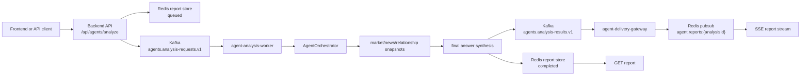

# GOPS Agent Architecture And Handoff

This is the canonical handoff document for the GOPS agent runtime. It replaces
older proposal, merge-guide, report-storage, and GraphDB-specific handoff docs.

The goal is to let frontend, backend, and AWS owners integrate or replace their
own layers while preserving the agent contract.
For the concrete file checklist by owner, read
`docs/AGENT_INTEGRATION_FILE_GUIDE.md`.

## Ownership Boundary

`systems/agent-orchestration` owns:

- user-query understanding for agent requests
- role-agent orchestration and final synthesis
- analysis report contracts and report-store serialization
- queued hot analysis and optional deep analysis workers
- GraphDB relationship snapshot integration
- market-event detection and notification-decision publishing
- smoke, latency, retrieval-quality, and answer-grounding jobs

It does not own:

- frontend chat or panel rendering
- FastAPI auth/session policy
- AWS resource provisioning
- market-data ingestion/backfill/storage workers
- order, account, KIS, or broker-control flows

The safety boundary is strict: agents produce analysis, layout proposals, and
notifications only. They must not execute orders or call account-control flows.

## Runtime Flow



Compatibility mode still exists: when `AGENT_ASYNC_ANALYSIS_ENABLED=false`,
the backend calls `agent-orchestrator` over HTTP instead of publishing to Kafka.

## Code To Hand Off

Agent-owned code:

```text
systems/agent-orchestration/config
systems/agent-orchestration/shared/gops_agents
systems/agent-orchestration/pods
systems/agent-orchestration/jobs
systems/agent-orchestration/tests
systems/agent-orchestration/README.md
```

Current provider dependencies:

```text
systems/market-data/shared
```

The agent image currently imports `alfaka.*` helpers for Kafka JSON IO,
ClickHouse/Redis market providers, news relevance, Alpaca news fallback, and
ClickHouse writes. If the next architecture removes this dependency, create
agent-owned provider interfaces first instead of copying ad hoc helper code.

Backend bridge reference:

```text
systems/api-server/pods/api-server/gops-backend/app/contracts/agents.py
systems/api-server/pods/api-server/gops-backend/app/routes/agents.py
systems/api-server/pods/api-server/gops-backend/app/services/agent_gateway.py
systems/api-server/tests/test_agent_routes.py
```

AWS/platform reference:

```text
infra/docker/Dockerfile.gops-agent-orchestrator
infra/k8s/base/deployment-agent-*.yaml
infra/k8s/base/deployment-deep-analysis-worker.yaml
infra/k8s/base/job-*agent*.yaml
infra/k8s/base/job-*retrieval*.yaml
infra/k8s/base/job-*grounding*.yaml
infra/k8s/base/configmap.yaml
infra/k8s/base/kustomization.yaml
platform/kafka/topics.txt
infra/clickhouse/initdb/01-market-data.sql
```

These files are reference implementations. A new frontend, backend, or AWS
stack can replace them if it preserves the contracts below.

## API Contract

Backend-owned agent routes:

```text
POST /api/agents/analyze
GET  /api/agents/reports/{analysis_id}
GET  /api/agents/reports/{analysis_id}/stream
WS   /ws/agent-alerts
```

`POST /api/agents/analyze` reads:

```text
Idempotency-Key
X-GOPS-User-Id
```

Request body fields are intentionally permissive so frontend and backend teams
can add context without breaking worker forwarding:

```json
{
  "symbol": "NVDA",
  "intent": "analysis",
  "routerMode": "hybrid",
  "messages": [{"role": "user", "content": "NVDA 분석해줘"}],
  "chartContext": {},
  "layoutContext": {},
  "mode": null,
  "analysisMode": null,
  "priority": null,
  "responseMode": null
}
```

Async submit normally returns `202`:

```json
{
  "request_id": "agent-request-id",
  "analysisId": "agent-request-id",
  "status": "queued",
  "status_url": "/api/agents/reports/agent-request-id",
  "stream_url": "/api/agents/reports/agent-request-id/stream",
  "report": {}
}
```

Completed idempotent retries may return `200` with the completed
`AnalysisReport`.

## Runtime Units

| Runtime | Required | Role |
| --- | --- | --- |
| `agent-orchestrator` | yes | HTTP compatibility endpoint and direct report lookup. |
| `agent-analysis-worker` | yes | Consumes hot analysis requests and writes reports. |
| `agent-delivery-gateway` | yes for async/SSE | Mirrors result events into Redis report updates. |
| `agent-intent-classifier` | no | Optional cheap classifier endpoint. |
| `deep-analysis-worker` | no | Consumes opt-in deep analysis requests. |
| `event-detector` | no | Converts market Kafka topics into agent market events. |
| `notification-publisher` | no | Publishes notification decisions to Redis/WebSocket consumers. |
| `graph-expansion-refresh` | no | Builds graph expansion hints from GraphDB into Redis/ClickHouse. |
| smoke/eval jobs | no | Queue, store, graph, latency, retrieval, grounding checks. |

All runtime units share the `gops-agent-orchestrator` image.

## Platform Contracts

Kafka topics:

```text
agents.market-events.v1
agents.analysis-requests.v1
agents.deep-analysis-requests.v1
agents.analysis-results.v1
agents.query-understanding-events.v1
agents.notification-decisions.v1
agents.dlq.v1
```

Redis report keys and channels:

```text
agent:report:{analysisId}
agent:report:latest:{SYMBOL}
agent:report:latest
agent:request:idempotency:{userHash}:{keyHash}
agent.reports
agent.reports:{analysisId}
gops:agent:graph-expansion:v1:{symbol}
```

ClickHouse tables used by agent providers:

```text
market_data.symbols
market_data.news_articles
market_data.news_article_localizations
market_data.news_company_daily_summaries
market_data.agent_graph_expansions
```

Required secrets:

```text
OPENAI_API_KEY
CLICKHOUSE_PASSWORD
```

`OPENAI_API_KEY` must come from a secret manager or Kubernetes Secret. Do not
write real credentials into repo files.

## Important Env

Async request/report:

```text
AGENT_ORCHESTRATOR_URL
AGENT_ASYNC_ANALYSIS_ENABLED
AGENT_SYNC_COMPAT_WAIT_ENABLED
AGENT_SHARED_REPORT_STORE_ENABLED
AGENT_ANALYSIS_QUEUE_BACKEND
AGENT_REPORT_STORE_BACKEND
AGENT_REPORT_TTL_SECONDS
AGENT_REPORT_STREAM_REDIS_ENABLED
AGENT_REPORT_UPDATES_CHANNEL
```

Kafka and workers:

```text
KAFKA_BOOTSTRAP_SERVERS
AGENT_ANALYSIS_REQUESTS_TOPIC
AGENT_DEEP_ANALYSIS_REQUESTS_TOPIC
AGENT_ANALYSIS_RESULTS_TOPIC
AGENT_QUERY_UNDERSTANDING_EVENTS_TOPIC
AGENT_NOTIFICATION_DECISIONS_TOPIC
AGENT_MARKET_EVENTS_TOPIC
AGENT_DLQ_TOPIC
AGENT_PUBLISH_TO_KAFKA
```

Provider/data dependencies:

```text
REDIS_URL
CLICKHOUSE_HTTP_URL
CLICKHOUSE_DATABASE
CLICKHOUSE_USER
CLICKHOUSE_PASSWORD
GRAPHDB_SPARQL_URL
GRAPHDB_REPOSITORY
OPENAI_MODEL
```

Latency and backpressure:

```text
AGENT_ADMISSION_ENABLED
AGENT_ADMISSION_MAX_QUEUE_DEPTH
AGENT_ADMISSION_MAX_PRODUCER_BUFFERED
AGENT_ADMISSION_DEGRADE_STREAM_TO_POLL
AGENT_PROVIDER_BULKHEAD_DEFAULT_MAX_CONCURRENCY
AGENT_PROVIDER_BULKHEAD_MARKET_MAX_CONCURRENCY
AGENT_PROVIDER_BULKHEAD_NEWS_MAX_CONCURRENCY
AGENT_PROVIDER_BULKHEAD_RELATIONSHIP_MAX_CONCURRENCY
AGENT_PROVIDER_BULKHEAD_ACQUIRE_TIMEOUT_MS
```

Graph-aware retrieval:

```text
AGENT_GRAPH_EXPANSION_CACHE_ENABLED
AGENT_GRAPH_EXPANSION_REDIS_PREFIX
AGENT_GRAPH_EXPANSION_CLICKHOUSE_TABLE
AGENT_EXPANDED_RETRIEVAL_ENABLED
AGENT_MAX_RELATED_SYMBOLS
AGENT_MAX_RELATED_THEMES
AGENT_MAX_NEWS_ITEMS_TOTAL
AGENT_MAX_MARKET_PEERS
AGENT_GRAPH_CACHE_DEADLINE_MS
AGENT_EXPANDED_RETRIEVAL_DEADLINE_MS
AGENT_SNAPSHOT_TOTAL_DEADLINE_MS
AGENT_CROSS_SIGNAL_ENABLED
```

## Provider Notes

- News reads prelocalized Redis/ClickHouse news first, then ClickHouse
  articles. Alpaca direct fallback is opt-in only.
- Ontology reads GraphDB through `GraphDBOntologyProvider` and returns
  `relationship_snapshot` evidence. Timeout or empty results must degrade to
  partial/no-data evidence, not fail the whole analysis.
- Macro is intentionally empty in v1.
- Risk/policy snapshots stay hidden from default user-facing traces but inform
  synthesis and guardrails.
- Graph expansion is a warm/deep-path optimization. It should not make GraphDB
  a hard hot-path dependency.

## AWS Rollout

1. Build and push `gops-agent-orchestrator`.
2. Create Kafka topics listed above.
3. Confirm Redis/Valkey and ClickHouse endpoints.
4. Apply ClickHouse schema containing `market_data.agent_graph_expansions`.
5. Inject `OPENAI_API_KEY` and ClickHouse credentials through secrets.
6. Deploy `agent-orchestrator`.
7. Deploy `agent-analysis-worker`.
8. Deploy `agent-delivery-gateway`.
9. Enable `AGENT_SHARED_REPORT_STORE_ENABLED=true`.
10. Enable `AGENT_ASYNC_ANALYSIS_ENABLED=true`.
11. Add deep analysis, event detection, notifications, graph refresh, and eval
    jobs only after the hot queue path is stable.

## Validation

Local unit checks:

```sh
.venv/bin/python -m unittest discover -s systems/agent-orchestration/tests -p 'test_agent_orchestration.py'
.venv/bin/python -m unittest discover -s systems/api-server/tests -p 'test_agent_routes.py'
```

Smoke jobs:

```sh
PYTHONPATH=systems/agent-orchestration/shared:systems/market-data/shared \
  .venv/bin/python systems/agent-orchestration/jobs/agent-queue-smoke/main.py

PYTHONPATH=systems/agent-orchestration/shared:systems/market-data/shared \
  .venv/bin/python systems/agent-orchestration/jobs/report-store-smoke/main.py

PYTHONPATH=systems/agent-orchestration/shared:systems/market-data/shared \
  .venv/bin/python systems/agent-orchestration/jobs/graph-expansion-smoke/main.py
```

AWS acceptance is proven when:

- `POST /api/agents/analyze` returns a stable `analysisId`
- `agent-analysis-worker` consumes the request topic
- the completed report is stored in Redis
- `GET /api/agents/reports/{analysis_id}` returns the report
- the SSE endpoint emits report updates or falls back to polling

## Clean Docs Rule

Keep this document and `systems/agent-orchestration/README.md` as the agent
source of truth. Do not add separate proposal or merge-handoff documents unless
there is a clear owner and date.
