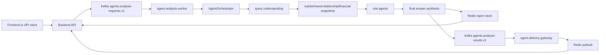

# GOPS Agent Architecture

이 문서는 GOPS 에이전트 자체를 설명하는 기준 문서다. 백엔드 연동은
`AGENT_BACKEND_INTEGRATION.md`, 프런트 연동은
`AGENT_FRONTEND_INTEGRATION.md`, AWS 빌드와 배포는 `AGENT_AWS_BUILD.md`를
따른다.

## 목적

GOPS 에이전트는 사용자 질의를 받아 시장 데이터, 뉴스, 온톨로지 관계, SEC 재무
근거를 모은 뒤 분석 리포트와 UI 제안을 만든다. 에이전트는 분석과 제안만
담당하며 주문 실행, 계좌 제어, 브로커 호출은 담당하지 않는다.

제품 방향은 다음 문장으로 정리한다.

```text
종목을 찾는 사람에게 기준을, 시장을 읽는 사람에게 방향을.
```

## Ownership Boundary

`systems/agent-orchestration`가 소유하는 범위:

- user query understanding
- `AgentOrchestrator` workflow
- market, news, relationship, financial snapshots
- role agent findings
- final answer synthesis
- analysis report serialization
- async worker, report store, delivery gateway contract
- market-event detection and notification-decision publishing
- provider adapters for market/news/ontology/financial/macro evidence

소유하지 않는 범위:

- frontend chat or panel rendering
- FastAPI auth/session policy
- AWS resource provisioning
- market-data and SEC fundamentals ingestion, backfill, and storage workers
- order, account, KIS, broker-control flows

에이전트는 절대 실주문을 실행하지 않는다. 주문 관련 의사결정이 필요하면
분석 근거와 사용자 확인을 위한 UI 제안까지만 만든다.

## Runtime Flow



`AGENT_ASYNC_ANALYSIS_ENABLED=false`이면 compatibility mode로 백엔드가
`agent-orchestrator` HTTP endpoint를 직접 호출할 수 있다. 기본 배포 방향은
Kafka queue, worker, Redis report store를 쓰는 async path다.

## Core Components

| Component | Role |
| --- | --- |
| `AgentOrchestrator` | 질의 이해, snapshot 수집, role agent 실행, synthesis를 묶는 workflow 진입점. |
| query understanding | 종목, 관계 종목, 테마, content task, UI task, route mode를 추출한다. |
| snapshots | market/news/relationship/financial/macro evidence를 bounded provider call로 수집한다. |
| role agents | 시장, 뉴스, 온톨로지, 재무, 리스크 등 역할별 finding을 만든다. |
| synthesis | evidence와 role finding을 기반으로 최종 답변과 리포트를 만든다. |
| report store | `analysisId`별 리포트, latest report, idempotency mapping을 저장한다. |
| delivery gateway | result topic을 Redis update channel로 fanout한다. |

`shared/gops_agents/orchestrator.py`는 compatibility import shim이고, 실제
workflow 구현은 `shared/gops_agents/orchestration/` 아래에 있다.

## Deterministic Safety Guardrail

Agent runtime은 외부 moderation 서비스 없이 deterministic sanitizer를 적용한다.
사용자 입력, provider evidence, synthesis payload, 최종 답변, serialized report의
문자열은 이메일, 전화번호, 한국 주민등록번호 후보, 계좌/API key/token/secret
패턴, URL query/fragment, 제한된 욕설 denylist를 마스킹한다. 마스킹이 발생하면
`finalResponse.risk_warnings` 또는 `agentTrace.inputGuardrail.warnings`에
`pii_redacted`, `profanity_removed`, `sensitive_url_redacted` 같은 원인 코드만
남기고 원문 값은 저장하거나 반환하지 않는다.

## Provider Boundary

Provider는 외부 데이터 fetch boundary다. 최종 답변 생성기나 UI command
engine이 아니다.

고정 방향:

```text
external code -> GOPS provider adapter -> ProviderRequest -> list[EvidenceItem]
```

외부 팀 코드나 ontofront branch의 데이터 로직을 가져올 때도 GOPS
architecture를 교체하지 않는다. 뉴스/온톨로지 검색, structured facts,
relationship rows, citations만 provider adapter로 감싼다.

```python
@dataclass
class ProviderRequest:
    symbol: str
    intent: str
    symbols: tuple[str, ...] = ()
```

| Field | Meaning |
| --- | --- |
| `symbol` | primary ticker, 예: `NVDA`. |
| `intent` | 원문 사용자 의도. retrieval hint로만 사용한다. |
| `symbols` | multi-symbol query나 관계 분석에 쓰는 확장 ticker 목록. |

```python
@dataclass
class EvidenceItem:
    provider: str
    status: str
    title: str
    summary: str
    observedAt: str
    url: str | None = None
    raw: dict[str, Any] = {}
```

| Field | Requirement |
| --- | --- |
| `provider` | `market`, `news`, `ontology`, `financial`, `macro` 같은 evidence source. |
| `status` | `available` 또는 `no-data`. |
| `title` | 짧은 evidence 제목. |
| `summary` | 최종 답변 문장이 아니라 사실 요약. |
| `observedAt` | source timestamp가 있으면 그것을 쓰고, 없으면 UTC ISO timestamp. |
| `url` | 뉴스나 source URL이 있으면 보존한다. |
| `raw` | ranking, citations, freshness, relation type, graph metadata 등 디버그 가능한 원천 메타데이터. |

Provider 실패나 빈 결과는 예외로 전체 분석을 멈추지 않는다. 반드시
`status="no-data"` evidence로 degrade한다.

## Provider Types

| Provider | Runtime dependency | Behavior |
| --- | --- | --- |
| Market | Redis, ClickHouse | chart/quote/candle 기반 snapshot을 만든다. |
| News | Redis, ClickHouse, optional Alpaca fallback | cached news intelligence와 article rows를 evidence로 바꾼다. |
| Ontology | GraphDB, optional Redis path cache | `GraphDBOntologyProvider`가 기업 관계, peer, theme, path evidence를 만든다. |
| Financial | Redis, ClickHouse | SEC companyfacts/frames에서 미리 계산한 fundamentals snapshot을 evidence로 바꾼다. 사용자 요청 hot path에서는 SEC API를 호출하지 않는다. |
| Macro | none in v1 | v1에서는 intentional empty adapter다. |

News provider는 `provider="news"` evidence만 반환한다. Ontology provider는
`provider="ontology"` evidence를 반환하고 가능한 경우
`raw["relationType"]`, ticker, confidence, source URL, theme, sector, graph node
metadata를 보존한다.
Financial provider는 `provider="financial"` evidence만 반환한다. `missing_source`,
`stale`, `frame_coverage_gap`, `equity_includes_nci` 같은 상태는
`EvidenceItem.status`가 아니라 `raw["quality"]` 또는 snapshot `warnings`에
담는다. `EvidenceItem.status`는 `available` 또는 `no-data`만 사용한다.

GraphDB가 없거나 timeout이면 ontology snapshot은 no-data evidence가 되고,
market/news 근거만으로 분석은 계속된다. Kafka나 ClickHouse가 있다는 사실만으로
GraphDB ontology query가 성공하는 것은 아니다.

## Query And Route Modes

Hot path query understanding은 bounded fan-out으로 실행된다.

- Korean entity/theme resolver
- deterministic content-task rules
- deterministic UI-task rules
- optional classifier pod or OpenAI classifier

Route mode:

```text
analysis
ui_layout
hybrid
clarify
```

Company and theme resolution은 catalog 기반이다.
`config/entity-aliases.json`이 운영 alias catalog다.
`config/entity-aliases.seed.json`과 seed constants는 bootstrap fallback이며
운영 source of truth가 아니다. agent runtime은 시작 시 catalog/index cache를
warm하고, 회사 지원 여부는 alias 존재 여부가 아니라 market-data symbol
registry/universe 기준으로 검증한다.

## Runtime Units

| Runtime | Required | Role |
| --- | --- | --- |
| `agent-orchestrator` | yes | HTTP compatibility endpoint and direct report lookup. |
| `agent-analysis-worker` | yes | hot analysis request를 소비하고 report를 저장한다. |
| `agent-delivery-gateway` | yes for async/SSE | result event를 Redis report update로 mirror한다. |
| `agent-intent-classifier` | no | ambiguous query를 위한 optional cheap classifier. |
| `deep-analysis-worker` | no | opt-in deep analysis request를 처리한다. |
| `event-detector` | no | market Kafka topics를 agent market events로 바꾼다. |
| `notification-publisher` | no | notification decision을 Redis/WebSocket consumer에 fanout한다. |
| `graph-expansion-refresh` | no | GraphDB hint를 Redis/ClickHouse cache로 materialize한다. |
| `sec-companyfacts-backfill` | no | SEC companyfacts bulk ZIP을 S3에 저장하고 ClickHouse/Redis fundamentals projection을 만든다. |
| `sec-fundamentals-reconcile` | future | ClickHouse 최신 revision과 Redis cache를 비교해 stale cache를 재작성한다. Hot path stale check를 하지 않는다. |
| smoke/eval jobs | no | queue, store, graph, latency, retrieval, grounding checks. |

Agent runtime은 `gops-agent-orchestrator` image를 공유한다. SEC
companyfacts backfill은 S3/ClickHouse helpers를 재사용하기 위해
`gops-market-storage` image에서 실행된다.

## Package Layout

```text
systems/agent-orchestration/
  config/                 UI lexicon, operational entity aliases, fallback aliases
  shared/gops_agents/
    contracts/            report, evidence, route, snapshot dataclasses
    query_understanding/  Korean-first entity/theme resolution
    intent_understanding/ content/UI intent decomposition
    orchestration/        workflow, routing, timing, cache, tracing
    runtime/              queues, workers, report store, delivery
    retrieval/            graph expansion, snapshots, bulkheads
    providers/            news, ontology, macro adapters and caches
    roles/                logical role agents and AgentContext
    synthesis/            final answer synthesis
    events/               market event detection and notifications
  pods/                   runtime entrypoint wrappers
  jobs/                   smoke, refresh, benchmark, eval entrypoints
  tests/                  unit and contract tests

systems/fundamentals/
  jobs/sec-companyfacts-backfill/
  shared/fundamentals/    SEC concept map, deterministic metrics, Redis keys, DDL contracts
  tests/                  fundamentals normalization and metric tests
```

Current provider implementation still imports `alfaka.*` helpers from
`systems/market-data/shared` for Kafka JSON IO, ClickHouse/Redis market
providers, news relevance, Alpaca news fallback, and ClickHouse writes. If this
dependency is removed later, create agent-owned provider interfaces first.

## Important Contracts

Kafka topics:

```text
agents.market-events.v1
agents.analysis-requests.v1
agents.deep-analysis-requests.v1
agents.analysis-results.v1
agents.query-understanding-events.v1
agents.notification-decisions.v1
agents.dlq.v1
```

Redis report keys and channels:

```text
agent:report:{analysisId}
agent:report:latest:{SYMBOL}
agent:report:latest
agent:request:idempotency:{userHash}:{keyHash}
agent.reports
agent.reports:{analysisId}
gops:agent:graph-expansion:v1:{symbol}
gops:agent:graph-path:{...}
gops:fundamentals:summary:v1:{SYMBOL}
gops:fundamentals:peer:v1:{SYMBOL}:latest
gops:fundamentals:peer:v1:{SYMBOL}:{FRAME_PERIOD}
```

Fundamentals Redis cache is trusted on the agent hot path. Stale detection is
performed by SEC backfill/reconcile jobs, not by querying ClickHouse on every
Redis hit.

ClickHouse tables used by agent providers:

```text
market_data.symbols
market_data.news_articles
market_data.news_article_localizations
market_data.news_company_daily_summaries
market_data.agent_graph_expansions
market_data.sec_company_tickers
market_data.sec_filing_events
market_data.sec_raw_artifacts
market_data.sec_financial_facts
market_data.sec_derived_metrics
market_data.sec_frames
market_data.sec_collection_runs
```

Financial role contract:

```text
role = financial
agent id = financial-agent
finding role = financial-analysis
evidence provider = financial
```

Snapshot bundle additions:

```text
financial_analysis -> financial_snapshot, risk_policy_snapshot
financial_comparison -> financial_snapshot, financial_peer_snapshot, risk_policy_snapshot
financial_news_analysis -> financial_snapshot, news_snapshot, risk_policy_snapshot
```

## Validation

```sh
git diff --check
.venv/bin/python -m unittest discover -s systems/agent-orchestration/tests -p 'test_*.py'
.venv/bin/python -m unittest discover -s systems/fundamentals/tests -p 'test_*.py'
```

Backend bridge changes should also run:

```sh
.venv/bin/python -m unittest discover -s systems/api-server/tests -p 'test_agent_routes.py'
```
