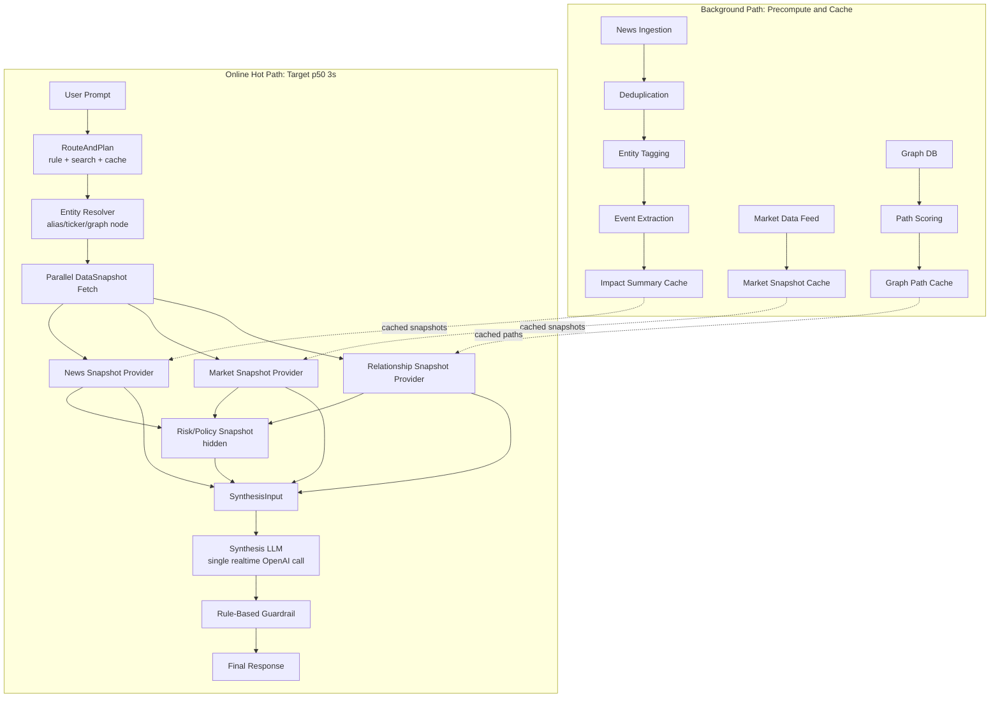

# Multi-Agent Stock Trading Platform AI Architecture

이 문서는 멀티에이전트 기반 주식 트레이딩 플랫폼의 AI 아키텍처 기준 문서다. 현재 단계에서는 Kafka, UI 패널 payload, topic/event stream 같은 전송 계층은 제외한다. 초점은 **3초대 응답을 목표로 하는 멀티 데이터 snapshot provider + 싱글 Synthesis LLM 구조**에 둔다.

핵심 전제는 다음과 같다.

- 사용자 경험 목표는 cached hot path 기준 **p50 3초대 응답**이다.
- 온라인 요청에서 OpenAI API 실시간 호출은 기본적으로 **Synthesis LLM 1회**만 허용한다.
- `Market Agent`, `News Agent`, `Relationship Impact Agent`는 런타임 LLM 분석가가 아니라 **Data Snapshot Provider**다.
- 뉴스, 시장, 그래프 관계 분석은 가능한 한 백그라운드에서 사전 계산하고 캐시한다.
- 모델 종류를 마음대로 바꿀 수 없다는 전제하에, 최적화는 요청 수, 입력 토큰, 출력 토큰, 캐시, 사전 계산으로 해결한다.
- 현재 구현 기준 hot path는 `RoutePlan` 생성, `ResolvedEntity` 생성, market/news/relationship `DataSnapshot` 병렬 조회, hidden `risk_policy_snapshot` 생성, `SynthesisInput` 구성, `FinalResponse` 반환 순서다.

참고 원칙:

- OpenAI latency optimization guide: https://developers.openai.com/api/docs/guides/latency-optimization
- OpenAI prompt caching guide: https://developers.openai.com/api/docs/guides/prompt-caching

> 주의: 이 시스템은 투자 판단을 보조하는 분석 도구이며, 최종 답변은 투자 권유나 수익 보장을 의미하지 않는다. Guardrail 단계는 이 원칙을 모든 최종 응답에 반영해야 한다.

## 1. Design Goals

- 사용자는 하나의 입력창에 자연어 질문을 입력한다.
- 시스템은 질문 의도, 대상 기업/종목, 기간, 필요한 데이터 묶음을 빠르게 파악한다.
- 온라인 요청의 기본 LLM 호출 수는 1회다.
- route, entity resolve, data snapshot fetch, guardrail은 기본적으로 룰/검색/DB/캐시 기반으로 처리한다.
- 데이터 에이전트는 장문의 분석 보고서를 만들지 않고, 짧고 구조화된 snapshot을 반환한다.
- 최종 사용자 답변은 `Synthesis LLM`이 cached snapshot들을 취합해 생성한다.
- `Guardrail`은 기본적으로 룰 기반으로 동작하고, LLM guardrail은 degraded path에서만 허용한다.
- 출력 토큰을 제한한다. 출력이 길어질수록 latency와 비용이 증가하므로 Synthesis 응답은 짧고 근거 중심이어야 한다.
- OpenAI prompt caching이 작동하기 쉽도록 고정 system prompt, schema, few-shot 예시는 prompt 앞부분에 고정한다.

## 2. High-Level Architecture

이 아키텍처는 백그라운드 사전 계산 경로와 온라인 요청 경로를 분리한다.



### Component Summary

| Component | Runtime Behavior | Main Responsibility |
| --- | --- | --- |
| `RouteAndPlan` | Rule/search/cache first | Intent와 필요한 snapshot bundle을 결정한다. |
| `Entity Resolver` | DB/alias/fuzzy search first | 사용자 표현을 ticker, canonical entity, graph node로 변환한다. |
| `Market Snapshot Provider` | Cache/DB query | 시장 레짐, 섹터 흐름, 거시 위험 snapshot을 반환한다. |
| `News Snapshot Provider` | Cached news intelligence query | 사전 처리된 뉴스 이벤트, 감성, 영향 방향을 반환한다. |
| `Relationship Snapshot Provider` | `GraphDBOntologyProvider`/path cache | 기업 간 직접/간접 영향 경로와 path score를 `relationship_snapshot`으로 반환한다. |
| `Risk/Policy Snapshot` | Rule/computed | confidence cap, 투자 조언 제한, 데이터 누락 위험을 내부 snapshot으로 반환한다. UI trace에는 기본 노출하지 않는다. |
| `Synthesis LLM` | Realtime LLM call 1회 | snapshot들을 취합해 사용자 답변 초안을 생성한다. |
| `Rule-Based Guardrail` | Rule only by default | 금지 표현, 과신, 데이터 누락, schema를 검증한다. |

## 3. Latency Policy

3초대 응답은 cached hot path 기준 목표다. 캐시 miss, 외부 API 직접 조회, route LLM fallback, LLM guardrail은 degraded path로 분리한다.

### 3.1 LatencyBudget

```ts
type LatencyBudget = {
  target_total_ms: 3000;
  route_and_plan_ms: 300;
  entity_resolve_ms: 100;
  snapshot_fetch_parallel_ms: 700;
  synthesis_llm_ms: 1700;
  guardrail_ms: 200;
};
```

예상 hot path:

```text
RouteAndPlan          0-300ms
Entity Resolver       0-100ms
Parallel Snapshots    100-700ms
Synthesis LLM         700-2400ms
Rule Guardrail        2400-2600ms
Response finalize     2600-3000ms
```

### 3.2 RuntimePolicy

```ts
type RuntimePolicy = {
  max_realtime_llm_calls: 1;
  default_route_strategy: "rule_search_cache";
  route_llm_fallback: "degraded_only";
  route_llm_fallback_threshold: 0.75;
  llm_guardrail: "degraded_only";
  total_timeout_ms: 3000;
  snapshot_timeout_ms: 700;
  synthesis_timeout_ms: 1700;
  graphdb_timeout_ms: 500;
  max_items_per_snapshot: 5;
  max_total_synthesis_evidence_items: 15;
  max_synthesis_output_tokens: 350;
  stream_synthesis_response: true;
};
```

### 3.3 OpenAI Latency Principles Applied

OpenAI latency guide의 원칙을 이 시스템에 적용하면 다음과 같다.

- **요청 수 줄이기**: route, plan, synthesis를 여러 LLM 호출로 쪼개지 않는다. 기본 hot path에서는 Synthesis LLM 1회만 호출한다.
- **출력 토큰 줄이기**: Synthesis 응답은 350 output tokens 이하를 목표로 한다. 긴 리포트는 별도 “deep analysis” 모드로 분리한다.
- **입력 토큰 줄이기**: 뉴스 원문, 전체 그래프 경로, 모든 시장 데이터를 넣지 않는다. 각 provider는 top-k snapshot만 넘긴다.
- **병렬화**: market/news/relationship snapshot은 병렬 조회하고, risk snapshot은 조회 결과 기반으로 생성한다.
- **Streaming**: Synthesis 응답은 가능한 streaming으로 시작해 perceived latency를 낮춘다.
- **LLM 남용 방지**: entity resolve, graph path scoring, guardrail은 기본적으로 LLM 밖에서 처리한다.
- **중앙 LLM budget**: UI/intent router, role analysis, final synthesis는 request 단위 budget을 통과해야 하며, 기본 hot path에서는 총 1회 초과 호출을 실행하지 않는다.

### 3.4 Prompt Caching Policy

OpenAI prompt caching을 활용하기 위해 Synthesis prompt는 다음 순서를 지킨다.

1. 고정 system instruction
2. 고정 output schema
3. 고정 reasoning policy
4. 고정 few-shot examples
5. 사용자 질문
6. resolved entities
7. market/news/relationship/risk snapshots

고정 prefix가 길고 안정적일수록 cache hit 가능성이 높다. prompt caching은 1024 tokens 이상 prompt에서 효과를 기대할 수 있으므로, 실제 운영에서는 `cached_tokens`를 반드시 로깅한다.

## 4. Orchestration Flow

### 4.1 Background Precomputation Flow

백그라운드 경로는 사용자 요청 전에 가능한 분석을 미리 끝내는 영역이다.

1. 뉴스 원문을 수집한다.
2. 중복 뉴스를 제거한다.
3. 뉴스에서 기업, 인물, 섹터, 국가, 상품 등 entity를 태깅한다.
4. 이벤트 타입을 추출한다. 예: earnings, supply_chain, regulation, lawsuit, M&A, product, macro.
5. 이벤트별 영향 방향, 기간, 관련 entity, confidence를 계산하거나 offline LLM으로 요약한다.
6. 시장 데이터에서 market regime, sector trend, volatility, macro risk snapshot을 주기적으로 생성한다.
7. Graph DB에서 자주 쓰이는 entity pair의 path score를 캐시한다.

백그라운드 path에서는 LLM을 써도 된다. 단, 이 비용과 latency는 사용자 online latency에 직접 포함되지 않아야 한다.

### 4.2 Online Hot Path

온라인 요청 경로는 3초대 목표를 맞춰야 하는 영역이다.

1. 사용자가 자연어 prompt를 입력한다.
2. `RouteAndPlan`이 rule/search/cache 기반으로 intent와 snapshot bundle을 결정한다.
3. `Entity Resolver`가 alias table, ticker table, graph node mapping, fuzzy search로 entity를 표준화한다.
4. market/news/relationship snapshot을 병렬 조회한다.
5. 조회 결과를 바탕으로 hidden `risk_policy_snapshot`을 생성한다.
6. `SynthesisInput`을 구성한다. 각 snapshot은 최대 5개 item만 포함한다.
7. `Synthesis LLM`을 1회 호출한다.
8. `Rule-Based Guardrail`이 최종 응답을 검증하고 필요하면 confidence와 문구를 조정한다.
9. 사용자에게 `FinalResponse`를 반환한다.

### 4.3 Broad Retrieval Policy

룰 기반 route가 놓칠 수 있는 문제를 줄이기 위해, 애매할 때 에이전트를 줄이지 않고 데이터 번들을 넓게 조회한다.

- `investment_opinion`이면 기본적으로 market, news, relationship, risk snapshot을 모두 조회한다.
- `relationship_impact_analysis`이면 news, relationship, risk snapshot을 조회한다.
- entity confidence가 낮으면 top-3 entity candidates를 유지하고 Synthesis에 넘긴다.
- route confidence가 낮으면 route LLM을 바로 호출하지 않고 broad retrieval 또는 clarification을 우선 고려한다.
- route LLM fallback은 3초 목표를 포기하는 degraded path로 분리한다.

## 5. Core Interfaces

아래 타입은 구현 언어와 무관한 논리 계약이다. 실제 구현 시 Pydantic, TypeScript interface, JSON Schema 중 팀 표준에 맞춰 변환한다.

### 5.1 UserPromptInput

```ts
type UserPromptInput = {
  prompt: string;
  session_id: string;
  user_context?: {
    locale?: string;
    preferred_market?: "US" | "KR" | "GLOBAL";
    risk_profile?: "conservative" | "balanced" | "aggressive";
    portfolio_context_available?: boolean;
  };
  created_at: string;
};
```

### 5.2 RoutePlan

`Prompt Orchestrator`와 `Plan Builder`를 합친 결과다.

```ts
type RoutePlan = {
  run_id: string;
  intent:
    | "investment_opinion"
    | "news_impact_analysis"
    | "relationship_impact_analysis"
    | "market_summary"
    | "company_comparison"
    | "general_question";
  route_confidence: number;
  entity_candidates: string[];
  snapshot_bundle: SnapshotType[];
  execution_mode: "parallel_snapshots" | "degraded_route_llm" | "clarification_required";
  llm_calls_allowed: number;
};
```

### 5.3 ResolvedEntity

```ts
type ResolvedEntity = {
  raw_name: string;
  canonical_name: string;
  ticker?: string;
  market?: "US" | "KR" | "GLOBAL";
  asset_type: "stock" | "etf" | "index" | "sector" | "macro" | "unknown";
  graph_node_id?: string;
  aliases?: string[];
  confidence: number;
};
```

### 5.4 DataSnapshot

데이터 에이전트가 반환하는 공통 snapshot 계약이다.

```ts
type DataSnapshot = {
  snapshot_id: string;
  run_id: string;
  snapshot_type: SnapshotType;
  status: "success" | "partial" | "failed" | "skipped";
  source: "cache" | "database" | "computed" | "llm_offline" | "llm_fallback";
  cache_hit: boolean;
  freshness: {
    generated_at: string;
    expires_at?: string;
    stale: boolean;
  };
  summary: string;
  signals: AgentSignal[];
  evidence: EvidenceItem[];
  data_quality: "low" | "medium" | "high";
  confidence: number;
  latency_ms: number;
  warnings: string[];
};
```

### 5.5 AgentResult

기존 agent contract와 호환하기 위해 `AgentResult`는 유지한다. 단, online hot path에서는 `DataSnapshot`을 우선 사용한다.

```ts
type AgentResult = {
  task_id: string;
  agent_type: AgentType;
  status: "success" | "partial" | "failed" | "skipped";
  source: "cache" | "database" | "computed" | "llm_offline" | "llm_fallback";
  cache_hit: boolean;
  freshness: DataSnapshot["freshness"];
  summary: string;
  signals: AgentSignal[];
  evidence: EvidenceItem[];
  data_quality: "low" | "medium" | "high";
  confidence: number;
  latency_ms: number;
  warnings: string[];
};
```

### 5.6 AgentSignal

```ts
type AgentSignal = {
  target: string;
  direction: "bullish" | "bearish" | "neutral" | "mixed" | "unknown";
  horizon: "intraday" | "short_term" | "mid_term" | "long_term" | "unknown";
  strength: "low" | "medium" | "high";
  reasoning: string;
};
```

### 5.7 EvidenceItem

```ts
type EvidenceItem = {
  source_type:
    | "market_data"
    | "news"
    | "graph_path"
    | "financial_data"
    | "policy_rule"
    | "model_inference"
    | "unknown";
  title: string;
  summary: string;
  source_ref?: string;
  observed_at?: string;
  reliability: "low" | "medium" | "high";
};
```

### 5.8 SynthesisInput

온라인 hot path에서 Synthesis LLM에 들어가는 유일한 입력이다.

```ts
type SynthesisInput = {
  run_id: string;
  original_prompt: string;
  intent: RoutePlan["intent"];
  entities: ResolvedEntity[];
  snapshots: DataSnapshot[];
  missing_data: string[];
  risk_warnings: string[];
  output_policy: {
    max_output_tokens: number;
    require_uncertainty_disclosure: boolean;
    prohibit_direct_investment_command: boolean;
  };
};
```

SynthesisInput 구성 규칙:

- snapshot별 evidence는 최대 5개만 포함한다.
- 원문 뉴스 전체를 넣지 않는다.
- graph path 전체가 길면 top path 3개만 넣는다.
- market data는 핵심 지표와 summary만 넣는다.
- `warnings`와 `missing_data`는 반드시 포함한다.

### 5.9 FinalResponse

```ts
type FinalResponse = {
  run_id: string;
  answer_type:
    | "investment_opinion"
    | "market_summary"
    | "relationship_analysis"
    | "news_impact_summary"
    | "general_answer";
  summary: string;
  key_points: string[];
  bullish_points: string[];
  bearish_points: string[];
  relationship_impacts: string[];
  risk_warnings: string[];
  data_freshness_warnings: string[];
  partial_data_used: boolean;
  confidence: number;
  final_stance: "buy" | "sell" | "hold" | "watch" | "avoid" | "not_applicable";
  latency_ms: number;
  llm_calls_used: number;
};
```

### 5.10 LatencyTrace

모든 run은 stage별 latency와 token usage를 남겨야 한다.

```ts
type LatencyTrace = {
  run_id: string;
  total_latency_ms: number;
  llm_calls_used: number;
  stages: Array<{
    stage:
      | "route_and_plan"
      | "entity_resolve"
      | "snapshot_fetch"
      | "synthesis_llm"
      | "guardrail"
      | "response_finalize";
    latency_ms: number;
    cache_hit?: boolean;
    input_tokens?: number;
    output_tokens?: number;
    cached_tokens?: number;
    status: "success" | "partial" | "failed";
  }>;
};
```

### 5.11 Shared Enums

```ts
type SnapshotType =
  | "market_snapshot"
  | "news_snapshot"
  | "relationship_snapshot"
  | "risk_policy_snapshot";

type AgentType =
  | "route_and_plan"
  | "entity_resolver"
  | "market_snapshot_provider"
  | "news_snapshot_provider"
  | "relationship_snapshot_provider"
  | "risk_policy_provider"
  | "synthesis_llm"
  | "rule_guardrail";
```

## 6. Agent Responsibilities

### 6.1 RouteAndPlan

`RouteAndPlan`은 사용자 질문을 해석하고 어떤 snapshot bundle을 가져올지 결정한다. 기본 구현은 룰, 키워드, embedding search, 최근 세션 context, entity 후보 검색을 조합한다.

이 단계에서는 OpenAI API를 호출하지 않는 것이 기본이다.

책임:

- intent 분류
- entity 후보 추출
- snapshot bundle 결정
- broad retrieval 여부 결정
- route confidence 계산
- degraded path 여부 판단

기본 라우팅:

| Intent | Snapshot Bundle |
| --- | --- |
| `investment_opinion` | `market_snapshot`, `news_snapshot`, `relationship_snapshot`, `risk_policy_snapshot` |
| `news_impact_analysis` | `news_snapshot`, `relationship_snapshot`, `risk_policy_snapshot` |
| `relationship_impact_analysis` | `news_snapshot`, `relationship_snapshot`, `risk_policy_snapshot` |
| `market_summary` | `market_snapshot`, `risk_policy_snapshot` |
| `company_comparison` | `market_snapshot`, `news_snapshot`, `relationship_snapshot`, `risk_policy_snapshot` |
| `general_question` | `risk_policy_snapshot` |

route confidence가 낮을 때:

- entity 후보 top-3를 유지한다.
- snapshot bundle을 좁히지 않는다.
- 필요한 경우 clarification을 반환한다.
- route LLM fallback은 degraded path로 기록한다.

### 6.2 Entity Resolver

사용자 표현을 내부 표준 entity로 바꾼다. 이 단계는 LLM 호출 없이 처리하는 것이 기본이다.

사용 데이터:

- alias table
- ticker table
- company master table
- graph node mapping
- fuzzy search index
- 최근 사용자 세션 context

예:

- "엔비디아" -> `NVIDIA Corporation`, `NVDA`, `company:nvidia`
- "삼전" -> `Samsung Electronics`, `005930.KS`, `company:samsung_electronics`
- "반도체" -> `Semiconductor Sector`, sector node
- "젠슨황 회사" -> `NVIDIA Corporation`

confidence가 낮으면 top 후보를 유지하고 Synthesis에 ambiguity를 넘긴다. 애매한 entity를 강제로 하나로 확정하지 않는다.

### 6.3 Market Snapshot Provider

시장 전체 환경을 snapshot으로 제공한다. 실시간 LLM 분석을 하지 않는다.

Background에서 생성할 것:

- market regime
- sector trend
- volatility/risk level
- macro indicators
- index/sector movement summary

Online에서 할 것:

- target market과 sector 기준 cached snapshot 조회
- freshness 확인
- stale이면 warning 추가
- 핵심 signal top 5 이하 반환

예시:

```json
{
  "snapshot_type": "market_snapshot",
  "source": "cache",
  "cache_hit": true,
  "summary": "미국 기술주는 단기 변동성이 높지만 AI 관련 대형주는 상대적으로 강한 흐름입니다.",
  "signals": [
    {
      "target": "US Technology Sector",
      "direction": "mixed",
      "horizon": "short_term",
      "strength": "medium",
      "reasoning": "AI 수요 기대는 유지되지만 금리와 밸류에이션 부담이 공존합니다."
    }
  ],
  "data_quality": "high",
  "confidence": 0.68,
  "latency_ms": 120,
  "warnings": []
}
```

### 6.4 News Snapshot Provider

뉴스 에이전트는 온라인에서 뉴스를 새로 수집하고 LLM으로 분석하는 컴포넌트가 아니다. 온라인에서는 **cached news intelligence provider**로 동작한다.

Background에서 생성할 것:

- news ingestion
- deduplication
- entity tagging
- event type classification
- sentiment/impact direction
- horizon estimate
- related entity extraction
- source reliability score
- compact summary

Online에서 할 것:

- resolved entity 기준 relevant event top 5 조회
- 직접 매칭 뉴스와 sector/supply-chain 간접 뉴스 모두 포함
- freshness와 source reliability 확인
- 뉴스가 없으면 `no_relevant_news_found` warning 반환

최소 출력:

- 핵심 이벤트
- 영향 방향
- 영향 기간
- 관련 entity
- source reliability
- confidence
- freshness warning

뉴스 원문 전체는 SynthesisInput에 넣지 않는다. Synthesis에는 event title, compact summary, impact, evidence ref만 넘긴다.

### 6.5 Relationship Snapshot Provider

GraphDB 기반 관계 영향을 `relationship_snapshot`으로 제공한다. 핵심은 LLM 추론이 아니라 SPARQL query, relation normalization, path scoring, cache다.

현재 구현:

- `RelationshipSnapshotProvider`는 `ProviderRequest(symbol, intent)`를 만들어 ontology provider를 호출한다.
- `GraphDBOntologyProvider`는 `GRAPHDB_SPARQL_URL`의 SPARQL endpoint를 조회한다.
- GraphDB hot path 기본 timeout은 500ms이며 `GRAPHDB_TIMEOUT_SECONDS` 또는 `AGENT_GRAPHDB_TIMEOUT_MS`로 조정한다.
- 조회 결과는 `EvidenceItem(provider="ontology")`로 normalize된 뒤 `DataSnapshot(snapshot_type="relationship_snapshot")`으로 변환된다.
- 현재 relation type은 `theme`, `control`, `theme-company`, `theme-control`, `no-direct-control`, `no-ontology-evidence`, `graphdb-unavailable`이다.
- ontology evidence가 없으면 `status="partial"`과 `no_clear_relationship_path` warning을 반환한다.
- GraphDB timeout/error는 provider evidence의 `raw.relationType="graphdb-unavailable"`로 표현된다.

GraphDB 담당자 TODO:

- ticker, company, theme, control 관계를 안정적으로 반환하는 SPARQL query를 보강한다.
- `theme`, `control`, supply-chain, competitor, customer, supplier 같은 relation type normalize 규칙을 확정한다.
- target entity와 news/sector/source entity 간 path score를 계산한다.
- 자주 쓰이는 entity pair의 graph path cache를 붙인다.
- GraphDB empty, timeout, partial path, direct path missing case의 warning을 명확히 구분한다.
- 상세 구현 범위는 `docs/GRAPHDB_RELATIONSHIP_AGENT_HANDOFF.md`를 따른다.

Background에서 생성할 것:

- 자주 쓰이는 entity pair path cache
- supplier/customer/competitor/partner 관계 score
- sector-level influence map
- 뉴스 entity와 기업 node 연결 후보

Online에서 할 것:

- target entity와 news/sector/source entity 간 graph path 조회
- max depth 제한
- path score 계산
- top path 3개 이하 반환
- 명확한 경로가 없으면 `no_clear_relationship_path` warning 반환

예시:

```json
{
  "snapshot_type": "relationship_snapshot",
  "source": "database",
  "cache_hit": true,
  "summary": "TSMC 공급망 이슈는 NVIDIA와 Apple에 간접 영향을 줄 수 있습니다.",
  "signals": [
    {
      "target": "NVIDIA Corporation",
      "direction": "bearish",
      "horizon": "short_term",
      "strength": "medium",
      "reasoning": "TSMC는 NVIDIA GPU 생산망의 핵심 파운드리로 연결됩니다."
    }
  ],
  "evidence": [
    {
      "source_type": "graph_path",
      "title": "TSMC -> NVIDIA supply chain path",
      "summary": "TSMC is connected to NVIDIA through semiconductor manufacturing relationship.",
      "source_ref": "graph_path:tsmc:nvidia:manufacturing",
      "reliability": "high"
    }
  ],
  "data_quality": "high",
  "confidence": 0.74,
  "latency_ms": 180,
  "warnings": []
}
```

### 6.6 Risk/Policy Snapshot Provider

룰 기반으로 최종 답변의 제한 조건을 제공한다.

포함 항목:

- 투자 권유 직접 명령 금지
- confidence cap
- partial data warning
- stale data warning
- high volatility warning
- entity ambiguity warning
- missing evidence warning

이 snapshot은 Synthesis LLM이 답변을 만들 때부터 보수적 표현을 쓰도록 입력에 포함된다.

### 6.7 Synthesis LLM

Synthesis LLM은 online hot path에서 기본적으로 유일한 OpenAI API 호출 지점이다.

역할:

- 사용자 질문에 맞게 snapshot을 취합한다.
- bullish/bearish/neutral 근거를 구분한다.
- 관계 영향과 뉴스 영향을 단정하지 않고 evidence 수준에 맞게 표현한다.
- data freshness와 missing data를 반영한다.
- 짧고 구조화된 최종 답변 초안을 만든다.

제약:

- `SynthesisInput` 밖의 사실을 새로 만들어내지 않는다.
- output은 350 tokens 이하를 목표로 한다.
- 직접적인 매수/매도 명령형 표현을 피한다.
- 근거 부족 시 `watch` 또는 `not_applicable` 쪽으로 보수적으로 둔다.

권장 출력 구조:

```json
{
  "summary": "현재 정보 기준으로는 매수보다 관망에 가깝습니다.",
  "key_points": ["AI 수요 기대는 유지됩니다.", "단기 뉴스 리스크는 혼재되어 있습니다."],
  "bullish_points": ["AI 관련 수요 기대"],
  "bearish_points": ["밸류에이션 부담", "공급망 이벤트 리스크"],
  "relationship_impacts": ["TSMC 관련 이슈는 NVIDIA 공급망에 간접 영향을 줄 수 있습니다."],
  "risk_warnings": ["뉴스 데이터 freshness를 확인해야 합니다."],
  "confidence": 0.66,
  "final_stance": "watch"
}
```

### 6.8 Rule-Based Guardrail

Guardrail은 기본적으로 LLM을 호출하지 않는다. 3초대 목표를 지키기 위해 deterministic validation과 text policy rule을 사용한다.

검증 항목:

- `FinalResponse` schema 만족 여부
- `llm_calls_used <= 1`
- confidence 범위
- missing data 반영 여부
- stale data warning 반영 여부
- 근거 없는 단정 표현
- 직접 투자 명령형 표현
- 관계 그래프 경로가 없는데 causal impact를 단정하는 표현

조정 예:

- "지금 매수하세요." -> "현재 정보만 기준으로는 매수보다 관망에 가깝습니다."
- evidence가 부족한 `buy` -> `watch`
- partial data가 true인데 warning이 없으면 warning 추가

LLM guardrail이 필요한 경우:

- schema는 맞지만 문장 정책 위반 여부가 애매한 경우
- 법적/컴플라이언스 검토가 필요한 고위험 응답
- 사용자가 매우 공격적인 투자 실행을 요구하는 경우

이 경우 `llm_guardrail = degraded_only`로 기록하고 3초 목표에서 제외한다.

## 7. Failure and Degraded Paths

### 7.1 Cache Miss

처리:

- 외부 API를 online hot path에서 직접 호출하지 않는 것이 기본이다.
- 캐시가 없으면 partial snapshot을 반환한다.
- `warnings`에 cache miss를 남긴다.
- Synthesis는 데이터 부족을 명시한다.

### 7.2 Route Ambiguity

처리:

- route confidence가 낮으면 broad retrieval을 우선한다.
- entity 후보 top-3를 유지한다.
- 그래도 답변 품질이 위험하면 clarification을 반환한다.
- route LLM fallback은 degraded path로만 허용한다.

### 7.3 News Snapshot Empty

처리:

- `status = "partial"` 또는 `"success"` with warning.
- `warnings`에 `no_relevant_news_found`를 남긴다.
- 뉴스 기반 단기 판단을 강화하지 않는다.
- confidence cap을 적용한다.

### 7.4 Graph Path Not Found

처리:

- `warnings`에 `no_clear_relationship_path`를 남긴다.
- 관계 영향은 `unknown` 또는 `not confirmed`로 표현한다.
- causal relationship을 단정하지 않는다.

### 7.5 Synthesis LLM Timeout

처리:

- 짧은 fallback template을 사용해 snapshot summary 기반 응답을 생성한다.
- `llm_calls_used`와 timeout을 기록한다.
- 사용자에게 partial response임을 알린다.

## 8. Implementation Status And Checklist

현재 구현 반영 상태:

| Area | Status |
| --- | --- |
| Core contracts | `RuntimePolicy`, `RoutePlan`, `ResolvedEntity`, `DataSnapshot`, `SynthesisInput`, `FinalResponse`, `LatencyTrace`가 정의되어 있다. |
| Route and entity | rule/search/cache 기반 route와 ticker 중심 `ResolvedEntity` 생성이 들어가 있다. |
| Snapshot execution | market/news/relationship snapshot은 병렬 조회하고, `risk_policy_snapshot`은 내부 snapshot으로 뒤에 붙인다. |
| News provider | ClickHouse/Redis/Kafka fallback 계층을 따르는 cached news provider를 사용한다. |
| Relationship provider | `RelationshipSnapshotProvider`와 `GraphDBOntologyProvider`가 존재하지만 path scoring/cache는 GraphDB 담당자 TODO다. |
| Synthesis and guardrail | `SynthesisInput`에서 `FinalResponse`로 변환하고 rule-based guardrail을 적용한다. |
| Report store | `ReportStore`, memory store, Redis latest-report store 코드가 있다. Redis TTL 기본값은 12시간이며 pod wiring과 Postgres 장기 저장은 후속 runtime/storage 변경으로 분리한다. |
| Runtime safety | snapshot timeout과 request 단위 LLM budget을 적용해 timeout/예산 초과를 trace와 warning에 남긴다. |

남은 구현 우선순위:

1. GraphDB SPARQL query coverage 확장
2. graph relation normalization 규칙 확정
3. graph path scoring/cache 구현
4. relationship warning taxonomy 정리
5. prompt prefix caching이 가능하도록 고정 instruction/schema/few-shot 분리
6. `LatencyTrace`와 token usage logging 강화
7. Redis latest report activation과 Postgres 장기 저장 schema를 별도 storage 문서에서 확정
8. cache hit/miss, freshness, partial data logging 강화
9. degraded path 분리

성공 기준은 분석 품질 완성보다 다음을 먼저 만족하는 것이다.

- cached hot path에서 LLM 호출 1회
- p50 3초대 응답
- snapshot별 latency 계측
- output token cap 준수
- partial data warning 누락 없음
- `risk_policy_snapshot`은 최종 응답 생성에는 사용하지만 기본 UI trace에는 노출하지 않음

## 9. Test Scenarios

### Scenario 1: Investment Opinion

입력:

```text
엔비디아 지금 사도 돼?
```

기대:

```json
{
  "intent": "investment_opinion",
  "snapshot_bundle": [
    "market_snapshot",
    "news_snapshot",
    "relationship_snapshot",
    "risk_policy_snapshot"
  ],
  "expected_llm_calls": 1,
  "target_latency_ms": 3000,
  "degraded_latency_allowed": false
}
```

검증:

- `Entity Resolver`가 `NVIDIA Corporation`, `NVDA`, `company:nvidia`를 찾는다.
- market/news/relationship snapshot을 병렬 조회하고, 이후 hidden risk snapshot을 붙인다.
- Synthesis LLM 1회만 호출한다.
- final response는 bullish, bearish, relationship impact, risk warning을 포함한다.

### Scenario 2: Relationship Impact Analysis

입력:

```text
삼성전자랑 SK하이닉스에 영향 주는 미국 반도체 뉴스 찾아줘
```

기대:

```json
{
  "intent": "relationship_impact_analysis",
  "snapshot_bundle": [
    "news_snapshot",
    "relationship_snapshot",
    "risk_policy_snapshot"
  ],
  "expected_llm_calls": 1,
  "target_latency_ms": 3000,
  "degraded_latency_allowed": false
}
```

검증:

- news snapshot은 cached news intelligence에서 조회한다.
- relationship snapshot은 graph path cache 또는 Graph DB query에서 조회한다.
- 명확한 graph path가 없으면 영향 가능성을 단정하지 않는다.

### Scenario 3: Market Summary

입력:

```text
오늘 시장 분위기 요약해줘
```

기대:

```json
{
  "intent": "market_summary",
  "snapshot_bundle": [
    "market_snapshot",
    "risk_policy_snapshot"
  ],
  "expected_llm_calls": 1,
  "target_latency_ms": 3000,
  "degraded_latency_allowed": false
}
```

검증:

- final stance는 `not_applicable`.
- 응답은 시장 레짐, 섹터 흐름, 위험 수준 중심이다.

### Scenario 4: Ambiguous Entity

입력:

```text
삼성 지금 괜찮아?
```

기대:

```json
{
  "route_strategy": "broad_retrieval_or_clarification",
  "expected_llm_calls": 0,
  "target_latency_ms": 1000,
  "degraded_latency_allowed": true
}
```

검증:

- 삼성전자, 삼성SDI, 삼성바이오로직스 등 후보를 유지한다.
- 자동 단정이 위험하면 clarification을 반환한다.
- route LLM fallback을 바로 호출하지 않는다.

### Scenario 5: Cache Miss

조건:

```text
News Snapshot Provider cache miss
```

기대:

```json
{
  "expected_llm_calls": 1,
  "partial_data_used": true,
  "degraded_latency_allowed": false
}
```

검증:

- 외부 뉴스 API를 hot path에서 직접 호출하지 않는다.
- final response에 뉴스 데이터 부족 warning이 포함된다.
- confidence가 낮아진다.

### Scenario 6: Route LLM Fallback

조건:

```text
Route confidence < 0.75 and clarification is not acceptable
```

기대:

```json
{
  "expected_llm_calls": 2,
  "degraded_latency_allowed": true
}
```

검증:

- 이 경로는 3초 목표에서 제외한다.
- `LatencyTrace`에 `degraded_route_llm`을 기록한다.

## 10. Observability Requirements

모든 요청은 다음을 기록해야 한다.

```json
{
  "run_id": "run_123",
  "total_latency_ms": 2680,
  "llm_calls_used": 1,
  "stages": [
    {"stage": "route_and_plan", "latency_ms": 80, "status": "success"},
    {"stage": "entity_resolve", "latency_ms": 40, "status": "success"},
    {"stage": "snapshot_fetch", "latency_ms": 420, "cache_hit": true, "status": "success"},
    {
      "stage": "synthesis_llm",
      "latency_ms": 1850,
      "input_tokens": 2200,
      "output_tokens": 290,
      "cached_tokens": 1300,
      "status": "success"
    },
    {"stage": "guardrail", "latency_ms": 70, "status": "success"}
  ]
}
```

운영 대시보드에서 봐야 할 지표:

- p50/p95 total latency
- p50/p95 synthesis latency
- `llm_calls_used` 분포
- output token 평균과 p95
- prompt `cached_tokens`
- snapshot cache hit ratio
- stale snapshot ratio
- degraded path 비율

## 11. Assumptions

- Kafka, topic, event stream, UI panel payload는 이번 문서에서 제외한다.
- 3초대 목표는 cached hot path 기준이다.
- p95 latency는 별도 최적화 목표로 둔다.
- 뉴스/시장/그래프 데이터는 가능한 한 사전 계산 및 캐시되어 있다고 전제한다.
- route LLM fallback, 외부 API 직접 조회, LLM guardrail은 degraded path이며 3초 목표에서 제외한다.
- 뉴스 에이전트의 UI 표시 방식은 뉴스 담당자의 구현 방향을 확인한 뒤 별도 문서나 후속 섹션으로 추가한다.
- 이 문서는 AI 내부 아키텍처 초안이며, 실제 투자 주문 실행 시스템의 API 계약은 포함하지 않는다.
