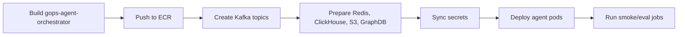

# GOPS Agent AWS Build And Deploy

이 문서는 AWS/EKS에서 GOPS agent runtime을 빌드하고 배포할 때 필요한 image,
Kafka, Redis/Valkey, ClickHouse, GraphDB, S3, Secret 계약을 정리한다.

## Deployment Spine

배포 순서는 고정한다.

```text
image build
-> Kafka topics
-> Redis/ClickHouse/S3/GraphDB 준비
-> secrets
-> orchestrator/worker/delivery deploy
-> smoke checks
```



The default dev deploy entrypoint is `scripts/aws/deploy-dev-local.sh`. It runs
from an operator's local machine but always deploys the latest remote
`origin/dev` commit, not local uncommitted changes. It records successful
deploy state per app image in EKS `ConfigMap/gops-dev-deploy-state` using
`service.<name>.lastSuccessfulSha`, then compares each service's own deployed
baseline with `origin/dev`. This prevents a backend-only deploy from hiding an
older undeployed frontend change. For legacy state migration, the script falls
back to the old global `lastSuccessfulSha` only when `lastSuccessfulServices`
included that service, and otherwise reads the live primary Deployment image
tag as the baseline. Use `FORCE_SERVICES=frontend,backend` to override
detection, or `FORCE_SERVICES=all` to force every app image to rebuild. See
`docs/LOCAL_EKS_DEPLOY.md` for the team runbook.

GitHub Actions dev/test deploy entrypoint `.github/workflows/deploy-dev.yml`
remains a backup path. It deploys to the shared dev EKS environment only when an
operator runs the workflow manually from GitHub Actions (`workflow_dispatch`).
The deploy job depends on a quality job that runs the unified Python test suite,
chart tests, TypeScript/Vite build, JavaScript bundle budget, and Kustomize
rendering before AWS credentials or ECR push are used.
Pushing to `dev`, `kimheejun`, `helix/front-chart`, `deploy/**`, or `test/**`
must not start a deployment by itself. When the manual `services` input is
empty, the workflow compares the current commit with the latest successful run
of the same workflow on the same branch and builds only the app services touched
by that diff. Use a comma-separated service list such as `frontend,backend` to
override detection, or `all` to force every app image to rebuild.
When `market-storage` is selected, the local script or workflow also runs
`scripts/aws/run-news-cache-rebuild-jobs.sh` after a healthy rollout. That
one-shot run uses the newly pushed `gops-market-storage` image to warm the
30-day Redis news article cache and daily summary cache from ClickHouse without
running ClickHouse rewrite mutations.

The frontend Logo.dev ticker logo key is a Vite build-time value. When
`frontend` is selected, the local deploy script or manual workflow reads AWS
Secrets Manager secret `icon/logodev` and injects only the `LOGODEV_PUB_KEY`
publishable key into the frontend Docker build. The secret may be a JSON object
such as
`{"LOGODEV_PUB_KEY":"pk_...","LOGODEV_SECRET_KEY":"sk_..."}`; the build helper
rejects non-`pk_` values and never embeds `LOGODEV_SECRET_KEY` in frontend
assets. The operator AWS profile or GitHub Actions AWS role must be allowed to
call `secretsmanager:GetSecretValue` on `icon/logodev`. If only the Logo.dev
secret value changes, run the local deploy with `FORCE_SERVICES=frontend` or the
manual workflow with `services=frontend` because Git diff cannot detect secret
rotations. `VITE_LOGO_DEV_ATTRIBUTION`/`LOGO_DEV_ATTRIBUTION` defaults to
`true`; set it to `false` only when the active Logo.dev plan permits removing
the visible attribution.

## Image

Agent runtime image:

```text
gops-agent-orchestrator
infra/docker/Dockerfile.gops-agent-orchestrator
```

이 image가 실행하는 runtime:

```text
agent-orchestrator
agent-analysis-worker
agent-delivery-gateway
agent-intent-classifier
deep-analysis-worker
agent-event-detector
agent-notification-publisher
graph-expansion-refresh
agent queue/report/graph/retrieval/grounding smoke jobs
```

Image에는 다음 source가 들어가야 한다.

```text
systems/agent-orchestration
systems/market-data/shared
systems/market-data/config/sp500-universe.json
```

현재 agent provider가 `alfaka.*` helper를 import하므로
`systems/market-data/shared`를 image에서 빼면 안 된다. 이 dependency를 제거하려면
먼저 agent-owned provider interface를 만든 뒤 migration한다.

Agent entity resolver는 기본 운영 catalog로
`systems/agent-orchestration/config/entity-aliases.json`을 읽는다.
`entity-aliases.seed.json`과 Python seed constants는 bootstrap fallback이다.

Backend/API image:

```text
gops-api-server
infra/docker/Dockerfile.gops-backend
```

`gops-backend`도 `GET /api/agents/entities/resolve`에서 agent entity resolver를
직접 실행하므로 image에 다음 source가 함께 들어가야 한다.

```text
systems/agent-orchestration/config
systems/agent-orchestration/shared
systems/market-data/config
systems/market-data/shared
systems/order/shared
systems/api-server/pods/api-server/gops-backend
```

`systems/agent-orchestration/config`가 빠지면 backend가 bootstrap seed로 degrade해
운영 alias catalog에만 있는 회사명/한글명 shortcut을 놓칠 수 있다.

같은 `gops-api-server` image는 `app.recommendations.worker`도 실행한다. 이 worker는
프로필이 저장된 사용자에 대해 정규장 09:45/12:45/15:45 ET 추천 슬롯을 멱등
생성하고, 기존 notifications Redis/WebSocket 경로로 추천 변경 알림을 발행한다.

SEC companyfacts backfill은 `gops-agent-orchestrator`가 아니라
`gops-market-storage` image에서 실행한다. 해당 image에는
`systems/fundamentals`와 `systems/market-data/shared`가 포함되어야 한다.

Chart derived data is calculated in `gops-backend`. Indicators and candle-based
volume profile share the canonical candle facade, Redis TTL cache, and bounded
singleflight. There is no separate worker, Kafka request queue, or ClickHouse
request-hash artifact. Volume profile v1 remains an `estimated` candle OHLCV
result for the requested chart interval.

Bid/ask order-flow profile은 derived-worker가 아니라 market processor와 EOD
rollup job이 담당한다. Live path는 pinned symbol trade/quote를 Redis
`order-flow:{symbol}:minutes` ZSET과 `order-flow:{symbol}:live-minute` string에
캔들형 minute blob으로 적고 `ORDER_FLOW_BINS_UPDATE`를 WebSocket에 팬아웃한다.
`alfaka-market-processor` also consumes raw quotes with
`ORDER_FLOW_QUOTE_CACHE_ONLY=true` to keep pinned-symbol NBBO in process for
classification, while `alfaka-market-quote-processor` remains responsible for
quote layer publishing and Redis live quote state.
Daily rows는
`systems/market-data/jobs/order-flow-daily-rollup/main.py`와
`infra/k8s/overlays/aws/scheduled/cronjob-order-flow-daily-rollup.yaml`이 ClickHouse
`market_data.order_flow_profile_daily`에 적재한다. Shared dev deploys that use
`aws-incluster-app-ci` inherit this scheduled CronJob through the in-cluster app
overlay by referencing the same AWS manifest; there is no mirrored CronJob copy
to drift. One-off backfill Jobs remain manual.
For skew investigations, operators can run
`PYTHONPATH=systems/market-data/shared .venv/bin/python scripts/local/orderflow_verify.py --symbol NVDA --date YYYY-MM-DD --json`
against the target ClickHouse/API environment. The script is read-only and
compares live intraday data, as-of tick recomputation, and daily rollup rows.

Market storage image also runs ClickHouse projection loaders. The baseline
`alfaka-clickhouse-loader` consumes closed candle, event, and news topics.
`alfaka-clickhouse-tick-loader` consumes `market.layer.trades.v1` and
`market.layer.quotes.v1` with multiple replicas in the same consumer group so
trade/quote tick tables used by order-flow rollups can catch up independently
from candle/news persistence.
The loaders batch Kafka payloads before ClickHouse HTTP insert
(`CLICKHOUSE_INSERT_BATCH_SIZE`, `CLICKHOUSE_FLUSH_INTERVAL_SECONDS`,
`KAFKA_CLICKHOUSE_MAX_POLL_RECORDS`). Prefer bounded batching over adding
replicas because a hot Kafka partition is still owned by one consumer at a time.

## Kubernetes Resources

Required deployments:

```text
infra/k8s/base/app/deployment-agent-orchestrator.yaml
infra/k8s/base/app/deployment-agent-analysis-worker.yaml
infra/k8s/base/app/deployment-agent-delivery-gateway.yaml
```

Optional deployments:

```text
infra/k8s/base/app/deployment-agent-intent-classifier.yaml
infra/k8s/base/app/deployment-deep-analysis-worker.yaml
infra/k8s/base/app/deployment-agent-event-detector.yaml
infra/k8s/base/app/deployment-agent-notification-publisher.yaml
infra/k8s/base/app/deployment-recommendation-worker.yaml
```

The AWS in-cluster overlay keeps `recommendation-worker` and
`alert-evaluator` at 0 replicas until the deployed `gops-api-server` image
includes `app.recommendations.worker` and `app.alerts.evaluator`. Remove those
overlay patches only after rebuilding and rolling out an API image that contains
the recommendations and alerts packages.

Optional jobs:

```text
infra/k8s/base/job-agent-queue-smoke.yaml
infra/k8s/base/job-report-store-smoke.yaml
infra/k8s/base/job-graph-expansion-*.yaml
infra/k8s/base/job-retrieval-*.yaml
infra/k8s/base/job-sec-fundamentals-backfill.yaml
infra/k8s/base/job-fanout-policy-benchmark.yaml
infra/k8s/base/job-answer-grounding-eval.yaml
```

In-cluster dedicated rebuild sizing:

```text
app-agent:  4 x m5a/m6a large class, 2 vCPU / 8 GiB, app + agent + workers
cache-db:   1 x m5a/m6a xlarge class, 4 vCPU / 16 GiB, Redis + Postgres
streaming:  1 x m5a/m6a xlarge class, 4 vCPU / 16 GiB, Kafka
graphdb:    1 x m5a/m6a xlarge class, 4 vCPU / 16 GiB, GraphDB
clickhouse: 1 x m5a/m6a 2xlarge class, 8 vCPU / 32 GiB, ClickHouse
batch-warm: 1 x m5a/m6a large class, 2 vCPU / 8 GiB, scheduled Jobs
batch:      0 steady nodes, dynamic capacity for ad hoc Jobs
```

This profile uses 30 vCPU in steady state, excluding cluster add-ons. The live
cluster keeps one 2 vCPU
`general-purpose` node for CoreDNS, AWS Load Balancer Controller, EBS CSI,
metrics-server, and external-secrets, bringing the current total to the 32 vCPU
on-demand quota. Drain old workload nodes or legacy `platform-core` nodes after
the dedicated NodePools are ready and stateful pods have been restored and
validated.

`app-agent`, `cache-db`, `streaming`, `graphdb`, `clickhouse`, and `batch-warm`
use static `spec.replicas` to hold the intended node count. The existing
dynamic `batch` pool remains available for ad hoc Jobs because Karpenter does
not allow an existing NodePool to transition between dynamic and static modes.
Scheduled Jobs select `batch-warm`, which stays at one node so they do not
consume their entire active deadline waiting for scale-from-zero. If the old
`platform-core` NodePool was applied during the 16 vCPU attempt, delete it only
after all pods are drained from that node.

The app overlay uses `maxUnavailable=1` and `maxSurge=0` for Deployment rolling
updates. That intentionally allows one old pod to stop before a replacement pod
is scheduled, which avoids rollout deadlocks on the fixed-size `app-agent`
NodePool.

Stateful platform rebuilds must preserve DB data. Do not use a blank fresh PVC
for Postgres, ClickHouse, or GraphDB. A fresh PVC in a rebuild means a new volume
restored from a verified backup or snapshot. Redis and Kafka are preserved by
default unless the owning pipeline explicitly approves a reset. See
`docs/EKS_DATA_PRESERVING_REBUILD_PLAN.md` for the dedicated NodePool rebuild
runbook, restore validation, and rollback guardrails.

Approval-time order: scale app/agent/market/order Deployments to 0, suspend
CronJobs, delete active Jobs after recording them, create and verify stateful
backups, scale down platform StatefulSets, apply NodePools and platform
manifests, restore data into new PVCs, validate Postgres/ClickHouse/GraphDB and
any preserved Redis/Kafka state, then restore app workloads and resume CronJobs.

Prepared backup helpers:

```text
scripts/aws/prepare-rebuild-shutdown.sh
scripts/aws/collect-platform-backup-inventory.sh
scripts/aws/backup-postgres-logical.sh
scripts/aws/restore-postgres-logical.sh
scripts/aws/backup-redis-rdb.sh
scripts/aws/restore-redis-rdb.sh
scripts/aws/backup-graphdb-pvc.sh
scripts/aws/create-pvc-ebs-snapshots.sh
scripts/aws/restore-graphdb-pvc.sh
```

The dev deploy workflow does not run cache rebuilds or SQL migrations
automatically. For one-off maintenance during a manual build, set
`run_order_migrations=true` with `order-worker` in `services`, or
`rebuild_news_cache=true` with `market-storage` in `services`. Run
`scripts/aws/run-order-migrations-job.sh` directly only when SQL migrations must
be applied outside the deploy workflow.

Market processor deploys as two runtime units from the same
`gops-market-processor` image. `alfaka-market-processor` handles trades, bars,
updated bars, daily bars, and events. `alfaka-market-quote-processor` handles
quotes in a separate consumer group. Select `market-processor` in the deploy
workflow to roll both Deployments together.

Market ingestor deploys multiple runtime units from the same
`gops-market-ingestor` image. `alfaka-alpaca-ingestor-sip` handles SIP baseline
bars/statuses and active SIP trades/quotes on one WebSocket connection so the
runtime stays within Alpaca SIP connection limits. `alfaka-alpaca-ingestor-boats`
handles overnight BOATS, `alfaka-alpaca-ingestor-crypto` handles crypto, and
`alfaka-alpaca-news-ingestor` handles Alpaca news. Select `market-ingestor` in
the deploy workflow to roll all of them together.

Config and overlay references:

```text
infra/k8s/base/app/configmap.yaml
infra/k8s/base/kustomization.yaml
infra/k8s/overlays/aws/configmap-aws-patch.yaml
infra/k8s/overlays/aws/kustomization.yaml
infra/k8s/overlays/aws-incluster-app/configmap-incluster-patch.yaml
infra/k8s/overlays/aws-incluster-app/kustomization.yaml
infra/k8s/overlays/aws-incluster-app-ci/kustomization.yaml
infra/k8s/overlays/aws-incluster-app-rebuild/kustomization.yaml
```

GitHub Actions uses `aws-incluster-app-ci` for manual dev/test deploys. That CI
overlay deliberately deletes the GraphDB StatefulSet from the rendered app
bundle so immutable PVC template changes cannot break ordinary app deploys.
It still includes scheduled app-runtime CronJobs such as the order-flow daily
rollup; one-shot Jobs remain outside the automatic apply path.
By default it does not apply platform NodePools or perform the clean rebuild.
Set the workflow input `apply_platform_manifests=true` only after the
data-preserving rebuild has been approved or completed; that path applies the
dedicated NodePools, in-cluster platform StatefulSets, and GraphDB StatefulSet
without deleting PVCs, then validates stateful pod placement before app rollout.

The app overlay declaratively keeps `alert-evaluator` and
`recommendation-worker` at one replica. CI does not read live replica counts or
rewrite desired replicas; Git is the source of truth for both workers.

The market and quote processors use per-workload `DoNotSchedule` topology spread
constraints with `minDomains=3`, so their three replicas cannot collapse onto
one node. Their
readiness/liveness probes check a local heartbeat updated after every bounded
Kafka poll. The order outbox and KIS adapter use the same loop-heartbeat pattern.

Scheduled batch Jobs declare resource requests/limits. Failed Job and Pod
evidence is retained for seven days. The `batch-warm` NodePool is static with
one node, and both the SEC fundamentals and order-flow CronJobs select it so
they can start without depending on a scale-from-zero event.

## Kafka

Agent topics:

```text
agents.market-events.v1
agents.analysis-requests.v1
agents.deep-analysis-requests.v1
agents.analysis-results.v1
agents.query-understanding-events.v1
agents.notification-decisions.v1
agents.dlq.v1
```

Chart derived env:

```text
CHART_INDICATOR_CACHE_TTL_SECONDS
CHART_VOLUME_PROFILE_CACHE_TTL_SECONDS
CHART_DERIVED_INLINE_LOCK_TTL_SECONDS
CHART_DERIVED_INLINE_WAIT_MS
SUBSCRIPTION_EVENTS_MAXLEN
ORDER_FLOW_PINNED_SYMBOLS
ORDER_FLOW_PRICE_BIN_SIZE
ORDER_FLOW_QUOTE_REFRESH_MS
ORDER_FLOW_QUOTE_MAX_AGE_MS
ORDER_FLOW_QUOTE_FUTURE_TOLERANCE_MS
ORDER_FLOW_PUBLISH_THROTTLE_MS
ORDER_FLOW_REDIS_FLUSH_MS
ORDER_FLOW_LIVE_TTL_SECONDS
ORDER_FLOW_LIVE_MINUTE_TTL_SECONDS
ORDER_FLOW_QUOTE_CACHE_ONLY
QUOTE_REDIS_WRITE_MIN_INTERVAL_MS
QUOTE_EVENT_PUBLISH_MIN_INTERVAL_MS
TRADE_REDIS_WRITE_MIN_INTERVAL_MS
HEALTH_WRITE_MIN_INTERVAL_MS
ON_DEMAND_FILL_DISTRIBUTED_SINGLEFLIGHT_ENABLED
ON_DEMAND_FILL_SINGLEFLIGHT_LOCK_TTL_SECONDS
ON_DEMAND_FILL_SINGLEFLIGHT_TERMINAL_TTL_SECONDS
```

Kafka bootstrap env:

```text
KAFKA_BOOTSTRAP_SERVERS
AGENT_ANALYSIS_REQUESTS_TOPIC
AGENT_DEEP_ANALYSIS_REQUESTS_TOPIC
AGENT_ANALYSIS_RESULTS_TOPIC
AGENT_QUERY_UNDERSTANDING_EVENTS_TOPIC
AGENT_NOTIFICATION_DECISIONS_TOPIC
AGENT_MARKET_EVENTS_TOPIC
AGENT_DLQ_TOPIC
AGENT_PUBLISH_TO_KAFKA
```

AWS stage는 MSK를 강제하지 않는다. 현 구조는 다음 staged path를 허용한다.

```text
local compose -> single Kafka pod candidate -> MSK candidate
```

The single-pod Kafka StatefulSet mounts its PVC directly at
`/var/lib/kafka/data` and uses `/var/lib/kafka/data/data` as `log.dirs`. The
official `apache/kafka` image declares the parent path as an image volume, so
mounting only `/var/lib/kafka` allows the image volume to shadow the PVC. The
child log directory preserves the layout created by that former parent mount
and keeps filesystem metadata such as `lost+found` outside Kafka's log scan.

Short-retention market topics must set `segment.ms` and `segment.bytes` together
with `retention.ms`. Kafka deletes only closed segments; `retention.ms` alone can
retain an active default 1 GiB/7-day segment far beyond the intended 30-minute
or 2-hour window.

Topic 이름을 바꾸려면 backend queue submitter, worker consumer, delivery gateway,
platform topic creation을 같이 바꿔야 한다.

## Redis Or Valkey

Redis/Valkey는 report store, idempotency mapping, SSE update fanout, graph
cache에 쓰인다.

```text
REDIS_URL
AGENT_SHARED_REPORT_STORE_ENABLED
AGENT_REPORT_STORE_BACKEND
AGENT_REPORT_TTL_SECONDS
AGENT_REPORT_STREAM_REDIS_ENABLED
AGENT_REPORT_UPDATES_CHANNEL
AGENT_IDEMPOTENCY_TTL_SECONDS
AGENT_IDEMPOTENCY_KEY_PREFIX
AGENT_GRAPH_PATH_CACHE_BACKEND
AGENT_GRAPH_PATH_CACHE_TTL_SECONDS
AGENT_GRAPH_PATH_CACHE_NO_DATA_TTL_SECONDS
AGENT_GRAPH_PATH_CACHE_KEY_PREFIX
AGENT_GRAPH_EXPANSION_CACHE_ENABLED
AGENT_GRAPH_EXPANSION_REDIS_PREFIX
```

Required report keys/channels:

```text
agent:report:{analysisId}
agent:report:latest:{SYMBOL}
agent:report:latest
agent:report:owner:{analysisId}
agent:request:idempotency:{userHash}:{keyHash}
agent.reports
agent.reports:{analysisId}
gops:agent:graph-expansion:v1:{symbol}
gops:fundamentals:summary:v1:{SYMBOL}
gops:fundamentals:peer:v1:{SYMBOL}:latest
gops:fundamentals:peer:v1:{SYMBOL}:{FRAME_PERIOD}
```

Fundamentals Redis keys are written by the SEC companyfacts backfill job and
future reconcile jobs. Agent runtime trusts Redis hits and does not perform
ClickHouse stale checks on the hot path.

## ClickHouse

Agent providers read ClickHouse serving tables. ClickHouse must be reachable
before worker smoke checks are considered valid.

`dev` merge/pull is not the ClickHouse migration boundary. Local ClickHouse and
AWS ClickHouse are separate runtimes, so merge conflict resolution should only
preserve code contracts and DDL files. Switching to a new AWS ClickHouse,
initializing schemas, rebuilding Redis projections, and S3 prefix cleanup are
push/deploy maintenance tasks that run against the AWS environment after the
merged image set is ready.

```text
CLICKHOUSE_HTTP_URL
CLICKHOUSE_DATABASE
CLICKHOUSE_USER
CLICKHOUSE_PASSWORD
AGENT_ENTITY_ALIAS_CATALOG_PATH
AGENT_ENTITY_ALIAS_SEED_PATH
AGENT_ENTITY_CATALOG_STRICT
AGENT_MARKET_SYMBOL_REGISTRY_PATH
```

Tables used by agent providers:

```text
market_data.symbols
market_data.news_articles
market_data.news_article_localizations
market_data.news_company_daily_summaries
market_data.agent_graph_expansions
market_data.sec_company_tickers
market_data.sec_filing_events
market_data.sec_raw_artifacts
market_data.sec_financial_facts
market_data.sec_derived_metrics
market_data.sec_frames
market_data.sec_collection_runs
market_data.yahoo_earnings_estimates
```

News provider는 Redis 30일 article/daily hot cache를 우선 사용하고, daily coverage
metadata가 최근 30일 요청을 보장하지 못할 때 ClickHouse serving rows로 보강해
Redis를 다시 warm-up한다.
News cache rebuild Jobs warm Redis from ClickHouse rows by default and keep
ClickHouse rewrite/mutation disabled unless
`NEWS_INTELLIGENCE_REBUILD_REWRITE_CLICKHOUSE=true` is set intentionally.
`market_data.agent_graph_expansions`는 GraphDB에서 미리 계산한
관계 hint를 warm/deep path에서 재사용하기 위한 table이다.

When AWS ClickHouse is replaced, do not migrate rows from the broken instance.
Create the schema from `infra/clickhouse/initdb/01-market-data.sql` and
`infra/clickhouse/initdb/02-sec-fundamentals.sql`, then rebuild projections from
the official sources: S3 final/manifest for chart history, SEC companyfacts for
actual fundamentals, and the separate Yahoo estimates collector for consensus
data. Redis reset must be targeted to fundamentals summary/peer keys and chart
live/latest/coverage keys; do not flush agent reports, sessions, or unrelated
caches.

## SEC Fundamentals

SEC fundamentals are collected by `systems/fundamentals`, not by the agent
runtime. The implemented initial-load job is
`systems/fundamentals/jobs/sec-companyfacts-backfill/main.py` and should run in
the `gops-market-storage` image. Initial load uses SEC `companyfacts.zip` bulk
data. Incremental
sync should use EDGAR latest filings RSS/full-index or submissions index, then
re-fetch `companyfacts` only for companies with new `10-K`, `10-Q`, `10-K/A`, or
`10-Q/A`. `8-K` is stored as an event and does not trigger metric recomputation
by default.

Required env:

```text
SEC_USER_AGENT
SEC_COMPANYFACTS_ZIP_URL
SEC_FUNDAMENTALS_S3_PREFIX
SEC_FUNDAMENTALS_DRY_RUN
SEC_FUNDAMENTALS_MAX_COMPANIES
SEC_FUNDAMENTALS_BATCH_SIZE
SEC_FUNDAMENTALS_LOAD_FRAMES
S3_BUCKET
REDIS_URL
CLICKHOUSE_HTTP_URL
CLICKHOUSE_DATABASE
CLICKHOUSE_USER
CLICKHOUSE_PASSWORD
```

`SEC_USER_AGENT` must include a contact email or URL. SEC requests are limited
to at most 8 requests per second. S&P 500 membership comes from
`systems/market-data/config/sp500-universe.json`; ticker/CIK mapping is stored in
`market_data.sec_company_tickers`. Universe removals update
`is_active_universe_member`; historical facts and metrics are retained.

AWS scheduled sync:

```text
infra/k8s/overlays/aws/scheduled/externalsecret-sec-fundamentals.yaml
infra/k8s/overlays/aws/scheduled/cronjob-sec-fundamentals-sync.yaml
```

The AWS overlay syncs property `SEC_USER_AGENT` from
`/gops/prod/fundamentals/sec-user-agent` in Secrets Manager into Kubernetes
Secret `alfaka-sec-fundamentals-secret` key `SEC_USER_AGENT`.
`alfaka-sec-fundamentals-sync` is a daily CronJob
(`30 20 * * *`, UTC; 05:30 KST) that runs the fundamentals job with
`SEC_FUNDAMENTALS_DRY_RUN=false`, writes the SEC ZIP to S3, and refreshes
ClickHouse/Redis projections. Local developer machines are not required after
the CronJob and ExternalSecret are applied in EKS.

Manual AWS run:

```sh
SEC_FUNDAMENTALS_DRY_RUN=false \
SEC_USER_AGENT="GOPS fundamentals contact@example.com" \
./scripts/aws/run-sec-fundamentals-backfill-job.sh
```

When `alfaka-sec-fundamentals-secret` exists in EKS, manual runs can omit the
literal User-Agent value and use the Kubernetes Secret reference:

```sh
SEC_FUNDAMENTALS_DRY_RUN=false \
./scripts/aws/run-sec-fundamentals-backfill-job.sh
```

For a small load test:

```sh
SEC_FUNDAMENTALS_DRY_RUN=false \
SEC_USER_AGENT="GOPS fundamentals contact@example.com" \
SEC_FUNDAMENTALS_SYMBOLS=AAPL,NVDA \
./scripts/aws/run-sec-fundamentals-backfill-job.sh
```

## GraphDB

Ontology provider는 GraphDB SPARQL endpoint가 있을 때 relationship snapshot을
만든다.

```text
GRAPHDB_SPARQL_URL
GRAPHDB_REPOSITORY
GRAPHDB_TIMEOUT_SECONDS
AGENT_ONTOLOGY_LIMIT
```

GraphDB가 없거나 timeout이어도 전체 분석은 실패하지 않아야 한다. ontology
provider는 `status="no-data"` evidence로 degrade하고 market/news analysis를
계속 진행한다.

로컬 restore artifact는 커밋하지 않는다.

```text
.local-artifacts/graphdb/graphdb-volume.tgz
```

Clean rebuild 직전 bootstrap archive를 만들고, 새 `10Gi` PVC에 복원한다.

```sh
scripts/aws/backup-graphdb-pvc.sh --force
scripts/aws/restore-graphdb-pvc.sh --replace-pending-pvc
```

## S3

S3는 agent가 직접 final report serving을 하는 저장소가 아니라 market/news
source data와 replay evidence를 보관하는 durable storage다.

현재 AWS bucket:

```text
gops-market-data-<aws-account-id>-ap-northeast-2-an
```

관련 env:

```text
S3_BUCKET
S3_RAW_PREFIX
S3_FINAL_PREFIX
S3_LIVE_PREFIX
S3_MANIFEST_PREFIX
S3_PROCESSED_FORMAT
S3_ENDPOINT_URL
NEWS_BACKFILL_PUBLISH_RECENT_TO_KAFKA
NEWS_CLICKHOUSE_DAYS
NEWS_INTELLIGENCE_REBUILD_DRY_RUN
NEWS_INTELLIGENCE_REBUILD_REWRITE_CLICKHOUSE
CLICKHOUSE_ENSURE_SCHEMA_ON_START
```

Policy:

- raw market/news payload는 S3에 오래 보관한다.
- ClickHouse는 agent serving에 필요한 recent projection을 제공한다.
- Redis는 latest summary/link/relevance metadata를 제공한다.
- broad preload에서는 `S3_PROCESSED_FORMAT=parquet`을 사용한다.
- real AWS에서는 `S3_ENDPOINT_URL`을 비운다.

## Secrets

필수 agent secret:

```text
OPENAI_API_KEY
CLICKHOUSE_PASSWORD
```

SEC fundamentals backfill also requires `SEC_USER_AGENT`, but it is not an
agent runtime secret. In AWS/EKS it lives in Secrets Manager at
`/gops/prod/fundamentals/sec-user-agent` and is synced to Kubernetes Secret
`alfaka-sec-fundamentals-secret`.

AWS Secrets Manager reference:

```text
/gops/prod/agent-orchestrator/openai/api-key
/gops/prod/fundamentals/sec-user-agent
```

SecretString shape:

```json
{"OPENAI_API_KEY":"sk-..."}
{"SEC_USER_AGENT":"GOPS fundamentals contact@example.com"}
```

EKS overlay는 External Secrets Operator를 통해 Kubernetes Secret
`alfaka-openai-secret`의 `OPENAI_API_KEY`와
`alfaka-sec-fundamentals-secret`의 `SEC_USER_AGENT`로 sync한다.

절대 커밋하지 않을 것:

```text
.env
access key CSV files
KIS token caches
local GraphDB archives
real credentials
```

## Runtime Env Checklist

Core async/report:

```text
AGENT_ORCHESTRATOR_URL
AGENT_ASYNC_ANALYSIS_ENABLED
AGENT_SYNC_COMPAT_WAIT_ENABLED
AGENT_SHARED_REPORT_STORE_ENABLED
AGENT_ANALYSIS_QUEUE_BACKEND
AGENT_REPORT_STORE_BACKEND
AGENT_REPORT_STREAM_REDIS_ENABLED
AGENT_REPORT_OWNER_KEY_PREFIX
AGENT_RATE_LIMIT_ENABLED
AGENT_RATE_LIMIT_REQUESTS
AGENT_RATE_LIMIT_WINDOW_SECONDS
```

Provider and LLM:

```text
OPENAI_API_KEY
OPENAI_MODEL
AGENT_FINAL_ANSWER_PROVIDER
AGENT_MAX_REALTIME_LLM_CALLS
AGENT_SYNTHESIZER_TIMEOUT_SECONDS
AGENT_SYNTHESIS_TIMEOUT_MS
AGENT_OPERATION_PLANNER_PROVIDER
AGENT_OPERATION_PLANNER_MODEL
AGENT_OPERATION_PLANNER_TIMEOUT_SECONDS
AGENT_FINANCIAL_FINAL_ANSWER_PROVIDER
AGENT_FINANCIAL_SYNTHESIZER_TIMEOUT_SECONDS
AGENT_FINANCIAL_FINAL_ANSWER_CACHE_ENABLED
AGENT_FINANCIAL_FINAL_ANSWER_CACHE_TTL_SECONDS
REDIS_URL
CLICKHOUSE_HTTP_URL
CLICKHOUSE_DATABASE
CLICKHOUSE_USER
CLICKHOUSE_PASSWORD
GRAPHDB_SPARQL_URL
GRAPHDB_REPOSITORY
SEC_USER_AGENT
```

Financial final-answer synthesis is enabled with
`AGENT_FINANCIAL_FINAL_ANSWER_PROVIDER=openai`. The orchestrator still reads SEC
fundamentals from Redis/ClickHouse snapshots only; OpenAI rewrites formatted
facts and deterministic financial signals into user-facing Korean prose. The
generated financial report is cached in Redis under
`gops:agent:financial-final-answer:v1:{SYMBOL}:{digest}` when Redis is
available.

General final-answer synthesis is enabled with `AGENT_FINAL_ANSWER_PROVIDER=openai`.
Production config should keep `AGENT_MAX_REALTIME_LLM_CALLS=2` so one LLM call
remains reserved for final answer synthesis. The final-answer LLM is only a
Korean prose rewrite layer, so production should use a fast mini model via
`AGENT_SYNTHESIZER_MODEL=gpt-5.4-mini` and keep
`AGENT_SYNTHESIZER_TIMEOUT_SECONDS=3.5` / `AGENT_SYNTHESIS_TIMEOUT_MS=3500`.
This preserves the 5-second hot-path response target by falling back quickly when
OpenAI is slow. A completed report whose `timing.llmCallLabels` does not contain
`synthesis` or `financial-synthesis` did not even attempt the final synthesis LLM
call. A report whose
`timing.synthesisProvider` is not `openai` used deterministic fallback for the final
answer; check `synthesisSkippedReason` and `synthesisFallbackReason` in `timing` or
`agentTrace.synthesis`.

AWS overlays make `alfaka-openai-secret` mandatory for the agent orchestrator and
analysis workers. If the secret is missing, the pod should fail scheduling/startup
instead of silently serving deterministic final-answer fallback. Startup logs also
print non-secret synthesis diagnostics: provider env, model, timeout, and whether
`OPENAI_API_KEY` is visible inside that pod. Reports mirror the same fields under
`agentTrace.synthesis`. Do not cache analysis reports produced after infra fallback
reasons such as `missing_openai_api_key`, `synthesis_skipped_budget`, or
`openai_*`; rerunning after the secret or provider recovers should attempt OpenAI
synthesis again.

Interactive OperationIR planner fallback is enabled with
`AGENT_OPERATION_PLANNER_PROVIDER=openai`. Leave it unset for deterministic-only
operation extraction. When enabled, only low-confidence or ambiguous operation
requests call the Responses API with JSON schema output.

Backpressure and deadline:

```text
AGENT_ADMISSION_ENABLED
AGENT_ADMISSION_MAX_QUEUE_DEPTH
AGENT_ADMISSION_MAX_PRODUCER_BUFFERED
AGENT_ADMISSION_DEGRADE_STREAM_TO_POLL
AGENT_PROVIDER_BULKHEAD_DEFAULT_MAX_CONCURRENCY
AGENT_PROVIDER_BULKHEAD_MARKET_MAX_CONCURRENCY
AGENT_PROVIDER_BULKHEAD_NEWS_MAX_CONCURRENCY
AGENT_PROVIDER_BULKHEAD_RELATIONSHIP_MAX_CONCURRENCY
AGENT_PROVIDER_BULKHEAD_ACQUIRE_TIMEOUT_MS
AGENT_QUERY_UNDERSTANDING_TIMEOUT_MS
AGENT_GRAPH_CACHE_DEADLINE_MS
AGENT_EXPANDED_RETRIEVAL_DEADLINE_MS
AGENT_SNAPSHOT_TOTAL_DEADLINE_MS
```

## Smoke Checks

Local static checks:

```sh
git diff --check
.venv/bin/python -m pytest
npm run test:chart --prefix apps/gops-frontend
npm run build --prefix apps/gops-frontend
npm run test:bundle-size --prefix apps/gops-frontend
```

Kubernetes manifests:

```sh
kubectl kustomize infra/k8s/base >/tmp/gops-k8s-base.yaml
kubectl kustomize infra/k8s/overlays/aws >/tmp/gops-k8s-aws.yaml
```

Runtime acceptance:

```text
POST /api/agents/analyze returns 202 and analysisId
Kafka agents.analysis-requests.v1 receives the envelope
agent-analysis-worker writes completed report to Redis
Kafka agents.analysis-results.v1 receives the result
agent-delivery-gateway publishes Redis update
GET /api/agents/reports/{analysis_id} returns completed report
SSE stream emits updates or frontend polling works
```
