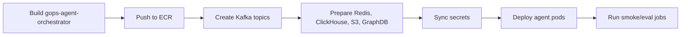

# GOPS Agent AWS Build And Deploy

이 문서는 AWS/EKS에서 GOPS agent runtime을 빌드하고 배포할 때 필요한 image,
Kafka, Redis/Valkey, ClickHouse, GraphDB, S3, Secret 계약을 정리한다.

## Deployment Spine

배포 순서는 고정한다.

```text
image build
-> Kafka topics
-> Redis/ClickHouse/S3/GraphDB 준비
-> secrets
-> orchestrator/worker/delivery deploy
-> smoke checks
```



GitHub Actions dev/test deploy entrypoint is `.github/workflows/deploy-dev.yml`.
It deploys to the shared dev EKS environment on pushes to `dev`, `kimheejun`,
`helix/front-chart`, `deploy/**`, and `test/**`, or by manual dispatch.

## Image

Agent runtime image:

```text
gops-agent-orchestrator
infra/docker/Dockerfile.gops-agent-orchestrator
```

이 image가 실행하는 runtime:

```text
agent-orchestrator
agent-analysis-worker
agent-delivery-gateway
agent-intent-classifier
deep-analysis-worker
agent-event-detector
agent-notification-publisher
graph-expansion-refresh
agent queue/report/graph/retrieval/grounding smoke jobs
```

Image에는 다음 source가 들어가야 한다.

```text
systems/agent-orchestration
systems/market-data/shared
systems/market-data/config/sp500-universe.json
```

현재 agent provider가 `alfaka.*` helper를 import하므로
`systems/market-data/shared`를 image에서 빼면 안 된다. 이 dependency를 제거하려면
먼저 agent-owned provider interface를 만든 뒤 migration한다.

Agent entity resolver는 기본 운영 catalog로
`systems/agent-orchestration/config/entity-aliases.json`을 읽는다.
`entity-aliases.seed.json`과 Python seed constants는 bootstrap fallback이다.

SEC companyfacts backfill은 `gops-agent-orchestrator`가 아니라
`gops-market-storage` image에서 실행한다. 해당 image에는
`systems/fundamentals`와 `systems/market-data/shared`가 포함되어야 한다.

## Kubernetes Resources

Required deployments:

```text
infra/k8s/base/app/deployment-agent-orchestrator.yaml
infra/k8s/base/app/deployment-agent-analysis-worker.yaml
infra/k8s/base/app/deployment-agent-delivery-gateway.yaml
```

Optional deployments:

```text
infra/k8s/base/app/deployment-agent-intent-classifier.yaml
infra/k8s/base/app/deployment-deep-analysis-worker.yaml
infra/k8s/base/app/deployment-agent-event-detector.yaml
infra/k8s/base/app/deployment-agent-notification-publisher.yaml
```

Optional jobs:

```text
infra/k8s/base/job-agent-queue-smoke.yaml
infra/k8s/base/job-report-store-smoke.yaml
infra/k8s/base/job-graph-expansion-*.yaml
infra/k8s/base/job-retrieval-*.yaml
infra/k8s/base/job-sec-fundamentals-backfill.yaml
infra/k8s/base/job-fanout-policy-benchmark.yaml
infra/k8s/base/job-answer-grounding-eval.yaml
```

Config and overlay references:

```text
infra/k8s/base/app/configmap.yaml
infra/k8s/base/kustomization.yaml
infra/k8s/overlays/aws/configmap-aws-patch.yaml
infra/k8s/overlays/aws/kustomization.yaml
infra/k8s/overlays/aws-incluster-app/configmap-incluster-patch.yaml
infra/k8s/overlays/aws-incluster-app/kustomization.yaml
```

## Kafka

Agent topics:

```text
agents.market-events.v1
agents.analysis-requests.v1
agents.deep-analysis-requests.v1
agents.analysis-results.v1
agents.query-understanding-events.v1
agents.notification-decisions.v1
agents.dlq.v1
```

Kafka bootstrap env:

```text
KAFKA_BOOTSTRAP_SERVERS
AGENT_ANALYSIS_REQUESTS_TOPIC
AGENT_DEEP_ANALYSIS_REQUESTS_TOPIC
AGENT_ANALYSIS_RESULTS_TOPIC
AGENT_QUERY_UNDERSTANDING_EVENTS_TOPIC
AGENT_NOTIFICATION_DECISIONS_TOPIC
AGENT_MARKET_EVENTS_TOPIC
AGENT_DLQ_TOPIC
AGENT_PUBLISH_TO_KAFKA
```

AWS stage는 MSK를 강제하지 않는다. 현 구조는 다음 staged path를 허용한다.

```text
local compose -> single Kafka pod candidate -> MSK candidate
```

Topic 이름을 바꾸려면 backend queue submitter, worker consumer, delivery gateway,
platform topic creation을 같이 바꿔야 한다.

## Redis Or Valkey

Redis/Valkey는 report store, idempotency mapping, SSE update fanout, graph
cache에 쓰인다.

```text
REDIS_URL
AGENT_SHARED_REPORT_STORE_ENABLED
AGENT_REPORT_STORE_BACKEND
AGENT_REPORT_TTL_SECONDS
AGENT_REPORT_STREAM_REDIS_ENABLED
AGENT_REPORT_UPDATES_CHANNEL
AGENT_IDEMPOTENCY_TTL_SECONDS
AGENT_IDEMPOTENCY_KEY_PREFIX
AGENT_GRAPH_PATH_CACHE_BACKEND
AGENT_GRAPH_PATH_CACHE_TTL_SECONDS
AGENT_GRAPH_PATH_CACHE_NO_DATA_TTL_SECONDS
AGENT_GRAPH_PATH_CACHE_KEY_PREFIX
AGENT_GRAPH_EXPANSION_CACHE_ENABLED
AGENT_GRAPH_EXPANSION_REDIS_PREFIX
```

Required report keys/channels:

```text
agent:report:{analysisId}
agent:report:latest:{SYMBOL}
agent:report:latest
agent:request:idempotency:{userHash}:{keyHash}
agent.reports
agent.reports:{analysisId}
gops:agent:graph-expansion:v1:{symbol}
gops:fundamentals:summary:v1:{SYMBOL}
gops:fundamentals:peer:v1:{SYMBOL}:latest
gops:fundamentals:peer:v1:{SYMBOL}:{FRAME_PERIOD}
```

Fundamentals Redis keys are written by the SEC companyfacts backfill job and
future reconcile jobs. Agent runtime trusts Redis hits and does not perform
ClickHouse stale checks on the hot path.

## ClickHouse

Agent providers read ClickHouse serving tables. ClickHouse must be reachable
before worker smoke checks are considered valid.

```text
CLICKHOUSE_HTTP_URL
CLICKHOUSE_DATABASE
CLICKHOUSE_USER
CLICKHOUSE_PASSWORD
AGENT_ENTITY_ALIAS_CATALOG_PATH
AGENT_ENTITY_ALIAS_SEED_PATH
AGENT_ENTITY_CATALOG_STRICT
AGENT_MARKET_SYMBOL_REGISTRY_PATH
```

Tables used by agent providers:

```text
market_data.symbols
market_data.news_articles
market_data.news_article_localizations
market_data.news_company_daily_summaries
market_data.agent_graph_expansions
market_data.sec_company_tickers
market_data.sec_filing_events
market_data.sec_raw_artifacts
market_data.sec_financial_facts
market_data.sec_derived_metrics
market_data.sec_frames
market_data.sec_collection_runs
```

News provider는 ClickHouse의 recent serving rows와 Redis latest summaries를
우선 사용한다. `market_data.agent_graph_expansions`는 GraphDB에서 미리 계산한
관계 hint를 warm/deep path에서 재사용하기 위한 table이다.

## SEC Fundamentals

SEC fundamentals are collected by `systems/fundamentals`, not by the agent
runtime. The implemented initial-load job is
`systems/fundamentals/jobs/sec-companyfacts-backfill/main.py` and should run in
the `gops-market-storage` image. Initial load uses SEC `companyfacts.zip` bulk
data. Incremental
sync should use EDGAR latest filings RSS/full-index or submissions index, then
re-fetch `companyfacts` only for companies with new `10-K`, `10-Q`, `10-K/A`, or
`10-Q/A`. `8-K` is stored as an event and does not trigger metric recomputation
by default.

Required env:

```text
SEC_USER_AGENT
SEC_COMPANYFACTS_ZIP_URL
SEC_FUNDAMENTALS_S3_PREFIX
SEC_FUNDAMENTALS_DRY_RUN
SEC_FUNDAMENTALS_MAX_COMPANIES
SEC_FUNDAMENTALS_BATCH_SIZE
SEC_FUNDAMENTALS_LOAD_FRAMES
S3_BUCKET
REDIS_URL
CLICKHOUSE_HTTP_URL
CLICKHOUSE_DATABASE
CLICKHOUSE_USER
CLICKHOUSE_PASSWORD
```

`SEC_USER_AGENT` must include a contact email or URL. SEC requests are limited
to at most 8 requests per second. S&P 500 membership comes from
`systems/market-data/config/sp500-universe.json`; ticker/CIK mapping is stored in
`market_data.sec_company_tickers`. Universe removals update
`is_active_universe_member`; historical facts and metrics are retained.

Manual AWS run:

```sh
SEC_FUNDAMENTALS_DRY_RUN=false \
SEC_USER_AGENT="GOPS fundamentals contact@example.com" \
./scripts/aws/run-sec-fundamentals-backfill-job.sh
```

For a small load test:

```sh
SEC_FUNDAMENTALS_DRY_RUN=false \
SEC_USER_AGENT="GOPS fundamentals contact@example.com" \
SEC_FUNDAMENTALS_SYMBOLS=AAPL,NVDA \
./scripts/aws/run-sec-fundamentals-backfill-job.sh
```

## GraphDB

Ontology provider는 GraphDB SPARQL endpoint가 있을 때 relationship snapshot을
만든다.

```text
GRAPHDB_SPARQL_URL
GRAPHDB_REPOSITORY
GRAPHDB_TIMEOUT_SECONDS
AGENT_ONTOLOGY_LIMIT
```

GraphDB가 없거나 timeout이어도 전체 분석은 실패하지 않아야 한다. ontology
provider는 `status="no-data"` evidence로 degrade하고 market/news analysis를
계속 진행한다.

로컬 restore artifact는 커밋하지 않는다.

```text
.local-artifacts/graphdb/graphdb-volume.tgz
```

초기 PVC restore가 필요할 때만 검토 후 다음 script를 사용한다.

```sh
scripts/aws/restore-graphdb-pvc.sh --replace-pending-pvc
```

## S3

S3는 agent가 직접 final report serving을 하는 저장소가 아니라 market/news
source data와 replay evidence를 보관하는 durable storage다.

현재 AWS bucket:

```text
gops-market-data-<aws-account-id>-ap-northeast-2-an
```

관련 env:

```text
S3_BUCKET
S3_RAW_PREFIX
S3_FINAL_PREFIX
S3_LIVE_PREFIX
S3_MANIFEST_PREFIX
S3_PROCESSED_FORMAT
S3_ENDPOINT_URL
NEWS_BACKFILL_PUBLISH_RECENT_TO_KAFKA
NEWS_CLICKHOUSE_DAYS
NEWS_INTELLIGENCE_REBUILD_DRY_RUN
```

Policy:

- raw market/news payload는 S3에 오래 보관한다.
- ClickHouse는 agent serving에 필요한 recent projection을 제공한다.
- Redis는 latest summary/link/relevance metadata를 제공한다.
- broad preload에서는 `S3_PROCESSED_FORMAT=parquet`을 사용한다.
- real AWS에서는 `S3_ENDPOINT_URL`을 비운다.

## Secrets

필수 agent secret:

```text
OPENAI_API_KEY
CLICKHOUSE_PASSWORD
```

SEC fundamentals backfill also requires `SEC_USER_AGENT`, but it is not an
agent runtime secret. It may live in the deployment ConfigMap/secret as long as
it contains contact information.

AWS Secrets Manager reference:

```text
/gops/prod/agent-orchestrator/openai/api-key
```

SecretString shape:

```json
{"OPENAI_API_KEY":"sk-..."}
```

EKS overlay는 External Secrets Operator를 통해 Kubernetes Secret
`alfaka-openai-secret`의 `OPENAI_API_KEY`로 sync한다.

절대 커밋하지 않을 것:

```text
.env
access key CSV files
KIS token caches
local GraphDB archives
real credentials
```

## Runtime Env Checklist

Core async/report:

```text
AGENT_ORCHESTRATOR_URL
AGENT_ASYNC_ANALYSIS_ENABLED
AGENT_SYNC_COMPAT_WAIT_ENABLED
AGENT_SHARED_REPORT_STORE_ENABLED
AGENT_ANALYSIS_QUEUE_BACKEND
AGENT_REPORT_STORE_BACKEND
AGENT_REPORT_STREAM_REDIS_ENABLED
```

Provider and LLM:

```text
OPENAI_API_KEY
OPENAI_MODEL
REDIS_URL
CLICKHOUSE_HTTP_URL
CLICKHOUSE_DATABASE
CLICKHOUSE_USER
CLICKHOUSE_PASSWORD
GRAPHDB_SPARQL_URL
GRAPHDB_REPOSITORY
SEC_USER_AGENT
```

Backpressure and deadline:

```text
AGENT_ADMISSION_ENABLED
AGENT_ADMISSION_MAX_QUEUE_DEPTH
AGENT_ADMISSION_MAX_PRODUCER_BUFFERED
AGENT_ADMISSION_DEGRADE_STREAM_TO_POLL
AGENT_PROVIDER_BULKHEAD_DEFAULT_MAX_CONCURRENCY
AGENT_PROVIDER_BULKHEAD_MARKET_MAX_CONCURRENCY
AGENT_PROVIDER_BULKHEAD_NEWS_MAX_CONCURRENCY
AGENT_PROVIDER_BULKHEAD_RELATIONSHIP_MAX_CONCURRENCY
AGENT_PROVIDER_BULKHEAD_ACQUIRE_TIMEOUT_MS
AGENT_QUERY_UNDERSTANDING_TIMEOUT_MS
AGENT_GRAPH_CACHE_DEADLINE_MS
AGENT_EXPANDED_RETRIEVAL_DEADLINE_MS
AGENT_SNAPSHOT_TOTAL_DEADLINE_MS
```

## Smoke Checks

Local static checks:

```sh
git diff --check
.venv/bin/python -m unittest discover -s systems/agent-orchestration/tests -p 'test_*.py'
.venv/bin/python -m unittest discover -s systems/fundamentals/tests -p 'test_*.py'
```

Kubernetes manifests:

```sh
kubectl kustomize infra/k8s/base >/tmp/gops-k8s-base.yaml
kubectl kustomize infra/k8s/overlays/aws >/tmp/gops-k8s-aws.yaml
```

Runtime acceptance:

```text
POST /api/agents/analyze returns 202 and analysisId
Kafka agents.analysis-requests.v1 receives the envelope
agent-analysis-worker writes completed report to Redis
Kafka agents.analysis-results.v1 receives the result
agent-delivery-gateway publishes Redis update
GET /api/agents/reports/{analysis_id} returns completed report
SSE stream emits updates or frontend polling works
```
