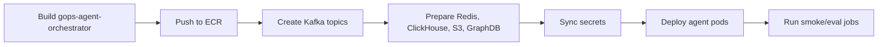

# GOPS Agent AWS Build And Deploy

이 문서는 AWS/EKS에서 GOPS agent runtime을 빌드하고 배포할 때 필요한 image,
Kafka, Redis/Valkey, ClickHouse, GraphDB, S3, Secret 계약을 정리한다.

## 추천 배포·migration 현재 계약

운영 추천 알고리즘 값은 `deterministic-evidence-v3`이며 `continuous-v2`는 유효한 실행
옵션이 아니다. order migration `0017_recommendation_score_profiles.sql`은 이름 있는 점수
프로필과 활성 프로필 revision, run scoring digest/snapshot을 추가한다. 동시에 자동
개인화 파생 preference/risk/event/candidate-feature 테이블과 관련 run 컬럼을 제거한다.
`orders`, `executions`, `order_coach_fill_history`, portfolio/evidence snapshot,
recommendation run/item/outcome은 보존 대상이다. 배포 전후 이 테이블들의 행 수와 FK
무결성을 확인해야 한다.

## Deployment Spine

배포 순서는 고정한다.

```text
image build
-> Kafka topics
-> Redis/ClickHouse/S3/GraphDB 준비
-> secrets
-> orchestrator/worker/delivery deploy
-> smoke checks
```



The default dev deploy entrypoint is `scripts/aws/deploy-dev-local.sh`. It runs
from an operator's local machine and deploys the latest remote `origin/dev`
commit by default, not local uncommitted changes. An explicit `REMOTE_BRANCH`
may select another remote branch for a validation deploy. `LOCAL_REF` selects a
committed local ref without pushing it; uncommitted files remain excluded. It records successful
deploy state per app image in EKS `ConfigMap/gops-dev-deploy-state` using
`service.<name>.lastSuccessfulSha`, then compares each service's own deployed
baseline with the selected remote target. This prevents a backend-only deploy from hiding an
older undeployed frontend change. For legacy state migration, the script falls
back to the old global `lastSuccessfulSha` only when `lastSuccessfulServices`
included that service, and otherwise reads the live primary Deployment image
tag as the baseline. Use `FORCE_SERVICES=frontend,backend` to override
detection, or `FORCE_SERVICES=all` to force every app image to rebuild. See
`docs/LOCAL_EKS_DEPLOY.md` for the team runbook.
The change detector and CI-overlay image-tag updater intentionally support the
macOS system Bash 3.2 as well as the newer Bash used by GitHub Actions; do not
reintroduce associative arrays in `scripts/aws/detect-changed-services.sh` or
`scripts/aws/update-ci-image-tags.sh`.
Changes under `infra/k8s/overlays/aws/scheduled/` must select the owning runtime
service so the deployment workflow applies the updated CronJob instead of
returning `has_services=false`.
Changes under `shared/chart-contract/` select both `frontend` and
`agent-orchestrator`, because the typed chart explanation contract is consumed on
both sides.

The chart commentary reader compatibility deploy is a read-only consumer rollout. Use
`CHART_INTERPRETATION_ONLY=true` together with
`FORCE_SERVICES=frontend,agent-orchestrator`. This path updates only
`gops-frontend`, `agent-analysis-worker`, and the compatibility
`agent-orchestrator`; it does not apply the full Kustomize overlay even though the
agent image is shared. It therefore leaves `chart-asset-builder`, the Geometry
CronJob, migration/maintenance Jobs, and unrelated agent workloads on their
existing specs and image tags. The profile fails closed when migration, cache
rebuild, or platform-apply options are enabled. Do not enqueue chart build FORCE
jobs or universe regeneration. Validate against the existing `geometry_assets`
rows through the API and browser; this rollout does not require Alpaca credentials
or a chart-asset builder run. This mode does not install a new commentary writer;
never use it to validate a writer or prompt change.

GitHub Actions dev/test deploy entrypoint `.github/workflows/deploy-dev.yml`
remains a backup path. It deploys to the shared dev EKS environment only when an
operator runs the workflow manually from GitHub Actions (`workflow_dispatch`).
The deploy job depends on a quality job that runs the unified Python test suite,
chart tests, TypeScript/Vite build, JavaScript bundle budget, and Kustomize
rendering before AWS credentials or ECR push are used.
Pushing to `dev`, `kimheejun`, `helix/front-chart`, `deploy/**`, or `test/**`
must not start a deployment by itself. When the manual `services` input is
empty, the workflow compares the current commit with the latest successful run
of the same workflow on the same branch and builds only the app services touched
by that diff. Use a comma-separated service list such as `frontend,backend` to
override detection, or `all` to force every app image to rebuild.
When `market-storage` is selected, the local script or workflow also runs
`scripts/aws/run-news-cache-rebuild-jobs.sh` after a healthy rollout. That
one-shot run uses the newly pushed `gops-market-storage` image to warm the
30-day Redis news article cache and daily summary cache from ClickHouse without
running ClickHouse rewrite mutations.

The frontend Logo.dev ticker logo key is a Vite build-time value. When
`frontend` is selected, the local deploy script or manual workflow reads AWS
Secrets Manager secret `icon/logodev` and injects only the `LOGODEV_PUB_KEY`
publishable key into the frontend Docker build. The secret may be a JSON object
such as
`{"LOGODEV_PUB_KEY":"pk_...","LOGODEV_SECRET_KEY":"sk_..."}`; the build helper
rejects non-`pk_` values and never embeds `LOGODEV_SECRET_KEY` in frontend
assets. The operator AWS profile or GitHub Actions AWS role must be allowed to
call `secretsmanager:GetSecretValue` on `icon/logodev`. If only the Logo.dev
secret value changes, run the local deploy with `FORCE_SERVICES=frontend` or the
manual workflow with `services=frontend` because Git diff cannot detect secret
rotations. `VITE_LOGO_DEV_ATTRIBUTION`/`LOGO_DEV_ATTRIBUTION` defaults to
`true`; set it to `false` only when the active Logo.dev plan permits removing
the visible attribution.

## Image

The existing `gops-agent-orchestrator` image also contains the trusted coach snapshot
builder, deterministic coach analytics, and the S3 snapshot archive adapter. Coach
analysis uses the existing request topic, `agent-analysis-worker`, Redis report store,
polling, and SSE delivery; it adds no Kafka topic or deployment. The worker builds one
snapshot from authenticated PostgreSQL rows plus cutoff-safe Redis/ClickHouse/GraphDB
serving data. The context provider does not call SEC, Yahoo, or Alpaca external APIs on
the request path. PostgreSQL source rows are read in one read-only repeatable-read
transaction. When archive is enabled it writes that snapshot once, with a canonical
SHA-256 digest and `If-None-Match: *`, before orchestration.

Agent runtime image:

```text
gops-agent-orchestrator
infra/docker/Dockerfile.gops-agent-orchestrator
```

이 image가 실행하는 runtime:

```text
agent-orchestrator
agent-analysis-worker
chart-asset-builder
agent-delivery-gateway
agent-intent-classifier
deep-analysis-worker
agent-event-detector
agent-notification-publisher
graph-expansion-refresh
chart-asset-migrations one-shot job
agent queue/report/graph/retrieval/grounding smoke jobs
```

Image에는 다음 source가 들어가야 한다.

```text
systems/agent-orchestration
systems/market-data/shared
systems/market-data/config/sp500-universe.json
systems/market-data/config/sp500-heatmap-seed.json
```

The coach point-in-time context provider uses `sp500-heatmap-seed.json` only as
timestamped company/sector metadata fallback. The image must preserve the seed's
`sourceRetrievedAt`; rows newer than a trade cutoff remain ineligible instead of
being treated as historical fact.

현재 agent provider가 `alfaka.*` helper를 import하므로
`systems/market-data/shared`를 image에서 빼면 안 된다. 이 dependency를 제거하려면
먼저 agent-owned provider interface를 만든 뒤 migration한다.

Agent entity resolver는 기본 운영 catalog로
`systems/agent-orchestration/config/entity-aliases.json`을 읽는다.
`entity-aliases.seed.json`과 Python seed constants는 bootstrap fallback이다.

Backend/API image:

```text
gops-api-server
infra/docker/Dockerfile.gops-backend
```

`gops-backend`도 `GET /api/agents/entities/resolve`에서 agent entity resolver를
직접 실행하므로 image에 다음 source가 함께 들어가야 한다.

```text
systems/agent-orchestration/config
systems/agent-orchestration/shared
systems/market-data/config
systems/market-data/shared
systems/order/shared
systems/api-server/pods/api-server/gops-backend
```

`systems/agent-orchestration/config`가 빠지면 backend가 bootstrap seed로 degrade해
운영 alias catalog에만 있는 회사명/한글명 shortcut을 놓칠 수 있다.

같은 `gops-api-server` image는 `app.recommendations.worker`도 실행한다. 이 worker는
프로필이 저장된 사용자에 대해 정규장 09:45/12:45/15:45 ET 추천 슬롯을 멱등
생성하고, 기존 notifications Redis/WebSocket 경로로 추천 변경 알림을 발행한다.

같은 image는 `app.trade_conditions.executor`도 실행한다. 이 consumer는
`alerts.triggered.v1`의 price-cross 이벤트를 `gops-trade-condition-executor-v1`
group으로 읽고 PostgreSQL 조건을 점유한 뒤 기존 paper 또는 orders/outbox 계약으로
한 번만 주문을 제출한다. Agent image나 LLM process에서는 실행하지 않는다.

SEC companyfacts backfill은 `gops-agent-orchestrator`가 아니라
`gops-market-storage` image에서 실행한다. 해당 image에는
`systems/fundamentals`와 `systems/market-data/shared`가 포함되어야 한다.

Chart derived data is calculated in `gops-backend`. Indicators and candle-based
volume profile share the canonical candle facade, Redis TTL cache, and bounded
singleflight. There is no separate worker, Kafka request queue, or ClickHouse
request-hash artifact. Volume profile v1 remains an `estimated` candle OHLCV
result for the requested chart interval.

Bid/ask order-flow profile은 derived-worker가 아니라 market processor와 EOD
rollup job이 담당한다. Live path는 pinned symbol trade/quote를 Redis
`order-flow:{symbol}:minutes` ZSET과 `order-flow:{symbol}:live-minute` string에
캔들형 minute blob으로 적고 `ORDER_FLOW_BINS_UPDATE`를 WebSocket에 팬아웃한다.
`alfaka-market-processor` also consumes raw quotes with
`ORDER_FLOW_QUOTE_CACHE_ONLY=true` to keep pinned-symbol NBBO in process for
classification, while `alfaka-market-quote-processor` remains responsible for
quote layer publishing and Redis live quote state.
Daily rows는
`systems/market-data/jobs/order-flow-daily-rollup/main.py`와
`infra/k8s/overlays/aws/scheduled/cronjob-order-flow-daily-rollup.yaml`이 ClickHouse
`market_data.order_flow_profile_daily`에 적재한다. Shared dev deploys that use
`aws-incluster-app-ci` inherit this scheduled CronJob through the in-cluster app
overlay by referencing the same AWS manifest; there is no mirrored CronJob copy
to drift. One-off backfill Jobs remain manual.
For skew investigations, operators can run
`PYTHONPATH=systems/market-data/shared .venv/bin/python scripts/local/orderflow_verify.py --symbol NVDA --date YYYY-MM-DD --json`
against the target ClickHouse/API environment. The script is read-only and
compares live intraday data, as-of tick recomputation, and daily rollup rows.

Market storage image also runs ClickHouse projection loaders. The baseline
`alfaka-clickhouse-loader` consumes closed candle, event, and news topics.
`alfaka-clickhouse-tick-loader` consumes `market.layer.trades.v1` and
`market.layer.quotes.v1` with multiple replicas in the same consumer group so
trade/quote tick tables used by order-flow rollups can catch up independently
from candle/news persistence.
The loaders batch Kafka payloads before ClickHouse HTTP insert
(`CLICKHOUSE_INSERT_BATCH_SIZE`, `CLICKHOUSE_FLUSH_INTERVAL_SECONDS`,
`KAFKA_CLICKHOUSE_MAX_POLL_RECORDS`). Tick batches preserve Kafka
topic/partition/offset metadata, use deterministic ClickHouse insert tokens,
and commit only successfully inserted offsets. `CLICKHOUSE_RECENT_SOURCE_EVENT_IDS`
adds a bounded per-pod replay guard; existing ClickHouse volumes also require
the operator tick-retention migration to enable the non-replicated deduplication
window. Prefer bounded batching over adding replicas because a hot Kafka
partition is still owned by one consumer at a time.

## Kubernetes Resources

Required deployments:

```text
infra/k8s/base/app/deployment-agent-orchestrator.yaml
infra/k8s/base/app/deployment-agent-analysis-worker.yaml
infra/k8s/base/app/deployment-agent-delivery-gateway.yaml
```

Optional deployments:

```text
infra/k8s/base/app/deployment-agent-intent-classifier.yaml
infra/k8s/base/app/deployment-deep-analysis-worker.yaml
infra/k8s/base/app/deployment-agent-event-detector.yaml
infra/k8s/base/app/deployment-agent-notification-publisher.yaml
infra/k8s/base/app/deployment-recommendation-worker.yaml
infra/k8s/base/app/deployment-trade-condition-executor.yaml
```

The AWS in-cluster overlay keeps `recommendation-worker` and
`alert-evaluator` at 0 replicas until the deployed `gops-api-server` image
includes `app.recommendations.worker` and `app.alerts.evaluator`. Remove those
overlay patches only after rebuilding and rolling out an API image that contains
the recommendations and alerts packages.

Optional jobs:

```text
infra/k8s/base/job-agent-queue-smoke.yaml
infra/k8s/base/job-report-store-smoke.yaml
infra/k8s/base/job-graph-expansion-*.yaml
infra/k8s/base/job-retrieval-*.yaml
infra/k8s/base/job-sec-fundamentals-backfill.yaml
infra/k8s/base/job-fanout-policy-benchmark.yaml
infra/k8s/base/job-answer-grounding-eval.yaml
```

In-cluster dedicated rebuild sizing:

```text
app-agent:  4 x m5a/m6a large class, 2 vCPU / 8 GiB, app + agent + workers
cache-db:   1 x r5a large class, 2 vCPU / 16 GiB, Redis + Postgres
streaming:  1 x m5a/m6a large class, 2 vCPU / 8 GiB, Kafka
graphdb:    1 x r5a large class, 2 vCPU / 16 GiB, GraphDB
clickhouse: 1 x m5a/m6a xlarge class, 4 vCPU / 16 GiB, ClickHouse
batch:      0 steady nodes, dynamic capacity for ad hoc Jobs
```

This profile uses 18 vCPU in steady state, excluding cluster add-ons. The live
cluster keeps one 2 vCPU `general-purpose` node for CoreDNS, AWS Load Balancer
Controller, metrics-server, and external-secrets, bringing the normal total to
20 vCPU. A dynamic batch node temporarily brings it to 24 vCPU.

`app-agent`, `cache-db`, `streaming`, `graphdb`, and `clickhouse` use static
`spec.replicas` to hold the intended node count. Scheduled and ad hoc Jobs use
the dynamic `batch` pool, so their active deadlines must include scale-from-zero
provisioning time. The five stateful and app pools use custom NodeClasses with
20 GiB and 50 GiB node-local ephemeral storage respectively; application PVC
sizes are unchanged.

The app overlay uses `maxUnavailable=1` and `maxSurge=0` for Deployment rolling
updates. That intentionally allows one old pod to stop before a replacement pod
is scheduled, which avoids rollout deadlocks on the fixed-size `app-agent`
NodePool.

Stateful platform rebuilds must preserve DB data. Do not use a blank fresh PVC
for Postgres, ClickHouse, or GraphDB. A fresh PVC in a rebuild means a new volume
restored from a verified backup or snapshot. Redis and Kafka are preserved by
default unless the owning pipeline explicitly approves a reset. See
`docs/EKS_DATA_PRESERVING_REBUILD_PLAN.md` for the dedicated NodePool rebuild
runbook, restore validation, and rollback guardrails.

Approval-time order: scale app/agent/market/order Deployments to 0, suspend
CronJobs, delete active Jobs after recording them, create and verify stateful
backups, scale down platform StatefulSets, apply NodePools and platform
manifests, restore data into new PVCs, validate Postgres/ClickHouse/GraphDB and
any preserved Redis/Kafka state, then restore app workloads and resume CronJobs.

Prepared backup helpers:

```text
scripts/aws/prepare-rebuild-shutdown.sh
scripts/aws/collect-platform-backup-inventory.sh
scripts/aws/backup-postgres-logical.sh
scripts/aws/restore-postgres-logical.sh
scripts/aws/backup-redis-rdb.sh
scripts/aws/restore-redis-rdb.sh
scripts/aws/backup-graphdb-pvc.sh
scripts/aws/create-pvc-ebs-snapshots.sh
scripts/aws/restore-graphdb-pvc.sh
```

The dev deploy workflow automatically runs the idempotent order migration Job before
app apply whenever `order-worker` is selected and the chart asset migration Job whenever
`agent-orchestrator` is selected. Selecting `agent-orchestrator` also selects
`order-worker`, so neither schema consumer can roll out ahead of its PostgreSQL schema.
The legacy `run_order_migrations=true` and `run_chart_asset_migrations=true` inputs remain
only as compatibility force switches. News cache rebuild remains explicit with
`rebuild_news_cache=true` and `market-storage`.

AI coach requires order migration `0006_ai_coach.sql` before the new worker is rolled
out. It adds order ownership, change-only append portfolio snapshot history, and decision-check
events; `0007_ai_coach_execution_index.sql` adds the `(order_id, created_at)` execution
lookup index used by the point-in-time fill joins. GitHub Actions and the local deploy
entrypoint apply all pending order migrations automatically before app rollout when the
order or coach analytics image set is selected. Deploy the backend/order writers that
populate `orders.user_sub` before relying on user-scoped coach history. Existing rows
without ownership remain unavailable rather than being guessed or assigned. The snapshot
builder intentionally returns missing-data states when historical rows do not yet exist;
it must never query another user's rows. The local order and chart migration gates are
automatic; `RUN_ORDER_MIGRATIONS=true` and `RUN_CHART_ASSET_MIGRATIONS=true` are retained
only for compatibility. News rebuilds remain explicitly controlled by
`REBUILD_NEWS_CACHE=true`. Migration Jobs run after image push but before app apply.

AI 코치 알람 출처를 저장하는 배포는 `0008_alert_proposal_source.sql`도 선행해야
한다. 이 migration은 nullable `alerts.proposal_source`와 네 허용값 CHECK를 추가한다.
updated API의 INSERT와 `agent-analysis-worker`의 snapshot SELECT가 모두 이 컬럼을
사용하므로 migration Job 성공 전에 두 workload를 rollout하면 안 된다. 기존 알람은
null로 호환되며 Redis projection, Kafka topic, evaluator schema 변경은 필요하지 않다.

Continuous recommendation V2 requires `0012_continuous_recommendation_v2.sql`. It creates
the append-only canonical KIS ledger `order_coach_fill_history`, immutable preference and
risk state/event tables, and full-candidate feature evidence. It also adds run provenance
columns for algorithm/state/model/fundamental versions and the reproducible input digest.
The ledger uses stable `fill_id="kis:{order_id}"` plus an observation version and stores
normalized cumulative quantity, fill price, decision/fill timestamps, source execution,
and payload digest. KIS reconciliation keeps audit rows in `executions`; equal or lower
cumulative replay does not append history, while every strictly advancing positive real
fill is stored in the same transaction as canonical order state. Paper and simulator
orders never enter this ledger. Historical real executions are backfilled only when user,
quantity, price, and timestamps can be normalized safely. API, recommendation-worker, and
order-reconciler images must not roll out before this migration. The normal automatic
order-migration gate applies before app rollout; this is not a manual PostgreSQL step.

On an actual paper fill the matcher also writes one `paper:{order_id}`-scoped before/after
pair to `user_portfolio_snapshot_history` in its fill transaction. Those snapshots carry
`valuationBasis="cost_basis"`; they intentionally do not claim current market valuation.
Existing paper fills are not retroactively assigned a guessed portfolio pair.

The holdings endpoint may be polled every minute. PostgreSQL always refreshes the latest
observation, but appends portfolio history only when payload content differs after
top-level `asOf`/`sourceAsOf` timestamps are removed. A per-user advisory transaction
lock serializes the compare/upsert operation: poll-only timestamp changes do not grow RDS
history, while changed positions, cash, valuations, or transaction states remain durable.

Persistent paper trading requires `0006_paper_trading.sql`. Changes to
`paper-order-matcher` select `order-worker`, so the same automatic migration gate
applies the paper account schema before the matcher and backend workloads roll out.

가격 조건 기능은 order migration `0008_trade_conditions.sql`이 필요하다. 이
migration은 alert notification delivery flag와 사용자 소유 조건·proposal·trigger
멱등 상태를 추가한다. backend/agent/order-worker image를 적용하기 전에 기존 자동
order migration gate로 먼저 실행해야 한다. base ConfigMap은 실행 모드를 `off`로
두고, 로컬 compose는 `sim`, AWS dev overlay는 KIS v1 제한에 맞춰 `demo`를 사용한다.
`demo`도 사전 리스크 검사와 기존 orders/outbox/KIS demo adapter를 우회하지 않는다.

사용자 알림 표시 설정은 order migration `0009_notification_preferences.sql`이
필요하다. `user_notification_preferences`에 설정과 기업별 override를 저장하므로
backend 적용 전에 같은 자동 order migration gate로 실행한다.

다중 조건과 Agent 알림 생성은 `0010_alert_condition_rules.sql`이 필요하다. 이
migration을 backend와 alert-evaluator보다 먼저 적용한다. alert-evaluator는 trades와
1m/5m/10m/1h/4h/1D closed candle topic을 모두 받도록
`ALERT_EVALUATOR_INPUT_TOPICS`를 설정하고, 시작 이력 warm-up을 위해 ClickHouse
secret도 주입한다. 개장·마감 알림 CronJob은 5분 간격 ET 스케줄을 유지하지만,
실제 NYSE 개장 또는 마감 이후 2분 안에서만 `system.market_opened` 또는
`system.market_closed`를 발송한다. 휴장일, DST, 기본·환경설정 조기 폐장은 공통
시장 캘린더가 계산하며 사전 알림과 늦게 실행된 작업은 발송하지 않는다.

Market processor deploys as two runtime units from the same
`gops-market-processor` image. `alfaka-market-processor` handles trades, bars,
updated bars, daily bars, and events. `alfaka-market-quote-processor` handles
quotes in a separate consumer group. Select `market-processor` in the deploy
workflow to roll both Deployments together.

Market ingestor deploys multiple runtime units from the same
`gops-market-ingestor` image. `alfaka-alpaca-ingestor-sip` handles SIP baseline
bars/statuses and active SIP trades/quotes on one WebSocket connection so the
runtime stays within Alpaca SIP connection limits. `alfaka-alpaca-ingestor-boats`
handles overnight BOATS, and `alfaka-alpaca-news-ingestor` handles Alpaca news.
The former BTC crypto ingestor is retired. Select `market-ingestor` in the
deploy workflow to roll the active SIP, BOATS, and news Deployments together.

Config and overlay references:

```text
infra/k8s/base/app/configmap.yaml
infra/k8s/base/kustomization.yaml
infra/k8s/overlays/aws/configmap-aws-patch.yaml
infra/k8s/overlays/aws/kustomization.yaml
infra/k8s/overlays/aws-incluster-app/configmap-incluster-patch.yaml
infra/k8s/overlays/aws-incluster-app/kustomization.yaml
infra/k8s/overlays/aws-incluster-app-ci/kustomization.yaml
infra/k8s/overlays/aws-incluster-app-rebuild/kustomization.yaml
```

GitHub Actions uses `aws-incluster-app-ci` for manual dev/test deploys. That CI
overlay deliberately deletes the GraphDB StatefulSet from the rendered app
bundle so immutable PVC template changes cannot break ordinary app deploys.
It still includes scheduled app-runtime CronJobs such as the order-flow daily
rollup; one-shot Jobs remain outside the automatic apply path.
Both `aws` and `aws-incluster-app` reference the same scheduled bundle, which includes
`order-reconciler`. That CronJob runs the `gops-order-worker` image every five minutes with
`concurrencyPolicy: Forbid`, `KIS_ENV=demo`, bounded date/page/row limits, required
`alfaka-order-db-secret`, the existing Secrets Manager IRSA service account, and an
ephemeral `/kis-cache` token volume. `KIS_ENV=real` remains rejected in code.
By default it does not apply platform NodePools or perform the clean rebuild.
Set the workflow input `apply_platform_manifests=true` only after the
data-preserving rebuild has been approved or completed; that path applies the
dedicated NodePools, in-cluster platform StatefulSets, and GraphDB StatefulSet
without deleting PVCs, then validates stateful pod placement before app rollout.

The app overlay declaratively keeps `alert-evaluator` and
`recommendation-worker` at one replica. CI does not read live replica counts or
rewrite desired replicas; Git is the source of truth for both workers.

Recommendation rollout accepts the explicit selector
`RECOMMENDATION_ALGORITHM_VERSION=legacy|professional-v1|deterministic-evidence-v3`.
When it is absent,
the existing `RECOMMENDATION_PERSONALIZATION_ENABLED` and
`RECOMMENDATION_PERSONALIZATION_SHADOW` behavior remains unchanged for professional-v1.
`continuous-v2` is invalid. API and recommendation-worker must receive the same selector.
The public recommendation routes do not accept a premarket/regular selector; keep both API
and worker clocks configured consistently because the server resolves the active scoring
session internally.

`deterministic-evidence-v3` is non-predictive and ignores the shadow flag. Before activating
direct recommendation v1 and company-grounded narrative, apply migrations `0013` through `0016` after `0012`; verify canonical cutoff-safe candles, quotes/spreads,
tradability, news metadata, fundamentals, benchmark data, universe membership, and exchange
calendar inputs for the complete prepared S&P 500 universe. The API and worker must be able to
read and write the shared evidence snapshot tables. Rollback only changes the selector; the
additive evidence rows remain immutable.

Both AWS app overlays declare `ALPACA_BENCHMARK_SYMBOLS=SPY`, subscribe it to bars,
updated bars, daily bars, and statuses, and inject `alfaka-openai-secret` into the
recommendation worker. The benchmark remains outside the heatmap/candidate universe. V3
activation requires 252 SPY completed dailies through the prior day, at least 380 prior-session
minutes, fresh current data matching in Redis and ClickHouse, and 15 reliability-qualified
candidates. Failure is `data_not_ready`, never a legacy recommendation. Narrative rollout uses
`RECOMMENDATION_NARRATIVE_PROVIDER=openai` and optional
`RECOMMENDATION_NARRATIVE_MODEL`; it falls back to deterministic Korean text without changing rank.
Natural-language score-profile proposals use the same `OPENAI_API_KEY` secret with optional
`RECOMMENDATION_PROFILE_SUGGESTION_MODEL` and
`RECOMMENDATION_PROFILE_SUGGESTION_TIMEOUT_SECONDS`. Set
`RECOMMENDATION_PROFILE_SUGGESTION_LLM_REQUIRED=true` only when a provider failure should reject
the request instead of returning the validated deterministic retrieval draft. The API pod needs
the key because this proposal endpoint is synchronous; it never writes or activates a profile.

The fixed historical recommendation override is separate from live narrative generation. Both AWS
app overlays set `RECOMMENDATION_FIXED_REPLAY_ENABLED=true` and
`RECOMMENDATION_DECISION_V1_ENABLED=true`, and point
`RECOMMENDATION_FIXED_REPLAY_PATH` at the image-bundled
`recommendation-v3-2026-07-15` artifact. Backend startup validates the manifest, file SHA-256, and
the common evidence-pool digest. Request handling reads only profile, preference, and portfolio
history rows at or before the evidence cutoff, then produces a user-specific recommendation digest.
The recommendation worker performs no profile scan, DB write, or notification
while the override is enabled. Rollback removes/disables only the fixed override keys; the ordinary
algorithm selector remains `deterministic-evidence-v3`.

Migration `0015`, artifact verification, and API/UI smoke tests remain activation prerequisites.
Setting `RECOMMENDATION_DECISION_V1_ENABLED=false` restores the observation-only fixed
recommendation contract without disabling the historical replay provider.

The artifact uses `sourceMode=historical_reconstruction`: candle and quote eligibility is based on
`event_time <= 2026-07-14 16:00 ET`, while later insertion timestamps are preserved in manifest
provenance. The pool stores the full 30-candidate V3 evidence set and fixed entry-plan inputs; raw
ClickHouse rows remain outside git. Its natural-language layer is `company_grounded`; artifact 생성
시 Redis 10-K 프로필과 cutoff-safe 뉴스가 있으면 검증된 AI 문장 재료를 동결하고, 없으면
회사명·업종 기반 결정론적 재료를 동결한다. 요청 시에는 외부 요청 없이 frozen context와
개인화 action만 조합한다.

For the staged deploy, keep an explicit container env override at `legacy` while applying the
image and migrations, replace it with `deterministic-evidence-v3` only after the gates and offline
replay pass, and validate a newly created 30-minute slot. Rollback sets the same explicit override
back to `legacy`; migrations `0013` through `0016` and evidence rows remain intact.

A Git merge or push does not deploy this selector, application image, or database migration.
Use the manual dev/test deploy workflow and treat the following as hard activation gates:
the backend and recommendation-worker run the merged image, migrations `0011` through `0016`
are present, and SPY plus the candidate universe have the required completed daily and prior
regular-session minute candles. The timestamped live AWS audit, measured gaps, backfill
commands, portfolio/fill requirements, and verification order are maintained in
`AWS_RECOMMENDATION_DATA_PREPARATION.md`. Fundamental provider availability is not a hard
V2 gate because the validated nine-factor fallback is supported.

Before activating `continuous-v2`, apply migration `0012`, verify that canonical real-fill
rows advance only on increasing cumulative quantity, and validate that the injected
fundamental batch has complete schema/version/digest provenance with `sourceAsOf` no later
than the recommendation cutoff. Missing or rejected fundamentals are a supported
nine-factor fallback and should be visible in metrics rather than blocking the run.
Monitor skipped preference-event reasons, candidate feature row counts, state versions,
input digests, portfolio valuation basis, and the risk sample gates. Roll back by setting
the selector to `professional-v1` or `legacy`; the additive V2 schema remains in place and
completed V2 slot evidence stays immutable. No Terraform, Kubernetes, compose, or AWS
manifest change is required for this algorithm rollback.

For the older flag-controlled professional rollout,
`RECOMMENDATION_PERSONALIZATION_ENABLED=false` keeps the legacy scorer. Set it to `true`
with `RECOMMENDATION_PERSONALIZATION_SHADOW=true` first to persist versioned professional
scores without changing visible ranking. After out-of-sample and data-quality review, set
shadow to `false` to rank by `personalScore`.
An approved learned set may be supplied through
`RECOMMENDATION_PROFESSIONAL_WEIGHTS_JSON`; keep the JSON in a versioned ConfigMap
or equivalent registry projection. The backend rejects missing factor keys,
negative weights, sums other than 100, drift beyond ±10 percentage points, and
sets without explicit approval plus out-of-sample improvement.

The market and quote processors use per-workload `DoNotSchedule` topology spread
constraints with `minDomains=3`, so their three replicas cannot collapse onto
one node. Their
readiness/liveness probes check a local heartbeat updated after every bounded
Kafka poll. The order outbox, paper-order matcher, and KIS adapter use the same
loop-heartbeat pattern. `paper-order-matcher` is a single-replica consumer of
`market.layer.quotes.v1` in group `gops-paper-order-matcher-v1`; it uses the
existing `gops-order-worker` image and creates no additional Kafka topic.
Because that image now includes `systems/market-data/shared` for Kafka and
subscription contracts, market-data shared changes also rebuild `order-worker`.
The matcher reconciles pending-order and current-position subscription cohorts
from Postgres every `PAPER_SUBSCRIPTION_SYNC_SECONDS` (default 5 seconds), so a
temporary API-to-Redis synchronization failure heals without a new order.

Scheduled batch Jobs declare resource requests/limits. Failed Job and Pod
evidence is retained for seven days. Heavy scheduled Jobs use the dynamic
`batch` NodePool; the lightweight five-minute market reminder runs on the
always-on `app-agent` pool. The order-flow rollup remains suspended until its
deployed image contains the configured script path.

## Kafka

Agent topics:

```text
agents.market-events.v1
agents.analysis-requests.v1
agents.deep-analysis-requests.v1
agents.analysis-results.v1
agents.query-understanding-events.v1
agents.notification-decisions.v1
agents.dlq.v1
```

`agent-notification-publisher`는 notification decision topic뿐 아니라
`agents.market-events.v1`과 risk event topic도 소비한다. 따라서 deployment의
`AGENT_MARKET_EVENTS_TOPIC`을 event detector와 같은 topic으로 유지해야 한다.

Chart derived env:

```text
CHART_INDICATOR_CACHE_TTL_SECONDS
CHART_VOLUME_PROFILE_CACHE_TTL_SECONDS
CHART_DERIVED_INLINE_LOCK_TTL_SECONDS
CHART_DERIVED_INLINE_WAIT_MS
SUBSCRIPTION_EVENTS_MAXLEN
ORDER_FLOW_PINNED_SYMBOLS
ORDER_FLOW_PRICE_BIN_SIZE
ORDER_FLOW_QUOTE_REFRESH_MS
ORDER_FLOW_QUOTE_MAX_AGE_MS
ORDER_FLOW_QUOTE_FUTURE_TOLERANCE_MS
ORDER_FLOW_PUBLISH_THROTTLE_MS
ORDER_FLOW_REDIS_FLUSH_MS
ORDER_FLOW_LIVE_TTL_SECONDS
ORDER_FLOW_LIVE_MINUTE_TTL_SECONDS
ORDER_FLOW_QUOTE_CACHE_ONLY
QUOTE_REDIS_WRITE_MIN_INTERVAL_MS
QUOTE_EVENT_PUBLISH_MIN_INTERVAL_MS
TRADE_REDIS_WRITE_MIN_INTERVAL_MS
HEALTH_WRITE_MIN_INTERVAL_MS
ON_DEMAND_FILL_DISTRIBUTED_SINGLEFLIGHT_ENABLED
ON_DEMAND_FILL_SINGLEFLIGHT_LOCK_TTL_SECONDS
ON_DEMAND_FILL_SINGLEFLIGHT_TERMINAL_TTL_SECONDS
```

Kafka bootstrap env:

```text
KAFKA_BOOTSTRAP_SERVERS
AGENT_ANALYSIS_REQUESTS_TOPIC
AGENT_DEEP_ANALYSIS_REQUESTS_TOPIC
AGENT_ANALYSIS_RESULTS_TOPIC
AGENT_QUERY_UNDERSTANDING_EVENTS_TOPIC
AGENT_NOTIFICATION_DECISIONS_TOPIC
AGENT_MARKET_EVENTS_TOPIC
AGENT_DLQ_TOPIC
AGENT_PUBLISH_TO_KAFKA
TRADE_CONDITION_TRIGGER_TOPIC
TRADE_CONDITION_EXECUTOR_GROUP_ID
```

Price-condition execution env:

```text
TRADE_CONDITION_COMMANDS_ENABLED
TRADE_CONDITION_EXECUTION_MODE   # off | sim | paper | demo
TRADE_CONDITION_RISK_REQUIRED
```

AWS stage는 MSK를 강제하지 않는다. 현 구조는 다음 staged path를 허용한다.

```text
local compose -> single Kafka pod candidate -> MSK candidate
```

The single-pod Kafka StatefulSet mounts its PVC directly at
`/var/lib/kafka/data` and uses `/var/lib/kafka/data/data` as `log.dirs`. The
official `apache/kafka` image declares the parent path as an image volume, so
mounting only `/var/lib/kafka` allows the image volume to shadow the PVC. The
child log directory preserves the layout created by that former parent mount
and keeps filesystem metadata such as `lost+found` outside Kafka's log scan.

Short-retention market topics must set `segment.ms` and `segment.bytes` together
with `retention.ms`. Kafka deletes only closed segments; `retention.ms` alone can
retain an active default 1 GiB/7-day segment far beyond the intended 30-minute
or 2-hour window.

Topic 이름을 바꾸려면 backend queue submitter, worker consumer, delivery gateway,
platform topic creation을 같이 바꿔야 한다.

## Redis Or Valkey

Redis/Valkey는 report store, idempotency mapping, SSE update fanout, graph
cache에 쓰인다.

```text
REDIS_URL
AGENT_SHARED_REPORT_STORE_ENABLED
AGENT_REPORT_STORE_BACKEND
AGENT_REPORT_TTL_SECONDS
AGENT_REPORT_STREAM_REDIS_ENABLED
AGENT_REPORT_UPDATES_CHANNEL
AGENT_IDEMPOTENCY_TTL_SECONDS
AGENT_IDEMPOTENCY_KEY_PREFIX
AGENT_GRAPH_PATH_CACHE_BACKEND
AGENT_GRAPH_PATH_CACHE_TTL_SECONDS
AGENT_GRAPH_PATH_CACHE_NO_DATA_TTL_SECONDS
AGENT_GRAPH_PATH_CACHE_KEY_PREFIX
AGENT_GRAPH_EXPANSION_CACHE_ENABLED
AGENT_GRAPH_EXPANSION_REDIS_PREFIX
```

Required report keys/channels:

```text
agent:report:{analysisId}
agent:report:latest:{SYMBOL}
agent:report:latest
agent:report:owner:{analysisId}
agent:request:idempotency:{userHash}:{keyHash}
agent.reports
agent.reports:{analysisId}
gops:agent:graph-expansion:v1:{symbol}
gops:fundamentals:summary:v1:{SYMBOL}
gops:fundamentals:peer:v1:{SYMBOL}:latest
gops:fundamentals:peer:v1:{SYMBOL}:{FRAME_PERIOD}
```

Fundamentals Redis keys are written by the SEC companyfacts backfill job and
future reconcile jobs. Agent runtime trusts Redis hits and does not perform
ClickHouse stale checks on the hot path.

## ClickHouse

Agent providers read ClickHouse serving tables. ClickHouse must be reachable
before worker smoke checks are considered valid.

`alfaka-market-processor` and `alfaka-market-quote-processor` initialize the
canonical candle correction loader at startup, so both runtimes also consume
`CLICKHOUSE_PASSWORD` from Kubernetes Secret `alfaka-clickhouse-secret`. The
base manifests keep this Secret optional for portable local deployments, while
the AWS in-cluster overlay makes it mandatory so a missing credential blocks
Pod creation instead of falling back to an invalid default password.

`dev` merge/pull is not the ClickHouse migration boundary. Local ClickHouse and
AWS ClickHouse are separate runtimes, so merge conflict resolution should only
preserve code contracts and DDL files. Switching to a new AWS ClickHouse,
initializing schemas, rebuilding Redis projections, and S3 prefix cleanup are
push/deploy maintenance tasks that run against the AWS environment after the
merged image set is ready.

```text
CLICKHOUSE_HTTP_URL
CLICKHOUSE_DATABASE
CLICKHOUSE_USER
CLICKHOUSE_PASSWORD
AGENT_ENTITY_ALIAS_CATALOG_PATH
AGENT_ENTITY_ALIAS_SEED_PATH
AGENT_ENTITY_CATALOG_STRICT
AGENT_MARKET_SYMBOL_REGISTRY_PATH
```

Tables used by agent providers:

```text
market_data.symbols
market_data.news_articles
market_data.news_article_localizations
market_data.news_company_daily_summaries
market_data.agent_graph_expansions
market_data.sec_company_tickers
market_data.sec_filing_events
market_data.sec_raw_artifacts
market_data.sec_financial_facts
market_data.sec_derived_metrics
market_data.sec_frames
market_data.sec_collection_runs
market_data.yahoo_earnings_estimates
```

The coach context provider runs once per immutable snapshot. It accepts Redis live-trade
prices only when separate received/inserted time proves availability by the request cutoff,
the quote is not earlier than the fill, and it is within the configured freshness window
(96 hours by default). The current event-time-only Redis row therefore falls back to
deterministic, cutoff-bounded ClickHouse `trade_ticks` and closed `chart_candles` rows. Daily similarity
features select a canonical candle revision with `inserted_at <= decisionAt`; display and
outcome rows may use only revisions inserted by the immutable request cutoff. News requires
published/received/inserted availability before each fill. SEC facts use stored filing,
revision, computation, and insertion dates; because the current schema has filing-date
precision, same-trading-day filings are excluded from historical entry evidence. Yahoo
earnings rows are useful only when collected and inserted before the request cutoff and
are marked `historicalRevisionAvailable=false`; the current ReplacingMergeTree cannot
prove a prior consensus revision. GraphDB evidence is current-only and is excluded from
historical similarity. Missing or ineligible rows produce `missingData`, not a current-data
substitution.

Portfolio market-diversification context follows the same rule. The worker may use only
stored, cutoff-bounded daily series for held symbols, sector/market benchmarks, and the
recorded portfolio valuation snapshot to calculate correlation and relative strength.
When the required series or sector mapping is absent, the report omits candidate markets
and exposes a data-connection state; no OpenAI response or generic allocation fills that
gap.

News provider는 Redis 30일 article/daily hot cache를 우선 사용하고, daily coverage
metadata가 최근 30일 요청을 보장하지 못할 때 ClickHouse serving rows로 보강해
Redis를 다시 warm-up한다.
News cache rebuild Jobs warm Redis from ClickHouse rows by default and keep
ClickHouse rewrite/mutation disabled unless
`NEWS_INTELLIGENCE_REBUILD_REWRITE_CLICKHOUSE=true` is set intentionally.
`market_data.agent_graph_expansions`는 GraphDB에서 미리 계산한
관계 hint를 warm/deep path에서 재사용하기 위한 table이다.

When AWS ClickHouse is replaced, do not migrate rows from the broken instance.
Create the schema from `infra/clickhouse/initdb/01-market-data.sql` and
`infra/clickhouse/initdb/02-sec-fundamentals.sql`, then rebuild projections from
the official sources: S3 final/manifest for chart history, SEC companyfacts for
actual fundamentals, and the separate Yahoo estimates collector for consensus
data. The normal `aws-incluster-app-ci` deploy overlay includes
`alfaka-yahoo-estimates-sync` with live writes enabled so that this collector is
not omitted from the shared dev EKS rollout. Redis reset must be targeted to fundamentals summary/peer keys and chart
live/latest/coverage keys; do not flush agent reports, sessions, or unrelated
caches.

## SEC Fundamentals

SEC fundamentals are collected by `systems/fundamentals`, not by the agent
runtime. The implemented initial-load job is
`systems/fundamentals/jobs/sec-companyfacts-backfill/main.py` and should run in
the `gops-market-storage` image. Initial load uses SEC `companyfacts.zip` bulk
data. Incremental
sync should use EDGAR latest filings RSS/full-index or submissions index, then
re-fetch `companyfacts` only for companies with new `10-K`, `10-Q`, `10-K/A`, or
`10-Q/A`. `8-K` is stored as an event and does not trigger metric recomputation
by default.

안정성 지표 확장은 새 테이블 migration을 요구하지 않는다. SEC 원천 계정은 기존
`sec_financial_facts`, 파생값은 기존 `sec_derived_metrics` metric rows에 적재한다.
배포 후 기존 종목에 현금성자산, 유동부채, 이자비용과 8개 안정성 지표를 채우려면
`sec-companyfacts-backfill`을 다시 실행해 ClickHouse와 fundamentals Redis summary를
함께 갱신한다. 기존 테이블 또는 다른 Redis key를 삭제하거나 flush하지 않는다.

Required env:

```text
SEC_USER_AGENT
SEC_COMPANYFACTS_ZIP_URL
SEC_FUNDAMENTALS_S3_PREFIX
SEC_FUNDAMENTALS_DRY_RUN
SEC_FUNDAMENTALS_MAX_COMPANIES
SEC_FUNDAMENTALS_BATCH_SIZE
SEC_FUNDAMENTALS_LOAD_FRAMES
S3_BUCKET
REDIS_URL
CLICKHOUSE_HTTP_URL
CLICKHOUSE_DATABASE
CLICKHOUSE_USER
CLICKHOUSE_PASSWORD
```

`SEC_USER_AGENT` must include a contact email or URL. SEC requests are limited
to at most 8 requests per second. S&P 500 membership comes from
`systems/market-data/config/sp500-universe.json`; ticker/CIK mapping is stored in
`market_data.sec_company_tickers`. Universe removals update
`is_active_universe_member`; historical facts and metrics are retained.

AWS scheduled sync:

```text
infra/k8s/overlays/aws/scheduled/externalsecret-sec-fundamentals.yaml
infra/k8s/overlays/aws/scheduled/cronjob-sec-fundamentals-sync.yaml
```

The AWS overlay syncs property `SEC_USER_AGENT` from
`/gops/prod/fundamentals/sec-user-agent` in Secrets Manager into Kubernetes
Secret `alfaka-sec-fundamentals-secret` key `SEC_USER_AGENT`.
`alfaka-sec-fundamentals-sync` is a daily CronJob
(`30 20 * * *`, UTC; 05:30 KST) that runs the fundamentals job with
`SEC_FUNDAMENTALS_DRY_RUN=false`, writes the SEC ZIP to S3, and refreshes
ClickHouse/Redis projections. Local developer machines are not required after
the CronJob and ExternalSecret are applied in EKS.

Manual AWS run:

```sh
SEC_FUNDAMENTALS_DRY_RUN=false \
SEC_USER_AGENT="GOPS fundamentals contact@example.com" \
./scripts/aws/run-sec-fundamentals-backfill-job.sh
```

When `alfaka-sec-fundamentals-secret` exists in EKS, manual runs can omit the
literal User-Agent value and use the Kubernetes Secret reference:

```sh
SEC_FUNDAMENTALS_DRY_RUN=false \
./scripts/aws/run-sec-fundamentals-backfill-job.sh
```

For a small load test:

```sh
SEC_FUNDAMENTALS_DRY_RUN=false \
SEC_USER_AGENT="GOPS fundamentals contact@example.com" \
SEC_FUNDAMENTALS_SYMBOLS=AAPL,NVDA \
./scripts/aws/run-sec-fundamentals-backfill-job.sh
```

## 10-K Company Profiles

Company Compare의 10-K 프로파일은 agent image가 아니라 `gops-market-storage` image의
`systems/fundamentals/jobs/10k-profile-backfill/main.py`에서 생성한다. EDGAR Item 1/1A
원문은 S3 `fundamentals/sec/10k-profiles/{SYMBOL}/{ACCESSION}/sections.json`에 보관하고,
agent hot path에는 Redis `profile:10k:{SYMBOL}`의 5–10KB 카드만 제공한다. 같은 accession은
기본적으로 다시 생성하지 않는다.

Required env:

```text
SEC_USER_AGENT
OPENAI_API_KEY
TEN_K_PROFILE_DRY_RUN
TEN_K_PROFILE_SYMBOLS
TEN_K_PROFILE_MAX_COMPANIES
TEN_K_PROFILE_S3_PREFIX
TEN_K_PROFILE_REDIS_TTL_SECONDS
TEN_K_PROFILE_MODEL
S3_BUCKET
REDIS_URL
```

AWS scheduled sync is `infra/k8s/overlays/aws/scheduled/cronjob-10k-profile-sync.yaml`.
It runs weekly at `30 21 * * 0` UTC (Monday 06:30 KST) and reads both required secrets:

```text
alfaka-sec-fundamentals-secret.SEC_USER_AGENT
alfaka-openai-secret.OPENAI_API_KEY
```

`alfaka-openai-secret` is the ExternalSecret synchronized from
`/gops/prod/agent-orchestrator/openai/api-key`; the CronJob and manual wrapper never
embed or print the plaintext value. A targeted manual EKS run uses:

```sh
TEN_K_PROFILE_SYMBOLS=NVDA,AMD \
./scripts/aws/run-10k-profile-backfill-job.sh
```

## GraphDB

Ontology provider는 GraphDB SPARQL endpoint가 있을 때 relationship snapshot을
만든다.

```text
GRAPHDB_SPARQL_URL
GRAPHDB_REPOSITORY
GRAPHDB_TIMEOUT_SECONDS
AGENT_ONTOLOGY_LIMIT
```

GraphDB가 없거나 timeout이어도 전체 분석은 실패하지 않아야 한다. ontology
provider는 `status="no-data"` evidence로 degrade하고 market/news analysis를
계속 진행한다.

로컬 restore artifact는 커밋하지 않는다.

```text
.local-artifacts/graphdb/graphdb-volume.tgz
```

Clean rebuild 직전 bootstrap archive를 만들고, 새 `10Gi` PVC에 복원한다.

```sh
scripts/aws/backup-graphdb-pvc.sh --force
scripts/aws/restore-graphdb-pvc.sh --replace-pending-pvc
```

## S3

S3는 agent가 직접 final report serving을 하는 저장소가 아니라 market/news
source data와 replay evidence를 보관하는 durable storage다.

AI coach audit snapshots are the exception to the market-data bucket rule: Terraform
creates a dedicated private, versioned, AES-256 encrypted bucket named
`alfaka-dev-ai-coach-snapshots-{account}-{region}`. The lifecycle expires current
versions under `ai-coach/snapshots/` after `ai_coach_snapshot_retention_days` (90 days
by default), then makes the resulting noncurrent version eligible for permanent deletion
after `ai_coach_snapshot_noncurrent_retention_days` (1 day by default, constrained to
1-7 days). Default snapshot bytes are therefore eligible for deletion at about day 91,
not day 180. S3 lifecycle processing is asynchronous and is not an exact deletion-time
SLA. A dedicated IRSA role grants `ai-coach-worker-sa` access only to
`s3:PutObject` and `s3:GetObject` under that prefix; it has no bucket-list or delete
permission. The
application object key is:

```text
ai-coach/snapshots/v1/date=YYYY-MM-DD/{analysisId}.json
```

The same private bucket also keeps post-market coach input and the panel's durable daily
report. The analysis worker reads `ai-coach/input/v1/user={subjectHash}/date=YYYY-MM-DD.json`,
writes `ai-coach/reports/v1/user={subjectHash}/date=YYYY-MM-DD/report.json`, and updates that
user's `latest.json` pointer. It has no list/delete permission. The authenticated
`gops-backend` reads only the report prefix through its existing IRSA policy so
`GET /api/ai-coach/reports/latest` can render the panel without Redis. Terraform must grant
the worker input `GetObject`, snapshot/report `PutObject`, report `GetObject` for retry
verification, and report `GetObject` to the backend role before application rollout.

Writes use `If-None-Match: *`, so a Kafka retry cannot replace an existing immutable
snapshot. Only after a 412 proves that the object exists does the worker read it,
verify its digest and contract, and analyze that first input with status
`already_exists_reused`. It never analyzes the conflicting rebuilt candidate.

`AI_COACH_SNAPSHOT_KMS_KEY_ID` is optional in code but is not configured by the current
Terraform module. If KMS encryption is enabled later, add the matching KMS key policy and
`kms:Encrypt`/`kms:Decrypt` permissions before setting the env value.

AWS overlays set archive `ENABLED=true` and `REQUIRED=true`: audit retention is
fail-closed, so an S3 failure fails the coach analysis instead of producing an
unarchived report. After an agent rollout,
Terraform must apply the `GetObject` policy before the worker image rollout.
`scripts/aws/verify-ai-coach-snapshot-s3.sh` then executes inside the deployed analysis
worker and writes and digest-verifies one non-sensitive immutable canary through the same
IRSA identity. The deploy fails if the service account, required-mode environment,
bucket, `PutObject`, or `GetObject` path is invalid. The role still cannot list or delete
account snapshots; the canary is removed by the same lifecycle policy.

현재 AWS bucket:

```text
gops-market-data-<aws-account-id>-ap-northeast-2-an
```

관련 env:

```text
S3_BUCKET
S3_RAW_PREFIX
S3_FINAL_PREFIX
S3_LIVE_PREFIX
S3_MANIFEST_PREFIX
S3_PROCESSED_FORMAT
S3_ENDPOINT_URL
NEWS_BACKFILL_PUBLISH_RECENT_TO_KAFKA
NEWS_CLICKHOUSE_DAYS
NEWS_INTELLIGENCE_REBUILD_DRY_RUN
NEWS_INTELLIGENCE_REBUILD_REWRITE_CLICKHOUSE
CLICKHOUSE_ENSURE_SCHEMA_ON_START
```

Policy:

- 저용량 raw market event/bar와 news payload만 S3에 보관한다.
- realtime trades/quotes는 raw S3에 보관하지 않고 ClickHouse tick table을 사용한다.
- ClickHouse는 agent serving에 필요한 recent projection을 제공한다.
- Redis는 latest summary/link/relevance metadata를 제공한다.
- broad preload에서는 `S3_PROCESSED_FORMAT=parquet`을 사용한다.
- real AWS에서는 `S3_ENDPOINT_URL`을 비운다.

## Secrets

필수 agent secret:

```text
OPENAI_API_KEY
CLICKHOUSE_PASSWORD
```

SEC fundamentals backfill also requires `SEC_USER_AGENT`, but it is not an
agent runtime secret. In AWS/EKS it lives in Secrets Manager at
`/gops/prod/fundamentals/sec-user-agent` and is synced to Kubernetes Secret
`alfaka-sec-fundamentals-secret`.

AWS Secrets Manager reference:

```text
/gops/prod/agent-orchestrator/openai/api-key
/gops/prod/fundamentals/sec-user-agent
```

SecretString shape:

```json
{"OPENAI_API_KEY":"sk-..."}
{"SEC_USER_AGENT":"GOPS fundamentals contact@example.com"}
```

EKS overlay는 External Secrets Operator를 통해 Kubernetes Secret
`alfaka-openai-secret`의 `OPENAI_API_KEY`와
`alfaka-sec-fundamentals-secret`의 `SEC_USER_AGENT`로 sync한다.

절대 커밋하지 않을 것:

```text
.env
access key CSV files
KIS token caches
local GraphDB archives
real credentials
```

## Runtime Env Checklist

Core async/report:

```text
AGENT_ORCHESTRATOR_URL
AGENT_ASYNC_ANALYSIS_ENABLED
AGENT_SYNC_COMPAT_WAIT_ENABLED
AGENT_SHARED_REPORT_STORE_ENABLED
AGENT_ANALYSIS_QUEUE_BACKEND
AGENT_REPORT_STORE_BACKEND
AGENT_REPORT_STREAM_REDIS_ENABLED
AGENT_OUTPUT_KAFKA_REQUIRED
AGENT_REPORT_OWNER_KEY_PREFIX
AGENT_RATE_LIMIT_ENABLED
AGENT_RATE_LIMIT_REQUESTS
AGENT_RATE_LIMIT_WINDOW_SECONDS
AI_COACH_SNAPSHOT_ARCHIVE_ENABLED
AI_COACH_SNAPSHOT_ARCHIVE_REQUIRED
AI_COACH_SNAPSHOT_S3_BUCKET
AI_COACH_SNAPSHOT_S3_PREFIX
```

AWS overlays set queue/report backends explicitly to `kafka` and `redis`; they must not
use `auto`, because `auto` may fall back to process-local memory and break polling across
pods. They also set `AGENT_OUTPUT_KAFKA_REQUIRED=true`, so a result publish/flush failure
prevents the consumed analysis request from being acknowledged as successfully delivered.
The analysis worker also needs the ClickHouse, OpenAI, and order database Secrets.
`ai-coach-worker-sa` must carry the Terraform output
`ai_coach_worker_irsa_role_arn`, and the ConfigMap bucket must equal Terraform output
`ai_coach_snapshot_s3_bucket`.

Provider and LLM:

```text
OPENAI_API_KEY
OPENAI_MODEL
AGENT_FINAL_ANSWER_PROVIDER
AGENT_MAX_REALTIME_LLM_CALLS
AGENT_SYNTHESIZER_TIMEOUT_SECONDS
AGENT_SYNTHESIS_TIMEOUT_MS
AGENT_OPERATION_PLANNER_PROVIDER
AGENT_OPERATION_PLANNER_MODEL
AGENT_OPERATION_PLANNER_TIMEOUT_SECONDS
AGENT_FINANCIAL_FINAL_ANSWER_PROVIDER
AGENT_FINANCIAL_SYNTHESIZER_TIMEOUT_SECONDS
AGENT_FINANCIAL_FINAL_ANSWER_CACHE_ENABLED
AGENT_FINANCIAL_FINAL_ANSWER_CACHE_TTL_SECONDS
REDIS_URL
CLICKHOUSE_HTTP_URL
CLICKHOUSE_DATABASE
CLICKHOUSE_USER
CLICKHOUSE_PASSWORD
GRAPHDB_SPARQL_URL
GRAPHDB_REPOSITORY
SEC_USER_AGENT
HEATMAP_UNIVERSE_REGISTRY_PATH
COACH_CURRENT_QUOTE_MAX_AGE_MINUTES
COACH_NEWS_LOOKBACK_DAYS
COACH_NEWS_ITEMS_PER_FILL
COACH_FUNDAMENTAL_METRICS_PER_FILL
```

`HEATMAP_UNIVERSE_REGISTRY_PATH` points at the timestamped seed copied into the agent
image. `COACH_CURRENT_QUOTE_MAX_AGE_MINUTES` defaults to `5760` (96 hours); older values
remain missing rather than being labeled current. The other three `COACH_*` values are
optional bounded-query limits with code defaults; none are credentials. AWS overlays make
both `alfaka-clickhouse-secret` and
`alfaka-openai-secret` mandatory for orchestrator/analysis-worker, and also keep
`alfaka-order-db-secret` mandatory for the analysis worker. A missing required serving or
order database Secret must prevent startup instead of silently selecting process-local or
fixture data.

Chart-analysis asset builder (independent optional runtime):

```text
CHART_ASSET_BUILD_CONCURRENCY
CHART_ASSET_STORAGE_MAINTENANCE
CHART_ASSET_REPAIR_ENABLED
CHART_ASSET_REPAIR_ALPACA_ENABLED
CHART_ASSET_REPAIR_CONCURRENCY
CHART_ASSET_REPAIR_MAX_RANGES
CHART_COMMENTARY_PROVIDER
CHART_COMMENTARY_MODEL
CHART_COMMENTARY_REQUIRED
CHART_COMMENTARY_TIMEOUT_SECONDS
```

`chart-asset-builder`는 `gops-agent-orchestrator` image를 공유하지만 interactive
AgentOrchestrator workflow에 참여하지 않는다. PostgreSQL queue item을 symbol/interval
단위로 처리한다. 현재 보존 정책에서는 `scheduled` item을 candle 조회 전에
`manual_refresh_only`로 종료하고, 기존 자산은 선택한 symbol/interval의 `manual + force`에서만
Redis recent-closed와 ClickHouse history를 합친 canonical 완료 봉 감사·Alpaca 보충·분석·저장을
수행한다. live candle은 제외하며 일반 manual 요청은 없는 자산만 만든다.
Compose 기본값은 `CHART_COMMENTARY_PROVIDER=disabled`와
`CHART_COMMENTARY_REQUIRED=false`다. AWS overlay는 `provider=openai`, `required=true`로
고정하고 `chart-asset-builder`의 `alfaka-openai-secret`을 필수로 만든다. writer는
`CHART_COMMENTARY_MODEL`이 없으면 `OPENAI_MODEL`을 사용하고
`chart-commentary.ko.v2`의 연속형 세 문단과 inline reference 계약을 검증한다.
required mode는 provider/key/model 누락 시 builder 시작을 실패시킨다. timeout, 429,
5xx만 0.5초 뒤 한 번 재시도하며, strict output이 서버 후검증에서 탈락한 경우에도
동일 fact pack으로 한 번만 교정한다. 영구 HTTP·인증·refusal은 재시도하지 않는다.
commentary 생성·검증 실패는 app rollout 성공 여부와 무관한 item 실패이며, 해당 `(symbol, interval)`의 기존
PostgreSQL row를 교체하지 않는다.
미국 주식 `5m/10m` 보충은 Alpaca `1Min`, `1h/4h` 보충은 Alpaca `10Min`을
사용한다. 실제 정규장 원본과 `bucket_policy=us_equity_regular_session` 파생 봉을
함께 ClickHouse에 저장하며, 실시간 파생 봉은 계속 `1m`을 원본으로 사용한다.
stream processor가 Redis/ClickHouse에서 캔들을 복구할 때는 legacy JSON의 문자열
`tradeCount`를 정수로 정규화한 뒤 provisional state에 넣는다. 이 경계가 깨지면
1m→상위 interval 합산에서 processor 전체가 재시작할 수 있으므로 복구·집계·Redis
쓰기와 조회가 같은 숫자 계약을 사용해야 한다.
`1W`는 underlying `1D` 결측만 보충한 뒤 기존 주봉 집계를 사용한다. 이 하위 시스템은
최근 완료 봉을 위해 Redis를 읽지만 S3, Kafka, OpenAI를 사용하지 않는다.

interactive `agent-orchestrator`와 `agent-analysis-worker`도 chart 질문에서 동일한
PostgreSQL Geometry asset을 읽으므로 `DATABASE_URL`/`alfaka-order-db-secret`을 필수로
주입한다. 새 table, topic, 별도 chart analysis worker는 만들지 않는다. 호환 reader와
optional `chartExplanation` 계약과 기존 reader 호환을 먼저 배포한다. 신규 v6
writer는 개발 패널에서 확인한 단일 자산의 명시적 수동 갱신에만 사용하며 asset rebuild를
rollout 절차에 넣지 않는다. backend chart snapshot과 frontend consumer는 저장 자산을
그대로 읽는다. 뉴스나 optional
LLM enrichment 장애는 deterministic chart answer를 막지 않아야 한다.

Geometry writer 변경은 `CHART_INTERPRETATION_ONLY=true` reader-only 프로필로 배포하지
않는다. 일반 dev 배포에서 frontend, backend, agent-orchestrator를 함께 선택해 동일한
immutable Git-SHA image tag의 `chart-asset-builder`까지 rollout한 뒤 force 재생성을 수행한다.
재생성 전에는 `scripts/aws/preflight-chart-commentary-aws.sh`로 builder image, deploy mode,
provider/required/model, key의 non-empty 여부와 prompt version을 확인한다. 스크립트는 Secret
값이나 prompt/news 원문을 출력하지 않는다.

AWS overlay는 Alpaca repair 동시성 2와 최대 range 8을 사용한다. 기존 평일 CronJob이
queue item을 등록해도 builder는 scheduled item을 분석·복구·저장하지 않는다. API 패널과
수동 실행 스크립트의 새 빌드는 `1m/1D`로 제한하며 기존 다른 interval 자산의 조회·표시는
유지한다. 전체 S&P500 force 갱신 경로는 제공하지 않는다.
`chart-asset-builder`는 concurrency 2,
memory request `512Mi`, limit `1Gi`로 실행한다. 수동 build priority 100 계약은 유지한다.
PostgreSQL schema는
`job-chart-asset-migrations.yaml`과 `run-chart-asset-migrations-job.sh`의 one-shot Job이
`agent-orchestrator` 일반 배포의 자동 선행 gate로 적용하며 runtime은 자동 생성하지 않는다.
PostgreSQL Secret이 없거나 Job이 실패하면 app rollout을 시작하지 않는다.
범용 패턴 자산 배포 전에는 이 gate가
`geometry_assets.drawing_count` check constraint와 queue priority/fingerprint index를
갱신한다.

Financial final-answer synthesis is enabled with
`AGENT_FINANCIAL_FINAL_ANSWER_PROVIDER=openai`. The orchestrator still reads SEC
fundamentals from Redis/ClickHouse snapshots only; OpenAI rewrites formatted
facts and deterministic financial signals into user-facing Korean prose. The
generated financial report is cached in Redis under
`gops:agent:financial-final-answer:v1:{SYMBOL}:{digest}` when Redis is
available.

General final-answer synthesis is enabled with `AGENT_FINAL_ANSWER_PROVIDER=openai`.
Production config should keep `AGENT_MAX_REALTIME_LLM_CALLS=2` so one LLM call
remains reserved for final answer synthesis. The final-answer LLM is only a
Korean prose rewrite layer, so production should use a fast mini model via
`AGENT_SYNTHESIZER_MODEL=gpt-5.4-mini` and keep
`AGENT_SYNTHESIZER_TIMEOUT_SECONDS=3.5` / `AGENT_SYNTHESIS_TIMEOUT_MS=3500`.
This preserves the 5-second hot-path response target by falling back quickly when
OpenAI is slow. A completed report whose `timing.llmCallLabels` does not contain
`synthesis` or `financial-synthesis` did not even attempt the final synthesis LLM
call. A report whose
`timing.synthesisProvider` is not `openai` used deterministic fallback for the final
answer; check `synthesisSkippedReason` and `synthesisFallbackReason` in `timing` or
`agentTrace.synthesis`.

AWS overlays make `alfaka-openai-secret` mandatory for the agent orchestrator and
analysis workers. If the secret is missing, the pod should fail scheduling/startup
instead of silently serving deterministic final-answer fallback. Startup logs also
print non-secret synthesis diagnostics: provider env, model, timeout, and whether
`OPENAI_API_KEY` is visible inside that pod. Reports mirror the same fields under
`agentTrace.synthesis`. Do not cache analysis reports produced after infra fallback
reasons such as `missing_openai_api_key`, `synthesis_skipped_budget`, or
`openai_*`; rerunning after the secret or provider recovers should attempt OpenAI
synthesis again.

Interactive OperationIR planner fallback is enabled with
`AGENT_OPERATION_PLANNER_PROVIDER=openai`. Leave it unset for deterministic-only
operation extraction. When enabled, only low-confidence or ambiguous operation
requests call the Responses API with JSON schema output.

Backpressure and deadline:

```text
AGENT_ADMISSION_ENABLED
AGENT_ADMISSION_MAX_QUEUE_DEPTH
AGENT_ADMISSION_MAX_PRODUCER_BUFFERED
AGENT_ADMISSION_DEGRADE_STREAM_TO_POLL
AGENT_PROVIDER_BULKHEAD_DEFAULT_MAX_CONCURRENCY
AGENT_PROVIDER_BULKHEAD_MARKET_MAX_CONCURRENCY
AGENT_PROVIDER_BULKHEAD_NEWS_MAX_CONCURRENCY
AGENT_PROVIDER_BULKHEAD_RELATIONSHIP_MAX_CONCURRENCY
AGENT_PROVIDER_BULKHEAD_ACQUIRE_TIMEOUT_MS
AGENT_QUERY_UNDERSTANDING_TIMEOUT_MS
AGENT_GRAPH_CACHE_DEADLINE_MS
AGENT_EXPANDED_RETRIEVAL_DEADLINE_MS
AGENT_SNAPSHOT_TOTAL_DEADLINE_MS
```

## On-demand Tick Replay Simulator

`gops-simulator`는 평소 `replicas: 0`이다. 실제 원본은 S3의
`simulator/replay/v1/dataset=sp500-top20-20260715-kst/` gzip JSONL과 ClickHouse의
TTL 없는 `simulation_replay_events`, `simulation_replay_candles_1m`에 저장한다.
manifest hash·크기·종목별 trade/quote 수와 ClickHouse 건수가 모두 일치한 데이터셋만
`simulation_replay_datasets.status=READY`가 된다.

최초 적재는 `scripts/aws/run-simulator-replay-import.sh`가 suspend 상태의 전용 Job을
생성한 뒤 실행한다. Job은 `alfaka-market-data-sa`의 S3 권한, 기존 Alpaca·ClickHouse
Secret을 사용하며 파일별 S3 검증이 끝나면 로컬 gzip을 지워 임시 디스크 사용량을
제한한다. `READY` 데이터셋이 이미 있으면 다시 수집하지 않는다.

`scripts/aws/start-dev-simulator.sh`는 ClickHouse schema를 idempotent하게 적용하고
고정 dataset의 `READY`와 0보다 큰 event 수를 확인한 뒤 simulator를 1개로 올린다.
그 후 backend의 `GOPS_SIMULATOR_URL`과 simulator 전역 mode만 바꾼다. SIP/BOATS
ingestor, market processor, order-flow pin, 실시간 Redis/Kafka, trade-condition
deployment는 변경하지 않는다. simulator는 ClickHouse를 chunk 조회하고 실행별 계좌·
주문·가격조건을 Redis `simulator:replay:run:{runId}`에 저장한다.

SIM 차트 자동 작도는 별도 Deployment, Job, migration을 추가하지 않는다. backend의
`GET /api/charts/analysis-assets`가 프런트가 요청한 현재 interval 하나에 대해서만 기존
ClickHouse 과거 봉과 simulator replay 완료 봉을 합쳐 비영속 Geometry 자산을 만든다.
응답은 `virtualTime`을 넘는 저장 자산을 제거하고 PostgreSQL이나 build queue에 쓰지
않는다. 추천은 같은 simulator 배포에서 위 fixed replay 환경변수를 그대로 사용하며,
뉴스는 기존 cutoff-safe ClickHouse 읽기 경로를 유지한다.

`scripts/aws/stop-dev-simulator.sh`는 LIVE mode로 전환하고 해당 Redis run namespace를
정리한 뒤 backend URL을 제거하고 simulator를 0개로 내린다. 시작 중 실패해도 같은
범위만 복구하며 실시간 시장 상태의 backup/restore는 수행하지 않는다.

## Smoke Checks

## AI Company Journal Deployment

기업저널은 Redis/PostgreSQL/S3에 결과를 저장하지 않는다. 영구 결과와 생성 상태는 각각
ClickHouse `company_journal_reports_v1`, `company_journal_generation_events_v1`에 저장한다.
기존 뉴스·캔들·SEC·graph row는 id로 참조하며 복사하거나 mutation하지 않는다.

backend 이미지가 선택된 배포는 app rollout 전에
`scripts/aws/run-company-journal-migrations-job.sh`를 자동 실행한다. migration은
`CREATE TABLE IF NOT EXISTS`만 수행하고 실패하면 rollout을 중단한다. 이후 AWS scheduled
overlay의 기존 이름 `gops-company-journal-worker`는 매분 30분을 제외하고 실행되는 경량
Dispatcher다. 항상 켜진 `general-purpose` NodePool에서 ClickHouse pending 한 건의 존재 여부만
확인하고, 요청이 있을 때만 `gops-company-journal-process-template`의 선언형 spec을 실제 Job으로
복제한다. 이 템플릿 CronJob 자체는 항상 `suspend: true`이며, 실제 처리 Job만 API 이미지와
ClickHouse/OpenAI secret을 사용해 동적 `batch` NodePool에서 최대 25건을 처리한다.

Dispatcher는 전용 namespace Role로 processor label의 Job 조회·생성과 지정된 template CronJob
조회만 허용된다. 활성 processor Job이 있으면 새 Job을 만들지 않고, Job 이름은 UTC 분 단위로
결정해 같은 실행의 API 재시도는 `409 already exists`를 멱등 성공으로 처리한다. 매시 30분을
비워 두는 이유는 평일 23:30 UTC의 `gops-company-journal-post-market`과 동시에 시작하지 않기
위함이다. post-market Job은 최근 데이터 기업을 갱신 예약하고 최대 100건을 직접 처리하며,
같은 processor label을 사용하므로 이후 Dispatcher도 실행 중인 야간 Job을 중복 실행하지 않는다.
SEC companyfacts CronJob은 매일 20:30 UTC, Yahoo estimates CronJob은 21:15 UTC에 실행되어
안정성/실적 차트 원천을 먼저 갱신한다. 기업저널 v2 worker는 최대 520개 일봉과 최근 42개월의
SEC 실제치/Yahoo 예상치를 읽으며 원천 row를 복제하지 않고 receipt에 기간과 기준시각만 남긴다.
`company-journal-benchmark-bootstrap` Job은 SPY와 8개 섹터 ETF의 2년 `1D` 누락 timestamp만
기존 candle-bootstrap 계약으로 추가한다. canonical v2/split 기존 행을 삭제하거나 덮어쓰지 않는다.
CI/local deploy는 market-processor 이미지가 선택됐을 때 이 Job을 명시적으로 실행하고 완료를
기다린다. 일회성 Job을 일반 app kustomize에 암묵적으로 의존하지 않는다.

배포 후 확인:

```text
company-journal-migrations Job complete
company-journal-benchmark-bootstrap Job complete, SPY·섹터 ETF 1D coverage 약 2년
company-journal Dispatcher와 post-market CronJob 존재 및 image tag가 backend와 동일
gops-company-journal-process-template는 suspend=true이고 image tag가 backend와 동일
pending 0건 Dispatcher 실행은 processor Job, batch NodeClaim, EC2를 생성하지 않음
pending 존재 시 활성 processor가 없으면 다음 Dispatcher 실행에서 batch Job 한 개만 생성
GET /api/company-journal/NVDA가 ready 또는 pending 계약 반환
GET /api/company-journal/NVDA/evidence가 SEC/Yahoo/일봉 근거 또는 명시적 missingData 반환
worker 완료 후 verified report가 ClickHouse에 append
기존 report row와 원천 테이블 row count가 감소하지 않음
```

Local static checks:

```sh
git diff --check
.venv/bin/python -m pytest
npm run test:chart --prefix apps/gops-frontend
npm run build --prefix apps/gops-frontend
npm run test:bundle-size --prefix apps/gops-frontend
```

Kubernetes manifests:

```sh
kubectl kustomize infra/k8s/base >/tmp/gops-k8s-base.yaml
kubectl kustomize infra/k8s/overlays/aws >/tmp/gops-k8s-aws.yaml
kubectl kustomize infra/k8s/overlays/aws-incluster-app >/tmp/gops-k8s-incluster.yaml
kubectl kustomize infra/k8s/overlays/aws-incluster-app-ci >/tmp/gops-k8s-ci.yaml
```

Terraform source validation (requires Terraform 1.6+):

```sh
terraform -chdir=infra/aws/terraform fmt -check
terraform -chdir=infra/aws/terraform init -backend=false
terraform -chdir=infra/aws/terraform validate
```

Runtime acceptance:

```text
POST /api/agents/analyze returns 202 and analysisId
Kafka agents.analysis-requests.v1 receives the envelope
agent-analysis-worker writes completed report to Redis
Kafka agents.analysis-results.v1 receives the result
agent-delivery-gateway publishes Redis update
GET /api/agents/reports/{analysis_id} returns completed report
SSE stream emits updates or frontend polling works
coach request report contains coach-report.v2 pages 1..4
page2 long-term profile cohorts and representative trades are present only when the worker snapshot has eligible historical fills and decision-check evidence
agent-analysis-worker trace reports coachSnapshot.archiveStatus=stored
the S3 object SHA-256 metadata matches coachReport.snapshotDigest
another authenticated user cannot read the report or contribute account rows
the post-rollout IRSA canary gate reports archiveStatus=stored
```

### Archive-first AI coach preflight

Before the AI coach archive-first UI is enabled, run the non-mutating readiness gate:

```sh
bash scripts/aws/preflight-ai-coach-aws.sh
```

It requires the worker to read `ai-coach/input/v1/*` and `ai-coach/reports/v1/*`, and the
API pod to read `ai-coach/reports/v1/*`. It also checks the existing ClickHouse serving
tables and the `0008_alert_proposal_source.sql` PostgreSQL migration. It does not create,
alter, migrate, delete, or write data. After a deliberate deployment, run the existing
`scripts/aws/verify-ai-coach-snapshot-s3.sh` separately to verify the worker's S3 write
permission through its non-sensitive canary.

Static render/build success proves source and image compatibility only. The automatic
post-rollout canary proves that the deployed worker can assume IRSA and perform an
encrypted conditional S3 write, but it does not prove an authenticated API request,
RDS/ClickHouse reachability, Kafka topic health, Redis persistence, or report delivery.
Those still require a staging EKS request plus report, worker log, Redis, and S3 evidence
after Terraform apply and migration execution.
