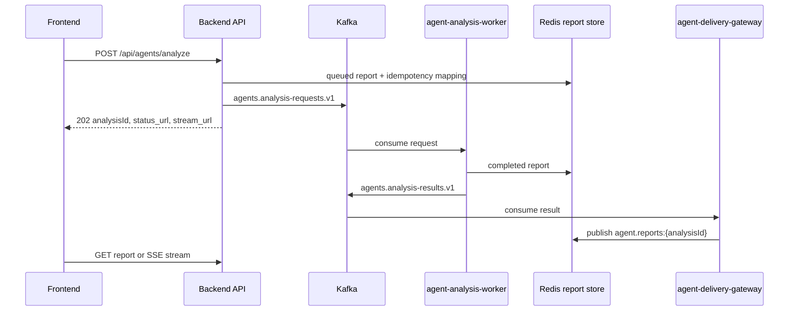

# GOPS Agent Backend Integration

이 문서는 백엔드가 GOPS 에이전트 런타임을 붙일 때 지켜야 하는 계약을
정리한다. 에이전트 내부 구조는 `AGENT_ARCHITECTURE.md`를 기준으로 한다.

## Backend Role

백엔드는 에이전트 요청의 ingress와 report delivery를 담당한다.

- HTTP request validation
- user/session/idempotency policy
- async request enqueue
- compatibility HTTP call to `agent-orchestrator`
- report polling endpoint
- SSE report stream
- alert WebSocket bridge

백엔드는 request handler 안에서 `AgentOrchestrator.analyze()`를 직접 호출하지
않는다. sync compatibility가 필요하면 `agent-orchestrator` HTTP endpoint를
호출한다.

## Runtime Flow



## API Routes

백엔드가 보존해야 하는 agent route:

```text
POST /api/agents/analyze
POST /api/agents/layout/resolve
GET  /api/agents/entities/resolve
GET  /api/agents/reports/{analysis_id}
GET  /api/agents/reports/{analysis_id}/stream
WS   /ws/agent-alerts
```

`POST /api/agents/analyze`는 다음 header를 읽는다.

```text
Idempotency-Key
X-GOPS-User-Id
```

`Idempotency-Key`가 있으면 같은 user/key 조합은 같은 `analysisId`를 재사용해야
한다. 이미 완료된 report가 있으면 completed report를 반환할 수 있다.

`POST /api/agents/layout/resolve`는 UI-only layout command preflight다. 이 route는
Kafka queue와 report polling을 타지 않고 `agent-orchestrator`의 `/layout/resolve`
compat endpoint를 동기로 호출한다. 응답은 다음 shape를 유지한다.

```json
{
  "status": "ui_layout",
  "summary": "변경했습니다.",
  "rationale": "The conductor returned a layout-only acknowledgement without final report synthesis.",
  "analysisId": "agent-request-id",
  "route": {"source": "ui-parser", "intentType": "ui-layout", "selectedRoles": []},
  "layoutProposal": {},
  "agentTrace": {"uiLayoutFastAck": true}
}
```

`status="not_ui"`이면 프런트는 기존 `POST /api/agents/analyze`로 fallback한다.

## Request Shape

요청 body는 프런트와 차트 엔진이 context를 추가해도 깨지지 않도록
permissive하게 유지한다.

```json
{
  "symbol": "NVDA",
  "intent": "analysis",
  "routerMode": "hybrid",
  "messages": [{"role": "user", "content": "NVDA 분석해줘"}],
  "chartContext": {},
  "layoutContext": {},
  "chartAction": null,
  "chartTargetSymbol": null,
  "chartPlacementIntent": null,
  "mode": null,
  "analysisMode": null,
  "priority": null,
  "responseMode": null
}
```

백엔드는 모르는 agent context field를 임의로 제거하지 말고 worker envelope로
전달해야 한다.

## Entity Resolve Shortcut

`GET /api/agents/entities/resolve?q=...&mode=chartShortcut`는 에이전트
카탈로그의 `KoreanEntityResolver`를 얇게 노출한다. 프런트는 에이전트 입력이
회사명/티커 단독이거나 `애플차트 보여줘`, `AAPL chart` 같은 chart-open 명령인지
확인해 차트만 즉시 전환할 때 이 route를 쓴다.

응답의 `chartShortcut=true`는 입력이 하나의 company/ticker로 확정되고, 나머지
표현이 차트 열기/전환 명령일 때만 반환한다. 해당 symbol은 기존 market-data
symbol registry/universe에서 차트로 열 수 있어야 한다. `엔비디아 뉴스`,
`엔비디아 분석해줘`, `엔비디아 차트 분석해줘`, 관계 질문, 테마 entity,
ambiguous match, registry 미지원 symbol은 분석 요청으로 fallback할 수 있도록
`chartShortcut=false`를 반환한다.

응답은 optional `chartAction`을 포함할 수 있다. 기본 `애플 차트 보여줘`,
`AAPL chart`, 회사명/티커 단독 입력은 `chartAction="replace"`로 현재 chart
symbol 전환을 의미한다. `애플 차트 추가해줘`, `애플도 같이 보여줘`,
`AAPL chart too`, 비교/동시 표시 표현은 `chartAction="add"`로 기존 chart를
유지한 추가 chart panel 요청을 의미한다. 위치 표현이 있으면
`chartPlacementIntent`에 `top`, `bottom`, `left`, `right`, `center` 중 하나를
담는다.

프런트가 chart add shortcut을 `POST /api/agents/layout/resolve`로 넘길 때는
`chartAction="add"`, `chartTargetSymbol`, `chartPlacementIntent`를 request body에
포함할 수 있다. 백엔드는 이 필드를 제거하지 않고 orchestrator로 전달해야 한다.
orchestrator는 이 메타데이터를 UI-only layout task로 보강해 analysis pipeline을
타지 않고 `layout.panel.add`와 priority-aware `layout.panels.arrange` proposal을
반환한다.

## Async Submit Response

Async submit은 기본적으로 `202`를 반환한다.

```json
{
  "request_id": "agent-request-id",
  "analysisId": "agent-request-id",
  "status": "queued",
  "status_url": "/api/agents/reports/agent-request-id",
  "stream_url": "/api/agents/reports/agent-request-id/stream",
  "report": {}
}
```

완료된 idempotent retry는 `200`과 completed `AnalysisReport`를 반환할 수
있다. 프런트는 `analysisId`를 canonical key로 사용한다.

## Queue And Report Store

기본 production path:

```text
API acknowledgement
-> Kafka agents.analysis-requests.v1
-> agent-analysis-worker
-> Redis report store
-> Kafka agents.analysis-results.v1
-> agent-delivery-gateway
-> Redis pubsub
-> polling or SSE delivery
```

필수 Redis keys/channels:

```text
agent:report:{analysisId}
agent:report:latest:{SYMBOL}
agent:report:latest
agent:request:idempotency:{userHash}:{keyHash}
agent.reports
agent.reports:{analysisId}
```

Report persistence failure는 가능하면 analysis generation을 막지 않도록 fail
open한다. 단, polling/SSE 품질은 Redis store 상태에 의존한다.

## Compatibility Mode

`AGENT_ASYNC_ANALYSIS_ENABLED=false`이면 백엔드는 Kafka enqueue 대신
`AGENT_ORCHESTRATOR_URL`의 HTTP endpoint를 호출할 수 있다.

`AGENT_SYNC_COMPAT_WAIT_ENABLED=true`는 queue-backed path를 유지하면서 짧게
Redis report store를 wait하는 테스트용 compatibility mode다. 운영 기본값으로
쓰지 않는다.

## Required Env

Backend/API side:

```text
AGENT_ORCHESTRATOR_URL
AGENT_ASYNC_ANALYSIS_ENABLED
AGENT_SYNC_COMPAT_WAIT_ENABLED
AGENT_SYNC_COMPAT_WAIT_TIMEOUT_SECONDS
AGENT_SYNC_COMPAT_WAIT_POLL_SECONDS
AGENT_SHARED_REPORT_STORE_ENABLED
AGENT_ANALYSIS_QUEUE_BACKEND
AGENT_REPORT_STORE_BACKEND
AGENT_REPORT_TTL_SECONDS
AGENT_REPORT_STREAM_REDIS_ENABLED
AGENT_REPORT_UPDATES_CHANNEL
AGENT_IDEMPOTENCY_TTL_SECONDS
AGENT_IDEMPOTENCY_KEY_PREFIX
AGENT_ENTITY_ALIAS_CATALOG_PATH
AGENT_ENTITY_ALIAS_SEED_PATH
AGENT_ENTITY_CATALOG_STRICT
AGENT_MARKET_SYMBOL_REGISTRY_PATH
KAFKA_BOOTSTRAP_SERVERS
AGENT_ANALYSIS_REQUESTS_TOPIC
AGENT_ANALYSIS_RESULTS_TOPIC
AGENT_DLQ_TOPIC
REDIS_URL
```

Worker side:

```text
AGENT_DEEP_ANALYSIS_ENABLED
AGENT_DEEP_ANALYSIS_REQUESTS_TOPIC
AGENT_QUERY_UNDERSTANDING_EVENTS_TOPIC
AGENT_NOTIFICATION_DECISIONS_TOPIC
AGENT_MARKET_EVENTS_TOPIC
AGENT_PUBLISH_TO_KAFKA
CLICKHOUSE_HTTP_URL
CLICKHOUSE_DATABASE
CLICKHOUSE_USER
CLICKHOUSE_PASSWORD
GRAPHDB_SPARQL_URL
GRAPHDB_REPOSITORY
OPENAI_API_KEY
```

## Backend Reference Files

기존 구현을 참고할 때 볼 파일:

```text
systems/api-server/pods/api-server/gops-backend/app/contracts/agents.py
systems/api-server/pods/api-server/gops-backend/app/routes/agents.py
systems/api-server/pods/api-server/gops-backend/app/services/agent_gateway.py
systems/api-server/pods/api-server/gops-backend/app/services/agent_alert_payloads.py
systems/api-server/pods/api-server/gops-backend/app/main.py
systems/api-server/tests/test_agent_routes.py
```

새 백엔드는 구현을 바꿔도 되지만 route name, idempotency, async status,
polling/SSE semantics는 보존해야 한다.

## Failure Policy

- Kafka enqueue 실패는 `202 queued`로 가장하면 안 된다.
- Redis report store가 없으면 polling/SSE는 degrade를 명시해야 한다.
- Provider no-data는 backend error가 아니다.
- `agent-analysis-worker` failure는 DLQ 또는 report status로 드러나야 한다.
- API는 order/account/broker flow를 agent report 생성과 섞지 않는다.

## Validation

```sh
git diff --check
.venv/bin/python -m unittest discover -s systems/api-server/tests -p 'test_agent_routes.py'
.venv/bin/python -m unittest discover -s systems/agent-orchestration/tests -p 'test_*.py'
.venv/bin/python -m unittest discover -s systems/fundamentals/tests -p 'test_*.py'
```

Runtime acceptance:

```text
POST /api/agents/analyze returns 202 and analysisId
agent-analysis-worker consumes agents.analysis-requests.v1
completed report is saved in Redis
GET /api/agents/reports/{analysis_id} returns the completed report
GET /api/agents/reports/{analysis_id}/stream emits updates or frontend can poll
```
