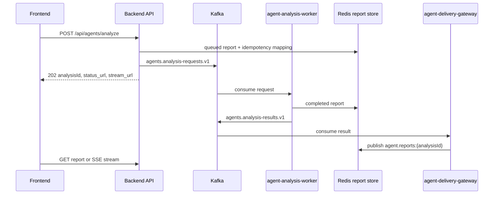

# GOPS Agent Backend Integration

이 문서는 백엔드가 GOPS 에이전트 런타임을 붙일 때 지켜야 하는 계약을
정리한다. 에이전트 내부 구조는 `AGENT_ARCHITECTURE.md`를 기준으로 한다.

## Backend Role

AI coach remains on the existing analyze/report contract. `POST /api/agents/analyze`
accepts only a bounded `coachRequest` (`enabled`, optional `selectedFillId`, optional
`tradingDate`). A client-supplied `coachInputSnapshot` is stripped. The authenticated
`agent-analysis-worker` builds one trusted snapshot after consuming the Kafka envelope,
and completed polling/SSE reports may contain optional `coachReport`. The backend does
not create per-page jobs or call `AgentOrchestrator.analyze()` in the request handler.

백엔드는 에이전트 요청의 ingress와 report delivery를 담당한다.

- HTTP request validation
- user/session/idempotency policy
- async request enqueue
- compatibility HTTP call to `agent-orchestrator`
- report polling endpoint
- SSE report stream
- alert WebSocket bridge

백엔드는 request handler 안에서 `AgentOrchestrator.analyze()`를 직접 호출하지
않는다. sync compatibility가 필요하면 `agent-orchestrator` HTTP endpoint를
호출한다.

## Price Condition Command Boundary

가격 조건과 예약 주문은 agent 분석 생성과 분리된 backend/order 기능이다.

```text
GET    /api/trade-conditions
POST   /api/trade-conditions
PATCH  /api/trade-conditions/{condition_id}
DELETE /api/trade-conditions/{condition_id}
POST   /api/trade-conditions/commands
```

수동 등록은 현재 서버 가격과 발동 방향, 양수 지정가, 정수 수량을 검증한다.
Agent 후속 명령은 클라이언트가 보낸 가격을 신뢰하지 않고 `analysisId`와
`proposalId`만 받아 사용자 소유 report의 `tradeConditionProposals[]`를 다시
조회한다. `걸어줘`, `등록해줘`, `예약해줘` 같은 명시적 등록 표현과 선택적 수량을
규칙으로 해석하며, 모호하거나 수량이 없거나 30분이 지난 제안은 저장하지 않는다.
같은 사용자와 proposal ID 조합은 멱등이다.

각 조건은 one-shot `alerts.price_cross` 행과 PostgreSQL transaction으로 함께
저장된다. alert 행의 `condition`에는 `{kind: price_cross, operator: above|below,
threshold}`를 저장하고 `condition_version=1`, `created_via=trade_condition`으로
출처를 명시한다. 이 필드는 alert evaluator가 같은 PostgreSQL 행을 즉시 읽을 수
있게 하며, 필수 `condition` 제약이 있는 운영 schema에서도 수동 조건 등록이
실패하지 않게 한다. 알림 끄기는 WebSocket/notification 생성만 생략하며 가격 평가와
예약 주문 이벤트는 유지한다. 일시정지는 alert 평가도 중단한다. 트리거된 조건은
다시 감시 상태로 되돌릴 수 없다.

`trade-condition-executor`는 `alerts.triggered.v1`을 별도 consumer group으로
읽고 조건을 한 번 점유한다. `sim`/`paper`는 영구 가상계좌에, `demo`는 기존
orders/outbox 계약에 같은 결정적 멱등키로 제출한다. 두 경로 모두 기존 사전 리스크
검사를 통과해야 하며, KIS 실계좌 모드는 사용하지 않는다. 같은 Kafka 이벤트가
재전달되거나 주문 접수 뒤 상태 저장이 실패해도 같은 멱등키로 복구한다.

## AI Coach Alert Proposal Boundary

AI 코치 알람 제안은 기존 `POST /api/alerts`를 재사용한다. 사용자가 4페이지에서
명시적으로 생성할 때만 optional `proposalSource`를 보낼 수 있으며 허용값은
`daily_trade`, `entry_habit`, `exit_habit`, `portfolio_risk`다. API는 이를 PostgreSQL
`alerts.proposal_source`에 저장하고 create/list 응답에서 `proposal_source`로 보존한다.
기존·수동 알람은 null이며 임의 출처를 추정하지 않는다. 이 메타데이터는 알람의
평가·주문 동작을 바꾸지 않는다.

`coach-report.v2.page4.recommendedAlerts`의 당일 거래 후보는 page 1의 결정론적
조건에서 `currentValue`, `threshold`, `operator`, `detail`, `recommendedAction`,
`alertSupported`를 그대로 복사한다. 프런트가 임계값을 다시 계산하거나 원천 데이터를
재조회하지 않으며, 미지원 조건에는 `alertRequest`를 만들지 않는다.

`coach-report.v2.page2`의 장기 투자 성향 분석은 같은 immutable snapshot의 체결·결과·
decision-check event만 사용한다. `confirmed`는 여섯 필수 확인 key가 모두 기록되고
checked인 거래만 의미하며, 나머지는 `unconfirmed`로 남긴다. 과정·결과 cohort, 반복
누락 패턴, 대표 거래는 worker가 결정론적으로 계산하고 프런트는 재계산하지 않는다.
포트폴리오 탭의 시장·섹터 분산 후보도 worker가 snapshot의 현재 보유 평가액과 저장된
market correlation/relative-strength context로만 계산한다. context가 없으면 후보·비중
범위를 반환하지 않으며, API나 LLM이 일반 섹터 추천을 대신 만들지 않는다. 후보는
검토용이며 자동 알람·주문·리밸런싱을 생성하지 않는다.

## Local Demo Simulator Boundary

토요일 시연에서는 `GOPS_SIMULATOR_URL`이 가리키는 시뮬레이터를
`/api/simulator/*` route로 프록시한다. `PUT /api/simulator/phase`는 시나리오
manifest에 정의된 단계 ID만 받는다. 운영자는 시장 조망·추천·기업 분석·차트 분석·
예약매매·본장 화면을 자유롭게 설명한 뒤, 첫 입력으로 지정학 이벤트에, 다음 입력으로
장 마감·복기 시점에 대기 없이 이동할 수 있다.

기본 `saturday-demo-amd-iff-oke` 시나리오는 호환성을 위해 기존 ID를 유지하지만,
실시간 재생 종목은 AMD/OKE다. 두 종목의 합성 trade와 quote를
같은 시각·가격 범위로 함께 보낸다. 재생 payload의 `simulator.source`가
`gops-simulator`일 때 market envelope는 선언된 `marketSession=regular`를 유지하고
normalized trade/quote/candle에 simulation metadata를 전파한다. ClickHouse loader와
raw/processed S3 sink는 이 표식이 있는 행을 영구 적재하지 않는다. Redis 실시간 상태는
시연 동안만 사용한다. 지정학 이벤트는 즉시 공개하지만 AMD 하락은 5초 뒤 시작하며,
약 60초 동안 초반부터 점진적으로 낙폭을 키운다. 화면에 노출하는 뉴스 문구와 출처는 일반
시장 뉴스 형식을 사용하지만 내부 simulation metadata는 유지한다. OKE 상승도 같은 지연 뒤
더 긴 구간에 걸쳐 천천히 진행한다. `PUT /api/simulator/mode`가 SIM으로 전환되기 직전에
AMD/OKE의 캔들·체결·호가·오더플로우 Redis 상태를 보관하고, LIVE 전환은
재생을 멈춘 뒤 합성 상태를 제거하고 보관본을 복원한 다음 응답한다. EKS 종료
스크립트도 같은 복원 명령을 사용하므로 토글과 전체 인프라 종료가 같은 차트 복구
계약을 따른다. 보관본이 없으면 합성 키 제거만 수행한다.

SIM 모드일 때 일반 `/api/orders`는 시뮬레이터 메모리 원장을 사용하고 KIS order
outbox를 만들지 않는다. 영구 예약매매는 별도 paper 경계를 사용한다. EKS 시연
스크립트는 `trade-condition-executor`를 `paper`로 전환하고 quote를
`paper-order-matcher`에 공급한다. 바스켓·일반·예약 주문은 모두 사용자의 명시적인
입력과 기존 멱등성/사전 리스크 검사를 요구한다. 속보 수신만으로 주문을 실행하지 않는다.

## Persistent Paper Trading Boundary

영구 가상투자는 전역 LIVE/SIM 상태와 무관하며 사용자 `sub`로 격리한다.
`POST /api/paper/orders`는 `Idempotency-Key`를 필수로 받고 Postgres의 가상 현금과
보유수량만 예약한다. KIS 주문 테이블, Outbox, broker adapter는 호출하지 않는다.

```text
GET  /api/paper/symbols/search
GET  /api/paper/account
POST /api/paper/account/reset
GET  /api/paper/account/balance
POST /api/paper/risk/pretrade
GET  /api/paper/orders
POST /api/paper/orders
GET  /api/paper/orders/{order_id}
GET  /api/paper/orders/{order_id}/events
POST /api/paper/orders/{order_id}/cancel
WS   /ws/paper/orders/{order_id}
WS   /ws/paper/account
```

`paper-order-matcher`는 `market.layer.quotes.v1`의 모든 market session quote를
사용한다. 매수는 ask, 매도는 bid 최우선호가로 전량 체결하며 부분체결, 수수료,
공매도는 지원하지 않는다. 모든 HTTP와 WebSocket 조회는 주문 소유자를 검사한다.
가상투자 심볼 검색은 ClickHouse의 전체 symbol registry를 직접 조회하며
`active`, `tradable`인 미국 주식/ETF만 노출한다.

AI 코치는 KIS append-only `order_coach_fill_history`에서 분석 요청시각까지 관찰된
최신 canonical cumulative fill state와 filled `paper_orders`를 같은 사용자 범위에서 읽되 namespace를 섞지
않는다. KIS fill ID는 reconciliation replay와 partial/final update에 걸쳐 안정적인
`kis:{order_id}`다. `executions`는 broker reconciliation audit log이며 개별 AI 코치
fill ledger가 아니다. `orders.coach_filled_at`/`coach_fill_payload`는 최신 상태 호환
projection이며, 지연 분석의 point-in-time 입력에는 history를 사용한다. 동일하거나
낮은 누적 수량 replay는 history를 추가하지 않고, 부분 체결 후 잔량 취소된 row의
양수 누적 체결은 canceled 최종 상태와 별개로 보존한다. Paper matcher는 체결 트랜잭션 안에서 `paper:{order_id}`에
묶인 before/after portfolio rows를 `user_portfolio_snapshot_history`에 기록한다. 이
row의 `valuationBasis="cost_basis"`는 가상 현금과 취득원가 비교용이며 현재가 평가액으로
표시하거나 해석하지 않는다. KIS와 paper 모두 정확한 `fillId` + `phase` pair가 없으면
포트폴리오 영향은 `계산되지 않음`으로 남긴다.

Snapshot Builder reads PostgreSQL fills, portfolio rows, decision events, and alerts in one
read-only repeatable-read transaction. `decisionAt` is the earliest server-owned order/check
time and bounds decision evidence; `filledAt` anchors the executed entry and subsequent
performance window. Historical decision-check rows remain attached to their matching cases.

## Order-time decision checks

`POST /api/orders`와 `POST /api/paper/orders`는 optional `decision_checks`를 받을 수
있다. 현재 order ticket과 quick-order UI가 보내는 bounded contract는 다음과 같다.

```json
{
  "version": "decision-checks.v1",
  "surface": "order-ticket",
  "items": [
    {"key": "chart.rsi", "status": "checked"},
    {"key": "chart.macd", "status": "unchecked"},
    {"key": "chart.volume", "status": "checked"},
    {"key": "news.company", "status": "unchecked"},
    {"key": "fundamentals.earnings", "status": "checked"},
    {"key": "market.context", "status": "checked"}
  ]
}
```

`surface`는 `order-ticket` 또는 `quick-order`이고 item status는 `checked` 또는
`unchecked`다. 서버는 unknown/duplicate key와 client-supplied label, category,
evidence, timestamp field를 거절하고, allowlist의 label/category와 server capture
time을 붙인 normalized JSON을 주문 row에 저장한다. 이 JSON은 broker outbox payload로
전파하지 않는다.

체결이 확정될 때만 normalized items를 `trade_decision_check_events`로 materialize한다.
KIS는 `kis:{order_id}`, paper는 `paper:{order_id}`를 fill ID로 사용하며
`(user_sub, fill_id, check_key)` unique index와 conflict-safe insert로 reconciliation
retry를 멱등 처리한다. canceled/rejected order에는 fill-scoped event가 생기지 않는다.
체크를 보내지 않은 기존 order는 추정 backfill하지 않고 AI 코치에서
`확인 기록 없음`으로 남긴다. 이 기능은 새 route나 Kafka topic을 만들지 않는다.

## Runtime Flow



## API Routes

백엔드가 보존해야 하는 agent route:

```text
POST /api/agents/analyze
POST /api/agents/layout/resolve
GET  /api/agents/entities/resolve
GET  /api/agents/reports/{analysis_id}
POST /api/agents/reports/{analysis_id}/cancel
GET  /api/agents/reports/{analysis_id}/stream
WS   /ws/agent-alerts
```

사용자 알림 표시 설정은 다음 session-auth route를 사용한다.

```text
GET   /api/notification-preferences
PATCH /api/notification-preferences
POST  /api/alerts/commands
```

설정과 기업별 override는 `user_notification_preferences`에 사용자별로 저장된다.
이 설정은 프런트 알림 바/toast 노출만 제어하며 notifications 이력, unread count,
가격 조건 평가, 주문 실행은 삭제하거나 중지하지 않는다.

`POST /api/alerts/commands`는 `Idempotency-Key`를 필수로 받고, 결정론 파서 뒤에
agent-orchestrator `/alerts/resolve`를 제한적 fallback으로 사용한다. 명확한 단일 조건은
`created_via=agent_chat`으로 즉시 생성하고, 종목·임계값·봉 간격이 빠지면 추측하지
않고 `clarificationId`를 반환한다.

news 패널과 news agent가 일자별 요약을 렌더링할 때 market-data query route
`GET /api/market/news/daily?symbol={SYMBOL}&limit=30&locale=ko-KR`를 사용할 수
있다. 응답은 `displayMode="dailySummary"`와 `dailySummaries[]`를 포함하며,
각 summary의 `sources[]`는 실제 기사 `url`, 표시용 `title`, 선택적 `name`을
가진다. 가능한 경우 각 summary에는 같은 날짜의 1D 종가와 직전 거래일 1D 종가
차이를 나타내는 `priceChange`를 포함한다. 이 public payload에는
`source="redis"` 또는 `source="clickhouse"` 같은 내부 저장소 provenance를 넣지
않는다.
읽기 경로는 Redis 30일 article/daily hot cache를 먼저 사용하고, Redis coverage
metadata가 최근 30일 요청을 보장하지 못할 때만 ClickHouse에서 보강한 뒤 Redis를
다시 warm-up한다.

기업저널 재무 시계열은
`GET /api/market/fundamentals/{symbol}/series?period=quarterly|annual`을 사용한다.
기존 손익·자산 필드와 함께 `currentAssets`, `currentLiabilities`,
`cashAndCashEquivalents`, `interestExpense`, `debtRatio`,
`currentLiabilityRatio`, `noncurrentLiabilityRatio`, `currentRatio`, `totalDebt`,
`interestCoverage`, `financialCostBurdenRatio`, `netDebt`를 반환한다. 파생 필드는
ClickHouse `sec_derived_metrics` 값을 전달하며 API 요청 시 재계산하지 않는다.

지수 패널은 market-data query route `GET /api/market/indices`를 사용한다. 이
route는 차트 candle coverage/backfill/read-through 경로를 타지 않고 Yahoo
Finance snapshot을 Redis에 fresh/stale 캐시한다. 백엔드는 fresh 캐시가 있으면
즉시 반환하고, fresh가 없을 때만 짧은 refresh lock을 잡아 Yahoo Finance를
조회한다. refresh 중이거나 Yahoo Finance가 timeout/rate-limit/failure를 반환하면
마지막 성공 snapshot을 `cacheStatus="stale"`로 반환할 수 있다.

장중 매수 추천 패널은 recommendation API를 사용한다. `PUT /api/recommendations/profile`은
추천목록 패널의 추천 설정 dialog에서 필수 투자 설정을 저장하고, `GET
/api/recommendations/stocks/latest`와 `POST /api/recommendations/stocks/refresh`는
정규장 장중 추천만 반환한다. 추천 worker는 프로필이 있는 사용자 목록을 순회하고,
09:45/12:45/15:45 ET 슬롯 run key로 멱등 실행한다. 종목 선정은 결정론적 점수화
로직이 담당하며, 알림은 기존 notifications 저장소와 `WS /ws/notifications`
브로커만 재사용한다. 추천 profile, heatmap item, recommendation item, holdings
snapshot의 `sector`는 GraphDB `gops:sector` canonical 값을 사용하고, 화면 표시용
한글 라벨은 `sectorLabelKo`로 함께 내려준다.

`POST /api/agents/analyze`는 로그인 session cookie로 사용자를 확인하고 다음 header만
클라이언트 입력으로 읽는다.

```text
Idempotency-Key
```

`X-GOPS-User-Id`와 body의 `userId`는 신뢰하지 않는다. 백엔드는
`Depends(require_current_user)`가 반환한 session `sub`를 canonical user id로
사용한다. `Idempotency-Key`가 있으면 같은 session user/key 조합은 같은
`analysisId`를 재사용해야 한다. 이미 완료된 report가 있으면 completed report를
반환할 수 있다.

인증이 활성화된 환경에서는 analyze와 layout resolve를 session 사용자별 기본
30회/60초로 제한한다. rate-limit Redis를 확인할 수 없으면 제한을 우회하지 않고
`503`을 반환하며, 한도를 넘으면 `Retry-After`와 함께 `429`를 반환한다.

`POST /api/agents/layout/resolve`는 UI-only layout command preflight다. 이 route는
Kafka queue와 report polling을 타지 않고 `agent-orchestrator`의 `/layout/resolve`
compat endpoint를 동기로 호출한다. 응답은 다음 shape를 유지한다.

```json
{
  "status": "ui_layout",
  "summary": "변경했습니다.",
  "rationale": "시장 뉴스 패널 크기를 조정했습니다.",
  "analysisId": "agent-request-id",
  "route": {"source": "ui-parser", "intentType": "ui-layout", "selectedRoles": []},
  "layoutProposal": {},
  "agentTrace": {"uiLayoutFastAck": true}
}
```

`status="not_ui"`이면 프런트는 기존 `POST /api/agents/analyze`로 fallback한다.
`status="ui_clarify"`이면 UI 관련 표현은 감지했지만 실행 가능한 layout task가
확정되지 않은 상태다. 프런트는 분석 fallback을 하지 않고 `summary`를 사용자에게
표시한다.

UI layout parser는 `패턴 종목`, `패턴 종목 목록`, `패턴 리스트`,
`패턴 보유 종목`을 `panelType="chartPatternList"`로 해석한다. 프런트가
`layoutContext.panelCatalog`를 보내지 못한 경우에도 기본 크기는 `2x2`, 제목은
`패턴 종목`으로 해석해 `layout.panel.add` proposal을 만들 수 있어야 한다.

## Request Shape

요청 body는 프런트와 차트 엔진이 context를 추가할 수 있도록 확장 필드를
허용하되 raw HTTP body와 검증된 전체 JSON을 각각 64 KiB 이하로 제한한다. raw
body 초과는 JSON 파싱 전에 `413`을 반환한다. `messages`는 최대 50개,
`references`와 `marketEvents`는 각각 최대 100개다. 문자열과 ID에도 필드별 길이
제한을 적용한다.

```json
{
  "symbol": "NVDA",
  "intent": "analysis",
  "routerMode": "hybrid",
  "messages": [{"role": "user", "content": "NVDA 분석해줘"}],
  "chartContext": {
    "chartDocument": {"symbol": "NVDA", "timeframe": "1D", "sourcePanelId": "chart-1"},
    "analysisWindow": {"viewportStart": "...", "viewportEnd": "...", "preRollCandles": 120},
    "assetIdentity": {"algorithmVersion": "...", "inputDigest": "...", "asOf": "..."}
  },
  "layoutContext": {},
  "references": [],
  "uiContext": {},
  "chartAction": null,
  "chartTargetSymbol": null,
  "chartPlacementIntent": null,
  "requestId": "agent-request-client-id",
  "mode": null,
  "analysisMode": null,
  "priority": null,
  "responseMode": null
}
```

To request the coach report, the frontend adds:

```json
{
  "coachRequest": {
    "enabled": true,
    "selectedFillId": null,
    "tradingDate": "2026-07-14"
  }
}
```

The request body never carries fills, positions, portfolio snapshots, indicators, or
historical cases. These are server-owned inputs and are too large and too sensitive for
the public 64 KiB request contract.

백엔드는 모르는 agent context field를 worker envelope로 전달하되 `userId`,
`idempotencyKey`, `submittedAt`, `maxLlmCalls`, `maxInputTokens`,
`maxOutputTokens`, `llmBudgetOwner` 같은 서버 소유 필드는 제거한다.

`intent="analysis"` 또는 `intent="analyze"`는 placeholder다. runtime은 `prompt`,
그 다음 최신 user message를 실제 intent로 사용한다. 종목은 명시적 ticker/정확한 회사명,
chart reference, 활성 chart document, request symbol, 제한된 fuzzy 순으로 결정하며
유효한 chart context를 fuzzy 후보가 덮어쓸 수 없다.

`references`, `uiContext`, `chartContext`의 선택/hover reference는 worker payload에
보존되어 agent runtime의 `OperationIR` extractor로 전달된다. runtime은 같은
reference가 여러 필드에 중복 포함돼도 fingerprint로 dedupe한다. reference가 포함된
분석 요청은 선택한 뉴스, 차트 봉, 차트 구간이 cache key에 반영되어야 하며, 같은
자연어 질문이라도 anchor가 다르면 cached analysis를 재사용하지 않는다.
`chart.orderFlow`, `chart.pattern`, `chart.drawing` references are valid chart references
and must be preserved the same way as `chart.candle`; their bid/ask side classification is estimated,
not provider-confirmed.

완료 report는 additive `chartExplanation`을 포함할 수 있다. `version`은
`chart-explanation.v1`이며 `quality`, `facts`, `usedIndicators`, `focusIds`, `anchor`,
`news`를 담는다. optional `source`는 요청의 `chartDocumentId/sourcePanelId`를 echo하고,
optional `focusGroups`는 기존 `focusIds` 합집합을 evidence/pattern/support/resistance로
분류한다. 두 필드가 없는 기존 v1 응답도 유효하다. `finalAnswer`가 사용자 문장 계약이고
`chartExplanation`은 UI의 구조화 렌더링 및 요청 시점 drawing focus snapshot 계약이다.
현재 자산과 `symbol/interval/assetVersion/algorithmVersion/inputDigest/asOf`가 정확히
일치하지 않으면 프런트는 서버 수치만 표시하고 현재 작도를 focus하지 않는다.
provider/snapshot/LLM fallback과
`investment_advice_limited` 같은 내부 정책 코드는 trace에만 둔다.

완료 report의 `timing`은 synthesis 진단을 포함할 수 있다.
`llmCallLabels`에 `synthesis` 또는 `financial-synthesis`가 있으면 최종 종합 답변용
LLM 호출을 획득/시도한 것이다. 최종 답변이 실제 OpenAI 결과인지 여부는
`synthesisProvider="openai"`로 판단한다. `synthesisSkippedReason` 또는
`synthesisFallbackReason`이 있으면 deterministic fallback 답변으로 degrade된 것이다.

## Entity Resolve Shortcut

`GET /api/agents/entities/resolve?q=...&mode=chartShortcut`는 에이전트
카탈로그의 `KoreanEntityResolver`를 얇게 노출한다. 프런트는 에이전트 입력이
회사명/티커 단독이거나 `애플차트 보여줘`, `AAPL chart` 같은 chart-open 명령인지
확인해 차트만 즉시 전환할 때 이 route를 쓴다.

응답의 `chartShortcut=true`는 입력이 company/ticker로 확정되고, 나머지 표현이
차트 열기/전환/추가 명령일 때만 반환한다. 해당 symbol은 기존 market-data
symbol registry/universe에서 차트로 열 수 있어야 한다. 다중 차트 요청이면
호환용 `symbol`은 첫 번째 종목을 담고 optional `symbols`가 입력 순서의 ticker
목록을 담는다. `엔비디아 뉴스`,
`엔비디아 분석해줘`, `엔비디아 차트 분석해줘`, 관계 질문, 테마 entity,
ambiguous match, registry 미지원 symbol은 분석 요청으로 fallback할 수 있도록
`chartShortcut=false`를 반환한다.

응답은 optional `chartAction`을 포함할 수 있다. 기본 `애플 차트 보여줘`,
`AAPL chart`, 회사명/티커 단독 입력은 `chartAction="replace"`로 현재 chart
symbol 전환을 의미한다. `애플 차트 추가해줘`, `애플도 같이 보여줘`,
`AAPL chart too`, `애플 차트 엔비디아 차트 같이 보여줘` 같은 비교/동시 표시
표현은 `chartAction="add"`로 기존 chart를 유지한 추가 chart panel 요청을
의미한다. 위치 표현이 있으면
`chartPlacementIntent`에 `top`, `bottom`, `left`, `right`, `center` 중 하나를
담는다.

프런트가 chart add shortcut을 `POST /api/agents/layout/resolve`로 넘길 때는
`chartAction="add"`, `chartTargetSymbol`, `chartPlacementIntent`를 request body에
포함할 수 있다. 백엔드는 이 필드를 제거하지 않고 orchestrator로 전달해야 한다.
orchestrator는 이 메타데이터를 UI-only layout task로 보강해 analysis pipeline을
타지 않고 `layout.panel.add`와 priority-aware `layout.panels.arrange` proposal을
반환한다.

이 route는 `gops-backend` process 안에서 `KoreanEntityResolver`를 직접 실행한다.
따라서 backend image에도 `systems/agent-orchestration/config`와
`systems/agent-orchestration/shared`가 함께 포함되어야 한다. 운영 alias catalog인
`entity-aliases.json`이 없으면 bootstrap seed로 degrade해 seed에 없는 회사명
shortcut을 놓칠 수 있다.

## Async Submit Response

Async submit은 기본적으로 `202`를 반환한다.

```json
{
  "request_id": "agent-request-id",
  "analysisId": "agent-request-id",
  "status": "queued",
  "status_url": "/api/agents/reports/agent-request-id",
  "stream_url": "/api/agents/reports/agent-request-id/stream",
  "report": {}
}
```

완료된 idempotent retry는 `200`과 completed `AnalysisReport`를 반환할 수
있다. 프런트는 `analysisId`를 canonical key로 사용한다.

## Cancellation

`POST /api/agents/reports/{analysis_id}/cancel`은 사용자가 실행 중인 분석을
중단할 때 호출한다. 프런트가 submit 전에 `requestId`를 생성해 body에 넣으면
submit 응답이 오기 전에도 같은 값을 `analysis_id`로 cancel할 수 있다.

백엔드는 submit 시 `agent:report:owner:{analysisId}`에 session user의 hash를
저장한다. report 조회, cancel, SSE stream은 owner가 일치하지 않으면 존재 여부를
노출하지 않도록 `404`를 반환한다. client request id 충돌은 다른 사용자의 owner
mapping을 덮어쓰지 않고 `409`로 거절한다.

Cancel은 cooperative cancellation이다. 백엔드는 report store에 `canceled`
terminal report와 cancel marker를 저장하고 Redis update channel로 publish한다.
queued Kafka message는 삭제하지 않으며, worker는 message를 소비할 때 marker를
확인해 orchestrator 실행을 건너뛴다. 이미 실행 중인 worker/orchestrator는 단계
경계에서 marker를 확인하고 `completed` 결과가 `canceled` report를 덮어쓰지
못하게 해야 한다.

이미 `completed`, `deep_completed`, `failed`인 report는 cancel로 덮어쓰지 않는다.
프런트는 `completed`, `deep_completed`, `failed`, `canceled`를 terminal status로
취급한다.

## Queue And Report Store

기본 production path:

```text
API acknowledgement
-> Kafka agents.analysis-requests.v1
-> agent-analysis-worker
-> Redis report store
-> Kafka agents.analysis-results.v1
-> agent-delivery-gateway
-> Redis pubsub
-> polling or SSE delivery
```

필수 Redis keys/channels:

```text
agent:report:{analysisId}
agent:report:latest:{SYMBOL}
agent:report:latest
agent:request:idempotency:{userHash}:{keyHash}
agent:report:cancel:{analysisId}
agent:report:owner:{analysisId}
agent.reports
agent.reports:{analysisId}
```

Report persistence failure는 가능하면 analysis generation을 막지 않도록 fail
open한다. 단, polling/SSE 품질은 Redis store 상태에 의존한다.

AWS overlays explicitly set `AGENT_ANALYSIS_QUEUE_BACKEND=kafka` and
`AGENT_REPORT_STORE_BACKEND=redis`. Explicit backends fail closed during initialization;
process-local queue/report fallback is reserved for local `auto` configuration.

## Compatibility Mode

`AGENT_ASYNC_ANALYSIS_ENABLED=false`이면 백엔드는 Kafka enqueue 대신
`AGENT_ORCHESTRATOR_URL`의 HTTP endpoint를 호출할 수 있다.

`AGENT_SYNC_COMPAT_WAIT_ENABLED=true`는 queue-backed path를 유지하면서 짧게
Redis report store를 wait하는 테스트용 compatibility mode다. 운영 기본값으로
쓰지 않는다.

## Required Env

Backend/API side:

```text
AGENT_ORCHESTRATOR_URL
AGENT_ASYNC_ANALYSIS_ENABLED
AGENT_SYNC_COMPAT_WAIT_ENABLED
AGENT_SYNC_COMPAT_WAIT_TIMEOUT_SECONDS
AGENT_SYNC_COMPAT_WAIT_POLL_SECONDS
AGENT_SHARED_REPORT_STORE_ENABLED
AGENT_ANALYSIS_QUEUE_BACKEND
AGENT_REPORT_STORE_BACKEND
AGENT_REPORT_TTL_SECONDS
AGENT_REPORT_CANCEL_KEY_PREFIX
AGENT_REPORT_OWNER_KEY_PREFIX
AGENT_RATE_LIMIT_ENABLED
AGENT_RATE_LIMIT_REQUESTS
AGENT_RATE_LIMIT_WINDOW_SECONDS
AGENT_REPORT_STREAM_REDIS_ENABLED
AGENT_REPORT_UPDATES_CHANNEL
AGENT_IDEMPOTENCY_TTL_SECONDS
AGENT_IDEMPOTENCY_KEY_PREFIX
AGENT_ENTITY_ALIAS_CATALOG_PATH
AGENT_ENTITY_ALIAS_SEED_PATH
AGENT_ENTITY_CATALOG_STRICT
AGENT_MARKET_SYMBOL_REGISTRY_PATH
KAFKA_BOOTSTRAP_SERVERS
AGENT_ANALYSIS_REQUESTS_TOPIC
AGENT_ANALYSIS_RESULTS_TOPIC
AGENT_DLQ_TOPIC
AGENT_OUTPUT_KAFKA_REQUIRED
REDIS_URL
```

Worker side:

```text
AGENT_DEEP_ANALYSIS_ENABLED
AGENT_DEEP_ANALYSIS_REQUESTS_TOPIC
AGENT_QUERY_UNDERSTANDING_EVENTS_TOPIC
AGENT_NOTIFICATION_DECISIONS_TOPIC
AGENT_MARKET_EVENTS_TOPIC
AGENT_PUBLISH_TO_KAFKA
CLICKHOUSE_HTTP_URL
CLICKHOUSE_DATABASE
CLICKHOUSE_USER
CLICKHOUSE_PASSWORD
GRAPHDB_SPARQL_URL
GRAPHDB_REPOSITORY
OPENAI_API_KEY
AGENT_OPERATION_PLANNER_PROVIDER
AGENT_OPERATION_PLANNER_MODEL
AGENT_OPERATION_PLANNER_TIMEOUT_SECONDS
DATABASE_HOST
DATABASE_PORT
DATABASE_NAME
DATABASE_USER
DATABASE_PASSWORD
AI_COACH_SNAPSHOT_ARCHIVE_ENABLED
AI_COACH_SNAPSHOT_ARCHIVE_REQUIRED
AI_COACH_SNAPSHOT_S3_BUCKET
AI_COACH_SNAPSHOT_S3_PREFIX
```

### Post-market AI coach report read

`GET /api/ai-coach/reports/latest` is an authenticated read-only endpoint for the coach
panel. It does not invoke `AgentOrchestrator`, Kafka, Redis, or a provider. The endpoint
derives the user prefix from the authenticated subject and reads only that user's S3
`latest.json` pointer and immutable daily `coach-report.v2`. It returns `{status:"ready",
report}` or `{status:"pending", report:null}`; S3 access failure is `503`.

The analysis worker reads the separate post-market input archive from
`ai-coach/input/v1/user={subjectHash}/date=YYYY-MM-DD.json`. The archive's required
`sourceAsOf`/`generatedAt` must not be later than the requested cutoff. No order route,
broker route, Redis cache, or client supplied snapshot is used to fill a missing archive.

`AGENT_OPERATION_PLANNER_PROVIDER=openai` enables the slow-path structured
OperationIR planner for low-confidence or ambiguous interactive requests. Keep it
unset to run only deterministic extraction.

## Backend Reference Files

기존 구현을 참고할 때 볼 파일:

```text
systems/api-server/pods/api-server/gops-backend/app/contracts/agents.py
systems/api-server/pods/api-server/gops-backend/app/routes/agents.py
systems/api-server/pods/api-server/gops-backend/app/services/agent_gateway.py
systems/api-server/pods/api-server/gops-backend/app/services/agent_alert_payloads.py
systems/api-server/pods/api-server/gops-backend/app/main.py
systems/api-server/tests/test_agent_routes.py
```

새 백엔드는 구현을 바꿔도 되지만 route name, idempotency, async status,
polling/SSE semantics는 보존해야 한다.

## Chart Analysis Asset Routes

Chart analysis asset은 interactive agent report와 별도인 수동 build projection이다.

```text
GET    /api/charts/analysis-assets
DELETE /api/charts/analysis-assets?symbols=NVDA&intervals=1D
GET    /api/charts/analysis-assets/coverage
POST   /api/charts/analysis-assets/build
GET    /api/charts/analysis-assets/build/{job_id}
POST   /api/charts/analysis-assets/build/{job_id}/cancel
```

DELETE는 개발 패널의 명시적 정리 기능이다. 최대 100개 symbol과
`1m/5m/10m/1h/4h/1D/1W`만 받고 선택된 pair를 PostgreSQL
`chart_assets.geometry_assets`에서 삭제한다. 자동 TTL이나 broad cleanup은 사용하지
않는다. 새 build 요청은 운영 interval `1m/1D`만 허용한다. 다른 지원 interval의 기존
자산은 GET/DELETE와 표시 호환을 위해 유지한다. build 완료·삭제 후 프런트는 cache를
무효화하고 열린 chart를 재조회한다.
Build 상태와 bounded log는 PostgreSQL polling 응답으로 제공한다. Redis pub/sub과
SSE route는 사용하지 않는다.
API에서 만든 수동 build는 서버가 `source=manual`, `priority=100`으로 지정하고 정기
build는 `source=scheduled`, `priority=10`으로 지정한다. 클라이언트는 priority를
보내지 않는다. 실행 중인 동일 source/force/symbol/interval 요청은
`request_fingerprint`로 기존 job에 합치며 응답의 `coalesced=true`로 알린다.
Worker는 `scheduled` item을 candle 조회·복구·분석·저장 전에 `manual_refresh_only`로
종료한다. 기존 자산은 선택된 pair의 `manual + force` 요청에서만 교체하며 일반 manual
요청은 없는 자산만 만들 수 있다. 전체 universe force 갱신은 제공하지 않는다.
Worker는 높은 priority부터 claim하고, 최대 2회 처리 뒤 lease가 만료된 item은
`lease_expired_after_max_attempts` 실패로 종결해 job이 영구 대기하지 않게 한다.
최종 생성량은 status의 작은 `createdEntities` 정수만 사용한다. Coverage의
`drawingCount`는 저장된 엔티티 수이며 호환 alias `storedDrawingCount`와 같다. 실제
차트 적용 수와 anchor/stale 제외 수는 현재 candle과 active chart document의 실제
drawing ID를 아는 프런트가 계산한다.

Geometry payload는 활성 후보 `patterns[]`, 최고 점수 `primaryPattern`, 삼각형 호환
필드 `primaryTriangle`/`historicalTriangle`을 함께 가진다. 저장 drawing은 최대 8개다.
기존 PostgreSQL 설치는 build 배포 전에 명시적 chart-asset migration Job을 다시 실행해
`drawing_count` check constraint와 queue priority/fingerprint 컬럼·index를 갱신한다.

`CHART_ASSET_STORAGE_MAINTENANCE=true` 동안 GET은 계속 열어 두고 build와 DELETE만
503으로 막는다. 기존 숫자형 자산은 변환하거나 fallback으로 읽지 않는다.

## Failure Policy

- PostgreSQL enqueue 실패는 `202 queued`로 가장하면 안 된다.
- Redis report store가 없으면 polling/SSE는 degrade를 명시해야 한다.
- Provider no-data는 backend error가 아니다.
- `agent-analysis-worker` failure는 DLQ 또는 report status로 드러나야 한다.
- AWS에서 `AGENT_OUTPUT_KAFKA_REQUIRED=true`이면 completed result publish/flush
  실패를 성공 처리하거나 request offset을 commit하지 않는다. 로컬 기본값만
  `false`로 유지한다.
- API는 order/account/broker flow를 agent report 생성과 섞지 않는다.
- 가격 조건 command route는 완료 report를 읽기 전용 제안 원본으로만 사용하며,
  report 생성 route나 agent worker에서 주문을 제출하지 않는다.

## Validation

```sh
git diff --check
.venv/bin/python -m unittest discover -s systems/api-server/tests -p 'test_agent_routes.py'
.venv/bin/python -m unittest discover -s systems/agent-orchestration/tests -p 'test_*.py'
.venv/bin/python -m unittest discover -s systems/fundamentals/tests -p 'test_*.py'
.venv/bin/python -m pytest systems/api-server/tests/test_order_routes.py \
  systems/api-server/tests/test_paper_trading_routes.py
.venv/bin/python -m pytest systems/order/tests/kis_trader/unit
```

Runtime acceptance:

```text
POST /api/agents/analyze returns 202 and analysisId
agent-analysis-worker consumes agents.analysis-requests.v1
completed report is saved in Redis
GET /api/agents/reports/{analysis_id} returns the completed report
GET /api/agents/reports/{analysis_id}/stream emits updates or frontend can poll
```
