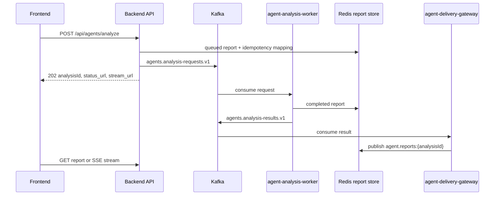

# GOPS Agent Backend Integration

이 문서는 백엔드가 GOPS 에이전트 런타임을 붙일 때 지켜야 하는 계약을
정리한다. 에이전트 내부 구조는 `AGENT_ARCHITECTURE.md`를 기준으로 한다.

## 추천 API 현재 계약

```text
GET    /api/recommendations/score-profiles
POST   /api/recommendations/score-profiles
POST   /api/recommendations/score-profiles/suggestions
PUT    /api/recommendations/score-profiles/{id}
DELETE /api/recommendations/score-profiles/{id}
PUT    /api/recommendations/score-profiles/active
```

기본 모멘텀·균형·안정 프로필은 immutable이고 custom 프로필은 사용자별 최대 20개다.
사용자 설정이 없거나 활성 custom 프로필이 삭제된 경우의 기본 추천 수식은 `stable`이다.
이름은 대소문자 무시 고유값이며 모든 블록·세부 그룹 합계가 100이어야 한다.
추천 응답은 `customRankScore`, canonical/effective block score, portfolio 반영률과
score-profile provenance를 반환한다. `preference*`, `personalizationDelta`,
`personalScore`는 새 응답 계약이 아니다. `continuous-v2` 실행 옵션과 fill 기반 preference
처리는 제거됐다. 아래 V2 설명은 migration 이전 역사적 맥락으로만 읽는다.

`POST /api/recommendations/score-profiles/suggestions`는 2~500자의 `query`를 받는다.
최신 사용자 run과 그 run이 참조한 immutable evidence snapshot 전체 후보 집계, 현재 시장
분포, 관련 최신 뉴스·저장 촉매를 retrieval context로 사용한다. 응답은
`recommendation-score-suggestion.v1` 초안, 검색된 intent 문서, 한국어 근거, evidence/news
provenance를 반환한다. OpenAI structured output을 사용할 수 없으면 같은 검색 결과로 만든
결정론적 초안을 반환하지만 프로필을 저장·활성화하지 않는다. 최종 프로필 생성과 활성화는
기존 CRUD/active API를 통한 사용자의 명시적 적용 뒤에만 일어난다.
빠른 예시 문구 `거래대금이 강하고 추세가 이어지는 종목`의 완성된 suggestion만 사용자별
Redis key로 30일(`2592000`초) 캐시한다. cache hit는 retrieval·LLM 호출 없이 같은 초안을
반환한다. 다른 문구는 캐시하지 않으며 Redis 미설정·읽기·쓰기 오류는 요청 실패로 바꾸지
않고 기존 suggestion 생성 경로로 fail-open한다.

## Backend Role

AI coach remains on the existing analyze/report contract. `POST /api/agents/analyze`
accepts only a bounded `coachRequest` (`enabled`, optional `selectedFillId`, optional
`tradingDate`). A client-supplied `coachInputSnapshot` is stripped. The authenticated
`agent-analysis-worker` builds one trusted snapshot after consuming the Kafka envelope,
and completed polling/SSE reports may contain optional `coachReport`. The backend does
not create per-page jobs or call `AgentOrchestrator.analyze()` in the request handler.

백엔드는 에이전트 요청의 ingress와 report delivery를 담당한다.

- HTTP request validation
- user/session/idempotency policy
- async request enqueue
- compatibility HTTP call to `agent-orchestrator`
- report polling endpoint
- SSE report stream
- alert WebSocket bridge

백엔드는 request handler 안에서 `AgentOrchestrator.analyze()`를 직접 호출하지
않는다. sync compatibility가 필요하면 `agent-orchestrator` HTTP endpoint를
호출한다.

## Account Holdings Source Boundary

`GET /api/account/holdings`는 선택적 `source=active|kis`를 받으며 기본값은 `active`다.
`active`는 LIVE/SIM 모두 영구 paper 원장의 공통 보유정보를 반환한다.
`source=kis`는 SIM 모드와 무관하게 KIS 보유정보 경로를 사용한다.
응답 형식은 기존 account/positions 계약을 그대로 사용한다. 차트 종합 해설은
비개인화 저장 자산이므로 이 endpoint를 호출하지 않는다.

이 query는 조회 source만 고르며 주문 환경이나 broker 권한을 바꾸지 않는다.
`KIS_ENV=real` 비활성 정책, 주문 멱등성, 주문/outbox 경계는 그대로 유지한다. 차트 대화
기록은 서버에 저장하지 않고 API request/report 계약에도 추가하지 않는다.

## Price Condition Command Boundary

가격 조건과 예약 주문은 agent 분석 생성과 분리된 backend/order 기능이다.

```text
GET    /api/trade-conditions
POST   /api/trade-conditions
PATCH  /api/trade-conditions/{condition_id}
DELETE /api/trade-conditions/{condition_id}
POST   /api/trade-conditions/commands
```

수동 등록은 현재 서버 가격과 발동 방향, 양수 지정가, 정수 수량을 검증한다.
Agent 후속 명령은 클라이언트가 보낸 가격을 신뢰하지 않고 `analysisId`와
`proposalId`만 받아 사용자 소유 report의 `tradeConditionProposals[]`를 다시
조회한다. `걸어줘`, `등록해줘`, `예약해줘` 같은 명시적 등록 표현과 선택적 수량을
규칙으로 해석하며, 모호하거나 수량이 없거나 30분이 지난 제안은 저장하지 않는다.
같은 사용자와 proposal ID 조합은 멱등이다.

각 조건은 one-shot `alerts.price_cross` 행과 PostgreSQL transaction으로 함께
저장된다. alert 행의 `condition`에는 `{kind: price_cross, operator: above|below,
threshold}`를 저장하고 `condition_version=1`, `created_via=trade_condition`으로
출처를 명시한다. 이 필드는 alert evaluator가 같은 PostgreSQL 행을 즉시 읽을 수
있게 하며, 필수 `condition` 제약이 있는 운영 schema에서도 수동 조건 등록이
실패하지 않게 한다. 알림 끄기는 WebSocket/notification 생성만 생략하며 가격 평가와
예약 주문 이벤트는 유지한다. 일시정지는 alert 평가도 중단한다. 트리거된 조건은
다시 감시 상태로 되돌릴 수 없다.

`trade-condition-executor`는 `alerts.triggered.v1`을 별도 consumer group으로
읽고 조건을 한 번 점유한다. `sim`/`paper`는 영구 가상계좌에, `demo`는 기존
orders/outbox 계약에 같은 결정적 멱등키로 제출한다. 두 경로 모두 기존 사전 리스크
검사를 통과해야 하며, KIS 실계좌 모드는 사용하지 않는다. 같은 Kafka 이벤트가
재전달되거나 주문 접수 뒤 상태 저장이 실패해도 같은 멱등키로 복구한다.

## AI Coach Alert Proposal Boundary

AI 코치 알람 제안은 기존 `POST /api/alerts`를 재사용한다. 사용자가 4페이지에서
명시적으로 생성할 때만 optional `proposalSource`를 보낼 수 있으며 허용값은
`daily_trade`, `entry_habit`, `exit_habit`, `portfolio_risk`다. API는 이를 PostgreSQL
`alerts.proposal_source`에 저장하고 create/list 응답에서 `proposal_source`로 보존한다.
기존·수동 알람은 null이며 임의 출처를 추정하지 않는다. 이 메타데이터는 알람의
평가·주문 동작을 바꾸지 않는다.

`coach-report.v2.page4.recommendedAlerts`의 당일 거래 후보는 page 1의 결정론적
조건에서 `currentValue`, `threshold`, `operator`, `detail`, `recommendedAction`,
`alertSupported`를 그대로 복사한다. 프런트가 임계값을 다시 계산하거나 원천 데이터를
재조회하지 않으며, 미지원 조건에는 `alertRequest`를 만들지 않는다.

`coach-report.v2.page2`의 장기 투자 성향 분석은 같은 immutable snapshot의 체결·결과·
decision-check event만 사용한다. `confirmed`는 여섯 필수 확인 key가 모두 기록되고
checked인 거래만 의미하며, 나머지는 `unconfirmed`로 남긴다. 과정·결과 cohort, 반복
누락 패턴, 대표 거래는 worker가 결정론적으로 계산하고 프런트는 재계산하지 않는다.
포트폴리오 탭의 시장·섹터 분산 후보도 worker가 snapshot의 현재 보유 평가액과 저장된
market correlation/relative-strength context로만 계산한다. context가 없으면 후보·비중
범위를 반환하지 않으며, API나 LLM이 일반 섹터 추천을 대신 만들지 않는다. 후보는
검토용이며 자동 알람·주문·리밸런싱을 생성하지 않는다.

## Tick Replay Simulator Boundary

`GOPS_SIMULATOR_URL`은 고정 데이터셋 `sp500-full-20260715-kst-v3`를 읽는 별도
서비스를 가리킨다. 백엔드는 `/api/simulator/status|mode|action|speed`만 공개하며
기존 phase, 합성 news, basket 경로는 제공하지 않는다. 가상시각은 KST
`2026-07-15 00:00`에서 시작하고 모든 사용자에게 동일하다. Simulator는 시계·캔들·
quote replay와 재생 시작 직전의 불변 지수 snapshot 및 고정 S&P 500 성과
projection을 소유한다. 계좌·주문·가격조건은
Postgres paper 원장에서 `userId`와 `runId`로 격리한다.
공개 speed 요청은 `1·2·5·10×`만 허용한다. 배포 전에 저장된 `20·60·300×` 실행 상태는
simulator 복원 경계에서 `10×`로 낮춘 뒤 다시 저장한다.

시작 스크립트 완료 상태는 `LIVE/idle`이다. 프런트 플레이 버튼의
`POST /api/simulator/action {"action":"start"}`가 새 `runId` 준비와 `running` 전환을
한 번에 수행한다. 스크립트나 backend 연결만으로 simulation run을 만들거나 틱을 진행하지 않는다.
Simulator status의 `symbols[]`는 고정한 S&P 500 전체 502종목을 반환한다. 각 항목의
`price`는 cursor까지 관측된 마지막 원본 체결가이고, `changePercent`는 같은 run에서
처음 관측된 원본 체결가 대비 변화율이다. 아직 체결을 관측하지 못한 종목은 둘 다 null이며,
재시작 시 이전 run의 값은 제거한다.

`GET /api/control/indices/performance?range&startAt`는 FRED `SP500`에서 고정한 replay
시작 전 실제 일봉과 지수 snapshot의 실제 5분 관측값 중 `startAt`과 현재
`virtualTime` 사이의 값만 `^GSPC` 가격수익률 시계열로 반환한다.
`GET /api/account/performance`는 SIM에서 LIVE Yahoo history를 호출하지 않고 이
projection을 benchmark로 사용한다. 관측값이 두 개 미만이면 임의 보간 없이 기존
benchmark 부족 warning을 반환한다.

`GET /api/charts/candles`는 replay 시작 전 정상 과거 봉과 현재 가상시각까지의 replay
봉만 합친다. `/ws/charts`도 simulator candle snapshot을 묶어서 보내며 실시간 Redis
WebSocket 경로를 사용하지 않는다. SIM 심볼 검색은 manifest의 502개 티커로 제한한다.
`GET /api/charts/order-flow/symbols|intraday`는 SIM safe-read이며 LIVE Redis 대신
simulator의 종목별 replay projection을 사용한다. projection은 원본 quote/trade를
`virtualTime`까지만 sequence 순서로 읽고 정규장 체결만 `orderflow-estimated-v2`로
집계한다. `/api/charts/order-flow/daily`는 cutoff-safe SIM 구현이 없으므로 계속 409다.
`/ws/charts?orderFlow=true`는 SIM minute/quote 변경을 replay provenance와 함께 전송한다.
독립 Order Flow 패널은 초기 REST snapshot이 끝난 뒤
`/ws/charts?orderFlow=true&candles=false`로 연결해 candle snapshot을 중복 조회하지 않는다.
일반 차트와 Bid/Ask 차트는 기본값인 `candles=true`를 유지한다. replay candle과 Order Flow
projection은 완료된 replay cursor snapshot을 캡처한 뒤 전역 pump lock 밖에서 읽으며, 조회 중
run이 바뀐 결과는 폐기한다.
빠른 주문은 `GET /api/simulator/quote`로 현재 replay bid/ask를 읽고 기존
`POST /api/orders`를 통해 공통 paper 주문 원장에 `execution_mode=simulation`과
`runId`를 붙여 기록한다. SIM에 존재하지 않는
종목이나 아직 호가가 도착하지 않은 종목에는 주문 후보를 만들지 않는다.
기업정보·agent snapshot처럼 신뢰할 수 있는 point-in-time 조회가 없는 경로는
`409 simulation_data_unavailable`을 반환한다. 추천은 검증된 fixed replay provider가
준비되고 replay `virtualTime`이 artifact의 `evidenceAsOf`에 도달한 경우에만 기존
recommendation route를 허용한다. 그 전에는 미래 추천으로 취급해 409를 반환한다. 자동 작도
full/commentary 조회와 개발 패널의 snapshot build·status·coverage·cancel은 SIM safe route다.
simulator status 확인이 실패하면 마지막 확정 상태가 LIVE인 경우에만 LIVE asset을 읽고,
SIM 또는 상태 미확정이면 `503 simulation_service_unavailable`을 반환해 LIVE 해설을 섞지 않는다.
build는 현재 simulator의 dataset ID와 시작 시각을 서버가 주입하며 클라이언트 cutoff는
받지 않는다. DELETE는 계속 차단한다.
저장된 종합 해설은 `GET /api/charts/analysis-assets/commentary?symbol&interval`에서
asset identity, commentary, 최종 drawing ID만 PostgreSQL JSONB projection으로 읽는다.
이 safe-read도 현재 dataset의 사전 생성 snapshot만 반환하며 replay 중 해설을 동적으로 생성하지 않는다.
고정 시연 데이터셋의 `NVDA/1D`는 수동 SIM build에서 cutoff canonical 자산을 먼저 만든 뒤,
검증된 LIVE 하락 쐐기 geometry를 마지막 완료 봉 시각 안으로 제한해 결합한다. 같은 geometry로
`chart-commentary.ko.v5`를 생성하고 둘을 하나의 snapshot으로 원자적 저장하며,
`simulation_demo_reward_risk_override`가 buy-only 제안의 시연 출처를 식별한다. full GET과
경량 commentary GET은 이 한 row만 사용한다. 배포 전 구 snapshot에는 기존 runtime 패턴
복사본을 임시로 유지하되 commentary를 제거하고 `snapshotStatus=regeneration_required`를
반환하므로 서로 다른 날짜·digest·drawing ID의 해설과 geometry가 혼합되지 않는다.
예외적으로 `GET /api/market/news/latest`는 live Redis를 건너뛰고 ClickHouse의
`published_at <= virtualTime AND localized_at <= virtualTime`인 저장 기사만 읽는다.
`GET /api/charts/events`는 SIM `virtualTime`을 cutoff로 전달해
`news_company_daily_summaries.generated_at`이 cutoff 이하인 저장 스냅샷만 읽는다.
`GET /api/market/news/daily`도 이 저장 스냅샷을 기본값으로 사용한다. 단, 키워드 형식의
최신 v2 요약이 cutoff 뒤에 생성됐더라도 그 요약의 `articleIds` 전체가 같은 종목·locale의
`published_at <= virtualTime` 원문으로 확인되면 결정론적 historical reconstruction으로
해당 날짜를 대체할 수 있다. 기사 하나라도 미래이거나 원문 ID를 확인할 수 없으면 요약
전체를 재구성하지 않는다. 재구성 summary는 `sourceMode=historical_reconstruction`과
`sourceCutoff=virtualTime`을 포함한다. SIM daily 응답에는 미래 종가 노출을 막기 위해
최신 일봉 가격 변화를 붙이지 않는다. 이 경로들은 외부 뉴스 API를 호출하거나 live Redis
캐시를 갱신하지 않는다.

SIM의 `POST /api/orders`는 기존 `Idempotency-Key`와 리스크 검사를 유지한다.
`order_type=market`은 price를 생략할 수 있고 현재 ask/bid로 즉시 전량 체결한다.
`order_type=limit`은 price가 필수이며 조건 충족 시 실제 ask/bid로 가격 개선을 적용한다.
LIVE KIS는 기존 limit-only 계약을 유지한다. 주문 조회·event·WebSocket과
`/api/trade-conditions`도 Postgres 공통 원장을 사용한다. 시장가는 제출 sequence의
호가로 즉시 체결하고 지정가는 반드시 다음 sequence 이후 quote만 사용한다.
`simulation-paper-matcher`가 `/api/control/execution-events`를 checkpoint 순서로 읽어
현재 run의 SIM 주문·조건만 평가한다. 재시작이나 LIVE 전환은 이전 run의 미체결 주문,
예약 현금·수량, 미발동 조건만 취소하며 이미 체결된 현금·포지션·성과는 보존한다.
Matcher는 현재 run의 pending order와 `watching|executing` 가격조건에서 활성 symbol을 먼저
조회한다. 활성 symbol이 없으면 simulator `processedEventCount`로 즉시 checkpoint하고,
있을 때만 1,000 raw event 페이지에서 해당 symbol quote를 평가한다. 선택 quote 25건마다
checkpoint와 heartbeat를 갱신해 probe가 긴 페이지 전체 완료를 기다리지 않게 한다.

## Persistent Paper Trading Boundary

영구 가상투자는 보유종목·가상계좌·듀얼 포트폴리오·성과·SIM 체결의 단일 진실 원천이며
사용자 `sub`로 격리한다. `source=active`는 LIVE/SIM 모두 이 원장을 조회하고
`source=kis`만 기존 KIS 보유종목을 조회한다. `PAPER_ACCOUNT_SEED_PROFILE` 기본값
`diversified-us-v3`는 untouched 신규/기존 빈 계좌에 23개 체결, 3개 미체결 주문,
최근 일별 평가곡선과 10종목·7섹터 포트폴리오를 한 번 시드한다. 기존 비억제 계좌가 다른 profile이거나
거래·포지션을 가진 legacy 계좌이면 첫 조회에서 이전 generation과 거래내역을 보존하고,
미체결만 취소한 새 generation에 `diversified-us-v3`를 자동 적용한다. 명시적 reset은 빈
새 generation을 만들고 자동 재시드를 억제한다.
같은 profile의 기존 계좌는 `seedHistoryVersion`을 확인해 최근 소규모 리밸런싱 체결과
보유 원금 snapshot 곡선만 멱등 보강하며, 현재 현금·포지션·실현손익은 다시 쓰지 않는다.
`GET /api/account/performance`의 portfolio point는 기존 필드에 optional
`netInvestedPrincipal`을 추가할 수 있다. 이 값은 현재 paper generation의
`starting_cash`이며 `holdingsCostBasis`와 구분한다. 현재 generation 시작 전 snapshot이
선택 범위에 포함되거나 SIM 과거시각을 조회할 때는 현재 시작 원금을 fallback으로 소급하지
않고, snapshot 자체에 저장된 point-in-time 값만 사용한다. 새 Postgres account-history
snapshot은 `netInvestedPrincipal`, `paperGeneration`, `paperStartedAt`을 함께 저장한다.
`seeded-demo` 이력은 현재 시드 계좌를 재현하는 불변 fixture이므로 SIM에서도 동일한 시드
시작 원금을 안전하게 보강할 수 있다.
`POST /api/paper/orders`는 `Idempotency-Key`를 필수로 받고 Postgres의 가상 현금과
보유수량만 예약한다. KIS 주문 테이블, Outbox, broker adapter는 호출하지 않는다.

```text
GET  /api/paper/symbols/search
GET  /api/paper/account
POST /api/paper/account/reset
GET  /api/paper/account/balance
POST /api/paper/risk/pretrade
GET  /api/paper/orders
POST /api/paper/orders
GET  /api/paper/orders/{order_id}
GET  /api/paper/orders/{order_id}/events
POST /api/paper/orders/{order_id}/cancel
WS   /ws/paper/orders/{order_id}
WS   /ws/paper/account
```

SIM 계좌 평가는 `GET /api/control/quotes` 한 번으로 보유종목 전체 bid/ask를 가져온다.
최초 replay quote 미도착은 `409 simulation_quote_not_ready`, simulator 응답 timeout은
`504 simulation_quote_timeout`, 연결/서비스 장애는 `503 simulation_service_unavailable`이다.
세 경우를 같은 데이터 부재 오류로 합치지 않으며 LIVE 가격으로 대체하지 않는다.

`paper-order-matcher`는 `market.layer.quotes.v1`의 모든 market session quote를
사용한다. 매수는 ask, 매도는 bid 최우선호가로 전량 체결하며 부분체결, 수수료,
공매도는 지원하지 않는다. 모든 HTTP와 WebSocket 조회는 주문 소유자를 검사한다.
가상투자 심볼 검색은 ClickHouse의 전체 symbol registry를 직접 조회하며
`active`, `tradable`인 미국 주식/ETF만 노출한다.

AI 코치는 KIS append-only `order_coach_fill_history`에서 분석 요청시각까지 관찰된
최신 canonical cumulative fill state와 filled `paper_orders`를 같은 사용자 범위에서 읽되 namespace를 섞지
않는다. KIS fill ID는 reconciliation replay와 partial/final update에 걸쳐 안정적인
`kis:{order_id}`다. `executions`는 broker reconciliation audit log이며 개별 AI 코치
fill ledger가 아니다. `orders.coach_filled_at`/`coach_fill_payload`는 최신 상태 호환
projection이며, 지연 분석의 point-in-time 입력에는 history를 사용한다. 동일하거나
낮은 누적 수량 replay는 history를 추가하지 않고, 부분 체결 후 잔량 취소된 row의
양수 누적 체결은 canceled 최종 상태와 별개로 보존한다. Paper matcher는 체결 트랜잭션 안에서 `paper:{order_id}`에
묶인 before/after portfolio rows를 `user_portfolio_snapshot_history`에 기록한다. 이
row의 `valuationBasis="cost_basis"`는 가상 현금과 취득원가 비교용이며 현재가 평가액으로
표시하거나 해석하지 않는다. KIS와 paper 모두 정확한 `fillId` + `phase` pair가 없으면
포트폴리오 영향은 `계산되지 않음`으로 남긴다.

Snapshot Builder reads PostgreSQL fills, portfolio rows, decision events, and alerts in one
read-only repeatable-read transaction. `decisionAt` is the earliest server-owned order/check
time and bounds decision evidence; `filledAt` anchors the executed entry and subsequent
performance window. Historical decision-check rows remain attached to their matching cases.

## Order-time decision checks

`POST /api/orders`와 `POST /api/paper/orders`는 optional `decision_checks`를 받을 수
있다. 현재 order ticket과 quick-order UI가 보내는 bounded contract는 다음과 같다.

```json
{
  "version": "decision-checks.v1",
  "surface": "order-ticket",
  "items": [
    {"key": "chart.rsi", "status": "checked"},
    {"key": "chart.macd", "status": "unchecked"},
    {"key": "chart.volume", "status": "checked"},
    {"key": "news.company", "status": "unchecked"},
    {"key": "fundamentals.earnings", "status": "checked"},
    {"key": "market.context", "status": "checked"}
  ]
}
```

`surface`는 `order-ticket` 또는 `quick-order`이고 item status는 `checked` 또는
`unchecked`다. 서버는 unknown/duplicate key와 client-supplied label, category,
evidence, timestamp field를 거절하고, allowlist의 label/category와 server capture
time을 붙인 normalized JSON을 주문 row에 저장한다. 이 JSON은 broker outbox payload로
전파하지 않는다.

체결이 확정될 때만 normalized items를 `trade_decision_check_events`로 materialize한다.
KIS는 `kis:{order_id}`, paper는 `paper:{order_id}`를 fill ID로 사용하며
`(user_sub, fill_id, check_key)` unique index와 conflict-safe insert로 reconciliation
retry를 멱등 처리한다. canceled/rejected order에는 fill-scoped event가 생기지 않는다.
체크를 보내지 않은 기존 order는 추정 backfill하지 않고 AI 코치에서
`확인 기록 없음`으로 남긴다. 이 기능은 새 route나 Kafka topic을 만들지 않는다.

## Runtime Flow



## API Routes

백엔드가 보존해야 하는 agent route:

```text
POST /api/agents/analyze
POST /api/agents/layout/resolve
GET  /api/agents/entities/resolve
GET  /api/agents/reports/{analysis_id}
POST /api/agents/reports/{analysis_id}/cancel
GET  /api/agents/reports/{analysis_id}/stream
WS   /ws/agent-alerts
```

기업 비교 패널은 별도 read path를 사용한다.

```text
POST /api/llm/company-compare
POST /api/llm/company-compare/quantitative
GET  /api/llm/company-compare/candidates?symbol=NVDA
```

POST body는 `{baseSymbol, compareSymbols[], question?}`이며 비교 종목은 1~3개다.
`company-compare.v1` 응답은 즉시 렌더링하는 `quantitative`와 `qualitative`, 후속 서술용
`narrative`, `sources`, `dataGaps`를 분리한다. `/quantitative` 경로는 이름과 달리 두 저장
근거 레이어를 모두 반환하되 LLM gateway는 호출하지 않으므로 표·차트·10-K·관계·뉴스가
서술 생성 시간을 기다리지 않는다. `narrative.status`는 `not-requested`이고 OpenAI key가
없어도 저장 근거 응답이 동작한다. 조회는 Redis/ClickHouse SEC projection, Yahoo
estimates, Redis 10-K 카드, GraphDB, ClickHouse/Redis news만 사용하며 요청 중 SEC/Yahoo
외부 API나 10-K 프로파일 생성은 실행하지 않는다. candidates route는 GraphDB
same-theme evidence를 사용한다.

두 POST route의 body는 `baseSymbol` 10자, 비교 심볼 1~3개, 선택 질문 1000자로 제한한다.
인증이 활성화되면 기존 사용자별 agent rate limit을 공유하고 초과 응답은 `429`와
`Retry-After`를 반환한다. 전체 서술 route는 데이터 revision 기반 Redis lazy cache를
사용한다. cache key에는 정렬된 심볼, 질문, 재무·실적 기준일, 10-K accession, 뉴스
revision, 안정된 GraphDB 관계가 들어가므로 어느 근거라도 바뀌면 새 서술을 만든다.
기본 TTL은 86400초다. hit 응답도 strict schema와 evidence ref를 다시 검증하며
`narrative.cache.status="hit"`을 반환한다. 같은 payload의 두 번째 요청은 OpenAI를
호출하지 않는다.

사용자 알림 표시 설정은 다음 session-auth route를 사용한다.

```text
GET   /api/notification-preferences
PATCH /api/notification-preferences
POST  /api/alerts/commands
```

설정과 기업별 override는 `user_notification_preferences`에 사용자별로 저장된다.
이 설정은 프런트 알림 바/toast 노출만 제어하며 notifications 이력, unread count,
가격 조건 평가, 주문 실행은 삭제하거나 중지하지 않는다.

`POST /api/alerts/commands`는 `Idempotency-Key`를 필수로 받고, 결정론 파서 뒤에
agent-orchestrator `/alerts/resolve`를 제한적 fallback으로 사용한다. 명확한 단일 조건은
`created_via=agent_chat`으로 즉시 생성하고, 종목·임계값·봉 간격이 빠지면 추측하지
않고 `clarificationId`를 반환한다.

news 패널과 news agent가 일자별 요약을 렌더링할 때 market-data query route
`GET /api/market/news/daily?symbol={SYMBOL}&limit=30&locale=ko-KR`를 사용할 수
있다. 응답은 `displayMode="dailySummary"`와 `dailySummaries[]`를 포함하며,
각 summary의 `sources[]`는 실제 기사 `url`, 표시용 `title`, 선택적 `name`을
가진다. 가능한 경우 각 summary에는 같은 날짜의 1D 종가와 직전 거래일 1D 종가
차이를 나타내는 `priceChange`를 포함한다. 이 public payload에는
`source="redis"` 또는 `source="clickhouse"` 같은 내부 저장소 provenance를 넣지
않는다. SIM에서 원문 시각 검증을 통과한 v2 요약을 재구성한 경우에만 해당 summary에
`sourceMode="historical_reconstruction"`과 `sourceCutoff`를 추가한다.
읽기 경로는 Redis 30일 article/daily hot cache를 먼저 사용하고, Redis coverage
metadata가 최근 30일 요청을 보장하지 못할 때만 ClickHouse에서 보강한 뒤 Redis를
다시 warm-up한다.

기업저널 재무 시계열은
`GET /api/market/fundamentals/{symbol}/series?period=quarterly|annual`을 사용한다.
기존 손익·자산 필드와 함께 `currentAssets`, `currentLiabilities`,
`cashAndCashEquivalents`, `interestExpense`, `debtRatio`,
`currentLiabilityRatio`, `noncurrentLiabilityRatio`, `currentRatio`, `totalDebt`,
`interestCoverage`, `financialCostBurdenRatio`, `netDebt`를 반환한다. 파생 필드는
ClickHouse `sec_derived_metrics` 값을 전달하며 API 요청 시 재계산하지 않는다.

지수 패널은 market-data query route `GET /api/market/indices`를 사용한다. 이
route는 차트 candle coverage/backfill/read-through 경로를 타지 않고 Yahoo
Finance snapshot을 Redis에 fresh/stale 캐시한다. 백엔드는 fresh 캐시가 있으면
즉시 반환하고, fresh가 없을 때만 짧은 refresh lock을 잡아 Yahoo Finance를
조회한다. refresh 중이거나 Yahoo Finance가 timeout/rate-limit/failure를 반환하면
마지막 성공 snapshot을 `cacheStatus="stale"`로 반환할 수 있다.
SIM에서는 같은 공개 route가 simulator의 `GET /api/control/indices`를 사용한다.
이 응답은 `2026-07-15 00:00 KST` 직전까지 관측된 고정 snapshot이며 LIVE Yahoo
캐시로 fallback하지 않는다. `GET /api/market/indices/related`도 SIM에서는 같은 고정
snapshot과 현재 replay symbol의 등락률만 사용한다. LIVE 일봉·상관계수·Yahoo cache를
조회하지 않으며 상관계수는 `null`로 남긴다.

통합 추천 패널은 recommendation API를 사용한다. `PUT /api/recommendations/profile`은
필수 투자 설정을 저장하고, score-profile CRUD/active API는 사용자 가중치를 저장한다.
`GET /api/recommendations/stocks/latest`와 `POST /api/recommendations/stocks/refresh`의
공개 계약에는 `sessionMode`가 없다. refresh는 요청 시각이 장전 또는 본장이면 해당
활성 세션을, 그 밖의 시간에는 정규장 기준을 내부 선택하고 latest는 가장 최근 run을
반환한다. 추천 worker는 프로필이 있는 사용자 목록을 순회하고,
09:45/12:45/15:45 ET 슬롯 run key로 멱등 실행한다. 종목 선정은 결정론적 점수화
로직이 담당하며, 알림은 기존 notifications 저장소와 `WS /ws/notifications`
브로커만 재사용한다. 추천 profile, heatmap item, recommendation item, holdings
snapshot의 `sector`는 GraphDB `gops:sector` canonical 값을 사용하고, 화면 표시용
한글 라벨은 `sectorLabelKo`로 함께 내려준다.

추천 profile의 `recommendationStyle`은 `momentum`, `balanced`, `stable` 중 하나이며
custom profile FK가 없을 때만 기본 점수 프로필 선택에 사용한다. 새 프로필의 기본값은
`stable`이며 위험성향 기본값 `balanced`와는 독립적이다. run에는 투자 프로필
revision, 활성 점수 프로필 ID/revision/schema/digest가 반영된 `run_key`와
`scoring_input_digest`를 저장한다. 동일 slot이라도 설정이 바뀌면 새 run을 계산하고,
동일 설정이면 기존 run을 replay한다. 주문·fill은 점수 입력이 아니다.

명시적 `RECOMMENDATION_ALGORITHM_VERSION`은 `legacy`, `professional-v1`,
`deterministic-evidence-v3`만 허용한다. `continuous-v2`와 관련 preference/risk state,
candidate feature 생성 경로는 제거됐다.

`deterministic-evidence-v3`는 가격·수익률·성공확률을 예측하지 않는다. 같은 세션 슬롯의
전체 준비 유니버스에서 immutable evidence snapshot을 한 번 만들고, 사용자별 제외·스타일,
사용자 저장 가중치와 최신 포트폴리오 적합성만 후처리한다. 공개 `score`는
`FinalRankScore`, `confidence`는 성공확률이 아닌 `EvidenceReliability / 100`이다. 신뢰도
70 미만과 hard gate 실패 종목은 개인화로 복구할 수 없다. run은 evidence snapshot ID와
`deterministic-evidence-v3.1`의 전체 규칙 snapshot을 저장한다.

V3는 SPY 완료 일봉 252개, 직전 정규장 1분봉 380개 이상(약 390개), 세션 신선도,
Redis/ClickHouse 최신 candle 일치, 신뢰도 70 이상 후보 15개를 activation gate로 사용한다.
하나라도 실패하면 run/item을 만들거나 legacy로 fallback하지 않고
`status="data_not_ready"`, `summary.retryable=true`를 반환한다. 새 V3 item은 migration
`0014_recommendation_explanations.sql`의 `explanation_json`에
`recommendation-explanation.v1`을 저장한다. 결정론적 한국어 설명이 권위 있는 근거이고,
선택적 OpenAI Responses batched narrative는 문장만 다듬으며 실패 즉시 결정론적 문장을 쓴다.
직접 추천 v1은 migration `0015_direct_recommendation_v1.sql`의 profile history,
확장 action check와 `decision_json`을 사용한다.

S&P 500 heatmap HTTP 응답은 브라우저 렌더링에 필요한 최소 필드만 반환한다:
`symbol`, `companyName`, `sector`, `sectorLabelKo`, `industry`, `marketCap`,
`layoutMarketCap`, `lastPrice`, `previousClose`, `volume`, `sessionDollarVolume`,
`changePercent`. 상세 공시 재무 필드와 `rsi14`는 내부 projection에 보존하지만
heatmap 응답에는 포함하지 않는다. 상세 재무·수익 시계열은 symbol별 fundamentals
endpoint에서 지연 조회한다. ClickHouse provider는 완료 일봉 15개를 symbol 전체에
대해 단일 batch로 읽어 RSI를 계산한다. 데이터가 부족하면 null을 유지하며 중립값으로
채우지 않는다.
HTTP 조회는 503종목 projection을 직접 재계산하지 않는다. 전용
`gops-heatmap-projection-worker`가 Redis 분산 lock을 획득한 경우에만 60초마다
fresh/stale projection을 갱신한다. API는 fresh가 없으면 stale을 즉시 반환하고,
둘 다 없으면 seed를 반환한다. 응답의 `cacheStatus`는 `fresh`, `stale`, `seed` 중
하나이며 `quoteAsOf`와 `generatedAt`으로 데이터 시점을 함께 전달한다.
`0016_recommendation_narrative_context.sql`은 동일 evidence slot에서 회사 설명이 바뀌지 않도록
cutoff 이하 10-K·뉴스·기업 품질 context를 candidate별 JSONB로 저장한다. 10-K가 없거나 미래
filing이면 업종 기반 `partial` context로 degrade하며 추천 계산은 계속한다.

AWS의 `recommendation-v3-2026-07-15` fixed replay override는 일반 장중 run과 분리된다.
`RECOMMENDATION_FIXED_REPLAY_ENABLED=true`이면 7월 14일 16:00 ET 근거로 만든 30개
candidate pool을 검증하고, `RECOMMENDATION_DECISION_V1_ENABLED=true`일 때 cutoff 이하의
프로필·포트폴리오·선호 snapshot만 읽어 사용자별 Top 15와 직접 매수 판단을 만든다.
active symbol과 세션 선택은 순위에 영향을 주지 않는다. 응답은 공통
`evidencePoolDigest`, 사용자별 `personalizationDigest`·`recommendationDigest`,
`personalizationMode=cutoff_user_context`와 action/decision/sizing/keyEvidence/cautions를 포함한다.
직접 추천 문장은 `recommendation-decision-renderer.ko.v8`이 실제 관측된 V3 값과
우선순위가 지정된 실패 조건으로 만든다. `keyEvidence`는 시장 흐름·거래 참여·가격 구조를
기본으로 하고 `availableBlocks`에 있는 뉴스·촉매, 체결 여건, 안정성·품질만 추가한다.
각 근거는 수치 문장과 함께 `metrics[]`의 표시값, 비교 기준, 0~100 그래프 위치, 방향을 제공한다.
`interpretation`은 수치를 반복하지 않고 해당 비교가 왜 판단에 유효한지 설명한다. 큰 headline은
사용자 결론을 우선하고 숫자는 근거 그래프에 보조 정보로 남긴다. 그래프 위치는 백엔드가 확정하고
프런트는 투자 판단을 재계산하지 않는다.
`recommendation-explanation.v1.primary.listSummary`는 목록용 한 줄이며 `headline`과 `body`는
상세 패널용 종목별 결론과 3~5문장 본문이다. 선택적 OpenAI batch는 기업·근거 ref가 검증된
문장 재료만 만들며 종목 하나가 실패하면 그 종목만 결정론적 기업 문장으로 fallback한다.
`cautions[]`는 실패 조건, 알려진 soft penalty·실행 경고와 추격 상한·무효화 기준에서
계산한 주당 하락 폭을
`code`, `label`, `severity`, `sentence`로 제공한다. 이 문장 계약은 가격·점수 계산을 변경하지 않는다.
decision v1 flag가 꺼진 응답은 decision/sizing/keyEvidence/counterEvidence/cautions를 제거해 구형
action 값이 직접 매수 권한으로 오인되지 않게 한다.
이 경로는 DB run/item 저장, 알림 발행, 개인화 학습을 수행하지 않고 worker도
`fixed_replay_override` 상태만 반환한다. manifest/file/recommendation digest가 하나라도
맞지 않으면 legacy나 LIVE 결과로 fallback하지 않고 503을 반환한다.

SIM middleware는 환경변수 활성화 여부와 replay cursor 시각에 관계없이 번들된 검증
provider를 추천 경로에 주입한다. 따라서 SIM 전 구간에서 추천 패널은
`simulation_data_unavailable`로 차단되지 않으며 응답은 artifact의 실제
`evidenceAsOf=2026-07-14T16:00:00-04:00`을 그대로 보존한다. 현재 저장 portfolio가
`simulation=true`, 활성 `runId` 일치, `asOf <= virtualTime`을 모두 만족하면 그 SIM paper
snapshot으로 보유종목 제외·포트폴리오 적합도·수량을 다시 계산한다. 다른 run, LIVE/KIS,
미래 시각 snapshot은 사용하지 않고 fixed replay cutoff snapshot으로 돌아간다. 따라서
SIM에서 계좌 상태가 바뀐 뒤의 item·digest는 LIVE 결과와 달라질 수 있다. 이 강제 주입은
SIM 요청에만 적용하며 LIVE 추천과 worker의 환경변수 기반 override 계약은 유지한다.
SIM 활성 run에서 `거래대금이 강하고 추세가 이어지는 종목` 점수 수식 제안은
`simulation-demo-score-profile.v1` 결정론적 초안을 반환한다. 기본 fixed 순위의 NVDA 2위를
보존하다가 이 초안을 저장·활성화한 refresh에서 NVDA가 1위가 되며, 해당 초안은 사용자별
Redis 제안 캐시에 쓰지 않는다. 프런트는 현재 SIM `runId`에 대응하는
`simulationDemoStage=baseline|volume_trend`를 latest query 또는 refresh body로 보낸다.
서버는 활성 SIM run에서만 이 값을 해석하며 `volume_trend`는 저장·활성화된 전용 수식의
가중치까지 일치할 때만 허용한다. 새 run의 `baseline`은 기존 활성 수식과 무관하게
JPM 1위·NVDA 2위를 반환하고, 검증된 `volume_trend`는 NVDA를 1위로 반환한다. 순위와
`customRankScore`는 fixed replay 서버 응답에서 함께 확정하며 프런트는 재정렬하지 않는다.
두 시연 stage에서는 현재 보유종목도 후보에 유지하되 같은 SIM paper snapshot을
포트폴리오 적합도와 수량 계산에는 계속 반영하며, 최종 응답은 15개로 제한한다.
LIVE의 동일 문구와 stage 입력은 일반 evidence·LLM 제안·추천 경로를 변경하지 않는다.

V2 commit은 사용자 advisory lock 아래에서 slot idempotency와 예상 preference state를
재확인하고, processed/skipped events, immutable preference/risk states, 모든 적격 후보의
feature evidence, Top 15 item, run provenance와 digest를 한 transaction에 저장한다. 완료된
slot은 이후 체결로 덮어쓰지 않으며 state 충돌은 최신 context로 한 번만 재계산한다.
응답은 기존 필드를 유지하면서 `algorithmVersion`, `extendedBaseAlphaScore`, fundamental,
preference, `effectiveWeights`, `personalizationDelta`, `riskBudget`, `observedRisk`를 optional로
추가한다. 펀더멘털 provider가 없거나 validation에 실패한 종목은 제외하지 않고 9팩터로
재정규화한다.

`POST /api/agents/analyze`는 로그인 session cookie로 사용자를 확인하고 다음 header만
클라이언트 입력으로 읽는다.

```text
Idempotency-Key
```

`X-GOPS-User-Id`와 body의 `userId`는 신뢰하지 않는다. 백엔드는
`Depends(require_current_user)`가 반환한 session `sub`를 canonical user id로
사용한다. `Idempotency-Key`가 있으면 같은 session user/key 조합은 같은
`analysisId`를 재사용해야 한다. 이미 완료된 report가 있으면 completed report를
반환할 수 있다.

인증이 활성화된 환경에서는 analyze와 layout resolve를 session 사용자별 기본
30회/60초로 제한한다. rate-limit Redis를 확인할 수 없으면 제한을 우회하지 않고
`503`을 반환하며, 한도를 넘으면 `Retry-After`와 함께 `429`를 반환한다.

`POST /api/agents/layout/resolve`는 UI-only layout command preflight다. 이 route는
Kafka queue와 report polling을 타지 않고 `agent-orchestrator`의 `/layout/resolve`
compat endpoint를 동기로 호출한다. 응답은 다음 shape를 유지한다.

```json
{
  "status": "ui_layout",
  "summary": "변경했습니다.",
  "rationale": "시장 뉴스 패널 크기를 조정했습니다.",
  "analysisId": "agent-request-id",
  "route": {"source": "ui-parser", "intentType": "ui-layout", "selectedRoles": []},
  "layoutProposal": {},
  "agentTrace": {"uiLayoutFastAck": true}
}
```

`status="not_ui"`이면 프런트는 기존 `POST /api/agents/analyze`로 fallback한다.
`status="ui_clarify"`이면 UI 관련 표현은 감지했지만 실행 가능한 layout task가
확정되지 않은 상태다. 프런트는 분석 fallback을 하지 않고 `summary`를 사용자에게
표시한다.

UI layout parser는 `패턴 종목`, `패턴 종목 목록`, `패턴 리스트`,
`패턴 보유 종목`을 `panelType="chartPatternList"`로 해석한다. 프런트가
`layoutContext.panelCatalog`를 보내지 못한 경우에도 기본 크기는 `2x2`, 제목은
`패턴 종목`으로 해석해 `layout.panel.add` proposal을 만들 수 있어야 한다.

## Request Shape

요청 body는 프런트와 차트 엔진이 context를 추가할 수 있도록 확장 필드를
허용하되 raw HTTP body와 검증된 전체 JSON을 각각 64 KiB 이하로 제한한다. raw
body 초과는 JSON 파싱 전에 `413`을 반환한다. `messages`는 최대 50개,
`references`와 `marketEvents`는 각각 최대 100개다. 문자열과 ID에도 필드별 길이
제한을 적용한다.

```json
{
  "symbol": "NVDA",
  "intent": "analysis",
  "routerMode": "hybrid",
  "messages": [{"role": "user", "content": "NVDA 분석해줘"}],
  "chartContext": {
    "chartDocument": {"symbol": "NVDA", "timeframe": "1D", "sourcePanelId": "chart-1"},
    "analysisWindow": {"viewportStart": "...", "viewportEnd": "...", "preRollCandles": 120},
    "assetIdentity": {"algorithmVersion": "...", "inputDigest": "...", "asOf": "..."}
  },
  "layoutContext": {},
  "references": [],
  "uiContext": {},
  "chartAction": null,
  "chartTargetSymbol": null,
  "chartPlacementIntent": null,
  "requestId": "agent-request-client-id",
  "mode": null,
  "analysisMode": null,
  "priority": null,
  "responseMode": null
}
```

To request the coach report, the frontend adds:

```json
{
  "coachRequest": {
    "enabled": true,
    "selectedFillId": null,
    "tradingDate": "2026-07-14"
  }
}
```

The request body never carries fills, positions, portfolio snapshots, indicators, or
historical cases. These are server-owned inputs and are too large and too sensitive for
the public 64 KiB request contract.

백엔드는 모르는 agent context field를 worker envelope로 전달하되 `userId`,
`idempotencyKey`, `submittedAt`, `maxLlmCalls`, `maxInputTokens`,
`maxOutputTokens`, `llmBudgetOwner` 같은 서버 소유 필드는 제거한다.

`intent="analysis"` 또는 `intent="analyze"`는 placeholder다. runtime은 `prompt`,
그 다음 최신 user message를 실제 intent로 사용한다. 종목은 명시적 ticker/정확한 회사명,
chart reference, 활성 chart document, request symbol, 제한된 fuzzy 순으로 결정하며
유효한 chart context를 fuzzy 후보가 덮어쓸 수 없다.

`references`, `uiContext`, `chartContext`의 선택/hover reference는 worker payload에
보존되어 agent runtime의 `OperationIR` extractor로 전달된다. runtime은 같은
reference가 여러 필드에 중복 포함돼도 fingerprint로 dedupe한다. reference가 포함된
분석 요청은 선택한 뉴스, 차트 봉, 차트 구간이 cache key에 반영되어야 하며, 같은
자연어 질문이라도 anchor가 다르면 cached analysis를 재사용하지 않는다.
`chart.orderFlow`, `chart.pattern`, `chart.drawing` references are valid chart references
and must be preserved the same way as `chart.candle`; their bid/ask side classification is estimated,
not provider-confirmed.

완료 report는 additive `chartExplanation`을 포함할 수 있다. `version`은
`chart-explanation.v1`이며 `quality`, `facts`, `usedIndicators`, `focusIds`, `anchor`,
`news`를 담는다. optional `source`는 요청의 `chartDocumentId/sourcePanelId`를 echo하고,
optional `focusGroups`는 기존 `focusIds` 합집합을 evidence/pattern/support/resistance로
분류하며 Geometry v6이면 optional levels/trend 그룹과 trend fact를 함께 보존할 수 있다.
기존 required facts/groups는 변하지 않으며 이 optional 필드가 없는 기존 v1 응답도
유효하다. `finalAnswer`가 사용자 문장 계약이고
`chartExplanation`은 UI의 구조화 렌더링 및 요청 시점 drawing focus snapshot 계약이다.
현재 자산과 `symbol/interval/assetVersion/algorithmVersion/inputDigest/asOf`가 정확히
일치하지 않으면 프런트는 서버 수치만 표시하고 현재 작도를 focus하지 않는다.
provider/snapshot/LLM fallback과
`investment_advice_limited` 같은 내부 정책 코드는 trace에만 둔다.

완료 report의 `timing`은 synthesis 진단을 포함할 수 있다.
`llmCallLabels`에 `synthesis` 또는 `financial-synthesis`가 있으면 최종 종합 답변용
LLM 호출을 획득/시도한 것이다. 최종 답변이 실제 OpenAI 결과인지 여부는
`synthesisProvider="openai"`로 판단한다. `synthesisSkippedReason` 또는
`synthesisFallbackReason`이 있으면 deterministic fallback 답변으로 degrade된 것이다.

## Entity Resolve Shortcut

`GET /api/agents/entities/resolve?q=...&mode=chartShortcut`는 에이전트
카탈로그의 `KoreanEntityResolver`를 얇게 노출한다. 프런트는 에이전트 입력이
회사명/티커 단독이거나 `애플차트 보여줘`, `AAPL chart` 같은 chart-open 명령인지
확인해 차트만 즉시 전환할 때 이 route를 쓴다.

응답의 `chartShortcut=true`는 입력이 company/ticker로 확정되고, 나머지 표현이
차트 열기/전환/추가 명령일 때만 반환한다. 해당 symbol은 기존 market-data
symbol registry/universe에서 차트로 열 수 있어야 한다. 다중 차트 요청이면
호환용 `symbol`은 첫 번째 종목을 담고 optional `symbols`가 입력 순서의 ticker
목록을 담는다. `엔비디아 뉴스`,
`엔비디아 분석해줘`, `엔비디아 차트 분석해줘`, 관계 질문, 테마 entity,
ambiguous match, registry 미지원 symbol은 분석 요청으로 fallback할 수 있도록
`chartShortcut=false`를 반환한다.

응답은 optional `chartAction`을 포함할 수 있다. 기본 `애플 차트 보여줘`,
`AAPL chart`, 회사명/티커 단독 입력은 `chartAction="replace"`로 현재 chart
symbol 전환을 의미한다. `애플 차트 추가해줘`, `애플도 같이 보여줘`,
`AAPL chart too`, `애플 차트 엔비디아 차트 같이 보여줘` 같은 비교/동시 표시
표현은 `chartAction="add"`로 기존 chart를 유지한 추가 chart panel 요청을
의미한다. 위치 표현이 있으면
`chartPlacementIntent`에 `top`, `bottom`, `left`, `right`, `center` 중 하나를
담는다.

프런트가 chart add shortcut을 `POST /api/agents/layout/resolve`로 넘길 때는
`chartAction="add"`, `chartTargetSymbol`, `chartPlacementIntent`를 request body에
포함할 수 있다. 백엔드는 이 필드를 제거하지 않고 orchestrator로 전달해야 한다.
orchestrator는 이 메타데이터를 UI-only layout task로 보강해 analysis pipeline을
타지 않고 `layout.panel.add`와 priority-aware `layout.panels.arrange` proposal을
반환한다.

이 route는 `gops-backend` process 안에서 `KoreanEntityResolver`를 직접 실행한다.
따라서 backend image에도 `systems/agent-orchestration/config`와
`systems/agent-orchestration/shared`가 함께 포함되어야 한다. 운영 alias catalog인
`entity-aliases.json`이 없으면 bootstrap seed로 degrade해 seed에 없는 회사명
shortcut을 놓칠 수 있다.

## Async Submit Response

Async submit은 기본적으로 `202`를 반환한다.

```json
{
  "request_id": "agent-request-id",
  "analysisId": "agent-request-id",
  "status": "queued",
  "status_url": "/api/agents/reports/agent-request-id",
  "stream_url": "/api/agents/reports/agent-request-id/stream",
  "report": {}
}
```

완료된 idempotent retry는 `200`과 completed `AnalysisReport`를 반환할 수
있다. 프런트는 `analysisId`를 canonical key로 사용한다.

## Cancellation

`POST /api/agents/reports/{analysis_id}/cancel`은 사용자가 실행 중인 분석을
중단할 때 호출한다. 프런트가 submit 전에 `requestId`를 생성해 body에 넣으면
submit 응답이 오기 전에도 같은 값을 `analysis_id`로 cancel할 수 있다.

백엔드는 submit 시 `agent:report:owner:{analysisId}`에 session user의 hash를
저장한다. report 조회, cancel, SSE stream은 owner가 일치하지 않으면 존재 여부를
노출하지 않도록 `404`를 반환한다. client request id 충돌은 다른 사용자의 owner
mapping을 덮어쓰지 않고 `409`로 거절한다.

Cancel은 cooperative cancellation이다. 백엔드는 report store에 `canceled`
terminal report와 cancel marker를 저장하고 Redis update channel로 publish한다.
queued Kafka message는 삭제하지 않으며, worker는 message를 소비할 때 marker를
확인해 orchestrator 실행을 건너뛴다. 이미 실행 중인 worker/orchestrator는 단계
경계에서 marker를 확인하고 `completed` 결과가 `canceled` report를 덮어쓰지
못하게 해야 한다.

이미 `completed`, `deep_completed`, `failed`인 report는 cancel로 덮어쓰지 않는다.
프런트는 `completed`, `deep_completed`, `failed`, `canceled`를 terminal status로
취급한다.

## Queue And Report Store

기본 production path:

```text
API acknowledgement
-> Kafka agents.analysis-requests.v1
-> agent-analysis-worker
-> Redis report store
-> Kafka agents.analysis-results.v1
-> agent-delivery-gateway
-> Redis pubsub
-> polling or SSE delivery
```

필수 Redis keys/channels:

```text
agent:report:{analysisId}
agent:report:latest:{SYMBOL}
agent:report:latest
agent:request:idempotency:{userHash}:{keyHash}
agent:report:cancel:{analysisId}
agent:report:owner:{analysisId}
agent.reports
agent.reports:{analysisId}
```

Report persistence failure는 가능하면 analysis generation을 막지 않도록 fail
open한다. 단, polling/SSE 품질은 Redis store 상태에 의존한다.

AWS overlays explicitly set `AGENT_ANALYSIS_QUEUE_BACKEND=kafka` and
`AGENT_REPORT_STORE_BACKEND=redis`. Explicit backends fail closed during initialization;
process-local queue/report fallback is reserved for local `auto` configuration.

## Compatibility Mode

`AGENT_ASYNC_ANALYSIS_ENABLED=false`이면 백엔드는 Kafka enqueue 대신
`AGENT_ORCHESTRATOR_URL`의 HTTP endpoint를 호출할 수 있다.

`AGENT_SYNC_COMPAT_WAIT_ENABLED=true`는 queue-backed path를 유지하면서 짧게
Redis report store를 wait하는 테스트용 compatibility mode다. 운영 기본값으로
쓰지 않는다.

## Required Env

Backend/API side:

```text
AGENT_ORCHESTRATOR_URL
AGENT_ASYNC_ANALYSIS_ENABLED
AGENT_SYNC_COMPAT_WAIT_ENABLED
AGENT_SYNC_COMPAT_WAIT_TIMEOUT_SECONDS
AGENT_SYNC_COMPAT_WAIT_POLL_SECONDS
AGENT_SHARED_REPORT_STORE_ENABLED
AGENT_ANALYSIS_QUEUE_BACKEND
AGENT_REPORT_STORE_BACKEND
AGENT_REPORT_TTL_SECONDS
AGENT_REPORT_CANCEL_KEY_PREFIX
AGENT_REPORT_OWNER_KEY_PREFIX
AGENT_RATE_LIMIT_ENABLED
AGENT_RATE_LIMIT_REQUESTS
AGENT_RATE_LIMIT_WINDOW_SECONDS
AGENT_REPORT_STREAM_REDIS_ENABLED
AGENT_REPORT_UPDATES_CHANNEL
AGENT_IDEMPOTENCY_TTL_SECONDS
AGENT_IDEMPOTENCY_KEY_PREFIX
AGENT_ENTITY_ALIAS_CATALOG_PATH
AGENT_ENTITY_ALIAS_SEED_PATH
AGENT_ENTITY_CATALOG_STRICT
AGENT_MARKET_SYMBOL_REGISTRY_PATH
KAFKA_BOOTSTRAP_SERVERS
AGENT_ANALYSIS_REQUESTS_TOPIC
AGENT_ANALYSIS_RESULTS_TOPIC
AGENT_DLQ_TOPIC
AGENT_OUTPUT_KAFKA_REQUIRED
REDIS_URL
```

Worker side:

```text
AGENT_DEEP_ANALYSIS_ENABLED
AGENT_DEEP_ANALYSIS_REQUESTS_TOPIC
AGENT_QUERY_UNDERSTANDING_EVENTS_TOPIC
AGENT_NOTIFICATION_DECISIONS_TOPIC
AGENT_MARKET_EVENTS_TOPIC
AGENT_PUBLISH_TO_KAFKA
CLICKHOUSE_HTTP_URL
CLICKHOUSE_DATABASE
CLICKHOUSE_USER
CLICKHOUSE_PASSWORD
GRAPHDB_SPARQL_URL
GRAPHDB_REPOSITORY
OPENAI_API_KEY
AGENT_OPERATION_PLANNER_PROVIDER
AGENT_OPERATION_PLANNER_MODEL
AGENT_OPERATION_PLANNER_TIMEOUT_SECONDS
DATABASE_HOST
DATABASE_PORT
DATABASE_NAME
DATABASE_USER
DATABASE_PASSWORD
AI_COACH_SNAPSHOT_ARCHIVE_ENABLED
AI_COACH_SNAPSHOT_ARCHIVE_REQUIRED
AI_COACH_SNAPSHOT_S3_BUCKET
AI_COACH_SNAPSHOT_S3_PREFIX
```

### Post-market AI coach report read

`GET /api/ai-coach/reports/latest` is an authenticated read-only endpoint for the coach
panel. It does not invoke `AgentOrchestrator`, Kafka, Redis, or a provider. The endpoint
derives the user prefix from the authenticated subject and reads only that user's S3
`latest.json` pointer and immutable daily `coach-report.v2`. It returns `{status:"ready",
report}` or `{status:"pending", report:null}`; S3 access failure is `503`.

The analysis worker reads the separate post-market input archive from
`ai-coach/input/v1/user={subjectHash}/date=YYYY-MM-DD.json`. The archive's required
`sourceAsOf`/`generatedAt` must not be later than the requested cutoff. No order route,
broker route, Redis cache, or client supplied snapshot is used to fill a missing archive.

`AGENT_OPERATION_PLANNER_PROVIDER=openai` enables the slow-path structured
OperationIR planner for low-confidence or ambiguous interactive requests. Keep it
unset to run only deterministic extraction.

## Company Compare M2/M3 bridge

Public backend는 `POST /api/llm/company-compare`에서 저장된 SEC/Yahoo 정량 자료와
10-K/GraphDB/news 정성 자료를 먼저 완성한 뒤
`AGENT_ORCHESTRATOR_URL/company-compare/narrative`에 그 payload만 전달한다.
agent-orchestrator가 OpenAI Responses API strict structured output을 실행하므로 LLM은
데이터 조회나 수치 계산을 하지 않는다. 8개 데이터 섹션이 활성화되면 schema도 동일한
8개 id를 빠짐없이 한 번씩 요구한다.

AWS에서는 ExternalSecret `/gops/prod/agent-orchestrator/openai/api-key`가
`alfaka-openai-secret.OPENAI_API_KEY`로 동기화되고 agent-orchestrator에 `envFrom`으로
주입된다. 값은 manifest나 repo에 기록하지 않는다. 키 누락, timeout, schema 위반은
public route 전체 실패가 아니라 `narrative.status=failed`와 정량-only 폴백으로 처리한다.

## Backend Reference Files

기존 구현을 참고할 때 볼 파일:

```text
systems/api-server/pods/api-server/gops-backend/app/contracts/agents.py
systems/api-server/pods/api-server/gops-backend/app/routes/agents.py
systems/api-server/pods/api-server/gops-backend/app/services/agent_gateway.py
systems/api-server/pods/api-server/gops-backend/app/services/agent_alert_payloads.py
systems/api-server/pods/api-server/gops-backend/app/main.py
systems/api-server/tests/test_agent_routes.py
```

새 백엔드는 구현을 바꿔도 되지만 route name, idempotency, async status,
polling/SSE semantics는 보존해야 한다.

## Chart Candle Runtime Contract

`POST /api/charts/active-symbol`은 `candles,trades,quotes` 레이어를 가진 제한된
realtime cohort를 먼저 갱신한다. 이어지는 `GET /api/charts/candles`는 Redis와
ClickHouse를 읽고, 최신 완료 NYSE 세션이나 현재 pre/after/overnight tail이
누락됐으면 동일 요청 범위만 Alpaca REST로 복구한다. Overnight 구간은 BOATS로
라우팅하며 과거 장외 봉도 응답에서 숨기지 않는다.

## Chart Analysis Asset Routes

Chart analysis asset은 interactive agent report와 별도인 수동 build projection이다.

```text
GET    /api/charts/analysis-assets
DELETE /api/charts/analysis-assets?symbols=NVDA&intervals=1D
GET    /api/charts/analysis-assets/coverage
POST   /api/charts/analysis-assets/build
GET    /api/charts/analysis-assets/build/{job_id}
POST   /api/charts/analysis-assets/build/{job_id}/cancel
```

build body의 optional `target=simulation`은 활성 simulator의 `datasetId/startTime`을 서버에서
고정한다. worker는 그 cutoff 이하의 저장 원천만 사용하고 성공한 payload를
`chart_assets.geometry_asset_snapshots`에 UPSERT한다. LIVE `geometry_assets`와 SIM snapshot은
서로 fallback하거나 덮어쓰지 않는다.

GET에 `interval`이 있으면 PostgreSQL의 `(symbol, interval)` row 하나만 읽고 응답
`assets`에도 해당 interval만 넣는다. interval이 없는 운영·개발 호환 요청은 기존처럼
symbol의 모든 저장 interval을 반환한다.

DELETE는 개발 패널의 명시적 정리 기능이다. 최대 100개 symbol과
`1m/5m/10m/1h/4h/1D/1W`만 받고 선택된 pair를 PostgreSQL
`chart_assets.geometry_assets`에서 삭제한다. 자동 TTL이나 broad cleanup은 사용하지
않는다. 새 build 요청은 운영 interval `1m/1D`만 허용한다. 다른 지원 interval의 기존
자산은 GET/DELETE와 표시 호환을 위해 유지한다. build 완료·삭제 후 프런트는 cache를
무효화하고 열린 chart를 재조회한다.
Build 상태와 bounded log는 PostgreSQL polling 응답으로 제공한다. Redis pub/sub과
SSE route는 사용하지 않는다.
API에서 만든 수동 build는 서버가 `source=manual`, `priority=100`으로 지정하고 정기
build는 `source=scheduled`, `priority=10`으로 지정한다. 클라이언트는 priority를
보내지 않는다. 실행 중인 동일 source/force/symbol/interval 요청은
`request_fingerprint`로 기존 job에 합치며 응답의 `coalesced=true`로 알린다.
Worker는 `scheduled` item을 candle 조회·복구·분석·저장 전에 `manual_refresh_only`로
종료한다. 기존 자산은 선택된 pair의 `manual + force` 요청에서만 교체하며 일반 manual
요청은 없는 자산만 만들 수 있다. `symbols="sp500"`와 `force=true` 조합은 API가
400으로 거절하며 전체 universe force 갱신은 제공하지 않는다.
Worker는 높은 priority부터 claim하고, 최대 2회 처리 뒤 lease가 만료된 item은
`lease_expired_after_max_attempts` 실패로 종결해 job이 영구 대기하지 않게 한다.
최종 생성량은 status의 작은 `createdEntities` 정수만 사용한다. Coverage의
`drawingCount`는 저장된 엔티티 수이며 호환 alias `storedDrawingCount`와 같다. 실제
차트 적용 수와 anchor/stale 제외 수는 현재 candle과 active chart document의 실제
drawing ID를 아는 프런트가 계산한다.

Geometry v6 payload는 기존 패턴 필드와 함께 optional `trends`, `primaryTrend`,
`drawingGroups`, `analysisTrace`를 `geometry` 아래에 가진다. root optional `commentary`는
동일 완료 봉의 geometry/indicator와 cutoff-safe 저장 뉴스·실적에서 사전 생성한
`chart-commentary.v2`이며 사용자·계좌·포트폴리오 필드는 없다. v2는 세 문단의 연속형
본문과 검증된 inline reference segment를 저장하고 v1 payload도 읽기 호환한다.
`chart-commentary.ko.v5` prompt는 전체 fact pack에서 핵심 작도, 대표 완료 봉 1개,
추천 지표 기본 2개·최대 3개, 뉴스·실적 최대 1개만 선택해 280~360자·4문장을 목표로 작성한다.
거래량 수치는 fact pack에 유지하지만 거래량 막대 `volume`은 추천·indicator link에서 제외하고
Volume Profile은 계속 허용한다. 세 번째 추천은 앞선 지표와 다른 확인 근거일 때만 허용한다.
본문은 220~500자만 저장 가능하고 linked segment는 36자 이하의 명사구, 전체 링크는
최대 6개다. 문장 전체 링크는 후검증에서 거절하며 v2/v3/v4 자산은 계속 읽는다. 저장 drawing은 levels 4,
pattern 3, trend/channel 1의 합계 최대 8개이고 canonical UTF-8 JSON은 256 KiB 이하다.
trace v2는 detector의 ranked 후보와 접촉 episode를 생략하지 않고 detected/stored
completeness를 검증한다. 전체 payload가 초과하면 후보를 제거하지 않고 저장을
실패시켜 이전 row를 유지한다. v6는 기존 JSONB와 drawing-count check 안에서 동작하므로
chart-asset table/data migration을 다시 실행하지 않는다.
AWS required mode의 commentary 호출이나 strict fact/reference 검증이 실패하면 저장 전에
`commentary_generation_failed`로 끝나므로 기존 payload/digest를 유지한다. item 오류와
bounded log에는 provider 설정·인증·rate limit·timeout·server/schema·refusal/incomplete·
parse·후검증을 구분하는 안전한 failure code를 남긴다. OpenAI request ID와 정규화된
error type/code/param은 보존하지만 key, prompt, 뉴스 원문은 기록하지 않는다.

`CHART_ASSET_STORAGE_MAINTENANCE=true` 동안 GET은 계속 열어 두고 build와 DELETE만
503으로 막는다. 기존 숫자형 자산은 변환하거나 fallback으로 읽지 않는다.

SIM의 full/commentary GET은 현재 dataset의 `(dataset_id, symbol, interval)` snapshot만 읽는다.
snapshot cutoff가 virtual time보다 미래거나 snapshot이 없으면 LIVE로 fallback하지 않으며
`missing`, 현재 algorithm과 다르면 `regeneration_required`를 meta에 반환한다. runtime GET은
canonical candle, Geometry kernel, OpenAI writer를 호출하지 않는다. mode 해제 시 같은 route는
즉시 기존 LIVE row를 다시 읽는다.
고정 시연 데이터셋의 `NVDA/1D` snapshot은 falling-wedge/level/trend/proposal과 v5 commentary가
같은 `algorithmVersion + inputDigest + asOf + contextDigest` identity를 가져야 `ready`다. 수동
build 중 projection, LLM, schema/reference 또는 저장 검증이 실패하면 기존 snapshot 전체를 보존한다.

## AI Company Journal Routes

```text
GET /api/company-journal/{symbol}
GET /api/company-journal/{symbol}/evidence?benchmarks=SPY,SOXX
```

응답은 `status=ready`와 최신 verified report 또는 `status=pending`과 null report다.
GET은 먼저 ClickHouse의 저장 결과를 반환하고 FastAPI background task에서는 원천 digest와
생성 event만 기록한다. OpenAI 생성은 경량 Dispatcher가 pending을 발견했을 때 생성한
Kubernetes batch Job에서 수행한다. Dispatcher는 생성 요청이 없으면 Kubernetes API를
호출하지 않고 종료하며, 활성 처리 Job이 있으면 중복 Job을 만들지 않는다. 결과가 없다는 이유로
브라우저 계산 문장이나 fixture를 production 응답에 넣지 않는다. 이 route는
`POST /api/agents/analyze`, polling/SSE, Redis report store 계약을 변경하지 않는다.

저장 테이블은 `company_journal_reports_v1`과 `company_journal_generation_events_v1`이며,
기존 원천 테이블의 행을 수정하거나 복제하지 않는다.
`company-journal.v2` report의 `tabs`는 `current/growth/profitability/earnings/stability/valuation`을
가진다. 입력 bundle은 ClickHouse의 최대 520개 종목/SPY 일봉과 2021년 이후 SEC 실제 실적,
ClickHouse에 실제 적재된 Yahoo 예상 실적을 bounded 조회한다. Yahoo는 과거 실제 실적을 대체하거나
수집 전 과거 컨센서스를 추정하지 않는다. Yahoo table이 아직 비어 있거나 선택적 원천 조회가 실패하면
route 자체를 실패시키지 않고 missing data로 남기며, 검증된 문장은 없는 숫자를 만들지 않는다.
기관 의견은 이 report bundle에 포함하지 않는다. Yahoo 수집기는 기관 event·목표가·추천 분포를
메모리에서 기업별 한 문장으로 조합하고 원본 row/JSON을 폐기한다. 문장은 별도
`yahoo_analyst_summaries` projection에만 24시간 보관하므로 report·receipt·OpenAI 입력에 복제하지 않는다.

`/evidence`는 기업저널 panel 전용 읽기 계약으로 분기 재무, SEC/Yahoo 실적, 최대 520개 상대수익률
일봉을 한 번에 반환한다. 가치배수에는 이 2년 제한을 재사용하지 않고, 2021년 이후 각 SEC 결산일
이전 10일 안의 가장 가까운 종가만 `valuationPriceSeries`로 작게 반환한다. replay simulation에서는
두 GET route가 simulator status의 `virtualTime`을
서버 내부 cutoff로 사용한다. report route는 최신 LIVE 보고서를 읽거나 생성 queue에 넣지 않고,
cutoff 이전 완료 일봉·이전 날짜에 공개된 SEC 실적·cutoff까지 실제 수집된 Yahoo snapshot만으로
결정론적 `sourceMode=historical_reconstruction` 보고서를 즉시 만든다. `/evidence`의 가격·SEC
재무·실제 실적·`valuationPriceSeries`에는 같은 cutoff를 적용하고 응답은 `simulation`, `cutoff`, `sourceMode`
provenance를 포함한다. SEC는 시간 정밀도가 날짜뿐이므로 replay 당일 filing을 제외한다. 완료
일봉은 New York 기준 현재 replay 날짜보다 이전 session만 선택한다. 적격 row가
없으면 결측으로 남기며 최신 report, live fundamentals adapter, 현재 candle로 fallback하지 않는다.
SIM의 NVDA headline은 제품 시연 계약에 따라 `엔비디아는 데이터센터 실적 성장과 CUDA 생태계의
강력한 진입장벽을 바탕으로, AI 인프라 시장의 주도권을 이어가고 있습니다.`로 고정하며 나머지
탭의 수치와 문장은 동일한 cutoff 근거에서 계산한다.
`/evidence`는 SIM에서 Yahoo 분기 예상치의 `collected_at <= cutoff`와 보고 EVENT의
`event_at <= cutoff`를 강제한다. 보고 완료된 EVENT `actual_value`는 대응 SEC 분기의
누적·분할 미조정 EPS보다 우선한다. `analystSummary`는 매일 현재 Yahoo action에서 다시 만든
24시간 행의 replay 문장을 읽는다. replay 문장은 고정 replay 시작 직전 action만 조합하며 현재
목표가 평균·추천 분포를 포함하지 않는다. query는 `replay_cutoff <= cutoff`,
`replay_source_as_of <= cutoff`, `collected_at >= now() - 24h`를 모두 강제한다. 적격 문장이 없으면
`yahoo_analyst_summary`를 `missingData`에 명시하고 report·receipt·OpenAI 입력에는 복제하지 않는다.

## Failure Policy

- PostgreSQL enqueue 실패는 `202 queued`로 가장하면 안 된다.
- Redis report store가 없으면 polling/SSE는 degrade를 명시해야 한다.
- Provider no-data는 backend error가 아니다.
- `agent-analysis-worker` failure는 DLQ 또는 report status로 드러나야 한다.
- AWS에서 `AGENT_OUTPUT_KAFKA_REQUIRED=true`이면 completed result publish/flush
  실패를 성공 처리하거나 request offset을 commit하지 않는다. 로컬 기본값만
  `false`로 유지한다.
- API는 order/account/broker flow를 agent report 생성과 섞지 않는다.
- 가격 조건 command route는 완료 report를 읽기 전용 제안 원본으로만 사용하며,
  report 생성 route나 agent worker에서 주문을 제출하지 않는다.

## Validation

```sh
git diff --check
.venv/bin/python -m unittest discover -s systems/api-server/tests -p 'test_agent_routes.py'
.venv/bin/python -m unittest discover -s systems/agent-orchestration/tests -p 'test_*.py'
.venv/bin/python -m unittest discover -s systems/fundamentals/tests -p 'test_*.py'
.venv/bin/python -m pytest systems/api-server/tests/test_order_routes.py \
  systems/api-server/tests/test_paper_trading_routes.py
.venv/bin/python -m pytest systems/order/tests/kis_trader/unit
```

Runtime acceptance:

```text
POST /api/agents/analyze returns 202 and analysisId
agent-analysis-worker consumes agents.analysis-requests.v1
completed report is saved in Redis
GET /api/agents/reports/{analysis_id} returns the completed report
GET /api/agents/reports/{analysis_id}/stream emits updates or frontend can poll
```
