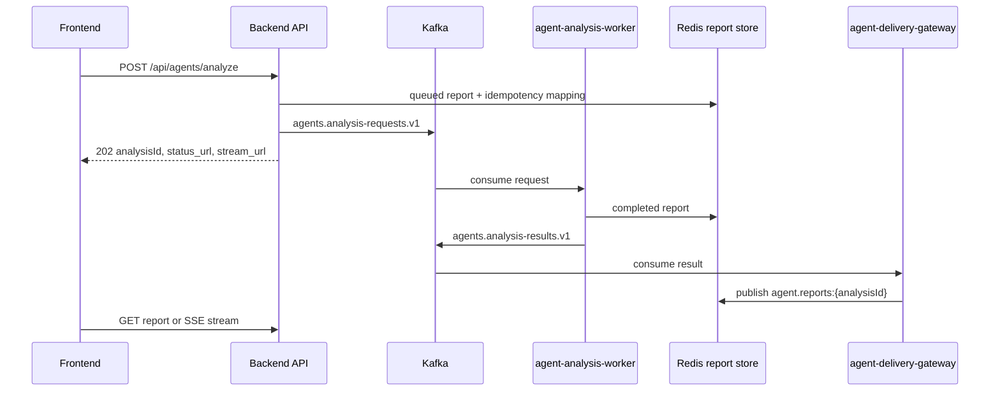

# GOPS Agent Backend Integration

이 문서는 백엔드가 GOPS 에이전트 런타임을 붙일 때 지켜야 하는 계약을
정리한다. 에이전트 내부 구조는 `AGENT_ARCHITECTURE.md`를 기준으로 한다.

## Backend Role

백엔드는 에이전트 요청의 ingress와 report delivery를 담당한다.

- HTTP request validation
- user/session/idempotency policy
- async request enqueue
- compatibility HTTP call to `agent-orchestrator`
- report polling endpoint
- SSE report stream
- alert WebSocket bridge

백엔드는 request handler 안에서 `AgentOrchestrator.analyze()`를 직접 호출하지
않는다. sync compatibility가 필요하면 `agent-orchestrator` HTTP endpoint를
호출한다.

## Local Demo Simulator Boundary

토요일 시연에서는 `GOPS_SIMULATOR_URL`이 가리키는 로컬 시뮬레이터를
`/api/simulator/*` route로 프록시한다. SIM 모드일 때만 계좌 조회와 주문을
시뮬레이터의 메모리 원장으로 보내며, 이 경로에서는 KIS 주문 outbox를 만들지 않는다.
바스켓 주문도 사용자의 명시적인 버튼 입력과 `Idempotency-Key`가 있어야 실행한다.
속보 수신은 주문이나 차트 레이아웃 변경을 자동으로 실행하지 않는다.

## Runtime Flow



## API Routes

백엔드가 보존해야 하는 agent route:

```text
POST /api/agents/analyze
POST /api/agents/layout/resolve
GET  /api/agents/entities/resolve
GET  /api/agents/reports/{analysis_id}
POST /api/agents/reports/{analysis_id}/cancel
GET  /api/agents/reports/{analysis_id}/stream
WS   /ws/agent-alerts
```

news 패널과 news agent가 일자별 요약을 렌더링할 때 market-data query route
`GET /api/market/news/daily?symbol={SYMBOL}&limit=30&locale=ko-KR`를 사용할 수
있다. 응답은 `displayMode="dailySummary"`와 `dailySummaries[]`를 포함하며,
각 summary의 `sources[]`는 실제 기사 `url`, 표시용 `title`, 선택적 `name`을
가진다. 가능한 경우 각 summary에는 같은 날짜의 1D 종가와 직전 거래일 1D 종가
차이를 나타내는 `priceChange`를 포함한다. 이 public payload에는
`source="redis"` 또는 `source="clickhouse"` 같은 내부 저장소 provenance를 넣지
않는다.
읽기 경로는 Redis 30일 article/daily hot cache를 먼저 사용하고, Redis coverage
metadata가 최근 30일 요청을 보장하지 못할 때만 ClickHouse에서 보강한 뒤 Redis를
다시 warm-up한다.

지수 패널은 market-data query route `GET /api/market/indices`를 사용한다. 이
route는 차트 candle coverage/backfill/read-through 경로를 타지 않고 Yahoo
Finance snapshot을 Redis에 fresh/stale 캐시한다. 백엔드는 fresh 캐시가 있으면
즉시 반환하고, fresh가 없을 때만 짧은 refresh lock을 잡아 Yahoo Finance를
조회한다. refresh 중이거나 Yahoo Finance가 timeout/rate-limit/failure를 반환하면
마지막 성공 snapshot을 `cacheStatus="stale"`로 반환할 수 있다.

장중 매수 추천 패널은 recommendation API를 사용한다. `PUT /api/recommendations/profile`은
설정의 추천 설정 탭에서 필수 투자 설정을 저장하고, `GET
/api/recommendations/stocks/latest`와 `POST /api/recommendations/stocks/refresh`는
정규장 장중 추천만 반환한다. 추천 worker는 프로필이 있는 사용자 목록을 순회하고,
09:45/12:45/15:45 ET 슬롯 run key로 멱등 실행한다. 종목 선정은 결정론적 점수화
로직이 담당하며, 알림은 기존 notifications 저장소와 `WS /ws/notifications`
브로커만 재사용한다. 추천 profile, heatmap item, recommendation item, holdings
snapshot의 `sector`는 GraphDB `gops:sector` canonical 값을 사용하고, 화면 표시용
한글 라벨은 `sectorLabelKo`로 함께 내려준다.

`POST /api/agents/analyze`는 로그인 session cookie로 사용자를 확인하고 다음 header만
클라이언트 입력으로 읽는다.

```text
Idempotency-Key
```

`X-GOPS-User-Id`와 body의 `userId`는 신뢰하지 않는다. 백엔드는
`Depends(require_current_user)`가 반환한 session `sub`를 canonical user id로
사용한다. `Idempotency-Key`가 있으면 같은 session user/key 조합은 같은
`analysisId`를 재사용해야 한다. 이미 완료된 report가 있으면 completed report를
반환할 수 있다.

인증이 활성화된 환경에서는 analyze와 layout resolve를 session 사용자별 기본
10회/60초로 제한한다. rate-limit Redis를 확인할 수 없으면 제한을 우회하지 않고
`503`을 반환하며, 한도를 넘으면 `Retry-After`와 함께 `429`를 반환한다.

`POST /api/agents/layout/resolve`는 UI-only layout command preflight다. 이 route는
Kafka queue와 report polling을 타지 않고 `agent-orchestrator`의 `/layout/resolve`
compat endpoint를 동기로 호출한다. 응답은 다음 shape를 유지한다.

```json
{
  "status": "ui_layout",
  "summary": "변경했습니다.",
  "rationale": "시장 뉴스 패널 크기를 조정했습니다.",
  "analysisId": "agent-request-id",
  "route": {"source": "ui-parser", "intentType": "ui-layout", "selectedRoles": []},
  "layoutProposal": {},
  "agentTrace": {"uiLayoutFastAck": true}
}
```

`status="not_ui"`이면 프런트는 기존 `POST /api/agents/analyze`로 fallback한다.
`status="ui_clarify"`이면 UI 관련 표현은 감지했지만 실행 가능한 layout task가
확정되지 않은 상태다. 프런트는 분석 fallback을 하지 않고 `summary`를 사용자에게
표시한다.

## Request Shape

요청 body는 프런트와 차트 엔진이 context를 추가할 수 있도록 확장 필드를
허용하되 raw HTTP body와 검증된 전체 JSON을 각각 64 KiB 이하로 제한한다. raw
body 초과는 JSON 파싱 전에 `413`을 반환한다. `messages`는 최대 50개,
`references`와 `marketEvents`는 각각 최대 100개다. 문자열과 ID에도 필드별 길이
제한을 적용한다.

```json
{
  "symbol": "NVDA",
  "intent": "analysis",
  "routerMode": "hybrid",
  "messages": [{"role": "user", "content": "NVDA 분석해줘"}],
  "chartContext": {},
  "layoutContext": {},
  "references": [],
  "uiContext": {},
  "chartAction": null,
  "chartTargetSymbol": null,
  "chartPlacementIntent": null,
  "requestId": "agent-request-client-id",
  "mode": null,
  "analysisMode": null,
  "priority": null,
  "responseMode": null
}
```

백엔드는 모르는 agent context field를 worker envelope로 전달하되 `userId`,
`idempotencyKey`, `submittedAt`, `maxLlmCalls`, `maxInputTokens`,
`maxOutputTokens`, `llmBudgetOwner` 같은 서버 소유 필드는 제거한다.

`references`, `uiContext`, `chartContext`의 선택/hover reference는 worker payload에
보존되어 agent runtime의 `OperationIR` extractor로 전달된다. runtime은 같은
reference가 여러 필드에 중복 포함돼도 fingerprint로 dedupe한다. reference가 포함된
분석 요청은 선택한 뉴스, 차트 봉, 차트 구간이 cache key에 반영되어야 하며, 같은
자연어 질문이라도 anchor가 다르면 cached analysis를 재사용하지 않는다.
`chart.orderFlow` references are valid chart references and must be preserved
the same way as `chart.candle`; their bid/ask side classification is estimated,
not provider-confirmed.

완료 report의 `timing`은 synthesis 진단을 포함할 수 있다.
`llmCallLabels`에 `synthesis` 또는 `financial-synthesis`가 있으면 최종 종합 답변용
LLM 호출을 획득/시도한 것이다. 최종 답변이 실제 OpenAI 결과인지 여부는
`synthesisProvider="openai"`로 판단한다. `synthesisSkippedReason` 또는
`synthesisFallbackReason`이 있으면 deterministic fallback 답변으로 degrade된 것이다.

## Entity Resolve Shortcut

`GET /api/agents/entities/resolve?q=...&mode=chartShortcut`는 에이전트
카탈로그의 `KoreanEntityResolver`를 얇게 노출한다. 프런트는 에이전트 입력이
회사명/티커 단독이거나 `애플차트 보여줘`, `AAPL chart` 같은 chart-open 명령인지
확인해 차트만 즉시 전환할 때 이 route를 쓴다.

응답의 `chartShortcut=true`는 입력이 company/ticker로 확정되고, 나머지 표현이
차트 열기/전환/추가 명령일 때만 반환한다. 해당 symbol은 기존 market-data
symbol registry/universe에서 차트로 열 수 있어야 한다. 다중 차트 요청이면
호환용 `symbol`은 첫 번째 종목을 담고 optional `symbols`가 입력 순서의 ticker
목록을 담는다. `엔비디아 뉴스`,
`엔비디아 분석해줘`, `엔비디아 차트 분석해줘`, 관계 질문, 테마 entity,
ambiguous match, registry 미지원 symbol은 분석 요청으로 fallback할 수 있도록
`chartShortcut=false`를 반환한다.

응답은 optional `chartAction`을 포함할 수 있다. 기본 `애플 차트 보여줘`,
`AAPL chart`, 회사명/티커 단독 입력은 `chartAction="replace"`로 현재 chart
symbol 전환을 의미한다. `애플 차트 추가해줘`, `애플도 같이 보여줘`,
`AAPL chart too`, `애플 차트 엔비디아 차트 같이 보여줘` 같은 비교/동시 표시
표현은 `chartAction="add"`로 기존 chart를 유지한 추가 chart panel 요청을
의미한다. 위치 표현이 있으면
`chartPlacementIntent`에 `top`, `bottom`, `left`, `right`, `center` 중 하나를
담는다.

프런트가 chart add shortcut을 `POST /api/agents/layout/resolve`로 넘길 때는
`chartAction="add"`, `chartTargetSymbol`, `chartPlacementIntent`를 request body에
포함할 수 있다. 백엔드는 이 필드를 제거하지 않고 orchestrator로 전달해야 한다.
orchestrator는 이 메타데이터를 UI-only layout task로 보강해 analysis pipeline을
타지 않고 `layout.panel.add`와 priority-aware `layout.panels.arrange` proposal을
반환한다.

이 route는 `gops-backend` process 안에서 `KoreanEntityResolver`를 직접 실행한다.
따라서 backend image에도 `systems/agent-orchestration/config`와
`systems/agent-orchestration/shared`가 함께 포함되어야 한다. 운영 alias catalog인
`entity-aliases.json`이 없으면 bootstrap seed로 degrade해 seed에 없는 회사명
shortcut을 놓칠 수 있다.

## Async Submit Response

Async submit은 기본적으로 `202`를 반환한다.

```json
{
  "request_id": "agent-request-id",
  "analysisId": "agent-request-id",
  "status": "queued",
  "status_url": "/api/agents/reports/agent-request-id",
  "stream_url": "/api/agents/reports/agent-request-id/stream",
  "report": {}
}
```

완료된 idempotent retry는 `200`과 completed `AnalysisReport`를 반환할 수
있다. 프런트는 `analysisId`를 canonical key로 사용한다.

## Cancellation

`POST /api/agents/reports/{analysis_id}/cancel`은 사용자가 실행 중인 분석을
중단할 때 호출한다. 프런트가 submit 전에 `requestId`를 생성해 body에 넣으면
submit 응답이 오기 전에도 같은 값을 `analysis_id`로 cancel할 수 있다.

백엔드는 submit 시 `agent:report:owner:{analysisId}`에 session user의 hash를
저장한다. report 조회, cancel, SSE stream은 owner가 일치하지 않으면 존재 여부를
노출하지 않도록 `404`를 반환한다. client request id 충돌은 다른 사용자의 owner
mapping을 덮어쓰지 않고 `409`로 거절한다.

Cancel은 cooperative cancellation이다. 백엔드는 report store에 `canceled`
terminal report와 cancel marker를 저장하고 Redis update channel로 publish한다.
queued Kafka message는 삭제하지 않으며, worker는 message를 소비할 때 marker를
확인해 orchestrator 실행을 건너뛴다. 이미 실행 중인 worker/orchestrator는 단계
경계에서 marker를 확인하고 `completed` 결과가 `canceled` report를 덮어쓰지
못하게 해야 한다.

이미 `completed`, `deep_completed`, `failed`인 report는 cancel로 덮어쓰지 않는다.
프런트는 `completed`, `deep_completed`, `failed`, `canceled`를 terminal status로
취급한다.

## Queue And Report Store

기본 production path:

```text
API acknowledgement
-> Kafka agents.analysis-requests.v1
-> agent-analysis-worker
-> Redis report store
-> Kafka agents.analysis-results.v1
-> agent-delivery-gateway
-> Redis pubsub
-> polling or SSE delivery
```

필수 Redis keys/channels:

```text
agent:report:{analysisId}
agent:report:latest:{SYMBOL}
agent:report:latest
agent:request:idempotency:{userHash}:{keyHash}
agent:report:cancel:{analysisId}
agent:report:owner:{analysisId}
agent.reports
agent.reports:{analysisId}
```

Report persistence failure는 가능하면 analysis generation을 막지 않도록 fail
open한다. 단, polling/SSE 품질은 Redis store 상태에 의존한다.

## Compatibility Mode

`AGENT_ASYNC_ANALYSIS_ENABLED=false`이면 백엔드는 Kafka enqueue 대신
`AGENT_ORCHESTRATOR_URL`의 HTTP endpoint를 호출할 수 있다.

`AGENT_SYNC_COMPAT_WAIT_ENABLED=true`는 queue-backed path를 유지하면서 짧게
Redis report store를 wait하는 테스트용 compatibility mode다. 운영 기본값으로
쓰지 않는다.

## Required Env

Backend/API side:

```text
AGENT_ORCHESTRATOR_URL
AGENT_ASYNC_ANALYSIS_ENABLED
AGENT_SYNC_COMPAT_WAIT_ENABLED
AGENT_SYNC_COMPAT_WAIT_TIMEOUT_SECONDS
AGENT_SYNC_COMPAT_WAIT_POLL_SECONDS
AGENT_SHARED_REPORT_STORE_ENABLED
AGENT_ANALYSIS_QUEUE_BACKEND
AGENT_REPORT_STORE_BACKEND
AGENT_REPORT_TTL_SECONDS
AGENT_REPORT_CANCEL_KEY_PREFIX
AGENT_REPORT_OWNER_KEY_PREFIX
AGENT_RATE_LIMIT_ENABLED
AGENT_RATE_LIMIT_REQUESTS
AGENT_RATE_LIMIT_WINDOW_SECONDS
AGENT_REPORT_STREAM_REDIS_ENABLED
AGENT_REPORT_UPDATES_CHANNEL
AGENT_IDEMPOTENCY_TTL_SECONDS
AGENT_IDEMPOTENCY_KEY_PREFIX
AGENT_ENTITY_ALIAS_CATALOG_PATH
AGENT_ENTITY_ALIAS_SEED_PATH
AGENT_ENTITY_CATALOG_STRICT
AGENT_MARKET_SYMBOL_REGISTRY_PATH
KAFKA_BOOTSTRAP_SERVERS
AGENT_ANALYSIS_REQUESTS_TOPIC
AGENT_ANALYSIS_RESULTS_TOPIC
AGENT_DLQ_TOPIC
REDIS_URL
```

Worker side:

```text
AGENT_DEEP_ANALYSIS_ENABLED
AGENT_DEEP_ANALYSIS_REQUESTS_TOPIC
AGENT_QUERY_UNDERSTANDING_EVENTS_TOPIC
AGENT_NOTIFICATION_DECISIONS_TOPIC
AGENT_MARKET_EVENTS_TOPIC
AGENT_PUBLISH_TO_KAFKA
CLICKHOUSE_HTTP_URL
CLICKHOUSE_DATABASE
CLICKHOUSE_USER
CLICKHOUSE_PASSWORD
GRAPHDB_SPARQL_URL
GRAPHDB_REPOSITORY
OPENAI_API_KEY
AGENT_OPERATION_PLANNER_PROVIDER
AGENT_OPERATION_PLANNER_MODEL
AGENT_OPERATION_PLANNER_TIMEOUT_SECONDS
```

`AGENT_OPERATION_PLANNER_PROVIDER=openai` enables the slow-path structured
OperationIR planner for low-confidence or ambiguous interactive requests. Keep it
unset to run only deterministic extraction.

## Backend Reference Files

기존 구현을 참고할 때 볼 파일:

```text
systems/api-server/pods/api-server/gops-backend/app/contracts/agents.py
systems/api-server/pods/api-server/gops-backend/app/routes/agents.py
systems/api-server/pods/api-server/gops-backend/app/services/agent_gateway.py
systems/api-server/pods/api-server/gops-backend/app/services/agent_alert_payloads.py
systems/api-server/pods/api-server/gops-backend/app/main.py
systems/api-server/tests/test_agent_routes.py
```

새 백엔드는 구현을 바꿔도 되지만 route name, idempotency, async status,
polling/SSE semantics는 보존해야 한다.

## Chart Analysis Asset Routes

Chart analysis asset은 interactive agent report와 별도인 수동 build projection이다.

```text
GET    /api/charts/analysis-assets
DELETE /api/charts/analysis-assets?symbols=NVDA&intervals=1D
GET    /api/charts/analysis-assets/coverage
POST   /api/charts/analysis-assets/build
GET    /api/charts/analysis-assets/build/{job_id}
GET    /api/charts/analysis-assets/build/{job_id}/stream
POST   /api/charts/analysis-assets/build/{job_id}/cancel
```

DELETE는 개발 패널의 명시적 정리 기능이다. 최대 100개 symbol과 1D/1W/1M만 받고,
선택된 pair를 active asset store에서 삭제한다. ClickHouse 기본 모드는 전체 history를
`mutations_sync=1`로 지우고, dual mode는 양쪽 저장소가 모두 성공해야 한다. 자동 보존 정책,
TTL 또는 broad cleanup으로 재사용하지 않는다. build 완료·삭제 후 프런트는 cache를
무효화하고 열린 chart/commentary panel을 재조회한다.
Build 상세 로그는 status JSON에 넣지 않고 기존 Redis pub/sub을 SSE `event: log`로
그대로 전달한다. 별도 key/List/Stream을 만들지 않으며 구독하지 않은 로그는 유실된다.
최종 생성량은 status의 작은 `createdEntities` 정수만 사용한다. Coverage의
`drawingCount`는 저장된 엔티티 수이며 호환 alias `storedDrawingCount`와 같다. 실제
차트 적용 수와 anchor/stale 제외 수는 현재 candle과 active chart document의 실제
drawing ID를 아는 프런트가 계산한다.

`CHART_ASSET_STORAGE_MAINTENANCE=true` 동안 GET은 계속 열어 두고 build와 DELETE만
503으로 막는다. 이 짧은 drain window에서 ClickHouse 최신 행을 PostgreSQL로
동기화·prune하고 canonical payload digest parity가 100%일 때만 read primary를 바꾼다.

## Failure Policy

- Kafka enqueue 실패는 `202 queued`로 가장하면 안 된다.
- Redis report store가 없으면 polling/SSE는 degrade를 명시해야 한다.
- Provider no-data는 backend error가 아니다.
- `agent-analysis-worker` failure는 DLQ 또는 report status로 드러나야 한다.
- API는 order/account/broker flow를 agent report 생성과 섞지 않는다.

## Validation

```sh
git diff --check
.venv/bin/python -m unittest discover -s systems/api-server/tests -p 'test_agent_routes.py'
.venv/bin/python -m unittest discover -s systems/agent-orchestration/tests -p 'test_*.py'
.venv/bin/python -m unittest discover -s systems/fundamentals/tests -p 'test_*.py'
```

Runtime acceptance:

```text
POST /api/agents/analyze returns 202 and analysisId
agent-analysis-worker consumes agents.analysis-requests.v1
completed report is saved in Redis
GET /api/agents/reports/{analysis_id} returns the completed report
GET /api/agents/reports/{analysis_id}/stream emits updates or frontend can poll
```
