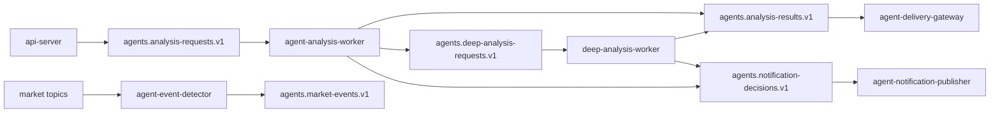

# Agent Changeset Integration Guide

이 문서는 `GRAPH_AWARE_RETRIEVAL_PROPOSAL.md` 기준으로 추가된 에이전트 아키텍처 변경을 다른 작업 브랜치와 통합하기 위한 핸드오프 가이드다.

대상 독자는 세 그룹이다.

- AWS/플랫폼 담당자: Kafka, Redis, ClickHouse, Docker, compose, k8s, env 계약을 맞춘다.
- 하위 에이전트 담당자: agent-orchestration 내부 역할 에이전트, retrieval, graph expansion, synthesis, evaluation을 확장한다.
- 백엔드/API 담당자: `/api/agents/*` 요청 경계, idempotency, report 조회, SSE delivery를 기존 API 변경과 합친다.

## 핵심 결론

이번 변경은 에이전트 분석을 동기 HTTP 호출에서 queue-backed asynchronous analysis로 옮기는 작업이다.

기존 호환 경로는 유지된다.
`AGENT_ASYNC_ANALYSIS_ENABLED=false`이면 API 서버는 기존처럼 `agent-orchestrator` HTTP `/analyze`를 호출한다.
새 경로에서는 API 서버가 요청을 직접 분석하지 않고 `AgentAnalysisRequestEnvelope`를 만들고, admission/idempotency를 처리한 뒤 Kafka 또는 in-process queue에 넣는다.
worker가 분석을 수행하고 shared report store에 결과를 저장한다.
클라이언트는 `GET /api/agents/reports/{analysis_id}` 또는 `GET /api/agents/reports/{analysis_id}/stream`으로 결과를 받는다.

```mermaid
flowchart LR
  User["Frontend or API client"] --> Api["api-server<br/>/api/agents/analyze"]
  Api --> Admit["admission + idempotency"]
  Admit --> StoreQueued["shared report store<br/>queued/running/completed"]
  Admit --> Queue["agents.analysis-requests.v1"]
  Queue --> HotWorker["agent-analysis-worker"]
  HotWorker --> Orchestrator["AgentOrchestrator"]
  Orchestrator --> Retrieval["RetrievalContext<br/>graph cache + bounded fanout"]
  Retrieval --> Synthesis["role agents + cross-signal + synthesis"]
  Synthesis --> StoreDone["shared report store"]
  Synthesis --> ResultsTopic["agents.analysis-results.v1"]
  ResultsTopic --> Delivery["agent-delivery-gateway"]
  Delivery --> RedisPubSub["agent.reports channel"]
  StoreDone --> Poll["GET report"]
  RedisPubSub --> SSE["SSE stream"]
```



## 팀별 통합 책임

| 팀 | 반드시 볼 파일 | 책임 |
| --- | --- | --- |
| 백엔드/API | `systems/api-server/pods/api-server/gops-backend/app/routes/agents.py`, `systems/api-server/pods/api-server/gops-backend/app/services/agent_gateway.py`, `systems/api-server/pods/api-server/gops-backend/app/contracts/agents.py`, `systems/api-server/pods/api-server/gops-backend/app/main.py` | 기존 `/api/agents/analyze` 계약을 유지하면서 async ingress, idempotency header, report polling, SSE stream을 병합한다. |
| 하위 에이전트 | `systems/agent-orchestration/shared/gops_agents/*`, `systems/agent-orchestration/pods/*`, `systems/agent-orchestration/jobs/*`, `systems/agent-orchestration/tests/test_agent_orchestration.py` | 역할 에이전트, graph-aware retrieval, cross-signal join, worker/deep worker/delivery gateway 동작을 유지하고 확장한다. |
| AWS/플랫폼 | `docker-compose.yml`, `.env.example`, `infra/docker/Dockerfile.gops-agent-orchestrator`, `infra/k8s/base/*agent*`, `infra/k8s/base/configmap.yaml`, `infra/k8s/base/kustomization.yaml`, `infra/k8s/overlays/*/configmap-*.yaml`, `platform/kafka/topics.txt`, `platform/kafka/README.md`, `infra/clickhouse/initdb/01-market-data.sql` | Kafka topic, Redis report store, ClickHouse graph expansion table, k8s deployment/job, env/configmap, image boundary를 맞춘다. |
| 문서/릴리즈 | `docs/AGENT_ARCHITECTURE.md`, `docs/AGENT_REPORT_STORAGE.md`, `docs/ARCHITECTURE.md`, `docs/ENVIRONMENT.md`, `docs/IMAGE_STRATEGY.md`, `systems/agent-orchestration/README.md`, 이 문서 | 통합 후 실제 배포 방식과 env default가 문서와 맞는지 확인한다. |

## 백엔드/API 통합 가이드

백엔드 쪽에서 가져가야 하는 최소 묶음은 다음이다.

```text
systems/api-server/pods/api-server/gops-backend/app/contracts/agents.py
systems/api-server/pods/api-server/gops-backend/app/main.py
systems/api-server/pods/api-server/gops-backend/app/routes/agents.py
systems/api-server/pods/api-server/gops-backend/app/services/agent_gateway.py
systems/api-server/tests/test_agent_routes.py
systems/api-server/.env.example
```

통합 시 유지해야 하는 API 계약은 다음이다.

```text
POST /api/agents/analyze
GET  /api/agents/reports/{analysis_id}
GET  /api/agents/reports/{analysis_id}/stream
WS   /ws/agent-alerts
```

`POST /api/agents/analyze`는 다음 header를 읽는다.

```text
Idempotency-Key
X-GOPS-User-Id
```

응답은 async 경로에서 기본적으로 `202`를 반환한다.
본문에는 `request_id`, `analysisId`, `status_url`, `stream_url`, `report`가 들어간다.
이미 완료된 idempotent request를 다시 받으면 `200` completed report를 반환할 수 있다.

백엔드 충돌 해결 기준:

- `routes/agents.py`가 다른 브랜치에서 바뀌었으면 기존 alert WebSocket 변경을 보존하되, report polling/SSE endpoint는 유지한다.
- `agent_gateway.py`는 async flag가 핵심 분기다. `AGENT_ASYNC_ANALYSIS_ENABLED=false` 호환 경로와 `true` queue 경로를 둘 다 남긴다.
- API 서버는 직접 `AgentOrchestrator.analyze()`를 import하지 않는다. API는 request envelope와 queue/report store 경계까지만 담당한다.
- `main.py`에서 `gops_agents` import path를 잡는 변경이 빠지면 API route가 새 shared modules를 찾지 못한다.
- `AgentAnalysisRequest` contract에 새 payload field를 추가할 때는 `build_request_envelope()`이 모르는 field를 payload에 남겨 worker로 전달할 수 있게 해야 한다.

## 하위 에이전트 통합 가이드

에이전트 담당자가 가져가야 하는 최소 묶음은 다음이다.

```text
systems/agent-orchestration/shared/gops_agents/runtime/admission.py
systems/agent-orchestration/shared/gops_agents/runtime/queues.py
systems/agent-orchestration/shared/gops_agents/runtime/workers.py
systems/agent-orchestration/shared/gops_agents/retrieval/bulkhead.py
systems/agent-orchestration/shared/gops_agents/retrieval/cross_signal.py
systems/agent-orchestration/shared/gops_agents/runtime/delivery_gateway.py
systems/agent-orchestration/shared/gops_agents/retrieval/graph_expansion.py
systems/agent-orchestration/shared/gops_agents/runtime/envelope.py
systems/agent-orchestration/shared/gops_agents/retrieval/context.py
systems/agent-orchestration/shared/gops_agents/runtime/report_store.py
systems/agent-orchestration/shared/gops_agents/orchestrator.py
systems/agent-orchestration/shared/gops_agents/retrieval/snapshots.py
systems/agent-orchestration/shared/gops_agents/contracts.py
systems/agent-orchestration/shared/gops_agents/roles/__init__.py
systems/agent-orchestration/shared/gops_agents/__init__.py
systems/agent-orchestration/pods/agent-orchestrator/main.py
systems/agent-orchestration/pods/agent-analysis-worker/main.py
systems/agent-orchestration/pods/deep-analysis-worker/main.py
systems/agent-orchestration/pods/agent-delivery-gateway/main.py
systems/agent-orchestration/tests/test_agent_orchestration.py
```

역할별 책임은 다음처럼 나뉜다.

| 파일 | 역할 |
| --- | --- |
| `request_envelope.py` | API에서 worker로 넘어가는 request envelope, status report, idempotent request id 생성. |
| `analysis_queue.py` | in-process/Kafka queue adapter와 queue metrics. |
| `admission.py` | queue depth, producer buffer, stream-to-poll degradation, deep mode 허용 여부 판단. |
| `analysis_worker.py` | Kafka consumer worker, hot analysis 실행, deep analysis enqueue, result publish. |
| `report_store.py` | Redis/InMemory shared report store와 idempotency mapping. |
| `retrieval_context.py` | graph expansion hint와 fanout policy를 담는 retrieval plan. |
| `graph_expansion.py` | GraphDB evidence를 Redis/ClickHouse serving cache로 materialize/load. |
| `snapshots.py` | bounded fanout, provider bulkhead, expanded news/market peer evidence, cross-signal trim. |
| `cross_signal.py` | graph/news/market evidence를 synthesis용 compact signal로 join. |
| `bulkhead.py` | provider별 semaphore bulkhead와 timeout/rejection 기록. |
| `delivery_gateway.py` | `agents.analysis-results.v1` report를 shared store/Redis pubsub으로 fanout. |
| `orchestrator.py` | `RetrievalContext` 생성, diagnostics/timing, synthesis input 확장. |
| `contracts.py` | report, synthesis input, route/snapshot data shape. |
| `agents.py` | role agent와 final synthesis input consumption. |

하위 에이전트를 추가할 때의 순서는 다음이다.

1. role output shape를 `contracts.py`에 먼저 추가한다.
2. role 실행 또는 synthesis 입력을 `agents.py`와 `orchestrator.py`에 연결한다.
3. provider evidence가 필요하면 `snapshots.py`에 `DataSnapshot` 또는 `EvidenceItem`으로만 넣는다.
4. hot path에서 외부 provider를 직접 늘릴 때는 `bulkhead.py`를 거치고 fanout/env 제한을 둔다.
5. GraphDB 직접 탐색을 hot path 기본값으로 넣지 않는다. `graph_expansion.py` refresh job 또는 deep mode로 분리한다.
6. 새 field가 report store round-trip을 해야 하면 `report_store.py` deserializer 테스트를 추가한다.

안전 경계:

- 이 시스템은 분석, layout proposal, notification decision만 만든다.
- 주문 실행, KIS adapter, account-control flow를 직접 호출하지 않는다.
- local runtime에서 fake market candles를 생성하지 않는다.

## AWS/플랫폼 통합 가이드

플랫폼 담당자가 가져가야 하는 최소 묶음은 다음이다.

```text
.env.example
docker-compose.yml
infra/docker/Dockerfile.gops-agent-orchestrator
infra/clickhouse/initdb/01-market-data.sql
infra/k8s/base/configmap.yaml
infra/k8s/base/kustomization.yaml
infra/k8s/base/deployment-agent-analysis-worker.yaml
infra/k8s/base/deployment-deep-analysis-worker.yaml
infra/k8s/base/deployment-agent-delivery-gateway.yaml
infra/k8s/base/job-agent-queue-smoke.yaml
infra/k8s/base/job-report-store-smoke.yaml
infra/k8s/base/job-graph-expansion-smoke.yaml
infra/k8s/base/job-graph-expansion-refresh.yaml
infra/k8s/base/job-retrieval-latency-benchmark.yaml
infra/k8s/base/job-fanout-policy-benchmark.yaml
infra/k8s/base/job-retrieval-quality-eval.yaml
infra/k8s/base/job-answer-grounding-eval.yaml
infra/k8s/overlays/aws/configmap-aws-patch.yaml
infra/k8s/overlays/aws-incluster-app/configmap-incluster-patch.yaml
platform/kafka/topics.txt
platform/kafka/README.md
docs/ENVIRONMENT.md
docs/IMAGE_STRATEGY.md
```

Kafka topic contract:

```text
agents.market-events.v1
agents.analysis-requests.v1
agents.deep-analysis-requests.v1
agents.analysis-results.v1
agents.notification-decisions.v1
agents.dlq.v1
```

Topic flow:



Redis contracts:

```text
AGENT_REPORT_KEY_PREFIX=agent:report
AGENT_REPORT_TTL_SECONDS=43200
AGENT_IDEMPOTENCY_KEY_PREFIX=agent:request:idempotency
AGENT_IDEMPOTENCY_TTL_SECONDS=<defaults to report ttl>
AGENT_REPORT_UPDATES_CHANNEL=agent.reports
AGENT_GRAPH_EXPANSION_REDIS_PREFIX=gops:agent:graph-expansion:v1
```

ClickHouse contract:

```text
database: market_data
table:    agent_graph_expansions
file:     infra/clickhouse/initdb/01-market-data.sql
```

The table stores one JSON payload per symbol/relation version/generation time.
GraphDB remains a source for refresh/deep paths, not a hot-path serving dependency.

Deployment order for AWS/EKS:

1. Create or confirm Kafka topics from `platform/kafka/topics.txt`.
2. Ensure Redis/Valkey endpoint is available through `REDIS_URL`.
3. Apply ClickHouse schema containing `market_data.agent_graph_expansions`.
4. Build/push `gops-agent-orchestrator` image from `infra/docker/Dockerfile.gops-agent-orchestrator`.
5. Deploy `agent-orchestrator` first for compatibility.
6. Deploy `agent-analysis-worker`, `agent-delivery-gateway`, then `deep-analysis-worker` if deep mode is enabled.
7. Enable `AGENT_SHARED_REPORT_STORE_ENABLED=true`.
8. Enable `AGENT_ASYNC_ANALYSIS_ENABLED=true` after smoke jobs pass.
9. Enable `AGENT_DEEP_ANALYSIS_ENABLED=true` only after hot queue latency and result delivery are stable.

Platform caveat:

- `KafkaAnalysisRequestQueue.metrics()` can report producer buffered count but not broker queue depth or consumer lag by itself.
- AWS owner should wire MSK consumer lag/CloudWatch metrics into autoscaling and admission thresholds before treating queue depth as production SLO.
- `AGENT_ADMISSION_MAX_QUEUE_DEPTH` only works when the chosen queue metrics backend can provide queue depth.

## 환경 변수 체크리스트

Async request/report:

```text
AGENT_ASYNC_ANALYSIS_ENABLED
AGENT_SYNC_COMPAT_WAIT_ENABLED
AGENT_SYNC_COMPAT_WAIT_TIMEOUT_SECONDS
AGENT_SYNC_COMPAT_WAIT_POLL_SECONDS
AGENT_SHARED_REPORT_STORE_ENABLED
AGENT_ANALYSIS_QUEUE_BACKEND
AGENT_ANALYSIS_REQUESTS_TOPIC
AGENT_ANALYSIS_RESULTS_TOPIC
AGENT_QUERY_UNDERSTANDING_EVENTS_TOPIC
AGENT_DEEP_ANALYSIS_REQUESTS_TOPIC
AGENT_NOTIFICATION_DECISIONS_TOPIC
AGENT_DLQ_TOPIC
AGENT_INTENT_CLASSIFIER_PROVIDER
AGENT_INTENT_CLASSIFIER_URL
AGENT_INTENT_CLASSIFIER_TIMEOUT_SECONDS
AGENT_QUERY_UNDERSTANDING_TIMEOUT_MS
AGENT_REPORT_STORE_BACKEND
AGENT_REPORT_TTL_SECONDS
AGENT_REPORT_KEY_PREFIX
AGENT_IDEMPOTENCY_TTL_SECONDS
AGENT_IDEMPOTENCY_KEY_PREFIX
AGENT_REPORT_STREAM_REDIS_ENABLED
AGENT_REPORT_STREAM_MAX_SECONDS
AGENT_REPORT_STREAM_POLL_SECONDS
AGENT_REPORT_UPDATES_CHANNEL
```

Admission/backpressure:

```text
AGENT_ADMISSION_ENABLED
AGENT_ADMISSION_MAX_QUEUE_DEPTH
AGENT_ADMISSION_MAX_PRODUCER_BUFFERED
AGENT_ADMISSION_DEGRADE_STREAM_TO_POLL
```

Worker/deep/delivery:

```text
AGENT_ANALYSIS_WORKER_GROUP_ID
AGENT_ANALYSIS_WORKER_CLIENT_ID
AGENT_ANALYSIS_WORKER_MAX_POLL_RECORDS
AGENT_ANALYSIS_WORKER_MAX_POLL_INTERVAL_MS
AGENT_ANALYSIS_WORKER_MAX_MESSAGES
AGENT_DEEP_ANALYSIS_ENABLED
AGENT_DEEP_ANALYSIS_WORKER_GROUP_ID
AGENT_DEEP_ANALYSIS_WORKER_CLIENT_ID
AGENT_DELIVERY_GATEWAY_GROUP_ID
AGENT_DELIVERY_GATEWAY_CLIENT_ID
AGENT_DELIVERY_GATEWAY_MAX_POLL_RECORDS
AGENT_DELIVERY_REDIS_PUBLISH_ENABLED
AGENT_PUBLISH_TO_KAFKA
AGENT_OUTPUT_KAFKA_FLUSH_SECONDS
```

Graph-aware retrieval:

```text
AGENT_GRAPH_EXPANSION_CACHE_ENABLED
AGENT_GRAPH_EXPANSION_REDIS_PREFIX
AGENT_GRAPH_EXPANSION_CLICKHOUSE_TABLE
AGENT_GRAPH_EXPANSION_SYMBOLS
AGENT_GRAPH_EXPANSION_SYMBOL_FILE
AGENT_GRAPH_EXPANSION_RELATION_VERSION
AGENT_GRAPH_EXPANSION_TTL_SECONDS
AGENT_EXPANDED_RETRIEVAL_ENABLED
AGENT_MAX_RELATED_SYMBOLS
AGENT_MAX_RELATED_THEMES
AGENT_MAX_NEWS_ITEMS_TOTAL
AGENT_MAX_MARKET_PEERS
AGENT_GRAPH_CACHE_DEADLINE_MS
AGENT_EXPANDED_RETRIEVAL_DEADLINE_MS
AGENT_SNAPSHOT_TOTAL_DEADLINE_MS
AGENT_CROSS_SIGNAL_ENABLED
AGENT_MAX_SYNTHESIS_CROSS_SIGNALS
AGENT_MAX_SYNTHESIS_CROSS_SIGNAL_CHARS
```

Provider bulkheads:

```text
AGENT_PROVIDER_BULKHEAD_DEFAULT_MAX_CONCURRENCY
AGENT_PROVIDER_BULKHEAD_MARKET_MAX_CONCURRENCY
AGENT_PROVIDER_BULKHEAD_NEWS_MAX_CONCURRENCY
AGENT_PROVIDER_BULKHEAD_RELATIONSHIP_MAX_CONCURRENCY
AGENT_PROVIDER_BULKHEAD_ACQUIRE_TIMEOUT_MS
```

Benchmark/eval:

```text
AGENT_BENCHMARK_QUERIES_JSON
AGENT_BENCHMARK_BURST_REQUESTS
AGENT_BENCHMARK_BURST_SYMBOL
AGENT_FANOUT_BENCHMARK_VALUES
AGENT_RETRIEVAL_EVAL_CASES_JSON
AGENT_GROUNDING_EVAL_CASES_JSON
```

## 다른 브랜치에 이식하는 순서

1. 문서와 proposal을 먼저 가져온다.
   - `docs/GRAPH_AWARE_RETRIEVAL_PROPOSAL.md`
   - `docs/AGENT_CHANGESET_INTEGRATION_GUIDE.md`
2. `systems/agent-orchestration/shared/gops_agents`의 새 모듈을 추가한다.
3. 기존 `orchestrator.py`, `snapshots.py`, `contracts.py`, `agents.py`, `report_store.py` 변경을 병합한다.
4. `systems/agent-orchestration/pods`와 `systems/agent-orchestration/jobs` wrapper를 추가한다.
5. API server의 `agent_gateway.py`, `routes/agents.py`, `contracts/agents.py`, `main.py`를 병합한다.
6. Kafka topic, ClickHouse schema, env example, Dockerfile, compose, k8s deployment/job/configmap을 병합한다.
7. 테스트를 병합하고 먼저 local unit test를 통과시킨다.
8. Redis/Kafka/ClickHouse가 있는 환경에서 smoke/eval job을 돌린다.
9. 마지막에 docs의 runtime/env 설명이 실제 배포 default와 맞는지 확인한다.

## 병합 충돌 해결 우선순위

우선순위는 다음이다.

1. 기존 API route contract 보존.
2. 주문/KIS/DB schema와 무관한 에이전트 변경만 적용.
3. async flag off 상태에서 기존 direct orchestrator 호환 경로 동작.
4. async flag on 상태에서 request id, report store, queue worker 동작.
5. Kafka/Redis/ClickHouse env 이름이 compose/k8s/docs에서 일치.
6. 테스트와 smoke job으로 검증.

자주 날 충돌:

- `docker-compose.yml`: agent service/env block을 통째로 다시 맞춘다. 다른 팀 service 변경은 보존한다.
- `infra/k8s/base/configmap.yaml`: agent env key를 추가하되 기존 market/order env를 삭제하지 않는다.
- `infra/k8s/base/kustomization.yaml`: 새 deployment/job yaml 이름만 추가한다.
- `platform/kafka/topics.txt`: agent topic 6개를 append한다. 기존 market/order topic은 건드리지 않는다.
- `systems/api-server/pods/api-server/gops-backend/app/routes/agents.py`: 새 report/SSE route와 기존 alert WebSocket을 둘 다 유지한다.
- `systems/agent-orchestration/shared/gops_agents/contracts.py`: 새 field를 추가할 때 serialization/deserialization round trip test를 같이 확인한다.
- `systems/agent-orchestration/shared/gops_agents/retrieval/snapshots.py`: provider fetch 변경은 bulkhead와 fanout cap을 유지한 상태로 병합한다.

## Rollout 모드

| 모드 | 설정 | 목적 |
| --- | --- | --- |
| compatibility | `AGENT_ASYNC_ANALYSIS_ENABLED=false` | 기존 API -> orchestrator HTTP 동기 경로 유지. |
| shared report read | `AGENT_SHARED_REPORT_STORE_ENABLED=true` | report 조회를 shared store에서 읽을 수 있는지 검증. |
| local async | `AGENT_ASYNC_ANALYSIS_ENABLED=true`, `AGENT_ANALYSIS_QUEUE_BACKEND=memory` | Kafka 없이 envelope/admission/report flow 검증. |
| Kafka async | `AGENT_ASYNC_ANALYSIS_ENABLED=true`, `AGENT_ANALYSIS_QUEUE_BACKEND=kafka` | 실제 worker pool 경로 검증. |
| graph cache | `AGENT_GRAPH_EXPANSION_CACHE_ENABLED=true`, `AGENT_EXPANDED_RETRIEVAL_ENABLED=true` | Redis/ClickHouse graph expansion 기반 bounded fanout 검증. |
| deep analysis | `AGENT_DEEP_ANALYSIS_ENABLED=true` | hot answer 이후 deep worker follow-up 검증. |

## 검증 명령

Local unit tests:

```bash
.venv/bin/python -m unittest systems.agent-orchestration.tests.test_agent_orchestration
.venv/bin/python -m unittest systems.api-server.tests.test_agent_routes
```

Syntax/config checks:

```bash
.venv/bin/python -m py_compile \
  systems/agent-orchestration/shared/gops_agents/retrieval/bulkhead.py \
  systems/agent-orchestration/shared/gops_agents/runtime/admission.py \
  systems/agent-orchestration/shared/gops_agents/runtime/queues.py \
  systems/agent-orchestration/shared/gops_agents/runtime/workers.py \
  systems/agent-orchestration/shared/gops_agents/retrieval/snapshots.py \
  systems/agent-orchestration/shared/gops_agents/retrieval/cross_signal.py \
  systems/api-server/pods/api-server/gops-backend/app/services/agent_gateway.py \
  systems/api-server/pods/api-server/gops-backend/app/routes/agents.py

git diff --check
```

Smoke/eval jobs:

```bash
PYTHONPATH=systems/agent-orchestration/shared:systems/market-data/shared \
  .venv/bin/python systems/agent-orchestration/jobs/agent-queue-smoke/main.py

PYTHONPATH=systems/agent-orchestration/shared:systems/market-data/shared \
  AGENT_BENCHMARK_BURST_REQUESTS=3 \
  .venv/bin/python systems/agent-orchestration/jobs/retrieval-latency-benchmark/main.py

PYTHONPATH=systems/agent-orchestration/shared:systems/market-data/shared \
  .venv/bin/python systems/agent-orchestration/jobs/retrieval-quality-eval/main.py

PYTHONPATH=systems/agent-orchestration/shared:systems/market-data/shared \
  .venv/bin/python systems/agent-orchestration/jobs/answer-grounding-eval/main.py
```

## 변경 파일 전체 목록

Modified files:

```text
.env.example
docker-compose.yml
docs/AGENT_ARCHITECTURE.md
docs/AGENT_REPORT_STORAGE.md
docs/ARCHITECTURE.md
docs/ENVIRONMENT.md
docs/IMAGE_STRATEGY.md
infra/clickhouse/initdb/01-market-data.sql
infra/docker/Dockerfile.gops-agent-orchestrator
infra/k8s/base/configmap.yaml
infra/k8s/base/kustomization.yaml
infra/k8s/overlays/aws-incluster-app/configmap-incluster-patch.yaml
infra/k8s/overlays/aws/configmap-aws-patch.yaml
platform/kafka/README.md
platform/kafka/topics.txt
systems/agent-orchestration/README.md
systems/agent-orchestration/pods/agent-orchestrator/main.py
systems/agent-orchestration/shared/gops_agents/__init__.py
systems/agent-orchestration/shared/gops_agents/roles/__init__.py
systems/agent-orchestration/shared/gops_agents/contracts.py
systems/agent-orchestration/shared/gops_agents/orchestrator.py
systems/agent-orchestration/shared/gops_agents/runtime/report_store.py
systems/agent-orchestration/shared/gops_agents/retrieval/snapshots.py
systems/agent-orchestration/tests/test_agent_orchestration.py
systems/api-server/.env.example
systems/api-server/pods/api-server/gops-backend/app/contracts/agents.py
systems/api-server/pods/api-server/gops-backend/app/main.py
systems/api-server/pods/api-server/gops-backend/app/routes/agents.py
systems/api-server/pods/api-server/gops-backend/app/services/agent_gateway.py
systems/api-server/tests/test_agent_routes.py
```

New files:

```text
docs/AGENT_CHANGESET_INTEGRATION_GUIDE.md
docs/GRAPH_AWARE_RETRIEVAL_PROPOSAL.md
infra/k8s/base/deployment-agent-analysis-worker.yaml
infra/k8s/base/deployment-agent-delivery-gateway.yaml
infra/k8s/base/deployment-deep-analysis-worker.yaml
infra/k8s/base/job-agent-queue-smoke.yaml
infra/k8s/base/job-answer-grounding-eval.yaml
infra/k8s/base/job-fanout-policy-benchmark.yaml
infra/k8s/base/job-graph-expansion-refresh.yaml
infra/k8s/base/job-graph-expansion-smoke.yaml
infra/k8s/base/job-report-store-smoke.yaml
infra/k8s/base/job-retrieval-latency-benchmark.yaml
infra/k8s/base/job-retrieval-quality-eval.yaml
systems/agent-orchestration/jobs/agent-queue-smoke/main.py
systems/agent-orchestration/jobs/answer-grounding-eval/main.py
systems/agent-orchestration/jobs/fanout-policy-benchmark/main.py
systems/agent-orchestration/jobs/graph-expansion-refresh/main.py
systems/agent-orchestration/jobs/graph-expansion-smoke/main.py
systems/agent-orchestration/jobs/report-store-smoke/main.py
systems/agent-orchestration/jobs/retrieval-latency-benchmark/main.py
systems/agent-orchestration/jobs/retrieval-quality-eval/main.py
systems/agent-orchestration/pods/agent-analysis-worker/main.py
systems/agent-orchestration/pods/agent-delivery-gateway/main.py
systems/agent-orchestration/pods/deep-analysis-worker/main.py
systems/agent-orchestration/shared/gops_agents/runtime/admission.py
systems/agent-orchestration/shared/gops_agents/runtime/queues.py
systems/agent-orchestration/shared/gops_agents/runtime/workers.py
systems/agent-orchestration/shared/gops_agents/retrieval/bulkhead.py
systems/agent-orchestration/shared/gops_agents/retrieval/cross_signal.py
systems/agent-orchestration/shared/gops_agents/runtime/delivery_gateway.py
systems/agent-orchestration/shared/gops_agents/retrieval/graph_expansion.py
systems/agent-orchestration/shared/gops_agents/runtime/envelope.py
systems/agent-orchestration/shared/gops_agents/retrieval/context.py
```

## 현재 검증 상태

이 changeset 작성 시점에 확인한 검증은 다음이다.

```text
systems.agent-orchestration.tests.test_agent_orchestration: 89 tests OK
systems.api-server.tests.test_agent_routes: 13 tests OK
py_compile: OK
git diff --check: OK
compose/k8s yaml parse: 49 files OK
agent-queue-smoke: OK
retrieval-latency-benchmark: OK
retrieval-quality-eval: OK
answer-grounding-eval: OK
```

아직 남은 운영 검증:

- 실제 MSK/Redis/ClickHouse endpoint를 붙인 EKS end-to-end smoke.
- MSK consumer lag 기반 autoscaling/admission metric 연동.
- Redis pubsub 기반 SSE fanout의 운영 규모 검증.
- GraphDB refresh job의 실제 relation payload 품질 검증.
