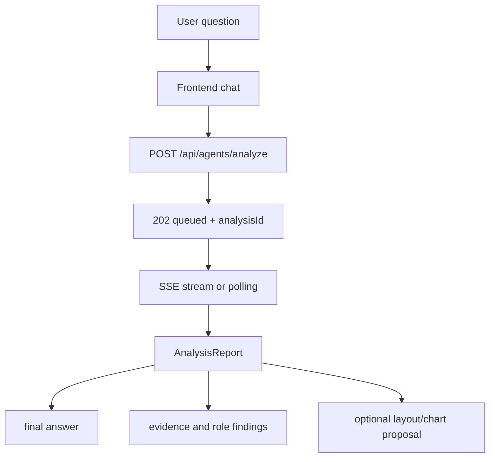

# GOPS Agent Frontend Integration

이 문서는 새 프런트엔드나 기존 `gops-frontend`가 GOPS 에이전트를 붙일 때
지켜야 하는 계약을 정리한다. 백엔드 route와 delivery semantics는
`AGENT_BACKEND_INTEGRATION.md`를 따른다.

## Frontend Role

프런트는 사용자의 질문, 현재 종목, 차트/레이아웃 context를 백엔드에 보내고
`analysisId` 기준으로 report를 렌더링한다.

프런트가 담당하는 것:

- chat input and message context
- current symbol and watch context
- optional `chartContext`
- optional `layoutContext`
- report polling or SSE subscription
- final answer, evidence, role findings rendering
- optional chart/layout proposal preview and apply flow

프런트가 담당하지 않는 것:

- provider 직접 호출
- Kafka 직접 produce/consume
- ClickHouse/GraphDB 직접 query
- 주문 실행 자동화

## User Flow



## Submit Request

프런트는 최소한 `symbol`, `intent`, `messages`를 보낸다. 가능한 경우 현재 차트와
레이아웃 context도 같이 보낸다.

```json
{
  "symbol": "NVDA",
  "intent": "NVDA랑 AMD 관계랑 최근 뉴스 같이 분석해줘",
  "routerMode": "hybrid",
  "messages": [
    {"role": "user", "content": "NVDA랑 AMD 관계랑 최근 뉴스 같이 분석해줘"}
  ],
  "chartContext": {
    "symbol": "NVDA",
    "interval": "1m",
    "visibleRange": null
  },
  "layoutContext": {
    "activePanelId": "chart-main",
    "panels": []
  },
  "mode": null,
  "analysisMode": null,
  "priority": null,
  "responseMode": null
}
```

Headers:

```text
Idempotency-Key
X-GOPS-User-Id
```

`Idempotency-Key`는 같은 submit을 중복 클릭하거나 네트워크 retry가 발생했을 때
같은 `analysisId`를 재사용하기 위해 필요하다.

## Response Handling

Async response:

```json
{
  "analysisId": "agent-request-id",
  "status": "queued",
  "status_url": "/api/agents/reports/agent-request-id",
  "stream_url": "/api/agents/reports/agent-request-id/stream",
  "report": {}
}
```

프런트는 `analysisId`를 화면 상태의 primary key로 사용한다. `request_id`가 같이
오면 같은 값으로 취급한다.

완료된 idempotent retry나 compatibility mode에서는 `200`과 completed report가
바로 올 수 있다. 이 경우에도 동일하게 `analysisId` 기준으로 렌더링한다.

## Polling And SSE

권장 순서:

1. `stream_url`이 있으면 `GET /api/agents/reports/{analysis_id}/stream`으로 SSE를 연다.
2. SSE가 끊기거나 지원되지 않으면 `GET /api/agents/reports/{analysis_id}` polling으로 degrade한다.
3. report status가 completed, failed, deep_completed 같은 terminal state가 되면 loading state를 끝낸다.

프런트는 SSE만 전제로 하면 안 된다. Redis pubsub이나 delivery gateway가 준비되지
않은 환경에서는 polling fallback이 필요하다.

## Report Rendering

Report에서 우선 렌더링할 영역:

- final answer
- status and timestamps
- primary symbol
- evidence items
- role findings
- warnings or no-data provider messages
- optional `layoutProposal`
- optional `chartProposal`

Provider가 `status="no-data"` evidence를 반환하는 것은 정상적인 partial analysis다.
예를 들어 GraphDB가 없으면 ontology evidence만 no-data가 되고 market/news 기반
답변은 계속 표시될 수 있다.

## Layout And Chart Proposals

에이전트가 `layoutProposal` 또는 `chartProposal`을 반환할 수 있다. 프런트가
이를 지원하면 preview 후 사용자가 적용하도록 만든다.

지원하지 않는 경우 정책:

```text
text analysis flow는 유지한다.
layoutProposal/chartProposal은 명시적으로 ignore한다.
ignore한 proposal 때문에 report 자체를 실패 처리하지 않는다.
```

차트 조작은 프런트/차트 엔진의 command contract를 따라야 하며, 에이전트
provider가 직접 UI panel command를 만들면 안 된다.

## Alert WebSocket

`WS /ws/agent-alerts`는 notification publisher가 Redis에 publish한 alert를
프런트에 전달하는 bridge다.

프런트는 alert를 다음처럼 취급한다.

- market-event explanation 또는 notification decision으로 표시한다.
- 주문 실행으로 자동 연결하지 않는다.
- 사용자가 보고 확인할 수 있는 UI action으로만 이어간다.

## Frontend Reference Files

기존 구현을 참고할 때 볼 파일:

```text
apps/gops-frontend/src/agents/agentAnalysis.ts
apps/gops-frontend/src/components/SystemArea.tsx
apps/chart-engine/src/agentReference.ts
apps/chart-engine/src/agentChat.ts
apps/chart-engine/src/proposals.ts
apps/chart-engine/src/types.ts
apps/gops-frontend/src/layout/types.ts
apps/gops-frontend/src/layout/commands.ts
apps/gops-frontend/src/layout/panelRegistry.ts
```

새 프런트는 위 구현을 그대로 가져올 필요는 없다. 보존해야 하는 것은 request
shape, `analysisId` 처리, report delivery, proposal ignore/apply 정책이다.

## Frontend Acceptance

```text
사용자가 종목 질문을 보낸다.
POST /api/agents/analyze가 호출된다.
queued response의 analysisId가 화면 상태에 저장된다.
SSE 또는 polling으로 completed report를 받는다.
final answer와 evidence가 렌더링된다.
no-data provider message가 전체 실패로 처리되지 않는다.
layout/chart proposal 미지원 환경에서도 text analysis는 깨지지 않는다.
```
