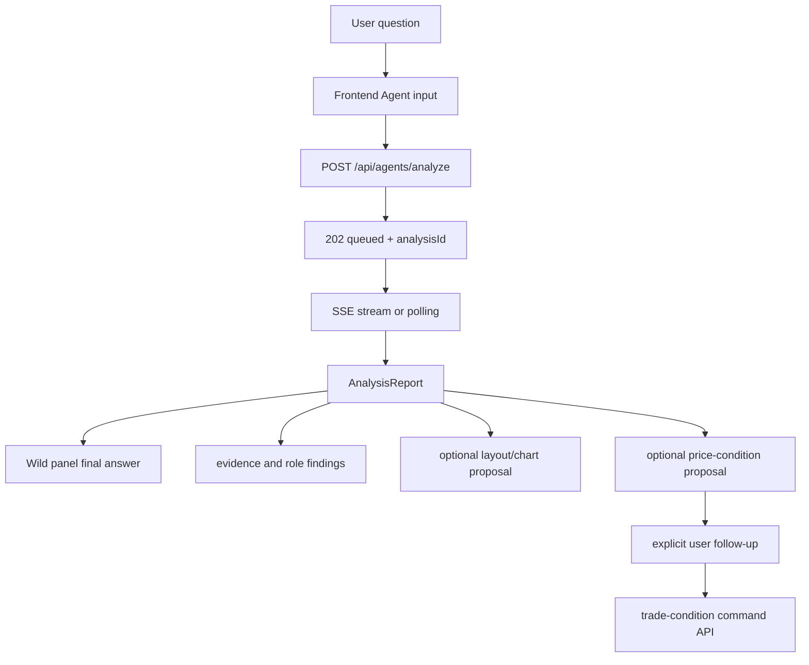

# GOPS Agent Frontend Integration

이 문서는 새 프런트엔드나 기존 `gops-frontend`가 GOPS 에이전트를 붙일 때
지켜야 하는 계약을 정리한다. 백엔드 route와 delivery semantics는
`AGENT_BACKEND_INTEGRATION.md`를 따른다.

## Frontend Role

프런트는 사용자의 질문, 현재 종목, 차트/레이아웃 context를 백엔드에 보내고
`analysisId` 기준으로 report를 렌더링한다.

프런트가 담당하는 것:

- chat input and message context
- current symbol and watch context
- optional `chartContext`
- optional `layoutContext`
- report polling or SSE subscription
- final answer, evidence, role findings rendering
- optional chart/layout proposal preview and apply flow

로컬 시연에서는 상단 LIVE/SIM 토글이 `/api/simulator/*`를 사용한다. SIM 전환 후
5초 속보는 기사 링크만 열 수 있으며 차트를 자동 배치하지 않는다. 주문 패널의
반도체 매도/에너지 매수 바스켓은 사용자가 해당 버튼을 직접 누를 때만 전송하고,
SIM 표시가 있는 주문은 실제 브로커 WebSocket에 연결하지 않는다.
시뮬레이터 상태는 실행 중에만 1초 간격으로 확인하고 LIVE, 일시정지, 완료,
연결 불가 상태에서는 30초 간격으로 낮춘다. 이전 요청이 끝난 뒤 다음 요청을
예약하며, 브라우저 탭이 백그라운드에 있으면 polling을 중단하고 다시 보일 때 즉시
한 번 갱신한다.

`빠른 주문` 패널도 자동 주문 경로가 아니다. 최우선 매수·매도호가, 1틱 오프셋,
estimated order-flow imbalance는 `side + price` 주문 의도를 선택해 편집 가능한 가격 입력란을
채우는 프리셋이다. 사용자는 선택한 가격을 전송 전에 직접 수정할 수 있으며,
사용자가 패널 하단의 주문 전송 버튼을 눌러야만 기존 `POST /api/orders`를 호출한다.
`202` 응답은 접수로 표시하고 체결은 `/ws/orders/{order_id}`의 terminal event로
확인한다. 빠른 주문은 호가 이벤트 시각을 연결 상태 판단 기준으로 사용하지 않는다.
Bid/Ask 구조가 유효하지 않거나 chart WebSocket이 연결 오류 상태이거나 order-flow
미지원 종목일 때만 전송을 비활성화한다. 로컬 SIM의 지정가 체결가는 replay engine 기준이며 실제 지정가
matching을 의미하지 않는다.

일반 주문 ticket과 빠른 주문은 전송 전에 compact `AI 코치 판단 기록` picker를
표시한다. 사용자가 실제로 확인한 항목만 선택하며, UI의 여섯 key는 `RSI`
(`chart.rsi`), `MACD` (`chart.macd`), `거래량` (`chart.volume`), `기업 뉴스`
(`news.company`), `실적·재무` (`fundamentals.earnings`), `시장·섹터`
(`market.context`)다. Submit payload는 여섯 항목 모두를 `checked` 또는
`unchecked`로 명시하는 `decision-checks.v1`을 포함한다. Picker는 주문 성공 뒤에만
초기화하며 실패한 요청에서 사용자의 선택을 잃지 않는다. 프런트는 label, evidence,
source, capture timestamp를 보내지 않으며 서버가 검증·보강한 fill event만 AI 코치
판단 근거로 사용한다.

패널 팔레트의 `가상 빠른 주문`, `가상 주문`, `가상계좌`는 기존 레이아웃에 자동
추가하지 않는다. 두 가상 주문 패널은 KIS 주문 컴포넌트의 형태를 재사용하지만
`/api/paper/*`와 `/ws/paper/*`만 호출하며 LIVE/SIM 토글의 영향을 받지 않는다.
가상 빠른 주문은 `/api/paper/symbols/search`의 전체 활성 미국 주식/ETF를 선택할 수 있고 유효한 bid/ask가
없으면 전송을 비활성화한다. 일반 가상 주문은 호가가 없어도 지정가를 대기 주문으로
접수한다. `가상계좌`는 현금, 평가손익, 보유종목, 미체결 취소, 거래내역을 제공한다.
첫 번째 `예약 매매` 탭은 기존 `/api/trade-conditions` 목록·등록·일시정지·알림·삭제
기능을 가상계좌 표 스타일 안에서 제공하며, 조건 충족 주문은 기존 영구 가상계좌
실행 경로를 그대로 사용한다. 가격 조건 화면은 별도 패널에 중복 표시하지 않는다.
기존 `priceCondition` panel type은 저장된 레이아웃 호환을 위해 유지하되 팔레트 제목은
`알림 설정`이고 알림·관심 기업 설정만 표시한다.

Agent 인증 진입은 상단 global navigation의 `Login` 버튼을 사용한다. 별도 `Agents`
버튼은 표시하지 않으며, 인증 후 하단 Agent 입력을 직접 사용한다. 로컬 Vite DEV에서는
Agent debug가 기본으로 켜지고 분석 prompt를 보내면 request snapshot을 browser
console과 `window.__GOPS_AGENT_LAST_REQUEST__`에 기록한다. `?agentDebug=0`은 해당
브라우저의 localStorage에 opt-out을 저장하고, `?agentDebug=1`은 다시 켠다.
production build에는 debug snapshot을 노출하지 않는다.

프런트가 담당하지 않는 것:

- provider 직접 호출
- Kafka 직접 produce/consume
- ClickHouse/GraphDB 직접 query
- 사용자 확인 없이 분석 결과만으로 주문을 실행하는 자동화

완료 report에 `tradeConditionProposals[]`가 있으면 답변 하단에 가격·방향·지정가·
수량 누락 여부를 표시할 수 있다. 사용자가 이어서 `이 가격에 예약매매랑 알림
걸어줘`처럼 명시적으로 요청한 경우에만 프런트는 가격을 재구성하지 않고
`analysisId`, `proposalId`, 원문 후속 문장을 `POST /api/trade-conditions/commands`로
보낸다. API가 `clarify`를 반환하면 같은 proposal context를 유지해 수량 같은 누락
필드를 받고, `created`일 때만 가상계좌의 예약 매매 탭을 invalidate/refetch한다. 관련
없는 새 분석이 완료되면 이전 proposal context를 폐기한다.

## Chart Derived Profile

차트의 candle Volume Profile은 Agent feature pack과 별도 계약이다. `ChartCanvas`가
현재 viewport로 만든 scene과 visible closed-candle 범위가 일치한 뒤에만 프런트가
`targetBins=10`, `scene.scales.minPrice/maxPrice`, `candleCount`를 요청한다. 따라서
활성 MA·Bollinger와 축 padding을 포함한 main price pane 전체가 같은 화면 높이의
10개 슬롯이 된다. pane 높이만 바뀌면 기존 가격 bucket을 다시 투영하고 재조회하지
않는다.

응답은 10개 bucket, 요청 가격 경계, 요청/source candle count가 모두 일치할 때만
표시한다. `dataStatus=partial`은 클라이언트 derived cache에 넣지 않고 숨긴 상태로
500ms와 1500ms 뒤 두 번 재시도한다. 계속 partial이면 다음 scene, range, candle
변경까지 숨긴다. 0-volume bucket은 응답에 유지하지만 Canvas는 막대를 그리지 않아
그 가격 슬롯의 빈 공간을 보존한다.
## AI 투자 코치

AI 투자 코치의 알람 생성 UI는 4페이지 `실행·알람 관리`에만 둔다. 1페이지의
매도·관찰 조건은 조건명과 현재값·기준값만 보이는 단일 미리보기로 표시한다.
좌우 화살표로 한 조건씩 전환하고 첫·마지막 항목에서는 해당 화살표를 비활성화한다.
활성 항목을 누르면 API를 호출하지 않은 채 4페이지의 같은 후보로 이동해
focus/highlight한다. 유사 사례의 `그때의 실수`, `오늘과 같은 점`, `오늘과 다른 점`도
한 항목씩 같은 방식으로 전환한다. 현재값, 임계값, 연산자, 판단 사유, 추천 행동 같은 상세는
4페이지에서 표시한다. 추천 후보는 `당일 거래에서 제안`, `진입 습관에서 제안`,
`청산 습관에서 제안`, `포트폴리오 위험에서 제안` 네 출처 그룹을 고정 순서로
표시한다. 사용자가 지원되는 후보의 `알람 추가`를 눌렀을 때만 `POST /api/alerts`를
호출하며 RSI·거래량·집중도처럼 현재 alert API가 지원하지 않는 후보는 `미지원`으로
남긴다. 저장된 알람의 출처가 null이면 `출처 기록 없음`으로 표시한다.

1페이지의 여러 당일 체결은 종목명 tab row를 만들지 않고 활성 기업 정보 양옆의
화살표로 전환한다. 현재 거래와 유사 사례도 차트 양옆 화살표로 전환하며 화면에는
carousel 위치 숫자를 반복 표시하지 않는다. 화살표는 별도 좌우 column을 점유하지
않고 콘텐츠 가장자리에 작은 overlay control로 표시하며 비활성 끝점은 숨긴다. 판단
요약은 등급 제목이나 상태색 없이 한 문장으로 크게 표시한다. 확인 항목은 `차트`,
`뉴스`, `재무`, `시장` 순서의 2열 overview로 렌더링하고, 기본 화면에는 분류명, 상태,
최대 두 개 핵심 항목명만 크게 표시한다. 세부 수치·출처·기준시각은 tooltip에 둔다.

2페이지 포트폴리오 탭은 별도 API를 호출하지 않고 받은 report의
`marketDiversification`만 렌더링한다. 현재 섹터 비중과 보유 종목의 시장 연동성은
큰 행으로, 최대 3개의 분산 후보 시장은 가로 rail로 표시한다. 후보는 자동 매수
추천이 아니라 검토 비중 범위이며, 상관 데이터가 없으면 숫자나 일반론적 섹터를
채우지 않고 `시장·섹터 상관 데이터 연결 대기`를 표시한다.

## User Flow



사용자 입력이 회사명/티커 단독이거나 `애플차트 보여줘`, `AAPL chart` 같은
chart-open 명령이면 프런트는 먼저
`GET /api/agents/entities/resolve?mode=chartShortcut`를 호출한다. 응답이
`chartShortcut=true`이고 `chartAction="replace"`이면 기존 chart symbol 선택
흐름만 적용하고 `/api/agents/analyze`는 호출하지 않는다. 응답이
`symbols`를 2개 이상 포함하면 첫 번째 symbol을 기본 chart에 표시하고 나머지는
`POST /api/agents/layout/resolve`의 chart add proposal로 추가한다. 응답이
`chartAction="add"`이면 차트 화면에서는 `chartAction`, `chartTargetSymbol`,
`chartPlacementIntent`, 현재 `layoutContext`를 보내 기존 chart를 유지한 추가
chart panel proposal을 받는다. 차트 화면이 아니면 첫 번째 chart로 진입한 뒤 추가
panel proposal을 적용한다. `엔비디아 뉴스`,
`엔비디아 분석해줘`, `엔비디아 차트 분석해줘`, 관계 질문, chart registry 미지원
symbol은 기존 분석 흐름을 유지한다.

티커 shortcut이 아니면 프런트는 분석 API를 호출하기 전에
`POST /api/agents/layout/resolve`로 UI-only layout command인지 확인한다.
응답이 `status="ui_layout"`이고 `layoutProposal`이 있으면 즉시 적용하고
사용자에게 `summary`만 표시한다. `status="not_ui"`이거나 route가 실패하면
기존 `/api/agents/analyze` 흐름으로 fallback한다.
`status="ui_clarify"`이면 패널/레이아웃 관련 표현은 맞지만 대상이나 동작이
불명확한 것이므로 `/api/agents/analyze`로 fallback하지 않고 `summary`를 상단
Agent 결과 알림으로 표시한다.

## Submit Request

프런트는 최소한 `symbol`, `intent`, `messages`를 보낸다. 가능한 경우 현재 차트와
레이아웃 context도 같이 보낸다.

```json
{
  "symbol": "NVDA",
  "intent": "NVDA랑 AMD 관계랑 최근 뉴스 같이 분석해줘",
  "routerMode": "hybrid",
  "messages": [
    {"role": "user", "content": "NVDA랑 AMD 관계랑 최근 뉴스 같이 분석해줘"}
  ],
  "chartContext": {
    "symbol": "NVDA",
    "interval": "1m",
    "visibleRange": null
  },
  "layoutContext": {
    "activePanelId": "chart-main",
    "panels": []
  },
  "references": [
    {
      "type": "chart.candle",
      "sourcePanelId": "content-chart-1",
      "displayLabel": "NVDA 1D 2026-07-04T00:00:00Z",
      "data": {
        "symbol": "NVDA",
        "interval": "1D",
        "timestamp": "2026-07-04T00:00:00Z",
        "close": 145.5
      }
    }
  ],
  "uiContext": {
    "activePanelId": "content-chart-1",
    "activePanelType": "chart",
    "selectedReference": null,
    "visibleRange": null
  },
  "requestId": "agent-request-client-id",
  "chartAction": null,
  "chartTargetSymbol": null,
  "chartPlacementIntent": null,
  "mode": null,
  "analysisMode": null,
  "priority": null,
  "responseMode": null
}
```

`references`는 사용자가 명시적으로 선택한 화면 객체를 구조화해 보내는 필드다.
차트 봉, 차트 구간, 뉴스 기사, 일자별 뉴스 요약, 온톨로지 노드처럼 사용자가
"이거", "여기", "이 뉴스"라고 가리킬 수 있는 객체를 prompt 문자열로 긁어 넣지
말고 별도 reference로 보낸다. `uiContext`는 현재 active panel, visible range,
selection 같은 화면 상태 hint만 담고, provider 조회나 최종 판단은 백엔드/agent가
수행한다.

현재 `gops-frontend`는 canvas chart의 `SemanticSelectionSnapshot`을
`chart.candle` reference로 보내고, news row 선택을 `news.article` 또는
`news.dailySummary` reference로 보낸다. 사용자가 별도 reference를 선택하지 않아도
`uiContext.selectedReference`/`hoverReference`를 보낼 수 있지만, 명시 선택 chip이나
row selection이 있으면 그것을 우선한다.

Bid/Ask chart type or the 오더플로우 panel can send `chart.orderFlow`
references. The reference data should include the selected symbol/session date,
daily or intraday bid/ask totals when available, and
`sideClassification="estimated"` because Alpaca trade aggressor side is inferred
from trades plus top-of-book quotes.

차트 명령의 v1 fast path는 `ChartCommand[]`로 변환되는 영구 변경과
`AgentVisualOverlay[]` 임시 강조를 분리한다. 예를 들어 선택된 봉 기준 수평선은
drawing command로 저장하고, 해당 봉은 canvas에서 만료 시간이 있는 highlight overlay로
잠깐 표시한다.

Drawing anchor는 pixel이 아니라 canonical `timestamp`/`price`를 사용하고
`logicalIndex`는 현재 candle 배열에서 계산 가능한 보조 cache로만 취급한다.
`horizontalLine`은 수동 작도의 단일 anchor와 Geometry 자산의 동일 가격 2-anchor
접촉 구간을 모두 허용한다. 2-anchor 형식의 각 timestamp도 실제 candle key여야 한다.
지원하는 평행선 계약은 2-anchor `horizontalParallelLines`/`verticalParallelLines`, 3-anchor
`trendParallelLines`이며 추세 평행선의 `parallelLineCount`는 2..10이다. 이벤트 설명은
`flagMarker`의 editable label을 사용한다. `rangeBox`와 평행선 band fill은 candle/지표
아래에서, outline·label·selection handle은 chart layer 위에서 렌더링해야 한다.
추세 평행선은 기준선 기준 `0,+1,-1,+2,-2…` 의미 순서로 확장하고 화면 geometry는
공간 순으로 정렬한다. `riskRewardBox`는 `[entry, stop, target]` 세 anchor를 사용하며
target time은 stop time과 같아야 한다. `fibonacciRetracement`는 두 swing anchor와 고정
레벨 `0, 0.236, 0.382, 0.5, 0.618, 0.786, 1`만 사용한다.
모든 fill은 시각 레이어일 뿐 hit-test 대상이 아니며, selection은 line·outline·handle·label로만
수행한다.

Headers:

```text
Idempotency-Key
X-GOPS-User-Id
```

`Idempotency-Key`는 같은 submit을 중복 클릭하거나 네트워크 retry가 발생했을 때
같은 `analysisId`를 재사용하기 위해 필요하다.

`POST /api/agents/layout/resolve`는 idempotency header를 요구하지 않는다. 이 route는
분석 report 생성이 아니라 현재 layout context에 대한 빠른 proposal 판정이다.

## Response Handling

Async response:

```json
{
  "analysisId": "agent-request-id",
  "status": "queued",
  "status_url": "/api/agents/reports/agent-request-id",
  "stream_url": "/api/agents/reports/agent-request-id/stream",
  "report": {}
}
```

프런트는 `analysisId`를 화면 상태의 primary key로 사용한다. `request_id`가 같이
오면 같은 값으로 취급한다.

완료된 idempotent retry나 compatibility mode에서는 `200`과 completed report가
바로 올 수 있다. 이 경우에도 동일하게 `analysisId` 기준으로 렌더링한다.

## Polling And SSE

권장 순서:

1. `stream_url`이 있으면 `GET /api/agents/reports/{analysis_id}/stream`으로 SSE를 연다.
2. SSE가 끊기거나 지원되지 않으면 `GET /api/agents/reports/{analysis_id}` polling으로 degrade한다.
3. report status가 completed, failed, deep_completed, canceled 같은 terminal state가 되면 loading state를 끝낸다.

프런트는 SSE만 전제로 하면 안 된다. Redis pubsub이나 delivery gateway가 준비되지
않은 환경에서는 polling fallback이 필요하다.

## User Cancellation

분석 대기 중에는 채팅 입력은 계속 잠그되 전송 버튼을 중단 버튼으로 바꾼다.
프런트는 submit 전에 client-generated `requestId`를 만들고 request body에
넣어야 한다. 사용자가 중단하면 현재 fetch/SSE/polling을 `AbortController`로
닫고 `POST /api/agents/reports/{analysis_id}/cancel`을 호출한다.

Cancel 후에는 상단 Agent 결과 알림에 중단됨을 표시하고 입력을 다시 연다. 서버가
`canceled` report를 반환하거나 polling/SSE에서 같은 status를 받으면 terminal로
처리한다. 이미 completed/deep_completed/failed가 도착한 뒤의 cancel 응답은 기존
terminal report를 유지할 수 있다.

## Report Rendering

When present, one `coach-report.v2` is passed from the workspace container into the AI
coach panel. The panel has four pages: (1) today's trade review, (2) habit review with
independent `entry`/`exit`/`portfolio` tabs and `30d`/`90d`/`1y` periods, (3) improvement
priorities, and (4) one action center combining execution experiments, guardrails, and
alert management. Page sections receive props only and never call the analysis API.
Page 2 is a long-term investor-profile view, not an alert surface: it renders the supplied
process/outcome cohorts, repeated patterns, and representative trades without a chart or
per-section fetch. If the report has no decision record, it must show the supplied missing
state rather than infer a personality or plan from realized profit and loss.

On page 1, the selected fill and similar-case index are local UI state. A fill switch
selects one `reviewsByFillId` object so chart, missed checks, outcome, portfolio impact,
and conditions change atomically. Price, volume, RSI, and MACD share the `T-60..T+20`
relative axis, and today's path ends at its latest observation without a forecast.
The dev fixture is loaded only by a DEV-only dynamic import when
`VITE_AI_COACH_DEV_FIXTURE=true`; production has no fixture fallback.

When the workspace does not already supply a `coachReport`, the panel makes one top-level
authenticated request to `GET /api/ai-coach/reports/latest`. Child pages never fetch their
own data. A stored report renders immediately; no stored report renders a clear waiting
state. This keeps the post-market coach independent of Redis report delivery while
preserving the existing polling/SSE contract for interactive agent analysis.

Production report의 decision checklist는 post-market input archive에 실제로 있던
기록만 사용한다. Snapshot Builder가 cutoff-safe chart/news/fundamentals/market
evidence를 tooltip과 chart marker에 보강할 수 있지만 그 evidence가
`checked`/`unchecked`를 바꾸지는 않는다. 기록이 없는 체결은 UI가 임의로
`미확인`으로 채우지 않고 `확인 기록 없음`을 표시한다. Historical cases keep their
own decision-check records; a case switch must not reuse the selected current fill's checks.
Decision evidence is bounded by `decisionAt`, while chart outcomes are anchored at
`filledAt` and stop at the report request cutoff.

Portfolio impact renders only an exact fill-scoped `before`/`after` pair. This applies to
both KIS and paper fills; an adjacent account snapshot is not substituted and the UI shows
`계산되지 않음`. Paper cost-basis pairs remain labeled as acquisition-cost data rather
than current market valuation.

Report에서 우선 렌더링할 영역:

- final answer
- agent answers as detailed evidence after final answer
- status and timestamps
- primary symbol
- evidence items
- role findings
- warnings or no-data provider messages
- optional `layoutProposal`
- optional `chartProposal`
- optional `tradeConditionProposals`

Provider가 `status="no-data"` evidence를 반환하는 것은 정상적인 partial analysis다.
예를 들어 GraphDB가 없으면 ontology evidence만 no-data가 되고 market/news 기반
답변은 계속 표시될 수 있다.

`finalAnswer`가 있으면 `agentAnswers`보다 먼저 렌더링해야 한다. 멀티 에이전트
role 답변이 함께 온 경우에도 사용자 화면의 첫 문장은 `finalAnswer.summary`의 종합
판단이어야 하며, role별 답변은 세부 근거로 뒤에 붙인다.

### Wild Panel Answer Pages

현재 `gops-frontend`에서는 workspace 전체에서 한 panel만 Wild가 될 수 있다. Wild
아이콘은 layout edit mode에서만 panel header에 표시한다. 사용자가 다른 panel의 Wild
아이콘을 누르면 기존 Wild panel은 저장된 answer page를 모두 지우고 fixed panel로
돌아가며 새 panel이 Wild destination이 된다. edit mode를 나가면 아이콘만 숨고 Wild
page와 navigation은 유지된다. Wild panel은 원래 content를 base page로 유지한다.
Wild panel이 있는 동안 완료된 Agent report는 해당 panel의 다음 page로 자동 추가한다.
`AGENT LOG` button과 drawer는 표시하지 않는다. report 완료 시 Wild panel이 없으면
상단의 3초 결과 알림만 표시하고 상세 report를 나중에 연결하기 위해 보관하지 않는다.
자동 panel 생성이나 placement picker는 사용하지 않는다.

저장 순서는 base content, `finalAnswer` 기반 `차트 해설`, role별 `에이전트 답변`이다.
다만 새 report를 추가한 직후에는 사용자가 요청한 Wild UX 예외로 첫 role 답변을
활성화하고, role 답변이 없을 때만 `차트 해설`을 활성화한다. 같은 `analysisId`를
같은 panel에 다시 추가하지 않으며 이미 저장된 첫 role page로 이동한다.

Agent 동작이 끝나면 top navigation의 center preset dock을 한 줄 결과 알림으로
flip한다. 진행 중 메시지는 표시하지 않고 완료·취소·clarification·실패 결과만
표시한다. 분석 결과는 `MSFT 뉴스를 가져왔습니다.`, `MSFT 차트 분석을 완료했습니다.`
처럼 symbol과 action을 사용한 deterministic 문구이며 3초 뒤 preset dock으로 돌아간다.
알림은 display-only `role="status"`이고 새 결과가 오면 기존 알림을 즉시 교체한다.

Wild state와 answer snapshot은 layout localStorage에 저장하고 panel당 최신 report
10개만 유지한다. fixed state로 되돌리면 별도 확인이나 개별 page 삭제 없이 저장된
Wild page를 모두 제거한다. workspace에 Wild panel이 하나뿐이므로 reload 후에도 해당
panel을 report destination으로 자동 복원한다.
Wild answer payload는 backend `layoutContext`에 넣지 않으며 API/report 계약을 바꾸지
않는다. 기존 `chartCommentary` Geometry panel은 base content로서 동작을 그대로
유지하고 Wild 전환만으로 다른 Geometry page를 자동 추가하지 않는다.

## Layout And Chart Proposals

에이전트가 `layoutProposal` 또는 `chartProposal`을 반환할 수 있다. 프런트가
이를 지원하면 preview 후 사용자가 적용하도록 만든다.

현재 `gops-frontend`의 active entrypoint는 `App.tsx`이며 `layoutProposal`만
자동 적용한다. `chartProposal`은 차트 엔진 command path와 별도로 연결해야 하며,
현재 App의 일반 분석 렌더링에서는 사용하지 않는다.

`layout.panel.add`가 chart panel을 추가할 때 payload의 `props.symbol`은 새 chart
instance의 symbol이다. `layout.panel.priority.set`과 `layout.panels.arrange`의
`layoutWeight`는 다음 요청의 `layoutContext`에 보존되어, 직전 요청 panel과 chart
panel이 더 크게 배치되고 낮은 priority support panel은 축소/이동될 수 있다.

Rule-based UI parser는 단일 패널 open/close/move/resize 외에도 tidy, close-all,
resize-all, undo, default restore, swap, relative placement, replace, pin/unpin,
save, panel group open을 `layoutProposal.commands`로 반환한다. 프런트는
`layout.undo`용 최근 agent layout 이력을 유지하고, `layout.panel.pin/unpin`을
slot의 `layoutPinned`에 보존하며, `layout.save`는 현재 layout을 custom preset으로
저장한다. `layout.panels.arrange`가 충돌 때문에 일부 생략되거나 readable span으로
정규화되면 적용 결과의 `appliedWithChanges/reason`을 상단 결과 알림에 표시해야 하며 backend
rationale만으로 성공을 단정하면 안 된다.

UI-only layout 명령이 프런트에 정상 적용되면 symbol-aware 완료 문구를 상단 결과
알림으로 표시한다. `ui_clarify`, `autoApply=false`, undo 이력 없음, placement 선택
필요, 충돌·부분 적용처럼 사용자의 확인이나 조치가 필요한 경우도 같은 알림 영역을
사용하며 placement 후보 적용이 끝나면 완료 문구를 표시한다.

`layoutContext.selectedPanelId`는 "이거", "이 패널", "여기" 같은 지시어의 대상이다.
선택된 패널이 없으면 backend는 임의 패널을 고르지 않고 clarification을 반환한다.
`layoutContext.canUndo`는 "원래대로"가 직전 agent 변경 취소인지 기본 layout
복원인지 결정하는 hint다.

news panel은 `panelType="newsFeed"`와 `props.displayMode="dailySummary"`를
받으면 일자별 요약 전용으로 렌더링한다. 이때 `props.dailySummaries[]`는
`date`, `summary`, `sources[]`를 포함해야 하며, source 항목은 실제 기사
`url`과 링크에 표시할 `title`을 가진다. `priceChange`가 있으면 날짜 옆에
전일 종가 대비 절대 가격 차이를 표시하고, 출처 링크는 요약 아래 `출처` 행의
favicon 아이콘으로 렌더링한다. Redis/ClickHouse 같은 저장소 provenance는 프런트에
표시하는 source 값으로 쓰지 않는다.

market indices panel은 `panelType="marketIndices"`/`kind="indices"`로 표현한다.
현재 `gops-frontend`는 이 패널에서 `GET /api/market/indices`만 호출하며, 차트
panel의 symbol/interval/coverage 상태와 연결하지 않는다. 응답의 `refreshSeconds`,
`cacheStatus`, `warning`, `items[]`를 사용해 자동 새로고침, stale 표시, 행별 가격과
변동률을 렌더링한다.

popular stocks panel은 `panelType="popularStocks"`/`kind="popular"`로 표현한다.
기본 배치와 읽기 가능한 최소 너비는 1 column이며 기본 높이는 2 rows다.
현재 `gops-frontend`는 App이 이미 폴링 중인 `GET /api/market/heatmap?universe=sp500`
items를 패널로 전달해 S&P500 거래대금순 Top10을 렌더링한다. 별도 heatmap 요청은
추가하지 않고, 금액 표시는 `GET /api/market/indices`의 `KRW=X` 환율을 사용해
조원/억원 단위로 환산한다. Top10의 섹터 컬럼은 GraphDB `gops:sector` canonical
값의 `sectorLabelKo` 한글 라벨을 표시하며, 산업명과 섞어 표시하지 않는다.
히트맵/트리맵도 grouping key는 canonical `sector`를 유지하고, 섹터 타일과 hover
표시는 같은 `sectorLabelKo` 한글 라벨을 사용한다.

stock recommendations panel은 `panelType="stockRecommendations"`/`kind="recommendations"`로
표현한다. 패널은 `GET /api/recommendations/stocks/latest`로 마지막 장중 추천을
읽고, 새로고침 버튼은 `POST /api/recommendations/stocks/refresh`에 현재 active
symbol을 보낸다. 필수 투자 설정은 하단 `VI: 설정`의 `추천 설정` 탭에 있는
`PUT /api/recommendations/profile` 폼에서만 받는다. 추천 행 클릭은 차트 symbol
전환까지만 수행하고 주문 실행으로 연결하지 않는다. 추천 행의 섹터도
`sectorLabelKo` 한글 라벨을 사용한다.

chart analysis asset 운영 패널은 `kind="chartAssetOps"`, 화면 표시는
`작도 자산(개발)`로 표현한다. 이름의 `(개발)`은 수동 운영 도구임을 나타내는 라벨일
뿐 표시 게이트가 아니다. 로컬 Vite, Docker production build, 실제 배포 환경 모두
레이아웃 수정 모드의 패널 추가 팔레트에 항상 노출하며 URL query나 localStorage로
숨기지 않는다.

패턴 보유 종목 조회 패널은 `kind="chartPatternList"`, 화면 표시는 `패턴 종목`으로
표현한다. 이 패널은 운영 패널과 분리하며 기존
`GET /api/charts/analysis-assets/coverage` 응답의 `primaryPattern`만 사용한다.
`forming`/`confirmed` 대표 패턴만 종목별로 묶고, 검색과 interval·상태·패턴 종류
필터를 클라이언트에서 적용한다. 빌드 완료·삭제 invalidation event에는 목록을 다시
조회하지만 별도 polling은 하지 않는다. 패턴 항목을 누르면 첫 번째 chart panel의
symbol과 timeframe을 해당 자산 값으로 함께 바꾸며 주문 route는 호출하지 않는다.

Geometry asset은 GET/build/poll route를 사용한다. timed anchor는 현재 interval의
canonical candle timestamp로만 snap하며 대응 봉이 없으면 해당 drawing을 제외한다.
단, Geometry 지지·저항 `horizontalLine`은 가격 자체가 핵심인 무한 수평선이므로
저장된 과거 접촉 봉이 아직 차트에 로드되지 않았으면 현재 로드된 첫·마지막 canonical
candle timestamp에 presentation anchor를 투영해 즉시 표시한다. PostgreSQL 원본
접촉 timestamp는 변경하지 않으며 패턴 경계의 timed anchor에는 이 예외를 적용하지 않는다.
패널은 `1m/5m/10m/1h/4h/1D/1W`를 지원하고 지지·저항, 삼각형·깃발형·페넌트·
직사각형·쐐기·채널 이탈 패턴, coverage,
SMA60·SMA120과 최근 교차 상태를 표시한다. Geometry 토글 하나가 모든 자동 작도를
제어하며 패턴 선은 실선, forming은 낮은 불투명도로 표현한다. 새 자산은
`primaryPattern`을 우선 표시하고 기존 geometry 자산은 `primaryTriangle`로 호환한다.
기존 7개 interval 자산은 계속 표시할 수 있지만 새 빌드 선택지는 `1m/1D` 두 개뿐이며
둘 다 기본 선택한다. 동일 실행 중 요청에 합쳐진 경우 이를 안내하고 polling은 기존
job URL을 사용한다. 상태 화면은 수동 우선 작업과 정기 작업을 구분해 표시한다.
`tradePlan.action`이 `buy_candidate`이면 확인 봉의 `flagMarker`와
`[entry, stop, target]` 순서의 `riskRewardBox`를 함께 적용한다. long-only 기본값의
`sell_candidate`는 청산 의미의 `flagMarker`만 적용하며 공매도 박스를 만들지 않는다.
손익비가 기준 미만인 `no_trade`와 미확정 `watch`는 매매 도형을 만들지 않는다.
박스의 Entry는 실제 확인 봉 timestamp를 사용하고 Stop/Target의 미래 끝점은 자산에
저장하지 않는 logical index 투영만 사용해 가짜 candle timestamp를 만들지 않는다.
이 표시는 교육용 시나리오이며 주문 route를 호출하지 않는다.

SMA 기간은 일수가 아니라 현재 interval의 완료 봉 개수다. SMA60과 SMA120 overlay는
Geometry 자산 적용 시 함께 활성화하고 골든·데드크로스는 별도 marker가 아닌 metadata로
표시한다. 빌드 완료와 삭제는 cache invalidation event를 발생시켜 같은 symbol의 열린
chart/panel을 즉시 재조회한다. 다른 interval의 자산은 적용하지 않는다.

stale 자산은 차트에서 제거하지 않고 낮은 불투명도와 stale badge로 표시한다. 빌드
상태, log, repair 집계는 PostgreSQL polling 응답을 사용하며 SSE와 Redis pub/sub은
사용하지 않는다.

지원하지 않는 경우 정책:

```text
text analysis flow는 유지한다.
layoutProposal/chartProposal은 명시적으로 ignore한다.
ignore한 proposal 때문에 report 자체를 실패 처리하지 않는다.
```

차트 조작은 프런트/차트 엔진의 command contract를 따라야 하며, 에이전트
provider가 직접 UI panel command를 만들면 안 된다.

## Responsive Workspace Layout

`gops-frontend`의 workspace 좌표 계약은 `8 cols x 6 rows`로 유지한다. 화면 폭에
따라 열/행 개수를 연속적으로 바꾸지 않는다. 저장 preset과 agent
`layoutContext.grid`, `placement.col/row/colSpan/rowSpan`이 같은 좌표계를 공유하기
때문이다.

화면 대응은 좌표 개수 변경이 아니라 다음 세 단계 presentation mode로 처리한다.

```text
wide     충분한 셀 크기, 기존 배치 그대로 사용
standard 읽기 가능한 셀 크기, 기존 배치와 panel container query 사용
compact  셀을 더 축소하지 않고 최소 160x110 rendered px를 보장하며 workspace scroll 허용
```

`panelRegistry.ts`는 저장 계약용 `minSpan`과 실제 UI 가독성용
`readableMinSpan`/`minSizePx`를 분리한다. 새 패널 추가, 직접 resize, agent layout
proposal 적용에는 `readableMinSpan`을 사용한다. 예전 저장 layout은 기존 좌표를
복원할 수 있어야 하므로 `minSpan`은 하위 호환 검증 경계로 남긴다.

각 panel frame은 size container다. 좁거나 낮은 패널은 container query로 제목과
padding을 줄이고, non-chart panel body는 필요한 경우 내부 scroll로 degrade한다.
전체 app의 `uiScale`은 layout metric에 전달되어 rendered pixel minimum과 logical
workspace 좌표를 변환한다.

## Alert WebSocket

`WS /ws/agent-alerts`는 notification publisher가 Redis에 publish한 alert를
프런트에 전달하는 bridge다.

active App의 `BottomCommandBar`는 persisted notification용 `WS /ws/notifications`와
broadcast agent alert용 `WS /ws/agent-alerts`를 함께 구독하고 하나의 toast queue로
정규화한다. `NotificationPreferencesProvider`가 `/api/notification-preferences`에서
읽은 전체/유형별/기업별 설정을 새 toast와 이미 대기 중인 toast에 모두 적용한다.
설정을 꺼도 알림 이력과 unread count는 그대로 유지된다.

프런트는 alert를 다음처럼 취급한다.

- market-event explanation 또는 notification decision으로 표시한다.
- 주문 실행으로 자동 연결하지 않는다.
- 사용자가 보고 확인할 수 있는 UI action으로만 이어간다.

`알림 설정` 패널의 `알림` 탭은 사용자 알림 바 설정을 저장한다. 현재 지원되는
본장 시작, 목표가 도달, 급등락, 거래량 급증 및 관심기업별 gate만 조작할 수 있고,
생성 producer가 아직 없는 항목은 `준비 중`으로 비활성화한다. 가격 조건 행의
개별 알림 토글은 별도의 condition delivery 상태이며 서버 감시와 예약 주문 실행
여부도 분리한다. 패널 목록은 `/api/trade-conditions`가 source of truth이고 브라우저
event는 refetch invalidation 용도로만 쓴다.

## Frontend Reference Files

기존 구현을 참고할 때 볼 파일:

```text
apps/gops-frontend/src/App.tsx
apps/gops-frontend/src/agent/agentAnalysisClient.ts
apps/gops-frontend/src/agents/agentAnalysis.ts
apps/gops-frontend/src/components/BottomCommandBar.tsx
apps/gops-frontend/src/components/IndexPanel.tsx
apps/gops-frontend/src/layout/agentLayoutTypes.ts
apps/gops-frontend/src/layout/panelLayout.ts
apps/gops-frontend/src/layout/tiledAgentLayout.ts
apps/gops-frontend/src/market/indicesApi.ts
apps/chart-engine/src/agentReference.ts
apps/chart-engine/src/agentChat.ts
apps/chart-engine/src/proposals.ts
apps/chart-engine/src/types.ts
```

새 프런트는 위 구현을 그대로 가져올 필요는 없다. 보존해야 하는 것은 request
shape, `analysisId` 처리, report delivery, proposal ignore/apply 정책이다.

## Frontend Acceptance

```text
사용자가 종목 질문을 보낸다.
회사명/티커 또는 chart-open 명령을 입력하면 entity resolve shortcut으로 차트 symbol만 바뀐다.
분석 요청이면 POST /api/agents/analyze가 호출된다.
queued response의 analysisId가 화면 상태에 저장된다.
SSE 또는 polling으로 completed report를 받는다.
사용자가 중단하면 cancel route가 호출되고 canceled 상태로 loading state가 끝난다.
final answer와 evidence가 렌더링된다.
no-data provider message가 전체 실패로 처리되지 않는다.
layout/chart proposal 미지원 환경에서도 text analysis는 깨지지 않는다.
```
