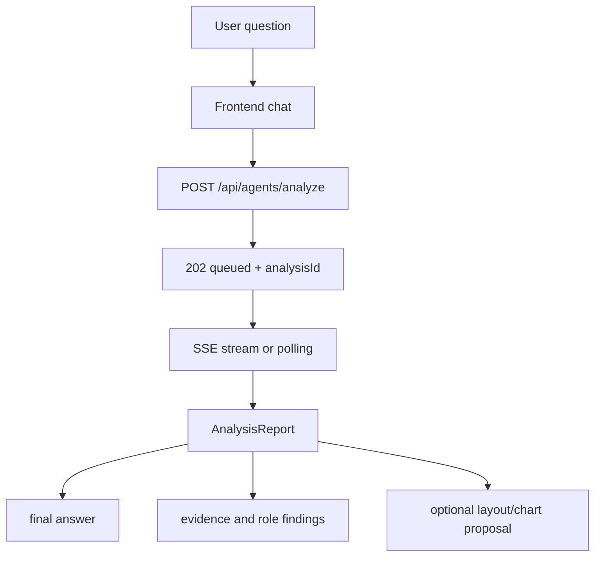

# GOPS Agent Frontend Integration

이 문서는 새 프런트엔드나 기존 `gops-frontend`가 GOPS 에이전트를 붙일 때
지켜야 하는 계약을 정리한다. 백엔드 route와 delivery semantics는
`AGENT_BACKEND_INTEGRATION.md`를 따른다.

## Frontend Role

프런트는 사용자의 질문, 현재 종목, 차트/레이아웃 context를 백엔드에 보내고
`analysisId` 기준으로 report를 렌더링한다.

프런트가 담당하는 것:

- chat input and message context
- current symbol and watch context
- optional `chartContext`
- optional `layoutContext`
- report polling or SSE subscription
- final answer, evidence, role findings rendering
- optional chart/layout proposal preview and apply flow

프런트가 담당하지 않는 것:

- provider 직접 호출
- Kafka 직접 produce/consume
- ClickHouse/GraphDB 직접 query
- 주문 실행 자동화

## User Flow



사용자 입력이 회사명/티커 단독이거나 `애플차트 보여줘`, `AAPL chart` 같은
chart-open 명령이면 프런트는 먼저
`GET /api/agents/entities/resolve?mode=chartShortcut`를 호출한다. 응답이
`chartShortcut=true`이고 `chartAction="replace"`이면 기존 chart symbol 선택
흐름만 적용하고 `/api/agents/analyze`는 호출하지 않는다. 응답이
`symbols`를 2개 이상 포함하면 첫 번째 symbol을 기본 chart에 표시하고 나머지는
`POST /api/agents/layout/resolve`의 chart add proposal로 추가한다. 응답이
`chartAction="add"`이면 차트 화면에서는 `chartAction`, `chartTargetSymbol`,
`chartPlacementIntent`, 현재 `layoutContext`를 보내 기존 chart를 유지한 추가
chart panel proposal을 받는다. 차트 화면이 아니면 첫 번째 chart로 진입한 뒤 추가
panel proposal을 적용한다. `엔비디아 뉴스`,
`엔비디아 분석해줘`, `엔비디아 차트 분석해줘`, 관계 질문, chart registry 미지원
symbol은 기존 분석 흐름을 유지한다.

티커 shortcut이 아니면 프런트는 분석 pending 메시지를 띄우기 전에
`POST /api/agents/layout/resolve`로 UI-only layout command인지 확인한다.
응답이 `status="ui_layout"`이고 `layoutProposal`이 있으면 즉시 적용하고
사용자에게 `summary`만 표시한다. `status="not_ui"`이거나 route가 실패하면
기존 `/api/agents/analyze` 흐름으로 fallback한다.
`status="ui_clarify"`이면 패널/레이아웃 관련 표현은 맞지만 대상이나 동작이
불명확한 것이므로 `/api/agents/analyze`로 fallback하지 않고 `summary`를 채팅에
표시한다.

## Submit Request

프런트는 최소한 `symbol`, `intent`, `messages`를 보낸다. 가능한 경우 현재 차트와
레이아웃 context도 같이 보낸다.

```json
{
  "symbol": "NVDA",
  "intent": "NVDA랑 AMD 관계랑 최근 뉴스 같이 분석해줘",
  "routerMode": "hybrid",
  "messages": [
    {"role": "user", "content": "NVDA랑 AMD 관계랑 최근 뉴스 같이 분석해줘"}
  ],
  "chartContext": {
    "symbol": "NVDA",
    "interval": "1m",
    "visibleRange": null
  },
  "layoutContext": {
    "activePanelId": "chart-main",
    "panels": []
  },
  "requestId": "agent-request-client-id",
  "chartAction": null,
  "chartTargetSymbol": null,
  "chartPlacementIntent": null,
  "mode": null,
  "analysisMode": null,
  "priority": null,
  "responseMode": null
}
```

Headers:

```text
Idempotency-Key
X-GOPS-User-Id
```

`Idempotency-Key`는 같은 submit을 중복 클릭하거나 네트워크 retry가 발생했을 때
같은 `analysisId`를 재사용하기 위해 필요하다.

`POST /api/agents/layout/resolve`는 idempotency header를 요구하지 않는다. 이 route는
분석 report 생성이 아니라 현재 layout context에 대한 빠른 proposal 판정이다.

## Response Handling

Async response:

```json
{
  "analysisId": "agent-request-id",
  "status": "queued",
  "status_url": "/api/agents/reports/agent-request-id",
  "stream_url": "/api/agents/reports/agent-request-id/stream",
  "report": {}
}
```

프런트는 `analysisId`를 화면 상태의 primary key로 사용한다. `request_id`가 같이
오면 같은 값으로 취급한다.

완료된 idempotent retry나 compatibility mode에서는 `200`과 completed report가
바로 올 수 있다. 이 경우에도 동일하게 `analysisId` 기준으로 렌더링한다.

## Polling And SSE

권장 순서:

1. `stream_url`이 있으면 `GET /api/agents/reports/{analysis_id}/stream`으로 SSE를 연다.
2. SSE가 끊기거나 지원되지 않으면 `GET /api/agents/reports/{analysis_id}` polling으로 degrade한다.
3. report status가 completed, failed, deep_completed, canceled 같은 terminal state가 되면 loading state를 끝낸다.

프런트는 SSE만 전제로 하면 안 된다. Redis pubsub이나 delivery gateway가 준비되지
않은 환경에서는 polling fallback이 필요하다.

## User Cancellation

분석 대기 중에는 채팅 입력은 계속 잠그되 전송 버튼을 중단 버튼으로 바꾼다.
프런트는 submit 전에 client-generated `requestId`를 만들고 request body에
넣어야 한다. 사용자가 중단하면 현재 fetch/SSE/polling을 `AbortController`로
닫고 `POST /api/agents/reports/{analysis_id}/cancel`을 호출한다.

Cancel 후에는 pending 메시지를 중단됨으로 바꾸고 입력을 다시 연다. 서버가
`canceled` report를 반환하거나 polling/SSE에서 같은 status를 받으면 terminal로
처리한다. 이미 completed/deep_completed/failed가 도착한 뒤의 cancel 응답은 기존
terminal report를 유지할 수 있다.

## Report Rendering

Report에서 우선 렌더링할 영역:

- final answer
- status and timestamps
- primary symbol
- evidence items
- role findings
- warnings or no-data provider messages
- optional `layoutProposal`
- optional `chartProposal`

Provider가 `status="no-data"` evidence를 반환하는 것은 정상적인 partial analysis다.
예를 들어 GraphDB가 없으면 ontology evidence만 no-data가 되고 market/news 기반
답변은 계속 표시될 수 있다.

## Layout And Chart Proposals

에이전트가 `layoutProposal` 또는 `chartProposal`을 반환할 수 있다. 프런트가
이를 지원하면 preview 후 사용자가 적용하도록 만든다.

현재 `gops-frontend`의 active entrypoint는 `App.tsx`이며 `layoutProposal`만
자동 적용한다. `chartProposal`은 차트 엔진 command path와 별도로 연결해야 하며,
현재 App의 일반 분석 렌더링에서는 사용하지 않는다.

`layout.panel.add`가 chart panel을 추가할 때 payload의 `props.symbol`은 새 chart
instance의 symbol이다. `layout.panel.priority.set`과 `layout.panels.arrange`의
`layoutWeight`는 다음 요청의 `layoutContext`에 보존되어, 직전 요청 panel과 chart
panel이 더 크게 배치되고 낮은 priority support panel은 축소/이동될 수 있다.

news panel은 `panelType="newsFeed"`와 `props.displayMode="dailySummary"`를
받으면 일자별 요약 전용으로 렌더링한다. 이때 `props.dailySummaries[]`는
`date`, `summary`, `sources[]`를 포함해야 하며, source 항목은 실제 기사
`url`과 링크에 표시할 `title`을 가진다. `priceChange`가 있으면 날짜 옆에
전일 종가 대비 절대 가격 차이를 표시하고, 출처 링크는 요약 아래 `출처` 행의
favicon 아이콘으로 렌더링한다. Redis/ClickHouse 같은 저장소 provenance는 프런트에
표시하는 source 값으로 쓰지 않는다.

market indices panel은 `panelType="marketIndices"`/`kind="indices"`로 표현한다.
현재 `gops-frontend`는 이 패널에서 `GET /api/market/indices`만 호출하며, 차트
panel의 symbol/interval/coverage 상태와 연결하지 않는다. 응답의 `refreshSeconds`,
`cacheStatus`, `warning`, `items[]`를 사용해 자동 새로고침, stale 표시, 행별 가격과
변동률을 렌더링한다.

popular stocks panel은 `panelType="popularStocks"`/`kind="popular"`로 표현한다.
현재 `gops-frontend`는 App이 이미 폴링 중인 `GET /api/market/heatmap?universe=sp500`
items를 패널로 전달해 S&P500 거래대금순 Top10을 렌더링한다. 별도 heatmap 요청은
추가하지 않고, 금액 표시는 `GET /api/market/indices`의 `KRW=X` 환율을 사용해
조원/억원 단위로 환산한다.

지원하지 않는 경우 정책:

```text
text analysis flow는 유지한다.
layoutProposal/chartProposal은 명시적으로 ignore한다.
ignore한 proposal 때문에 report 자체를 실패 처리하지 않는다.
```

차트 조작은 프런트/차트 엔진의 command contract를 따라야 하며, 에이전트
provider가 직접 UI panel command를 만들면 안 된다.

## Alert WebSocket

`WS /ws/agent-alerts`는 notification publisher가 Redis에 publish한 alert를
프런트에 전달하는 bridge다.

현재 active App에는 alert WebSocket consumer가 붙어 있지 않다. 알림 UI를 붙일 때
이 route를 사용하고, 그 전까지 agent 분석/레이아웃 흐름과 섞지 않는다.

프런트는 alert를 다음처럼 취급한다.

- market-event explanation 또는 notification decision으로 표시한다.
- 주문 실행으로 자동 연결하지 않는다.
- 사용자가 보고 확인할 수 있는 UI action으로만 이어간다.

## Frontend Reference Files

기존 구현을 참고할 때 볼 파일:

```text
apps/gops-frontend/src/App.tsx
apps/gops-frontend/src/agent/agentAnalysisClient.ts
apps/gops-frontend/src/agents/agentAnalysis.ts
apps/gops-frontend/src/components/BottomCommandBar.tsx
apps/gops-frontend/src/components/IndexPanel.tsx
apps/gops-frontend/src/layout/agentLayoutTypes.ts
apps/gops-frontend/src/layout/panelLayout.ts
apps/gops-frontend/src/layout/tiledAgentLayout.ts
apps/gops-frontend/src/market/indicesApi.ts
apps/chart-engine/src/agentReference.ts
apps/chart-engine/src/agentChat.ts
apps/chart-engine/src/proposals.ts
apps/chart-engine/src/types.ts
```

새 프런트는 위 구현을 그대로 가져올 필요는 없다. 보존해야 하는 것은 request
shape, `analysisId` 처리, report delivery, proposal ignore/apply 정책이다.

## Frontend Acceptance

```text
사용자가 종목 질문을 보낸다.
회사명/티커 또는 chart-open 명령을 입력하면 entity resolve shortcut으로 차트 symbol만 바뀐다.
분석 요청이면 POST /api/agents/analyze가 호출된다.
queued response의 analysisId가 화면 상태에 저장된다.
SSE 또는 polling으로 completed report를 받는다.
사용자가 중단하면 cancel route가 호출되고 canceled 상태로 loading state가 끝난다.
final answer와 evidence가 렌더링된다.
no-data provider message가 전체 실패로 처리되지 않는다.
layout/chart proposal 미지원 환경에서도 text analysis는 깨지지 않는다.
```
