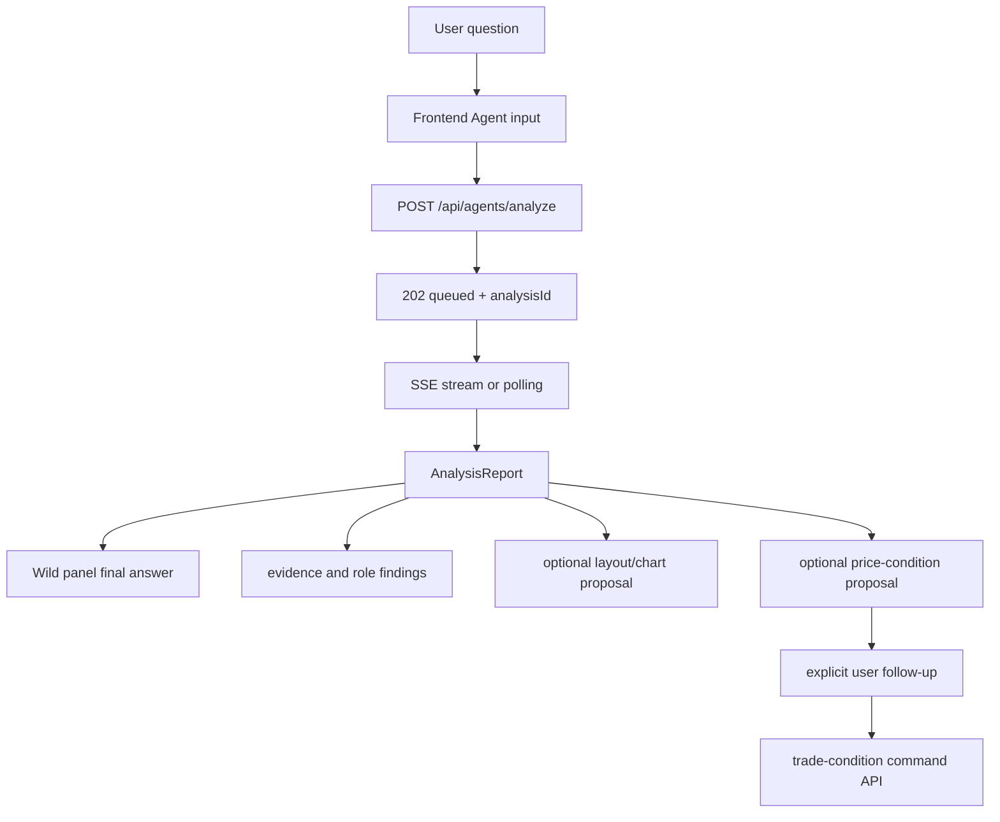

# GOPS Agent Frontend Integration

이 문서는 새 프런트엔드나 기존 `gops-frontend`가 GOPS 에이전트를 붙일 때
지켜야 하는 계약을 정리한다. 백엔드 route와 delivery semantics는
`AGENT_BACKEND_INTEGRATION.md`를 따른다.

## 통합 추천 탐색 패널 (현재 계약)

`recommendations`와 `recommendationsList`는 같은 S&P 500 탐색 컴포넌트를 사용한다.
패널은 `추천 / 인기 Top 15 / 급등주 / 거래대금 / 전체 종목`의 서로 배타적인 목록 모드를 제공한다. 추천 모드만
활성 프로필의 실제 적용 점수(`customRankScore`, 없으면 canonical `score`)를 표시하며
점수가 계산된 전체 종목을 내림차순으로 노출하고 임의의 Top N으로 자르지 않는다.
인기 Top 15는 `sessionDollarVolume` 상위 15종목이며 별도 인기 점수를 만들지 않는다.
급등주는 양의 등락률 내림차순, 거래대금은
`sessionDollarVolume` 내림차순이다. 거래대금이나 급등 정도를 별도 점수로 환산하거나
추천 점수와 합치지 않는다. 전체 종목은 전체 S&P 500을 티커순으로 제공한다. 검색, 등락 방향,
섹터와 모든 수치 지표 필터는 추천·인기 Top 15·급등주·거래대금·전체 종목에 공통으로 표시하고
적용한다. 선택한 필터는 목록 모드를 전환해도 유지하며, 각 모드는 기존 유니버스와 정렬 기준만
독립적으로 유지한다. 추천 API 실패 시에도 급등주와
거래대금 목록 및 시장 검색은 유지한다.

패널 상단의 `추천 로직 설정`은 목록과 같은 레벨의 패널 내부 탭이다. 설정 제목부터 가중치 편집기까지 페이지 전체가 하나의 세로 스크롤 영역을 사용한다. overlay, dialog,
side rail 또는 장전/본장 selector를 만들지 않는다. 로직 탭은 활성 점수 프로필과 여섯
근거 블록, 실제 세부 지표 및 포트폴리오 적합도 가중치는 캔버스가 아닌 직접 조작형
비중 믹서로 표시한다. 상단 누적 바는 전체 100% 배분을 즉시 보여주고, 아래의 모든
신호 카드는 신호 비중과 세부 지표 slider·숫자 입력을 한 화면에 펼친다. 한 값을
바꾸면 같은 그룹의 나머지 활성 값이 자동 재배분된다. 모멘텀·균형·안정은 편집하거나 직접 활성화하는
프로필 탭이 아니라 새 로직에 불러오는 읽기 전용 시작 프리셋이다. 저장된 사용자
로직만 `내 로직` 목록에 표시한다. 사용자는 신호와 지표를 바로 추가·제거하고 slider와 숫자
입력으로 비중을 편집한다. 프리셋을 불러오면 사용자 로직 초안으로 전환되며, 한 항목을 바꾸면 같은 그룹의
나머지 활성 항목을 비례 재배분해 합계 100%를 유지한다. 저장·활성화하면 종목 목록
탭으로 돌아가 새 profile revision으로 계산한 추천을 다시 읽는다.
선택한 시작 프리셋과 사용자 로직은 흰색 채움과 검은 글자로 표시한다. 전체 비중 막대는
초기 파랑·초록·주황·분홍·보라·청록 신호 팔레트를 패널 배경과 섞은 저채도 색상으로 표시한다.
`내 로직`에는 자연어 요청 입력과 `AI 제안` 버튼을 둔다. 제안 카드는 상위 블록 비중만
간결하게 표시하고 hover/focus에서는 검색 의도와 최신 evidence/news를 바탕으로 만든 한국어
두 문장만 표시한다. 원문 snapshot 수치, 기술 key, 뉴스 제목 목록은 노출하지 않는다. `초안에 적용` 전에는 현재 선택·저장·활성 프로필을 바꾸지 않으며, 적용 후에도 기존
가중치 편집기에서 검토한 뒤 `저장` 또는 `저장하고 추천 재계산`을 눌러야 반영된다.
입력창 아래에는 지원하는 신호 조합을 사용한 짧은 쿼리 예시를 두고, 선택하면 입력창에 채운다.

모든 목록 모드는 추천점수·RSI(14)·공시 EPS 기반 PER·PBR·ROE·부채비율·영업이익률·
FCF 마진·거래대금과 등락 방향·섹터 필터를 공통으로 제공한다. 활성화한 범위끼리는
AND이며 값이 없는 종목은 해당 범위에서 제외한다. RSI는 heatmap 생성 시
완료 일봉 15개를 batch 조회한 값이고, 재무 비율은 API가 제공한 point-in-time 공시
필드에서만 계산한다.
추천종목·추천분석 기본 레이아웃은 추천 목록과 차트를 좌우로 배치하며, 목록의 어느 모드에서든
종목 행을 선택하면 흰색 선택 상태와 함께 가장 가까운 차트 패널의 symbol을 즉시 갱신한다.

`popular` panel/palette는 제거됐다. 저장 레이아웃의 단독 `popular`는 같은 위치의
`recommendationsList`의 거래대금 모드(`initialPopular=true`)로 변환하고, 기존 추천 패널과 함께 있으면
옛 인기 패널만 제거한다. Agent의 `popularStocks` 명령은 동일한 호환 변환을 사용한다.
목록 헤더는 별도 `사용자/시장` 그룹 없이 `추천 / 인기 Top 15 / 급등주 / 거래대금 / 전체 종목`만 표시한다. 모드명과
결과 개수를 반복하는 별도 보조 행은 표시하지 않는다. 필터
접기 제목은 `필터 ›`이며 모든 모드에 같은 상세 조건을 표시한다. 행은 기업 식별,
현재가, 등락률, 거래대금, 시가총액, 섹터를 표시하고 추천·인기 Top 15·급등주·거래대금 모드에는 현재 정렬 결과 기준
순위를 맨 앞에 추가한다. 전체 종목만 순위 없이 표시하며 거래 비율이나 거래량 보조 수치는 넣지 않는다.
모든 행의 순위·로고·기업명·섹터는 각 컬럼의 왼쪽 축에 맞추고, 현재가·등락률·거래대금·시가총액은
고정된 숫자 열의 오른쪽 축에 맞춘다. 추천 점수는 마지막 열 끝에 둔다. 별도 `추천 선택`
버튼은 없으며 행 클릭 자체가 선택/해제다. 선택 행은 흰색으로 표시되고 화면을
차트분석으로 자동 전환하지 않는다. 추천 행 선택은 `recommendation.stock` Agent 참조와
동기화하고 시장 행 선택은 패널 로컬 선택으로 유지한다.
추천 점수는 흰색 알약과 검은 글자로 표시하고, 점수 hover/focus에는 응답의 실제 적용 블록
점수와 비중 및 포트폴리오 적합도를 표시한다. 값이 없는 구형 응답에는 임의 점수를 만들지 않는다.

## Frontend Role

프런트는 사용자의 질문, 현재 종목, 차트/레이아웃 context를 백엔드에 보내고
`analysisId` 기준으로 report를 렌더링한다.

프런트가 담당하는 것:

- chat input and message context
- current symbol and watch context
- optional `chartContext`
- optional `layoutContext`
- report polling or SSE subscription
- final answer, evidence, role findings rendering
- optional chart/layout proposal preview and apply flow

`stockRecommendationExplain` 레이아웃 패널은 프런트 전용 추천 해설 surface다.
`recommendationExplain` kind로 5×4 기본 span을 사용하고 추천 latest 응답의
action, decision, sizing, key evidence, 점수와 설명을 읽는다. 별도 report를 만들거나
주문을 실행하지 않는다.

상단 LIVE/SIM 컨트롤은 `2026-07-15 KST` 실제 틱 replay를 제어한다. 시작 스크립트가
연결을 준비한 `LIVE/idle` 상태에서도 플레이 버튼을 표시한다. 사용자가 플레이를 누르면
`start` action 하나로 새 run을 준비하고 즉시 `running`으로 전환한다. KST 가상시각·진행률·요청 배속·실효
배속과 `재생/일시정지/재시작`을 표시한다. 배속은 `1·5·20·60·300×`이고 서버 status를
진실의 원천으로 사용한다. 진행 중인 차트 봉의 남은 시간도 LIVE에서는 실제 시각,
SIM에서는 status의 `virtualTime`과 `effectiveSpeed`를 사용하며 일시정지 중에는 함께
멈춘다. SIM 전환은 사용자가 보고 있는 화면을 강제로 바꾸지 않는다. 증시지도를 보고
있다면 전체 LIVE universe 대신 replay manifest의 23종목만 표시하고, status의 replay
가격과 dataset 첫 체결가 기준 등락률을 해당 타일에 반영한다. 새 run에서는 이전 run의
가격·등락률을 재사용하지 않는다. phase, 합성 news, basket UI는 없다.

상태는 실행 중 1초, LIVE·ready·paused·completed·연결 불가에서는 30초 간격으로
확인한다. 이전 요청이 끝난 뒤 다음 요청을 예약하고 숨겨진 브라우저 탭에서는 polling을
멈춘다. `mode` 또는 `runId`가 바뀌면 analysis/derived request cache, 차트 런타임,
WebSocket 컴포넌트, 포트폴리오 snapshot을 초기화한다. 이 규칙은 LIVE 전환뿐 아니라
SIM 재시작에도 적용되어 이전 실행의 미래 봉이 남지 않게 한다.

SIM 검색·주문 후보는 manifest의 23개 티커만 사용한다. 주문 ticket은 SIM에서
`market|limit`을 제공하고 market은 price를 보내지 않는다. LIVE KIS 화면은 기존
limit-only 계약을 유지한다. 주문 상태는 `/ws/orders/{order_id}`의 SIM 원장을 읽고,
가격조건 UI는 기존 `/api/trade-conditions`를 그대로 사용한다.

기사 뉴스 패널은 LIVE에서 `/api/market/news/daily`, SIM에서
`/api/market/news/latest`를 호출한다. 데일리 뉴스 키워드 패널은 LIVE/SIM 모두
`/api/market/news/daily`를 호출한다. SIM 응답은 서버가 ClickHouse에서
기사의 `published_at`과 `localized_at`, 일별 요약의 `generated_at`을 각각
`virtualTime` 이하로 제한한 결과이며, 프런트가 가상시각을 query로 보내거나 live Redis
결과와 합치지 않는다. 일별 뉴스 API와
차트의 `GET /api/charts/events`도 `generated_at <= virtualTime`인 저장 스냅샷만
반환한다. 추천 패널은 SIM 전 구간에서 기존 recommendation API를 다시 조회하고 서버가
번들된 검증 fixed replay provider를 사용하므로 `simulation_data_unavailable`을 표시하지 않는다.
서버는 활성 SIM `runId`와 시각이 검증된 최신 paper
portfolio로 추천을 다시 계산할 수 있으며, 프런트는 계좌와 추천 item을 직접 합치지 않는다.
차트 자동 작도는 현재 symbol과 interval을
`GET /api/charts/analysis-assets`에 보내며, 서버가 replay cursor까지의 실제 완료 봉으로
만든 비영속 Geometry 자산만 표시한다. 저장된 자산의 `asOf`가 cursor보다 미래이면
표시하지 않는다. 기업정보 등 point-in-time 데이터가 없는 나머지 기능은 기존 최신값이나
fixture를 남기지 않고 `simulation_data_unavailable` 상태를 표시한다. AI 투자 코치는
예외로, LIVE에서 선택된 동일한 계좌 리포트를 SIM 전환 뒤에도 유지하며 시뮬레이션
모드만을 이유로 숨기거나 다른 리포트로 교체하지 않는다. 프런트는 합성
추천·뉴스·AI 보고서를 만들지 않는다. 차트는 서버가 반환한
과거+replay candle과 replay WebSocket만 사용한다.

Order Flow 패널과 Bid/Ask 차트는 SIM에서 기존 intraday API와
`/ws/charts?orderFlow=true`를 사용한다. 캐시는 `mode + datasetId + runId + virtual NY
date + symbol`로 격리하고 mode/run 변경 시 폐기한다. 새 `sessionDate`가 오면 이전
minute map을 먼저 비우며, Bid/Ask 캔들은 해당 세션의 정규장 구간만 표시한다.
오더플로우 조회 실패는 빈 데이터가 아니라 명시적 error 상태로 렌더링한다.

차트의 실적·뉴스 DOM 마커는 Canvas scene 좌표를 chart container의 local 좌표로
환산하고 대응 봉의 x 중심을 그대로 사용한다. 같은 봉의 여러 이벤트는 좌우로 벌리지
않고 세로로 쌓아 UI scale·pan·zoom 중에도 봉과 시간축에서 분리되지 않게 한다.
마커 상세는 chart 밖 body portal에 표시하되 viewport 안에서 위·아래 공간을 비교해
배치한다. 실적 카드는 EPS 서프라이즈와 실제·예상치를, 뉴스 카드는 영향·일별 요약·
핵심 포인트·원문 링크를 우선 표시한다. API에 없는 매출이나 재무 수치는 보간하거나
생성하지 않으며 작은 화면에서는 하단 sheet로 전환한다.

`빠른 주문` 패널도 자동 주문 경로가 아니다. 최우선 매수·매도호가, 1틱 오프셋,
estimated order-flow imbalance는 `side + price` 주문 의도를 선택해 편집 가능한 가격 입력란을
채우는 프리셋이다. 사용자는 선택한 가격을 전송 전에 직접 수정할 수 있으며,
사용자가 패널 하단의 주문 전송 버튼을 눌러야만 기존 `POST /api/orders`를 호출한다.
`202` 응답은 접수로 표시하고 체결은 `/ws/orders/{order_id}`의 terminal event로
확인한다. 빠른 주문은 호가 이벤트 시각을 연결 상태 판단 기준으로 사용하지 않는다.
Bid/Ask 구조가 유효하지 않거나 chart WebSocket이 연결 오류 상태이거나 order-flow
미지원 종목일 때만 전송을 비활성화한다. 로컬 SIM의 지정가 체결가는 replay engine 기준이며 실제 지정가
matching을 의미하지 않는다.

일반 주문 ticket과 빠른 주문은 전송 전에 compact `AI 코치 판단 기록` picker를
표시한다. 사용자가 실제로 확인한 항목만 선택하며, UI의 여섯 key는 `RSI`
(`chart.rsi`), `MACD` (`chart.macd`), `거래량` (`chart.volume`), `기업 뉴스`
(`news.company`), `실적·재무` (`fundamentals.earnings`), `시장·섹터`
(`market.context`)다. Submit payload는 여섯 항목 모두를 `checked` 또는
`unchecked`로 명시하는 `decision-checks.v1`을 포함한다. Picker는 주문 성공 뒤에만
초기화하며 실패한 요청에서 사용자의 선택을 잃지 않는다. 프런트는 label, evidence,
source, capture timestamp를 보내지 않으며 서버가 검증·보강한 fill event만 AI 코치
판단 근거로 사용한다.

패널 팔레트의 `가상 빠른 주문`, `가상 주문`, `가상계좌`는 기존 레이아웃에 자동
추가하지 않는다. 두 가상 주문 패널은 KIS 주문 컴포넌트의 형태를 재사용하지만
`/api/paper/*`와 `/ws/paper/*`만 호출하며 LIVE/SIM 모두 같은 영구 paper 계좌를 갱신한다.
가상 빠른 주문은 `/api/paper/symbols/search`의 전체 활성 미국 주식/ETF를 선택할 수 있고 유효한 bid/ask가
없으면 전송을 비활성화한다. 일반 가상 주문은 호가가 없어도 지정가를 대기 주문으로
접수한다. paper 전용 패널과 SIM의 일반 주문 패널에서 생성된 가상 주문의 접수 성공은
주문 ticket 안에 주문번호·접수 상태를 남기거나 주문별
WebSocket을 새로 열지 않는다. 최상위 `PaperAccountProvider`의 `open_orders`에 응답을 즉시
낙관 반영하고 계좌 snapshot을 재조회하며, 화면에 `가상계좌` 패널이 있으면 `예약 매매` 탭으로
전환한다. 이 탭의 표는 접수된 대기 주문을 기존 가격 조건보다 먼저 표시하고 같은 행에서 취소할
수 있다. `가상계좌`는 현금, 평가손익, 보유종목, 미체결 취소, 거래내역을 제공한다.
첫 번째 `예약 매매` 탭은 기존 `/api/trade-conditions` 목록·등록·일시정지·알림·삭제
기능을 가상계좌 표 스타일 안에서 제공하며, 조건 충족 주문은 기존 영구 가상계좌
실행 경로를 그대로 사용한다. 가격 조건 화면은 별도 패널에 중복 표시하지 않는다.
기존 `priceCondition` panel type은 저장된 레이아웃 호환을 위해 유지하되 팔레트 제목은
`알림 설정`이고 알림·관심 기업 설정만 표시한다.

가상계좌 스냅샷과 `/ws/paper/account` 연결은 앱 최상위 `PaperAccountProvider`가 한 번만
소유한다. 보유종목 표, 듀얼 포트폴리오, 개인 히트맵, 차트 commentary와 가상계좌 패널은
이 동일한 스냅샷을 변환해 읽으며 프런트 고정 portfolio/performance fixture를 만들지 않는다.
백엔드는 비억제 legacy 계좌를 첫 조회에서 `diversified-us-v3`로 자동 전환하므로 프런트는
별도 적용 버튼을 표시하지 않는다. 기본 구성은 NVDA를 제외한 10종목·7섹터, 23개 체결,
3개 미체결 주문과 최근 일별 평가곡선을 포함한다. 보유 원금은 최근 AAPL·JPM·WMT의
소규모 리밸런싱 체결일에만 계단식으로 변하며 최종 현금·수량·손익은 유지한다. 시드 계좌의 성과 화면에는 별도 데모
배지를 표시하지 않으며 실제 사용자 주문 전에는 실시간 평가와 섞이지 않은 고정 곡선을 사용한다.
성과 API의 `dataOrigin=seeded-demo|account-history`는 내부 출처 판별에만 사용하고 화면 배지로 노출하지 않는다.
성과 화면은 `portfolioValue`, 현재 paper generation의 `netInvestedPrincipal`, S&P 500
비교 평가금을 동일한 금액 축으로 표시한다. 금액 이력이 없는 기존 응답은
`returnPercent` 기반 포트폴리오·S&P 500 퍼센트 차트를 유지해 배포 전 snapshot을 빈 화면으로
바꾸지 않는다. 시작 원금은 보유종목 매입원가와 다르며 과거 generation이나 SIM 가상시각에
현재 값을 소급하지 않는다.
현재 차트 종목의 양수
보유수량과 평균 매입가가 존재하면 가격 pane에 금색 점선을 그리고 오른쪽 가격축의
동일한 y 좌표에는 가격만 표시한다. 가격 라벨의 hover와 keyboard focus에서 종목,
평균 매입가와 보유 수량을 상세 tooltip으로 표시한다. 평균 매입가는 캔들 범위와 합리적으로 가까울 때 가격축 자동 범위에도
포함한다. 종목 변경, 전량 매도, 계정 변경 또는 WebSocket 갱신은 별도 새 연결 없이
표시를 즉시 교체하거나 제거하며, 다른 사용자 계정의 이전 스냅샷을 재사용하지 않는다.
가격 라벨은 점선과 같은 Canvas pass에서 공통 가격축 pill renderer로 그려 `$` 없이
다른 가격축 숫자와 같은 typography·크기·오른쪽 기준선을 사용한다. DOM overlay는 Canvas
scene 좌표를 chart container의 local 좌표로 환산한 투명 hover/focus 영역과 tooltip만
담당해 UI scale·resize 중에도 점선과 분리되지 않게 한다. 평균 매입가 가격 pill은 공통
renderer의 크기·정렬을 유지하면서 점선과 같은 노란색 채움과 어두운 글자를 사용한다.
tooltip은 차트 체결 마커의 surface, border, typography 토큰을 재사용한다.

차트의 매매 체결 DOM 마커도 사용자별 원장을 사용한다. LIVE에서는 영구 가상계좌의
`filled` 주문만, SIM에서는 현재 `runId`의 `filled` 주문만 표시하며 서로 섞지 않는다.
매수 `B`는 체결 시각이 속한 봉의 저가 아래, 매도 `S`는 고가 위에 표시하고 같은 봉의
동일 방향 체결은 하나의 마커로 합친다. 집계 마커는 hover에서 체결 건수·총수량·수량가중
평균 체결가를 표시하고 손익도 해당 집계 기준으로 계산한다. 일봉은 New York 시장일, 분·시간봉과
주·월봉은 체결 시각이 실제로 포함된 반개구간 봉에만 연결한다. Canvas scene 좌표는 chart
container의 local 좌표로 환산해 UI scale·pan·zoom 중에도 봉에서 분리되지 않아야 한다.
마커 hover와 keyboard focus에서는 브라우저 기본 title 대신 프로젝트 스타일의 요약 카드를
표시한다. 카드는 체결가·수량·KST 체결시각을 기본으로 보여주며, 매수는 현재 차트 가격 대비
손익을, 매도는 원장 체결 순서의 평균 매입가로 계산한 실현손익을 보여준다. 앞선 매수 원가를
원장에서 확인할 수 없는 매도는 손익을 추정하지 않고 `매입 원가 확인 불가`로 표시한다.
대기·취소·거절 주문은 마커를 만들지 않으며, SIM 지정가의 후속 체결은 주문 WebSocket
terminal event에서 실행 원장을 다시 읽어 즉시 반영한다.

Agent 인증 진입은 상단 global navigation의 `Login` 버튼을 사용한다. 별도 `Agents`
버튼은 표시하지 않으며, 인증 후 하단 Agent 입력을 직접 사용한다. 로컬 Vite DEV에서는
Agent debug가 기본으로 켜지고 분석 prompt를 보내면 request snapshot을 browser
console과 `window.__GOPS_AGENT_LAST_REQUEST__`에 기록한다. `?agentDebug=0`은 해당
브라우저의 localStorage에 opt-out을 저장하고, `?agentDebug=1`은 다시 켠다.
production build에는 debug snapshot을 노출하지 않는다.

상단 global navigation은 `SimulatorControl`과 `Login` 사이에 알림 종을 둔다. 종의
뱃지는 `/api/notifications` 및 `/ws/notifications`의 사용자별 안읽음 수를 표시하고,
종 아래에 연결된 알림함에서 개별 `PATCH /api/notifications/{id}/read`와 전체
`PATCH /api/notifications/read-all`을 호출한다. 알림 토스트는 기존 화면 우하단
위치를 유지하며, 헤더에서 읽은 영속 알림은 현재 토스트 대기열에서도 제거한다.

프런트가 담당하지 않는 것:

- provider 직접 호출
- Kafka 직접 produce/consume
- ClickHouse/GraphDB 직접 query
- 사용자 확인 없이 분석 결과만으로 주문을 실행하는 자동화

## 차트 가격 선택과 paper 예약매매 확인

오른쪽 가격축의 가격 pane을 pointer로 선택하면 프런트는
`ChartPriceSelection.v1` 불변 snapshot을 만든다. `PanelWorkspace`는 마지막으로
focus/pointer 선택한 `OrderTicket`·`QuickOrderPanel`(paper 변형 포함), 또는 화면
순서상 첫 주문 패널 하나에만 이를 typed prop으로 전달한다. 주문 패널은 종목과
지정가만 바꾸고 수량·매수/매도 방향을 보존하며 자동 제출하지 않는다.
현재 화면에 표시된 최종 지지·저항 horizontal line의 오른쪽 가격 pill은 같은
snapshot 경로를 사용하는 semantic button이다. pill을 직접 선택하면 pointer의 연속
Y 좌표가 아니라 해당 drawing anchor의 정확한 소수점 두 자리 가격으로 스냅한다.
숨김 또는 가격 pane 밖 레벨, 추세·패턴·제안·사용자 drawing과 평균 매입가는 이 스냅
대상이 아니며, pill 바깥의 가격축은 기존 연속 가격 선택을 유지한다.

`이 가격에 예약하자`, `이 때 사자` 같은 차트 맥락 문장은 Agent/주문/알림 API보다
먼저 로컬 확인 intent로 분기한다. 현재 `ChartTradeSetup`의 진입·목표·손절과 asset
identity가 완전하고 대상 `chartDocumentId`가 하나로 정해진 경우에만
`TradeAutomationConfirmationDraft.v1` dialog를 연다. 수량 기본값은 시연용 20주이며
사용자가 확인 전에 양의 정수로 바꿀 수 있다. 확인하면 현재 선택 가격을 발동가와
지정가로 사용하고 `executionEnabled=true`, `alertsEnabled=true`, `validity=GTC`인
조건 하나를 `POST /api/trade-conditions`로 등록한다. 이 경로는 영구 가상계좌의
paper 실행만 사용하며 실계좌 주문을 만들지 않는다. 화면에 함께 보이는 목표가·손절가는
분석 참고값이고 bracket/OCO 또는 별도 목표·손절 알림으로 등록하지 않는다.
setup·symbol·interval·asset identity 변경 또는 원본 차트 삭제 시 열린 draft는
`stale`로 바뀌어 확인할 수 없다. API 실패 시 dialog를 유지해 사용자가 수량을 잃지
않고 재시도할 수 있다.

`예약 매수 해줘`, `예약매수 해달라`, `예약 주문해줘`처럼 실행 의사가 분명하지만
가격 지시어가 없는 문장도 일반 분석으로 보내지 않는 거래 명령이다. 현재 차트에서
사용자가 가격축을 선택한 상태면 그 선택 가격으로 같은 확인 dialog를 열고, 선택
가격이 없거나 다른 차트의 선택이면 `어느 가격에 예약할까요?`라고 안내하며
`POST /api/agents/analyze`를 호출하지 않는다. `예약매매가 뭐야?` 같은 설명 질문과
가격 없는 일반 `매수해줘`는 이 로컬 paper 예약 명령으로 추정하지 않는다.
수량이 명령 중간에 들어가거나 `걸어줘`, `넣어줘`, `설정해줘` 같은 실행 동사를
사용한 예약매수·예약매도 표현도 같은 로컬 확인 경로로 처리한다.
`545달러에 예약 매수해줘`, `$545 예약매수 해줘`, `USD 545에 예약 주문해줘`,
`가격 545로 예약 매수해줘`처럼 프롬프트가 양의 가격을 명시하면 가격축 선택 없이
그 값을 발동가와 지정가로 사용해 확인 dialog를 연다. 프롬프트 가격은 남아 있는
차트 가격 선택보다 우선하며, `20주` 같은 수량 숫자는 가격으로 해석하지 않는다.
`예약 매수`와 `예약 매도`의 방향도 프롬프트를 우선한다. 현재 차트 플랜이 반대
방향이어도 paper 조건은 사용자가 말한 `buy` 또는 `sell`로 만들며, dialog의 참고
목표가와 무효화가는 선택한 방향에 맞게 기존 차트 레벨의 역할을 바꿔 표시한다.

차트별 `ChartTradeSetupSnapshot`은 App React state로 올리지 않고 `chartDocumentId`별
메모리 store에 보관한다. store는 가격·drawing ID·asset identity 등을 값으로 비교해
동일 snapshot의 저장과 알림을 생략하며, 확인 dialog가 열린 문서만 변경을 구독한다.
차트 crosshair는 정적 캔들·지표·작도 base canvas와 분리된 overlay canvas에서 rAF로
그려 pointer 이동이 workspace 전체 또는 정적 차트 레이어를 다시 렌더하지 않게 한다.

완료 report에 `tradeConditionProposals[]`가 있으면 답변 하단에 가격·방향·지정가·
수량 누락 여부를 표시할 수 있다. 사용자가 이어서 `이 가격에 예약매매랑 알림
걸어줘`처럼 명시적으로 요청한 경우에만 프런트는 가격을 재구성하지 않고
`analysisId`, `proposalId`, 원문 후속 문장을 `POST /api/trade-conditions/commands`로
보낸다. API가 `clarify`를 반환하면 같은 proposal context를 유지해 수량 같은 누락
필드를 받고, `created`일 때만 가상계좌의 예약 매매 탭을 invalidate/refetch한다. 관련
없는 새 분석이 완료되면 이전 proposal context를 폐기한다.

`이 종목을 관심종목에 추가해줘` 같은 문장은 현재 선택된 추천 종목 또는 차트 종목이
있을 때 결정론적 UI 명령으로 처리한다. 프런트는 `GET /api/charts/watchlist`로 현재
목록을 읽고 종목이 없을 때만 `PUT /api/charts/watchlist`로 전체 목록을 교체한다.
이미 등록된 종목에는 쓰기 요청을 반복하지 않는다. 현재 종목을 정할 수 없으면 임의로
티커를 추론하지 않고 먼저 종목 선택을 요청한다.

## Chart Derived Profile

`ChartPanel`은 종목 진입 시 `POST /api/charts/active-symbol` 응답을 기다린 뒤
`GET /api/charts/candles`를 호출한다. 이 순서로 SIP/BOATS의
`candles,trades,quotes` cohort를 먼저 활성화하고, API가 같은 진입 요청에서 필요한
bounded REST repair를 수행할 수 있게 한다. 차트는 API가 반환한 과거
pre/regular/after/overnight 봉을 임의로 다시 숨기지 않는다.

차트의 candle Volume Profile은 Agent feature pack과 별도 계약이다. `ChartCanvas`가
현재 viewport로 만든 scene과 visible closed-candle 범위가 일치한 뒤에만 프런트가
`targetBins=10`, `scene.scales.minPrice/maxPrice`, `candleCount`를 요청한다. 따라서
활성 SMA·EMA·WMA·Bollinger와 축 padding을 포함한 main price pane 전체가 같은 화면 높이의
10개 슬롯이 된다. pane 높이 변경으로 pixel headroom과 실제 domain이 달라지면 연속
resize가 끝난 뒤 120ms debounce를 거쳐 새 범위를 한 번 조회하고, domain이 같으면 기존
가격 bucket만 다시 투영한다.

main price pane의 display domain과 가격 tick 격자는 별도 계약이다. display domain은
visible candle, time-gap carry price, live trade, 활성 SMA·EMA·WMA·Bollinger, 보이는 chart-plan
proposal의 유효한 양수 가격과 pixel headroom으로 계산하며 일반 drawing은 포함하지
않는다. tick 개수는 price pane 높이만 사용해 4~10개로 결정하고, 첫 tick과 마지막 tick을
각각 display domain의 하단과 상단에 둔 뒤 나머지를 가격 pane 세로 전체에 균등 배치한다.
가격 라벨 반올림은 domain이나 좌표를 바꾸지 않는다. pan/zoom과 layer 변경은 새 범위를
즉시 적용하며 animation, 이전 scale hysteresis, 조작 종료 후 지연 적용은 사용하지 않는다.
Bid/Ask도 order-flow row 가격과 axis tick을 분리해 같은 높이 기반 tick 개수와 균등 배치
계약을 따른다.

응답은 10개 bucket, 요청 가격 경계, 요청/source candle count가 모두 일치할 때만
표시한다. `dataStatus=partial`은 클라이언트 derived cache에 넣지 않고 숨긴 상태로
500ms와 1500ms 뒤 두 번 재시도한다. 계속 partial이면 다음 scene, range, candle
변경까지 숨긴다. 0-volume bucket은 응답에 유지하지만 Canvas는 막대를 그리지 않아
그 가격 슬롯의 빈 공간을 보존한다.
## AI 투자 코치

AI 투자 코치 패널은 가로 2칸을 최소 너비로 사용하며 세로 길이는 레이아웃에 맞춰
확장할 수 있다.

AI 투자 코치의 알람 생성 UI는 4페이지 `실행·알람 관리`에만 둔다. 1페이지의
매도·관찰 조건은 조건명과 현재값·기준값만 보이는 단일 미리보기로 표시한다.
좌우 화살표로 한 조건씩 전환하고 첫·마지막 항목에서는 해당 화살표를 비활성화한다.
활성 항목을 누르면 API를 호출하지 않은 채 4페이지의 같은 후보로 이동해
focus/highlight한다. 유사 사례의 `그때의 실수`, `오늘과 같은 점`, `오늘과 다른 점`도
한 항목씩 같은 방식으로 전환한다. 현재값, 임계값, 연산자, 판단 사유, 추천 행동 같은 상세는
4페이지에서 표시한다. 추천 후보는 `당일 거래에서 제안` 출처만 표시하고, 출처명은
신호색 왼쪽 rail과 표에 붙은 section band로 행 목록과 한 그룹임을 나타낸다.
가상계좌의 예약 매매 목록과 같은 표에서 첫 줄을 종목·항목·현재값·기호 조건·관리 열로 나눈다.
판단 근거와 추천 행동은 사용자가 행을 선택했을 때만 둘째 줄에 표시한다. 이 줄은
티커 아래에는 작은 빈 여백만 유지하고, 나머지 영역을 `판단 근거 | 근거 내용 |
추천 행동 | 행동 내용` 4열로 나눈다.
가로 2칸 최소 너비에서는 표를 가로 스크롤하지 않고 티커, 제안명, 관리 버튼만
field label 없이 표시하며 현재값과 조건은 생략한다. 이때 출처 그룹의 신호색 rail도
숨긴다. 펼친 판단 근거와 추천 행동은 두 개의 label/value 행으로 표시한다.
여러 행을 동시에 펼칠 수 있고 각 행은 독립적으로 닫는다. 사용자가 지원되는 후보의
`알람 추가`를 눌렀을 때만 `POST /api/alerts`를
호출하며 RSI·거래량·집중도처럼 현재 alert API가 지원하지 않는 후보는 `미지원`으로
남긴다. 저장된 주시 알람은 4페이지에 표시하지 않는다.

1페이지의 여러 당일 체결은 종목명 tab row를 만들지 않고 활성 기업 정보 양옆의
화살표로 전환한다. 현재 거래와 유사 사례도 차트 양옆 화살표로 전환하며 화면에는
carousel 위치 숫자를 반복 표시하지 않는다. 화살표는 별도 좌우 column을 점유하지
않고 콘텐츠 가장자리에 작은 overlay control로 표시하며 비활성 끝점은 숨긴다. 판단
요약은 등급 제목이나 상태색 없이 한 문장으로 크게 표시한다. 확인 항목은 `차트`,
`뉴스`, `재무`, `시장` 순서의 2열 overview로 렌더링하고, 기본 화면에는 분류명, 상태,
최대 두 개 핵심 항목명만 크게 표시한다. 세부 수치·출처·기준시각은 tooltip에 둔다.
과거 유사 사례를 전환하면 확인 항목도 해당 `TradeCase.checklist`로 함께 전환한다.
현재 체결의 checklist를 과거 사례에 재사용하지 않는다. 저장된 일봉 근거가 있는 seeded
사례는 가격·모멘텀·거래량 확인 여부와 계산 근거를 표시하고, 기록이 없는 분류는
`확인 기록 없음`으로 표시한다.

2페이지 포트폴리오 탭은 별도 API를 호출하지 않고 받은 report의
`marketDiversification`만 렌더링한다. 현재 섹터 비중과 보유 종목의 시장 연동성은
큰 행으로, 최대 3개의 분산 후보 시장은 가로 rail로 표시한다. 후보는 자동 매수
추천이 아니라 검토 비중 범위이며, 상관 데이터가 없으면 숫자나 일반론적 섹터를
채우지 않고 `시장·섹터 상관 데이터 연결 대기`를 표시한다.

## User Flow



사용자 입력이 회사명/티커 단독이거나 `애플차트 보여줘`, `AAPL chart` 같은
chart-open 명령이면 프런트는 먼저
`GET /api/agents/entities/resolve?mode=chartShortcut`를 호출한다. 응답이
`chartShortcut=true`이고 `chartAction="replace"`이면 기존 chart symbol 선택
흐름만 적용하고 `/api/agents/analyze`는 호출하지 않는다. 응답이
`symbols`를 2개 이상 포함하면 첫 번째 symbol을 기본 chart에 표시하고 나머지는
`POST /api/agents/layout/resolve`의 chart add proposal로 추가한다. 응답이
`chartAction="add"`이면 차트 화면에서는 `chartAction`, `chartTargetSymbol`,
`chartPlacementIntent`, 현재 `layoutContext`를 보내 기존 chart를 유지한 추가
chart panel proposal을 받는다. 차트 화면이 아니면 첫 번째 chart로 진입한 뒤 추가
panel proposal을 적용한다. `엔비디아 뉴스`,
`엔비디아 분석해줘`, `엔비디아 차트 분석해줘`, 관계 질문, chart registry 미지원
symbol은 기존 분석 흐름을 유지한다.

티커 shortcut이 아니면 프런트는 분석 API를 호출하기 전에
`POST /api/agents/layout/resolve`로 UI-only layout command인지 확인한다.
응답이 `status="ui_layout"`이고 `layoutProposal`이 있으면 즉시 적용하고
사용자에게 `summary`만 표시한다. `status="not_ui"`이거나 route가 실패하면
기존 `/api/agents/analyze` 흐름으로 fallback한다.
`status="ui_clarify"`이면 패널/레이아웃 관련 표현은 맞지만 대상이나 동작이
불명확한 것이므로 `/api/agents/analyze`로 fallback하지 않고 `summary`를 상단
Agent 결과 알림으로 표시한다.

기본 화면 프리셋은 `추천종목`, `기업분석`, `차트분석`, `포트폴리오` 네 개다.
`오늘의 추천 종목 보여줘`처럼 프리셋 이름과 화면 전환 표현이 함께 있는 요청은
기존 `layout.load` fast path로 `추천종목`을 연다. 이전 명칭인 `시장분석`,
`종목분석`, `비교분석`, `자산현황`은 기존 채팅 명령 호환을 위한 alias로만 남긴다.

추천 목록의 종목 클릭은 차트 이동이 아니라 현재 추천 종목 선택이다. 선택값은
`recommendation.stock` reference로 만들어 하단 Agent 입력의 `추천` chip에 표시하고,
추천 당시 순위·점수·신뢰도·근거·위험 경고를 분석 요청의 `references`에 보낸다.
한 번에 하나의 추천 종목 reference만 유지하고 뉴스·차트 reference와는 함께 사용할
수 있다. 선택 행은 뉴스 reference와 같은 주황색으로 강조한다. `이 종목의 기업에 대해 자세히
알려줘`처럼 선택 종목을 가리키는 기업 상세 요청은 분석 API를 호출하지 않는
UI-only fast path다. 선택 종목으로 `기업분석` 프리셋과 회사 패널 symbol을 함께
갱신하고, 성공 시 채팅 답변을 만들지 않는다. 선택값이 없으면 현재 URL의 다른
symbol을 추측해서 쓰지 않고 추천 종목을 먼저 선택하라고 안내한다.

## Submit Request

프런트는 최소한 `symbol`, `intent`, `messages`를 보낸다. 가능한 경우 현재 차트와
레이아웃 context도 같이 보낸다.

```json
{
  "symbol": "NVDA",
  "intent": "NVDA랑 AMD 관계랑 최근 뉴스 같이 분석해줘",
  "routerMode": "hybrid",
  "messages": [
    {"role": "user", "content": "NVDA랑 AMD 관계랑 최근 뉴스 같이 분석해줘"}
  ],
  "chartContext": {
    "symbol": "NVDA",
    "interval": "1m",
    "visibleRange": null
  },
  "layoutContext": {
    "activePanelId": "chart-main",
    "panels": []
  },
  "references": [
    {
      "type": "chart.candle",
      "sourcePanelId": "content-chart-1",
      "displayLabel": "NVDA 1D 2026-07-04T00:00:00Z",
      "data": {
        "symbol": "NVDA",
        "interval": "1D",
        "timestamp": "2026-07-04T00:00:00Z",
        "close": 145.5
      }
    }
  ],
  "uiContext": {
    "activePanelId": "content-chart-1",
    "activePanelType": "chart",
    "selectedReference": null,
    "visibleRange": null
  },
  "requestId": "agent-request-client-id",
  "chartAction": null,
  "chartTargetSymbol": null,
  "chartPlacementIntent": null,
  "mode": null,
  "analysisMode": null,
  "priority": null,
  "responseMode": null
}
```

`references`는 사용자가 명시적으로 선택한 화면 객체를 구조화해 보내는 필드다.
차트 봉, 차트 구간, 뉴스 기사, 일자별 뉴스 요약, 추천 종목, 온톨로지 노드처럼 사용자가
"이거", "여기", "이 뉴스"라고 가리킬 수 있는 객체를 prompt 문자열로 긁어 넣지
말고 별도 reference로 보낸다. `uiContext`는 현재 active panel, visible range,
selection 같은 화면 상태 hint만 담고, provider 조회나 최종 판단은 백엔드/agent가
수행한다.

현재 `gops-frontend`는 canvas chart의 `SemanticSelectionSnapshot`을
`chart.candle` reference로 보내고, news row 선택을 `news.article` 또는
`news.dailySummary` reference로 보내며, 추천 행 선택은 `recommendation.stock`
reference로 보낸다. 사용자가 별도 reference를 선택하지 않아도
`uiContext.selectedReference`/`hoverReference`를 보낼 수 있지만, 명시 선택 chip이나
row selection이 있으면 그것을 우선한다.

Agent submit 시 symbol, interval, `sourcePanelId`, 선택 reference는 하나의 chart panel을
가리켜야 한다. 프런트는 선택 reference를 소유한 panel을 우선하고 해당 handle의
viewport 종료 index까지만 candle을 보낸다. payload에는 viewport 이전 최대 120봉만
pre-roll로 포함하며 viewport 뒤의 candle은 포함하지 않는다. `analysisWindow`와
`assetIdentity`는 서버 재검증을 위한 hint이고 계산 원본을 대체하지 않는다.

캔들·뉴스 선택 overlay의 `ContextualAgentAskButton`은 reference와 각각 기본 문장
`이 봉 분석해줘`, `이 뉴스 설명해줘`를 질문창에 함께 넣는다. 기본 차트분석 layout은 상단 chart `8x4`,
하단 chart commentary `4x2`, news `4x2`이며 저장된 custom layout은 덮어쓰지 않는다.

Bid/Ask chart type or the 오더플로우 panel can send `chart.orderFlow`
references. The reference data should include the selected symbol/session date,
daily or intraday bid/ask totals when available, and
`sideClassification="estimated"` because Alpaca trade aggressor side is inferred
from trades plus top-of-book quotes.

차트 명령의 v1 fast path는 `ChartCommand[]`로 변환되는 영구 변경과
`AgentVisualOverlay[]` 임시 강조를 분리한다. 예를 들어 선택된 봉 기준 수평선은
drawing command로 저장하고, 해당 봉은 canvas에서 만료 시간이 있는 highlight overlay로
잠깐 표시한다.

Drawing anchor는 pixel이 아니라 canonical `timestamp`/`price`를 사용하고
`logicalIndex`는 현재 candle 배열에서 계산 가능한 보조 cache로만 취급한다.
차트의 자동 가격축 범위는 현재 viewport에 보이는 candle의 `high`/`low`만 사용한다.
이동평균선, 볼린저밴드, 보유 평균가, 실시간 체결가, 주문·분석·proposal drawing,
비교 종목처럼 candle 위에 겹쳐 그리는 overlay는 표시되더라도 가격축 범위를 넓히지 않는다.
`horizontalLine`은 수동 작도의 단일 anchor와 Geometry 자산의 동일 가격 2-anchor
접촉 구간을 모두 허용한다. 2-anchor 형식의 각 timestamp도 실제 candle key여야 한다.
지원하는 평행선 계약은 2-anchor `horizontalParallelLines`/`verticalParallelLines`, 3-anchor
`trendParallelLines`이며 추세 평행선의 `parallelLineCount`는 2..10이다. 이벤트 설명은
`flagMarker`의 editable label을 사용한다. `rangeBox`와 평행선 band fill은 candle/지표
아래에서, outline·label·selection handle은 chart layer 위에서 렌더링해야 한다.
추세 평행선은 기준선 기준 `0,+1,-1,+2,-2…` 의미 순서로 확장하고 화면 geometry는
공간 순으로 정렬한다. `riskRewardBox`는 `[entry, stop, target]` 세 anchor를 사용하며
target time은 stop time과 같아야 한다. `fibonacciRetracement`는 두 swing anchor와 고정
레벨 `0, 0.236, 0.382, 0.5, 0.618, 0.786, 1`만 사용한다.
모든 fill은 시각 레이어일 뿐 hit-test 대상이 아니며, selection은 line·outline·handle·label로만
수행한다.

Headers:

```text
Idempotency-Key
X-GOPS-User-Id
```

`Idempotency-Key`는 같은 submit을 중복 클릭하거나 네트워크 retry가 발생했을 때
같은 `analysisId`를 재사용하기 위해 필요하다.

`POST /api/agents/layout/resolve`는 idempotency header를 요구하지 않는다. 이 route는
분석 report 생성이 아니라 현재 layout context에 대한 빠른 proposal 판정이다.

## Response Handling

Async response:

```json
{
  "analysisId": "agent-request-id",
  "status": "queued",
  "status_url": "/api/agents/reports/agent-request-id",
  "stream_url": "/api/agents/reports/agent-request-id/stream",
  "report": {}
}
```

프런트는 `analysisId`를 화면 상태의 primary key로 사용한다. `request_id`가 같이
오면 같은 값으로 취급한다.

완료된 idempotent retry나 compatibility mode에서는 `200`과 completed report가
바로 올 수 있다. 이 경우에도 동일하게 `analysisId` 기준으로 렌더링한다.

## Polling And SSE

권장 순서:

1. `stream_url`이 있으면 `GET /api/agents/reports/{analysis_id}/stream`으로 SSE를 연다.
2. SSE가 끊기거나 지원되지 않으면 `GET /api/agents/reports/{analysis_id}` polling으로 degrade한다.
3. report status가 completed, failed, deep_completed, canceled 같은 terminal state가 되면 loading state를 끝낸다.

프런트는 SSE만 전제로 하면 안 된다. Redis pubsub이나 delivery gateway가 준비되지
않은 환경에서는 polling fallback이 필요하다.

## User Cancellation

분석 대기 중에는 채팅 입력은 계속 잠그되 전송 버튼을 중단 버튼으로 바꾼다.
프런트는 submit 전에 client-generated `requestId`를 만들고 request body에
넣어야 한다. 사용자가 중단하면 현재 fetch/SSE/polling을 `AbortController`로
닫고 `POST /api/agents/reports/{analysis_id}/cancel`을 호출한다.

Cancel 후에는 상단 Agent 결과 알림에 중단됨을 표시하고 입력을 다시 연다. 서버가
`canceled` report를 반환하거나 polling/SSE에서 같은 status를 받으면 terminal로
처리한다. 이미 completed/deep_completed/failed가 도착한 뒤의 cancel 응답은 기존
terminal report를 유지할 수 있다.

## Report Rendering

When present, one `coach-report.v2` is passed from the workspace container into the AI
coach panel. The panel has four pages: (1) today's trade review, (2) habit review with
independent `entry`/`exit`/`portfolio` tabs and a six-month point-in-time profile, (3) improvement
priorities, and (4) an alert center for daily-trade recommendations. Page 4 does not
repeat the page header, summary counts, active experiments, enabled guardrails, watched
alerts, or the safety footer. Page sections receive props only and never call the
analysis API.
Page 2 is a long-term investor-profile view, not an alert surface: it renders the supplied
process/outcome cohorts, repeated patterns, and representative trades without a chart or
per-section fetch. If the report has no decision record, it must show the supplied missing
state rather than infer a personality or plan from realized profit and loss.
Its stage tabs, evidence metrics, strength rows, problem recommendation, representative trade,
and diversification rows use the same flat `DESIGN.md` surface and semantic typography contract
as page 1. Strength rows show only the label, count, and meter; repeated explanatory sentences are
not rendered below the meter. Problem recommendations omit the secondary observed-behavior copy and
retain only the problem title, priority sentence, and action. The page does not use hover-only
tooltips, nested cards, local font sizes, weights, fluid type, shadows, or gradients.

On page 1, the selected fill and similar-case index are local UI state. A fill switch
selects one `reviewsByFillId` object so chart, missed checks, outcome, portfolio impact,
and conditions change atomically. Price, volume, RSI, and MACD share the `T-60..T+20`
relative axis, and today's path ends at its latest observation without a forecast.
The fixed report module is loaded by a dynamic import when
`VITE_AI_COACH_DEV_FIXTURE=true` in development. A production exception exists only for an
untouched seeded paper account: while every current-generation order has `seed_profile`, the
panel uses the matching `diversified-us-v3` portfolio report instead of a stale archived report.
The first real user order disables that exception and restores the authenticated archive path.
Simulator mode does not clear, refetch, or replace the resolved coach report. The same report and
current internal page remain visible when switching between LIVE and SIM; account and order panels
may continue refreshing independently from the common paper ledger. A runtime provider above the
workspace owns the in-memory report and panel-page state, so the TreeMap transition may unmount the
panel without losing either value. Loading paper account/orders is an unknown seed state and cannot
replace the current report; only a completed non-seed order/account-generation decision may do so.
The seeded report's entry charts embed the stored AAPL/AMZN/WMT fixed-replay daily OHLCV window at
build time. Prices are rebased to the paper fill only because the chart is a fill-relative percent
view; candle returns, volume, RSI(14), MACD, signal, and relative volume come from those stored rows.
The fixture must not generate sine-wave or random candles. Page-1 confirmation evidence renders as
a flat to-do list with status boxes and inline evidence, not as nested cards or hover-only tooltips.
Its typography uses the shared `title-sm`, `label-md`, `body-md`, `caption`, and `button` roles from
`DESIGN.md`, without local fluid sizes or custom heavy weights.

When the runtime does not already hold a `coachReport`, the provider makes one authenticated
request to `GET /api/ai-coach/reports/latest` for the current user/account generation. Panel
remounts and child pages never fetch their own data. A stored report renders immediately; no stored report renders a clear waiting
state. This keeps the post-market coach independent of Redis report delivery while
preserving the existing polling/SSE contract for interactive agent analysis.

Production report의 decision checklist는 post-market input archive에 실제로 있던
기록만 사용한다. Snapshot Builder가 cutoff-safe chart/news/fundamentals/market
evidence를 tooltip과 chart marker에 보강할 수 있지만 그 evidence가
`checked`/`unchecked`를 바꾸지는 않는다. 기록이 없는 체결은 UI가 임의로
`미확인`으로 채우지 않고 `확인 기록 없음`을 표시한다. Historical cases keep their
own decision-check records in `TradeCase.checklist`; a case switch must not reuse the selected
current fill's checks.
Decision evidence is bounded by `decisionAt`, while chart outcomes are anchored at
`filledAt` and stop at the report request cutoff.

Portfolio impact renders only an exact fill-scoped `before`/`after` pair. This applies to
both KIS and paper fills; an adjacent account snapshot is not substituted and the UI shows
`계산되지 않음`. Paper cost-basis pairs remain labeled as acquisition-cost data rather
than current market valuation.

Report에서 우선 렌더링할 영역:

- final answer
- agent answers as detailed evidence after final answer
- status and timestamps
- primary symbol
- evidence items
- role findings
- warnings or no-data provider messages
- optional `layoutProposal`
- optional `chartProposal`
- optional `tradeConditionProposals`

Provider가 `status="no-data"` evidence를 반환하는 것은 정상적인 partial analysis다.
예를 들어 GraphDB가 없으면 ontology evidence만 no-data가 되고 market/news 기반
답변은 계속 표시될 수 있다.

`finalAnswer`가 있으면 `agentAnswers`보다 먼저 렌더링해야 한다. 멀티 에이전트
role 답변이 함께 온 경우에도 사용자 화면의 첫 문장은 `finalAnswer.summary`의 종합
판단이어야 하며, role별 답변은 세부 근거로 뒤에 붙인다.

### Wild Panel Answer Pages

현재 `gops-frontend`에서는 workspace 전체에서 한 panel만 Wild가 될 수 있다. Wild
아이콘은 layout edit mode에서만 panel header에 표시한다. 사용자가 다른 panel의 Wild
아이콘을 누르면 기존 Wild panel은 저장된 answer page를 모두 지우고 fixed panel로
돌아가며 새 panel이 Wild destination이 된다. edit mode를 나가면 아이콘만 숨고 Wild
page와 navigation은 유지된다. Wild panel은 원래 content를 base page로 유지한다.
일반 질문의 완료 report는 Wild panel의 다음 page로 자동 추가한다.
`AGENT LOG` button과 drawer는 표시하지 않는다. report 완료 시 Wild panel이 없으면
상단의 3초 결과 알림만 표시하고 상세 report를 나중에 연결하기 위해 보관하지 않는다.
일반 질문을 위해 자동 panel 생성이나 placement picker는 사용하지 않는다.

저장 순서는 base content, `finalAnswer` 기반 최종 답변, role별 상세 답변이다. 새 일반
report는 항상 최종 답변 page를 먼저 연다. chart route에는 범용 snapshot confidence를
정확도처럼 표시하지 않고 quality·패턴 점수·확인 근거를 분리한다.
`investment_advice_limited`, provider/storage 이름, snapshot/LLM fallback 코드는 DOM에
노출하지 않는다. `finalAnswer`가 없으면 일반 summary를 차트 해설로 바꾸지 않고
분석 미완료 상태를 표시한다. 같은 `analysisId`를 같은 panel에 다시 추가하지 않는다.

Agent 동작이 끝나면 top navigation의 center preset dock을 한 줄 결과 알림으로
flip한다. 진행 중 메시지는 표시하지 않고 완료·취소·clarification·실패 결과만
표시한다. 분석 결과는 `MSFT 뉴스를 가져왔습니다.`, `MSFT 차트 분석을 완료했습니다.`
처럼 symbol과 action을 사용한 deterministic 문구이며 3초 뒤 preset dock으로 돌아간다.
알림은 display-only `role="status"`이고 새 결과가 오면 기존 알림을 즉시 교체한다.

Wild state와 answer snapshot은 layout localStorage에 저장하고 panel당 최신 report
10개만 유지한다. fixed state로 되돌리면 별도 확인이나 개별 page 삭제 없이 저장된
Wild page를 모두 제거한다. workspace에 Wild panel이 하나뿐이므로 reload 후에도 해당
panel을 report destination으로 자동 복원한다.
Wild answer payload는 backend `layoutContext`에 넣지 않으며 API/report 계약을 바꾸지
않는다. Wild와 차트 해설은 `finalAnswer`·용어 주석 renderer를 공유한다.

### Chart Commentary Questions

명시적인 차트 질문인 `차트 분석해줘`와 chart/candle reference가 있는 질문은 Wild 대신
요청을 시작한 `chartDocumentId`의 `chartCommentary` panel로 보낸다. panel이 없으면
넓은 화면에서는 원본 차트 오른쪽, 좁은 화면에서는 아래의 빈 grid에 자동 생성하고 기존
Wild panel은 이동·대체하지 않는다. 패널은 현재 Geometry와 로컬 `ChartTradeSetup`에서
즉시 만드는 `commentary` 모드와 서버의 요청 시점 snapshot 답변을 쌓는 `conversation`
모드를 분리한다. 요청 중에는 해설을 유지하면서 pending과 `대화` 토글을 노출한다. 사용자가
pending 중 대화를 열면 질문과 분석 중 상태를 볼 수 있고, 정상 완료 시 대화 모드로 자동
전환한다. 실패·취소 pending은 제거한다. 성공 답변은 문서별 최신 질문·답변 5개만 workspace
layout props/localStorage에 저장하며 같은 `analysisId`는 중복 저장하지 않는다. 서버 대화
API, DB, thread ID를 만들지 않고 과거 답변을 다음 Agent 요청 `messages`에 넣지 않는다.
`chart-commentary-history.v1`은 현재 해설을 `commentary`, 과거 답변 선택을 `conversation`으로
변환하고 기존 최대 10개 답변을 최신 5개로 절단한다.

패널 상단은 `종목 · 주기 / 최신 상태 · 분석일` 한 줄을 사용한다. 차트가 둘 이상일 때만
`연결`을 표시하고 선택 모드에서 대상 차트 외곽선을 강조한다. 다른 차트를 클릭하거나
목록에서 선택하면 `chartDocumentId`를 바꾸며 각 문서의 기록은 별도로 보존·복원한다.
기록이나 pending이 있을 때만 `대화`를 표시하며 대화 모드에서는 같은 위치의 `해설`로
복귀한다. 패널 안에는 별도 입력창을 두지 않는다.

해설 본문은 저장 `commentary.status=ready`를 우선하는 `종합 해설`, `주요 가격`, 조건부
`시나리오`, `판단 근거`, 접힌 `수치 근거 자세히` 순서다. 구자산처럼 commentary가 없으면
분석 자산·현재가·작도·로컬 setup의 기존 규칙 기반 문장을 사용한다. 패널 최상단에는
`/api/account/holdings?source=kis`의 현재 종목 보유 상태·평균 매입가·수량을 별도 표로
표시한다. 이 조회 결과는 저장 해설, LLM 입력, context digest나 규칙 기반 종합 문장에
합치지 않으며 종합 해설 자체는 모든 사용자에게 동일한 비개인화 콘텐츠로 유지한다.

`chart-commentary.v2` 저장 해설은 처음에는 본문에서 파생한 고유 차트 연동 링크만
`링크 · 링크` 형태의 흰색 평문형 링크로 표시한다. `종합 해설 보기`를 누르면 링크 행을
숨기고 세 문단의 연속 본문을 펼치며, 본문 안의 링크는 기존 signal 색을 사용한다.
펼침·접힘은 작도 고정, 지표, 봉, 이벤트 상태를 바꾸지 않고 commentary identity나 연결
차트·symbol·interval이 바뀌면 접힌 상태로 초기화한다. 별도 tag/pill 행은 만들지 않는다.
서버가 검증한 본문 segment만 연동 링크로 보이고,
용어 설명만 있는 glossary 점선과 구분한다. drawing 문구는 기존 focus와
click 고정을, indicator 문구는 hover/focus 이유와 해당 `chartDocumentId`의
`chart.layer.visibility.set` user command, news/earnings 문구는 필요 layer를 켠 뒤 해당
viewport와 기존 event popover, candle 문구는 현재 로드된 실제 봉의 semantic selection을
사용한다. 모든 연동은 재클릭 해제가 가능하며 event 재클릭은 상세만 닫고 marker layer는
유지한다. Volume Profile과 서버 지표는 off/loading/ready/empty/error/unavailable 상태를
본문에 동기화하며 실행 가능한 링크가 조용히 실패하지 않게 한다. 로드되지 않은 참조 문구는
본문에 남되 disabled 상태이며 가짜 선택을 만들지 않는다.
본문의 candle·news·earnings 링크를 처음 열 때는 대상 봉 또는 이벤트 marker를 가격 plot의
수평 중앙으로 이동한 새 scene이 준비된 뒤 선택·popover를 연다. 1D 예정 실적은 가짜 봉 없이
예정 시장일의 미래 slot을 중앙에 두고, intraday 예정 실적은 먼 빈 구간으로 이동하지 않고
현재 plot 중앙을 popover 기준점으로 사용한다.
정확한 inline 위치가 없는 v1 block과 규칙 기반 fallback은 토글 없이 기존 전체 평문을
표시한다. v1 block은 `구조+작도 / 지표+이벤트 / 다음 조건` 세 평문으로 합치고 기존 tag는 표시하지 않는다. 이벤트는
typed `gops:chart-commentary-reference-open`, 지표는
`gops:chart-commentary-indicator-toggle` 요청으로 연결하며 DOM을 검색해 click하지 않는다.

판단 근거의 지지·저항, 추세, 패턴은 적격 결과가 없으면 그 상태를 명시한다. 섹션
hover/focus는 해당 drawing만 강조하고 같은 `analysisTrace`의 근거 pivot, touch, reaction
marker를 비영속 overlay로 표시한다. click은 한 섹션만 고정하며 다른 섹션을 hover한 뒤
leave하면 고정 섹션으로 복귀한다. ATR·점수·접촉 수 수치 카드는 자산에 저장된 metrics만
사용하고 브라우저에서 다시 계산하지 않는다. 글로벌 해석 ON은 선별된 미선택 후보와 확정
Geometry drawing을 그리드 위·캔들 아래의 넓은 비영속 바탕선으로 함께 표시한다.

요청에는 `chartDocumentId`, `sourcePanelId`, 당시 asset identity를 넣는다. 서버 응답의
source document와 현재 문서가 같고 `symbol/interval/assetVersion/algorithmVersion/
inputDigest/asOf`가 모두 일치할 때만 `focusGroups`의 기존 drawing과 로컬 proposal을
transient spotlight한다. v1의 기존 evidence/pattern/support/resistance와 optional
levels/trend group을 모두 지원한다. 불일치는 `분석 기준 변경됨`, 삭제된 문서는 `원본 차트 없음`으로
표시하고 snapshot 수치는 유지하되 focus하지 않는다. 대화 답변의 제목·요약·섹션·주의사항과
기존 지지·저항·패턴·선택 봉 focus를 읽기 전용 채팅 목록에서 유지한다. 선택 봉 anchor도 같은 symbol/interval의
canonical timestamp가 현재 candle에 있을 때만 focus한다. 이 상태는 chart history에
저장하지 않는다. 일반 질문은 기존 Wild 흐름을 유지한다.
## Public Company Journal

`companyJournal` 패널은 기존 기업 재무·실적·뉴스 화면을 근거 표면으로 재사용한다.
수익성 화면은 `/api/market/fundamentals/{symbol}/series`의 연간 5년 또는 최근
12개 분기를 사용해 매출액, 영업·순이익률, ROE, ROA, FCF Margin과 YoY를
결정론적으로 계산한다. 사용자가 기간을 선택하면 차트, 표 강조와 기업저널 해석이
같은 기간으로 함께 바뀌어야 한다.

기업저널은 `매출·수익`, `안정성`, `가치`, `뉴스` 탭을 사용한다.
`안정성` 탭은 자본·부채 구조 차트와 부채비율·유동부채비율·비유동부채비율 차트를
1:1로 표시한다. 하단 표는 유동비율, 이자성 부채, 이자보상배율, 금융비용부담률,
순부채를 같은 기간 시계열로 제공하며 실적 예상치 차트를 섞지 않는다. 가치 탭은 EPS/BPS/SPS/CPS 시계열·YoY와 현재 가격 기준 가치지표를
표시하며, 실적 화면과 가치 화면을 다시 한 탭 안의 숨겨진 페이지로 합치지 않는다.

EPS/BPS/SPS/CPS와 최신 PER/PBR/PSR/FCF Yield를 표시한다. 과거 PER/PBR/PSR은
`/api/charts/candles`의 일봉에서 각 재무 결산일 이전 가장 가까운 거래일 종가를
선택해 당시 EPS/BPS/SPS와 결합한다. 결산일 가격이 없으면 해당 점을 생략하며 현재가를
과거 구간에 재사용하지 않는다. 투자자본 계약이 없는 ROIC는 추정하지 않는다.
로컬 고정 자료는 `import.meta.env.DEV`와
`companyJournalPreview=1`을 모두 만족할 때만 사용하며 `DEV PREVIEW`를 표시한다.

## Layout And Chart Proposals

에이전트가 `layoutProposal` 또는 `chartProposal`을 반환할 수 있다. 프런트가
이를 지원하면 preview 후 사용자가 적용하도록 만든다.

현재 `gops-frontend`의 active entrypoint는 `App.tsx`이며 `layoutProposal`만
자동 적용한다. `chartProposal`은 차트 엔진 command path와 별도로 연결해야 하며,
현재 App의 일반 분석 렌더링에서는 사용하지 않는다.

`layout.panel.add`가 chart panel을 추가할 때 payload의 `props.symbol`은 새 chart
instance의 symbol이다. `layout.panel.priority.set`과 `layout.panels.arrange`의
`layoutWeight`는 다음 요청의 `layoutContext`에 보존되어, 직전 요청 panel과 chart
panel이 더 크게 배치되고 낮은 priority support panel은 축소/이동될 수 있다.

Rule-based UI parser는 단일 패널 open/close/move/resize 외에도 tidy, close-all,
resize-all, undo, default restore, swap, relative placement, replace, pin/unpin,
save, panel group open을 `layoutProposal.commands`로 반환한다. 프런트는
`layout.undo`용 최근 agent layout 이력을 유지하고, `layout.panel.pin/unpin`을
slot의 `layoutPinned`에 보존하며, `layout.save`는 현재 layout을 custom preset으로
저장한다. `layout.panels.arrange`가 충돌 때문에 일부 생략되거나 readable span으로
정규화되면 적용 결과의 `appliedWithChanges/reason`을 상단 결과 알림에 표시해야 하며 backend
rationale만으로 성공을 단정하면 안 된다.

상단 패널 편집 버튼은 레이아웃 수정모드 토글이다. 비편집 상태에서는 수정모드에
진입하고, 수정 중 다시 누르면 팔레트의 `완료` 버튼과 같은 종료·저장 경로를 사용한다.

UI-only layout 명령이 프런트에 정상 적용되면 symbol-aware 완료 문구를 상단 결과
알림으로 표시한다. `ui_clarify`, `autoApply=false`, undo 이력 없음, placement 선택
필요, 충돌·부분 적용처럼 사용자의 확인이나 조치가 필요한 경우도 같은 알림 영역을
사용하며 placement 후보 적용이 끝나면 완료 문구를 표시한다.

`layoutContext.selectedPanelId`는 "이거", "이 패널", "여기" 같은 지시어의 대상이다.
선택된 패널이 없으면 backend는 임의 패널을 고르지 않고 clarification을 반환한다.
`layoutContext.canUndo`는 "원래대로"가 직전 agent 변경 취소인지 기본 layout
복원인지 결정하는 hint다.

news panel은 `panelType="newsFeed"`와 `props.displayMode="dailySummary"`를
받으면 일자별 요약 전용으로 렌더링한다. 이때 `props.dailySummaries[]`는
`date`, `summary`, `sources[]`를 포함해야 하며, source 항목은 실제 기사
`url`과 링크에 표시할 `title`을 가진다. `priceChange`가 있으면 날짜 옆에
전일 종가 대비 절대 가격 차이를 표시하고, 출처 링크는 요약 아래 `출처` 행의
favicon 아이콘으로 렌더링한다. Redis/ClickHouse 같은 저장소 provenance는 프런트에
표시하는 source 값으로 쓰지 않는다.

market indices panel은 `panelType="marketIndices"`/`kind="indices"`로 표현한다.
현재 `gops-frontend`는 이 패널에서 `GET /api/market/indices`만 호출하며, 차트
panel의 symbol/interval/coverage 상태와 연결하지 않는다. 응답의 `refreshSeconds`,
`cacheStatus`, `warning`, `items[]`를 사용해 자동 새로고침, stale 표시, 행별 가격과
변동률을 렌더링한다.

독립 `popularStocks`/`popular` 패널은 없다. 저장 레이아웃과 Agent 명령의
`popularStocks`는 호환 입력으로만 받아 `recommendationsList`와 인기 Top 15 초기
필터로 변환한다. 통합 패널은 App이 이미 폴링 중인
`GET /api/market/heatmap?universe=sp500` items와 점수가 계산된 전체 추천 item을 symbol로 결합한다.
heatmap items는 트리맵 렌더링용 최소 필드만 포함하며, 재무 시계열은 선택한 symbol에
대해 fundamentals endpoint를 별도로 조회한다.
heatmap 응답의 `cacheStatus`는 `fresh`, `stale`, `seed` 중 하나다. 프런트는 stale이나
seed 응답도 즉시 렌더링하고 `quoteAsOf`를 최신 시세처럼 다시 계산하지 않는다.
섹터 컬럼은 GraphDB `gops:sector` canonical 값의 `sectorLabelKo` 한글 라벨을 사용한다.
히트맵/트리맵도 grouping key는 canonical `sector`를 유지하고, 섹터 타일과 hover
표시는 같은 `sectorLabelKo` 한글 라벨을 사용한다. LIVE 등락률은 API가 제공하는
`previousClose`(전일 정규장 종가)를 기준으로 계산된 값만 사용한다. 기준 종가가
없으면 seed 값이나 `0%`로 대체하지 않고 `—`로 표시하며, 섹터·산업 평균에서도
제외한다. SIM 모드의 등락률은 replay 원본 trade 기준이며 이 LIVE 계약과 분리한다.

stock recommendations panel은 `panelType="stockRecommendations"`/`kind="recommendations"`로
표현한다. 패널은 `GET /api/recommendations/stocks/latest`로 마지막 장중 추천을
읽고, 새로고침 버튼은 `POST /api/recommendations/stocks/refresh`에 현재 active
symbol을 보낸다. 공개 API와 UI는 `sessionMode`를 받지 않으며 서버가 현재 시장 시각에
맞는 활성 세션을 내부 선택한다. `추천 로직 설정` 탭은 score-profile API로 사용자
가중치를 저장·활성화하고 성공 시 종목 목록 탭으로 돌아가 추천을 다시 조회한다.
추천 행 클릭은 화면 전환 없이 `recommendation.stock` Agent reference를 선택/해제한다.
시장 목록 행은 같은 흰색 로컬 선택 상태를 사용한다. 어느 경로도 주문을 실행하지 않는다.
추천 행의 섹터도
`sectorLabelKo` 한글 라벨을 사용한다.
LIVE mode에서는 API가 반환한 최신 활성 세션 item만 표시한다. `items=[]`이면
빈 상태를 유지하고 다른 세션이나 S&P 500 seed 기반 고정 종목으로 대체하지 않는다.
고정 replay override 응답은 예외다. `sourceMode=historical_reconstruction` provenance는
API 계약과 artifact 검증에 유지하되 목록과 해설 UI에 별도 배너나 내부 진단 메타데이터를
반복 노출하지 않는다. 프런트는 `simulatorStatus.recommendations`를 읽지 않고
LIVE/SIM 모두 기존 recommendation API만 호출한다. SIM mode도 frontend fixture를
import하거나 scenario ID를 special-case하지 않는다.
시뮬레이션 item 클릭 역시 `recommendation.stock` reference만 선택하며 차트나 레이아웃을
자동 변경하지 않는다.

fixed V3 decision v1 화면은 작은 action label 아래 큰 `explanation.primary.headline`을 두고
우측 종합 점수·근거 신뢰도 배치를 유지한다. `body`는 조건·제외 상태에서 추가 설명이 필요할 때만
표시하며 직접 매수 상태에서는 생략한다. 본문 왼쪽에는
`availableBlocks`로 검증된 4~6개의 `keyEvidence.interpretation` 유효성 설명과 구조화된
`cautions[].sentence`를 모두 표시하고, 오른쪽 단순 행에는 눌림·돌파 진입가,
무효화 가격, 경로별 1.5R 목표, 15:50 ET 종료, 위험예산과 추천 수량을 표시한다. 근거 영역은
`metrics[]`의 관측값·비교 기준·백엔드가 정한 그래프 위치를 렌더링한다. 원시 기여도와 내부
정규화 점수는 표시하지 않는다. optional 근거 누락,
raw risk warning, digest, 내부 가중치와 provenance도 사용자 화면에 표시하지 않는다. 프런트는 이 결과로
주문을 자동 생성하거나 전송하지 않는다.
headline은 숫자 요약이 아니라 행동 결론을 가장 크게 표시하며, 수치는 근거 그래프의 보조 정보로 둔다.
근거 유효성 설명과 `metrics[].comparison` 비교 문구는 기본 레이아웃 높이를 차지하지 않고 각
근거의 `?` 도움말에서 hover·focus로 표시한다. 그래프에는 지표명·관측값·기준선만 남긴다.
넓은 패널은 근거를 두 열로 배치해 일반 데스크톱 높이에서 내부 스크롤이 생기지 않게 한다.

직접 action은 item action과 같은 `recommendation-decision.v1`이 함께 있을 때만 유효하다.
decision이 없거나 action이 불일치하면 프런트는 해당 item을 `매수 관찰`로 표시하고
진입 계획을 숨긴다. 따라서 direct v1이 꺼진 fixed replay나 구형 응답이 모든 종목을
`매수 추천`으로 보이게 할 수 없다. 추천 목록의 한 줄 근거는 수치형 `primaryValue`가 아니라
backend가 확정한 `explanation.primary.listSummary`를 우선 사용한다. 구형 응답에 이 필드가
없으면 기존 evidence-label 요약으로 fallback한다. 상세 해설은 종목별 `headline`과 3~5문장
`body`를 표시하며 이 문장으로 action이나 가격을 재계산하지 않는다.

public company journal panel은 `panelType="companyJournal"`/`kind="companyJournal"`로
표현한다. 이 패널은 기존 기업 수익성·안정성·가치평가 차트와 뉴스 목록을
근거 화면으로 재사용한다. 프런트 초안의 설명은 동일 시계열에서 계산한 변화율과
업종별 관점을 사용하며, 확인되지 않은 뉴스 원인을 생성하지 않는다. 이후 RAG
보고서를 연결할 때에도 차트별 provider를 다시 호출하지 말고 같은 기준시각의
기업 evidence snapshot을 상위 컨테이너에서 전달한다.

`recommendationExplain`은 legacy/V1 응답의 기존 표시를 유지하고, V2 optional 필드가
있으면 `algorithmVersion`, 유효 가중치, 선호 신뢰도, 펀더멘털 상태·provenance/fallback,
위험예산과 관측 위험, 경고를 읽기 전용으로 추가 표시한다. 일부 또는 모든 V2 필드가
없어도 패널은 기존 응답으로 렌더링해야 한다. 이 패널에는 slider, 피드백 제어,
tracking API, 자동 주문 동작을 추가하지 않는다.

V3 direct item은 backend의 결정론적 headline/body, 가용 문장형 key evidence 전체와
구조화된 cautions를 표시한다. 구형 응답에 cautions가 없으면 유의점 영역만 생략한다.
UI label은 `종합 점수`, `근거 신뢰도`를 유지하지만 기여도 부호, penalty, 누락 factor,
stale 여부, cutoff, algorithm/rule-set/snapshot/digest는 사용자 화면에 표시하지 않는다.
legacy `reasons`는 비-V3에만 쓴다.

company compare panel은 `panelType="companyCompare"`/`kind="companyCompare"`로
표현하고 패널 추가 팔레트에 노출한다. 비교 대상이 없으면 GraphDB same-theme 후보 칩과
직접 선택 경로를 표시한다. 비교 기업이 하나 이상 확정되는 순간 별도 실행 버튼 없이
400ms debounce 후 `POST /api/llm/company-compare/quantitative`와
`POST /api/llm/company-compare`를 함께 호출하며, 대상 변경 시 이전 요청은
`AbortController`로 취소한다. 전자는 LLM을 기다리지 않고 정량 표·성장 차트·SEC frames와
10-K 사업/리스크, GraphDB 관계, 최근 뉴스를 먼저 채우고, 후자는 준비된 전체 응답으로
서술 영역만 후속 갱신한다. 패널은 즉시 레이어와 서술 레이어를 분리한다. 서술 레이어는
자리를 유지하며 저장 근거 응답 실패가 아닌 한 전체 패널을 막지 않는다. 응답의 수치와
표시 문자열은 서버가 계산한 값을 그대로 사용하고 브라우저가 margin, growth, EPS
surprise를 재계산하지 않는다.

기본 `기업분석` 프리셋은 `companyCompare`를 8×4 중심 영역에 두고 차트·기업정보·관심
뉴스를 하단 보조 영역에 둔다. 저장된 구버전 기본 프리셋에 비교 패널이 없을 때만 새
구성으로 이행하며 사용자 custom preset은 유지한다. 패널은 상단에서 비교 기업과
8개 분석축 상태를 보여주고, `01—04` 정량 카드, `05—08` 10-K·관계·뉴스 카드,
AI 근거 해석 순으로 렌더링한다. 긴 위험 목록은 처음 세 항목 뒤에 접고, 해석 카드도
제목 전체를 노출한 채 필요한 항목만 펼친다. 모든 정량 카드에는 실제 source와 기준일을
표시하고 전체 출처·데이터 공백은 별도 details로 제공한다. narrative cache hit는
`검증된 캐시 응답`으로 표시한다.

chart analysis asset 운영 패널은 `kind="chartAssetOps"`, 화면 표시는
`작도 자산(개발)`로 표현한다. 이름의 `(개발)`은 수동 운영 도구임을 나타내는 라벨일
뿐 표시 게이트가 아니다. 로컬 Vite, Docker production build, 실제 배포 환경 모두
레이아웃 수정 모드의 패널 추가 팔레트에 항상 노출하며 URL query나 localStorage로
숨기지 않는다.

패턴 보유 종목 조회 패널은 `kind="chartPatternList"`, 화면 표시는 `패턴 종목`으로
표현한다. 이 패널은 운영 패널과 분리하며 기존
`GET /api/charts/analysis-assets/coverage` 응답의 `primaryPattern`만 사용한다.
`forming`/`confirmed` 대표 패턴만 종목별로 묶고, 검색과 interval·상태·패턴 종류
필터를 클라이언트에서 적용한다. 빌드 완료·삭제 invalidation event에는 목록을 다시
조회하지만 별도 polling은 하지 않는다. 패턴 항목을 누르면 첫 번째 chart panel의
symbol과 timeframe을 해당 자산 값으로 함께 바꾸며 주문 route는 호출하지 않는다.

Geometry asset은 GET/build/poll route를 사용한다. timed anchor는 현재 interval의
canonical candle timestamp로만 snap하며 대응 봉이 없으면 해당 drawing을 제외한다.
LIVE와 SIM 모두 현재 chart의 canonical candle snapshot과 첫 Canvas scene이 렌더된 뒤에만
현재 symbol+interval 자산을 후순위로 조회한다. ChartPanel이 요청을 단독 소유하고 연결된
차트 해설 패널은 document runtime snapshot을 공유하므로 전체 interval 또는 중복 GET을
보내지 않는다. 자산 조회가 느리거나 실패해도 이미 렌더된 candle chart는 유지한다.
SIM에서는 차트가 현재 interval을 GET query에 포함하고 symbol+interval별로 cache한다.
mode/run 또는 interval이 바뀌면 다시 조회하며, 응답의 `meta.simulation=true` 자산도
동일한 layer/controller 계약으로 적용한다. 이 자산은 서버 메모리 응답일 뿐 build job,
PostgreSQL 저장, 운영 패널의 coverage 목록에는 추가되지 않는다.
단, Geometry 지지·저항 `horizontalLine`은 가격 자체가 핵심인 무한 수평선이므로
저장된 과거 접촉 봉이 아직 차트에 로드되지 않았으면 현재 로드된 첫·마지막 canonical
candle timestamp에 presentation anchor를 투영해 즉시 표시한다. PostgreSQL 원본
접촉 timestamp는 변경하지 않으며 패턴 경계의 timed anchor에는 이 예외를 적용하지 않는다.
패널은 기존 자산 표시용으로 `1m/5m/10m/1h/4h/1D/1W`를 지원하고 지지·저항, 대각
추세선·평행 채널, 삼각형·깃발형·페넌트·직사각형·쐐기·채널 이탈 패턴, coverage,
SMA60·SMA120과 최근 교차 상태를 표시한다. 신규 build/refresh는 `1m/1D`뿐이다.
자동 분석은 `해석`, `저항(지지·저항)`, `추세`, `패턴`, `제안` 다섯 토글로 나눈다.
초기값은 다섯 토글 모두 OFF이며 사용자 수동 drawing은 어느 토글도 변경하지 않는다.
새 차트는 독립 보조지표인 거래량 막대 차트를 기본 ON으로 시작하고, 기존 차트 문서의
명시적 레이어 상태는 보존한다. `drawingGroups`가 levels/trend/pattern 분류 원본이고 구자산은 ID와
geometry metadata로 fallback 분류한다. SMA60/120 가시성은 차트 추가 도구가 독립적으로
소유하고 추세 토글은 바꾸지 않는다. SMA cross 마커만 추세 레이어에 남는다.

지지·저항은 저장된 zone을 재계산하지 않고 importance에 따라 major 2.5px/0.88 solid,
standard 1.75px/0.78 `[7,4]`, minor 1.25px/0.68 `[2,4]` H-Line으로 표시한다.
importance가 없는 구자산은 기존 2.5px 표현을 사용한다. 작도 색은 고정 hex를 저장하지
않고 전역 semantic token만 사용한다. 패턴은 drawing 70%와 axis의 혼합색, 지지·저항은
up/down 18%와 axis의 혼합색, 추세는 axis 색이다. 일반 추세와 채널은 방향별 색상 분기
없이 1.5px/0.76 solid, fill 0.02로 렌더링하며 내부 이름을 표시하지 않는다. 패턴은
confirmed 3.25px/0.94, forming 3px/0.88, fallback 3px/0.78, fill 0.04로 가장 강한
위계를 갖는다. 패턴명은 선 위가 아니라 현재 plot에 패턴 segment가 보일 때만 우측
상단 badge로 표시한다. 새 자산은 `primaryPattern`을 우선 표시하고 기존 geometry
자산은 `primaryTriangle`로 호환한다.

해석 ON은 전체 trace를 변경하지 않은 채 유력한 미선택 후보만 Canvas overlay로 표시한다.
hard-pass를 우선하고 category에 hard-pass가 없을 때만 활성 evidence-pass 근접 후보 하나를
허용하며 stale/breached/invalidated/role-conflict/break-pending은 제외한다. 표시 예산은
선택 후보 수의 2배, 최소 3·최대 9이고 level/trend/pattern 상한은 4/3/2다. OFF에서도
해설 hover 중에는 필터를 우회해 관련 trace subset만 임시 표시한다. overlay는 chart
document, undo/history, export, PostgreSQL drawing 예산에 넣지 않는다. 데스크톱 둘째 줄은
`유력 후보 viewport/선별 · 전체 저장`을 표시한다. mobile-specific 축약 메뉴, touch gesture,
mobile visual regression은 추가하지 않는다.
해석 레이어의 유력 후보와 확정 작도 바탕선은 category별 넓은 실선으로 표시하고 기본
opacity는 모두 0.30으로 통일한다. 해설 hover/focus는 Geometry 작도의 원래 category 색을
유지한 채 opacity 1, 기본보다 0.75px 굵게(최대 4.5px) 강조하고 다른 분석 작도는 원래
opacity의 65%로 낮춘다. 캔들과 사용자 drawing은 분석 작도보다 약하게만 dim한다.
기존 7개 interval 자산은 계속 표시할 수 있지만 새 빌드 선택지는 `1m/1D` 두 개뿐이며
둘 다 기본 선택한다. 동일 실행 중 요청에 합쳐진 경우 이를 안내하고 polling은 기존
job URL을 사용한다. 상태 화면은 수동 우선 작업과 정기 작업을 구분해 표시한다.
완전한 서버 `tradePlan`이 있으면 우선해 `buy_candidate/long`은 조건부 매수 검토,
`sell_candidate/exit_long`은 보유분의 조건부 매도 검토로 표시한다. 숏 신규 포지션
계약은 없다. `[entry, stop, target]` 순서의 `riskRewardBox`는 가격축 pill과 내부 설명
chip 없이 렌더링하고 세 가격은 오른쪽 DOM 버튼으로 표시한다. DOM 위치는 Canvas scene과
같은 프레임에 동기화하고 박스 오른쪽 lane에만 둔다. 가격 간격이 좁으면 24px 간격으로
분산하되 원래 가격선과 elbow connector로 연결한다. 서버 플랜이 없으면 현재 또는 가까운 저장 주기의 패턴·지지·저항만으로
조건부 매수/매도 setup을 만든다. 종목별 분기, ATR 재계산, 레벨 재병합, 가짜 candle은
허용하지 않는다. 손익비가 기준 미만인 `no_trade`와 미확정 `watch`는 서버 확정 플랜을
만들지 않는다.
박스의 Entry는 실제 확인 봉 timestamp를 사용하고 Stop/Target의 미래 끝점은 자산에
저장하지 않는 logical index 투영만 사용해 가짜 candle timestamp를 만들지 않는다.
진입 점선은 확인 봉부터, fill과 목표·손절 또는 예상 하단·재검토 경계는 마지막 완료 봉 다음 슬롯부터 시작한다.
제안이 보이는 동안 세 가격을 Y축 자동 범위에 포함한다. `DrawingStyle.labelPlacement`와
`zoneSplit`은 command add/update/undo/redo에서 보존하며 값이 없으면 기존 수동 drawing의
inline·axis label과 risk/reward geometry를 유지한다.

완전한 신규 매수 후보만 `chartDocumentId`별 비영속 `ActiveTradePlan`으로 projection한다.
매도 후보와 조건부 setup은 주문 원본으로 오해되지 않도록 `ChartTradeSetup`에만 둔다.
registry는 해당 문서의 심볼·주기 변경, 자산 제거, unmount에서만 clear하고 제안 레이어
숨김에는 유지한다. `gops:trade-plan-updated` detail은 `{ chartDocumentId, plan }`이며
clear에는 `plan:null`을 사용한다. primary chart 해설은 같은 document ID의 projection으로
근거→진입/매도→목표/예상 하단→손절/재검토→action·손익비 단계를 만들고 카드 hover/focus와
click spotlight 동안 해당 문서만 강조한다. 시나리오 자체는 keyboard button이며 hover/focus는
비영속 spotlight, click은 해당 문서의 proposal 레이어 external toggle로 처리한다. 가격
DOM 버튼과 가격축 click은 같은 `ChartPriceSelection.v1` 생성 경로를 사용한다. 수동 drawing 선 두께는 1~5 범위에서 0.5
간격 slider로 편집하며 command normalizer와 undo/redo도 같은 범위를 사용한다. 이 표시는
교육용 UI이며 주문·알림 route를 호출하거나 신뢰
원본으로 사용하지 않는다.

Geometry v6 배포는 기존 `geometry_assets`를 삭제하거나 일괄 재생성하지 않는다.
reader가 optional v6 필드와 구자산 fallback을 처리하는 상태로 먼저 배포하고, 이후
개발 패널에서 선택한 symbol의 `1m` 또는 `1D`만 명시적인 manual force로 덮어쓴다.
JSONB와 기존 8-drawing check 안에서 동작하므로 v6용 migration Job이나 Geometry
CronJob 조작은 하지 않는다.

SMA 기간은 일수가 아니라 현재 interval의 완료 봉 개수다. SMA60과 SMA120 overlay는
Geometry 자산 적용 시 함께 활성화한다. 골든·데드크로스 metadata의
`cross.timestamp`는 교차 확인 봉, `previousTimestamp`와 `fraction`은 실제 보간 x 좌표,
`cross.price`는 두 이동평균선의 보간 y 좌표이며 프런트가 종가나 현재 viewport 데이터로
대체하지 않는다. 빌드 완료와 삭제는
cache invalidation event를 발생시켜 같은 symbol의 열린
chart/panel을 즉시 재조회한다. 다른 interval의 자산은 적용하지 않는다.

새 완료 봉이 생긴 정상 자산은 `outdated_snapshot`으로 표시하되 당시 작도 opacity를
유지하고 `N봉 전`을 안내한다. proposal만 stale로 제한한다. as-of/coverage watermark가
모순된 `source_invalid` 자산에만 낮은 불투명도와 데이터 불일치 badge를 적용한다. 빌드
상태, log, repair 집계는 PostgreSQL polling 응답을 사용하며 SSE와 Redis pub/sub은
사용하지 않는다.

지원하지 않는 경우 정책:

```text
text analysis flow는 유지한다.
layoutProposal/chartProposal은 명시적으로 ignore한다.
ignore한 proposal 때문에 report 자체를 실패 처리하지 않는다.
```

차트 조작은 프런트/차트 엔진의 command contract를 따라야 하며, 에이전트
provider가 직접 UI panel command를 만들면 안 된다.

## Responsive Workspace Layout

`gops-frontend`의 workspace 좌표 계약은 `8 cols x 6 rows`로 유지한다. 화면 폭에
따라 열/행 개수를 연속적으로 바꾸지 않는다. 저장 preset과 agent
`layoutContext.grid`, `placement.col/row/colSpan/rowSpan`이 같은 좌표계를 공유하기
때문이다.

화면 대응은 좌표 개수 변경이 아니라 다음 세 단계 presentation mode로 처리한다.

```text
wide     충분한 셀 크기, 기존 배치 그대로 사용
standard 읽기 가능한 셀 크기, 기존 배치와 panel container query 사용
compact  셀을 더 축소하지 않고 최소 160x110 rendered px를 보장하며 workspace scroll 허용
```

`panelRegistry.ts`는 저장 계약용 `minSpan`과 실제 UI 가독성용
`readableMinSpan`/`minSizePx`를 분리한다. 새 패널 추가, 직접 resize, agent layout
proposal 적용에는 `readableMinSpan`을 사용한다. 예전 저장 layout은 기존 좌표를
복원할 수 있어야 하므로 `minSpan`은 하위 호환 검증 경계로 남긴다.

각 panel frame은 size container다. 좁거나 낮은 패널은 container query로 제목과
padding을 줄이고, non-chart panel body는 필요한 경우 내부 scroll로 degrade한다.
전체 app의 `uiScale`은 layout metric에 전달되어 rendered pixel minimum과 logical
workspace 좌표를 변환한다.

## Alert WebSocket

`WS /ws/agent-alerts`는 notification publisher가 Redis에 publish한 alert를
프런트에 전달하는 bridge다.

active App의 `BottomCommandBar`는 persisted notification용 `WS /ws/notifications`와
broadcast agent alert용 `WS /ws/agent-alerts`를 함께 구독하고 하나의 toast queue로
정규화한다. `NotificationPreferencesProvider`가 `/api/notification-preferences`에서
읽은 전체/유형별/기업별 설정을 새 toast와 이미 대기 중인 toast에 모두 적용한다.
설정을 꺼도 알림 이력과 unread count는 그대로 유지된다.

프런트는 alert를 다음처럼 취급한다.

- market-event explanation 또는 notification decision으로 표시한다.
- 주문 실행으로 자동 연결하지 않는다.
- 사용자가 보고 확인할 수 있는 UI action으로만 이어간다.

가격조건 패널의 `알림` 탭은 리마인더 설정과 `/api/alerts` 기업 조건을 함께 표시한다.
기업 조건 행은 `/api/alerts?includeTerminal=false`가 source of truth이고 기업명을
누르면 조건과 생성 위치를 펼친다. 종은 active/disabled, 휴지통은 삭제를 조작한다.
1회 조건은 발화 후 목록에서 사라진다. 브라우저 event는 refetch invalidation에만 쓴다.

Agent 입력은 일반 분석 전에 `/api/alerts/commands` fast path를 호출한다. `created`는
알림 목록을 갱신하고, `clarify`는 다음 입력에 clarification id를 재사용하며,
`not_matched`만 기존 차트·분석 흐름으로 넘긴다. 조건을 만든 시점에는 toast를 띄우지
않고 `/ws/notifications`의 실제 발화와 재접속 snapshot만 toast queue에 넣는다.

## Company Compare panel

`companyCompare` 패널은 대상 확정 후 400ms debounce와 AbortController를 적용해
정량 전용 요청과 전체 서술 요청을 병렬로 시작한다. `quantitative`와 `narrative`를 별도
영역으로 렌더링하며 서술이 실패하거나 아직 생성 중이어도 먼저 받은 표와 성장 차트는
유지한다. M3 즉시 레이어는 주요 사업·성장성·수익성·재무 안정성·실적 안정성·
위험 요인·연관성·최근 이슈의 8개 섹션을 서버 응답 순서와 근거 그대로 표시한다.
ready 서술은 섹션별
`evidenceRefs`를 응답의 source label로 바꾸어 표시하고 정보성 분석 고지를 함께 노출한다.
패널은 버튼 없이 기업 선택 즉시 실행되며 기준 기업을 포함해 최대 10개 기업을 표시한다.

## AI Company Journal Panel

기업저널 panel은 `GET /api/company-journal/{symbol}`의 최신 verified report를 읽는다.
headline, keywords, 탭별 자연어, 최근 움직임과 안정성 문장은 서버 report만 source of truth로
사용한다. 화면 탭은 `매출·수익 / 실적 / 안정성 / 가치`다. 재무·가치·실적 차트는 기존 API를
계속 사용하며 ClickHouse를 직접 조회하지
않는다. report가 pending/unavailable이면 숫자나 문장을 추정하지 않고 생성/연결 상태를
표시하면서 기존 실제 차트는 유지한다.
최근 Yahoo 기관 의견이 저장된 report는 실적의 AI 설명에 기관명, 확인된 등급/목표주가와
시장 컨센서스를 짧게 포함할 수 있다. 프런트는 기관 의견이나 목표가 변화를 계산하지 않으며,
서버 report에 없는 기관·숫자·변화 방향을 fallback 문장으로 만들지 않는다.

실적 탭은 SEC 실제치/Yahoo 예상치 차트와 `/api/company-journal/{symbol}/evidence`의 최대 2년
저장 일봉으로 만든
종목·S&P 500·섹터 ETF 상대수익률/거래량 차트를 함께 제공한다. 기업저널 내부 뉴스 탭은 두지
않지만 뉴스는 저장형 문장을 만드는 입력 근거로 계속 사용할 수 있다. 오른쪽 설명의 hover/focus는
관련 차트 계열을 강조하며 선택된 재무 용어는 공통 사전 tooltip으로 설명한다.
replay simulation에서도 report와 evidence route를 모두 다시 조회한다. 서버 응답의
`sourceMode=historical_reconstruction`과 `cutoff`가 시점 계약의 source of truth이며, 프런트는
가상시각을 query parameter로 보내거나 LIVE 응답과 합치지 않는다. mode·runId·KST 날짜가 바뀌면
이전 report와 evidence를 먼저 지우고 다시 요청하되 실행 중 매 tick마다 재요청하지 않는다.
SIM에서는 `CompanySummaryPanel`과 상대수익률 chart의 별도 fundamentals/candle fetch를 끄고,
`/evidence`가 반환한 시점 재무·실적·완료 일봉만 렌더링한다. 기존 universe item은 회사명·sector·
industry 같은 식별 정보만 남기고 현재 가격·시가총액·재무·등락률은 제거한 뒤 시점 evidence로
다시 채운다. 적격 자료가 없으면 최신값이나 preview fixture로 대체하지 않고 자료 부족 상태를 표시한다.

어려운 재무 용어는 공통 `GlossaryText`를 사용하므로 hover, focus, Enter/Space에서 같은
설명을 제공한다. `companyJournalPreview=1` fixture는 `import.meta.env.DEV`일 때만 활성화된다.

## Frontend Reference Files

기존 구현을 참고할 때 볼 파일:

```text
apps/gops-frontend/src/App.tsx
apps/gops-frontend/src/agent/agentAnalysisClient.ts
apps/gops-frontend/src/agents/agentAnalysis.ts
apps/gops-frontend/src/components/BottomCommandBar.tsx
apps/gops-frontend/src/components/IndexPanel.tsx
apps/gops-frontend/src/layout/agentLayoutTypes.ts
apps/gops-frontend/src/layout/panelLayout.ts
apps/gops-frontend/src/layout/tiledAgentLayout.ts
apps/gops-frontend/src/market/indicesApi.ts
apps/chart-engine/src/agentReference.ts
apps/chart-engine/src/agentChat.ts
apps/chart-engine/src/proposals.ts
apps/chart-engine/src/types.ts
```

새 프런트는 위 구현을 그대로 가져올 필요는 없다. 보존해야 하는 것은 request
shape, `analysisId` 처리, report delivery, proposal ignore/apply 정책이다.

## Frontend Acceptance

```text
사용자가 종목 질문을 보낸다.
회사명/티커 또는 chart-open 명령을 입력하면 entity resolve shortcut으로 차트 symbol만 바뀐다.
분석 요청이면 POST /api/agents/analyze가 호출된다.
queued response의 analysisId가 화면 상태에 저장된다.
SSE 또는 polling으로 completed report를 받는다.
사용자가 중단하면 cancel route가 호출되고 canceled 상태로 loading state가 끝난다.
final answer와 evidence가 렌더링된다.
no-data provider message가 전체 실패로 처리되지 않는다.
layout/chart proposal 미지원 환경에서도 text analysis는 깨지지 않는다.
```
