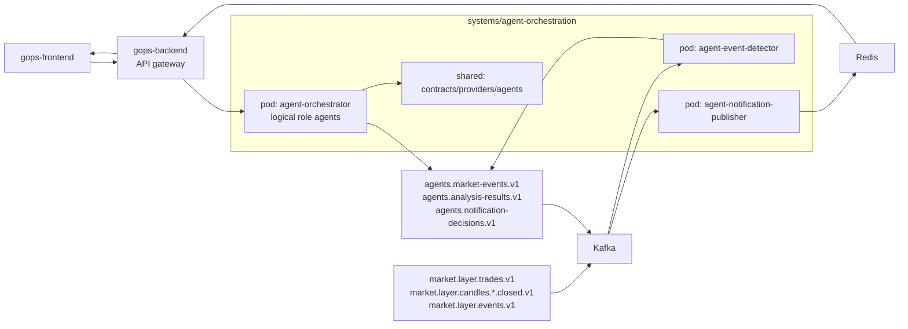
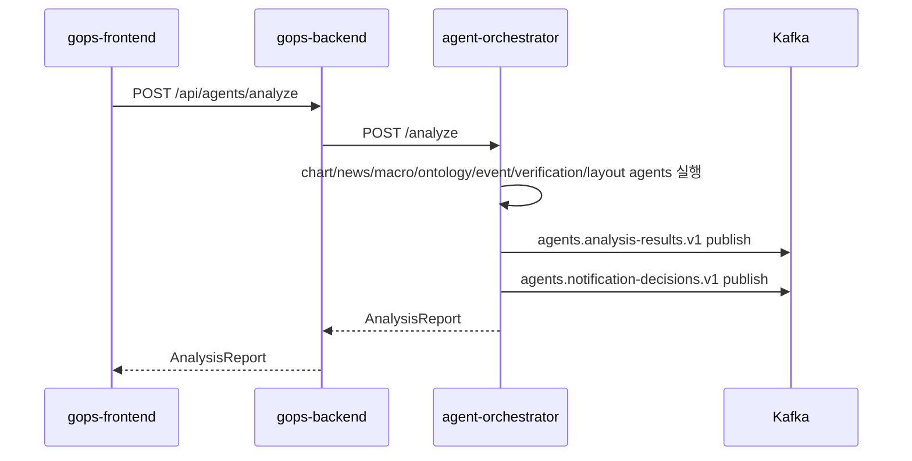
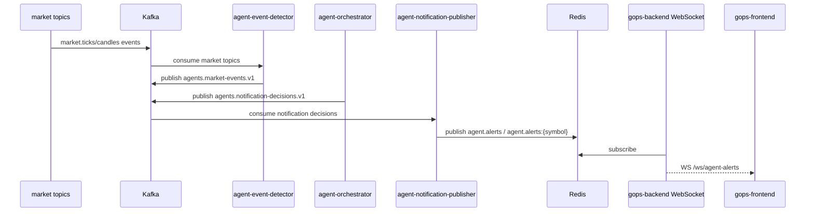

# Agent Orchestration Implementation Summary

> Historical implementation note.
>
> Market-data topic names in this file may be stale. Current chart data follows
> `docs/CHART_DATA_ARCHITECTURE.md` and `platform/kafka/README.md`.

작성일: 2026-06-29
대상 브랜치: `demulage`
주요 커밋:

- `b129474 feat: add agent orchestration v1`
- `8ba812f fix: use absolute agent pod commands`

## 1. 작업 목적

이번 작업은 GOPS에 역할 기반 주식 분석 멀티 에이전트 구조를 붙이기 위한 v1 골격 구현이다.

핵심 방향은 다음과 같다.

- `gops-backend`는 프론트 요청을 받는 API gateway 역할로 유지한다.
- 차트, 뉴스, 거시, 온톨로지, 검증, 알림 판단 같은 에이전트는 각각 별도 pod가 아니라 `agent-orchestrator` pod 안의 논리적 agent로 둔다.
- Kafka market topic을 감시하는 이상 이벤트 감지 역할은 별도 `agent-event-detector` pod로 둔다.
- 알림 판단 결과를 Redis/WebSocket 소비자가 읽을 수 있게 발행하는 역할은 별도 `agent-notification-publisher` pod로 둔다.
- 실제 뉴스 API, 경제지표 API, GraphDB 연결은 v1에서 선택하지 않고 provider adapter 계약과 empty provider만 둔다.
- 분석과 알림까지만 담당하며 자동 주문, 계좌 제어, 매수/매도 실행과 연결하지 않는다.

## 2. 최종 런타임 구조



## 3. Pod와 logical agent 구분

이번 구현에서 실제 pod 후보는 3개다.

| Pod | 역할 |
| --- | --- |
| `agent-orchestrator` | 여러 logical agent를 실행하고 `AnalysisReport`를 만든다. |
| `agent-event-detector` | Kafka market topic을 읽고 급등, 급락, 거래량 급증, 변동성 확대 이벤트를 감지한다. |
| `agent-notification-publisher` | 알림 판단 결과를 Redis pubsub으로 발행해 WebSocket gateway가 소비할 수 있게 한다. |

`agent-orchestrator` 내부 logical agent는 다음과 같다.

| Logical agent | 구현 역할 |
| --- | --- |
| `ChartAgent` | 기존 chart agent 흐름의 `chartContext` 형태를 재사용해 차트 근거를 만든다. |
| `NewsAgent` | v1에서는 `EmptyNewsProvider`를 사용해 no-data evidence를 명시한다. |
| `MacroAgent` | v1에서는 `EmptyMacroProvider`를 사용해 no-data evidence를 명시한다. |
| `OntologyAgent` | v1에서는 `EmptyOntologyProvider`를 사용해 no-data evidence를 명시한다. |
| `UnusualEventExplainerAgent` | 감지된 이상 이벤트를 사용자 설명용 finding으로 확장한다. |
| `MarketSummaryAgent` | role finding들을 종합해 요약 finding을 만든다. |
| `VerificationGuardrailAgent` | 자동 주문/즉시 매매 같은 위험 문구가 섞였는지 확인한다. |
| `NotificationDecisionAgent` | 이벤트 심각도에 따라 `none/info/watch/alert/critical` 알림 레벨을 결정한다. |
| `LayoutAgent` | 이상 이벤트가 있으면 알림 패널 추가 같은 layout proposal을 만든다. |

## 4. 새로 추가된 주요 코드

### Agent system

경로: `systems/agent-orchestration/`

- `shared/gops_agents/contracts.py`
  - `EvidenceItem`
  - `AgentFinding`
  - `MarketEvent`
  - `AnalysisReport`
  - `NotificationDecision`
  - `LayoutProposal`
- `shared/gops_agents/providers.py`
  - `NewsProvider`
  - `MacroProvider`
  - `OntologyProvider`
  - `EmptyNewsProvider`
  - `EmptyMacroProvider`
  - `EmptyOntologyProvider`
- `shared/gops_agents/agents.py`
  - logical agent 구현
- `shared/gops_agents/orchestrator.py`
  - agent 실행 순서와 report 조립
- `shared/gops_agents/event_detector.py`
  - 이상 이벤트 감지 규칙
- `shared/gops_agents/publisher.py`
  - Redis 알림 payload 발행 유틸
- `pods/agent-orchestrator/main.py`
  - FastAPI app
  - `/health`
  - `/analyze`
  - `/reports/{analysis_id}`
- `pods/event-detector/main.py`
  - Kafka consumer로 market topic 감시
  - 감지 결과를 `agents.market-events.v1`로 발행
- `pods/notification-publisher/main.py`
  - `agents.notification-decisions.v1` 소비
  - Redis pubsub 채널로 알림 발행

### Backend gateway

경로: `systems/api-server/pods/api-server/app/`

- `contracts/agents.py`
  - `AgentAnalysisRequest` 추가
- `services/agent_gateway.py`
  - backend에서 agent-orchestrator로 요청 위임
- `services/agent_alert_payloads.py`
  - Redis pubsub payload parsing helper
- `routes/agents.py`
  - `POST /api/agents/analyze`
  - `GET /api/agents/reports/{analysis_id}`
  - `WS /ws/agent-alerts`
- `main.py`
  - agent router 등록

## 5. 분석 요청 흐름



결과 report에는 다음 항목이 포함된다.

- `analysisId`
- `symbol`
- `intent`
- `summary`
- `findings`
- `marketEvents`
- `providerEvidence`
- `notificationDecision`
- `layoutProposal`
- `chartProposal`

## 6. 이상 이벤트 및 알림 흐름



현재 v1 감지 규칙은 단순 threshold 기반이다.

| Event type | 기준 |
| --- | --- |
| `price_surge` | 직전 관측 가격 대비 상승률이 threshold 이상 |
| `price_drop` | 직전 관측 가격 대비 하락률이 threshold 이상 |
| `volume_spike` | 같은 symbol/interval의 이전 완료 캔들 rolling 거래량 평균 대비 배수가 threshold 이상이며 cooldown이 지난 경우 |
| `volatility_expansion` | 캔들 고가-저가 범위가 open 대비 threshold 이상 |

`volume_spike`는 trade payload의 개별 체결량 `size`를 사용하지 않는다.
기본값은 이전 완료 캔들 20개, 최소 표본 5개, 같은 symbol/interval별
30분 cooldown이다. 출력 `MarketEvent` 스키마와 event type 이름은 유지한다.

## 7. Docker와 Kubernetes 반영

### Docker

추가/수정된 항목:

- `infra/docker/Dockerfile.gops-agent-orchestrator`
- `docker-compose.yml`
  - `agent-orchestrator`
  - `agent-event-detector`
  - `agent-notification-publisher`
  - agent Kafka topic 초기화
  - backend의 `AGENT_ORCHESTRATOR_URL`

Docker 검증 중 실제 문제가 발견되어 수정했다.

- 문제: `event-detector`, `notification-publisher` command가 Dockerfile `WORKDIR` 기준 상대 경로로 실행되어 restart loop 발생
- 수정: command를 `/app/systems/.../main.py` 절대 경로로 변경
- 반영 커밋: `8ba812f fix: use absolute agent pod commands`

### Kubernetes

추가/수정된 항목:

- `infra/k8s/base/app/deployment-agent-orchestrator.yaml`
- `infra/k8s/base/app/deployment-agent-event-detector.yaml`
- `infra/k8s/base/app/deployment-agent-notification-publisher.yaml`
- `infra/k8s/base/app/service-agent-orchestrator.yaml`
- `infra/k8s/base/app/configmap.yaml`
- `infra/k8s/base/kustomization.yaml`
- `infra/k8s/overlays/aws/configmap-aws-patch.yaml`
- `infra/k8s/overlays/aws/kustomization.yaml`

AWS overlay에는 `gops-agent-orchestrator` 이미지 매핑이 추가되었다.

## 8. Kafka topic 반영

추가된 agent topic:

```text
agents.market-events.v1
agents.analysis-requests.v1
agents.analysis-results.v1
agents.notification-decisions.v1
agents.dlq.v1
```

반영 위치:

- `platform/kafka/topics.txt`
- `platform/kafka/README.md`
- `scripts/local/create-kafka-topics.sh`
- `docker-compose.yml`의 `kafka-init`

## 9. 검증 결과

구현 시 확인한 항목:

| 검증 | 결과 |
| --- | --- |
| Python compileall | 통과 |
| agent-orchestration unit tests | 통과 |
| api-server tests | 통과. 단, 로컬 FastAPI TestClient 미설치로 일부 integration test는 skip |
| `docker compose config --quiet` | 통과 |
| `kubectl kustomize infra/k8s/base` | 통과 |
| `kubectl kustomize infra/k8s/overlays/aws` | 통과 |
| `git diff --check` | 통과 |
| Docker `agent-orchestrator` health smoke test | 통과 |
| Docker `/analyze` smoke test | 통과 |
| Docker `agent-event-detector` process start | 통과 |
| Docker `agent-notification-publisher` process start | 통과 |
| Local site open via Docker frontend | 통과 |

현재 로컬 Docker 확인 기준:

- frontend: `http://localhost:5173/`
- backend: `http://localhost:8000/`
- agent-orchestrator: `http://localhost:8100/`

## 10. 의도적으로 하지 않은 것

이번 v1에서 일부러 제외한 작업:

- 실제 뉴스 API 선택 및 연결
- 실제 거시경제 지표 API 선택 및 연결
- 실제 온톨로지 GraphDB 연결
- LLM provider key 추가 또는 secret 커밋
- 자동 주문 실행 연결
- 매수/매도 추천을 바로 주문으로 연결하는 기능
- 프론트 UI에 agent 분석 패널을 완전히 붙이는 작업

## 11. 다음 작업 후보

다음 단계에서 자연스럽게 이어갈 수 있는 작업:

1. 프론트에 `POST /api/agents/analyze` 호출 버튼 또는 패널 연결
2. `WS /ws/agent-alerts`를 프론트 알림 영역에 연결
3. chart agent가 기존 `Agent 01`의 chart proposal 형식을 더 직접 재사용하도록 통합 강화
4. provider adapter별 mock fixture 추가
5. `agents.market-events.v1`를 orchestrator 분석 요청과 더 직접 연결
6. 실제 provider 후보 선정 후 `NewsProvider`, `MacroProvider`, `OntologyProvider` 구현
7. agent report 저장소를 in-memory에서 Redis/Postgres 등 durable store로 변경

## 12. 한 줄 요약

이번 작업으로 GOPS에는 `agent-orchestrator` 중심의 역할 기반 분석 골격, Kafka 이상 이벤트 감지 pod, Redis/WebSocket 알림 발행 pod, backend gateway API, Docker/K8s 배포 후보, 테스트와 smoke 검증이 들어갔다. 다만 실제 외부 데이터 provider와 프론트 UI 연결은 다음 단계로 남겨두었다.
