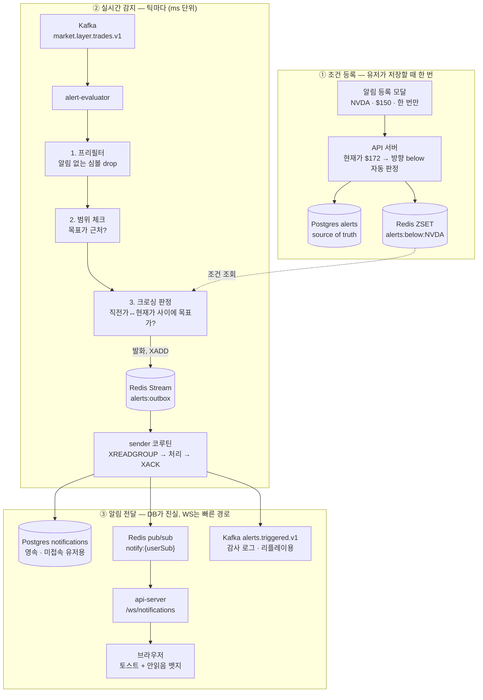

# 실시간 가격 알림 시스템 설계

사용자가 종목별로 조건(목표가 도달 / 급등·급락)을 등록하면, 실시간 가격 스트림에서
조건 충족을 감지해 사이트 내 알림(뱃지/토스트/알림함)으로 전달하는 시스템.

LLM 에이전트는 감지·발송 핫패스에 사용하지 않는다. 감지는 결정적 규칙 평가(ms 단위),
에이전트는 발화 후 비동기 enrichment(뉴스 연관 분석 등)에만 선택적으로 사용한다.

---

## 1. 아키텍처

```text
[프론트 모달] ── POST /api/alerts ──> [api-server]
                                        ├─ Postgres alerts (source of truth)
                                        └─ Redis ZSET 동기화 (evaluator 조회용)

market.layer.trades.v1 (실시간 틱) ──> [alert-evaluator pod]  ← 신규 (단일 pod, 감지+발송)
                                        ├─ 인메모리 프리필터 (알림 없는 심볼 즉시 drop)
                                        ├─ 가격 조건: 직전가 대비 크로싱 감지 (Redis ZSET)
                                        ├─ 급등락: 심볼별 롤링 윈도우 상태
                                        └─ 발화 시 → Redis Stream outbox에 XADD (동기, sub-ms)
                                              │
                                   alerts:outbox (Redis Stream, 유실 방지 버퍼)
                                              │
                                   [sender 코루틴 (같은 pod)]  XREADGROUP → 처리 → XACK
                                        ├─ Postgres notifications INSERT (영속)
                                        ├─ Redis PUBLISH notify:{userSub}
                                        └─ alerts.triggered.v1 발행 (감사 로그·리플레이용)
                                              │
                                  [api-server] WS /ws/notifications
                                        └─ 프론트: 토스트 + 안읽음 뱃지 + 알림함
```

### Mermaid



역할 분담: Kafka = 틱 전달 + 발화 감사 로그, Redis = 조건 저장/직전가/윈도우 상태,
evaluator = 비교 연산 + 발송, api-server = CRUD + WebSocket 서빙.

**v1 토폴로지 결정 — 단일 pod.** 별도 dispatcher pod 없이 evaluator가 감지와 발송을
모두 담당한다. 발화는 하루 수백 건 수준이라 발송 부하가 감지를 밀어낼 규모가 아니고,
Kafka 홉이 하나 빠져 발화→알림함 저장이 10~20ms 빨라진다. 단:

- **발화 유실 방지 — Redis Stream outbox (확정).** 발화를 naked asyncio 태스크로만
  던지면 태스크 실행 전에 pod가 죽을 때 발화가 사라진다. 대신 틱 루프는 발화 순간
  `alerts:outbox` Stream에 **동기 XADD**(sub-ms)만 하고 다음 틱으로 넘어간다.
  같은 pod의 sender 코루틴이 XREADGROUP으로 소비해 Postgres INSERT → PUBLISH →
  Kafka 발행을 마친 뒤 XACK. 크래시 시 un-ACK 엔트리는 재기동 후 XAUTOCLAIM으로
  재처리된다 (중복은 event_id 멱등성이 흡수, §6.2). Postgres outbox 대안은 발화
  시점 동기 INSERT(수~수십 ms)가 급등장 대량 발화 때 틱 루프를 막을 수 있어 기각.
  Redis AOF(everysec) 기준 최악 1초 유실 창은 v1에서 수용.
  **주의: 현재 repo의 Redis는 compose·k8s 모두 `--appendonly no --save ""`(무영속)라
  이 전제가 성립하지 않는다. `appendonly yes / appendfsync everysec / dir /data`
  적용이 선행 조건이다 (§7-1).**
- `alerts.triggered.v1`은 계속 발행한다 (감사 로그·리플레이·추후 분리 대비).
  발화량이 커지거나 채널(이메일/푸시)이 늘면 이 토픽을 구독하는 dispatcher pod로
  sender 코드만 옮기면 된다.

기존 차트 파이프라인(market-processor)과는 **consumer group이 달라 상호 영향 없음.**
evaluator가 죽어도 차트는 정상 동작하고, 그 반대도 같다.

---

## 2. 확정된 결정 사항

### 2.1 데이터 소스 — 실시간 틱 (확정)

`market.layer.trades.v1`(raw trades)를 직접 구독한다. 1m 바 구독 대비 메시지량이
크게 늘지만, 알림 지연을 틱 단위(ms)로 유지하기 위한 선택. 부하는 아래 프리필터로 흡수한다.

```text
틱 도착
 ① 인메모리: 알림 걸린 심볼인가?  → 아니면 즉시 drop (전체 틱의 대부분)
 ② 인메모리: 목표가 min~max 범위 근처인가? → 아니면 drop
 ③ 통과한 것만 Redis ZRANGEBYSCORE
```

- ①의 심볼 set과 ②의 심볼별 목표가 min/max는 조건 등록/삭제 시
  Redis pub/sub으로 evaluator 인메모리 캐시를 갱신.
- 스케일아웃 필요 시 토픽이 이미 key=symbol이므로 파티션 기준 수평 확장.

### 2.2 조건 등록 UI — 모달

자연어 입력 없음. 버튼 → 모달 → 구조화된 폼.

| 필드 | 내용 |
|---|---|
| 종목 | 자동완성 검색 (symbol-registry 조회). 차트 화면에서 진입 시 현재 종목 프리필 |
| 조건 유형 | 탭 2개: `목표가 도달` / `급등·급락` |
| 값 | 목표가 입력 or 등락률 프리셋 |
| 알림 빈도 | `한 번만`(기본) / `계속 받기` 토글 |

**방향(이상/이하)은 묻지 않는다.** 모달에 현재가를 표시하고 자동 추론:
목표가 < 현재가 → below(하락 도달), 목표가 > 현재가 → above(상승 도달).
서버가 등록 시점 현재가로 방향을 확정 저장하며, 이 값이 ZSET
(`alerts:below:{symbol}` / `alerts:above:{symbol}`) 배치를 결정한다.

### 2.3 급등·급락 기준

- 프리셋 + 커스텀: `[ ±3% ] [ ±5% ] [ ±10% ] [ 직접 입력 ]`, **기본 ±5%**
  (미국 대형주 LULD 밴드 및 관행적 급등락 기준과 일치)
- 기준 시점은 **단기 윈도우: 5분 내 변화율** (전일 종가 대비 아님 — 장 후반 알림 가치가
  없고, "지금 터졌다"를 잡는 것이 목적. LULD가 5분 평균가 기준인 이유와 동일)
- v1은 고정 % 프리셋. 소형주 노이즈 문제(저유동성 종목은 3%가 일상)가 확인되면
  종목 변동성 대비 동적 임계값(예: 최근 20일 표준편차 배수)으로 고도화 여지를 남김.

### 2.4 재발화 정책 (서버 정책 — 유저에게 쿨다운 값을 묻지 않음)

| 조건 유형 | 한 번만 | 계속 받기 |
|---|---|---|
| 목표가 도달 | 발화 후 ZSET 제거, 알림 비활성화 | **재크로싱(히스테리시스)**: 발화 후 목표가에서 0.5% 이상 반대 방향으로 벗어나면 re-arm(ZSET 재삽입), 다시 크로스 시 재발화. 하루 최대 N회 상한 |
| 급등·급락 | 발화 후 비활성화 | **시간 쿨다운**: 같은 알림 30분 1회 (`SETNX alert:fired:{alertId} EX 1800`) |

히스테리시스를 쓰는 이유: 목표가 근처에서 가격이 진동할 때 시간 쿨다운만으로는
주기적 스팸 알림이 되기 때문.

### 2.5 크로싱 감지 (tolerance 밴드 사용 금지)

참고 블로그의 ±0.1% tolerance 방식은 가격이 밴드를 건너뛰면(갭) 알림을 영구히 놓친다.
대신 심볼별 직전가 `p_prev`를 유지하고, `[min(p_prev, p_now), max(p_prev, p_now)]`
구간에 목표가가 포함된 조건을 전부 트리거한다. 갭이 나도 놓치지 않는다.

### 2.6 인앱 알림 전달 — DB가 진실, WS는 빠른 경로

- evaluator의 sender 코루틴이 outbox에서 꺼내 Postgres `notifications` INSERT (영속)
  후 Redis PUBLISH.
- 접속 중 유저: api-server가 `notify:{userSub}` 구독 → WS push → 토스트/뱃지 (수십 ms).
- 미접속 유저: pub/sub 메시지는 버려지고, 다음 방문 시 REST로 알림함 조회. 유실 없음.
- api-server 다중 인스턴스여도 Redis pub/sub이 fanout 처리.
- WS 재연결 시 catch-up: `GET /api/notifications?after={lastSeenId}`.

---

## 3. API

```text
POST   /api/alerts                     조건 등록 (Postgres + Redis ZSET)
GET    /api/alerts                     내 조건 목록
DELETE /api/alerts                     내 조건 전체 삭제 (양쪽 제거)
DELETE /api/alerts/{id}                조건 삭제 (양쪽 제거)
PATCH  /api/alerts/{id}                활성/비활성 토글

GET    /api/notifications              알림함 (커서 페이지네이션, ?after= 지원)
GET    /api/notifications/unread-count 안읽음 수
POST   /api/notifications/{id}/read    읽음 처리
POST   /api/notifications/read-all     전체 읽음

WS     /ws/notifications               실시간 push (기존 세션 쿠키 인증)
```

등록 페이로드:

```json
{
  "symbol": "NVDA",
  "type": "price_cross",
  "targetPrice": 150.00,
  "repeat": false
}
```

급등락: `{"symbol": "NVDA", "type": "spike", "changePct": -5.0, "windowMinutes": 5, "repeat": true}`

`direction`은 서버가 등록 시점 현재가로 계산해 저장 (요청에 받지 않음).

---

## 4. 저장 스키마

### Postgres (source of truth)

유저 식별자는 현재 GOPS 인증 모델(`AuthenticatedUser.sub`, 문자열)에 맞춰
`user_sub TEXT`를 쓴다. 별도 숫자 user 테이블이 생기면 그때 마이그레이션.

```sql
CREATE TABLE alerts (
  id            BIGSERIAL PRIMARY KEY,
  user_sub      TEXT NOT NULL,             -- AuthenticatedUser.sub
  symbol        TEXT NOT NULL,
  type          TEXT NOT NULL,            -- price_cross | spike
  direction     TEXT,                     -- above | below (price_cross만)
  target_price  NUMERIC(18,4),
  change_pct    NUMERIC(6,2),
  window_min    INT,
  repeat        BOOLEAN NOT NULL DEFAULT false,
  status        TEXT NOT NULL DEFAULT 'active',  -- active | fired | disabled | expired
  created_at    TIMESTAMPTZ NOT NULL DEFAULT now(),
  expires_at    TIMESTAMPTZ
);

CREATE INDEX ON alerts (user_sub) WHERE status = 'active';

CREATE TABLE notifications (
  id           BIGSERIAL PRIMARY KEY,
  user_sub     TEXT NOT NULL,             -- AuthenticatedUser.sub
  alert_id     BIGINT REFERENCES alerts(id),
  event_id     TEXT NOT NULL UNIQUE,      -- 멱등성 키 (§6.2)
  type         TEXT NOT NULL,
  payload      JSONB NOT NULL,            -- symbol, triggeredPrice, targetPrice, channels, ...
  created_at   TIMESTAMPTZ NOT NULL DEFAULT now(),
  read_at      TIMESTAMPTZ
);
CREATE INDEX ON notifications (user_sub, id DESC);
```

payload에 `symbol`, `triggeredPrice`, `targetPrice`를 구조화해 넣어
알림 클릭 → 해당 차트 이동 UX를 지원한다.

### Redis (evaluator 조회용 — 유실 시 Postgres에서 재구축)

```text
alerts:below:{symbol}   ZSET, score=target_price, member=alertId+meta JSON
alerts:above:{symbol}   ZSET
last:{symbol}           직전가 (크로싱 판정용)
win:{symbol}            급등락 롤링 윈도우 (최근 5분 가격)
alert:fired:{alertId}   쿨다운 키 (TTL)
alerts:outbox           Stream, 발화 outbox (sender 코루틴이 소비, §1)
notify:{userSub}        pub/sub 채널
```

Redis flush/장애 대비 warmup 스크립트: Postgres `alerts WHERE status='active'`를
읽어 ZSET 재구축. evaluator 기동 시 자동 실행.

---

## 5. v1 확정 정책

구현 플랜에 그대로 반영하는 확정값.

| # | 정책 | v1 확정 | 근거 |
|---|---|---|---|
| 1 | 유저당 알림 조건 수 | **50개** | 남용 방지 + evaluator 캐시 크기 예측 가능 |
| 2 | 트리거 대상 세션 | **정규장만** | 확장시간은 유동성 낮아 노이즈 체결로 오발화 위험. 옵트인 토글은 v2 |
| 3 | 알림 조건 만료 | **90일 자동 만료** (`expires_at`) | 잊힌 조건이 몇 달 뒤 발화하는 경험 방지. 만료 전 안내 알림 |
| 4 | 기준가 필터 | **비정상 체결 제외** | odd lot, 장외(dark pool) 프린트가 시장가와 동떨어진 값으로 오발화 가능. Alpaca trade condition 코드로 필터 |
| 5 | 알림 보존 기간 | **90일 후 삭제 배치** | 테이블 무한 성장 방지 |
| 6 | 실시간 push 방식 | **WS** | 기존 `/ws/orders` 인프라 재사용. SSE도 충분하나 통일이 이득 |
| 7 | 급등락 기준가 | **윈도우 시작가(5분 전) 대비 현재가** | 단순하고 설명 가능. "윈도우 내 고점 대비"는 더 민감하지만 v2 |

### v2로 미루는 결정

| 항목 | v1 처리 | v2 후보 |
|---|---|---|
| 기업 이벤트(액면분할·상폐) | 해당 조건 비활성화 + 안내 알림 | 자동 가격 조정 |
| 알림 채널 | 인앱만. 단 payload에 `channels` 필드는 미리 포함 | 이메일·모바일푸시 — dispatcher pod 분리 시점 (§1) |
| 확장시간 트리거 | 미지원 | 유저별 옵트인 토글 |
| 급등락 동적 임계값 | 고정 % 프리셋 | 종목 변동성 대비 (예: 20일 표준편차 배수) |

---

## 6. 실무 구현 시 필수 고려사항

### 6.1 모니터링

- **consumer lag**: evaluator group의 Kafka lag이 곧 알림 지연.
  lag 임계 초과 시 운영 알림 (Kafka UI 또는 exporter).
- 지표: 틱 처리율, 프리필터 drop율, Redis 조회 지연, 발화→WS 도달 end-to-end 지연,
  outbox Stream 길이·pending(XPENDING) 수(발송이 밀리는지).
- 급등장(시장 전체 폭락 등)이 최대 부하 시점이자 알림이 가장 중요한 시점 —
  이때 lag이 안 쌓이는지가 핵심 SLO.

### 6.2 멱등성 (중복 알림 방지)

중복 경로는 두 가지: evaluator가 틱 offset 커밋 전에 죽어 같은 틱 구간을 재처리하는
경우, sender가 INSERT 후 XACK 전에 죽어 outbox 엔트리를 재처리하는 경우. 둘 다
event_id UNIQUE 제약으로 흡수한다 (중복 INSERT는 무시).

event_id는 **원인 이벤트를 포함**해 구성한다 — 시각 기반(`triggeredAtEpoch`)은 재처리
시 timestamp가 달라져 멱등성이 깨질 수 있다:

```text
price_cross: {alertId}:{tradeId}:{direction}        # Alpaca trade id ('i' 필드)
spike:       {alertId}:{windowStart}:{direction}    # 윈도우 경계 epoch
```

tradeId가 없는 틱은 `{symbol}:{tickTimestamp}`로 대체 (Alpaca 틱 타임스탬프는
원본 이벤트 속성이라 재처리에도 불변).

### 6.3 장애 격리

- evaluator 죽음 → 알림만 지연(재시작 후 offset부터 재개), 차트·주문 무영향.
  outbox의 un-ACK 발화는 재기동 시 XAUTOCLAIM으로 재처리 (§1).
- 발송 실패(Postgres 일시 장애 등) → outbox 엔트리를 ACK하지 않고 재시도,
  반복 실패 시 DLQ(`alerts.dlq.v1`) — 기존 orders.dlq.v1 패턴 재사용.
  `alerts.triggered.v1`에 발화 기록이 남아 있어 사후 리플레이로 복구 가능.
- Redis 유실 → warmup 재구축 (§4). 단 `last:{symbol}` 유실 직후 첫 틱은
  크로싱 판정 불가 → 해당 틱은 기준가 세팅만 하고 스킵.

### 6.4 정합성

- Postgres와 Redis ZSET의 이중 쓰기 정합성 — **Postgres 기반 reconcile로 확정**
  (Redis 장애 상황에선 Redis에 재시도 큐를 둘 수 없으므로):
  등록 API는 Postgres 커밋 성공 후 Redis ZSET 반영을 시도하고, 실패해도 API는
  성공을 반환한다 (alert는 `active`로 저장됨). 즉시 재시도 1회 후 실패 시 그대로
  두면, `alert_projection_reconcile` 잡(5분 주기)이 Postgres의 active 조건과
  ZSET을 대조해 누락분을 복구한다. 즉 Redis 반영 실패 시 최대 5분의 감시 공백을
  v1에서 수용하고, source of truth는 항상 Postgres.
- 시간대: 저장은 UTC, 표시는 유저 로컬. "하루 1회" 상한의 '하루'는 ET 거래일 기준.

### 6.5 테스트

- evaluator 단위 테스트: 크로싱(갭 포함), 히스테리시스 re-arm, 쿨다운, 윈도우 계산.
- 리플레이 테스트: 과거 틱 데이터(ClickHouse tick table 또는 고정 fixture 활용)를 토픽에 재생해
  기대 발화 목록과 대조 — 실배포 전 오발화/미발화 검증에 가장 효과적.
- 부하 테스트: 장중 최대 틱 레이트 × 알림 걸린 심볼 수로 Redis QPS 확인.

### 6.6 인증·인가

- `/api/alerts*`, `/api/notifications*`, `/ws/notifications`는 기존
  AUTH_ENABLED 보호 대상에 추가 (세션 쿠키). 타 유저 알림 접근 차단은 쿼리에
  `user_sub = AuthenticatedUser.sub` 조건 강제.

---

## 7. 구현 순서 제안

1. **플랫폼 프로비저닝**
   - Kafka 토픽: `alerts.triggered.v1`, `alerts.dlq.v1`을
     `platform/kafka/topics.txt`, `infra/k8s/base/platform/kafka/topics.txt`,
     `infra/k8s/base/platform/kafka-topic-init-job.yaml`,
     `scripts/local/create-kafka-topics.sh` 네 곳에 모두 추가.
     evaluator용 configmap/env(브로커 주소, 토픽명)도 함께.
   - Redis 영속화: `docker-compose.yml`(현재 `--appendonly no --dir /tmp`)과
     `infra/k8s/base/platform/redis-statefulset.yaml`(현재 `--appendonly no`)을
     `--appendonly yes --appendfsync everysec --dir /data`로 변경.
     outbox 유실 방지(§1)의 선행 조건.
2. **Postgres 스키마 + alerts CRUD API** — UI 없이 curl로 검증 가능
3. **alert-evaluator pod** — price_cross 감지(프리필터 포함) + outbox(XADD) +
   sender 코루틴(notifications INSERT, pub/sub, `alerts.triggered.v1` 발행) + 멱등성
4. **api-server WS `/ws/notifications` + 알림함 REST**
5. **프론트: 등록 모달 + 토스트/뱃지/알림함**
6. **급등락(spike) 조건** — 윈도우 상태 추가
7. 운영: reconcile 잡, DLQ, lag 모니터링, 리플레이 테스트
8. (선택) 발화 이벤트를 `agents.market-events.v1`로 흘려 뉴스 연관 enrichment
9. (규모 확대 시) `alerts.triggered.v1` 구독하는 dispatcher pod로 발송 분리
