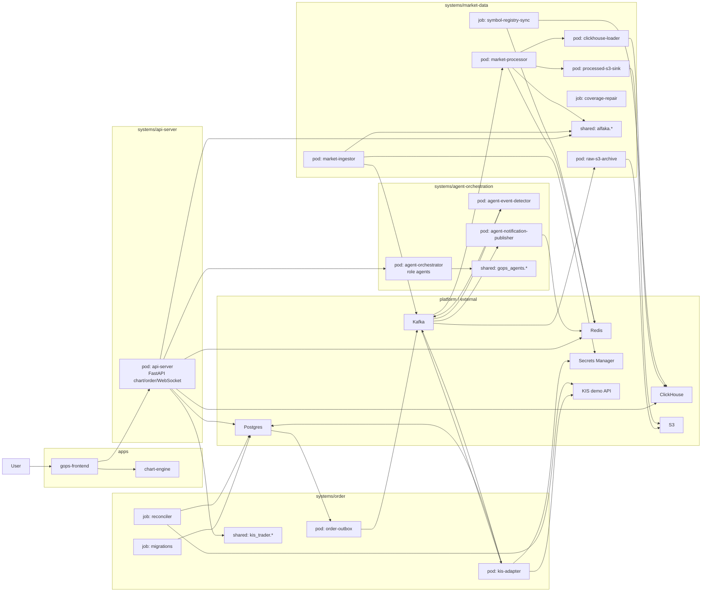

# GOPS Architecture

This is the current repository and runtime architecture.
For placement rules, read `STRUCTURE_GUIDE.md`.

Chart-data rebuild work must use `CHART_DATA_REBUILD_PLAN.md` as the
source-of-truth. Older market-data notes that describe preset historical
universe preload, S&P500-wide tick/quote collection, non-Mermaid Kafka topic
layouts, raw S3 replay as an active read path, or Redis as historical storage
are superseded.

## Repository Shape

```text
apps/
  gops-frontend/
  chart-engine/

systems/
  api-server/
  market-data/
    config/
    pods/
    jobs/
    shared/
    tests/
  order/
  agent-orchestration/

platform/
  kafka/
  redis/
  postgres/
  clickhouse/
  s3/
  secrets/

infra/
  docker/
  k8s/
  aws/
  clickhouse/
```

## Runtime Architecture



## Chart Data Rebuild Boundary

The chart rebuild is on-demand:

```text
Frontend chart request
  -> API Redis latest 120 check
  -> ClickHouse confirmed history
  -> bounded auto/general foreground Alpaca REST direct bars
  -> background S3 final/manifest evidence
  -> background Alpaca historical direct fill for the requested interval/range
```

Realtime data is feed-guarded and symbol-keyed:

```text
SIP only 04:00-20:00 ET / BOATS only 20:00-04:00 ET
  -> Kafka market.input.realtime.* topics with key=symbol
  -> processor feed guard
  -> Redis live/provisional/latest 120
  -> market.layer.* topics for canonical downstream storage
```

Raw Alpaca payload archives may be written to S3 for backup only. Raw archives
must not participate in chart serving, coverage checks, fill decisions, or
ClickHouse loading unless a future explicit raw-replay pipeline is designed.

## Platform Staging

Platform dependencies can move through stages without changing system ownership:

```text
local compose -> single pod candidate -> managed AWS candidate
```

This matters most for Kafka and stream processing.
Do not make folder structure depend on a final AWS choice before the team decides.

## Future System Candidates

Future product areas may become systems later:

```text
systems/ontology/
systems/ui-composition/
systems/news-intelligence/
systems/user-context/
```

Create them only when real code starts.
When adding one, define pods/jobs/shared/tests, image mapping, platform dependencies, and README ownership in the same change.
