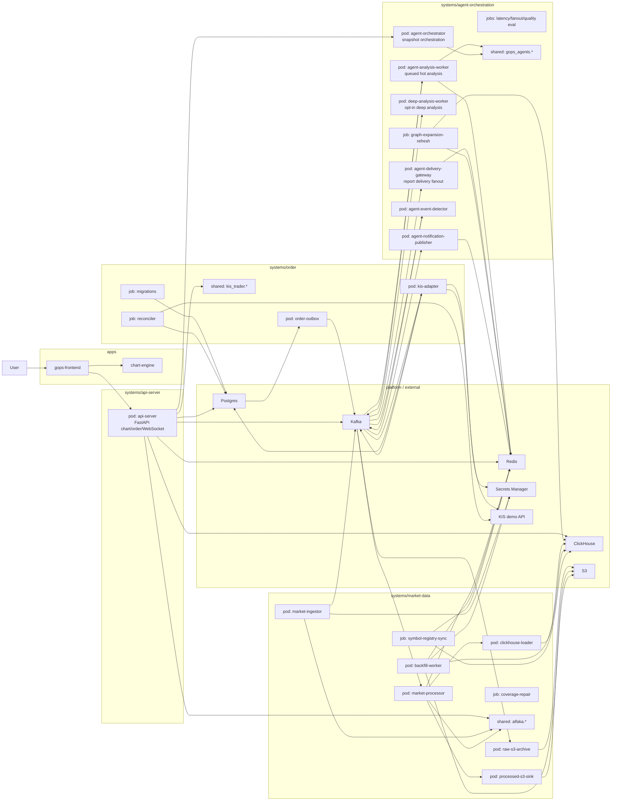

# GOPS Architecture

This is the current repository and runtime architecture.
For placement rules, read `STRUCTURE_GUIDE.md`.

## Repository Shape

```text
apps/
  gops-frontend/
  chart-engine/

systems/
  api-server/
  market-data/
    config/
    pods/
    jobs/
    shared/
    tests/
  order/
  agent-orchestration/

platform/
  kafka/
  flink/
  redis/
  postgres/
  clickhouse/
  s3/
  secrets/

infra/
  docker/
  k8s/
  aws/
  clickhouse/
```

## Runtime Architecture



## Platform Staging

Platform dependencies can move through stages without changing system ownership:

```text
local compose -> single pod candidate -> managed AWS candidate
```

This matters most for Kafka and Flink/stream processing.
Do not make folder structure depend on a final AWS choice before the team decides.

## Future System Candidates

Future product areas may become systems later:

```text
systems/ontology/
systems/ui-composition/
systems/news-intelligence/
systems/user-context/
```

Create them only when real code starts.
When adding one, define pods/jobs/shared/tests, image mapping, platform dependencies, and README ownership in the same change.
