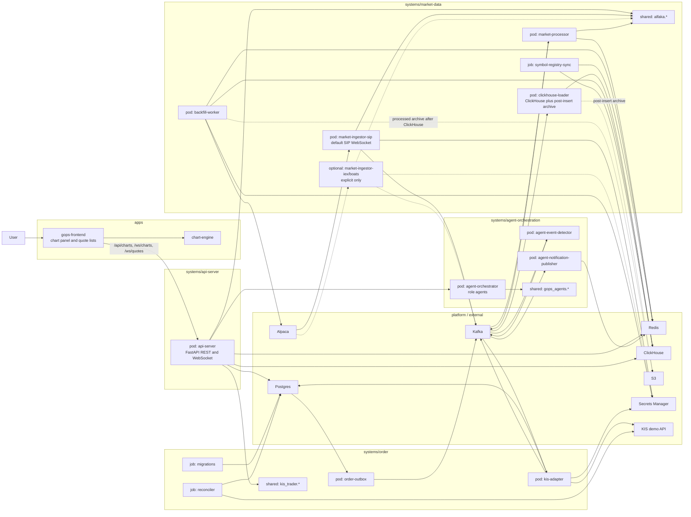
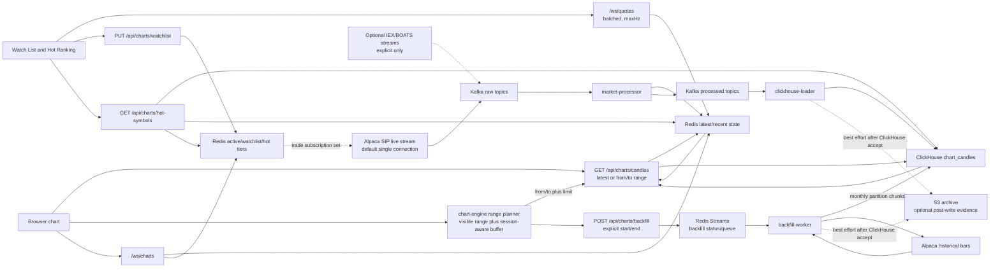
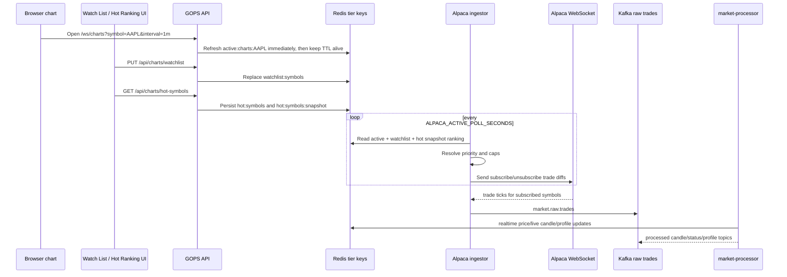
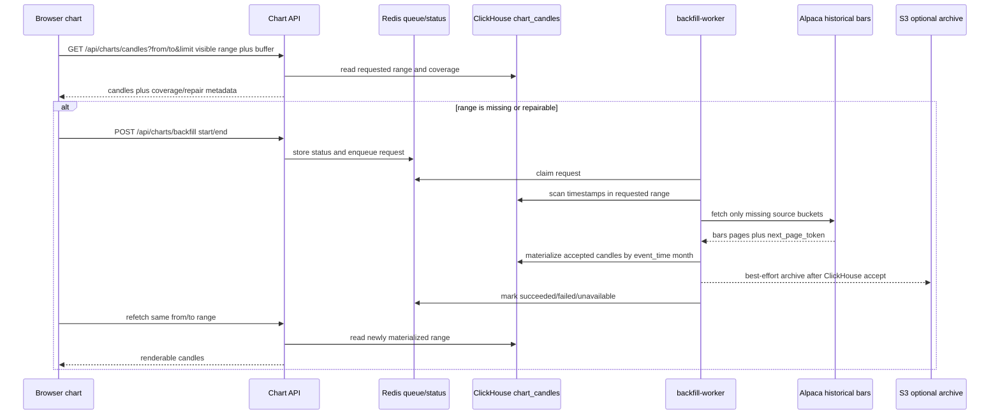

# GOPS Architecture

This is the current repository and runtime architecture.
For placement rules, read `STRUCTURE_GUIDE.md`.

## Repository Shape

```text
apps/
  gops-frontend/
  chart-engine/

systems/
  api-server/
  market-data/
    config/
    pods/
    jobs/
    shared/
    tests/
  order/
  agent-orchestration/

platform/
  kafka/
  flink/
  redis/
  postgres/
  clickhouse/
  s3/
  secrets/

infra/
  docker/
  k8s/
  aws/
  clickhouse/
```

## Runtime Architecture



## Market Data Serving Flow



The chart serving path reads Redis and ClickHouse. Initial chart snapshots can use a latest `limit`, but pan/zoom history loads use the chart-engine range planner to ask `/api/charts/candles` for the visible range plus buffer with half-open `from`/`to` bounds. Online backfill/gapfill checks ClickHouse coverage first, fetches only missing Alpaca source buckets, writes accepted candles to ClickHouse in `event_time` month-partition chunks, and may archive the same processed candles to S3 afterward. Historical Alpaca bars are split-adjusted by default, and the serving/backfill paths share `MARKET_DATA_MAX_HISTORY_YEARS` so the chart does not render or request rows older than the subscription window. Intraday frontend backfill windows are calculated in regular-session market minutes, so panning across an open, close, weekend, or overnight gap still asks for the prior tradable candles instead of an empty wall-clock range. S3 is not a chart-serving source and is not a prerequisite for chart rendering.

Trade ticks are realtime-only. Chart WebSocket sessions, user Watch List symbols, and Hot Ranking symbols are mirrored into Redis tier keys; the Alpaca ingestor resolves those tiers into the active trade subscription set. Active chart symbols have priority. Watch List and Hot Ranking symbols are capped before they reach Alpaca. `/ws/quotes` separately reads Redis live/closed candle state for UI updates at `maxHz=1` by default and does not mutate the Alpaca trade subscription tiers.

The default live Alpaca runtime opens one SIP WebSocket ingestor. IEX and BOATS ingestors are optional extra runtimes and must be enabled explicitly after confirming the Alpaca account can open additional feed connections.

## Realtime Trade Tier Contract



The active chart tier is refreshed before chart gap-fill is sent so a newly opened chart can enter the trade subscription set without waiting for historical repair or heartbeat traffic. The Hot Ranking tier is read from the ordered Redis snapshot first, then the unordered Redis set is used only as a fallback, so caps such as Top 10 preserve the current dollar-volume ranking. Trade ticks are not inserted into ClickHouse and are not archived to S3 by default.

## Backfill Contract



The contract has no S3-to-chart, S3-to-ClickHouse preload, or Kafka-to-S3 sidecar edge. S3 can preserve evidence or recovery artifacts after runtime writes, but only after ClickHouse accepts the corresponding rows. ClickHouse is the serving source of truth and Redis is the realtime/status/cache layer. Backfill materialization must keep ClickHouse inserts bounded to the `chart_candles` monthly partition key, so a long daily range does not put more than one month of candles in a single INSERT block. Derived chart intervals backfill their stored source interval: `5m` and `10m` fill `1m`; `1W` and `1M` fill `1D`. Weekly and monthly serving queries aggregate stored `1D` rows and filter by the higher-timeframe bucket timestamp, so a non-boundary `from`/`to` request does not create a partial first or last weekly/monthly candle. Normal backfill repairs only missing buckets; `force=true` refetches the full clamped source range and lets newer ClickHouse rows supersede stale rows.

## Platform Staging

Platform dependencies can move through stages without changing system ownership:

```text
local compose -> single pod candidate -> managed AWS candidate
```

This matters most for Kafka and Flink/stream processing.
Keep folder structure platform-neutral; platform-specific deployment details belong under `infra/` and `platform/`.

## Future System Candidates

Future product areas may become systems later:

```text
systems/ontology/
systems/ui-composition/
systems/news-intelligence/
systems/user-context/
```

Create them only when real code starts.
When adding one, define pods/jobs/shared/tests, image mapping, platform dependencies, and README ownership in the same change.
