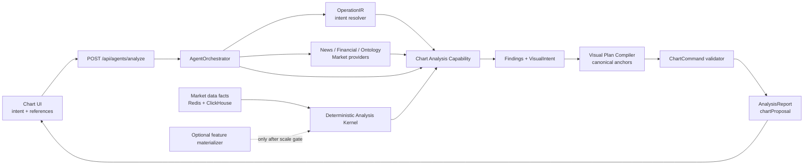
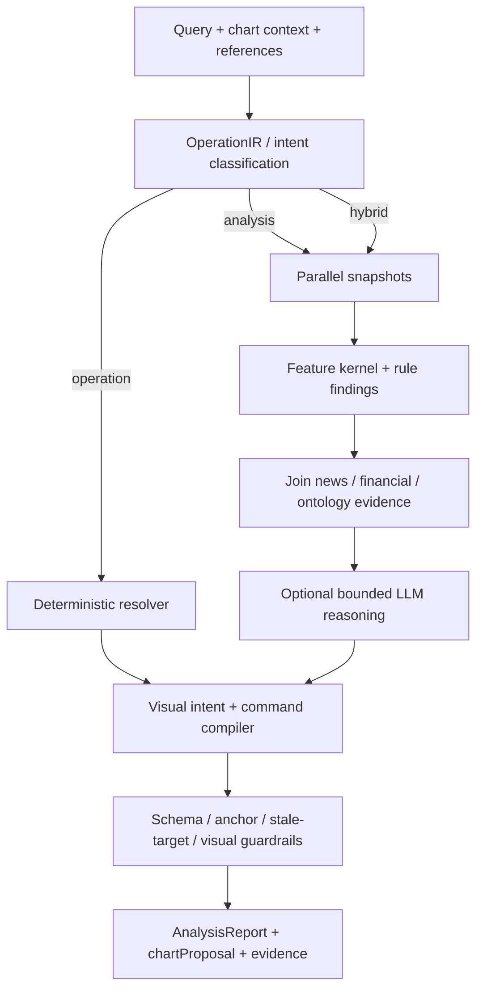

# Chart Intelligence / Agent Strategy

Status: design baseline; deterministic Geometry asset subset implemented

Owners: agent-orchestration, market-data, chart-engine, frontend

Read with: `AGENT_ARCHITECTURE.md`, `AGENT_BACKEND_INTEGRATION.md`,
`AGENT_FRONTEND_INTEGRATION.md`, `CHART_DATA_ARCHITECTURE.md`

## 1. Executive Decision

새 차트 기능을 하나의 자유로운 LLM 에이전트로 만들지 않는다. 제품 안에서는
`Chart Intelligence`라는 하나의 역량으로 보이지만, 내부는 다음 세 부분으로
분리한다.

1. **Deterministic Analysis Kernel**은 캔들, 거래량, order-flow, 이벤트를 읽어
   재현 가능한 feature와 후보 구간을 계산한다.
2. **Chart Analysis Capability**는 feature, 다른 role agent의 evidence, 사용자
   의도를 결합해 주장, 반증, 무효화 조건, 신뢰도를 만든다.
3. **Visual Plan Compiler**는 검증된 의미 단위를 canonical `ChartCommand`로
   바꾼다. LLM은 좌표나 가격을 직접 발명하지 않는다.

이 capability는 기존 `AgentOrchestrator` 아래에서 동작한다. 초기에는 별도
`chart-agent` Pod를 만들지 않고 `agent-analysis-worker` 안에서 실행한다. 연속
계산의 재사용성과 부하가 확인되면 LLM Pod가 아니라 결정론적
`chart-feature-materializer`를 독립 Deployment로 분리한다.

외부 진입점은 `/api/agents/analyze` 하나로 수렴한다. 기존
`/api/llm/chat`, `/api/llm/chart-proposal`, 프런트의 독립 chart agent/compiler는
사용처와 외부 의존을 확인한 뒤 제거한다.

## 2. 목표와 비목표

### 목표

- 사용자가 **무슨 일이 일어났는지, 중요한 가격·시간 구간이 어디인지, 어떤
  조건에서 해석이 무효가 되는지** 빠르게 이해하게 한다.
- 동일한 데이터와 `asOf`에 대해 계산 결과와 작도 앵커가 재현되게 한다.
- 빠른 rule-based 결과와 깊은 LLM 설명이 서로 다른 사실을 말하지 않게 한다.
- 차트 분석을 뉴스, 재무, ontology, peer, 시장 국면 분석과 결합한다.
- UI에서 만든 모든 canonical drawing을 백엔드 proposal로도 동일하게 생성한다.
- 계산 근거, 데이터 범위, 품질, 버전을 저장해 평가와 사후 감사를 가능하게 한다.

### 비목표

- 기술 지표 하나를 매수·매도 신호로 포장하지 않는다.
- 차트 agent가 주문을 제출하거나 보유 수량을 결정하지 않는다.
- LLM이 raw candle 전체를 매번 읽고 지표를 암산하지 않는다.
- 모든 종목·주기·지표 조합을 영구 저장하지 않는다.
- sub-agent마다 Pod, topic, 저장소를 만들지 않는다.
- 사용자가 그린 선을 객관적 market fact로 취급하거나 자동 수정하지 않는다.

## 3. 설계 전에 고정할 고려사항

| 관점 | 반드시 답할 질문 | 설계 원칙 |
| --- | --- | --- |
| 투자 의미 | 이 정보가 어떤 의사결정을 돕는가? | 방향 예측보다 구조, 위험, 무효화 조건을 우선한다. |
| 시간 | 당시 알 수 있었던 정보인가? | 모든 입력과 산출물에 `asOf`를 두고 look-ahead를 금지한다. |
| 데이터 품질 | 실제 체결 기반인가, 추정치인가, 결측인가? | coverage와 quality를 evidence에 포함한다. |
| 재현성 | 같은 입력으로 같은 선을 그리는가? | 계산·pivot·compiler를 버전 관리한다. |
| 사용자 의도 | 설명, 조작, 시나리오 중 무엇인가? | operation, analysis, hybrid를 먼저 분류한다. |
| 시각적 정직성 | 그림이 확신을 과장하지 않는가? | 작도 수를 제한하고 근거·반증·신뢰도를 함께 제공한다. |
| 충돌 | 사용자 drawing과 agent drawing이 겹치는가? | source와 proposal 단위를 보존하고 사용자 객체를 보호한다. |
| 성능 | 즉시 필요한가, 깊은 분석인가? | fast path와 enriched/deep path를 분리한다. |
| 운영 | 실패가 전체 분석을 막는가? | chart capability는 no-data로 degrade하고 report는 계속 완성한다. |
| 평가 | 보기 좋은가가 아니라 유용한가? | grounding, anchor precision, 적용·수정률, latency를 측정한다. |

특히 pattern 이름을 찾는 것보다 다음 순서가 우선이다.

1. 시장 국면과 변동성 확인
2. 구조적인 가격·시간 앵커 식별
3. 거래량·상대성과 다른 데이터로 확인 또는 반증
4. 설명 가능한 scenario와 invalidation 생성
5. 최소한의 시각 정보로 표현

## 4. 현재 자산과 정리 대상

### 재사용할 자산

| 자산 | 활용 |
| --- | --- |
| canonical candle/query path | 분석 입력의 단일 사실 원천 |
| Redis recent data와 ClickHouse history | hot window와 historical window 분리 |
| indicator API 계산 코드 | 순수 계산 함수를 kernel로 추출할 출발점 |
| order-flow daily/intraday data | 수급 확인 신호. 추정 side와 coverage를 명시 |
| news/localization/daily summary | 이벤트 시점과 가격 반응 연결 |
| SEC-derived financial metrics | 실적 이벤트와 valuation/quality 맥락 |
| GraphDB expansion | sector, peer, entity 관계 결정 |
| `OperationIR` | 명시적 차트 조작을 LLM 없이 처리 |
| `EvidenceItem`와 provider snapshot | role 사이의 typed evidence 전달 |
| async queue, report store, polling/SSE | 장시간 분석과 부분 진행 전달 |
| chart engine `ChartCommand`/reducer/validator | 백엔드 작도의 canonical 실행 계약 |
| proposal/history/source metadata | preview, undo, provenance, idempotency |

### 제거하거나 대체할 대상

- `systems/agent-orchestration/shared/gops_agents/chart_command/agent.py`의 독립
  OpenAI 기반 `ChartCommandAgent`
- `systems/api-server/.../routes/llm.py`의 `/api/llm/*` 호환 경로와 전용 service
- `apps/gops-frontend/src/agent/chartAgent.ts`
- 프런트에 중복된 `chartOperationCompiler.ts`
- 호환 경로만 설명하는 README와 더 이상 사용되지 않는 Pydantic wrapper

삭제 전에 route access log, 코드 참조, 배포 환경의 외부 consumer를 확인한다.
확정된 shared schema, capability manifest, reducer/validator는 삭제하지 않고 새
compiler의 출력 계약으로 승격한다.

### 현재 데이터·agent gap

- 기존 indicator path는 SMA/EMA/WMA/Bollinger/RSI/Stochastic/MACD를 요청 시
  계산하고 Redis TTL cache를 사용한다. 표시에는 적합하지만 agent가 재사용할
  point-in-time feature snapshot 계약은 아직 없다.
- volume profile은 OHLCV candle에서 추정한 값이므로 체결 기반 profile과 같은
  confidence로 사용하면 안 된다.
- 화면용 candle volume profile은 활성 overlay와 padding을 포함한 실제 main price
  pane의 scene 가격축 전체를 정확히 10개로 나누는 `volume-profile-exact-v2`를
  사용한다. visible closed-candle 수를 요청에 포함하며 source 수가 부족한 partial
  결과는 캐시하거나 표시하지 않는다. 0-volume bucket은 candle range overlap 추정상
  배분량이 0이라는 뜻이며 실제 무체결을 보장하지 않는다. Agent feature pack은 분석
  신호 호환성을 위해 기존 `volume-profile-v1` adaptive 24-bin을 유지한다.
- order-flow는 장중 Redis와 daily ClickHouse 자산이 있지만 종목/기간 coverage와
  side 추정 품질이 제한된다. raw trade/quote retention 범위 밖의 분석은 daily
  aggregate 수준으로 degrade해야 한다.
- `MarketSnapshotProvider`는 현재 프런트가 보낸 visible summary와 reference를
  감싸는 역할이 중심이며 구조·변동성·상대성과 같은 분석 feature는 제공하지 않는다.
- 현재 cross-signal은 단순 확인/미확인 수준이고 macro provider는 비어 있다.
- `AnalysisReport.chartProposal`은 주 분석 흐름에서 실질적인 visual reasoning
  결과를 생성하지 않고 요청 값을 통과시키는 부분이 남아 있다.

따라서 새 설계의 첫 데이터 과제는 지표 종류를 늘리는 것이 아니라, 위 자산을
동일 `asOf`와 quality 계약으로 묶는 것이다.

## 5. 목표 아키텍처와 소유권



### 코드 소유권

| 위치 | 책임 | 포함하지 않을 것 |
| --- | --- | --- |
| `systems/market-data/shared/alfaka/analytics/` | 순수 시계열 계산, pivot, feature schema와 버전 | LLM prompt, UI drawing, 투자 서술 |
| `systems/agent-orchestration/shared/gops_agents/chart_intelligence/` | feature 조회, rule engine, finding, visual intent, guardrail | pixel 좌표, 브라우저 상태 |
| `systems/agent-orchestration/.../orchestration/` | capability 호출, provider join, deadline, report synthesis | 지표 수식 |
| stable shared chart contract | `ChartCommand`, proposal, canonical anchor 계약 | provider 구현 |
| `apps/.../chart-engine/` | 명령 적용, preview, hit-test, 렌더링, 편집 | 시장 판단과 지표 계산 |
| `apps/gops-frontend/` | 사용자 context/reference, proposal UX | 별도 LLM 호출과 중복 compiler |

시장 데이터 system은 **사실과 계산**을 소유하고 agent system은 **해석과 시각적
제안**을 소유한다. 따라서 API server를 import해 지표를 얻는 구조를 만들지 않는다.
기존 API 지표 구현의 순수 함수만 market-data package로 옮기고 API와 agent가
같은 함수를 호출하게 한다.

## 6. 데이터 및 사전 계산 전략

### 6.1 입력 계층

- 가격: canonical OHLCV, adjustment 정책, session/calendar, interval
- 체결/호가: side classification 방법, 표본 범위, 지연, coverage
- 이벤트: 뉴스, 실적 발표, 시장 상태 변화의 event time과 ingestion time
- 관계: sector, industry, benchmark, peer graph
- 재무: point-in-time으로 사용할 수 있는 filing/derived metric
- 사용자 문맥: symbol, interval, visible range, selected candle/range/drawing,
  기존 drawing과 활성 indicator

`eventTime`, `availableAt`, `asOf`를 구분한다. 과거 분석에서는 `availableAt <= asOf`
자료만 허용한다. split/dividend adjustment와 regular/extended session 정책도
feature key에 들어가야 한다.

### 6.2 계산할 feature

| 범주 | 핵심 feature | 제공 가치 | 주의점 |
| --- | --- | --- | --- |
| 수익률 | log return, gap, session return, multi-window return | 변화의 크기와 시점 | 단독 방향 신호로 쓰지 않음 |
| 추세/구조 | EMA slope, ATR-normalized distance, swing HH/HL/LH/LL | 추세와 구조 전환 | pivot은 confirmation lag 표시 |
| 변동성 | ATR, realized volatility, percentile, compression/expansion | 손절 폭, regime, gap risk | 주기 간 직접 수치 비교 금지 |
| 모멘텀 | RSI, ROC, MACD, stochastic, divergence candidate | 가속·감속 확인 | divergence는 후보와 품질만 제공 |
| 거래량 | relative volume, same-time baseline, dollar volume | 움직임의 참여도 | 장중 계절성 보정 |
| 구조 구간 | support/resistance cluster, range, breakout/retest, gap | 실제 작도 앵커 | 선보다 zone을 우선할 수 있음 |
| order-flow | imbalance, delta, POC/value area, absorption candidate | 단기 움직임 확인 | 추정 side와 제한 종목 명시 |
| 상대 성과 | benchmark/sector/peer return, residual strength | 시장 전체와 종목 고유 움직임 분리 | benchmark 선택 근거 보존 |
| 이벤트 반응 | pre/post return, abnormal return, volume surprise | 뉴스·실적과 가격 연결 | 인과가 아니라 시간 정렬된 관찰 |
| 품질 | missing bars, stale age, sample size, coverage | 신뢰도 조절 | finding보다 먼저 계산 |

다중 주기는 요청 주기를 중심으로 상위 1~2개 주기까지만 사용한다. 예를 들어
5분 분석은 5분·1시간·1일을 볼 수 있지만 모든 주기를 무조건 계산하지 않는다.

### 6.3 계산과 저장 단계

| 단계 | 계산 시점 | 저장 | 적용 |
| --- | --- | --- | --- |
| Tier 0 | 요청 시 | process/Redis short TTL | 임의 visible range, 표시용 series |
| Tier 1 | closed bar 또는 첫 요청 | Redis latest + 필요 시 ClickHouse | 반복 사용되는 저차원 feature snapshot |
| Tier 2 | 중요 이벤트 확정 시 | ClickHouse versioned artifact | 뉴스/실적 전후 반응, alert와 평가 재사용 |
| Tier 3 | deep request 시 | report/evidence만 | 비싼 pattern scan, 후보 비교 |

초기 구현은 Tier 0과 request cache로 시작한다. 다음 조건을 모두 만족할 때에만
Tier 1 materializer를 만든다.

- 동일 `(symbol, interval, asOf/window, version)` 계산이 여러 consumer에서 반복됨
- cache miss 또는 계산 시간이 fast-path SLO를 지속적으로 위반함
- alert/event detector/agent 중 둘 이상의 named reader가 존재함
- 저장 비용, backfill, 재계산, retention owner가 정해짐

materializer는 interval-specific closed candle topic만 읽고 별도 consumer group을
가진다. generic legacy topic을 되살리지 않는다. 새 topic reader와 ClickHouse
table은 platform 문서, retention, replay 절차가 먼저 정의되어야 한다.

### 6.4 Feature Snapshot 계약

```text
ChartFeatureSnapshot
  version, featureVersion, inputDigest
  symbol, interval, asOf, window, sessionPolicy, adjustmentPolicy
  canonicalDataVersion
  coverage {expectedBars, actualBars, missingBars, staleAgeMs, qualityFlags}
  features[] {id, kind, value/seriesRef, unit, timestamps, parameters, quality}
  pivots[] {id, timestamp, price, kind, confirmationTime, strength}
  zones[] {id, timeRange, priceRange, kind, score, evidenceFeatureIds}
```

계산 결과 key에는 parameter와 algorithm version이 포함된다. 변경된 수식으로
과거 cache가 조용히 재사용되어서는 안 된다. raw candle 복제 저장 대신
`inputDigest`와 canonical source 범위를 기록한다.

## 7. 투자 분석 결과 모델

분석 산출물은 signal 목록이 아니라 검증 가능한 `ChartFinding`이다.

```text
ChartFinding
  id, category, horizon
  thesis
  evidenceRefs[]
  counterEvidenceRefs[]
  invalidation
  confidence {score, reasons, penalties}
  affectedTimeRange, affectedPriceRange
  candidateVisualIntents[]
```

confidence는 LLM의 느낌이 아니라 최소한 다음 항목의 함수여야 한다.

- 데이터 coverage와 freshness
- 후보를 지지하는 독립 feature 수
- 상위 주기와의 정렬 여부
- 상대 성과/거래량/order-flow의 확인 여부
- 서로 모순되는 evidence
- pivot confirmation과 표본 수

사용자에게 우선 제공할 정보는 다음과 같다.

1. 현재 regime: 추세, range, 변동성 확대/축소
2. 중요 지지·저항과 관찰해야 할 가격 구간
3. 최근 변화가 발생한 시점과 이벤트
4. benchmark/sector 대비 움직임이 고유한지 여부
5. 주장을 반증하는 증거와 invalidation
6. 요청한 경우에만 entry/stop/target을 포함한 scenario

### Risk/Reward와 Fibonacci 사용 원칙

- Risk/Reward는 **예측이나 주문**이 아니라 가정이 명시된 scenario다.
- Long/Short 방향은 사용자 thesis가 명시됐거나, 검증된 finding을 사용자가
  scenario로 요청한 경우에만 정한다.
- Entry, Stop, Target은 rule engine이 만든 pivot/zone ID에서 해석한다. LLM이
  가격을 직접 출력하지 않는다.
- Risk/Reward proposal은 방향, horizon, 구조적 invalidation, R:R을 함께 보여준다.
- Fibonacci는 사용자가 요청했거나 명확하고 품질 기준을 넘는 impulse swing의
  두 pivot이 있을 때만 사용한다. 임의의 고점·저점을 장식적으로 연결하지 않는다.
- 현재 3점 Risk/Reward와 2점 Fibonacci canonical anchor 계약을 그대로 사용한다.

## 8. 시각 정보 전략

### 의미 단위에서 명령으로

LLM과 rule engine은 raw `ChartCommand`가 아니라 `ChartVisualIntent` 후보를 만든다.

```text
ChartVisualIntent
  intentId, findingId, type
  anchorRefs[]        # pivot/zone/event/feature ID
  semanticRole       # support, resistance, event, scenario, explanation...
  priority, confidence
  labelTemplateData
  styleToken          # 임의 color/opacity가 아닌 허용된 token
```

compiler가 anchor ID를 canonical time/price로 해석하고 capability manifest와
명령 schema를 검증한 뒤 `ChartProposal`을 만든다. 이렇게 하면 rule path와 LLM
path가 같은 선을 그린다.

| 분석 의미 | 기본 도구 |
| --- | --- |
| 단일 지지·저항 | H-Line |
| 가격 zone | Price Parallel 또는 Range |
| 이벤트 window | Time Parallel |
| 추세와 channel | Trend / Trend Parallel |
| 횡보·돌파 구간 | Range |
| 거래 scenario | Risk/Reward |
| 검증된 impulse retracement | Fibonacci |
| 단일 이벤트 | Marker / Flag |
| 짧은 결론·가정 | Text 또는 drawing label |

최근 drawing 개선을 agent에도 동일하게 적용한다.

- fill은 캔들 아래에 렌더링되고 선택 근거가 되지 않는다.
- 선, outline, handle, label만 선택된다.
- 가격·시간 평행선 label과 모든 텍스트는 편집 가능하다.
- proposal 적용 후 drawing은 Select 상태로 수정 가능하다.
- Risk/Reward preview는 첫 클릭 이후부터 가상 range를 보여 주는 요구 UX를
  canonical frontend 동작으로 유지한다.
- user drawing은 `chart.drawing` reference로 보낼 수 있어야 한다. 이는 사용자
  가설이며 market evidence와 별도 표기한다.

### 시각 예산

기본 proposal 하나는 다음 한도를 적용한다.

- 핵심 finding 3개 이하
- foreground drawing 5개 이하
- 넓은 shaded zone 2개 이하
- Risk/Reward scenario 1개 이하
- label은 한 문장, 중복 가격 label 제거

그 이상은 우선순위가 낮은 후보로 접고 사용자가 “더 보기”를 선택하게 한다.
agent drawing은 `sourceProposalId`, `findingId`, `calculationVersion`을 보존하며
사용자 drawing과 별도 group으로 삭제/undo할 수 있어야 한다.

## 9. Rule Engine과 LLM의 경계

| Rule/Compiler가 소유 | LLM이 소유 |
| --- | --- |
| 지표 수식, pivot, zone, event alignment | 모호한 의도 해석 |
| quality/coverage와 no-lookahead | 후보 finding 간 의미 비교 |
| 후보 생성과 기본 ranking | 뉴스·재무·차트 근거의 자연어 종합 |
| 가격·시간 anchor 해석 | 사용자 수준에 맞춘 설명 |
| Risk/Reward 불변식 | 반증을 포함한 서술 순서 |
| command schema와 capability 검증 | 기존 후보 중 강조할 항목 선택 |
| visual budget와 safety policy | 명시된 가정의 요약 |

LLM은 다음을 할 수 없다.

- 지표를 암산하거나 존재하지 않는 feature 값을 작성
- pixel coordinate 또는 검증되지 않은 raw 가격·시간 anchor 생성
- 데이터에 없는 pattern, 뉴스, 원인을 발명
- 사용자 의도 없이 Long/Short 또는 주문 행동 선택
- command validator, visual budget, stale-document 검사를 우회

fast analysis는 추가 chart LLM call 없이 rule finding을 기존 report synthesis에
전달한다. deep mode에서만 bounded feature/evidence를 대상으로 한 reasoning call
한 번을 허용할 수 있으며, offline evaluation에서 개선이 입증되어야 한다.

## 10. Orchestrator 통합 흐름



### 요청 유형

- **Operation**: “RSI 추가”, “이 선을 지워”. `OperationIR`과 deterministic
  resolver로 즉시 처리한다.
- **Analysis**: “지금 추세와 중요한 구간을 분석해줘”. feature와 evidence를
  만들고 finding/설명을 반환한다.
- **Hybrid**: “왜 하락했는지 설명하고 중요 구간을 표시해줘”. 다른 provider와
  chart capability를 병렬 호출한 뒤 event-reaction 단계에서 join한다.

role agent끼리 자유 형식 대화를 하지 않는다. orchestrator가 typed snapshot과
evidence ID를 전달한다. Chart capability는 news event time, ontology의 peer/sector,
financial event를 소비하고, 다른 role에는 abnormal return, volume response,
structure break 같은 chart evidence를 돌려준다.

### 응답 진행 단계

기존 polling/SSE fallback을 유지하면서 다음 progress event를 고려한다.

1. `context_resolved`
2. `features_ready`
3. `chart_preview_ready`
4. `evidence_joined`
5. `completed`

`chart_preview_ready`는 최종 prose보다 먼저 도착할 수 있다. 최종 report는 같은
proposal ID를 확정하거나 취소 사유를 설명해야 한다.

## 11. UX 워크플로우

### 명시적 조작

“볼린저 밴드 켜줘”처럼 가역적인 view/layer 명령은 빠르게 적용하고 undo를
제공한다. drawing 생성은 preview를 기본으로 한다.

### 선택 기반 질문

선택한 candle, range, Risk/Reward, Fibonacci, 사용자 trend line을 typed reference로
보낸다. 예: “이 Risk/Reward 가정이 합리적인가?”에서 agent는 anchor를 새로
추측하지 않고 선택 drawing을 평가한다.

### 분석과 작도

분석 카드에는 결론, 근거, 반증, invalidation, coverage를 먼저 보여주고 해당
finding의 “차트에서 보기”가 proposal을 강조한다. 사용자는 전체 proposal 또는
개별 drawing을 적용할 수 있다.

### 적용 정책

| 동작 | 정책 |
| --- | --- |
| 명시적 symbol/view/layer 변경 | 가역적이면 auto-apply 가능 |
| 새 drawing, 비교 차트, Risk/Reward | preview 후 적용 |
| 기존 사용자 drawing 수정/삭제 | 항상 명시적 확인 |
| 방향 선택, 주문, 포지션 크기 | auto-apply 금지; 주문은 별도 system |

proposal 적용 시 target document revision을 검사한다. 분석 중 차트가 바뀌었다면
blind apply하지 않고 재계산 또는 사용자 확인을 요구한다.

## 12. 배포 및 성능 전략

### 초기 형태

- `agent-analysis-worker`: orchestration, chart capability, lightweight kernel 실행
- 기존 agent image 재사용
- Redis: request/feature cache와 report progress
- ClickHouse: canonical history와 승인된 versioned feature artifact
- 추가 public API, Kafka topic, 전용 chart LLM Pod 없음

### 독립 materializer 전환 조건

조건이 충족되면 `systems/market-data/pods/chart-feature-materializer/`를 만들고
market-data image 또는 명시된 파생 image로 배포한다. 책임은 closed bar feature
갱신뿐이며 LLM을 호출하지 않는다.

- fast-path feature compute p95가 예산을 반복 위반
- 두 개 이상의 continuous consumer가 동일 feature를 요구
- replay/backfill과 storage owner가 확정
- CPU/memory profile이 analysis worker와 독립 scaling을 요구

추후 deep pattern 계산이 worker를 방해하면 내부 task class 또는 별도 worker pool로
격리한다. 이것도 독립적인 판단 주체가 아니라 같은 contract를 실행하는 compute
boundary다.

### 목표 SLO 초안

| 경로 | 목표 |
| --- | --- |
| explicit deterministic operation | p95 250ms 이내 |
| cached feature snapshot | p95 500ms 이내 |
| rule finding + chart preview | p95 1.2s 이내 |
| multi-provider enriched report | 기존 5s hot-path 예산 안 |
| deep analysis | 30s deadline, 진행 상태 제공 |

window, symbol 수, interval 수, pivot 후보 수를 요청별로 제한하고 각 단계에 deadline,
cancellation, bulkhead를 둔다. chart capability 실패는 `no_data` evidence로 degrade한다.

## 13. 안전, 정확성, 감사 가능성

- 모든 finding과 drawing은 evidence/pivot ID로 역추적 가능해야 한다.
- order-flow와 candle-derived volume profile은 `estimated` 품질을 UI에 노출한다.
- “뉴스 때문에 상승” 대신 “뉴스 공개 이후 abnormal return이 관찰됨”처럼 인과를
  과장하지 않는다.
- insufficient/stale/missing data는 낮은 confidence가 아니라 별도 상태가 될 수 있다.
- 사용자 질의, 계산 version, input digest, proposal, 적용 여부를 감사 로그로 남긴다.
- raw prompt나 민감한 사용자 정보는 feature store에 저장하지 않는다.
- chart capability는 order API와 credentials에 접근하지 않는다.
- historical evaluation은 point-in-time input과 walk-forward split을 사용한다.

## 14. 평가와 관측

### Offline evaluation

- 고정 candle/event episode와 expected feature/pivot golden test
- 상승·하락·range·gap·결측·split 경계 fixture
- no-lookahead와 pivot confirmation invariant
- Risk/Reward/Fibonacci canonical anchor 및 방향 invariant
- visual intent → command snapshot과 frontend render parity
- 다른 provider가 no-data일 때 degraded report
- LLM grounding: 모든 수치·주장·anchor가 evidence에 존재하는지
- walk-forward에서 finding confidence calibration과 false discovery 관찰

backtest 수익률은 rule 품질의 한 보조 지표일 뿐 제품의 유용성을 대신하지 않는다.
거래 비용, survivorship bias, corporate action, benchmark를 통제하지 않은 결과는
의사결정에 쓰지 않는다.

### Online metrics

- feature cache hit, compute p50/p95, coverage/freshness
- finding/proposal 생성률과 validator 실패율
- proposal apply, partial apply, reject, edit-after-apply, undo 비율
- anchor 이동 거리와 label 수정량
- evidence grounding failure와 stale-target reject
- SSE 단계별 latency, provider timeout/no-data
- chart preview 이후 report completion/abandonment

`edit-after-apply`가 높으면 사용자 취향 문제인지 anchor 품질 문제인지 구분해
관찰한다. 클릭률만 최적화해 그림을 과도하게 만들지 않는다.

## 15. 단계별 구현 전략

### Phase 0 — 계약과 기준선

- legacy route/client 사용처와 access telemetry 확인
- `ChartFeatureSnapshot`, `ChartFinding`, `ChartVisualIntent`, `ChartProposal` 계약 확정
- `chart.drawing` reference와 document revision 계약 결정
- 대표 30~50개 chart episode golden dataset과 latency baseline 마련
- 기존 command capability와 최근 Risk/Reward/Fibonacci 동작을 contract test로 고정

완료 조건: 새 계산이나 LLM 없이도 어떤 입력이 어떤 출력으로 이어지는지 테스트로
설명할 수 있다.

### Phase 1 — 레거시 제거와 단일 진입점

- 사용되지 않는 `ChartCommandAgent`, `/api/llm/*`, 프런트 chart client/compiler 제거
- `/api/agents/analyze` operation path에 deterministic chart operation 연결
- 관련 README와 API contract 정리
- 배포 로그에서 legacy 호출 0, frontend/API/agent test 통과 확인

완료 조건: 차트 의도 처리의 public path와 compiler가 각각 하나다.

### Phase 2 — Deterministic Kernel

- 기존 indicator 수식을 market-data analytics package의 순수 함수로 추출
- coverage, pivot, zone, volatility regime, relative volume 구현
- `asOf`, session/adjustment, version, input digest 적용
- 요청 시 계산과 Redis cache부터 시작

완료 조건: golden fixture에서 계산이 재현되고 API와 agent 결과가 일치한다.

### Phase 3 — Chart Capability

- rule candidate, ranking, counter-evidence, invalidation 생성
- orchestrator market role/snapshot에 feature provider 연결
- no-data/deadline/degraded report 적용
- LLM 없이 기본 분석 report 제공

완료 조건: 대표 질문에서 근거가 연결된 finding을 1.2s 목표 안에 만든다.

### Phase 4 — Visual Plan Compiler

- semantic intent와 style token 정의
- pivot/zone/event ID를 canonical anchor로 해석
- H-Line, parallel, trend, range, Risk/Reward, Fibonacci, marker/flag/text 지원
- visual budget, source grouping, stale revision, command validation 적용
- frontend preview/partial apply/undo와 SSE preview 연결

완료 조건: rule path의 모든 그림이 동일 command로 재현되고 사용자 drawing을
침범하지 않는다.

### Phase 5 — Cross-signal 분석

- news/earnings event reaction과 abnormal return 계산
- ontology 기반 benchmark/sector/peer 선택
- financial/news evidence와 chart finding join
- bounded LLM reasoning을 feature flag로 추가하고 A/B offline 평가

완료 조건: LLM 없이도 사실이 완성되며, LLM은 설명·후보 선택만 개선한다.

### Phase 6 — Materialization과 확장

- 실제 metric이 전환 조건을 만족하는지 검토
- 필요할 때만 interval-specific topic reader, consumer group, ClickHouse schema,
  backfill/replay/retention을 설계
- chart-feature-materializer Deployment와 operational runbook 추가

완료 조건: 별도 runtime이 비용과 latency를 실제로 개선하고 replay가 검증된다.

### Phase 7 — Deep mode, alerts, 학습 루프

- 비싼 다중 주기·pattern 후보는 deep worker로 격리
- finding을 alert condition으로 재사용하되 alert contract를 별도 승인
- apply/edit/reject feedback을 평가 데이터로 사용
- 개인화는 설명 밀도와 선호 도구부터 시작하고 사실 계산은 개인화하지 않음

## 16. 우선 결정할 열린 항목

구현 시작 전에 다음을 RFC 수준에서 확정한다.

1. adjustment와 extended-hours를 feature별로 어떻게 표기할지
2. benchmark/sector ETF mapping의 canonical owner
3. `chart.drawing` reference의 최소 payload와 개인정보/크기 제한
4. proposal의 `expectedDocumentRevision`과 stale apply UX
5. materialized feature의 consumer, retention, backfill owner
6. 미국장 외 calendar/timezone 지원 범위
7. fast path에서 chart preview를 report보다 먼저 보내는 SSE contract
8. scenario 표현을 제공할 때의 투자 정보 고지와 제품 문구

## 17. 첫 구현 묶음 권고

첫 PR 묶음은 Phase 0과 1까지만 수행한다. 레거시를 지우는 동시에 새 분석 로직을
넣으면 회귀 원인을 분리하기 어렵다. 두 번째 묶음에서 pure kernel과 golden test,
세 번째에서 orchestrator finding, 네 번째에서 visual compiler를 연결한다.

초기 성공 기준은 “LLM이 멋진 차트를 그린다”가 아니다. 다음 네 가지다.

- 같은 입력에서 같은 근거와 anchor가 나온다.
- 사용자가 결과를 빠르게 이해하고 필요한 drawing만 적용한다.
- 다른 agent가 chart evidence를 typed contract로 재사용한다.
- 속도, 품질, 실패 원인이 운영 지표로 설명된다.
