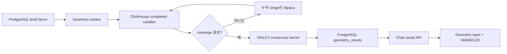

# Chart Geometry Assets

Chart Geometry Asset은 완료된 실제 OHLCV 봉에서 현재 지지·저항과 가격 패턴을
계산해 차트에 적용하는 결정론적 자산이다. 패턴 좌표나 판정에 LLM을 사용하지 않는다.

## 지원 범위

- interval: `1m`, `5m`, `10m`, `1h`, `4h`, `1D`, `1W`
- geometry: 지지선 최대 2개, 저항선 최대 2개, 최고 점수 패턴 1개를 최대 8개 drawing으로 표현
- 패턴: 상승·하락·대칭 삼각형, 상승·하락 깃발형/페넌트/직사각형, 상승·하락 쐐기,
  하락 채널 상단 돌파, 상승 채널 하단 이탈
- 보조지표: 선택 interval의 완료 봉 개수 기준 SMA60·SMA120과 최근 교차
- 좌표: 해당 interval에 실제로 존재하는 canonical candle timestamp와 가격
- intraday: `1m` 실제 정규장 봉, `5m/10m/1h/4h`는 09:30 ET 기준 파생 봉

패턴은 방향전환 피벗과 회귀 경계선에서 깃대 유무, 두 경계의 기울기·평행성·수렴률,
내부 포함률, 종가 돌파 방향을 판정한다. 깃발형·페넌트·직사각형은 선행 impulse를
요구하고, 채널 이탈은 종가 돌파가 거래량 또는 다음 봉 유지로 확인된 경우만 표시한다.
`patterns[]`에는 활성 hard-pass 후보를 저장하고 `primaryPattern`만 작도한다. 삼각형
호환 필드인 `primaryTriangle`/`historicalTriangle`도 유지한다. 지지·저항은 별도의
OHLCV 접촉 증거 계산을 계속 사용한다.

## 데이터와 저장 흐름

차트 자산 하위 시스템은 S3, Redis, Kafka, LLM을 사용하지 않는다. 파생 intraday가
부족하면 Alpaca `1Min` 원본을 ClickHouse에 보충하고 같은 공통 집계기로 상위 봉을
저장한 뒤 재조회한다. 다른 GOPS 하위
시스템의 해당 인프라 사용에는 영향을 주지 않는다. `1W`는 기존처럼 ClickHouse의
canonical `1D`를 집계하며 Alpaca native 주봉을 저장하지 않는다.

목표 완료 봉은 인트라데이와 `1D`가 380개, `1W`가 312개다. 최신까지 연속된 완료
봉이 120개 이상이고 과거 head만 부족하면 partial 자산을 허용한다. 중간이나 최신
결측은 보충 후에도 남으면 실패하며 기존 성공 자산을 교체하지 않는다. 단, 성공한
Alpaca 요청에도 실재 봉이 없는 무거래 slot은 `provider_confirmed_empty`로 인정하며
가짜 봉을 만들지 않는다.

## 실행

- API 패널에서 symbol/interval을 선택해 PostgreSQL 작업을 등록한다.
- 평일 KST 08:40 CronJob이 S&P500 전체 7개 interval 작업을 멱등 등록한다.
- 수동 실행은 `scripts/aws/run-chart-geometry-build-job.sh`를 사용한다.
- 빌드 상태는 PostgreSQL polling으로 확인한다.
- 기존 PostgreSQL 설치는 migration Job을 다시 실행해 `drawing_count` 상한 8 제약을 적용한다.

새 완료 봉 때문에 stale이 된 자산은 차트에서 제거하지 않고 낮은 불투명도로 표시한다.
현재 symbol과 interval이 모두 일치하는 자산만 적용한다.
