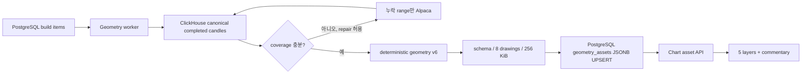

# Chart Geometry Assets

Chart Geometry Asset은 완료된 실제 OHLCV 봉에서 현재 지지·저항, 대각 추세와 가격
패턴을 계산해 차트에 적용하는 결정론적 자산이다. 계산과 hard-pass 판정은 해석,
선택된 geometry의 `drawings[]` 생성은 작도, `tradePlan`의 화면 투영은 제안 단계다.
어느 단계도 패턴 좌표나 수치를 LLM으로 계산하지 않는다.

## 지원 범위와 호환성

- 새 생성·재생성 interval은 `1m`, `1D`뿐이다.
- `5m`, `10m`, `1h`, `4h`, `1W`의 기존 PostgreSQL row는 GET, 표시, 선택 DELETE
  호환을 유지하지만 새 build envelope에는 넣을 수 없다.
- `assetVersion="geometry"`는 유지하고 현재 알고리즘은
  `ohlcv-consensus-pattern-families-v6`이다.
- 좌표는 해당 interval의 canonical completed candle timestamp와 가격만 사용한다.
- 자산 하나는 지지·저항 최대 4개, 최고 추세/채널 최대 1개, 최고 패턴 최대 3개로
  `drawings[]` 8개를 넘지 않는다.
- payload는 canonical UTF-8 JSON 기준 256 KiB 이하이며 초과한 결과는 저장하지 않는다.
- v6 필드는 모두 `geometry` 아래 optional이다. 구자산과 v6 자산을 같은 API가 읽는다.

## 지지·저항

확정 레벨은 ATR 가격 구간의 최소 3회 독립 접촉, 2회 반응, interval별 최근성,
현재 관련성을 통과해야 한다. 완료 봉 종가 돌파는 역할을 중단하며 거짓 돌파 복귀나
구간 재테스트를 확인한 뒤에만 역할을 복구하거나 전환한다.

한 role에 확정 레벨이 없을 때만 기존 `contextual` 후보를 허용한다. contextual도
없을 때만 활성 또는 유효한 role-flip, 접촉 2회, 반응 1회, role 방향, 최근성,
현재가 4 ATR 이내를 모두 통과한 후보를 `reference`로 허용한다. single swing,
role 충돌, break-pending 후보는 reference가 될 수 없다. role별 최대 2개를 저장하고
겹치는 zone은 tier, 점수, 반응, 접촉, 최근성, 가격, stable ID 순으로 억제한다.

표시 위계는 다음과 같다.

| importance | 대상 | 선 표현 | 라벨 |
| --- | --- | --- | --- |
| `major` | role별 첫 confirmed | 3px, 0.95, solid | 지지/저항 |
| `standard` | 두 번째 confirmed 또는 contextual | 2.25px, 0.82, `[6,4]` | 보조 지지/저항 |
| `minor` | reference | 1.5px, 0.62, `[2,4]` | 참고 지지/저항 |

구자산처럼 importance metadata가 없으면 기존 2.5px 표현을 사용한다. 프런트는 레벨을
재계산하거나 재병합하지 않는다.

## 추세선과 채널

대각 추세는 공통 구조 피벗에서 계산한다. 최소 3회 접촉과 2회 반응, span, 중앙
residual, 현재 거리, 마지막 접촉 최근성, invalidation, adverse close 게이트를 모두
통과한 최고 점수 후보 하나만 `primaryTrend`로 저장한다. 적격 후보가 없으면
`trends=[]`, `primaryTrend=null`이 정상 결과다.

일반 상승·하락선은 두 anchor의 `trendLine`이다. 평행 채널은 기준선 anchor 두 개와
offset anchor 하나, `parallelLineCount=2`를 가진 단일 `trendParallelLines` drawing이다.
따라서 채널도 drawing budget 하나만 사용한다. 저장 trend에는 피벗 참조, 접촉·반응 수,
ATR/bar 기울기, residual, 현재 거리, 최근성 및 채널 폭·평행 오차·containment를 포함한다.

## 패턴과 매매 시나리오

v6는 기존 패턴 detector, ranking, hardPass, confirmation, `tradePlan`, primary 선택과
패턴 drawing을 그대로 유지한다. 지원 패턴은 상승·하락·대칭 삼각형, 상승·하락
깃발형/페넌트/직사각형, 상승·하락 쐐기, 하락 채널 상단 돌파, 상승 채널 하단 이탈이다.
`patterns[]`에는 활성 hard-pass 후보를 저장하고 `primaryPattern`만 작도한다.
`primaryTriangle`/`historicalTriangle`은 구독자 호환 필드다.

`tradePlan`은 주문이 아니라 차트 표시용 시나리오다. `forming`은 관찰만 하고
`confirmed`만 신호를 낸다. 돌파, 무효화, 목표, 손익비는 서버가 ATR 정규화 값으로
계산하며 프런트가 다시 계산하지 않는다.

## 해석 trace

신규 writer의 `analysisTrace.version`은 `geometry-analysis-trace-v2`이며 reader는 기존
v1도 계속 받는다. levels, trends, patterns가
같은 `compute_pivots()` 결과를 공유하며 trace에는 선택 후보와 탈락 후보, 근거 피벗,
접촉·반응 episode, reject reason과 표시용 metrics를 담는다. 기존 `_pivot_evidence()`
payload는 구자산 호환 필드일 뿐 신규 trace의 원천이 아니다.

v2는 detector가 중복 제거와 후보 구성을 마친 뒤 ranking에 전달한 후보와 접촉 episode를
생략하지 않는다. `disposition`, category rank, selection/reject reason, drawing type,
extension, channel/segment 정보를 저장하며 `completeness`의 detected/stored 수가 같아야
한다. 참조된 pivot만 registry에 남기고 dangling reference를 허용하지 않는다. 전체
payload가 256 KiB를 넘으면 후보를 자르지 않고 저장을 실패시킨다. trace는 persistent
drawing으로 변환하지 않고 프런트의 비영속 Canvas overlay가 소비한다.

## 데이터와 PostgreSQL 저장 흐름

저장 원본은 `chart_assets.geometry_assets`이며 `(symbol, interval)`당 최신 JSONB row
하나다. 더 최신 `generatedAt`, 또는 같은 시각의 다른 canonical payload digest만
조건부 UPSERT한다. 빌드·검증·저장 중 실패하면 기존 성공 row를 보존한다. 캔들 원본과
repair materialization은 계속 ClickHouse에 있고 Geometry asset을 ClickHouse에
저장하거나 dual-write하지 않는다. S3, Redis, Kafka, LLM도 자산 저장 경로에 없다.

운영에서 repair가 활성화되고 Alpaca credential이 있을 때만 실제 누락 range를 보충한다.
Alpaca가 성공했지만 실제 봉이 없는 slot은 `provider_confirmed_empty`로 기록하며 가짜
봉을 만들지 않는다. 이 경우에도 `coverage.contiguousBars`는 보정값이 아니라 실제 관측
연속 봉 수를 유지한다. 로컬 테스트와 acceptance는 저장 fixture 및 주입식 candle loader를
사용하고 repair를 끄므로 Alpaca API key나 외부 호출이 필요하지 않다.

## 빌드 정책

- API와 내부 build envelope 모두 `1m/1D`만 받으며 기본값도 두 interval이다.
- worker는 `scheduled` item을 candle 조회 전에 `manual_refresh_only`로 종료한다.
- 일반 manual build는 없는 자산만 만든다. 기존 row 교체는 선택한 symbol/interval의
  `manual + force`에서만 가능하다.
- `symbols="sp500"`과 `force=true` 조합은 API에서 400으로 거절한다.
- 같은 source/force/symbol/interval의 active 요청은 하나의 PostgreSQL job으로 합친다.
- 수동 priority는 100이고 최대 2회 처리 뒤 만료된 lease는 실패로 종결한다.
- 배포 시 기존 row를 일괄 재생성하거나 DB schema/data migration을 실행하지 않는다.

## 화면 레이어와 해설

자동 분석은 `해석`, `저항(지지·저항)`, `추세`, `패턴`, `제안`의 다섯 레이어로
나뉜다. 초기값은 해석·제안 OFF, 나머지 ON이다. `drawingGroups`가 levels/trend/pattern
drawing ID의 원본이며 구자산은 stable ID와 geometry metadata로 호환 분류한다.
SMA60/120과 최근 교차는 추세 레이어가 소유한다. 제안 OFF는 메모리 trade plan을
삭제하지 않고 표시와 제안 가격의 Y축 반영만 중단한다.

해설은 지지·저항, 추세, 패턴 세 항목으로 분리한다. hover는 해당 작도만 강조하고 같은
trace에서 최종 선택된 후보의 피벗·접촉·반응만 임시 overlay로 표시한다. 글로벌 해석은
v2 전체 후보를 H-line, ray, 채널, 패턴 segment로 표시하고 v1/legacy는 일부 후보 또는
근거만 제공한다. 클릭은 한 항목의 서버 metrics 카드를
확장·고정하며 다른 항목 hover가 끝나면 고정 항목으로 복귀한다. 해석 글로벌 토글이
꺼져 있어도 해설 hover의 관련 subset은 표시할 수 있다. 이 overlay와 제안 projection은
PostgreSQL drawing 8개, undo/history/export에 포함되지 않으며 주문 API를 호출하지 않는다.
