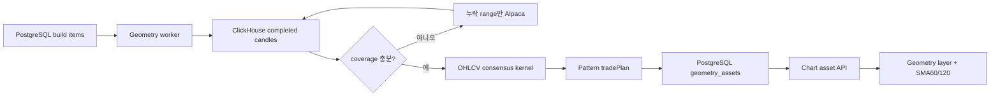

# Chart Geometry Assets

Chart Geometry Asset은 완료된 실제 OHLCV 봉에서 현재 지지·저항과 가격 패턴을
계산해 차트에 적용하는 결정론적 자산이다. 패턴 좌표나 판정에 LLM을 사용하지 않는다.

## 지원 범위

- interval: `1m`, `5m`, `10m`, `1h`, `4h`, `1D`, `1W`
- geometry: 지지선 최대 2개, 저항선 최대 2개, 최고 점수 패턴 1개를 최대 8개 drawing으로 표현
- 패턴: 상승·하락·대칭 삼각형, 상승·하락 깃발형/페넌트/직사각형, 상승·하락 쐐기,
  하락 채널 상단 돌파, 상승 채널 하단 이탈
- 매매 시나리오: 확인된 최고 점수 패턴의 진입 후보·손절·목표·손익비를 `tradePlan`으로 제공
- 보조지표: 선택 interval의 완료 봉 개수 기준 SMA60·SMA120과 최근 교차
- 좌표: 해당 interval에 실제로 존재하는 canonical candle timestamp와 가격
- intraday: `1m` 실제 정규장 봉, `5m/10m/1h/4h`는 09:30 ET 기준 파생 봉

패턴은 방향전환 피벗과 회귀 경계선에서 깃대 유무, 두 경계의 기울기·평행성·수렴률,
내부 포함률, 종가 돌파 방향을 판정한다. 깃발형·페넌트·직사각형은 선행 impulse를
요구하고, 채널 이탈은 종가 돌파가 거래량 또는 다음 봉 유지로 확인된 경우만 표시한다.
신규 자산은 `confirmation`에 `breakoutAt`, `confirmedAt`, `mode`, `boundaryPrice`,
`penetrationAtr`, `relativeVolume`을 저장한다. 이 값은 해설의 확인 근거이며 기존 자산은
필드가 없어도 읽을 수 있다.
`patterns[]`에는 활성 hard-pass 후보를 저장하고 `primaryPattern`만 작도한다. 삼각형
호환 필드인 `primaryTriangle`/`historicalTriangle`도 유지한다. 지지·저항은 별도의
OHLCV 접촉 증거 계산을 계속 사용한다.

표시하는 확정 지지·저항은 ATR 기반 가격 구간에서 최소 3회 독립 접촉과 2회 반응을
확인하고, 마지막 접촉이 interval별 유효 기간 안에 있으며 현재가가 2 ATR 이내인
후보만 사용한다. 완료 봉 종가 돌파는 즉시 기존 역할을 중단하며, 거짓 돌파 복귀
또는 구간 재테스트가 확인된 경우에만 역할을 복구·전환한다.
Geometry v5는 확정 레벨 중 한 역할이 비어 있을 때에만 활성 상태, 3회 접촉, 1회 반응,
주기별 최근성, 현재가 3 ATR 이내를 만족한 가장 가까운 레벨을 `contextual`로 최대 1개
보완한다. 이 공개 단계 선택은 피벗·패턴·점수·`geometryHash`·`tradePlan`에 입력되지 않는다.
저장 자산의 지지·저항에는 중심 가격과 함께 `role`, `zoneLow`, `zoneHigh`,
`halfWidthAtr`, `selectionTier`가 포함될 수 있다. 프런트는 이 값을 다시 계산하거나
병합하지 않으며 자동 지지·저항은 2.5px 단일 H-Line으로 표시한다. 가격 패턴 경계는
3.5px 실선과 패턴 이름·상태로 표시한다. 기존 v3/v4 자산과 metadata가 없는 자산도
읽기 호환한다.

`tradePlan`은 주문이 아니라 차트 표시용 시나리오다. `forming`은 관찰만 하고
`confirmed`에서만 신호를 낸다. 돌파 기준은 패턴 경계에서 `0.25 ATR` 바깥의 완료 봉
종가이며, 신규 진입 손절은 반대 경계와 돌파선에서 `1 ATR` 떨어진 가격 중 더 가까운
유효 무효화 가격을 사용한다. 목표가는 깃발형·페넌트는 깃대 길이, 나머지는 패턴의
최대 높이를 돌파선에 투영한다. 신규 매수·공매도 시나리오는 손익비 `2.0` 이상만
후보로 표시한다. 기본 운영 모드는 long-only라 하락 확인은 메인 UI에서 `매도 후보`로
표시한다.

## 데이터와 저장 흐름

차트 자산 하위 시스템은 S3, Redis, Kafka, LLM을 사용하지 않는다. 파생 intraday가
부족하면 `5m/10m`은 Alpaca `1Min`, `1h/4h`는 Alpaca `10Min` 원본을
ClickHouse에 보충하고 같은 공통 정규장 집계기로 상위 봉을 저장한 뒤 재조회한다.
다른 GOPS 하위
시스템의 해당 인프라 사용에는 영향을 주지 않는다. `1W`는 기존처럼 ClickHouse의
canonical `1D`를 집계하며 Alpaca native 주봉을 저장하지 않는다.

목표 완료 봉은 인트라데이와 `1D`가 380개, `1W`가 312개다. 최신까지 연속된 완료
봉이 120개 이상이고 과거 head만 부족하면 partial 자산을 허용한다. 중간이나 최신
결측은 보충 후에도 남으면 실패하며 기존 성공 자산을 교체하지 않는다. 단, 성공한
Alpaca 요청에도 실재 봉이 없는 무거래 slot은 `provider_confirmed_empty`로 인정하며
가짜 봉을 만들지 않는다.

## 실행

> 해설·질문 UI 통합 배포에서는 아래 builder 운영 절차를 실행하지 않는다. 이미 저장된
> `geometry_assets`를 읽기 전용으로 사용하며 FORCE 재생성, 전체 종목 재등록, chart asset
> migration Job, Geometry CronJob 중지·변경을 하지 않는다.

- API 패널은 새 빌드를 `1m/1D`로 제한하고 두 interval을 기본 선택한다.
- worker는 `scheduled` 요청을 candle 조회·복구·분석·저장 전에 `manual_refresh_only`로
  종료한다. 기존 자산 교체는 선택한 symbol/interval의 `manual + force` 요청만 허용한다.
- 개발 패널의 일반 수동 빌드는 없는 자산만 만들고, 기존 자산 갱신은 별도 확인을 거친
  `선택 자산 수동 갱신`으로만 실행한다. S&P500 전체 강제 갱신 동작은 제공하지 않는다.
- 수동 작업 priority 100 계약은 유지한다.
- 동일 source/force/symbol/interval의 실행 중 요청은 하나의 job으로 합친다.
- 기존 scheduler가 요청을 등록해도 builder의 read-only 경계에서 처리하지 않는다.
- 수동 실행 스크립트도 기본적으로 `1m/1D`만 등록한다.
- 빌드 상태는 PostgreSQL polling으로 확인한다.
- 자산 현황 목록은 `symbol + interval`별 대표 패턴의 한국어 이름, 상태, 점수를 표시한다.
  새 자산은 `primaryPattern`, 기존 삼각형 자산은 `primaryTriangle`을 사용한다.
- 최대 2회 처리 뒤 lease가 만료된 item은 실패로 종결해 영구 대기를 막는다.
- 기존 PostgreSQL 설치는 migration Job을 다시 실행해 작도 상한과 queue index를 적용한다.

새 완료 봉 때문에 stale이 된 자산은 차트에서 제거하지 않고 낮은 불투명도로 표시한다.
현재 symbol과 interval이 모두 일치하는 자산만 적용한다. 자동 분석 drawing은
`chart-asset:` 근거 레이어와 `chart-plan:` 제안 레이어로 나누며 차트의 `작도`, `제안`
토글로 각각 표시한다. 토글은 사용자 수동 작도를 변경하지 않는다.
최근 SMA60/120 교차가 있으면 두 선분의 실제 보간 교차점에 `flagMarker`를 표시한다.
`timestamp`는 교차 확인 봉, `previousTimestamp`는 직전 봉, `fraction`은 그 사이의
교차 비율이며 화면 x 좌표는 `previousIndex + fraction`이다. 골든크로스는 초록색,
데드크로스는 빨간색이다. y 좌표는 자산의 `price`를 사용하며 교차 구간이 현재 차트에
없으면 표시하지 않는다.
완전한 서버 `tradePlan`은 우선 사용한다. `buy_candidate`와 세 가격이 유효한
`sell_candidate`는 각각 `매수 후보`, `매도 후보`의 기준·목표·손절/무효화 가격을
프런트 `ChartTradeSetup`으로 만들고 `riskRewardBox`로 표시한다. 서버 플랜이 없으면
현재 및 가까운 저장 주기의 패턴·지지·저항만으로 조건부 setup을 결정론적으로 투영한다.
ATR 재계산, 레벨 재병합, 종목별 분기, 가짜 봉 생성은 하지 않는다. 미래 봉 timestamp는
만들지 않고 화면에서만 미래 logical index로 투영한다. 교차 마커와 이 동적 도형은 PostgreSQL geometry drawing 예산
8개에 포함하지 않으며 주문 API를 호출하지 않는다. 진입선은 확인 봉부터, 위험·보상
fill과 목표·손절 경계는 마지막 완료 봉 다음 슬롯부터 시작한다. 제안 레이어가 보일 때만
세 가격을 자동 Y축 범위에 포함한다.

완전한 신규 매수 플랜만 차트 문서별 메모리 `ActiveTradePlan`으로도 projection된다.
매도 및 조건부 setup은 `ChartTradeSetup` UI projection으로만 존재한다. 이 값들은
비영속 UI 계약이며 `gops:trade-plan-updated` 이벤트 detail은
`{ chartDocumentId, plan }`이다. 심볼·주기 변경, 자산 제거, 문서 unmount에는 해당
문서 항목만 지우고 레이어 숨김은 지우지 않는다. 해설과 spotlight는 같은 projection의
가격과 drawing ID를 사용하며 주문·알림의 신뢰 원본이 아니다.
