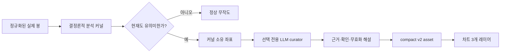
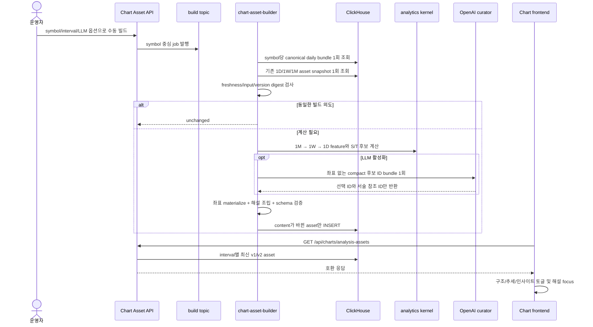
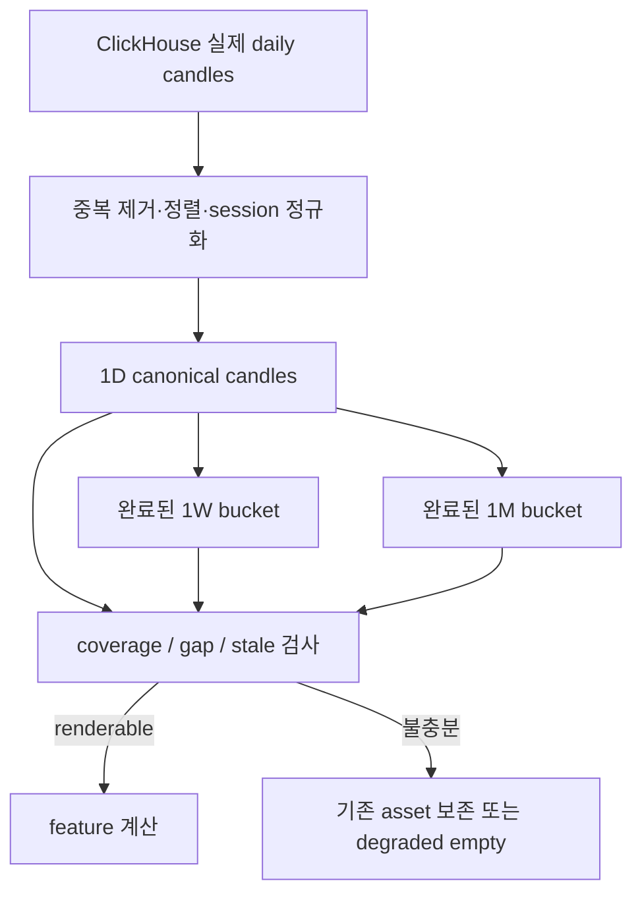
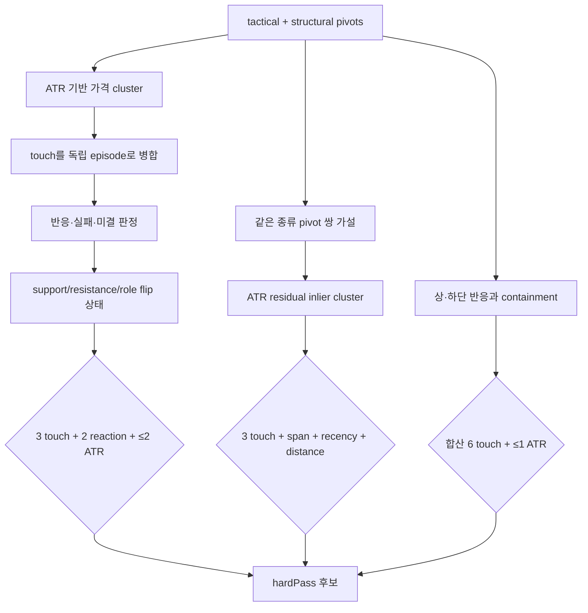
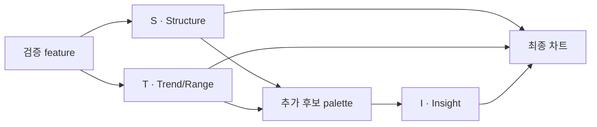
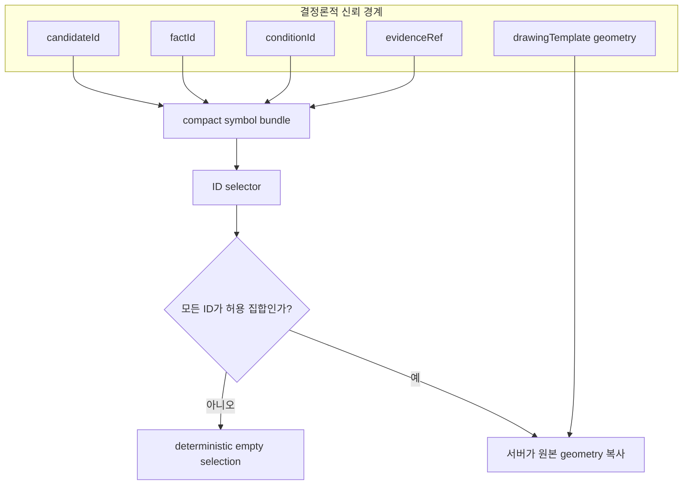
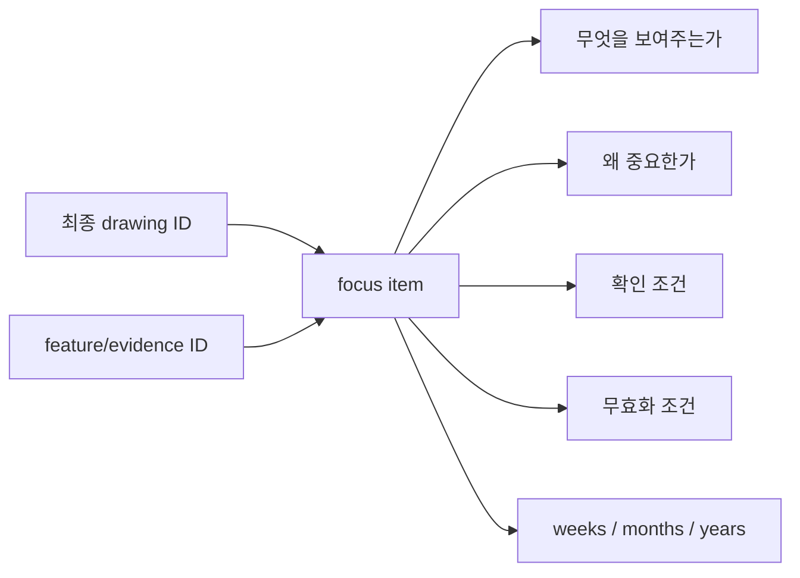
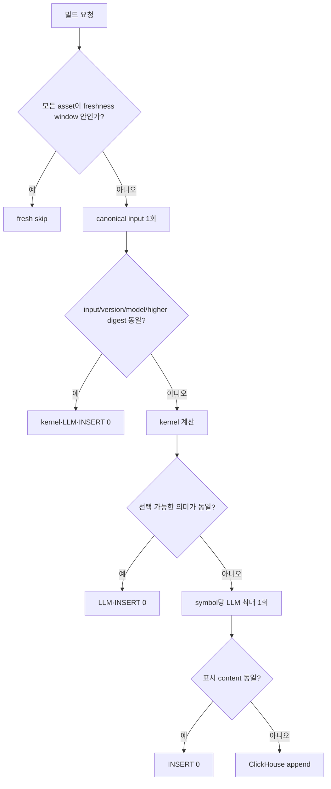
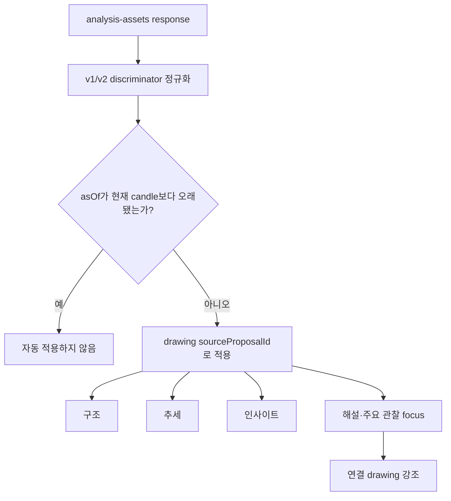

# Chart Analysis Assets

이 문서는 GOPS가 차트에 무엇을, 왜, 어떻게 제안하는지 사람이 검토할 수 있도록
설명하는 현재 설계 문서다. 구현 세부 기준은
[`CHART_ANALYSIS_ASSETS_CODEX.md`](CHART_ANALYSIS_ASSETS_CODEX.md)를 따른다.

## 한 문장 정의

Chart Analysis Asset은 과거 차트에 선을 많이 긋는 기능이 아니라, **현재 가격 판단에
영향을 주는 검증된 구조만 골라 정확한 봉 위에 표시하고 확인·무효화 조건까지 함께
전달하는 사전 계산 자산**이다.

핵심 원칙은 양보다 질이다. 품질 기준을 통과한 후보가 없으면 빈 레이어가 정답이다.

## 전체 시스템 흐름

이 빌더는 대화형 `AgentOrchestrator`와 분리된 독립 워커다. 질문창, 주문, 기존
차트 명령 경로를 호출하지 않는다.

## 데이터에서 작도까지

### 1. 실제 봉을 하나의 시간 격자로 만든다

분석은 ClickHouse의 실제 시장 데이터만 사용한다. 1D를 기준으로 1W와 1M을
결정론적으로 집계하며, 아직 닫히지 않은 주·월 봉은 제외한다. 타임스탬프는
`candleKey`와 거래 세션 규칙으로 정규화한다.

시간 좌표가 필요한 모든 anchor는 해당 interval의 실제 candle timestamp와 정확히
일치해야 한다. 따라서 Flag가 봉 사이를 가리키거나, 집계 시작 시각과 화면의 봉
위치가 어긋나는 좌표는 저장되지 않는다.

### 2. 구조를 후보로 만들고 강한 하드 게이트를 적용한다

| 구조 | 최소 증거 | 현재 관련성 | 화면 예산 |
| --- | --- | --- | --- |
| 지지·저항 | 독립 touch episode 3회, reaction 2회 | 현재가에서 2 ATR 이내, role 확정 | 지지 1 + 저항 1 |
| 추세선 | 독립 접점 3회, 충분한 span, violation 1회 이하 | 2.25 ATR 이내, 최근 접점이 display bars의 15% 이내 | 1개 |
| 채널 | 양 경계의 유효 추세와 유사 기울기, 충분한 폭 | 기반 추세의 현재 관련성 통과 | 추세 예산과 공유 |
| 박스권 | 상·하단 각 2회 이상, 합산 6회, 교대 반응, 검증 구간 containment | 현재가가 박스에서 1 ATR 이내 | 추세 예산과 공유 |
| 이벤트 | breakout/retest/gap/52주 extreme 등의 상태와 impact 검증 | interval별 age와 current impact 통과 | Flag 최대 1개 |

ATR은 종목 가격대와 변동성 차이를 정규화한다. 단순히 오래된 두 점을 연결하거나
화면 안에 있다는 이유만으로 선을 통과시키지 않는다.

### 3. 세 레이어가 역할을 나눈다

- S 레이어는 지지·저항과 현재 영향도가 높은 이벤트를 표시한다.
- T 레이어는 가장 유의미한 추세선, 채널 또는 박스 하나를 표시한다.
- I 레이어는 커널이 이미 만든 가격 구간, 되돌림, 추가 이벤트 후보 중 LLM이
  선택한 것만 표시한다.

전체 rule 작도는 interval당 최대 4개 수준이며, I 레이어까지 합쳐도 전경 예산을
넘지 않는다. H-Line 라벨에는 가격을 반복하지 않는다. 가격은 차트 가격축에서
표시된다.

## LLM이 할 수 있는 일과 할 수 없는 일

LLM은 좌표, 가격, 선 종류, 자유 문장을 만들지 않는다. 후보 ID, 사실 ID, 확인 조건
ID, 상위 주기 관계 ID만 선택한다. 존재하지 않는 candidate/fact/condition/evidence
참조는 validator가 거부한다. API key 부재나 OpenAI 실패는 빌드 실패가 아니라
rule layer를 보존한 degraded asset이다.

## 해설은 작도와 함께 움직인다

각 최종 drawing은 `focusItems[].drawingIds`에 반드시 한 번 이상 연결된다.

해설은 방향 예측 신뢰도를 꾸미지 않는다. `marketDirection.score`는 `null`이고,
선택 신뢰도는 geometry 검증, 현재 관련성, 데이터 coverage만 반영한다.
`commentary.enrichment`도 현재 범위에서는 항상 `null`이다.

## 저장과 연산을 줄이는 방식

- 기존 asset은 심볼당 1회 snapshot query로 1D/1W/1M을 함께 읽는다.
- raw candle과 전체 후보는 저장하지 않고, 선택된 evidence와 regime만 compact하게
  투영한다.
- asset hard cap은 20 KiB, 운영 목표 p95는 12 KiB다.
- Redis에는 asset 본문을 저장하지 않는다. 24시간 build job 상태 문자열과 pub/sub
  채널만 사용한다.
- build log는 기존 pub/sub 채널로만 송출하고 Redis status 또는 ClickHouse에 저장하지
  않는다. 열린 개발 패널의 브라우저 메모리가 최근 200줄만 보유한다. interval별 S/T/I
  생성 엔티티 수, 정상 무작도 탈락 사유와 warning/failure 원인을 보여준다. 최종 생성
  엔티티 수는 로그 유실과 무관하게 status의 작은 정수 필드로도 전달한다.

## 사용자 화면

프런트는 asset을 원본 차트 데이터와 별개로 읽고 다음을 제공한다.

운영 패널은 S&P 500 전체 또는 콤마로 구분한 심볼을 수동 빌드한다. 자동 갱신,
질문창 연동, candle-closed 구독은 현재 범위가 아니다.

빌드가 끝나거나 개발 패널에서 자산을 삭제하면 cache invalidation을 구독한 열린 차트와
해설 패널이 같은 symbol을 즉시 다시 조회한다. 자산 현황은 최종 작도 수를 함께 보여
`ready · eligible · 작도 없음`과 저장 오류를 구분한다. 행별 삭제는 확인 후 해당
symbol/interval의 ClickHouse 전체 자산 이력을 동기 mutation으로 제거한다.

## 현재 검증 상태

- 13개 실제 Nasdaq 일봉 series와 172개 as-of episode를 재사용한다.
- AAPL, AMZN, GOOGL, NVDA, MU는 로컬 데이터가 상대적으로 충분한 통합 표본이다.
  품질 로직은 이 종목들에 특화하지 않는다.
- golden corpus에서 anchor 불일치와 H-Line 가격 라벨 위반은 0건이다.
- 실제 OpenAI smoke, 12-case pilot, 동일 bundle 반복 안정성을 확인했다.
- ClickHouse → builder → ClickHouse → FastAPI serving 관통과 동일 입력 no-op을
  확인했다.
- 자동 rubric 결과는 회귀 신호일 뿐 전문가 평가를 대신하지 않는다. production
  rollout 전 human blind review가 필요하다.
- 로컬 Alpaca API는 사용할 수 없는 환경을 전제로 하며, 검증은 기존 ClickHouse
  데이터와 고정된 실제 공개 데이터 fixture로 수행한다. 가짜 시장 봉은 금지한다.

## 주요 코드 위치

| 책임 | 위치 |
| --- | --- |
| 정규 candle·coverage | `systems/market-data/shared/alfaka/analytics/analysis_candles.py` |
| pivot·level·trend·event | `systems/market-data/shared/alfaka/analytics/` |
| S/T compiler | `systems/agent-orchestration/shared/gops_agents/chart_assets/compilers.py` |
| 후보·LLM 경계 | `systems/agent-orchestration/shared/gops_agents/chart_assets/curation.py`, `llm.py` |
| 해설 | `systems/agent-orchestration/shared/gops_agents/chart_assets/commentary_v2.py` |
| symbol 중심 빌드 | `systems/agent-orchestration/shared/gops_agents/chart_assets/builder.py` |
| 저장·API | `chart_assets/storage.py`, `systems/api-server/.../routes/chart_assets.py` |
| 프런트 | `apps/gops-frontend/src/chart/analysisAssetsApi.ts`, `analysisAssetPresentation.ts` |
| 계약 | `shared/chart-contract/chart-analysis-asset.schema.json` |
| 평가 | `scripts/local/eval-chart-assets-v2.py` |
