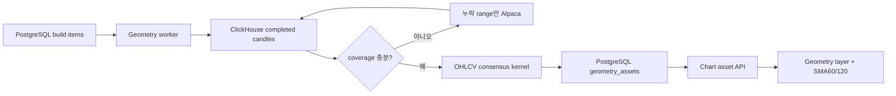

# Chart Geometry Assets

Chart Geometry Asset은 완료된 실제 OHLCV 봉에서 현재 지지·저항과 삼각형만 계산해
차트에 적용하는 결정론적 자산이다. LLM 해설이나 다른 패턴을 생성하지 않는다.

## 지원 범위

- interval: `1m`, `5m`, `10m`, `1h`, `4h`, `1D`, `1W`
- geometry: 지지선 최대 2개, 저항선 최대 2개, 최고 삼각형 1개(선 2개)
- 삼각형: 상승, 하락, 대칭
- 보조지표: 선택 interval의 완료 봉 개수 기준 SMA60·SMA120과 최근 교차
- 좌표: 해당 interval에 실제로 존재하는 canonical candle timestamp와 가격

삼각형은 방향전환 피벗의 최근 연속 묶음을 회귀선으로 적합한 뒤 상승·하락·대칭
형태를 판정한다. 경계마다 최소 2회, 전체 최소 5회 접촉과 수렴·내부 포함 조건을
통과한 형성 중 또는 돌파 확인 후보 중 최고 점수 1개만 표시한다. 지지·저항은 별도의
OHLCV 접촉 증거 계산을 계속 사용한다.

## 데이터와 저장 흐름

차트 자산 하위 시스템은 S3, Redis, Kafka, LLM을 사용하지 않는다. 다른 GOPS 하위
시스템의 해당 인프라 사용에는 영향을 주지 않는다. `1W`는 기존처럼 ClickHouse의
canonical `1D`를 집계하며 Alpaca native 주봉을 저장하지 않는다.

목표 완료 봉은 인트라데이와 `1D`가 380개, `1W`가 312개다. 최신까지 연속된 완료
봉이 120개 이상이고 과거 head만 부족하면 partial 자산을 허용한다. 중간이나 최신
결측은 보충 후에도 남으면 실패하며 기존 성공 자산을 교체하지 않는다.

## 실행

- API 패널에서 symbol/interval을 선택해 PostgreSQL 작업을 등록한다.
- 평일 KST 08:40 CronJob이 S&P500 전체 7개 interval 작업을 멱등 등록한다.
- 수동 실행은 `scripts/aws/run-chart-geometry-build-job.sh`를 사용한다.
- 빌드 상태는 PostgreSQL polling으로 확인한다.

새 완료 봉 때문에 stale이 된 자산은 차트에서 제거하지 않고 낮은 불투명도로 표시한다.
현재 symbol과 interval이 모두 일치하는 자산만 적용한다.
