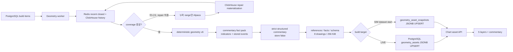

# Chart Geometry Assets

Chart Geometry Asset은 완료된 실제 OHLCV 봉에서 현재 지지·저항, 대각 추세와 가격
패턴을 계산해 차트에 적용하는 결정론적 자산이다. 계산과 hard-pass 판정은 해석,
선택된 geometry의 `drawings[]` 생성은 작도, `tradePlan`의 화면 투영은 제안 단계다.
어느 단계도 패턴 좌표나 수치를 LLM으로 계산하지 않는다.

선택적으로 root `commentary`에는 Geometry 생성 직후의 동일 완료 봉, 최종 작도,
결정론적 보조지표, 저장된 뉴스·실적만을 편집한 비개인화 LLM 종합 해설을 넣는다.
LLM은 geometry 계산이나 가격 생성에 참여하지 않으며 사용자·계좌·포트폴리오 정보도
입력받지 않는다.

## 지원 범위와 호환성

- 새 생성·재생성 interval은 `1m`, `1D`뿐이다.
- `5m`, `10m`, `1h`, `4h`, `1W`의 기존 PostgreSQL row는 GET, 표시, 선택 DELETE
  호환을 유지하지만 새 build envelope에는 넣을 수 없다.
- `assetVersion="geometry"`는 유지하고 현재 알고리즘은
  `ohlcv-consensus-pattern-families-v6`이다.
- 좌표는 해당 interval의 canonical completed candle timestamp와 가격만 사용한다.
- 자산 하나는 지지·저항 최대 4개, 최고 추세/채널 최대 1개, 최고 패턴 최대 3개로
  `drawings[]` 8개를 넘지 않는다.
- payload는 canonical UTF-8 JSON 기준 256 KiB 이하이며 초과한 결과는 저장하지 않는다.
- v6 필드는 모두 `geometry` 아래 optional이다. 구자산과 v6 자산을 같은 API가 읽는다.

## 지지·저항

확정 레벨은 ATR 가격 구간의 최소 3회 독립 접촉, 2회 반응, interval별 최근성,
현재 관련성을 통과해야 한다. 완료 봉 종가 돌파는 역할을 중단하며 거짓 돌파 복귀나
구간 재테스트를 확인한 뒤에만 역할을 복구하거나 전환한다.

한 role에 확정 레벨이 없을 때만 기존 `contextual` 후보를 허용한다. contextual도
없을 때만 활성 또는 유효한 role-flip, 접촉 2회, 반응 1회, role 방향, 최근성,
현재가 4 ATR 이내를 모두 통과한 후보를 `reference`로 허용한다. single swing,
role 충돌, break-pending 후보는 reference가 될 수 없다. role별 최대 2개를 저장하고
겹치는 zone은 tier, 점수, 반응, 접촉, 최근성, 가격, stable ID 순으로 억제한다.

표시 위계는 다음과 같다.

| importance | 대상 | 선 표현 | 라벨 |
| --- | --- | --- | --- |
| `major` | role별 첫 confirmed | 2.5px, 0.88, solid | 지지/저항 |
| `standard` | 두 번째 confirmed 또는 contextual | 1.75px, 0.78, `[7,4]` | 보조 지지/저항 |
| `minor` | reference | 1.25px, 0.68, `[2,4]` | 참고 지지/저항 |

구자산처럼 importance metadata가 없으면 기존 2.5px 표현을 사용한다. 프런트는 레벨을
재계산하거나 재병합하지 않는다.

## 추세선과 채널

대각 추세는 공통 구조 피벗에서 계산한다. 최소 3회 접촉과 2회 반응, span, 중앙
residual, 현재 거리, 마지막 접촉 최근성, invalidation, adverse close 게이트를 모두
통과한 최고 점수 후보 하나만 `primaryTrend`로 저장한다. 적격 후보가 없으면
`trends=[]`, `primaryTrend=null`이 정상 결과다.

일반 상승·하락선은 두 anchor의 `trendLine`이다. 평행 채널은 기준선 anchor 두 개와
offset anchor 하나, `parallelLineCount=2`를 가진 단일 `trendParallelLines` drawing이다.
따라서 채널도 drawing budget 하나만 사용한다. 저장 trend에는 피벗 참조, 접촉·반응 수,
ATR/bar 기울기, residual, 현재 거리, 최근성 및 채널 폭·평행 오차·containment를 포함한다.

## 패턴과 매매 시나리오

v6는 기존 패턴 detector, ranking, hardPass, confirmation, `tradePlan`, primary 선택과
패턴 drawing을 그대로 유지한다. 지원 패턴은 상승·하락·대칭 삼각형, 상승·하락
깃발형/페넌트/직사각형, 상승·하락 쐐기, 하락 채널 상단 돌파, 상승 채널 하단 이탈이다.
`patterns[]`에는 활성 hard-pass 후보를 저장하고 `primaryPattern`만 작도한다.
`primaryTriangle`/`historicalTriangle`은 구독자 호환 필드다.

저장된 `tradePlan`은 주문이 아니며 confirmed 패턴의 자격과 신호 시점을 제공한다.
상승은 `buy_candidate/long`, 하락은 보유분 매도 검토인 `sell_candidate/exit_long`만
생성하며 공매도 진입 시나리오는 없다. 화면의 제안 가격은 이를 그대로 복사하지 않고
현재 interval의 작도를 가격으로 번역한다. 신규 포지션 박스는 `buy_candidate`만 표시한다.
상승 패턴, 완전한 최종 H-line 세트, 활성 평행 채널 순으로 매수 setup을 찾고, 부족할 때만
최종 level/추세와 stale·breach·invalidation이 없는 hard-pass level 후보 또는 확인 피벗을
제한적으로 조합한다. 세 가격은 모두 근거 ID를 가지며 최근 종가, 2R 투영, 다른 interval은
사용하지 않는다. 비최종 근거는 proposal 전용 비영속 guide로 함께 표시한다.

## 해석 trace

신규 writer의 `analysisTrace.version`은 `geometry-analysis-trace-v2`이며 reader는 기존
v1도 계속 받는다. levels, trends, patterns가
같은 `compute_pivots()` 결과를 공유하며 trace에는 선택 후보와 탈락 후보, 근거 피벗,
접촉·반응 episode, reject reason과 표시용 metrics를 담는다. 기존 `_pivot_evidence()`
payload는 구자산 호환 필드일 뿐 신규 trace의 원천이 아니다.

v2는 detector가 중복 제거와 후보 구성을 마친 뒤 ranking에 전달한 후보와 접촉 episode를
생략하지 않는다. `disposition`, category rank, selection/reject reason, drawing type,
extension, channel/segment 정보를 저장하며 `completeness`의 detected/stored 수가 같아야
한다. 참조된 pivot만 registry에 남기고 dangling reference를 허용하지 않는다. 전체
payload가 256 KiB를 넘으면 후보를 자르지 않고 저장을 실패시킨다. trace는 persistent
drawing으로 변환하지 않고 프런트의 비영속 Canvas overlay가 소비한다.

## 데이터와 PostgreSQL 저장 흐름

저장 원본은 `chart_assets.geometry_assets`이며 `(symbol, interval)`당 최신 JSONB row
하나다. 기존 row보다 과거 `asOf`는 저장하지 않으며, 같은 `asOf`에서는 더 최신
`generatedAt` 또는 같은 시각의 다른 canonical payload digest만 조건부 UPSERT한다.
빌드·검증·저장 중 실패하면 기존 성공 row를 보존한다. 캔들 원본과
repair materialization과 해설용 뉴스·실적 조회는 계속 ClickHouse에 있고 Geometry
asset을 ClickHouse에 저장하거나 dual-write하지 않는다. LLM은 검증된 `commentary`
optional field만 PostgreSQL JSONB에 합치며 prompt와 전체 fact pack은 저장하지 않는다.
S3, Redis, Kafka는 자산 저장 경로에 없다. 시뮬레이션 자산은
`chart_assets.geometry_asset_snapshots`에 `(dataset_id, symbol, interval)`별로 별도
저장한다. replay GET은 이 snapshot을 읽기만 하고 Geometry나 LLM을 런타임에 실행하지 않는다.
고정 시연 dataset의 `NVDA/1D` 수동 build만 cutoff canonical 결과에 검증된 하락 쐐기
geometry를 마지막 완료 봉 시각 안으로 투영한 뒤, 같은 geometry 기반 v5 commentary와 함께
단일 snapshot으로 저장한다. projection 또는 해설 검증이 실패하면 기존 snapshot 전체를
보존한다. 구 snapshot의 runtime 호환 작도에는 해설을 섞지 않고 재생성 필요 상태를 반환한다.

차트 runtime은 현재 symbol·interval의 candle snapshot과 저장 commentary 경량 projection을
병렬로 읽는다. 해설 projection은 asset identity, commentary, 최종 drawing ID만 포함한다.
전체 Geometry 자산은 첫 candle scene을 먼저 렌더한 뒤 후순위로 읽고, 이때 같은 identity의
해설은 유지한 채 차트 연동만 활성화한다. ChartPanel과 연결된 해설 패널은 document runtime
snapshot을 공유하며 별도 전체-interval 조회를 만들지 않는다. interval query가 있는 전체
자산 GET은 해당 PostgreSQL row 하나만 반환하고, interval 없는 기존 전체 조회만 호환용으로 유지한다.

운영에서 repair가 활성화되고 Alpaca credential이 있을 때만 실제 누락 range를 보충한다.
Alpaca가 성공했지만 실제 봉이 없는 slot은 `provider_confirmed_empty`로 기록하며 가짜
봉을 만들지 않는다. 이 경우에도 `coverage.contiguousBars`는 보정값이 아니라 실제 관측
연속 봉 수를 유지한다. 로컬 테스트와 acceptance는 저장 fixture 및 주입식 candle loader를
사용하고 repair를 끄므로 Alpaca API key나 외부 호출이 필요하지 않다.

## 빌드 정책

- API와 내부 build envelope 모두 `1m/1D`만 받으며 기본값도 두 interval이다.
- worker는 `scheduled` item을 candle 조회 전에 `manual_refresh_only`로 종료한다.
- 개발 패널은 개별 symbol의 `작도 자산 생성·갱신` 동작만 제공한다. LIVE 대상은 선택한
  `1m/1D`를 `manual + force`로 실행한다. 활성 SIM 대상은 서버가 고정한 dataset ID와 시작
  시각 이하의 저장 canonical candle/news/earnings만 사용해 snapshot을 만든다. 움직이는
  virtual time을 cutoff로 쓰거나 replay 중 자동 생성하지 않는다. 완료 결과에는 target,
  dataset/cutoff, algorithm version, 저장 as-of, trace mode,
  category별 후보 수와 write 검증을 표시하며 실패 시에는 기존 row 유지 여부를 명시한다.
  고정 시연 dataset의 `NVDA/1D`는 pattern·level·trend·proposal과 v5 commentary의 identity 및
  drawing reference까지 모두 검증된 경우에만 같은 snapshot을 교체한다.
- 실패분은 별도 실행 종류로 분리하지 않고 같은 선택과 버튼으로 다시 실행한다. 수동
  S&P500 force 갱신은 개발 패널에 노출하지 않는다.
- `symbols="sp500"`과 `force=true` 조합은 API에서 400으로 거절한다.
- 같은 source/force/symbol/interval의 active 요청은 하나의 PostgreSQL job으로 합친다.
- 수동 priority는 100이고 최대 2회 처리 뒤 만료된 lease는 실패로 종결한다.
- 배포 시 기존 LIVE row나 snapshot을 일괄 재생성하지 않는다. append-only snapshot table
  migration만 먼저 적용하고 필요한 종목은 개발 패널에서 수동 생성한다.

## 사전 생성 종합 해설

`commentary.version="chart-commentary.v2"`는 Geometry root의 optional 계약이다. builder는
동일 canonical candle에서 SMA20/60/120, EMA20, RSI, MACD, Bollinger, 거래량과 최근
120봉 Volume Profile을 계산하고, 최종 geometry와 최대 6개의 주요 완료 봉, asset
`asOf`와 build cutoff를 넘지 않는 최근 뉴스 요약·실적을 bounded fact pack으로 만든다.
`contextDigest`는 geometry/candle/indicator/news/earnings만 포함하며 요청자나 로그인
identity에 따라 달라지지 않는다.

OpenAI writer는 Responses API의 strict JSON Schema와 `store=false`를 사용한다. 서버는
응답의 reference/drawing/indicator, 숫자·날짜, 안전 길이, 금지 투자 지시와 개인화 표현을 다시
검증한다. 출력은 제목이나 목록이 아닌 세 문단의 연속형 한국어 해설이며, 자연스러운
본문 segment만 drawing·indicator·candle·news·earnings reference에 연결한다.
`chart-commentary.ko.v5` writer는 전체 fact pack을 유지하되 본문에는 가장 중요한
작도, 대표 완료 봉 1개, 추천 지표 기본 2개·최대 3개, 뉴스·실적 이벤트 최대 1개만 선택한다.
거래량 수치는 해석에 계속 쓰지만 거래량 막대 `volume`은 신규 추천과 indicator link에서
제외하며 Volume Profile은 유지한다. 세 번째 추천은 가격 분포·모멘텀·변동성·추세 중
앞선 두 지표와 다른 근거를 추가할 때만 허용한다.
링크 segment는 36자 이하의 짧은 명사구로 제한하고 문장 종결 부호나 개행이 포함된
문장 전체 링크를 저장 전에 거절한다. v2/v3/v4 저장 자산은 계속 읽는다. 뉴스·실적
결측은 본문에서 자료 한계를 자연스럽게 밝히고 `limitations`에도 남기는 정상 결과지만 AWS required mode에서
timeout, refusal, incomplete, malformed 또는 fact 검증 실패가 발생하면 item을
`commentary_generation_failed`로 끝내고 단일 UPSERT 전에 중단하여 기존 row를 보존한다.
개발 패널은 commentary가 없는 구자산을 `저장 해설 없음 · Rule-based fallback`으로 명시한다.
provider 실패는 안전한 failure code로 분류하며 transient provider 오류와 서버 후검증
교정은 각각 최대 한 번만 재시도한다.
writer의 strict schema는 OpenAI가 지원하지 않는 JSON Schema 키워드를 배포 전 preflight와
요청 생성 시점에 거절한다. 배열 reference의 중복 여부처럼 API schema가 표현하지 않는
제약은 저장 전 서버 후검증이 담당한다. indicator가 주요 봉과 같은 evidence reference를
공유하는 것은 정상으로 허용하며, 본문에서 동일한 작도·봉·이벤트·지표 동작이 반복되면
첫 링크만 유지하고 뒤의 표현은 평문으로 결정론적으로 정규화한다.
280~360자·3문단 4문장·링크 최대 6개는 v5 writer의 문체 목표다. 정확한 목표 이탈은
재호출이나 자산 폐기 사유로 삼지 않으며, 본문은 220~500자의 안전 범위만 강제한다.
링크가 6개를 넘으면 작도·주요 봉·이벤트와 최대 3개의 추천 indicator 링크를 우선
보존하고 나머지를 평문으로 낮춘다. 주요 봉과 저장 이벤트 reference는 각각 최대 1개다.
사실에 없는 숫자·날짜·reference, 개인화 표현과 직접 투자 지시는 계속 저장을 차단한다.
작업 로그의 500자 상한에서 JSON이 잘리지 않도록 asset write verification, trace telemetry,
commentary telemetry는 독립된 로그 항목으로 기록하며 글자·문장·링크·추천 지표 수를 남긴다.
로컬 기본 provider는 disabled이며 구자산과 동일한 규칙 기반 종합 해설을 사용한다.

## 화면 레이어와 해설

자동 분석은 `해석`, `저항(지지·저항)`, `추세`, `패턴`, `제안`의 다섯 레이어로
나뉜다. 초기값은 다섯 레이어 모두 OFF다. `drawingGroups`가 levels/trend/pattern
drawing ID의 원본이며 구자산은 stable ID와 geometry metadata로 호환 분류한다.
SMA60/120은 차트 추가 도구가 소유하는 독립 보조지표이며 추세 토글이 가시성을 바꾸지
않는다. 최근 골든·데드크로스 마커만 분석 이벤트로 추세 레이어가 소유한다. 제안 OFF는
메모리 trade plan을 삭제하지 않고 표시와 제안 가격의 Y축 반영만 중단한다.

해설은 유효한 구조화 `commentary`가 있으면 본문에서 파생한 차트 연동 명사구를 먼저
흰색 compact 버튼으로 표시하고 `종합 해설 보기`를 눌렀을 때 세 문단 연속형 본문과 기존
signal 색 링크를 펼친다. 펼침·접힘은 작도 고정, 지표, 봉, 이벤트 상태를 변경하지 않으며
자산 identity가 바뀌면 다시 접힌다. commentary가 없는
구자산은 기존 규칙 기반 종합 해설로 fallback한다. 패널 상단의 별도 표는 KIS holdings API로
현재 종목의 보유 상태·평균 매입가·수량만 보여준다. 이 계좌 팩트는 저장 commentary,
LLM fact pack, context digest와 규칙 기반 종합 문장에는 전달하지 않는다. 별도 참조 태그는 만들지 않고
본문의 연결된 표현이 상호작용을 소유한다. drawing 문구는 기존 focus를, 지표 문구는 해당
차트 문서의 layer user command를, 뉴스·실적 문구는 이벤트 viewport와 popover를, 주요 봉
문구는 semantic candle 선택과 하단 질문 reference를 사용한다. 실행 가능한 본문 링크는
종류와 관계없이 signal 색과 실선 밑줄로 표시하며 재클릭으로 고정 작도·지표·봉·이벤트
상세를 해제한다. 뉴스·실적 상세를 닫아도 event marker layer는 유지한다. Volume Profile은
off/loading/ready/empty/error/unavailable 상태를 해설 링크에 동기화해 데이터 결측과 로드
실패를 숨기지 않는다. v1 block은 세 문단 평문으로
합쳐 읽되 임의 키워드 링크를 추정하지 않는다.
봉·뉴스·실적 본문 링크는 대상 봉 또는 이벤트 marker를 가격 plot 수평 중앙에 배치한 scene이
준비된 뒤 하이라이트나 상세를 연다. 1D 예정 실적만 실제 예정 시장일의 미래 slot으로 이동하며,
intraday 예정 실적은 빈 미래 구간으로 pan하지 않고 현재 plot 중앙에서 상세를 연다.
그 아래 주요 가격·시나리오와 지지·저항, 추세, 패턴 판단 근거를 유지하고 원시 metric은
`수치 근거 자세히`에 접어 둔다. hover는 해당 작도만 강조하고 같은
trace에서 최종 선택된 후보의 피벗·접촉·반응만 임시 overlay로 표시한다. 글로벌 해석은
전체 trace를 보존한 채 미선택 hard-pass 후보를 우선하고, category에 적격 후보가 없을 때만
활성 evidence-pass 근접 후보 하나를 허용한다. 최종 선택 후보 수의 2배를 기본 예산으로
최소 3개, 최대 9개만 H-line, ray, 채널, 패턴 segment로 표시하며 level/trend/pattern
상한은 각각 4/3/2다. stale, breached, invalidated, role-conflict, break-pending 후보는
근접 후보로 표시하지 않는다. 해석 ON은 이 유력 후보와 확정 level/trend/pattern drawing
전체를 넓은 실선 바탕으로 함께 표시한다. 바탕선은 그리드 위, 캔들·이평선·확정 작도 아래에
그리며 확정 작도가 꺼져도 남는다. 클릭은 한 항목의 서버 metrics 카드를
확장·고정하며 다른 항목 hover가 끝나면 고정 항목으로 복귀한다. 해석 글로벌 토글이
꺼져 있어도 해설 hover의 관련 subset은 표시할 수 있다. 이 overlay와 제안 projection은
PostgreSQL drawing 8개, undo/history/export에 포함되지 않으며 주문 API를 호출하지 않는다.

작도 위계는 패턴, 지지·저항, 추세 순이다. 색은 신규 고정값을 저장하지 않고 전역
semantic token만 사용한다. 패턴은 drawing 70%와 axis를 섞은 중립색, 지지·저항은
up/down 18%와 axis를 섞은 색, 추세는 axis 색이다. 패턴은 confirmed 3.25px/0.94,
forming 3px/0.88, 그 밖에는 3px/0.78이고 fill은 0.04다. 추세와 채널은 방향별 색상
분기 없이 1.5px/0.76 solid, fill 0.02로 표시한다. 작도 내부 이름은 표시하지 않으며
패턴명은 실제 segment가 현재 plot과 교차할 때만 plot 우측 상단 배지로 표시한다.
패턴 우측 가격축 라벨은 만들지 않는다.

해설 hover/focus는 대상의 원래 category 색을 유지한 채 opacity를 1로 올리고 선을
0.75px(최대 4.5px) 굵게 한다. 다른 분석 작도는 각 원래 opacity의 65%로 낮추되
캔들과 사용자 drawing은 더 약하게만 dim한다. 해석 레이어의 확정 바탕선과 모든 미선택
후보는 category 색의 solid 5.5px(pattern), 4.5px(level), 4px(trend), opacity 0.30으로
동일하게 표시한다. 후보의 판정 상태에 따라 opacity를 달리하지 않는다. 근거 marker는
캔들 위에 유지하며 해석 바탕선은 history, export, hit-test에 포함하지 않는다.
제안 `riskRewardBox`도 가격축 pill이나 내부 설명 chip을 만들지 않으며, 오른쪽의
클릭 가능한 DOM 라벨로 위에서부터 `수익 실현 검토`, `매수 검토`, `손실 제한 검토`를 표시한다.
각 라벨에는 `패턴 상단`, `패턴 폭`, `다음 저항선`처럼 가격 원천을 함께 표시한다.
라벨과 주요 가격 행을 hover/focus하면 해당 원천 drawing을 강조하며, 패턴 폭·깃대
길이처럼 여러 segment에서 파생된 가격은 해당 primary pattern 전체를 강조한다.
DOM 라벨은 매 scene에서 Canvas와 같은 geometry를 동기적으로 사용하며 박스 오른쪽 lane에
놓는다. 가격이 가까우면 최소 24px 간격으로 분산하고 원래 가격선에는 elbow connector를
연결한다.
시나리오 hover/focus는 제안이 꺼져 있어도 이를 임시 표시하고, 시나리오 클릭은 연결된
`chartDocumentId`의 제안 레이어만 토글한다. 최초 표시에는 projection 폭과 176px 라벨
공간을 포함한 외부 auto-frame을 한 번 적용한다.

차트 좌측 하단의 다섯 버튼은 chart hover 또는 focus-within에서만 나타나고 상태 문구는
항상 남는다. 같은 버튼은 해설 패널의 보유 현황 아래에도 리모컨으로 표시되며 두 위치는
하나의 document runtime visibility/availability를 공유한다. 해설의 지지·저항·추세·패턴
카드와 조건부 매수 시나리오 카드도 같은 상태를 구독하며 hover/focus는 임시 강조, 클릭은
대응 레이어 ON/OFF를 담당한다.

최신성은 `current`, `outdated_snapshot`, `source_invalid`로 구분한다. 새 완료 봉이 생긴
정상 자산은 당시 분석 스냅샷이므로 원래 opacity를 유지하고 `N봉 전`을 표시한다.
proposal/trade plan만 stale로 제한한다. asset as-of와 coverage watermark가 다르거나
`stale_input`인 실제 계약 오류에만 낮은 opacity를 적용한다. 완료 봉 비교는 명시적으로
`isClosed=true`인 interval canonical key만 사용한다.
