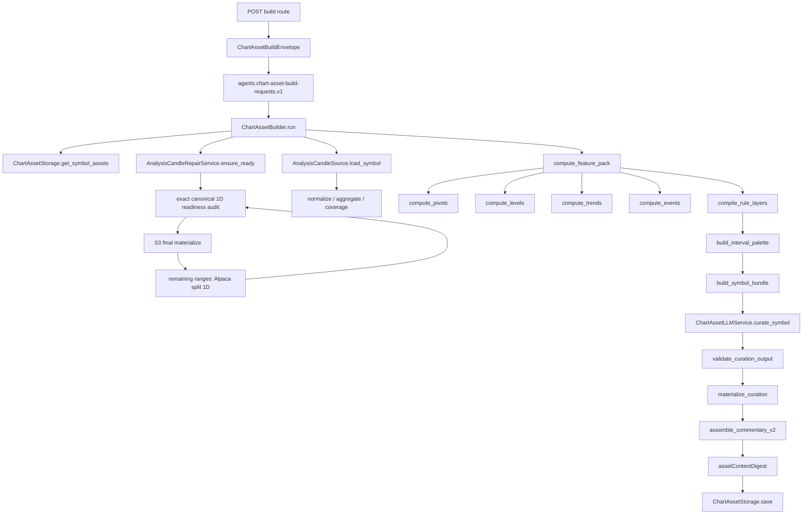
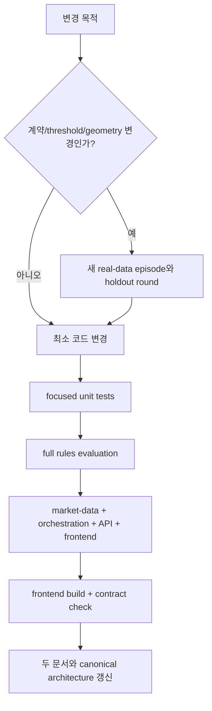

# Chart Analysis Assets — Codex Reference

이 문서는 Chart Analysis Assets를 이후 Codex가 안전하게 확장하기 위한 기술 기준서다.
사람 중심 설명은 [`CHART_ANALYSIS_ASSETS.md`](CHART_ANALYSIS_ASSETS.md)를 먼저 읽는다.

## 1. 구현 목적과 현재 상황

초기 구현은 오래된 anchor, 두 점 추세선, 현재가와 무관한 화면 밖 선처럼 수량은 많지만
판단 가치가 낮은 작도를 만들 수 있었다. 현재 구현은 다음 목표로 교체됐다.

1. 정상 무작도를 허용하고 품질을 수량보다 우선한다.
2. geometry는 결정론적 kernel만 소유한다.
3. LLM은 검증 후보의 ID만 선택한다.
4. 모든 시간 anchor는 canonical candle timestamp와 정확히 일치한다.
5. 최종 drawing마다 근거·확인·무효화 해설이 연결된다.
6. symbol당 조회·LLM·저장을 bounded하고 동일 입력을 no-op 처리한다.

현재 상태는 automated quality gate와 실스택 검증을 통과한 canary 후보다. 전문가
blind review 전 production-ready로 표시하지 않는다.

## 2. 소스 오브 트루스와 읽기 순서

변경 전 다음 순서를 지킨다.

1. 루트 `AGENTS.md`
2. 이 문서와 `CHART_ANALYSIS_ASSETS.md`
3. `CHART_DATA_ARCHITECTURE.md`
4. 변경 경계에 따라 `AGENT_ARCHITECTURE.md`, `AGENT_BACKEND_INTEGRATION.md`,
   `AGENT_FRONTEND_INTEGRATION.md`, `AGENT_AWS_BUILD.md`
5. 아래 current code와 contract schema

삭제된 `docs/plans/chart-analysis-assets-v2/` 문서는 완료된 구현 계획이므로 복원하거나
런타임 계약으로 인용하지 않는다.

## 3. 절대 불변 조건

다음 중 하나라도 깨지면 변경을 완료하지 않는다.

- 실제 시장 봉만 사용한다. 로컬 runtime에서 fake candle을 만들지 않는다.
- timed anchor는 해당 interval의 canonical candle timestamp 집합에 속한다.
- H-Line label에 가격 문자열을 넣지 않는다.
- S/T에 `hardPass=false` 후보를 materialize하지 않는다.
- 추세선·채널은 최소 3개 독립 touch와 current relevance gate를 통과한다.
- 최종 drawing ID 집합과 commentary `focusItems[].drawingIds` 합집합이 동일하다.
- LLM은 좌표·가격·도구·자유 해설을 생성하지 않는다.
- LLM의 candidate/fact/condition/evidence/relation 참조는 bundle allowlist에 있어야 한다.
- LLM 장애는 rule asset을 잃는 hard failure가 아니다.
- Redis에는 asset payload를 저장하지 않는다.
- asset JSON은 20 KiB hard cap을 넘지 않는다.
- 동일 build intent면 kernel, LLM, INSERT가 모두 0이어야 한다.
- content가 같으면 audit timestamp 차이로 INSERT하지 않는다.
- `commentary.enrichment`는 현재 `null`이다.
- 기존 v1 asset은 read compatibility만 제공한다. v1 생성 경로를 다시 만들지 않는다.

금지된 레거시 의존:

```text
systems/agent-orchestration/shared/gops_agents/chart_command/*
api-server /api/llm/*
apps/gops-frontend/src/agent/chartAgent.ts
apps/gops-frontend/src/agent/chartOperationCompiler.ts
```

`AgentOrchestrator` workflow/roles/providers도 이 기능을 위해 수정하지 않는다.

## 4. 런타임 호출 그래프



## 5. 파일별 책임

### Market-data kernel

| 파일 | 단일 책임 |
| --- | --- |
| `analytics/config.py` | interval별 lookback/display/recency 기준과 version |
| `analytics/analysis_candles.py` | canonical 1D, 완료된 1W/1M 집계, coverage, input digest |
| `analytics/analysis_repair.py` | 요청 symbol의 exact 1D 감사, bounded S3→Alpaca repair, 재검증 |
| `analytics/atr.py` | ATR 계열과 percentile |
| `analytics/pivots.py` | tactical/structural pivot과 prominence |
| `analytics/levels.py` | bounded cluster, touch episode, reaction, role state, level gate |
| `analytics/trends.py` | trend hypothesis, touch cluster, channel, range, regime |
| `analytics/events.py` | breakout/retest/gap/volume/extreme episode와 current impact |
| `analytics/schema.py` | feature pack 조립 및 품질 flag |

### Agent orchestration system의 독립 build subsystem

| 파일 | 단일 책임 |
| --- | --- |
| `chart_assets/candles.py` | market-data canonical source adapter |
| `chart_assets/compilers.py` | canonical S/T compiler와 indicator recommendation |
| `chart_assets/curation.py` | compact palette, strict ID validation, kernel geometry materialize |
| `chart_assets/llm.py` | `store:false`인 symbol-level Responses 호출 1회와 degraded fallback |
| `chart_assets/commentary_v2.py` | drawing-linked deterministic Korean commentary |
| `chart_assets/builder.py` | snapshot/candle load, digest no-op, MTF order, save orchestration |
| `chart_assets/storage.py` | ClickHouse append/read/coverage |
| `chart_assets/progress.py` | Redis job status 1개와 pub/sub |
| `chart_assets/queue.py` | 독립 Kafka topic producer |

구형 interval별 LLM geometry 생성기와 v1 compiler는 제거됐다. `compilers.py`의
`compile_rule_layers`가 유일한 canonical compiler다.

## 6. 품질 계약의 현재 값

값을 바꾸려면 fixture expectation을 먼저 보지 말고 투자적 근거를 기록한 뒤 새 holdout
round를 추가한다. 기존 holdout label을 덮어쓰지 않는다.

### Level

```text
structural pivots only
cluster seed distance <= 0.60 local ATR
cluster total width <= 0.80 median ATR
touch episodes >= 3
reaction episodes >= 2
last touch age <= interval config
current zone distance <= 2 ATR
state not unresolved / invalidated / break pending
```

### Trend line

```text
same-side structural pivot hypothesis
inlier residual <= 0.45 ATR
independent touch clusters >= 3
span >= 0.25 * displayBars
current distance <= 2.25 ATR
last touch age <= 0.15 * displayBars
close violations <= 1
abs(slope ATR per bar) >= 0.002
```

### Channel

```text
both component lines already hardPass
slope difference ratio <= 0.20
channel width > 1 median ATR
```

### Range

```text
candidate windows: 30/40/50/60/70/80% of displayBars
width >= 2 ATR
lower touches >= 2
upper touches >= 2
total touches >= 6
validation segment contains both boundaries
alternations >= 3
containment >= 0.80
current distance <= 1 ATR
directional efficiency rejection enabled
```

### Compiler budget

```text
S: nearest hardPass support 1 + resistance 1 + event flag 1
T: highest-ranked trend/channel/range 1
I: at most 2 candidates per interval, at most 6 per symbol
I available slots: max(0, 5 - ruleDrawingCount)
```

## 7. LLM trust boundary

`build_symbol_bundle`에는 raw candle과 drawing template을 넣지 않는다. 전달 가능한
필드는 compact regime, rule finding ID/fact/evidence, visual candidate ID/semantic/
fact/evidence/condition, MTF relation뿐이다.

응답 schema:

```text
intervalSelections[]
  interval
  selectedCandidateIds[]
  headlineFactIds[]
  focusNarratives[]
    refType
    refId
    factIds[]
    watchConditionRef
    priority
  counterEvidenceRefs[]
  higherTimeframeRelationIds[]
  emphasisCode
```

검증 순서:

1. strict top-level shape와 interval uniqueness
2. candidate 존재와 interval당 2개/symbol당 6개 budget
3. selected candidate와 visual focus의 일치
4. `refType`과 실제 owner 종류의 일치
5. fact owner 일치
6. visual candidate condition owner 일치
7. rule finding은 임의 condition을 가질 수 없음
8. counter evidence와 MTF relation allowlist 및 중복 검사

실패하면 output 일부를 살리지 않고 deterministic empty selection으로 degrade한다.

## 8. 버전과 digest

현재 주요 식별자:

```text
assetVersion            v2
kernelVersion           kernel-v2
qualityPolicyVersion    chart-quality-v1
promptVersion           prompt-v2
modelPolicyVersion      chart-asset-model-v1
assemblerVersion        chart-asset-assembler-v2.2
candleContractVersion   analysis-candles-v1
```

- `input.digest`: canonical candle input
- `preKernelDigest`: input + kernel/quality/prompt/model/assembler + requested model +
  외부 higher-TF snapshot
- `ruleDigest`: 선택된 deterministic candidate 의미
- `contextDigest`: symbol의 interval rule 조합과 외부 higher context
- `buildIntentDigest`: LLM mode/model/preservation을 포함한 materialization 의도
- `assetContentDigest`: audit timestamp와 latency를 제외한 실제 표시 content

kernel, quality, prompt, model policy, assembler 중 의미가 바뀌면 해당 version을 올린다.
단순 formatting이나 테스트 변경은 올리지 않는다.

## 9. MTF와 snapshot query 규칙

빌더는 `ChartAssetStorage.get_symbol_assets(symbol)`로 기존 1D/1W/1M을 한 번에 읽는다.
freshness와 stored higher context를 위해 interval별 `get()`을 반복하지 않는다.

요청 interval은 항상 `1M → 1W → 1D` 순서로 materialize한다. 같은 build에 상위
interval이 포함되면 방금 조립한 asset을 하위 interval의 `buildContext.higherTf`에
사용한다. 일부 interval만 빌드하면 snapshot의 eligible v2 상위 asset만 사용하며,
없으면 `no_higher_tf_context`를 기록한다.

LLM bundle은 모든 eligible interval을 한 번에 보내므로 symbol당 curator 호출은 최대
1회다.

freshness skip을 통과한 symbol만 요청 수명 내 repair를 수행한다. 요청 interval의
lookback을 구성하는 정확한 1D 거래일을 한 번 감사하고, 결측이 없으면 S3/Alpaca를
호출하지 않는다. 1W/1M은 별도 저장 데이터를 repair하지 않고 canonical 1D에서만
파생한다. S3와 Alpaca 결과는 기존 materializer를 거쳐 ClickHouse에 들어간 뒤 다시
조회되며, Redis candle을 builder 입력에 직접 합치지 않는다.

## 10. 저장·서빙 계약

- ClickHouse table: `market_data.chart_analysis_assets`
- 저장 방식: append + `argMax(..., inserted_at)` latest read
- DDL 사본:
  - `infra/clickhouse/initdb/`
  - `infra/k8s/base/platform/clickhouse-initdb/`
- serving: `GET /api/charts/analysis-assets?symbol=...`
- development delete: `DELETE /api/charts/analysis-assets?symbols=...&intervals=...`
- build: `POST /api/charts/analysis-assets/build`
- status/cancel/SSE는 chart asset route 하위 계약을 따른다.
- canonical schema는 v1/v2 union이다. v1은 기존 row를 읽기 위한 호환 계약뿐이다.

Redis 허용 범위:

```text
gops:chart-assets:build:{jobId}  # 24h string status
chart-assets.build:{jobId}       # ephemeral pub/sub
```

그 밖의 chart asset key를 만들지 않는다.

job log는 `chart-assets.build:{jobId}` pub/sub으로만 송출한다. status document,
Redis List/Stream, ClickHouse에는 기록하지 않는다. 구독 전에 발생했거나 연결이 끊긴
로그는 의도적으로 유실된다. 열린 브라우저만 최근 200줄을 메모리에 보관한다. 각
interval 로그는 `entities=<total> (S=<n>,T=<n>,I=<n>)`을 포함하고, 0개면 상위 reject
reason을, warning/failure면 실제 reason과 coverage flag를 포함한다. 최종
`createdEntities` 정수는 status에 남겨 로그 유실 시에도 전체 생성량은 확인할 수 있다.
repair 상세 범위와 source 결과도 같은 pub/sub log로만 송출한다. status에는
`checkedSymbols`, `attemptedSymbols`, `repairedSymbols`, `unavailableSymbols`,
`missingBarsBefore/After`, `materializedRows` 합계만 남긴다.

DELETE는 인증된 개발 도구이며 최대 100개 symbol과 허용 interval만 받는다. 선택
pair의 모든 historical row를 `ALTER TABLE ... DELETE ... SETTINGS mutations_sync=1`로
삭제한다. 삭제 뒤 coverage 재조회와 프런트 cache invalidation이 완료되어야 한다.

## 11. 변경 절차



권장 순서:

1. 현재 code와 schema를 읽고 변경 owner를 하나로 정한다.
2. threshold 변경이면 실제 데이터 episode를 추가하고 새 evaluation round를 만든다.
3. evaluator 결과를 보기 전에 expectation을 고정한다.
4. hard invariant를 먼저 통과시킨다.
5. 자동 rubric은 회귀 신호로만 사용한다.
6. LLM 변경이면 mock strict-schema 테스트 후 제한된 real canary를 수행한다.
7. 실제 payload나 prompt/response, API key를 저장하지 않는다.
8. 원격 작업은 사용자 요청이 있을 때만 한다.

## 12. 검증 명령

저장소 루트 `.venv` Python 3.12만 사용한다.

```sh
.venv/bin/python -m pytest -q systems/market-data/tests
.venv/bin/python -m pytest -q systems/agent-orchestration/tests
.venv/bin/python -m pytest -q systems/api-server/tests/test_chart_assets_routes.py
.venv/bin/python scripts/local/check-chart-data-contracts.py
.venv/bin/python scripts/local/eval-chart-assets-v2.py \
  --mode rules \
  --output /tmp/chart-assets-rules.json
npm run test:chart --prefix apps/gops-frontend
npm run test:layout --prefix apps/gops-frontend
npm run build --prefix apps/gops-frontend
npm run test:bundle-size --prefix apps/gops-frontend
git diff --check
```

실스택 표본이 필요하면 사용자가 지정한 다음 5종목을 사용한다.

```text
AAPL, AMZN, GOOGL, NVDA, MU
```

이 목록은 최적화 대상 universe가 아니라 로컬 ClickHouse coverage가 상대적으로 좋은
검증 표본이다. 로컬 Alpaca API는 차단되어 있으므로 호출하지 않는다. 최신 봉이 없으면
`input_insufficient_existing_asset_preserved`를 정상 결과로 취급하고 가짜 봉을 만들지
않는다.

## 13. 평가 해석

fixture는 실제 series를 episode별로 복제하지 않고 as-of로 재사용한다. 2 MiB 예산을
유지한다. 현재 corpus는 13 series, 172 episodes이며 active holdout round는
`post-extreme-gate-holdout-v3`다.

자동 평가가 확인하는 항목:

- anchor exact membership
- H-Line price-free label
- trend touch gate
- drawing ↔ commentary focus coverage
- evidence/current relevance/geometry/commentary rubric
- must-draw recall과 must-not-draw 불필요 작도율
- offscreen drawing의 현재 관련성
- payload와 latency budget

이 수치를 전문가 precision이라고 부르지 않는다. threshold를 corpus에 맞춰 미세 조정한
뒤 같은 episode를 holdout으로 재사용하지 않는다.

## 14. 현재 의도적 범위 제외

- 질문창 또는 interactive orchestrator 연결
- CronJob이나 candle-closed topic 자동 갱신
- 요청과 무관한 universe-wide candle readiness 순회
- commentary 실시간 enrichment
- risk/reward LLM palette
- touch tooltip/mobile 정밀 UX
- v1 생성 경로 또는 레거시 제거 migration

범위 제외 기능을 추가할 때는 이 문서의 경계를 먼저 바꾸고 별도 승인을 받는다.

## 15. 정적 감사 체크리스트

최종 검토 시 다음 검색을 수행한다.

```sh
rg -n "TODO|FIXME|HACK|deprecated|temporary" \
  systems/agent-orchestration/shared/gops_agents/chart_assets \
  systems/market-data/shared/alfaka/analytics
rg -n "intent_compiler|compile_rule_layers_v2|fallback_commentary" systems scripts
rg -n "chart_command|/api/llm|chartAgent|chartOperationCompiler" \
  systems/agent-orchestration/shared/gops_agents/chart_assets \
  systems/api-server/pods/api-server/gops-backend/app/routes/chart_assets.py \
  apps/gops-frontend/src/chart apps/gops-frontend/src/components
```

두 번째와 세 번째 검색은 결과가 없어야 한다. v1 schema와 프런트 discriminator는
기존 저장 자산 read compatibility이므로 유지한다.
