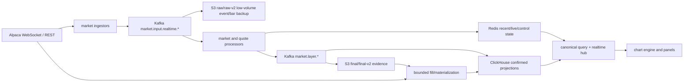

# Chart Data Architecture

This is the current source of truth for chart data from Alpaca ingress to
frontend rendering. Platform-specific keys, tables, topics, and prefixes live
in `platform/{kafka,redis,clickhouse,s3}/README.md`.

## Invariants

- A data-internal refactor must preserve visible geometry unless the task explicitly
  changes the canonical candle contract. The regular-session intraday migration is
  such an explicit change: derived US-equity candles are anchored at 09:30 ET.
- Frontend code reads REST/WebSocket contracts only. It never reads Redis,
  ClickHouse, or S3 directly.
- Historical candles are canonical only when `priceAdjustment=split` and
  `canonicalVersion=v2`.
- Raw S3 keeps low-volume event/bar backup evidence only; realtime trades/quotes
  are excluded and raw S3 is never chart serving or ClickHouse materialization input.
- Local runtime never injects fake market candles. `?orderFlowDemo=1` is a
  browser fixture path only.
- US-equity realtime `1m` is the live provider source. Historical and persisted
  `5m/10m/1h/4h` candles are materialized from regular-session data with
  `bucket_policy=us_equity_regular_session`. The API and live processor also
  aggregate retained `1m` pre, after, and overnight rows with
  `bucket_policy=us_equity_extended_session`. Extended buckets are anchored to
  each session open, never cross a session boundary, and remain visible for both
  live and historical chart windows. Bounded historical repair keeps `1m` as the
  source for `5m/10m`, and normally uses Alpaca `10Min` as a `source_native`
  recovery source for regular-session `1h/4h`. When a derived repair crosses an
  extended session, it switches to `1Min`, routes overnight ranges to BOATS, and
  aggregates both regular and extended target candles. Readers prefer stored
  target rows, then `10m`, then legacy `1m` aggregation for hourly regular-session
  history, and merge bounded historical/live extended-session aggregates.
  Bucket timestamps are stored in UTC, while session open/close and early-close
  decisions use the NYSE calendar in `America/New_York`.
- BOATS remains bounded to explicit realtime cohorts. Active chart, watchlist,
  portfolio, ranking, and manual symbols dynamically subscribe to
  `bars/updatedBars/trades/quotes`; the change does not create an all-universe
  overnight tick or candle fanout.
- Intraday coverage records both the latest candle and the latest regular-session
  candle. A chart request repairs a stale latest completed NYSE session even when
  a newer extended-hours row exists, and can repair the currently active
  pre/after/overnight tail without treating weekends or holidays as gaps.
- Candle runtime boundaries normalize OHLCV to numeric values and `tradeCount`
  to a non-negative integer. Redis/ClickHouse recovery must normalize legacy
  JSON strings before placing candles in live aggregation state, and writers
  must not persist new string-valued numeric fields.
- Orders, KIS, and agent APIs are outside this data-plane contract.

## Runtime Flow



`key=symbol` preserves per-symbol Kafka order. Live provisional candles and
quote/trade markers use Redis plus the global `market.events` pub/sub channel;
there is no live-candle Kafka topic.

ClickHouse tick persistence is at-least-once at the Kafka boundary and
idempotent at the sink boundary. The loader keeps Kafka record metadata through
the HTTP insert, supplies a deterministic `insert_deduplication_token` derived
from `topic + partition + offset`, and commits only the offsets represented by
the successful batch. A bounded per-process `sourceEventId` cache filters short
replays even when Kafka returns the records in a different batch. Existing
non-replicated MergeTree tables must enable their insert-deduplication window
with the operator migration.

## Placement Rules

| Data | Compute owner | Runtime store | Durable store | Load curve |
| --- | --- | --- | --- | --- |
| Closed candles | stream processor | Redis newest window | ClickHouse + S3 final | market activity |
| Live candle/trade/quote | stream/quote processor | bounded Redis keys | ticks in ClickHouse | throttled market activity |
| Candle indicators | API request | Redis TTL cache | none | unique requests |
| Candle volume profile | API request | Redis TTL cache | none | unique requests |
| Bid/Ask intraday minutes | stream processor | Redis closed/current minute blobs | trade/quote ticks in ClickHouse | flush interval, not trade count |
| Daily order flow | EOD rollup job | none | `order_flow_profile_daily` | one bounded batch/day |
| Compare | API canonical candle query | short Redis response cache | candle facts only | unique requests |

Persist a derived value only when a named reader needs reuse, recovery, or
audit. Display-only regrouping, such as 1m order-flow minutes into 10m/1h
columns, stays in the frontend bucket cache and does not create a new fact.

## Heatmap Change Contract

LIVE heatmap `changePercent` is the latest available price compared with the
previous completed regular-session close. ClickHouse returns that baseline as
`previousClose`; when Redis supplies a newer live price, the API recomputes the
percentage from the same baseline. The session open and static universe seed
must never be used as substitutes.

When no previous regular-session close is available, both `previousClose` and
`changePercent` are null. The frontend renders an em dash, excludes that item
from sector and industry percentage averages, and keeps its tile visually
neutral. SIM status applies the same percentage formula to replay trades, using
the fixed dataset's previous completed regular session (`2026-07-13`) as its
baseline. The simulator loads all 502 canonical `v2/split/regular` closes once
at process start and fails closed when the baseline is incomplete; it never
falls back to the first replay trade or a scenario-seed percentage.

## Query Contract

The single candle read boundary is `CanonicalCandleQuery`:

```text
Redis recent/live projection
  -> ClickHouse matching bucket-policy rows or bounded canonical 10m/1m aggregation
  -> optional bounded foreground Alpaca fill for the requested window
  -> background processed S3 final/final-v2 materialization
  -> background Alpaca historical fill
```

S3 objects count as a hit only when `matchedRowCount > 0` for the requested
symbol, interval, and half-open time range. A v2 shard object is materialized
as one audit unit, including shard-collision rows for other symbols; those rows
do not satisfy the request. Multiple objects are deduplicated by
`symbol + interval + timestamp` before one ClickHouse insert, and object audits
are written only after that insert succeeds.

## Public Chart Interfaces

Stable routes include:

```text
GET  /api/charts/candles
GET  /api/charts/compare
GET  /api/charts/events
GET  /api/charts/volume-profile-bins
GET  /api/charts/indicators
GET  /api/charts/order-flow/symbols
GET  /api/charts/order-flow/daily
GET  /api/charts/order-flow/intraday
POST /api/charts/active-symbol
WS   /ws/charts
```

`GET /api/charts/events` is a ClickHouse-only read path. It joins no candle
backfill flow and never calls Yahoo, Alpaca, or an external news provider during
the request. Stored `news_company_daily_summaries` rows produce one New York
market-date `N` marker, while stored S&P 500 `yahoo_earnings_estimates` event rows
produce `E` markers and the nearest scheduled event within `upcomingDays`.
Frontend chart documents keep `events:earnings` and `events:news` as persisted
layer flags; older documents receive both flags as enabled unless a saved value
explicitly disabled them. Loading older candles requests only the newly exposed
event range, and the latest loaded news date refreshes every 60 seconds while the
news layer is visible.

In SIM mode the route uses the replay `virtualTime` as an as-of cutoff instead
of returning `simulation_data_unavailable`. The ClickHouse daily-news query
applies `generated_at <= virtualTime` before `argMax`, so it selects the latest
snapshot that existed at the replay cursor and never falls forward to today's
latest row. Earnings rows whose `sourceAsOf` is after that cursor are excluded.
The accessible DOM marker layer is positioned synchronously from each canvas
scene before React reconciliation. Scene coordinates are converted into the
chart container's untransformed local coordinate space, so global UI scaling,
pan, and zoom cannot separate `E`/`N` buttons from their candle. Events sharing
one candle keep the exact same x coordinate and stack vertically instead of
being spread sideways away from the timeline.

The paper holding average-price guide is a transient frontend overlay, not candle
data or a persisted chart drawing. The authenticated paper-account snapshot supplies
the current symbol's positive quantity and average price through one shared account
WebSocket. A nearby average price may participate in the visible price domain, while
the overlay never changes candle facts, chart documents, or market-data APIs.

Buy/sell fill markers are also transient authenticated frontend overlays. They read
only completed paper orders in LIVE and only the current replay `runId` ledger in SIM.
`B` is anchored below the matched candle low and `S` above its high; fills sharing one
candle keep the candle's exact x center and stack vertically. Daily matching uses the
New York market date, while intraday/weekly/monthly matching requires the fill instant
to fall inside the candle's half-open semantic range. These markers never mutate candle
facts, chart documents, drawings, or market-data storage.

`POST /api/charts/active-symbol` refreshes a bounded cohort with the declared
`candles,trades,quotes` layers before the frontend requests the candle snapshot.
This ordering lets a newly opened symbol start BOATS/SIP candle collection while
the same request performs any bounded REST repair.

WebSocket candle events remain `LIVE_CANDLE_UPDATE`, `CANDLE_CLOSED`, and
`CANDLE_CORRECTED`. Order flow adds `ORDER_FLOW_BINS_UPDATE`. Derived responses
finish with `derived.state=ready|failed` and
`derived.source=api-compute|redis`; there is no derived queue, worker, or
ClickHouse artifact contract.

In SIM mode `GET /api/charts/indicators` and
`GET /api/charts/volume-profile-bins` remain available without falling through
to LIVE candles. The API merges canonical historical candles strictly before
the replay boundary with completed replay candles through the active cursor,
then performs the same indicator or exact Volume Profile calculation used by
LIVE. Redis request identity includes `datasetId + runId`; the requested closed
candle range supplies the changing cursor boundary, so a previous run or a
future LIVE result cannot satisfy a SIM request. The candle snapshot also
recomputes requested MA fields after the historical/replay merge so MA5/20/60
continue across the boundary. Intraday replay boundaries use UTC event time,
while `1D` boundaries use the New York market date so the replay day's daily
candle is not discarded as pre-replay data. An unavailable active simulator
returns an error instead of falling back to LIVE data.

Frontend viewport scale is independent of candle availability. The user may
zoom out into unloaded slots even when historical fill is pending, failed, or
unavailable; pagination and background fill only populate those slots and must
not clamp the viewport back to the returned candle count. When the oldest loaded
candle boundary enters the visible viewport, the frontend requests the preceding
range without requiring a separate horizontal pan to the left edge.

`GET /api/charts/volume-profile-bins` treats `targetBins` as an exact display
bucket count from 4 through 48. The active chart requests 10 equal-width buckets
across the main price pane's actual `scene.scales.minPrice/maxPrice` domain. That
domain includes active overlay indicators, a visible chart-plan proposal, live
price, and pixel headroom, but excludes ordinary drawings. Axis ticks do not
redefine or expand the display domain; their exact count is derived only from
price-pane height, and they divide the full display domain into equal vertical
intervals. Bid/Ask keeps its discrete order-flow rows while using the same
independent axis-tick density contract. The request also sends
the visible closed-candle `candleCount`; the API uses it as the canonical query
limit and includes it in request/cache identity. Zero-volume buckets remain in the
response so their price-space gaps are preserved, while a request with no source
candles remains empty. The response `priceBinSize` is the resolved price range
divided by `targetBins`; `priceBinSize=auto` remains the compatible request mode.
This chart calculation uses `volume-profile-exact-v2` cache keys.

When `candleCount` is present and `sourceCandleCount` differs, the response is
`dataStatus=partial` and includes `requestedCandleCount`. Partial profiles are not
written to the derived Redis cache. Calls that omit `candleCount` retain the
legacy default visible-bar query limit.

## Order Flow Consumers

- The `bidask` chart type reads intraday minute rows and supports `1m`, `10m`,
  and `1h` display buckets.
- `OrderFlowPanel` reads only today's intraday Redis data and owns its symbol,
  aggregation window, and display resolution independently from chart panels.
- In SIM, the same public intraday routes read a bounded per-symbol projection of
  immutable `simulation_replay_events` through replay `virtualTime`; they never
  fall through to LIVE Redis. Regular-session profiles retain the most recently
  replayed regular day until the next regular-session trade starts a new profile.
- SIM chart sockets request `orderFlow=true` only for Bid/Ask and OrderFlow
  consumers and receive replay `ORDER_FLOW_BINS_UPDATE` plus `LIVE_QUOTE_UPDATE`.
- Daily rows are also retained for audit and existing agent chart context.
  They are not the Bid/Ask chart or `OrderFlowPanel` source.
- Side classification is fixed by the order-flow API metadata. Candle volume
  profile remains estimated candle-range allocation and is a separate feature.

The processor restores an unexpired Redis `live-minute` blob on restart so the
current minute can continue accumulating or be promoted to a closed minute.
Longer processor outages are not reconstructed by the intraday API. A future
coverage project must rebuild missing minute profiles from retained ClickHouse
trade/quote ticks and add minute-level `no-trades` versus `not-collected`
metadata; the frontend must not manufacture zero-volume rows in the meantime.

## S3 Durability

Realtime v2 uses 32 symbol shards and deterministic one-minute objects. Buffer
identity includes `(partition path, UTC minute)`, exact replay performs `HEAD`
and skips an existing digest key, and Kafka offsets commit only after every S3
side effect succeeds. Historical v1 manifests remain readable during dual
layout migration. See `platform/s3/README.md` for exact prefixes.

## Bounded State

- Redis recent candles: 120 rows per symbol/interval.
- Redis live keys and order-flow minute blobs: explicit TTLs.
- Derived cache and locks: versioned keys with short TTLs and atomic Lua owner checks.
- ClickHouse trade/quote ticks: 21-day TTL.
- ClickHouse tick insert tokens: newest 100,000 inserted blocks per table.
- ClickHouse loader recent source IDs: newest 100,000 table/event pairs per pod.
- S3 raw/raw-v2 low-volume backups: operator-owned lifecycle; final evidence has no expiry.
- Processor maps, frontend inactive candle caches, and order-flow bucket caches
  have tested upper bounds.

Persisted chart-analysis assets are an offline build projection, not an API
request-derived cache. New build and refresh envelopes accept only `1m` and `1D`;
the independent builder reads the same canonical completed-candle boundary as the
chart: Redis supplies the newest closed tail and ClickHouse supplies durable history.
Live candles are excluded before the analysis merge.
Existing `5m/10m/1h/4h/1W` asset rows remain readable and explicitly deletable,
but are not regenerated. When repair is enabled, only a requested missing range
is fetched from Alpaca and its real canonical source rows are stored before the
builder re-reads the combined closed-candle view. Repair materialization itself does
not use S3 or Kafka and still writes only real rows to ClickHouse. Local fixture tests
inject a candle loader and disable repair, so they do
not require Alpaca credentials or make provider calls.

Alpaca may legitimately omit an intraday slot with no bar. A successful provider
request with no matching real candle is `provider_confirmed_empty`, not an OHLCV
row and not a coverage failure. Authentication, network, rate-limit, and server
failures remain `alpaca_request_failed`/unavailable. No zero-volume or carry-forward
candle is manufactured.

Completed 1D/1W/1M candles use a shared `candleKey`. Daily chart coordinates use
New York market midnight; weekly/monthly coordinates use their UTC bucket start.
The last real NYSE session close, including early close, determines whether a
higher-timeframe bucket is complete. Serving, analysis, stale checks, and drawing
anchor snapping share this identity rather than comparing raw timestamps.
Daily serving coverage therefore reports a tail gap as soon as the latest NYSE
session has completed and its `1D` candle is absent. It does not wait for the
generic three-calendar-day tolerance, and weekends, holidays, pre-close sessions,
and standard or configured early closes do not create false tail gaps.

Only compact Geometry assets are written to PostgreSQL
`chart_assets.geometry_assets`, one latest JSONB row per `(symbol, interval)`.
There is no ClickHouse asset projection or dual-write mode; ClickHouse continues
to own canonical candles and optional repair materialization. Build jobs, items,
bounded logs, status polling, and explicit pair deletion are also PostgreSQL
contracts. Repair has no CronJob or candle-closed subscription. The development
delete route is not retention or automatic cleanup. Geometry v6 stays within the
existing eight-drawing and 256 KiB payload bounds, so it requires no table or data
migration.

The chart-analysis kernel may derive a daily MA60/MA120 crossing event from 121
canonical completed closes. This is an asset-build feature, not a persisted
candle indicator: it does not add an `ma120` ClickHouse column, Redis key, or
public candle response field. The chart can request the `sma:120` overlay from
the generic derived-indicator endpoint, which computes it from the canonical
close series and keeps only the existing bounded derived cache.

## Retained Compatibility

The generic closed-candle topic, tick-fanout topics, and raw manifest lookup
remain compatibility contracts because external consumers are not yet proven
absent. New runtime code must not add readers to them without documenting the
owner. Removal requires broker consumer-group and repository evidence.

Operational procedures and rollback steps are in
`CHART_DATA_OPERATIONS.md`.
