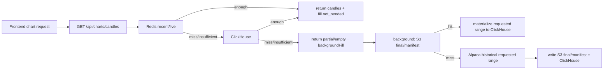

# GOPS Chart On-Demand Fill Plan

This file is the current chart-data contract for GOPS. Older notes that describe
Redis Stream chart backfill workers, broad initial preload, fixed preset chart
universes, or raw S3 replay as a normal chart source are superseded.

## Korean Summary

차트 데이터는 이제 `GET /api/charts/candles` 하나로 읽고 채운다. 프런트가
요청한 `symbol + interval + limit/before/from/to` 범위만 처리하며, 숨은
6년 preload나 S&P500 전체 chart backfill은 하지 않는다.

조회 순서는 고정이다.

```text
Redis recent/live window
-> ClickHouse canonical chart_candles
-> S3 final objects and manifests
-> Alpaca historical
```

S3에 final/manifest가 있으면 해당 요청 범위만 ClickHouse에 materialize한
뒤 다시 조회한다. S3에도 없으면 Alpaca historical에서 요청 범위만 받아 S3
final/manifest와 ClickHouse에 저장한 뒤 다시 조회한다. Raw S3 archive는
감사/백업용이며 chart serving, coverage, fill decision, ClickHouse
materialization source로 쓰지 않는다.

## API Contract

Active chart routes:

```text
GET  /api/charts/candles
GET  /api/charts/indicators
GET  /api/charts/volume-profile-bins
GET  /api/charts/footprint
GET  /api/charts/symbols
WS   /ws/charts
```

Deprecated queue routes are preserved as `410 Gone`:

```text
POST /api/charts/backfill
GET  /api/charts/backfill/status
GET  /api/charts/backfill/queue
```

`GET /api/charts/candles` keeps existing `dataStatus` and `coverage` fields and
adds a `fill` trace:

```json
{
  "fill": {
    "status": "not_needed | filled | partial | timeout | failed | empty",
    "requestedRange": {"start": "...", "end": "..."},
    "requestedLimit": 120,
    "sourceInterval": "1m",
    "sources": {
      "redis": {"checked": true, "hit": true, "rowCount": 120, "durationMs": 1, "error": null},
      "clickhouse": {"checked": false, "hit": false, "rowCount": 0, "durationMs": 0, "error": null},
      "s3": {"checked": false, "hit": false, "rowCount": 0, "durationMs": 0, "error": null},
      "alpaca": {"checked": false, "hit": false, "rowCount": 0, "durationMs": 0, "error": null}
    },
    "missingRanges": [],
    "gapRanges": [],
    "renderable": true,
    "minimumReturnedCount": 20,
    "minimumRenderableSourceBars": 30
  }
}
```

Top-level `backfillStatus`, `canBackfill`, and `repairStatus` are not chart
control fields. Coverage may still include diagnostic `repairStatus`.

## Source Interval Rules

Derived intervals fill their canonical source interval first:

```text
1m  -> 1m
5m  -> 1m, then aggregate
10m -> 1m, then aggregate
1h  -> 1m, then aggregate
4h  -> 1m, then aggregate
1D  -> 1D
1W  -> 1D, then aggregate
1M  -> 1D, then aggregate
```

Minimum renderability is separate from full coverage. The foreground chart
request returns Redis/ClickHouse candles immediately when they are renderable,
even if full coverage still needs repair. Missing ranges are queued as bounded
background fill and surfaced in the `fill.backgroundFill` trace.

## Runtime Flow



The API foreground path does not wait on S3 or Alpaca. Background fill is bounded
by `ON_DEMAND_FILL_BACKGROUND_TIMEOUT_SECONDS` and writes source failures to
logs/monitoring; the initiating response shows that repair was queued. Alpaca
no-data remains an `empty` or `partial` fill result, not a backend crash.

## Frontend Contract

The frontend calls `fetchCandles()` only. It does not request queue backfills,
poll status endpoints, or keep retry tokens for terminal ranges. When a chart is
blank or partial, it displays `dataStatus`, response `message`, and the `fill`
trace so CSCO 1D or similar failures show which source missed or failed.

Opening WebSocket for 1D remains a separate realtime subscription concern and is
not part of on-demand fill.

## Runtime Units

Chart on-demand fill runs inside the API server. The chart `backfill-worker`
deployment, `initial-load` job, and chart backfill queue env are not part of the
current runtime. Coverage repair is an audit job that calls the candles endpoint
and reports the returned fill trace.

Chart-derived rendering data is separate from candle fill. The API server owns
request normalization, candle source fill for indicator requests, Redis/ClickHouse
artifact lookup, Kafka enqueue, and short wait/pending responses. The
`chart-derived-data-worker` owns indicator, volume profile, and footprint
calculation. It consumes `market.chart-derived.requests.v1`, writes hot results
to Redis, and materializes request artifacts into
`market_data.chart_derived_artifacts` so the frontend and future Agent flows can
reference the same derived result by request hash.
Volume profile v1 is always candle OHLCV based `estimated` data for the
requested chart interval; it does not depend on trade ticks or
`volume_profile_bins_1m` materialization.

Derived result retention is intentionally shorter than candle history:

```text
Redis: indicators 300s, volume profile 30s, footprint 15s
ClickHouse artifacts: indicators 7d, volume profile 1d, footprint 6h
```

News historical collection remains a separate news-domain job and may still use
`NEWS_BACKFILL_*` env names.

## Validation

Use this order when changing chart fill:

```text
git diff --check
.venv/bin/python -m unittest discover -s systems/api-server/tests -p 'test_market_data_query.py'
.venv/bin/python -m unittest discover -s systems/api-server/tests -p 'test_agent_routes.py'
apps/gops-frontend: tsc -b
apps/gops-frontend: vite build
apps/gops-frontend: node scripts/run-chart-tests.mjs
docker compose config
docker compose build
```

Core cases:

- Redis hit does not call ClickHouse/S3/Alpaca.
- Redis miss and ClickHouse hit does not call S3/Alpaca.
- ClickHouse miss and S3 hit materializes only the requested range.
- S3 miss calls Alpaca historical only for the requested range.
- 5m/10m/1h/4h/1W/1M fill source intervals before aggregation.
- Timeout returns partial candles plus source-level trace.
