# GOPS Chart Data Rebuild Plan

This is the source-of-truth plan for the next chart/market-data rebuild.
It is a plan, not a claim that the current runtime already behaves this way.

## Korean Summary

이 문서는 `GOPS Hybrid Chart Data Plan - S&P500 Baseline + Redis 120-Bar +
SIP/BOATS 단독 Feed` 반영본이다.

핵심은 세 가지다.

- Redis는 전체 과거 저장소가 아니다. Redis는 각 `symbol + timeframe`별
  최신 120개 candle, 실시간 임시봉, 확정봉 교체 상태, backfill 상태,
  feed control 상태만 가진다.
- 120개보다 오래된 데이터는 ClickHouse에서 조회한다. ClickHouse에도
  없으면 S3 manifest를 먼저 확인하고, S3에도 없을 때만 Alpaca backfill을
  실행한다.
- 원본 Alpaca payload는 S3 raw prefix에 백업용으로만 저장할 수 있다.
  이 raw backup은 read path, coverage check, backfill 결정, ClickHouse
  적재 로직에 참여하지 않는다.
- S&P500 전체는 기본 가격 표시와 차트 진입 속도를 위해 `bars`,
  `updatedBars`, `dailyBars`, `statuses` baseline 데이터를 계속 수신한다.
- `trades`와 `quotes`는 S&P500 전체에 붙이지 않는다. 관심종목, 보유종목,
  거래대금/거래량/급등/급락 ranking, 현재 보고 있는 차트, manual-admin처럼
  실제 tick layer가 필요한 선택 종목에만 붙인다.
- 실시간 feed는 `04:00-20:00 ET = SIP 단독`,
  `20:00-04:00 ET = BOATS 단독`으로 운영한다. 두 feed가 같은 데이터를
  동시에 저장하는 상황은 절대 허용하지 않는다.

전체 구조는 아래 `Full Architecture` Mermaid를 기준으로 한다. Frontend는
기본 차트와 Redis/S3/ClickHouse/Backfill 모니터링을 제공하고, API는
Redis 최신 120개, ClickHouse 과거 데이터, S3 manifest, Alpaca backfill을
순서대로 확인한다. Realtime 경로는 SIP/BOATS feed control을 통과한 뒤
Kafka `key=symbol` 순서 규칙으로 processor에 전달되고, Redis 임시봉과
확정봉 교체 상태 및 WebSocket live payload로 이어진다.

## Goal

Rebuild the chart path around hybrid baseline + explicit realtime access.

- Keep S&P500 baseline collection active for `bars`, `updatedBars`, `dailyBars`,
  and `statuses`.
- Do not subscribe all S&P500 symbols to high-frequency `trades` or `quotes`.
- Subscribe `trades` and `quotes` only for explicit realtime cohorts:
  watchlist, portfolio, rankings, active chart sessions, and manual admin
  subscriptions.
- Do not generate fake market candles.
- Load only the symbol, timeframe, range, and layer requested by the chart.
- Keep only the newest 120 candles per `symbol + timeframe` in Redis.
- Read older confirmed candles from ClickHouse.
- Use S3 final data and manifests as durable evidence and ClickHouse rebuild
  source.
- Keep S3 raw payload archives backup-only; raw archives must not participate in
  chart serving, coverage checks, backfill decisions, or ClickHouse loading.
- Use Alpaca historical only after Redis, ClickHouse, and S3 manifest checks miss.
- Enforce `SIP`/`BOATS` mutual exclusion so the same time bucket is never stored twice from two feeds.

## Full Architecture

```mermaid
flowchart LR
  subgraph FE["1. Frontend - Basic Chart + Monitoring"]
    UI["Basic chart<br/>symbol / timeframe / range"]
    PAN["Left-pan chart<br/>request older than Redis 120 bars"]
    BF_BTN["Backfill Missing"]
    MON["Redis / S3 / ClickHouse / Backfill monitor"]
    WSLOG["Live payload log"]
  end

  subgraph API["2. API Server"]
    CANDLE_API["GET /api/charts/candles"]
    BF_API["POST /api/charts/backfill"]
    BF_STATUS["GET /api/charts/backfill/status"]
    WS["WS /ws/charts"]
    COVER["coverage checker<br/>Redis latest 120 -> ClickHouse -> S3 manifest"]
    MON_API["GET /api/monitor/market-data/*"]
  end

  subgraph REDIS["3. Redis - latest 120 bars + realtime state"]
    R_CACHE_1["cache:candles:{symbol}:1m<br/>latest 120"]
    R_CACHE_5["cache:candles:{symbol}:5m<br/>latest 120"]
    R_CACHE_10["cache:candles:{symbol}:10m<br/>latest 120"]
    R_CACHE_D["cache:candles:{symbol}:1D<br/>latest 120"]
    R_CACHE_W["cache:candles:{symbol}:1W<br/>latest 120"]
    R_CACHE_M["cache:candles:{symbol}:1M<br/>latest 120"]

    R_LIVE["live:candle:{symbol}:{interval}<br/>current provisional candle"]
    R_CLOSED["latest:closed:candle:{symbol}:{interval}<br/>latest confirmed candle"]
    R_WINDOW["state:candle-window:{symbol}:{interval}:{bucket}<br/>short aggregation state"]
    R_PENDING["pending:replace:{symbol}:{interval}:{timestamp}<br/>provisional -> confirmed replace target"]
    R_TRADE["live:trade:{symbol}"]
    R_QUOTE["live:quote:{symbol}"]
    R_EVENT["live:event:{symbol}"]

    R_LOCK["backfill:lock:{digest}"]
    R_STREAM["backfill:stream"]
    R_DLQ["backfill:dead-letter"]
    R_STATUS["backfill:status:{requestId}"]
    R_LATEST["backfill:latest:{symbol}:{interval}"]

    R_FEED_ACTIVE["feed:active<br/>activeFeedProfile / marketSession / epoch"]
    R_FEED_LEASE_SIP["feed:lease:sip"]
    R_FEED_LEASE_BOATS["feed:lease:boats"]
    R_FEED_SWITCH["feed:switch:state"]
    R_FEED_QUAR["feed:quarantine:{date}"]
  end

  subgraph CH["4. ClickHouse - confirmed historical serving"]
    CH_C["market_data.chart_candles"]
    CH_T["market_data.trade_ticks"]
    CH_Q["market_data.quote_ticks"]
    CH_E["market_data.market_events"]
    CH_ST["market_data.market_status_events"]
    CH_BF["market_data.backfill_jobs"]
    CH_AUDIT["market_data.storage_object_audit"]
    CH_LOAD["market_data.load_audit"]
  end

  subgraph S3["5. S3 - final/manifest logic + raw backup"]
    S3_RAW["raw/alpaca/source={historical|realtime}/layer={layer}/...<br/>backup only / not read by logic"]
    S3_FINAL_C["final/candles/feed={feed}/interval={tf}/symbol={symbol}/.../{start}_{end}_adj=split_cv=v2.parquet"]
    S3_FINAL_T["final/trades/symbol={symbol}/.../{start}_{end}_feed={feed}.parquet"]
    S3_FINAL_Q["final/quotes/symbol={symbol}/.../{start}_{end}_feed={feed}.parquet"]
    S3_FINAL_E["final/events/event_type={type}/symbol={symbol}/.../{start}_{end}.parquet"]
    S3_MAN["manifest/{layer}/symbol={symbol}/objects/{digest}.json"]
    S3_REQ["manifest/backfill/request={requestId}.json"]
  end

  subgraph BF["6. Kubernetes Backfill Workers"]
    BF_DEP["backfill-worker Deployment<br/>replicas=1..N"]
    BF_POD["backfill-worker pods<br/>Redis Stream consumer group"]
    SRC["source interval<br/>1m -> 1m/5m/10m<br/>1D -> 1D/1W/1M"]
    DEDUPE["dedupe writer<br/>canonical key skip/upsert"]
  end

  subgraph ALP_H["7. Alpaca Historical API - request only"]
    A_BAR["historical bars"]
    A_TRADE["historical trades"]
    A_QUOTE["historical quotes"]
    A_EVENT["historical events/status"]
  end

  subgraph BASE["8. S&P500 Baseline Realtime"]
    SP500["systems/market-data/config/sp500-universe.json<br/>S&P500 symbols"]
    BASE_SUB["baseline subscription<br/>all S&P500 symbols<br/>bars / updatedBars / dailyBars / statuses only"]
  end

  subgraph RT["8-B. Explicit Realtime Tick / Quote"]
    WL["watchlist"]
    PF["portfolio"]
    RDV["rank:dollar-volume"]
    RVOL["rank:volume"]
    RGAIN["rank:gainers"]
    RLOSE["rank:losers"]
    ACT["active-chart:{userId}:{sessionId}<br/>TTL heartbeat"]
    MANUAL["manual-admin"]
    SUB["subscription-controller<br/>user-scoped sources -> global subscription<br/>trades / quotes only"]
  end

  subgraph FEED["8-C. SIP / BOATS Exclusive Feed Control"]
    CLOCK["session-clock<br/>America/New_York"]
    FCTRL["feed-session-controller<br/>choose exactly one active feed"]
    ACTIVE["Redis feed:active"]
    LEASE_SIP["Redis feed:lease:sip"]
    LEASE_BOATS["Redis feed:lease:boats"]
    SIP["alpaca-ingestor-sip<br/>04:00-20:00 ET only"]
    BOATS["alpaca-ingestor-boats<br/>20:00-04:00 ET only"]
    SIP_IDLE["sip idle"]
    BOATS_IDLE["boats idle"]
  end

  subgraph KAFKA["9. Kafka - key=symbol"]
    K_TR["market.input.realtime.trades.v1"]
    K_QT["market.input.realtime.quotes.v1"]
    K_B1["market.input.realtime.bars.1m.v1"]
    K_UB["market.input.realtime.updated-bars.1m.v1"]
    K_D["market.input.realtime.daily-bars.v1"]
    K_EV["market.input.realtime.events.v1"]
    K_1M["market.realtime.ticks.to.1m.v1"]
    K_5M["market.realtime.ticks.to.5m.v1"]
    K_10M["market.realtime.ticks.to.10m.v1"]
    K_1D["market.realtime.ticks.to.1d.v1"]
    K_1W["market.realtime.ticks.to.1w.v1"]
    K_1MO["market.realtime.ticks.to.1mo.v1"]
    K_CLOSED["market.layer.candles.closed.v1"]
    K_LIVE["market.layer.candles.live.v1"]
    K_TR_OUT["market.layer.trades.v1"]
    K_QT_OUT["market.layer.quotes.v1"]
    K_EV_OUT["market.layer.events.v1"]
  end

  subgraph PROC["10. Kubernetes Realtime Processors"]
    ORDER["ordering rule<br/>key=symbol<br/>one partition handled by one pod"]
    GUARD["processor feed guard<br/>feedProfile / marketSession / feedEpoch"]
    QUAR["quarantine / monitor<br/>wrong feed payload not stored"]
    FANOUT["tick-fanout-router<br/>copy ticks to timeframe topics"]
    P1["realtime-1m processor"]
    P5["realtime-5m processor"]
    P10["realtime-10m processor"]
    PD["realtime-1D processor"]
    PW["realtime-1W processor"]
    PM["realtime-1M processor"]
    CONF["confirmation processor<br/>bars/updatedBars/dailyBars replace provisional candles"]
    QT["quote processor"]
    TR["trade processor"]
    EV["event processor"]
  end

  UI --> CANDLE_API
  PAN --> CANDLE_API
  BF_BTN --> BF_API
  MON --> MON_API
  WSLOG --> WS

  CANDLE_API --> COVER
  COVER --> R_CACHE_1
  COVER --> R_CACHE_5
  COVER --> R_CACHE_10
  COVER --> R_CACHE_D
  COVER --> R_CACHE_W
  COVER --> R_CACHE_M
  COVER --> CH_C
  COVER --> S3_MAN
  COVER -->|missing range| BF_API
  COVER -->|data found| UI

  BF_API --> R_LOCK
  R_LOCK -->|new digest| R_STREAM
  R_LOCK -->|already exists| R_STATUS
  R_STREAM --> BF_DEP
  BF_DEP --> BF_POD
  BF_POD --> SRC
  SRC --> S3_MAN
  S3_MAN -->|exists| DEDUPE
  SRC -->|missing in S3| A_BAR
  SRC -->|trades layer requested| A_TRADE
  SRC -->|quotes layer requested| A_QUOTE
  SRC -->|events layer requested| A_EVENT

  A_BAR -. backup-only copy .-> S3_RAW
  A_TRADE -. backup-only copy .-> S3_RAW
  A_QUOTE -. backup-only copy .-> S3_RAW
  A_EVENT -. backup-only copy .-> S3_RAW
  A_BAR --> DEDUPE
  A_TRADE --> DEDUPE
  A_QUOTE --> DEDUPE
  A_EVENT --> DEDUPE

  DEDUPE --> S3_FINAL_C
  DEDUPE --> S3_FINAL_T
  DEDUPE --> S3_FINAL_Q
  DEDUPE --> S3_FINAL_E
  DEDUPE --> S3_MAN
  DEDUPE --> S3_REQ
  DEDUPE --> CH_C
  DEDUPE --> CH_T
  DEDUPE --> CH_Q
  DEDUPE --> CH_E
  DEDUPE --> CH_BF
  DEDUPE --> CH_AUDIT
  DEDUPE --> R_STATUS

  SP500 --> BASE_SUB
  WL --> SUB
  PF --> SUB
  RDV --> SUB
  RVOL --> SUB
  RGAIN --> SUB
  RLOSE --> SUB
  ACT --> SUB
  MANUAL --> SUB

  BASE_SUB --> CLOCK
  SUB --> CLOCK
  CLOCK --> FCTRL
  FCTRL --> ACTIVE
  FCTRL --> LEASE_SIP
  FCTRL --> LEASE_BOATS
  ACTIVE --> R_FEED_ACTIVE
  LEASE_SIP --> R_FEED_LEASE_SIP
  LEASE_BOATS --> R_FEED_LEASE_BOATS
  FCTRL --> R_FEED_SWITCH

  ACTIVE --> SIP
  ACTIVE --> BOATS
  SIP -->|S&P500 baseline activeFeed=sip| K_B1
  SIP -->|S&P500 baseline activeFeed=sip| K_UB
  SIP -->|S&P500 baseline activeFeed=sip| K_D
  SIP -->|S&P500 baseline activeFeed=sip| K_EV
  SIP -->|selected realtime activeFeed=sip| K_TR
  SIP -->|selected realtime activeFeed=sip| K_QT
  SIP -->|activeFeed!=sip| SIP_IDLE

  BOATS -->|S&P500 baseline activeFeed=boats| K_B1
  BOATS -->|S&P500 baseline activeFeed=boats| K_UB
  BOATS -->|S&P500 baseline activeFeed=boats| K_D
  BOATS -->|S&P500 baseline activeFeed=boats| K_EV
  BOATS -->|selected realtime activeFeed=boats| K_TR
  BOATS -->|selected realtime activeFeed=boats| K_QT
  BOATS -->|activeFeed!=boats| BOATS_IDLE

  K_TR --> GUARD
  K_QT --> GUARD
  K_B1 --> GUARD
  K_UB --> GUARD
  K_D --> GUARD
  K_EV --> GUARD
  GUARD -->|valid active trade feed| FANOUT
  GUARD -->|valid active feed| ORDER
  GUARD -. valid payload backup-only copy .-> S3_RAW
  GUARD -->|wrong feed / stale epoch / overlap| QUAR
  QUAR --> R_FEED_QUAR

  FANOUT --> K_1M
  FANOUT --> K_5M
  FANOUT --> K_10M
  FANOUT --> K_1D
  FANOUT --> K_1W
  FANOUT --> K_1MO

  K_1M --> ORDER
  K_5M --> ORDER
  K_10M --> ORDER
  K_1D --> ORDER
  K_1W --> ORDER
  K_1MO --> ORDER

  ORDER --> P1
  ORDER --> P5
  ORDER --> P10
  ORDER --> PD
  ORDER --> PW
  ORDER --> PM
  ORDER --> CONF
  ORDER --> QT
  ORDER --> TR
  ORDER --> EV

  P1 --> R_LIVE
  P5 --> R_LIVE
  P10 --> R_LIVE
  PD --> R_LIVE
  PW --> R_LIVE
  PM --> R_LIVE

  P1 --> R_WINDOW
  P5 --> R_WINDOW
  P10 --> R_WINDOW
  PD --> R_WINDOW
  PW --> R_WINDOW
  PM --> R_WINDOW

  P1 --> R_PENDING
  P5 --> R_PENDING
  P10 --> R_PENDING
  PD --> R_PENDING
  PW --> R_PENDING
  PM --> R_PENDING

  CONF --> R_PENDING
  CONF --> R_LIVE
  CONF --> R_CLOSED
  CONF --> R_CACHE_1
  CONF --> R_CACHE_5
  CONF --> R_CACHE_10
  CONF --> R_CACHE_D
  CONF --> R_CACHE_W
  CONF --> R_CACHE_M
  CONF --> K_CLOSED

  P1 --> K_LIVE
  P5 --> K_LIVE
  P10 --> K_LIVE
  PD --> K_LIVE
  PW --> K_LIVE
  PM --> K_LIVE

  TR --> R_TRADE
  QT --> R_QUOTE
  EV --> R_EVENT
  TR --> K_TR_OUT
  QT --> K_QT_OUT
  EV --> K_EV_OUT

  K_CLOSED --> CH_C
  K_CLOSED --> S3_FINAL_C
  K_TR_OUT --> CH_T
  K_QT_OUT --> CH_Q
  K_EV_OUT --> CH_E

  R_LIVE --> WS
  R_CLOSED --> WS
  R_TRADE --> WS
  R_QUOTE --> WS
  R_EVENT --> WS
  WS --> UI

  MON_API --> REDIS
  MON_API --> CH
  MON_API --> S3
  BF_STATUS --> R_STATUS
```



## Redis Contract

Redis is realtime state, replacement state, backfill state, and the newest
120-bar cache. It is not the historical source of truth.

```text
gops:market:on-demand:v1:cache:candles:{symbol}:1m   = latest 120, about 2 hours
gops:market:on-demand:v1:cache:candles:{symbol}:5m   = latest 120, about 10 hours
gops:market:on-demand:v1:cache:candles:{symbol}:10m  = latest 120, about 20 hours
gops:market:on-demand:v1:cache:candles:{symbol}:1D   = latest 120 daily candles
gops:market:on-demand:v1:cache:candles:{symbol}:1W   = latest 120 weekly candles
gops:market:on-demand:v1:cache:candles:{symbol}:1M   = latest 120 monthly candles

gops:market:on-demand:v1:live:candle:{symbol}:{interval}
gops:market:on-demand:v1:latest:closed:candle:{symbol}:{interval}
gops:market:on-demand:v1:state:candle-window:{symbol}:{interval}:{bucket}
gops:market:on-demand:v1:pending:replace:{symbol}:{interval}:{timestamp}
gops:market:on-demand:v1:live:trade:{symbol}
gops:market:on-demand:v1:live:quote:{symbol}
gops:market:on-demand:v1:live:event:{symbol}

gops:market:on-demand:v1:backfill:stream
gops:market:on-demand:v1:backfill:dead-letter
gops:market:on-demand:v1:backfill:lock:{digest}
gops:market:on-demand:v1:backfill:status:{requestId}
gops:market:on-demand:v1:backfill:latest:{symbol}:{interval}

gops:market:on-demand:v1:feed:active
gops:market:on-demand:v1:feed:lease:sip
gops:market:on-demand:v1:feed:lease:boats
gops:market:on-demand:v1:feed:switch:state
gops:market:on-demand:v1:feed:quarantine:{date}
```

Implementation rules:

- Store candle caches as ZSET or timestamp-keyed hashes.
- Use candle timestamp epoch milliseconds as score.
- Upsert by timestamp; never append a duplicate bucket.
- After upsert, trim to the newest 120 bars.
- Read older confirmed candles from ClickHouse.
- If ClickHouse misses, queue backfill/gapfill.

## Storage Names

Planned rebuild env:

```text
REDIS_KEY_PREFIX=gops:market:on-demand:v1

ALFAKA_REQUEST_CONFIG=systems/market-data/config/market-data-request.json
ALPACA_UNIVERSE=sp500
ALPACA_UNIVERSE_REGISTRY_PATH=systems/market-data/config/sp500-universe.json
ALPACA_COLLECTION_SYMBOL_SOURCE=universe
ALPACA_CHANNELS=bars,updatedBars,dailyBars,statuses
ALPACA_ACTIVE_CHANNELS=trades,quotes
ALPACA_ACTIVE_TICK_SUBSCRIPTION=true

S3_BUCKET=gops-market-data-<aws-account-id>-ap-northeast-2-an
S3_RAW_PREFIX=market-data/rebuild-20260702-lazy-v1/raw/alpaca
S3_FINAL_PREFIX=market-data/rebuild-20260702-lazy-v1/final
S3_LIVE_PREFIX=market-data/rebuild-20260702-lazy-v1/live
S3_MANIFEST_PREFIX=market-data/rebuild-20260702-lazy-v1/manifest
S3_MATERIALIZE_PREFIX=market-data/rebuild-20260702-lazy-v1/final

CLICKHOUSE_DATABASE=market_data
```

ClickHouse tables:

```text
market_data.chart_candles
market_data.trade_ticks
market_data.quote_ticks
market_data.market_events
market_data.market_status_events
market_data.volume_profile_bins_1m
market_data.load_audit
market_data.backfill_jobs
market_data.storage_object_audit
market_data.symbols
market_data.news_articles
```

Backup-only raw S3 key:

```text
market-data/rebuild-20260702-lazy-v1/raw/alpaca/source={historical|realtime}/layer=candles/source_interval={1m|1D}/symbol={symbol}/year={YYYY}/month={MM}/day={DD}/request={digest}.jsonl
market-data/rebuild-20260702-lazy-v1/raw/alpaca/source={historical|realtime}/layer=trades/symbol={symbol}/year={YYYY}/month={MM}/day={DD}/request={digest}.jsonl
market-data/rebuild-20260702-lazy-v1/raw/alpaca/source={historical|realtime}/layer=quotes/symbol={symbol}/year={YYYY}/month={MM}/day={DD}/request={digest}.jsonl
market-data/rebuild-20260702-lazy-v1/raw/alpaca/source={historical|realtime}/layer=events/symbol={symbol}/year={YYYY}/month={MM}/day={DD}/request={digest}.jsonl
```

Canonical final and manifest S3 keys:

```text
market-data/rebuild-20260702-lazy-v1/final/candles/feed={feed}/interval={1m|5m|10m|1D|1W|1M}/symbol={symbol}/year={YYYY}/month={MM}/day={DD}/start={start}_end={end}_adj=split_cv=v2.parquet
market-data/rebuild-20260702-lazy-v1/final/trades/symbol={symbol}/year={YYYY}/month={MM}/day={DD}/start={start}_end={end}_feed={feed}.parquet
market-data/rebuild-20260702-lazy-v1/final/quotes/symbol={symbol}/year={YYYY}/month={MM}/day={DD}/start={start}_end={end}_feed={feed}.parquet
market-data/rebuild-20260702-lazy-v1/final/events/event_type={statuses|lulds|imbalances|corrections|cancel_errors}/symbol={symbol}/year={YYYY}/month={MM}/day={DD}/start={start}_end={end}.parquet
market-data/rebuild-20260702-lazy-v1/manifest/candles/interval={interval}/symbol={symbol}/objects/{digest}.json
market-data/rebuild-20260702-lazy-v1/manifest/backfill/request={requestId}.json
```

## Raw Backup Policy

Raw Alpaca payloads may be copied to `S3_RAW_PREFIX` for backup, audit, or
future replay experiments. This archive is intentionally outside the active
chart-data logic.

Rules:

- Chart API reads must never query `S3_RAW_PREFIX`.
- Coverage checks must never treat raw objects as coverage.
- Backfill decisions must use Redis, ClickHouse, and S3 manifests/final objects,
  not raw objects.
- ClickHouse loaders must load canonical final objects, not raw objects.
- S3 manifests used by chart serving must point to final objects, not raw
  backup objects.
- Missing raw backup must not fail a chart request, a backfill job, or a
  ClickHouse materialization job.
- Duplicate raw backup objects must not create duplicate canonical candles,
  trades, quotes, or events.

Future raw replay is allowed only as a separate, explicit pipeline with its own
job name, read-only raw access, idempotent dedupe, and a documented output
contract.

## Read And Backfill Path

1. Frontend calls `GET /api/charts/candles`.
2. API checks Redis latest 120 bars for the requested `symbol + interval`.
3. If the request is within Redis coverage, API returns Redis data.
4. If the request reaches older history, API reads ClickHouse.
5. If ClickHouse misses, API queues `POST /api/charts/backfill`.
6. Backfill worker checks S3 manifest before Alpaca.
7. If S3 exists, materialize S3 to ClickHouse.
8. If S3 misses, fetch Alpaca historical, write S3 final/manifest, then materialize.
9. Optionally copy raw historical and realtime Alpaca payloads to
   `S3_RAW_PREFIX` as backup-only data.
10. API merges Redis tail and ClickHouse history by timestamp and returns deduped ascending candles.

Derived intervals:

- `5m` and `10m` are derived from canonical `1m`.
- `1W` and `1M` are derived from canonical `1D`.
- Derived interval gaps trigger source-interval backfill first.

## Provisional To Confirmed Candle Replacement

Realtime trades/ticks create provisional candles first.

1. Processor upserts provisional candle to `live:candle:{symbol}:{interval}`.
2. Processor updates `state:candle-window:{symbol}:{interval}:{bucket}`.
3. Processor records `pending:replace:{symbol}:{interval}:{timestamp}`.
4. Frontend receives provisional candle through WebSocket.
5. Alpaca `bars`, `updatedBars`, or `dailyBars` arrives.
6. Confirmation processor replaces the same timestamp bucket with the official bar.
7. Redis updates `latest:closed:candle:{symbol}:{interval}`.
8. Redis updates `cache:candles:{symbol}:{interval}` and trims to 120 bars.
9. Confirmed candle is published to `market.layer.candles.closed.v1`.
10. Confirmed candle is stored in ClickHouse and S3.

Provisional candles must not be stored as canonical historical ClickHouse/S3 rows.

## SIP / BOATS Exclusive Feed Rule

Realtime feed selection uses `America/New_York`.

```text
04:00 - 20:00 ET = SIP only
20:00 - 04:00 ET = BOATS only
```

Session mapping:

```text
20:00 - 04:00 ET  feedProfile=boats  marketSession=overnight
04:00 - 09:30 ET  feedProfile=sip    marketSession=pre
09:30 - 16:00 ET  feedProfile=sip    marketSession=regular
16:00 - 20:00 ET  feedProfile=sip    marketSession=after
```

Rules:

- SIP and BOATS may both have deployments, but only one may subscribe/produce.
- On switch, stop/unsubscribe the old feed before starting the new feed.
- A short data gap is acceptable; duplicate feed storage is not acceptable.
- The same `symbol + channel + timestamp/bucket` must never be stored from both feeds.

All realtime payloads must include:

```json
{
  "feedProfile": "sip",
  "marketSession": "regular",
  "feedEpoch": 1042,
  "ingestorId": "alpaca-ingestor-sip-0",
  "subscriptionSetVersion": 17
}
```

Processor guard condition:

```text
payload.feedProfile == feed:active.activeFeedProfile
payload.marketSession == feed:active.marketSession
payload.feedEpoch == feed:active.epoch
```

If the guard fails:

```text
Redis write: forbidden
ClickHouse write: forbidden
S3 final write: forbidden
WebSocket push: forbidden
Only quarantine/monitoring is allowed
```

Historical/backfill uses the same exclusivity contract:

- Split requests at `20:00` and `04:00 ET` boundaries.
- `20:00-04:00 ET` sub-ranges use `feed=boats`, `marketSession=overnight`.
- `04:00-20:00 ET` sub-ranges use `feed=sip`, `marketSession=pre|regular|after`.
- S3 candle final keys include `feed={sip|boats}`.

## Frontend Rebuild Scope

Keep the existing GOPS frontend shell and connect its chart, S&P500 list,
watchlist, ranking, and subscription surfaces to the rebuilt chart-data APIs.

Required frontend behavior:

- Basic candle chart reads `candles` layer from `GET /api/charts/candles`.
- Chart WebSocket receives `candles`, `trades`, `quotes`, and `events` layer
  payloads.
- Current chart symbol registers an active-chart session so `trades` and
  `quotes` are subscribed while the chart is open.
- S&P500/search/watchlist/ranking rows use Redis or ClickHouse latest candle
  prices and show "가격 준비 중" only when no latest price exists.
- Monitoring panels or tabs can inspect Redis/S3/ClickHouse/backfill state, but
  the frontend must not become a monitoring-only workbench.
- Fake/seed candle rendering remains forbidden.

## API Additions

Preserve existing chart routes:

```text
GET  /api/charts/candles
POST /api/charts/backfill
GET  /api/charts/backfill/status
GET  /api/charts/symbols
WS   /ws/charts
```

Add monitor routes:

```text
GET /api/monitor/market-data/overview
GET /api/monitor/market-data/redis?symbol={symbol}&interval={interval}
GET /api/monitor/market-data/s3?layer={layer}&symbol={symbol}&interval={interval}&start={iso}&end={iso}
GET /api/monitor/market-data/clickhouse?layer={layer}&symbol={symbol}&interval={interval}&start={iso}&end={iso}
GET /api/monitor/market-data/backfill?requestId={requestId}
GET /api/monitor/market-data/duplicates?symbol={symbol}&interval={interval}
```

The frontend must not connect directly to Redis, S3, or ClickHouse.

## Reset Scope

Do not execute this reset automatically from code or docs.
It is an operator-approved manual step.

Scale down writers/workers first:

```text
alpaca-ingestor-sip
alpaca-ingestor-boats
market-processor
s3-sink
raw-s3-archive
clickhouse-loader
backfill-worker
initial-load
coverage-repair
```

ClickHouse reset tables:

```text
market_data.chart_candles
market_data.trade_ticks
market_data.quote_ticks
market_data.market_events
market_data.market_status_events
market_data.volume_profile_bins_1m
market_data.load_audit
market_data.backfill_jobs
market_data.storage_object_audit
```

Redis scan-delete patterns:

```text
gops:market:on-demand:v1:*
price:*
candle:*
candles:*
backfill:*
market.events*
market:status*
hot:*
active:charts*
volume-profile:*
```

Do not delete auth, order, agent, `symbols`, or `news_articles` data as part of
the chart reset unless the operator explicitly requests a broader reset.

## Test Plan

- Fresh reset shows no fake/seed candles.
- S&P500 baseline `bars`/`updatedBars`/`dailyBars`/`statuses` subscription is enabled.
- S&P500 symbols are not subscribed to `trades` or `quotes` by default.
- Watchlist, portfolio, ranking, active-chart, and manual-admin symbols subscribe to `trades` and `quotes`.
- Redis keeps exactly 120 candles per `symbol + timeframe`.
- The 121st candle trims the oldest bucket.
- Redis-range requests return without ClickHouse.
- Older requests read ClickHouse.
- ClickHouse misses queue backfill.
- S3-present ranges materialize to ClickHouse without Alpaca.
- S3-missing ranges fetch Alpaca and then write S3/ClickHouse.
- Repeated identical backfill requests reuse the same digest/lock.
- Same timestamp updates overwrite instead of append.
- Tick provisional candle is replaced by `bars/updatedBars/dailyBars`.
- Provisional candles never become canonical historical rows.
- `5m/10m` are derived from `1m`.
- `1W/1M` are derived from `1D`.
- `19:59:59 ET`: SIP produces, BOATS idle.
- `20:00:00 ET`: SIP unsubscribes before BOATS subscribes.
- `03:59:59 ET`: BOATS produces, SIP idle.
- `04:00:00 ET`: BOATS unsubscribes before SIP subscribes.
- Wrong-feed or stale-epoch payloads are quarantined and not stored.
- Feed switch may create a small gap, but never duplicate candles.

## 추가 운영 원칙: 로컬 Alpaca 연결 검증 시 AWS ingestor 일시 중지

로컬에서 새 Alpaca key를 검증할 때는 AWS Secrets Manager `dev/alpaca`를 갱신하지 않는다.

로컬 검증의 목적은 운영/개발 AWS key를 바꾸는 것이 아니라, 로컬 `.env`의 `APCA_API_KEY_ID`, `APCA_API_SECRET_KEY`, `ALPACA_CREDENTIAL_SOURCE=local-env` 조합이 실제 Alpaca WebSocket에 정상 연결되는지 확인하는 것이다.

따라서 로컬 실시간 연결 검증 중에는 EKS의 Alpaca ingestor가 같은 Alpaca 계정 연결을 점유하지 않도록 아래 workload를 일시적으로 `replicas=0`으로 내린다.

- `alfaka-alpaca-ingestor-sip`
- `alfaka-alpaca-ingestor-boats`

검증 완료 후에는 기존 replicas 값으로 복구한다.

로컬 검증 절차는 다음 순서를 따른다.

1. AWS Secrets Manager `dev/alpaca`는 변경하지 않는다.
2. 로컬 `.env`에 새 Alpaca key를 설정한다.
3. 로컬 runtime은 `ALPACA_CREDENTIAL_SOURCE=local-env`만 사용한다.
4. 현재 ET 기준 active feed 하나만 로컬에서 실행한다.
   - 04:00-20:00 ET: SIP
   - 20:00-04:00 ET: BOATS
5. EKS의 SIP/BOATS ingestor는 검증 동안 `replicas=0`으로 내려 WebSocket connection limit 충돌을 방지한다.
6. 로컬 로그에서 key 원문 없이 아래만 확인한다.
   - credential source = local-env
   - key id = SET
   - secret = SET
   - active feed = sip 또는 boats
7. Alpaca WebSocket connected/authenticated/subscribed, Kafka input topic 수신, Redis live key 생성, 프론트 실시간 반영까지 확인한다.
8. 검증 완료 후 EKS ingestor replicas를 원래 값으로 복구한다.

주의:
AWS Secrets Manager `dev/alpaca`를 로컬 검증용 새 key로 갱신하면 AWS EKS ingestor도 같은 key로 다시 접속하게 되어 로컬과 AWS가 Alpaca WebSocket connection limit을 서로 점유할 수 있다. 그러므로 로컬 검증 단계에서는 AWS secret 갱신이 아니라 AWS ingestor 일시 중지가 우선이다.

## S&P500 목록 최신 가격 Backfill 원칙

S&P500 전체 종목은 실시간 tick 구독 대상이 아니지만, 목록에 표시되는 종목은 장이 닫혀 있어도 마지막 확정 가격이 보여야 한다.

`/api/market/symbols`는 각 symbol의 가격을 `Redis live trade -> Redis latest closed candle -> ClickHouse latest 1D candle` 순서로 조회한다. 모두 없으면 해당 symbol의 최신 `1D candle` backfill을 dedupe lock으로 요청하고, 완료 후 `market_data.chart_candles`, S3 final/manifest, Redis `latest:closed:candle:{symbol}:1D`에 반영한다.

프론트는 가격이 없을 때 단순히 `가격 준비 중`으로 방치하지 않고 `최신 가격 불러오는 중` 상태를 보여준다. 더미/seed 가격은 사용하지 않으며, 표시되는 가격에는 `source=live|redis|clickhouse|latest-backfill`을 붙여 추적 가능하게 한다.
