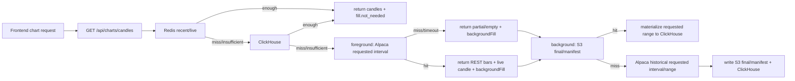

# GOPS Chart On-Demand Fill Plan

This file is the current chart-data contract for GOPS. Older notes that describe
Redis Stream chart backfill workers, broad initial preload, fixed preset chart
universes, or raw S3 replay as a normal chart source are superseded.

## Korean Summary

차트 데이터는 이제 `GET /api/charts/candles` 하나로 읽고 채운다. 프런트가
요청한 `symbol + interval + limit/before/from/to` 범위만 처리하며, 숨은
6년 preload나 S&P500 전체 chart backfill은 하지 않는다. 단, SIP 런타임은
S&P500 전체 `bars/updatedBars/dailyBars/statuses`를 baseline으로 구독해 최신
1분봉 진입성을 높인다. `trades/quotes` tick은 active chart, watchlist,
portfolio, ranking, manual admin 같은 명시 cohort로 제한한다.

조회 순서는 고정이다.

```text
Redis recent/live window
-> ClickHouse canonical chart_candles
-> bounded auto/general foreground Alpaca REST direct bars
-> background S3 final objects and manifests
-> background Alpaca historical direct bars
```

Redis/ClickHouse 데이터가 renderable이면 즉시 반환한다. 부족하면 API
foreground path는 일반 interval에 대해 기본적으로 Alpaca REST를 기다리지 않고
partial/empty payload와 background fill trace를 반환한다. 운영 EKS 설정은
`1m/5m/10m/1h/4h/1D/1W/1M`의 작은 결손 범위에서 자동 foreground REST를
허용하고, 그 외 일반 foreground는 `ON_DEMAND_FILL_FOREGROUND_ALPACA_ENABLED=true`
일 때 요청 interval 그대로 closed historical bars를 가져와 현재 Redis
live/provisional candle과 병합해 반환할 수 있다. ClickHouse serving은 stored
`1m` row에 한해 `priceAdjustment=live`인
closed realtime Alpaca bars도 허용한다. 이는 SIP baseline/active session에서
이미 저장된 최신 1분봉이 차트 API에서 숨겨지는 것을 막기 위한 serving 예외이며,
`1D`와 historical canonical materialization은 계속 `priceAdjustment=split`을
기준으로 한다. 단, Redis의
`symbol + interval` closed watermark 이하 timestamp는 closed candle이 우선하며
live/provisional candle을 반환하지 않는다. `after -> overnight`, `overnight -> pre`
전환 구간에서는 직전 adjacent extended session도 현재 live chart window에 포함해,
이미 저장된 after-hours/overnight row가 조회 필터에서 사라지지 않게 한다. 동시에
background fill은 같은 요청 범위를 S3 final/manifest와 ClickHouse에 저장한다.
Raw S3 archive는 감사/백업용이며
chart serving, coverage, fill decision, ClickHouse materialization source로 쓰지
않는다.

## API Contract

Active chart routes:

```text
GET  /api/charts/candles
GET  /api/charts/indicators
GET  /api/charts/volume-profile-bins
GET  /api/charts/order-flow/symbols
GET  /api/charts/order-flow/daily
GET  /api/charts/order-flow/intraday
GET  /api/charts/symbols
WS   /ws/charts
```

`/ws/charts` delivers candle/trade/quote/event updates plus
`ORDER_FLOW_BINS_UPDATE` for order-flow live minute replacements. The removed
legacy `GET /api/charts/footprint` route is intentionally not part of the active
contract.

Deprecated queue routes are preserved as `410 Gone`:

```text
POST /api/charts/backfill
GET  /api/charts/backfill/status
GET  /api/charts/backfill/queue
```

`GET /api/charts/candles` keeps existing `dataStatus` and `coverage` fields and
adds a `fill` trace:

```json
{
  "fill": {
    "status": "not_needed | filled | partial | timeout | failed | empty",
    "requestedRange": {"start": "...", "end": "..."},
    "requestedLimit": 120,
    "sourceInterval": "1h",
    "sources": {
      "redis": {"checked": true, "hit": true, "rowCount": 120, "durationMs": 1, "error": null},
      "clickhouse": {"checked": false, "hit": false, "rowCount": 0, "durationMs": 0, "error": null},
      "s3": {"checked": false, "hit": false, "rowCount": 0, "durationMs": 0, "error": null},
      "alpaca": {"checked": false, "hit": false, "rowCount": 0, "durationMs": 0, "error": null}
    },
    "missingRanges": [],
    "gapRanges": [],
    "renderable": true,
    "minimumReturnedCount": 20,
    "minimumRenderableSourceBars": 30
  }
}
```

Top-level `backfillStatus`, `canBackfill`, and `repairStatus` are not chart
control fields. Coverage may still include diagnostic `repairStatus`.

## Source Interval Rules

Historical REST fill fetches the requested canonical interval directly:

```text
1m  -> Alpaca 1Min
5m  -> Alpaca 5Min
10m -> Alpaca 10Min
1h  -> Alpaca 1Hour
4h  -> Alpaca 4Hour
1D  -> Alpaca 1Day
1W  -> Alpaca 1Week
1M  -> Alpaca 1Month
```

Realtime live/provisional candles still use local aggregation: `5m/10m/1h/4h`
from `1m`, `1D` from intraday live state, and `1W/1M` from daily state. ClickHouse
serving prefers stored direct interval rows; if none exist yet, it falls back to
the older query-time aggregation from `1m` or `1D`.

Realtime raw trades are processed directly by the market processor. The
processor no longer publishes a tick fanout message and waits for its own
consumer group to re-read it on the normal hot path. Tick fanout topics remain
available only for legacy/debug consumers. Closed candles are published to
interval-specific layer topics:

```text
market.layer.candles.1m.closed.v1
market.layer.candles.5m.closed.v1
market.layer.candles.10m.closed.v1
market.layer.candles.1h.closed.v1
market.layer.candles.4h.closed.v1
market.layer.candles.1d.closed.v1
market.layer.candles.1w.closed.v1
market.layer.candles.1mo.closed.v1
```

Each message still carries its canonical `interval` payload field. The legacy
`market.layer.candles.closed.v1` topic remains listed in platform topic files
for compatibility but is not the default processor output.

The hot raw path is split by input class. `alfaka-market-processor` consumes
trades, bars, updated bars, daily bars, and events; `alfaka-market-quote-processor`
consumes quotes in its own consumer group. `market.input.realtime.trades.v1` and
`market.input.realtime.quotes.v1` should have 12 partitions so consumer pods can
scale independently behind Kafka's partition assignment.

Minimum renderability is separate from full coverage. The foreground chart
request returns Redis/ClickHouse candles immediately when they are renderable,
even if full coverage still needs repair. If they are not renderable, bounded
foreground Alpaca direct fill may return a renderable payload immediately.
Missing ranges are still queued as bounded background fill and surfaced in the
`fill.backgroundFill` trace.
Tiny latest-window reads below the interval renderability minimum, such as
health checks or live snapshots asking for five `1m` candles, do not enqueue
background fill when the requested count is already returned and no explicit
missing range is present.

Closed candles update a Redis closed watermark per `symbol + interval`. The
processor deletes stale live candles at or before that watermark, rejects late
tick buckets before they enter provisional builders, and the API/WebSocket paths
drop `LIVE_CANDLE_UPDATE` payloads that are not newer than the latest closed
timestamp.

## Runtime Flow



The API foreground path does not wait on S3 writes. By default it does not wait
on Alpaca REST for every interval. `1D/1W/1M` use bounded auto foreground REST up
to `ON_DEMAND_FILL_FOREGROUND_AUTO_MAX_BARS` estimated bars so sparse daily-like
chart openings can render immediately. Set
`ON_DEMAND_FILL_FOREGROUND_ALPACA_ENABLED=true` to allow the general foreground
path up to `ON_DEMAND_FILL_FOREGROUND_MAX_BARS` estimated bars.
Intraday equity fill splits each requested range by market session before
calling Alpaca REST. `pre`, `regular`, and `after` slices are historical
REST-fetchable, while `overnight` slices are BOATS live/on-demand subscription
only and are recorded as skipped `fill.feedRoutes` entries.
Background fill is bounded by `ON_DEMAND_FILL_BACKGROUND_TIMEOUT_SECONDS` and
writes source failures to logs/monitoring; the initiating response shows
foreground and background state. Alpaca no-data remains an `empty` or `partial`
fill result, not a backend crash.

## Frontend Contract

The frontend calls `fetchCandles()` only. It does not request queue backfills,
poll status endpoints, or keep retry tokens for terminal ranges. When a chart is
blank or partial, it displays `dataStatus`, response `message`, and the `fill`
trace so CSCO 1D or similar failures show which source missed or failed.

Opening WebSocket for 1D remains a separate realtime subscription concern and is
not part of on-demand fill. Opening any valid chart symbol may promote that
symbol to the explicit realtime `trades/quotes` cohort while the chart is active;
the S&P500 baseline itself is bars/statuses only, so ETF symbols such as QQQ rely
on explicit on-demand chart subscription rather than S&P500 membership.

## Runtime Units

Chart on-demand fill runs inside the API server. The chart `backfill-worker`
deployment, `initial-load` job, and chart backfill queue env are not part of the
current runtime. Coverage repair is an audit job that calls the candles endpoint
and reports the returned fill trace.

Chart-derived rendering data is separate from candle fill. The API server owns
request normalization, candle source fill for indicator requests, Redis/ClickHouse
artifact lookup, Kafka enqueue, and short wait/pending responses. The
`chart-derived-data-worker` owns indicator and candle-based volume profile
calculation. It consumes `market.chart-derived.requests.v1`, writes hot results
to Redis, and materializes request artifacts into
`market_data.chart_derived_artifacts` so the frontend and future Agent flows can
reference the same derived result by request hash.
Volume profile v1 is always candle OHLCV based `estimated` data for the
requested chart interval; it does not depend on trade ticks or
`volume_profile_bins_1m` materialization.

Bid/ask order-flow profile is a separate trade+quote path. The live processor
writes `order-flow:{symbol}:live` Redis hash fields for pinned symbols and
publishes `ORDER_FLOW_BINS_UPDATE`; the EOD job
`systems/market-data/jobs/order-flow-daily-rollup/main.py` materializes daily
rows into `market_data.order_flow_profile_daily`. Local compose exposes the
`order-flow-daily-rollup` jobs-profile service, and AWS uses
`infra/k8s/overlays/aws/cronjob-order-flow-daily-rollup.yaml`. The shared dev
`aws-incluster-app-ci` deploy path also includes that scheduled CronJob via the
in-cluster app overlay. Keep both overlay CronJob manifests in sync; ad hoc
backfills stay manual.

The trade-derived live `volume-profile:{symbol}:1m:live` Redis zset is a bounded
hot cache, not historical storage. The processor trims it by
`VOLUME_PROFILE_LIVE_WINDOW_SECONDS` and `VOLUME_PROFILE_LIVE_MAX_BINS`, then
expires idle keys with `VOLUME_PROFILE_LIVE_TTL_SECONDS`. Trimming is batched by
`VOLUME_PROFILE_LIVE_TRIM_BATCH_SIZE` so existing oversized keys shrink
incrementally instead of being deleted in one blocking Redis command.

Derived result retention is intentionally shorter than candle history:

```text
Redis: indicators 300s, volume profile 30s
ClickHouse artifacts: indicators 7d, volume profile 1d
```

News historical collection remains a separate news-domain job and may still use
`NEWS_BACKFILL_*` env names.

## Validation

Use this order when changing chart fill:

```text
git diff --check
.venv/bin/python -m unittest discover -s systems/api-server/tests -p 'test_market_data_query.py'
.venv/bin/python -m unittest discover -s systems/api-server/tests -p 'test_agent_routes.py'
apps/gops-frontend: tsc -b
apps/gops-frontend: vite build
apps/gops-frontend: node scripts/run-chart-tests.mjs
docker compose config
docker compose build
```

Core cases:

- Redis hit does not call ClickHouse/S3/Alpaca.
- Redis miss and ClickHouse hit does not call S3/Alpaca.
- ClickHouse miss and S3 hit materializes only the requested range.
- S3 miss calls Alpaca historical only for the requested interval and range.
- 5m/10m/1h/4h/1W/1M direct interval rows are preferred; source aggregation is a fallback.
- Foreground Alpaca direct fill merges historical bars with the latest live candle only when the live candle is newer than the closed watermark.
- Timeout returns partial candles plus source-level trace.
