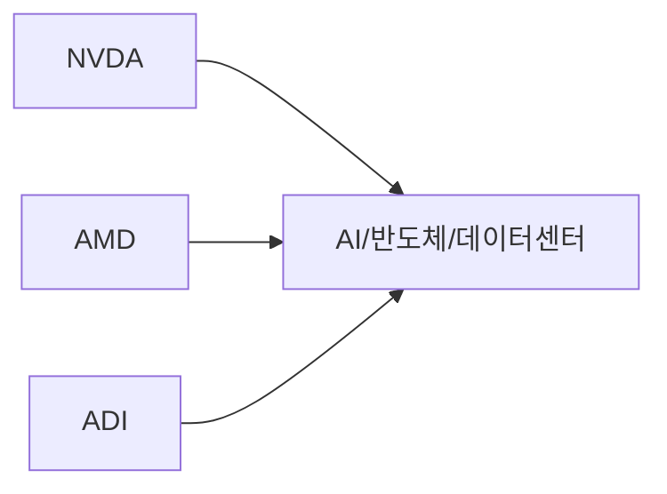

# 온톨로지 기업관계 패널 프론트 연동 요청서

## 목적

이 문서는 프론트 담당자가 `기업 관계` 패널만 독립적으로 이식/연동할 수 있도록 정리한 요청서입니다.

핵심은 전체 멀티에이전트 구조가 아니라, **백엔드 분석 결과에 포함된 ontology evidence를 프론트에서 node/edge 그래프로 변환해 렌더링하는 것**입니다.

NVDA는 예시일 뿐입니다. 이 패널은 엔비디아 전용이 아니라, completed analysis report의 `providerEvidence`에 포함된 ontology 관계를 `ticker`, `theme`, `company` 노드와 edge로 변환해 그립니다.

## 중요한 전제

프론트는 `nasdaq-fibo-graphdb-deploy.zip`, GraphDB, SPARQL을 직접 읽지 않습니다.

프론트가 사용하는 입력은 오직 백엔드가 내려주는 completed analysis report의 `providerEvidence`입니다.

정확한 표현은 다음과 같습니다.

```md
GraphDB zip에 존재하는 모든 관계를 프론트가 직접 읽거나 전체 표시하지 않습니다.
프론트는 백엔드가 AnalysisReport.providerEvidence로 내려준 ontology evidence만 렌더링합니다.
새 relationType을 화면에 표시하려면 백엔드가 해당 relationType을 evidence로 내려주고,
프론트 graph mapper가 그 relationType을 처리해야 합니다.
```

## 백엔드 수정이 필요한 경우

이 문서는 프론트 패널 연동 요청서이지만, 프론트 담당자가 백엔드 코드를 절대 만지면 안 된다는 뜻은 아닙니다.

기본 책임은 프론트에서 ontology evidence를 그래프로 그리는 것이지만, 아래 문제가 있으면 백엔드 쪽도 함께 확인하거나 수정할 수 있습니다.

- completed analysis report에 `providerEvidence`가 내려오지 않는 경우
- `providerEvidence`는 있지만 `provider="ontology"` 항목이 없는 경우
- ontology evidence가 `status="available"`이 아니라 `no-data`로만 내려오는 경우
- `raw.relationType`이 프론트 mapper가 처리하지 않는 새 값인 경우
- GraphDB에는 관계가 있는데 백엔드가 해당 관계를 evidence로 변환하지 못하는 경우

백엔드에서 수정할 수 있는 범위는 **ontology evidence 계약을 맞추는 부분**입니다.

```txt
GraphDB / ontology provider
  -> EvidenceItem(provider="ontology", status="available")
  -> raw.relationType / raw.ticker / raw.themeName / raw.companyName
  -> completed AnalysisReport.providerEvidence
```

반대로 이 요청서만 보고 뉴스, 차트, 주문, 계좌, 전체 멀티에이전트 orchestration 구조를 같이 개편하지는 않습니다.

## 프론트가 처리해야 하는 Evidence 조건

그래프로 변환할 evidence는 아래 조건을 만족해야 합니다.

```ts
item.provider === "ontology"
item.status === "available"
```

그 외 provider나 `no-data` evidence는 그래프 변환에서 무시합니다.

지원해야 하는 `raw.relationType`은 다음입니다.

```ts
"theme"
"theme-company"
"control"
"theme-control"
"shared-theme"
"cross-control"
```

## Evidence 예시

아래는 NVDA 예시입니다. 실제로는 AMD, AAPL, MSFT 등 GraphDB에 있고 백엔드가 evidence로 내려주는 다른 ticker도 같은 방식으로 처리됩니다.

```json
{
  "provider": "ontology",
  "status": "available",
  "title": "AI/반도체/데이터센터 관련 기업",
  "summary": "AMD는 AI/반도체/데이터센터 테마에 포함된 기업입니다.",
  "raw": {
    "relationType": "theme-company",
    "ticker": "AMD",
    "companyName": "Advanced Micro Devices",
    "themeName": "AI/반도체/데이터센터"
  }
}
```

## 그래프 변환 규칙

프론트는 `providerEvidence` 배열을 순회하면서 아래 규칙으로 노드와 엣지를 만듭니다.

```ts
theme, theme-company:
  symbol/ticker node -> theme node

control, theme-control:
  symbol/ticker node -> controlled company node

shared-theme:
  each symbols[] node -> theme node

cross-control:
  controllerTicker node -> controlledTicker node
```

예시:



## 프론트 구현 참고

현재 참고할 핵심 파일은 다음입니다.

```txt
apps/gops-frontend/src/agents/ontologyGraph.ts
apps/gops-frontend/src/components/OntologyForceGraph.tsx
apps/gops-frontend/src/components/SystemArea.tsx
```

프론트 개편 후에도 유지해야 하는 최소 흐름은 아래입니다.

```txt
completed AnalysisReport
  -> report.providerEvidence
  -> buildOntologyGraphFromEvidence(providerEvidence, symbol)
  -> ontologyGraph panel props
  -> OntologyForceGraph render
```

## 성공 기준

아래 조건을 만족하면 연동 성공으로 봅니다.

- ontology evidence가 없으면 `관계 분석 결과가 아직 없습니다` 상태를 유지한다.
- `theme-company` evidence가 있으면 패널이 비어 있으면 안 된다.
- `NVDA`, `AMD`, `ADI`, `AMAT`, `ANET` 같은 symbol node가 표시될 수 있어야 한다.
- `AI/반도체/데이터센터` 같은 theme node가 표시되어야 한다.
- `theme-company`는 기존 `theme`과 동일하게 `ticker -> themeName` 관계로 그려야 한다.
- NVDA 전용으로 하드코딩하지 않는다.
- 백엔드가 다른 ticker의 ontology evidence를 내려주면 같은 그래프 로직으로 표시되어야 한다.

## 프론트 담당자에게 전달할 핵심 한 줄

이 패널은 GraphDB zip을 직접 읽는 패널이 아니라, 백엔드 completed analysis report의 `providerEvidence` 중 `provider="ontology"`인 항목을 node/edge graph로 변환해 보여주는 패널입니다.
