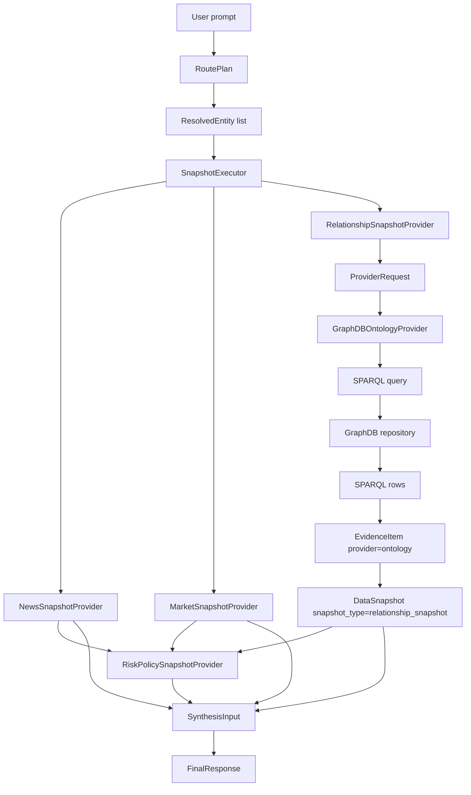

# GraphDB Relationship Agent Handoff

이 문서는 GraphDB 담당자가 `relationship_snapshot` 계층만 맡아 구현할 수 있도록 범위, 계약, 실패 모드, acceptance scenario를 고정한다. 전체 orchestrator, 뉴스 캐시, UI는 이 문서의 작업 범위가 아니다.

## Scope

담당 범위:

- `GraphDBOntologyProvider`
- `RelationshipSnapshotProvider`
- SPARQL query 작성과 결과 row normalization
- relation type normalization
- graph path scoring
- graph path cache
- GraphDB empty/timeout/error/partial data failure mode

비범위:

- News cache, Redis, ClickHouse news intelligence 로직
- Synthesis LLM 전체 prompt와 답변 생성 정책
- UI layout, panel composition, chat rendering
- order/account/KIS flow
- market-data ingestion/backfill/storage pipeline

## Current Code Locations

| Area | Path |
| --- | --- |
| Core contracts | `systems/agent-orchestration/shared/gops_agents/contracts.py` |
| `ProviderRequest`, `GraphDBOntologyProvider`, SPARQL helpers | `systems/agent-orchestration/shared/gops_agents/providers.py` |
| `RelationshipSnapshotProvider`, `SnapshotExecutor` | `systems/agent-orchestration/shared/gops_agents/snapshots.py` |
| Orchestrator trace and hidden snapshot behavior | `systems/agent-orchestration/shared/gops_agents/orchestrator.py` |
| Agent orchestration tests | `systems/agent-orchestration/tests/test_agent_orchestration.py` |
| Canonical architecture | `docs/AGENT_ARCHITECTURE.md` |

## Runtime Flow



`risk_policy_snapshot`은 final synthesis와 guardrail에는 들어가지만 기본 사용자-facing agent trace에서는 숨긴다. GraphDB 담당자는 `relationship_snapshot`의 품질과 failure mode를 책임진다.

## Input Contract

### RoutePlan

`RoutePlan`은 어떤 snapshot bundle을 조회할지 결정한다. GraphDB 담당자가 직접 생성하지 않는다.

필수로 참고할 필드:

- `run_id`
- `intent`
- `entity_candidates`
- `snapshot_bundle`
- `execution_mode`
- `llm_calls_allowed`

`relationship_snapshot`은 보통 다음 intent에서 포함된다.

- `investment_opinion`
- `news_impact_analysis`
- `relationship_impact_analysis`
- `company_comparison`

### ResolvedEntity

`ResolvedEntity`는 사용자 표현을 canonical entity로 표준화한 결과다.

필수로 참고할 필드:

- `raw_name`
- `canonical_name`
- `ticker`
- `market`
- `asset_type`
- `graph_node_id`
- `confidence`

현재 구현은 ticker 중심이다. GraphDB 담당자는 `graph_node_id`를 실제 GraphDB node URI 또는 internal ID와 연결하는 mapping 전략을 보강할 수 있다.

### ProviderRequest

현재 provider 입력은 다음 dataclass다.

```python
@dataclass
class ProviderRequest:
    symbol: str
    intent: str
    symbols: tuple[str, ...] = field(default_factory=tuple)
```

현재 `RelationshipSnapshotProvider`는 `ProviderRequest(str(context.symbol), str(context.intent))` 형태로 호출한다. 다중 종목 관계 분석을 안정화하려면 `symbols`를 활용해 pair 또는 group query로 확장해야 한다.

## Output Contract

GraphDB 담당자의 최종 산출물은 `DataSnapshot(snapshot_type="relationship_snapshot")`이다.

필수 조건:

- `snapshot_type`은 항상 `relationship_snapshot`
- GraphDB 근거가 있으면 `status="success"`
- 일부만 있거나 직접 경로가 없으면 `status="partial"`
- 완전한 provider 실패는 `status="partial"` 또는 orchestrator error snapshot으로 처리하되, warning을 반드시 남긴다.
- `evidence[*].provider`는 `ontology`
- `evidence[*].raw.relationType`은 normalize된 relation type을 사용한다.
- `signals`는 top-k 관계 영향만 담고 장문 path 전체를 넣지 않는다.
- `confidence`는 graph evidence 품질, path length, relation type, freshness를 반영한다.

예시:

```json
{
  "snapshot_type": "relationship_snapshot",
  "status": "success",
  "source": "database",
  "cache_hit": false,
  "summary": "NVDA는 AI Accelerator와 Semiconductor Manufacturing 테마로 연결됩니다.",
  "signals": [
    {
      "target": "NVDA",
      "direction": "unknown",
      "horizon": "unknown",
      "strength": "medium",
      "reasoning": "GraphDB에서 NVDA와 AI Accelerator 테마 매핑 근거가 확인되었습니다."
    }
  ],
  "warnings": []
}
```

## Relation Types

현재 relation type:

| Type | Meaning |
| --- | --- |
| `theme` | ticker가 theme에 직접 매핑됨 |
| `control` | ticker 기준 직접 지배/자회사 관계 |
| `theme-company` | theme query로 찾은 관련 company |
| `theme-control` | theme query로 찾은 control 관계 |
| `no-direct-control` | 직접 지배/자회사 관계 근거 없음 |
| `no-ontology-evidence` | GraphDB에서 관련 ontology 근거 없음 |
| `graphdb-unavailable` | GraphDB query 실패 또는 timeout |

확장 후보:

- `supplier`
- `customer`
- `competitor`
- `partner`
- `supply-chain`
- `same-sector`
- `same-theme`
- `regulatory-exposure`

새 type을 추가할 때는 `row_to_ontology_evidence()`의 `raw.relationType`, `relationship_signal_from_evidence()`, 테스트 fixture를 함께 갱신한다.

## Required Warnings

GraphDB 담당자는 최소한 다음 warning을 구분해야 한다.

| Warning | When |
| --- | --- |
| `no_clear_relationship_path` | GraphDB 조회는 됐지만 target과 source 사이의 명확한 path가 없음 |
| `graphdb_unavailable` | GraphDB endpoint timeout, connection error, HTTP error |
| `relationship_snapshot_unavailable` | provider 결과를 snapshot으로 구성할 수 없음 |
| `partial_relationship_data` | 일부 relation만 확인되어 직접 영향 단정이 어려움 |

현재 코드는 evidence가 없을 때 주로 `no_clear_relationship_path`를 반환한다. 위 taxonomy로 세분화하는 것이 GraphDB 담당자의 우선 작업이다.

## SPARQL And Scoring Requirements

SPARQL query는 다음 질문을 빠르게 답해야 한다.

- ticker가 어떤 theme에 속하는가?
- ticker가 직접 지배하거나 지배받는 company가 있는가?
- 사용자가 언급한 theme 또는 sector에 속한 company는 무엇인가?
- 두 ticker 또는 ticker-theme 사이에 1-hop/2-hop path가 있는가?
- path가 직접 관계인지, 같은 theme을 공유하는 약한 관계인지 구분할 수 있는가?

Path scoring 기준:

- direct control, supplier/customer 같은 직접 business relation은 높게 평가한다.
- same-theme, same-sector는 직접 관계보다 낮게 평가한다.
- path length가 길수록 score를 낮춘다.
- source URL, accession, confidence 같은 provenance가 있으면 score를 올린다.
- GraphDB evidence가 없으면 score를 만들지 않는다.

Cache 기준:

- key는 `source_entity`, `target_entity`, `intent/theme`, `max_depth`, `relation_version`을 포함한다.
- cache item은 path summary, relation types, score, source refs, generated_at을 포함한다.
- cache miss여도 GraphDB timeout이 전체 hot path를 오래 막지 않도록 timeout을 짧게 유지한다.

## Acceptance Scenarios

### 1. `NVDA 관계 분석해줘`

기대:

- `RoutePlan.intent`는 `relationship_impact_analysis` 또는 relationship snapshot이 포함된 intent다.
- `ResolvedEntity.ticker`는 `NVDA`다.
- `relationship_snapshot`이 생성된다.
- GraphDB evidence가 있으면 `theme` 또는 `control` evidence를 반환한다.
- evidence가 없으면 `no_ontology_evidence`와 `no_clear_relationship_path` 계열 warning을 남긴다.

### 2. `삼성전자랑 SK하이닉스에 영향 주는 미국 반도체 뉴스 찾아줘`

기대:

- news snapshot은 뉴스 cache 계층에서 가져온다.
- relationship snapshot은 삼성전자, SK하이닉스, 미국 반도체 theme/entity 사이의 graph path를 시도한다.
- 직접 path가 없으면 단정하지 않고 `partial_relationship_data` 또는 `no_clear_relationship_path`를 남긴다.
- 다중 종목 처리를 위해 `ProviderRequest.symbols` 확장을 검토한다.

### 3. GraphDB Empty

기대:

- provider는 exception을 던지지 않는다.
- `relationship_snapshot.status`는 `partial`이다.
- `raw.relationType`에 `no-ontology-evidence` 또는 `no-direct-control`이 포함된다.
- final response는 관계 근거가 없다고 표현한다.

### 4. GraphDB Timeout/Error

기대:

- timeout/error가 orchestrator 전체 실패로 번지지 않는다.
- `graphdb_unavailable` warning을 남긴다.
- evidence raw에는 `relationType="graphdb-unavailable"`와 error type이 남는다.
- final response는 GraphDB 조회 실패로 관계 분석이 제한됐다고 표현한다.

### 5. Theme Exists But Direct Path Missing

기대:

- theme evidence는 반환한다.
- direct control 또는 direct company path가 없으면 별도 warning을 남긴다.
- final response는 “같은 테마/섹터 노출”과 “직접 영향 경로”를 구분한다.

## Test Guidance

GraphDB 담당자는 최소 다음 테스트를 추가하거나 갱신한다.

- SPARQL JSON row가 relation type별 `EvidenceItem`으로 normalize되는지
- GraphDB empty result가 no-data evidence로 변환되는지
- GraphDB timeout/error가 `graphdb_unavailable` warning으로 이어지는지
- `RelationshipSnapshotProvider`가 `DataSnapshot(snapshot_type="relationship_snapshot")`을 항상 반환하는지
- 다중 ticker request에서 top-k path와 warning이 안정적인지

문서 계약이 바뀌면 `docs/AGENT_ARCHITECTURE.md`도 함께 업데이트한다.
