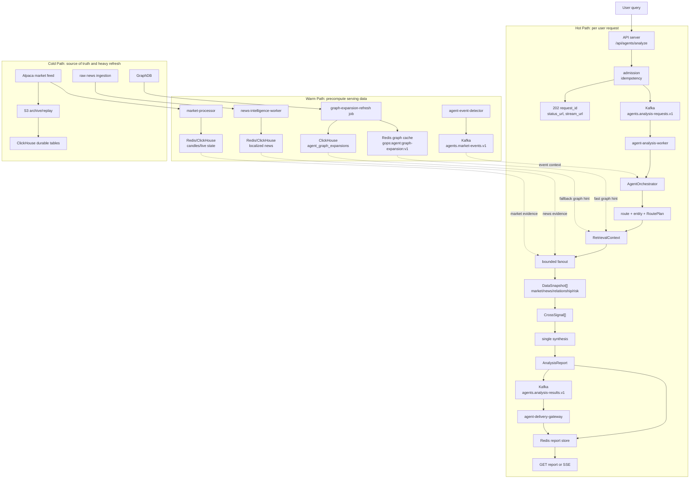
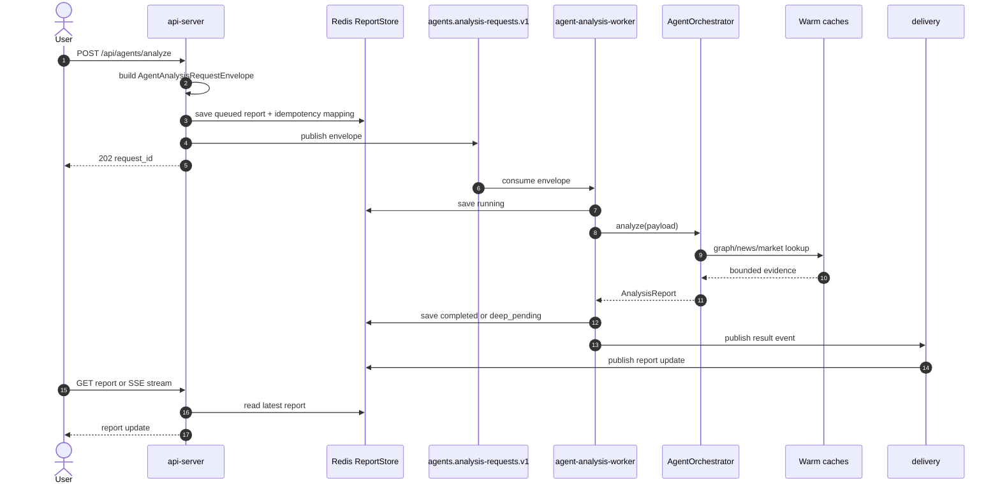
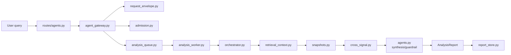
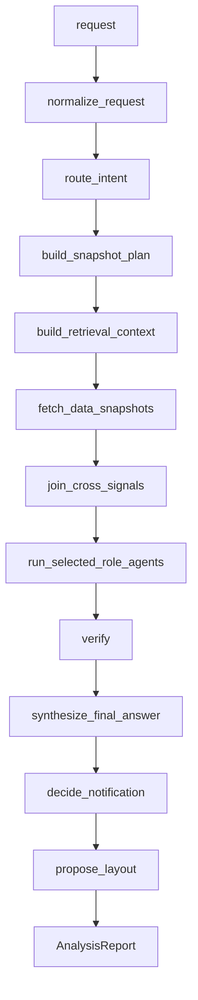
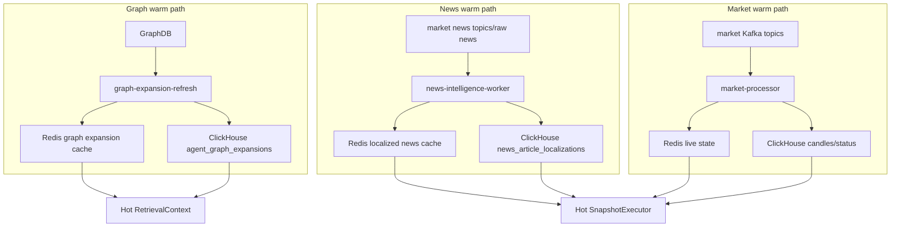
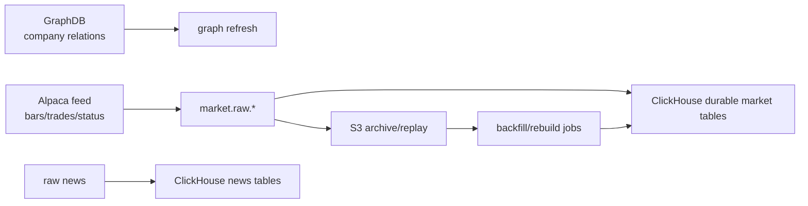
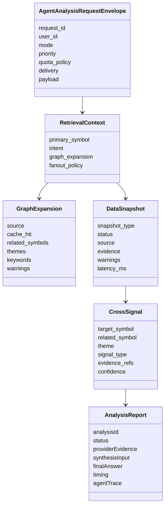
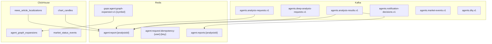
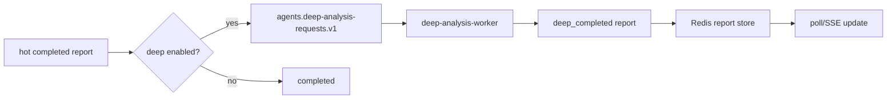
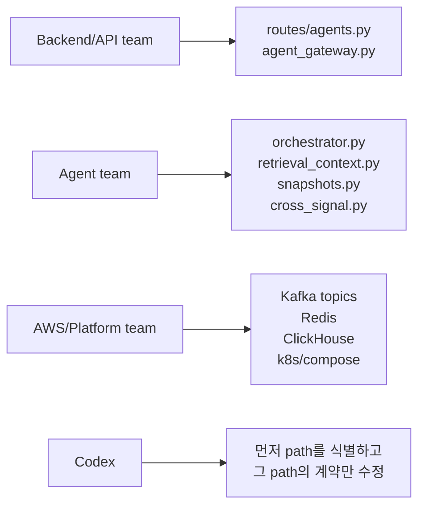

# GOPS Graph-Aware Agent Architecture

이 문서는 사용자 쿼리가 들어온 뒤 GOPS 에이전트가 어떤 경로로 답변을 만드는지 설명한다.
중심은 파일 목록이 아니라 **Hot Path, Warm Path, Cold Path가 어떻게 나뉘고 다시 합쳐지는가**다.

대상 독자:

- 에이전트 담당 팀: `systems/agent-orchestration` 안에서 무엇을 어디에 붙일지 판단한다.
- 백엔드/API 담당 팀: `/api/agents/*`가 어디까지 책임지는지 판단한다.
- AWS/플랫폼 담당 팀: Kafka, Redis, ClickHouse, k8s 경계를 맞춘다.
- Codex: 새 기능을 붙일 때 어느 path를 건드리는지 먼저 확인한다.

## 0. 전체 그림 먼저 보기

사용자 쿼리 이후 시스템은 세 경로로 움직인다.

- **Hot Path**: 사용자 요청에 직접 반응한다. request id를 만들고, queue/worker를 통해 빠른 답변을 만든다.
- **Warm Path**: 사용자 요청 전에 미리 계산해 hot path가 읽을 cache와 snapshot을 만든다.
- **Cold Path**: GraphDB, 원천 뉴스, 원천 마켓 데이터, durable storage처럼 무겁고 느린 source-of-truth 영역이다.



이 그림에서 가장 중요한 점은 하나다.

```text
Hot path는 계산을 새로 다 끝내는 경로가 아니다.
Hot path는 warm/cold path가 미리 만들어 둔 cache와 snapshot을 bounded retrieval로 읽고,
부족하면 primary-only 또는 deep_pending으로 degrade한다.
```

## 1. 한 요청이 실제로 지나가는 순서

사용자 쿼리 하나는 아래 순서로 처리된다.



이 흐름에서 각 계층의 책임은 분명하다.

| 계층 | 하는 일 | 하지 않는 일 |
| --- | --- | --- |
| API server | request id, idempotency, admission, report polling/SSE | LLM 분석, GraphDB deep traversal |
| Kafka | hot/deep analysis work boundary | 분석 판단 |
| agent worker | queue 소비, orchestrator 실행, report 저장 | HTTP response code 결정 |
| AgentOrchestrator | route, retrieval, snapshots, cross-signal, synthesis | Kafka topic 생성, k8s/AWS 리소스 소유 |
| Warm caches | hot path가 읽는 graph/news/market serving data 제공 | 사용자별 최종 답변 생성 |
| Cold sources | GraphDB/raw news/market feed/S3/ClickHouse durable source | 사용자 요청마다 직접 fanout |

## 2. Hot Path

Hot path는 사용자 요청에 직접 연결된 경로다.
목표는 "모든 분석을 즉석에서 깊게 끝내기"가 아니라 "사용자가 즉시 추적 가능한 request id를 받고, 빠른 cached/bounded answer를 받게 하기"다.



Hot path의 내부 LangGraph 줄기는 아래다.



Hot path에서 중요한 제한:

```text
LLM 호출은 기본 1회 synthesis 중심.
GraphDB direct traversal은 기본값이 아님.
related symbol fanout은 top-k와 deadline 안에서만 수행.
provider별 bulkhead로 timeout/rate-limit 전파를 막음.
결과는 Redis report store에 저장하고 request id로 조회.
```

Hot path 주요 파일:

| 단계 | 파일 |
| --- | --- |
| HTTP entry | `systems/api-server/pods/api-server/gops-backend/app/routes/agents.py` |
| API gateway | `systems/api-server/pods/api-server/gops-backend/app/services/agent_gateway.py` |
| request contract | `systems/agent-orchestration/shared/gops_agents/request_envelope.py` |
| admission | `systems/agent-orchestration/shared/gops_agents/admission.py` |
| queue adapter | `systems/agent-orchestration/shared/gops_agents/analysis_queue.py` |
| worker | `systems/agent-orchestration/shared/gops_agents/analysis_worker.py` |
| orchestrator | `systems/agent-orchestration/shared/gops_agents/orchestrator.py` |
| retrieval | `systems/agent-orchestration/shared/gops_agents/retrieval_context.py` |
| snapshots | `systems/agent-orchestration/shared/gops_agents/snapshots.py` |
| cross-signal | `systems/agent-orchestration/shared/gops_agents/cross_signal.py` |
| synthesis/roles | `systems/agent-orchestration/shared/gops_agents/agents.py` |
| report store | `systems/agent-orchestration/shared/gops_agents/report_store.py` |

## 3. Warm Path

Warm path는 hot path가 읽을 데이터를 미리 만들어 두는 경로다.
사용자 요청을 직접 기다리지 않으며, cache hit와 p95 latency를 지키기 위한 serving layer다.



Warm path가 해결하는 문제:

```text
GraphDB, 뉴스 분석, 마켓 집계처럼 무겁거나 반복되는 계산을 사용자 요청 밖으로 뺀다.
hot symbol 요청이 몰릴 때 같은 관계/뉴스/시장 계산을 사용자별로 반복하지 않게 한다.
GraphDB 장애나 cache miss가 있어도 ClickHouse fallback 또는 primary-only degrade를 가능하게 한다.
```

Warm path 주요 runtime:

| Runtime | 파일 | 결과 |
| --- | --- | --- |
| graph expansion refresh | `systems/agent-orchestration/jobs/graph-expansion-refresh/main.py` | Redis graph cache, ClickHouse `agent_graph_expansions` |
| graph expansion smoke | `systems/agent-orchestration/jobs/graph-expansion-smoke/main.py` | graph cache lookup/degrade 검증 |
| news intelligence worker | `systems/market-data/pods/news-intelligence-worker/main.py` | localized news cache/table |
| market processor | `systems/market-data/pods/market-processor/local_main.py` | Redis live state, ClickHouse market tables |
| event detector | `systems/agent-orchestration/pods/event-detector/main.py` | `agents.market-events.v1` |

Warm path의 원칙:

```text
GraphDB는 hot path 기본 serving DB가 아니라 warm refresh source다.
뉴스 원문 전체를 hot path LLM에 넣지 않는다.
마켓 데이터는 실제 provider/cache/ClickHouse에서만 오며 fake candle을 만들지 않는다.
```

## 4. Cold Path

Cold path는 원천 데이터와 durable storage다.
사용자 요청 하나에 직접 붙이면 p95가 무너지는 영역이다.



Cold path가 담당하는 것:

```text
원천 relation, 원천 market event, 원천 news article, replay/backfill, durable audit.
```

Cold path가 하지 말아야 하는 것:

```text
사용자 요청마다 deep traversal을 수행하지 않는다.
사용자별 final answer를 만들지 않는다.
hot path latency budget 안에 들어온다고 가정하지 않는다.
```

관련 플랫폼 파일:

| 영역 | 파일 |
| --- | --- |
| Kafka topics | `platform/kafka/topics.txt`, `platform/kafka/README.md` |
| ClickHouse schema | `infra/clickhouse/initdb/01-market-data.sql` |
| Compose runtime | `docker-compose.yml` |
| k8s base | `infra/k8s/base/configmap.yaml`, `infra/k8s/base/kustomization.yaml` |
| agent k8s workers/jobs | `infra/k8s/base/deployment-agent-analysis-worker.yaml`, `infra/k8s/base/deployment-deep-analysis-worker.yaml`, `infra/k8s/base/deployment-agent-delivery-gateway.yaml`, `infra/k8s/base/job-graph-expansion-refresh.yaml` |

## 5. 세 경로가 만나는 데이터 계약

Hot, warm, cold path는 아래 계약으로 만난다.



계약별 소유 파일:

| 계약 | 파일 |
| --- | --- |
| `AgentAnalysisRequestEnvelope` | `systems/agent-orchestration/shared/gops_agents/request_envelope.py` |
| `RetrievalContext`, `GraphExpansion`, `FanoutPolicy` | `systems/agent-orchestration/shared/gops_agents/retrieval_context.py` |
| graph expansion load/save | `systems/agent-orchestration/shared/gops_agents/graph_expansion.py` |
| `DataSnapshot`, `SynthesisInput`, `AnalysisReport` | `systems/agent-orchestration/shared/gops_agents/contracts.py` |
| `CrossSignal` build | `systems/agent-orchestration/shared/gops_agents/cross_signal.py` |
| report serialization/deserialization | `systems/agent-orchestration/shared/gops_agents/report_store.py` |

## 6. Kafka, Redis, ClickHouse 배치



Kafka:

```text
agents.analysis-requests.v1       hot analysis work queue
agents.deep-analysis-requests.v1  deep follow-up work queue
agents.analysis-results.v1        completed/updated report event
agents.notification-decisions.v1  notification decision event
agents.market-events.v1           detected market event stream
agents.dlq.v1                     failed/dead-letter messages
```

Redis:

```text
agent:report:{analysisId}
  report polling/SSE source.

agent:request:idempotency:{user}:{key}
  duplicate request collapse.

agent.reports:{analysisId}
  report update pubsub channel.

gops:agent:graph-expansion:v1:{symbol}
  hot graph hint cache.
```

ClickHouse:

```text
agent_graph_expansions
  Redis graph cache fallback and durable relation-versioned payload.

news_article_localizations
  prelocalized, classified news evidence.

chart_candles / market_status_events
  market evidence and current context.
```

## 7. Deep Path

Deep path는 hot path의 반대가 아니다.
Hot answer를 먼저 만든 뒤, 더 넓은 graph-aware 분석을 같은 `analysisId`에 후속 업데이트로 붙이는 경로다.



Deep path 원칙:

```text
deep worker backlog는 hot worker latency를 망치면 안 된다.
deep result는 새 request id가 아니라 같은 analysisId의 후속 상태로 들어간다.
deep mode는 feature flag와 quota로 끌 수 있어야 한다.
```

관련 파일:

| 파일 | 역할 |
| --- | --- |
| `systems/agent-orchestration/shared/gops_agents/analysis_worker.py` | hot report 이후 deep envelope enqueue와 `deep_pending/deep_completed` 상태 처리 |
| `systems/agent-orchestration/pods/deep-analysis-worker/main.py` | deep worker entrypoint |
| `infra/k8s/base/deployment-deep-analysis-worker.yaml` | k8s deep worker deployment |

## 8. 팀별 작업 경계



| 담당 | 소유 | 소유하지 않음 |
| --- | --- | --- |
| Backend/API | HTTP routes, status code, idempotency header, report polling/SSE | role agent 판단, GraphDB traversal |
| Agent team | orchestrator workflow, retrieval context, snapshots, cross-signal, synthesis input | API auth/session, AWS resource provisioning, order execution |
| AWS/Platform | Kafka/Redis/ClickHouse/k8s/image/env wiring | prompt wording, final answer policy |
| Codex | 현재 docs와 code contract에 맞춘 작은 변경 | unrelated refactor, order/KIS behavior 변경 |

Codex 판단 순서:

```text
1. 이 변경은 hot, warm, cold, deep 중 어디에 붙는가?
2. 새 data contract가 필요한가?
3. 새 Kafka topic, Redis key, ClickHouse table, env var가 필요한가?
4. hot path에 provider call, fanout, LLM call을 추가하는가?
5. 그렇다면 feature flag, deadline, bulkhead, test가 같이 있는가?
6. order/KIS/API 기존 contract를 건드리는가?
```

## 9. Runtime 목록

| Runtime | Path | Path type |
| --- | --- | --- |
| `agent-orchestrator` | `systems/agent-orchestration/pods/agent-orchestrator/main.py` | hot compatibility |
| `agent-analysis-worker` | `systems/agent-orchestration/pods/agent-analysis-worker/main.py` | hot |
| `deep-analysis-worker` | `systems/agent-orchestration/pods/deep-analysis-worker/main.py` | deep |
| `agent-delivery-gateway` | `systems/agent-orchestration/pods/agent-delivery-gateway/main.py` | delivery |
| `graph-expansion-refresh` | `systems/agent-orchestration/jobs/graph-expansion-refresh/main.py` | warm |
| `agent-queue-smoke` | `systems/agent-orchestration/jobs/agent-queue-smoke/main.py` | verification |
| `report-store-smoke` | `systems/agent-orchestration/jobs/report-store-smoke/main.py` | verification |
| `graph-expansion-smoke` | `systems/agent-orchestration/jobs/graph-expansion-smoke/main.py` | verification |
| `retrieval-latency-benchmark` | `systems/agent-orchestration/jobs/retrieval-latency-benchmark/main.py` | verification |
| `fanout-policy-benchmark` | `systems/agent-orchestration/jobs/fanout-policy-benchmark/main.py` | verification |
| `retrieval-quality-eval` | `systems/agent-orchestration/jobs/retrieval-quality-eval/main.py` | verification |
| `answer-grounding-eval` | `systems/agent-orchestration/jobs/answer-grounding-eval/main.py` | verification |

## 10. Feature Flags

Rollout은 한 번에 하지 않는다.
아래 flag로 path를 순서대로 켠다.

| Flag | 켜지는 경계 |
| --- | --- |
| `AGENT_ASYNC_ANALYSIS_ENABLED` | API가 queue-backed hot path를 사용 |
| `AGENT_SHARED_REPORT_STORE_ENABLED` | API report lookup이 shared store를 사용 |
| `AGENT_SYNC_COMPAT_WAIT_ENABLED` | async path를 쓰되 짧게 결과를 기다리는 compatibility mode |
| `AGENT_GRAPH_EXPANSION_CACHE_ENABLED` | `RetrievalContext`가 graph expansion cache를 읽음 |
| `AGENT_EXPANDED_RETRIEVAL_ENABLED` | related symbols/themes로 bounded fanout 수행 |
| `AGENT_CROSS_SIGNAL_ENABLED` | graph/news/market evidence를 cross-signal로 join |
| `AGENT_DEEP_ANALYSIS_ENABLED` | hot answer 이후 deep worker follow-up 사용 |

권장 rollout:

```text
1. compatibility mode 유지
2. shared report store enable
3. local async queue smoke
4. Kafka async worker canary
5. graph expansion cache enable
6. expanded retrieval canary
7. cross-signal synthesis canary
8. deep analysis opt-in
```

## 11. 관측성

Hot path에서 먼저 봐야 하는 값:

```text
edgeAckMs
queueWaitMs
retrievalContextMs
snapshotFetchMs
crossSignalJoinMs
finalAnswerMs
totalMs
```

Warm/cache 상태:

```text
graphExpansionCacheHit
analysisCacheHit
newsEvidenceCacheHit
relatedSymbolsRequested
relatedSymbolsUsed
fanoutTruncated
```

Capacity/reliability:

```text
analysisQueueDepth
analysisConsumerLag
hotWorkerSaturation
deepWorkerSaturation
providerBulkheadRejected
reportStoreWriteFailed
deliveryFanoutFailed
degradedReason
```

Quality:

```text
routeAccuracy
entityAccuracy
relationRecall
evidencePrecision
citationGrounding
evidenceMentionRate
```

## 12. 검증 루프

```bash
.venv/bin/python -m unittest systems.agent-orchestration.tests.test_agent_orchestration
.venv/bin/python -m unittest systems.api-server.tests.test_agent_routes
git diff --check
```

Smoke/eval:

```bash
PYTHONPATH=systems/agent-orchestration/shared:systems/market-data/shared \
  .venv/bin/python systems/agent-orchestration/jobs/agent-queue-smoke/main.py

PYTHONPATH=systems/agent-orchestration/shared:systems/market-data/shared \
  AGENT_BENCHMARK_BURST_REQUESTS=3 \
  .venv/bin/python systems/agent-orchestration/jobs/retrieval-latency-benchmark/main.py

PYTHONPATH=systems/agent-orchestration/shared:systems/market-data/shared \
  .venv/bin/python systems/agent-orchestration/jobs/retrieval-quality-eval/main.py

PYTHONPATH=systems/agent-orchestration/shared:systems/market-data/shared \
  .venv/bin/python systems/agent-orchestration/jobs/answer-grounding-eval/main.py
```

검증 의미:

| 검증 | 보는 것 |
| --- | --- |
| unit tests | request envelope, report store, retrieval context, worker, API route contract |
| queue smoke | API 없는 queue -> worker -> report round trip |
| latency benchmark | hot path stage latency와 hot symbol burst behavior |
| retrieval quality eval | route/entity/relation/evidence quality |
| answer grounding eval | final answer가 evidence에 grounded 되는지 |

## 13. Non-goals

이 아키텍처 문서의 범위 밖:

```text
주문/KIS/account-control behavior 변경.
POST /api/orders 또는 order Kafka contract 변경.
사용자 요청마다 unbounded GraphDB traversal 실행.
LLM planner를 hot path 기본값으로 설정.
production report serving을 in-memory state에 의존.
가짜 market candle이나 synthetic evidence 생성.
AWS managed streaming 선택을 코드 구조에 hard-code.
```

마지막 기준:

```text
에이전트는 분석과 설명을 만든다.
주문 실행과 계좌 제어는 하지 않는다.
```
