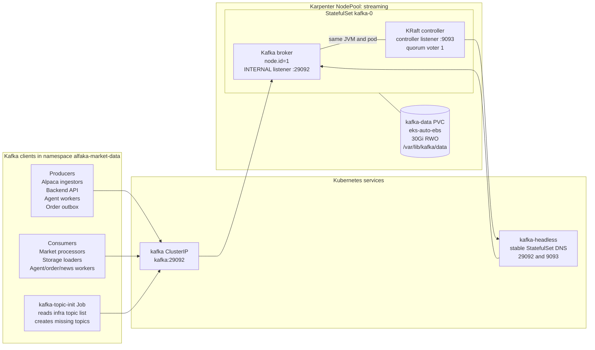
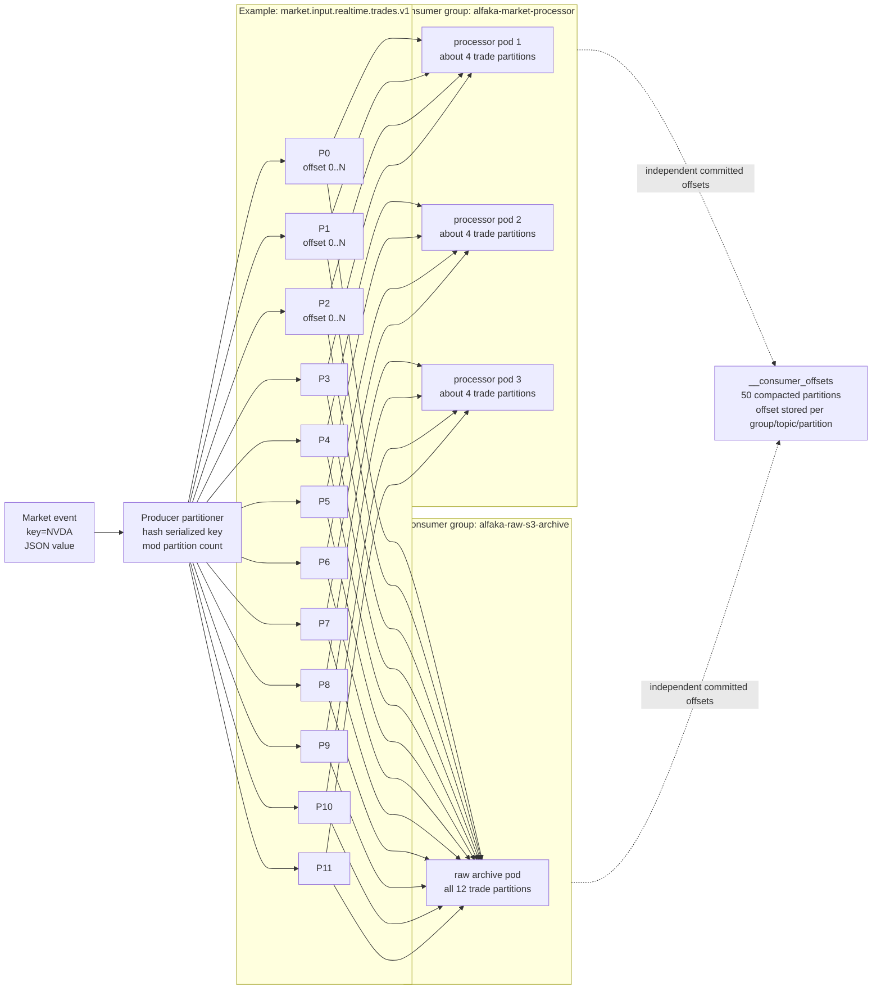
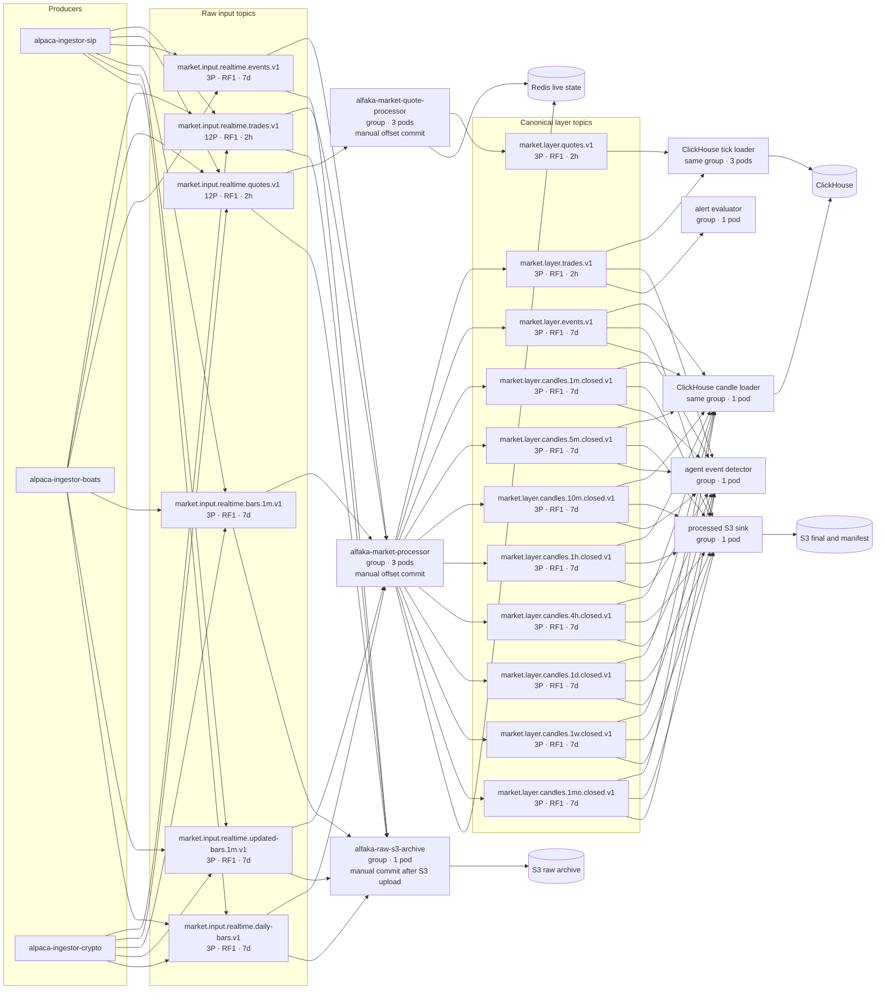
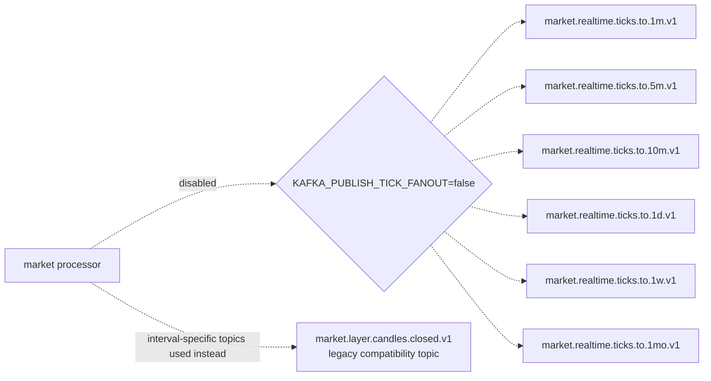
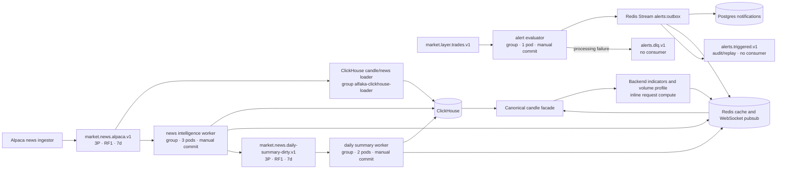
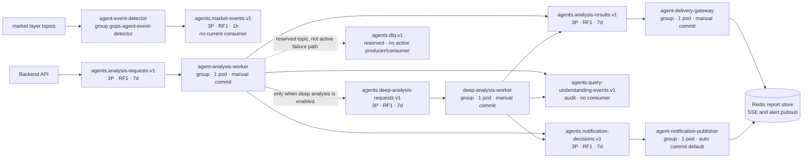
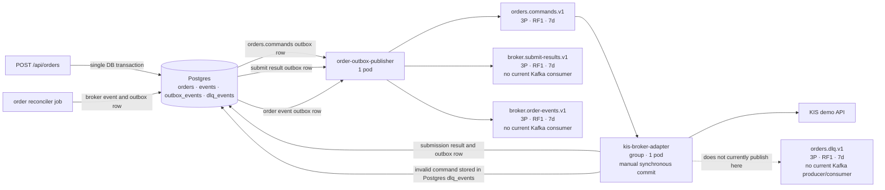

# GOPS Kafka Architecture

This document describes the current repository contract and the dev EKS Kafka
topology observed on 2026-07-10. The repository defines 39 application topics
plus the internal `__consumer_offsets` topic. Because topic initialization is
create-only, operators must compare the broker inventory after deployment;
older broker topics are not an active application contract.

## Physical Topology



| Setting | Current value |
| --- | --- |
| Kafka image | `apache/kafka:3.9.0` |
| Metadata mode | KRaft, no ZooKeeper |
| Broker count | 1 |
| Controller count | 1, same process as broker |
| Replication factor | 1 for every application and internal topic |
| Minimum in-sync replicas | 1 |
| Network | namespace-internal `PLAINTEXT` |
| Auto topic creation | enabled |
| Default partitions | 3 |
| Broker default retention | 168 hours, 7 days |
| Broker default segment size | 1 GiB |
| Producer acknowledgements | `acks=1` |
| JVM heap | `-Xms1g -Xmx2g` |
| Pod resources | request `1 CPU / 3Gi`, limit `2 CPU / 4Gi` |
| Persistent storage | EBS PVC `30Gi` mounted at `/var/lib/kafka/data` |

Because broker, controller, every leader partition, and every replica are on
`kafka-0`, the PVC protects broker logs across pod replacement but the cluster
has no broker-level high availability. When `kafka-0` is unavailable, every
producer and consumer waits for the same broker to recover.

## Partition, Ordering, And Offset Model



- A partition is the unit of ordering and parallel assignment. Kafka guarantees
  order inside one partition, not across an entire topic.
- Every market-data producer uses `key=symbol`. The same serialized symbol key
  is therefore routed to the same partition while the partition count remains
  unchanged.
- A partition is assigned to at most one active consumer inside a consumer
  group. Different groups independently read the same partition.
- The 12-partition trade and quote input topics allow up to 12 active consumers
  per group. The current three processor replicas normally receive about four
  partitions each.
- Standard three-partition topics can use at most three active consumers in one
  group. Extra replicas would remain idle for that topic.

## Market Data Pipeline



The following market topics exist but are not in the active hot path:



Redis and the `market.events` pub/sub channel are the active live chart state;
there is no live-candle Kafka topic. The processed S3 sink stores only interval
closed candles and events. Trades and quotes are archived through raw S3 and
loaded into ClickHouse by the tick loader.

## News, API Derived Data, And Alerts



## Agent Topics



The hot and deep workers run the `AgentOrchestrator` in-process. The standalone
`agent-orchestrator` HTTP service can also publish results and notification
decisions for compatibility requests. Invalid or failed async analysis is
currently represented by a failed report on `agents.analysis-results.v1`; the
`agents.dlq.v1` topic exists but is not the active failure path.

## Order Topics



## Complete Topic Inventory

Every application topic has replication factor 1. `7d` below means no topic
override, so the broker default `log.retention.hours=168` applies.

| # | Topic | Partitions | Retention | Producer | Current consumer group |
| ---: | --- | ---: | ---: | --- | --- |
| 1 | `market.input.realtime.trades.v1` | 12 | 2h | Alpaca ingestors | `alfaka-market-processor`, `alfaka-raw-s3-archive` |
| 2 | `market.input.realtime.quotes.v1` | 12 | 2h | Alpaca ingestors | `alfaka-market-quote-processor`, `alfaka-raw-s3-archive` |
| 3 | `market.input.realtime.events.v1` | 3 | 7d | Alpaca ingestors | `alfaka-market-processor`, `alfaka-raw-s3-archive` |
| 4 | `market.input.realtime.bars.1m.v1` | 3 | 7d | Alpaca ingestors | `alfaka-market-processor`, `alfaka-raw-s3-archive` |
| 5 | `market.input.realtime.updated-bars.1m.v1` | 3 | 7d | Alpaca ingestors | `alfaka-market-processor`, `alfaka-raw-s3-archive` |
| 6 | `market.input.realtime.daily-bars.v1` | 3 | 7d | Alpaca ingestors | `alfaka-market-processor`, `alfaka-raw-s3-archive` |
| 7 | `market.realtime.ticks.to.1m.v1` | 3 | 7d | disabled processor fanout | none |
| 8 | `market.realtime.ticks.to.5m.v1` | 3 | 7d | disabled processor fanout | none |
| 9 | `market.realtime.ticks.to.10m.v1` | 3 | 7d | disabled processor fanout | none |
| 10 | `market.realtime.ticks.to.1d.v1` | 3 | 7d | disabled processor fanout | none |
| 11 | `market.realtime.ticks.to.1w.v1` | 3 | 7d | disabled processor fanout | none |
| 12 | `market.realtime.ticks.to.1mo.v1` | 3 | 7d | disabled processor fanout | none |
| 13 | `market.layer.candles.closed.v1` | 3 | 7d | legacy compatibility | none |
| 14 | `market.layer.candles.1m.closed.v1` | 3 | 7d | market processor | ClickHouse, processed S3, event detector |
| 15 | `market.layer.candles.5m.closed.v1` | 3 | 7d | market processor | ClickHouse, processed S3, event detector |
| 16 | `market.layer.candles.10m.closed.v1` | 3 | 7d | market processor | ClickHouse, processed S3, event detector |
| 17 | `market.layer.candles.1h.closed.v1` | 3 | 7d | market processor | ClickHouse, processed S3, event detector |
| 18 | `market.layer.candles.4h.closed.v1` | 3 | 7d | market processor | ClickHouse, processed S3, event detector |
| 19 | `market.layer.candles.1d.closed.v1` | 3 | 7d | market processor | ClickHouse, processed S3, event detector |
| 20 | `market.layer.candles.1w.closed.v1` | 3 | 7d | market processor | ClickHouse, processed S3, event detector |
| 21 | `market.layer.candles.1mo.closed.v1` | 3 | 7d | market processor | ClickHouse, processed S3, event detector |
| 22 | `market.layer.trades.v1` | 3 | 2h | market processor | ClickHouse tick loader, event detector, alert evaluator |
| 23 | `market.layer.quotes.v1` | 3 | 2h | quote processor | ClickHouse tick loader |
| 24 | `market.layer.events.v1` | 3 | 7d | market processor | ClickHouse, processed S3, event detector |
| 25 | `market.news.alpaca.v1` | 3 | 7d | news ingestor and recent backfill | ClickHouse loader, news intelligence |
| 26 | `market.news.daily-summary-dirty.v1` | 3 | 7d | news intelligence | news daily summary worker |
| 27 | `orders.commands.v1` | 3 | 7d | order outbox publisher | `kis-broker-adapter` |
| 28 | `broker.submit-results.v1` | 3 | 7d | order outbox publisher | none |
| 29 | `broker.order-events.v1` | 3 | 7d | order outbox publisher | none |
| 30 | `orders.dlq.v1` | 3 | 7d | reserved; active DLQ is Postgres | none |
| 31 | `alerts.triggered.v1` | 3 | 7d | alert evaluator outbox sender | none; audit/replay topic |
| 32 | `alerts.dlq.v1` | 3 | 7d | alert evaluator | none |
| 33 | `agents.market-events.v1` | 3 | 1h | agent event detector | none |
| 34 | `agents.analysis-requests.v1` | 3 | 7d | Backend API | `gops-agent-analysis-worker` |
| 35 | `agents.deep-analysis-requests.v1` | 3 | 7d | analysis worker when enabled | `gops-agent-deep-analysis-worker` |
| 36 | `agents.analysis-results.v1` | 3 | 7d | analysis/deep worker or orchestrator | `gops-agent-delivery-gateway` |
| 37 | `agents.query-understanding-events.v1` | 3 | 7d | analysis/deep worker or orchestrator | none; audit topic |
| 38 | `agents.notification-decisions.v1` | 3 | 7d | analysis/deep worker or orchestrator | `gops-agent-notification-publisher` |
| 39 | `agents.dlq.v1` | 3 | 7d | reserved | none |

Internal topic:

| Topic | Partitions | Replication | Cleanup | Purpose |
| --- | ---: | ---: | --- | --- |
| `__consumer_offsets` | 50 | 1 | compact | committed offset per consumer group, topic, and partition |

## Consumer Groups And Commit Policy

| Consumer group | Pods | Topics | Commit policy |
| --- | ---: | --- | --- |
| `alfaka-market-processor` | 3 | trade, bar, updated bar, daily bar, event raw topics | manual |
| `alfaka-market-quote-processor` | 3 | raw quote | manual |
| `alfaka-raw-s3-archive` | 1 | all six raw topics | manual after every S3 side effect succeeds |
| `alfaka-processed-s3-sink` | 1 | eight closed candle topics and layer events | manual after S3 buffer flush |
| `alfaka-clickhouse-loader` | 4 members | one candle/news loader plus three trade/quote loaders | manual after ClickHouse insert |
| `alfaka-news-intelligence-worker` | 3 | Alpaca news | manual after Redis/ClickHouse side effects |
| `alfaka-news-daily-summary-worker` | 2 | daily summary dirty | manual after Redis/ClickHouse side effects |
| `gops-agent-event-detector` | 1 | trades, eight closed candle topics, events | auto commit default |
| `gops-alert-evaluator` | 1 | layer trades | manual after trade evaluation |
| `gops-agent-analysis-worker` | 1 | analysis requests | manual after report processing |
| `gops-agent-deep-analysis-worker` | 1 | deep analysis requests | manual after report processing |
| `gops-agent-delivery-gateway` | 1 | analysis results | manual after Redis delivery |
| `gops-agent-notification-publisher` | 1 | notification decisions | auto commit default |
| `kis-broker-adapter` | 1 | order commands | manual synchronous commit after adapter processing |

The raw and processed S3 sinks explicitly disable auto commit. They flush every
buffered S3 side effect before committing the consumer position; a failed upload
leaves the offset uncommitted for replay. ClickHouse loaders use the same
side-effect-before-commit policy.

## Retention Overrides

| Topic | Retention | Segment time | Segment size |
| --- | ---: | ---: | ---: |
| `agents.market-events.v1` | 1 hour | 10 minutes | 128 MiB |
| `market.input.realtime.trades.v1` | 2 hours | 15 minutes | 256 MiB |
| `market.input.realtime.quotes.v1` | 2 hours | 15 minutes | 256 MiB |
| `market.layer.trades.v1` | 2 hours | 15 minutes | 256 MiB |
| `market.layer.quotes.v1` | 2 hours | 15 minutes | 256 MiB |
| every other application topic | 7 days | broker default | broker default 1 GiB |

Kafka deletes data by closed log segment. The short-retention topics therefore
set both `segment.ms` and `segment.bytes`; setting only `retention.ms` would let
an active default segment survive beyond the intended retention window.

## Repository And Broker Reconciliation

`platform/kafka/topics.txt` is the canonical topic list. The K8s copy is checked
for byte-for-byte equality, and local topic creation reads the canonical file.
The topic-init Job creates missing topics but intentionally does not delete
broker state. After deploying a contract change, an operator compares the
broker inventory and consumer groups with this document before separately
retiring unreferenced topics.

## Inspection Commands

```bash
kubectl exec -n alfaka-market-data kafka-0 -- \
  /opt/kafka/bin/kafka-topics.sh --bootstrap-server localhost:29092 --describe

kubectl exec -n alfaka-market-data kafka-0 -- \
  /opt/kafka/bin/kafka-consumer-groups.sh --bootstrap-server localhost:29092 --list

kubectl exec -n alfaka-market-data kafka-0 -- \
  /opt/kafka/bin/kafka-consumer-groups.sh --bootstrap-server localhost:29092 \
  --describe --all-groups
```
