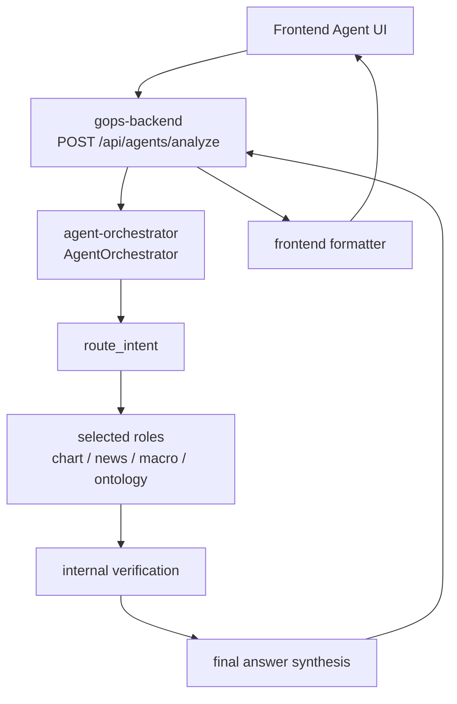

# News And Ontology Agent Structure

This document describes the current News/Ontology agent data flow and response
shape. It avoids product examples that imply a special universe or sector focus.

## Request Flow



The frontend sends a symbol, intent, selected agent IDs, messages, and chart
context. The backend forwards the request to `agent-orchestrator`. The
orchestrator routes the intent, runs selected role agents, verifies the result,
and returns an `AnalysisReport` with an optional `finalAnswer`.

## Visible And Internal Roles

Visible roles:

- `chart`
- `news`
- `macro`
- `ontology`

Internal roles:

- orchestrator
- unusual-event explainer
- market summary
- verification guardrail
- notification decision
- layout proposal
- final answer synthesizer

The UI should expose visible roles only. Internal fields such as route,
providerEvidence, findings, and guardrail pass messages are diagnostic data, not
default user copy.

## Routing Examples

```text
뉴스 보여줘           -> news
AAPL 관계 분석해줘   -> ontology
AAPL 왜 올랐어?      -> chart + news + macro + ontology
```

When an intent has no clear keyword, selected agent IDs are mapped to visible
roles. Optional OpenAI routing may assist, but deterministic rule/selection
fallback must keep the response shape stable.

## News Agent

Data path:

```text
Alpaca News API
-> alpaca-news-ingestor
-> market.news.alpaca.v1
-> clickhouse-loader
-> ClickHouse news_articles
-> ClickHouseNewsProvider
-> NewsAgent
-> finalAnswer
```

News normalization should dedupe by article id when available, fall back to
headline/url matching, sort by recency and relevance, classify event type, and
estimate impact direction as `positive`, `negative`, `mixed`, or `unknown`.

If no news is available, distinguish:

- provider not configured
- provider query failed
- provider succeeded but returned no relevant articles

## Ontology Agent

Data path:

```text
GraphDB repository
-> GraphDBOntologyProvider
-> OntologyAgent
-> finalAnswer
```

Ontology evidence should distinguish:

- `theme`
- `control`
- `theme-company`
- `theme-control`
- `no-direct-control`
- `no-ontology-evidence`
- `graphdb-unavailable`

The final answer must not invent relationships. It can only summarize evidence
returned by GraphDB and should state when direct control/subsidiary evidence is
not present.

## OpenAI Usage

OpenAI is optional and never replaces provider retrieval. It may be used for:

```text
route_with_openai
role_analysis_with_openai
FinalAnswerSynthesizer._synthesize_with_openai
```

Required behavior:

- strict JSON response parsing
- deterministic fallback on missing key, timeout, invalid JSON, or API failure
- no fabricated prices, relationships, sources, recommendations, or orders

## Response Shape

`systems/agent-orchestration/shared/gops_agents/contracts.py` owns the
`AnalysisReport` contract. User-facing text should prefer:

```text
finalAnswer.title
finalAnswer.summary
finalAnswer.sections[]
finalAnswer.citations[]
finalAnswer.limitations[]
```

The frontend formatter lives at:

```text
apps/gops-frontend/src/agents/agentAnalysis.ts
```

## First Files To Read

```text
apps/gops-frontend/src/components/SystemArea.tsx
apps/gops-frontend/src/agents/agentAnalysis.ts
systems/api-server/pods/api-server/gops-backend/app/routes/agents.py
systems/api-server/pods/api-server/gops-backend/app/contracts/agents.py
systems/agent-orchestration/shared/gops_agents/orchestrator.py
systems/agent-orchestration/shared/gops_agents/router.py
systems/agent-orchestration/shared/gops_agents/agents.py
systems/agent-orchestration/shared/gops_agents/providers.py
systems/agent-orchestration/shared/gops_agents/synthesizer.py
systems/agent-orchestration/shared/gops_agents/contracts.py
```
