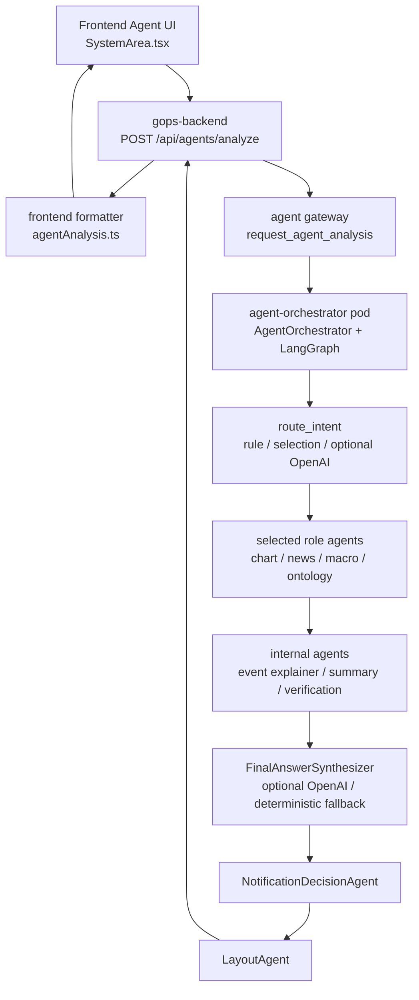
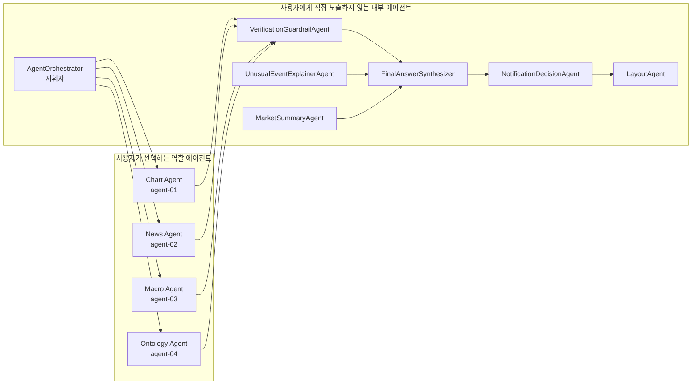
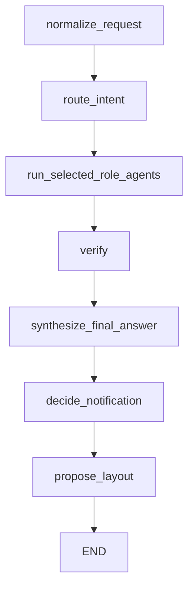
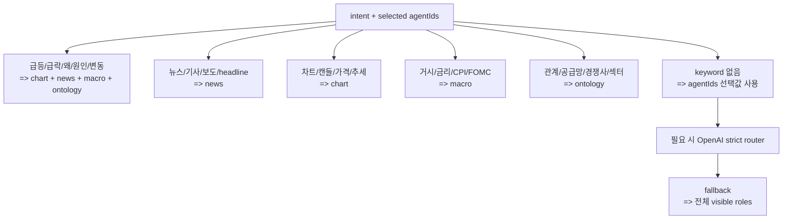
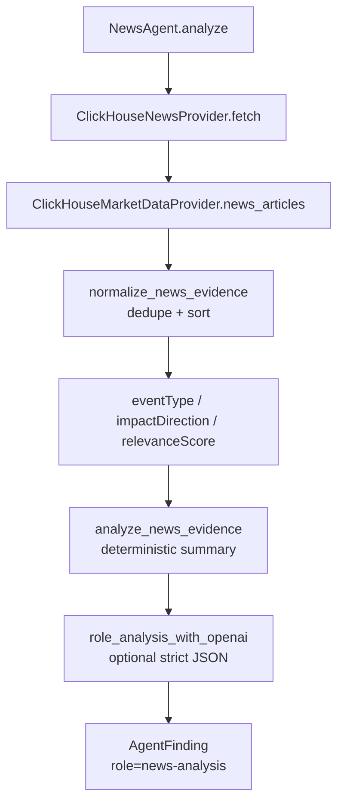
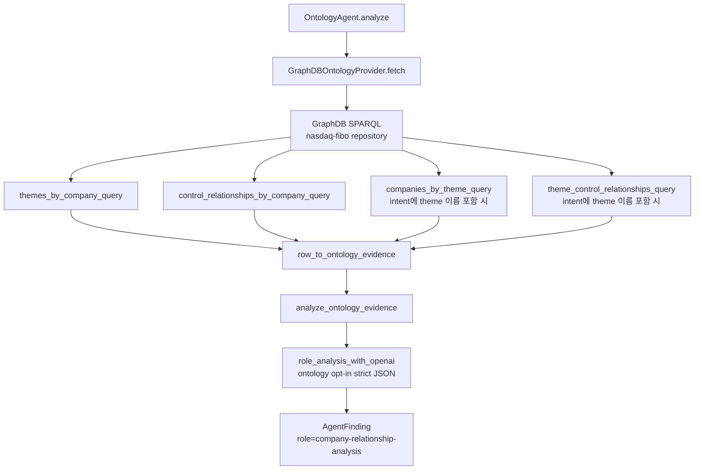
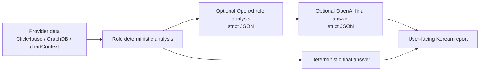
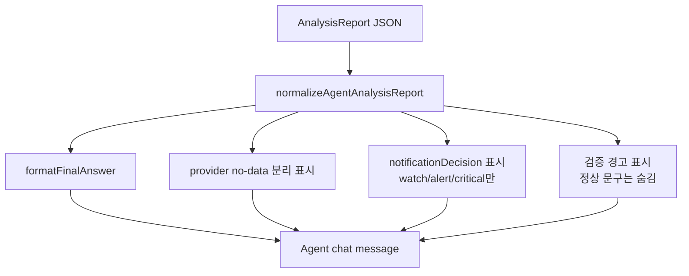
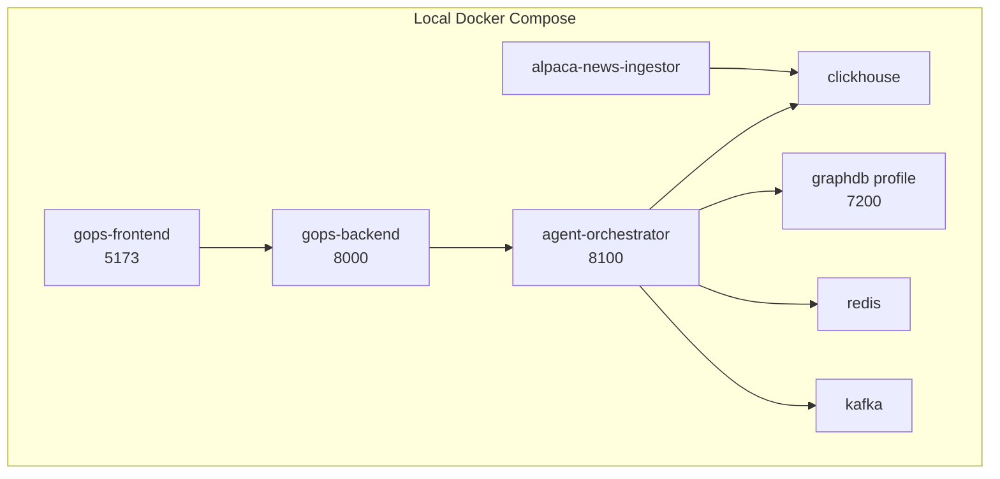

# 뉴스/온톨로지 멀티에이전트 구현 구조 설명

작성일: 2026-06-29
기준 브랜치: `dev`
목적: 오늘 구현한 News Agent, Ontology Agent, 오케스트레이션, OpenAI/RAG/LangGraph 연결 구조를 코드 기준으로 파악한다.

## 1. 한 줄 요약

현재 구조는 사용자가 Agent UI에서 자연어 질의를 보내면 `gops-backend`가 `agent-orchestrator` pod로 요청을 넘기고, orchestrator 내부의 LangGraph 흐름이 필요한 역할 에이전트를 실행한 뒤 `finalAnswer` 형태의 한국어 리포트를 만들어 기존 채팅 메시지 영역에 보여주는 방식이다.

오케스트레이터는 사용자에게 직접 보이는 에이전트가 아니다. 사용자가 보는 것은 `Chart Agent`, `News Agent`, `Macro Agent`, `Ontology Agent`이고, 오케스트레이터는 이들을 선택/실행/검증/합성하는 내부 지휘자다.

## 2. 전체 런타임 흐름



### 흐름 해설

1. `apps/gops-frontend/src/components/SystemArea.tsx`
   - Agent를 2개 이상 선택하거나 멀티에이전트로 판단되는 입력이면 `/api/agents/analyze`를 호출한다.
   - 단일 Chart Agent 기존 흐름은 `/api/llm/chat`을 유지한다.

2. `systems/api-server/pods/api-server/gops-backend/app/routes/agents.py`
   - `POST /api/agents/analyze` 요청을 받는다.
   - 실제 분석은 backend가 직접 하지 않고 agent gateway를 통해 `agent-orchestrator`로 위임한다.

3. `systems/agent-orchestration/shared/gops_agents/orchestrator.py`
   - `AgentOrchestrator.analyze()`가 진입점이다.
   - 내부는 LangGraph `StateGraph`가 있으면 graph로 실행하고, LangGraph import 실패 시 순차 fallback으로 실행한다.

4. `systems/agent-orchestration/shared/gops_agents/synthesizer.py`
   - 역할별 결과와 provider evidence를 사용자용 `FinalAnswer`로 합성한다.
   - OpenAI key가 있으면 strict JSON 기반 합성을 시도한다.
   - 실패하거나 key가 없으면 deterministic 리포트 생성 로직으로 fallback한다.

5. `apps/gops-frontend/src/agents/agentAnalysis.ts`
   - backend 응답을 `AgentAnalysisReport`로 normalize한다.
   - `finalAnswer`를 채팅 메시지용 문자열로 변환한다.
   - 내부 진단용 `Agent findings`, 정상 guardrail 문구, URL 없는 citation은 기본적으로 노출하지 않는다.

## 3. 사용자에게 보이는 에이전트와 내부 에이전트



### 핵심 구분

- `News Agent`, `Ontology Agent`는 사용자가 선택할 수 있는 분석 역할이다.
- `AgentOrchestrator`는 선택 가능한 에이전트가 아니라 내부 지휘자다.
- `VerificationGuardrailAgent`, `NotificationDecisionAgent`, `LayoutAgent`는 내부 보조 단계다.
- 따라서 UI에는 오케스트레이터를 에이전트 카드로 보여주지 않는 것이 맞다.

## 4. LangGraph 오케스트레이션 구조

`AgentOrchestrator._build_workflow()`는 다음 노드 순서로 graph를 구성한다.



### 각 노드 역할

| 노드 | 코드 위치 | 역할 |
|---|---|---|
| `normalize_request` | `orchestrator.py` | symbol, intent, messages, chartContext, marketEvents를 `AgentContext`로 정리 |
| `route_intent` | `orchestrator.py` + `router.py` | 사용자 질의를 보고 실행할 역할을 선택 |
| `run_selected_role_agents` | `orchestrator.py` | 선택된 role agent를 실행. 2개 이상이면 `ThreadPoolExecutor`로 병렬 실행 |
| `verify` | `orchestrator.py` | 이벤트 설명, 요약, 검증 agent를 내부적으로 추가 실행 |
| `synthesize_final_answer` | `orchestrator.py` + `synthesizer.py` | 사용자용 최종 리포트 생성 |
| `decide_notification` | `agents.py` | market event severity 기준 알림 여부 결정 |
| `propose_layout` | `agents.py` | 알림 panel 추가 같은 layout proposal 생성 |

현재 graph는 조건부 분기 graph라기보다는 선형 graph에 가깝다. 다만 `run_selected_role_agents` 내부에서 선택된 역할만 실행하고, 여러 역할은 병렬로 실행한다. 다음 단계에서 retry loop, evidence 부족 시 재조회, 검증 실패 시 재합성 같은 조건부 edge를 추가할 수 있다.

## 5. 라우팅 규칙

라우팅은 `systems/agent-orchestration/shared/gops_agents/router.py`의 `route_intent()`가 담당한다.



예시:

- `뉴스 보여줘` -> `selectedRoles = ["news"]`
- `NVDA 관계 분석해줘` -> `selectedRoles = ["ontology"]`
- `NVDA 왜 올랐어?` -> `selectedRoles = ["chart", "news", "macro", "ontology"]`
- 명확한 keyword가 없으면 사용자가 선택한 Agent 카드의 `agentIds`를 role로 변환한다.

## 6. News Agent 구조



### News Agent가 하는 일

코드 위치:

- `systems/agent-orchestration/shared/gops_agents/agents.py`
- `systems/agent-orchestration/shared/gops_agents/providers.py`

구현된 기능:

1. ClickHouse에 저장된 Alpaca 뉴스 조회
   - `ClickHouseNewsProvider.fetch()`가 `ClickHouseMarketDataProvider.news_articles(symbol, limit, days)`를 호출한다.
   - 기본 설정은 `AGENT_NEWS_LIMIT`, `AGENT_NEWS_LOOKBACK_DAYS` 환경변수로 제어한다.

2. 뉴스 정규화
   - `normalize_news_evidence()`가 중복 기사를 제거한다.
   - `articleId`가 있으면 `articleId` 기준으로 dedupe한다.
   - 없으면 `title + url` 기준으로 dedupe한다.
   - 최신순과 관련도 점수를 기준으로 정렬한다.

3. 뉴스 이벤트 분류
   - `classify_news_event_type()`이 키워드 기반으로 이벤트 유형을 분류한다.
   - 예: `earnings`, `guidance`, `product`, `regulation`, `analyst`, `macro`, `mna`, `legal`, `partnership`, `other`

4. 주가 영향 방향 분류
   - `classify_news_impact_direction()`이 키워드 기반으로 `positive`, `negative`, `mixed`, `unknown`을 붙인다.

5. 관련도 점수
   - `score_news_relevance()`가 ticker 포함 여부, 주식/실적 관련 키워드 여부로 0~1 점수를 만든다.

6. 역할별 분석 문장 생성
   - `analyze_news_evidence()`가 한국어 summary/rationale/tags를 만든다.
   - OpenAI 사용 가능 시 `role_analysis_with_openai(role="news")`가 strict JSON 분석을 시도한다.
   - OpenAI 실패 또는 미설정이면 deterministic summary를 그대로 사용한다.

### News evidence raw 필드

`EvidenceItem.raw`에는 다음 메타데이터가 들어간다.

| 필드 | 의미 |
|---|---|
| `articleId` | Alpaca/저장소 기사 ID |
| `source` | 뉴스 출처 |
| `author` | 작성자 |
| `headline` | 제목 |
| `publishedAt` | 발행 시각 |
| `receivedAt` | 수집 시각 |
| `impactDirection` | 긍정/부정/혼재/판단 보류 |
| `eventType` | 실적/가이던스/제품/규제 등 이벤트 유형 |
| `relevanceScore` | ticker 관련도 점수 |

## 7. Ontology Agent 구조



### Ontology Agent가 하는 일

코드 위치:

- `systems/agent-orchestration/shared/gops_agents/agents.py`
- `systems/agent-orchestration/shared/gops_agents/providers.py`

구현된 기능:

1. GraphDB SPARQL 조회
   - `GraphDBOntologyProvider`가 `GRAPHDB_SPARQL_URL`을 사용한다.
   - 기본값은 `http://localhost:7200/repositories/nasdaq-fibo`이고 Docker 내부에서는 `http://graphdb:7200/repositories/nasdaq-fibo`로 주입된다.

2. ticker 기준 테마 조회
   - `themes_by_company_query(ticker, limit)`로 `NVDA -> AI/반도체/데이터센터` 같은 테마 매핑을 가져온다.

3. ticker 기준 직접 지배/자회사 관계 조회
   - `control_relationships_by_company_query(ticker, limit)`로 `DerivedControlRelationship`을 조회한다.

4. theme 기준 확장 조회
   - intent에 `AI/반도체/데이터센터` 같은 사전 정의 theme 이름이 포함되면 해당 theme의 기업 목록과 theme 내 지배 관계까지 조회한다.

5. no-data 의미 분리
   - GraphDB 연결 실패: `relationType = graphdb-unavailable`
   - GraphDB는 연결됐지만 ticker 근거 없음: `relationType = no-ontology-evidence`
   - theme 근거는 있지만 직접 지배/자회사 관계 없음: `relationType = no-direct-control`

6. 역할별 분석 문장 생성
   - `analyze_ontology_evidence()`가 관계 유형별로 한국어 summary/rationale/tags를 만든다.
   - 기본값은 GraphDB evidence 기반 deterministic summary다.
   - `AGENT_ONTOLOGY_ROLE_ANALYSIS_PROVIDER=openai`가 명시된 경우에만 `role_analysis_with_openai(role="ontology")`가 strict JSON 분석을 시도한다.
   - OpenAI 실패 또는 미설정이면 deterministic summary를 그대로 사용한다.

### Ontology evidence raw 필드

| 필드 | 의미 |
|---|---|
| `type` | SPARQL row 유형. 예: `ticker-theme`, `ticker-control-relationship` |
| `relationType` | 사용자/검증 로직에서 보는 관계 유형. 예: `theme`, `control`, `theme-company`, `theme-control` |
| `ticker` | ticker symbol |
| `companyName` | 기업명 |
| `themeName` | 테마명 |
| `themeCategory` | 테마 분류 |
| `sector` | 섹터 |
| `controlledName` | 지배/피지배 관계 대상 기업명 |
| `confidence` | GraphDB 관계 추출 신뢰도 |
| `accession` | SEC filing accession |
| `sourceUrl` | 근거 URL |

## 8. OpenAI가 붙은 위치

OpenAI는 provider 조회 자체에는 붙지 않는다. 데이터 조회는 deterministic하게 수행하고, OpenAI는 해석/합성 단계에만 선택적으로 붙는다.



### OpenAI 사용 지점

| 위치 | 함수 | 환경변수 | 실패 시 |
|---|---|---|---|
| 라우팅 보조 | `route_with_openai()` | `OPENAI_API_KEY`, `AGENT_ROUTER_MODEL` | rule/selection/fallback 라우팅 |
| 역할별 분석 | `role_analysis_with_openai()` | `OPENAI_API_KEY`, `AGENT_ROLE_ANALYSIS_MODEL` | `analyze_news_evidence()`, `analyze_ontology_evidence()` |
| 최종 답변 합성 | `FinalAnswerSynthesizer._synthesize_with_openai()` | `OPENAI_API_KEY`, `AGENT_SYNTHESIZER_MODEL` | deterministic final answer |

온톨로지 전용 분석은 GraphDB에 없는 내용을 덧붙이지 않도록 기본적으로 deterministic 경로를 사용한다. 온톨로지 역할별 OpenAI 분석은 `AGENT_ONTOLOGY_ROLE_ANALYSIS_PROVIDER=openai`, 온톨로지 전용 최종 답변 OpenAI 합성은 `AGENT_ONTOLOGY_FINAL_ANSWER_PROVIDER=openai`를 명시해야만 켜진다.

OpenAI prompt의 핵심 제약:

- 제공된 evidence 안에서만 작성한다.
- 없는 뉴스, 관계, 가격, 출처, 추천을 생성하지 않는다.
- strict JSON schema로만 반환한다.
- 사용자에게 `providerEvidence`, `findings`, `route`, `guardrail` 같은 내부 필드명을 노출하지 않는다.

## 9. API request/response 데이터 형태

### Request

`systems/api-server/pods/api-server/gops-backend/app/contracts/agents.py`

```json
{
  "symbol": "NVDA",
  "intent": "NVDA 관계 분석해줘",
  "routerMode": "hybrid",
  "agentIds": ["agent-04"],
  "messages": [],
  "chartContext": {},
  "marketEvents": [],
  "chartProposal": null
}
```

### Response

`systems/agent-orchestration/shared/gops_agents/contracts.py`의 `AnalysisReport`가 기준 shape이다.

```json
{
  "analysisId": "analysis-...",
  "symbol": "NVDA",
  "intent": "NVDA 관계 분석해줘",
  "status": "completed",
  "summary": "...",
  "findings": [],
  "providerEvidence": [],
  "route": {
    "source": "rule",
    "intentType": "ontology",
    "selectedRoles": ["ontology"]
  },
  "finalAnswer": {
    "title": "NVDA 기업 관계 분석",
    "summary": "...",
    "sections": [],
    "citations": [],
    "limitations": []
  },
  "notificationDecision": {},
  "layoutProposal": {}
}
```

### 핵심 dataclass

| 타입 | 역할 |
|---|---|
| `EvidenceItem` | provider에서 가져온 근거 1개 |
| `AgentFinding` | agent 하나의 분석 결과 |
| `IntentRoute` | 어떤 역할을 실행할지 결정한 라우팅 결과 |
| `FinalAnswer` | 사용자에게 보여줄 최종 답변 |
| `NotificationDecision` | 알림창을 띄울지 여부 |
| `LayoutProposal` | 화면 구성을 어떻게 바꿀지 제안 |
| `AnalysisReport` | 전체 분석 응답 envelope |

## 10. Frontend 표시 방식



구현 위치:

- `apps/gops-frontend/src/components/SystemArea.tsx`
- `apps/gops-frontend/src/agents/agentAnalysis.ts`

표시 정책:

- `finalAnswer`가 있으면 `summary` 대신 `finalAnswer`를 우선 표시한다.
- 정상 검증 문구인 `No trading-action guardrail violation detected.`는 숨긴다.
- URL이 없는 citation은 `근거 링크`에 표시하지 않는다.
- 온톨로지 관계 없음과 GraphDB 연결 실패를 구분한다.
- `notificationDecision.level`이 `watch`, `alert`, `critical`일 때만 알림 판단을 메시지에 포함한다.

## 11. Docker / Pod 배포 구조



### Docker Compose

관련 파일:

- `docker-compose.yml`

주요 서비스:

- `agent-orchestrator`
  - image/build: `gops-agent-orchestrator`
  - port: `8100`
  - `CLICKHOUSE_HTTP_URL`, `GRAPHDB_SPARQL_URL`, `AGENT_ONTOLOGY_LIMIT` 등을 주입받는다.

- `alpaca-news-ingestor`
  - Alpaca News API에서 뉴스를 받아 ClickHouse 저장소로 흘려보내는 수집기다.
  - 뉴스 API key는 주식 데이터 key와 같은 Alpaca 계정 key를 사용한다.

- `graphdb`
  - profile: `graphdb`
  - image: `ontotext/graphdb:11.4.0`
  - port: `7200`
  - volume: `nasdaq_fibo_graphdb_data`
  - GraphDB 데이터 archive는 repo에 커밋하지 않는다.

### K8s / EKS

관련 파일:

- `infra/k8s/base/deployment-agent-orchestrator.yaml`
- `infra/k8s/base/service-agent-orchestrator.yaml`
- `infra/k8s/base/statefulset-graphdb.yaml`
- `infra/k8s/base/service-graphdb.yaml`
- `infra/k8s/base/deployment-alpaca-news-ingestor.yaml`
- `infra/k8s/base/configmap.yaml`
- `infra/k8s/overlays/aws/configmap-aws-patch.yaml`

Pod 관점:

- `agent-orchestrator` pod
  - 내부에 `ChartAgent`, `NewsAgent`, `MacroAgent`, `OntologyAgent`, 검증/알림/레이아웃 agent가 함께 들어 있다.
  - 각 agent를 별도 pod로 쪼갠 구조가 아니다.

- `graphdb` StatefulSet
  - Ontology Agent가 조회하는 GraphDB runtime이다.
  - 데이터 volume은 별도 복원 절차로 관리한다.

- `alpaca-news-ingestor` Deployment
  - Alpaca News API 수집 전용 pod다.
  - 수집된 뉴스는 ClickHouse를 거쳐 News Agent evidence가 된다.

## 12. 테스트로 보장하는 내용

테스트 위치:

- `systems/agent-orchestration/tests/test_agent_orchestration.py`
- `apps/gops-frontend/tests/chartRuntime.test.ts`

현재 보장하는 케이스:

| 테스트 | 보장 내용 |
|---|---|
| `test_conductor_routes_news_intent_even_when_chart_agent_is_selected` | `뉴스 보여줘`는 Chart Agent가 선택되어 있어도 News Agent로 라우팅 |
| `test_conductor_routes_market_move_to_all_visible_roles` | `왜 올랐어?`는 chart/news/macro/ontology 전체로 라우팅 |
| `test_news_provider_normalizes_dedupes_and_scores_articles` | 뉴스 중복 제거, 최신순 정렬, event/impact/relevance 생성 |
| `test_news_agent_openai_success_and_fallback_keep_shape` | OpenAI 성공/실패 모두 같은 shape 유지 |
| `test_graphdb_provider_maps_sparql_rows_to_ontology_evidence` | SPARQL 결과를 ontology evidence로 변환 |
| `test_graphdb_provider_returns_no_data_on_empty_or_error` | GraphDB empty와 error를 서로 다른 no-data로 처리 |
| `test_ontology_keyword_routes_to_ontology_role` | `관계 분석` keyword가 Ontology Agent로 라우팅 |
| `test_openai_synthesizer_accepts_strict_json_response` | OpenAI final answer strict JSON 파싱 |
| `test_openai_synthesizer_falls_back_on_invalid_json` | OpenAI JSON 실패 시 deterministic fallback |
| `test_verification_conflict_is_reflected_in_market_move_answer` | 뉴스 방향과 차트 방향 불일치를 final answer에 반영 |

마지막으로 `dev` push 전에 다음 검증을 통과했다.

```sh
python3.12 -m unittest discover systems/agent-orchestration/tests -v
python3.12 -m unittest discover systems/api-server/tests -v
docker compose exec -T gops-frontend npm run test:chart
docker compose exec -T gops-frontend npm run build
```

## 13. 현재 한계와 다음 개발 포인트

현재 구현은 provider 연결과 역할별 분석 구조를 갖춘 v1이다. 다음 단계에서 개선할 지점은 다음과 같다.

1. News Agent
   - 현재 impact/event 분류는 rule 기반이다.
   - OpenAI가 붙으면 요약 품질은 좋아지지만, 기사 중요도 판단/상충 기사 그룹핑은 아직 제한적이다.
   - 다음 단계: 뉴스 cluster, ticker relevance 개선, 동일 기사/중복 headline 고도화, source 신뢰도 점수 추가.

2. Ontology Agent
   - 현재 GraphDB SPARQL retrieval은 ticker/theme/control 관계 중심이다.
   - 관계 경로 탐색, 경쟁사 비교, 공급망 depth 탐색은 아직 제한적이다.
   - 다음 단계: multi-hop SPARQL, relation path 설명, 테마 내 peer 비교, SEC filing 근거를 citation으로 더 잘 노출.

3. Orchestrator
   - LangGraph는 들어갔지만 현재 graph는 선형 흐름이다.
   - 다음 단계: evidence 부족 시 retry, verification 실패 시 재합성, 요청 유형별 조건부 edge, timeout budget 관리.

4. UI
   - 현재는 기존 채팅 메시지 영역에 리포트를 문자열로 표시한다.
   - 다음 단계: `finalAnswer.sections`, `citations`, `limitations`, `notificationDecision`을 구조화된 카드/패널로 렌더링.

5. 운영
   - GraphDB volume 복원과 Alpaca/OPENAI secret은 repo 밖에서 관리한다.
   - 다음 단계: EKS에서 GraphDB volume restore runbook, secret manager 연동 검증, health/readiness 기준 강화.

## 14. 처음 파악할 때 보는 순서

1. Frontend 진입
   - `apps/gops-frontend/src/components/SystemArea.tsx`
   - `apps/gops-frontend/src/agents/agentAnalysis.ts`

2. Backend API boundary
   - `systems/api-server/pods/api-server/gops-backend/app/routes/agents.py`
   - `systems/api-server/pods/api-server/gops-backend/app/contracts/agents.py`

3. Orchestrator
   - `systems/agent-orchestration/shared/gops_agents/orchestrator.py`
   - `systems/agent-orchestration/shared/gops_agents/router.py`

4. 역할별 agent
   - `systems/agent-orchestration/shared/gops_agents/agents.py`
   - `systems/agent-orchestration/shared/gops_agents/providers.py`

5. 최종 답변
   - `systems/agent-orchestration/shared/gops_agents/synthesizer.py`
   - `systems/agent-orchestration/shared/gops_agents/contracts.py`

6. 배포 구조
   - `docker-compose.yml`
   - `infra/k8s/base/deployment-agent-orchestrator.yaml`
   - `infra/k8s/base/statefulset-graphdb.yaml`
   - `infra/k8s/base/deployment-alpaca-news-ingestor.yaml`
