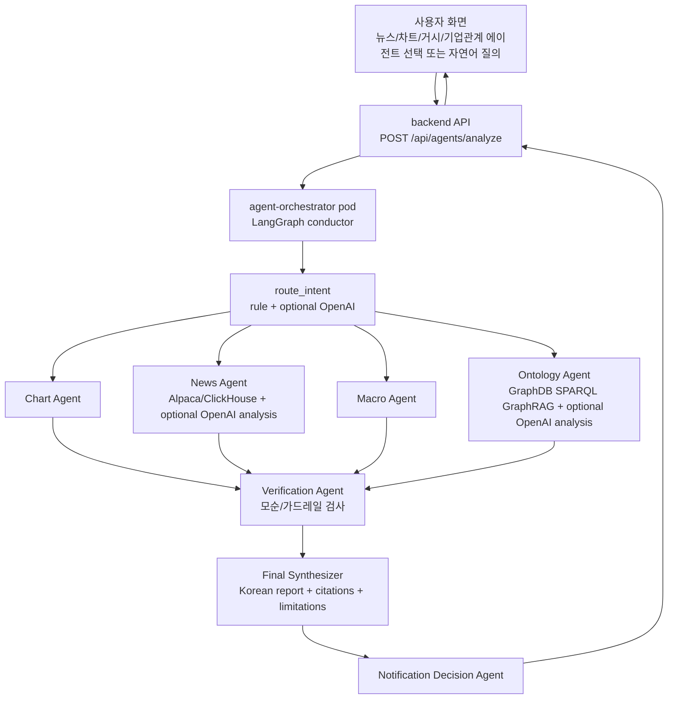

# News + Ontology Agent 고도화 계획

## Summary

- 기준 브랜치: `demulage`
- 기준 커밋: `686a837 feat: add graphdb ontology agent provider`
- 현재 구현은 GraphDB 기반 Ontology Provider, LangGraph orchestration 뼈대, OpenAI final answer synthesizer, Docker/K8s GraphDB 런타임까지 들어간 상태다.
- 다음 단계의 목표는 News Agent와 Ontology Agent를 단순 provider adapter가 아니라 역할별 분석 에이전트로 고도화하는 것이다.
- OpenAI는 provider 조회 자체가 아니라 `근거 기반 해석`, `최종 리포트 합성`, 일부 `라우팅 보조`에만 선택적으로 사용한다.
- OpenAI key가 없거나 실패해도 deterministic fallback으로 같은 API shape을 유지해야 한다.

## Current State

현재 `demulage` 로컬 커밋에 들어간 내용은 다음과 같다.

- `docker-compose.yml`
  - `graphdb` profile 서비스 추가
  - `ontotext/graphdb:11.4.0`
  - `GRAPHDB_SPARQL_URL`, `GRAPHDB_REPOSITORY`, `AGENT_ONTOLOGY_LIMIT` 환경변수 연결
- `infra/k8s/base`
  - GraphDB StatefulSet/Service 추가
  - agent-orchestrator pod에서 GraphDB SPARQL endpoint 접근 가능하도록 config 추가
- `scripts/local/restore-graphdb-volume.sh`
  - 로컬 GraphDB volume 복원 helper 추가
  - GraphDB 데이터 아티팩트는 repo에 커밋하지 않는 구조
- `systems/agent-orchestration/shared/gops_agents/providers.py`
  - `GraphDBOntologyProvider` 추가
  - ticker theme 조회
  - ticker 직접 지배/자회사 관계 조회
  - theme 이름 기반 기업/관계 조회
  - GraphDB timeout/error/empty를 `EvidenceItem(status="no-data")`로 변환
- `systems/agent-orchestration/shared/gops_agents/router.py`
  - `관계`, `공급망`, `경쟁사`, `섹터`, `ontology`, `relationship`, `supply` 키워드를 ontology role로 라우팅
  - `뉴스 보여줘`는 news role, `왜 올랐어?`류는 chart/news/macro/ontology 전체로 라우팅
- `systems/agent-orchestration/shared/gops_agents/orchestrator.py`
  - LangGraph `StateGraph` 기반 orchestration 뼈대 추가
  - public interface `AgentOrchestrator.analyze()` 유지
  - 내부 흐름은 현재 `normalize -> route -> chart -> news -> macro -> ontology -> verify -> synthesize -> notification -> layout`
- `systems/agent-orchestration/shared/gops_agents/synthesizer.py`
  - OpenAI strict JSON final answer synthesizer 추가
  - OpenAI 실패 시 deterministic fallback 유지
- `apps/gops-frontend/src/agents/agentAnalysis.ts`
  - multi-agent report를 기존 Agent 채팅 메시지로 표시
  - 아직 내부 진단 문구가 사용자 메시지에 일부 노출됨

## Problem To Fix

브라우저에서 `NVDA 관계 분석해줘`를 입력했을 때 현재 응답은 다음 문제가 있다.

- `provider 근거`, `Agent findings`, `검증 결과` 같은 내부 orchestration 문구가 사용자에게 노출된다.
- Ontology Agent가 GraphDB evidence를 가져오기는 하지만, 아직 `확인된 관계`, `관련 테마`, `관련 기업`, `확인되지 않은 관계`, `근거 한계`로 해석하지 않는다.
- News Agent도 ClickHouse/Alpaca 뉴스를 가져오는 수준이며, 중복 제거, 최신순 정렬, 이벤트 유형 분류, 주가 영향 방향 판단이 부족하다.
- LangGraph는 들어갔지만 아직 조건부/병렬/검증 루프가 있는 “진짜 지휘자 흐름”이라기보다 순차 실행 graph에 가깝다.
- OpenAI final synthesizer는 있지만 News Agent/Ontology Agent 내부의 역할별 분석에는 아직 붙지 않았다.

## Target Architecture



## Scope

이번 고도화 범위에 포함한다.

- News Agent 분석 레이어
- Ontology Agent 분석 레이어
- LangGraph conductor 흐름 개선
- Verification Agent 모순 검사 강화
- 최종 답변 문장/섹션 품질 개선
- frontend 표시 정책 정리
- OpenAI strict JSON 분석 보조
- deterministic fallback 유지
- unit/integration/Docker E2E 테스트

이번 범위에서 제외한다.

- WebSocket 알림 UI 연결
- layoutProposal 자동 적용
- GraphDB 데이터 생성 파이프라인 재설계
- vector DB 기반 RAG
- 실제 매매 주문/추천 액션
- 자동 push

## Workstream 1. Frontend 표시 정책 정리

목표는 사용자가 내부 agent graph를 보는 것이 아니라 완성된 분석 리포트를 보게 하는 것이다.

변경 대상:

- `apps/gops-frontend/src/agents/agentAnalysis.ts`
- 필요 시 관련 test: `apps/gops-frontend/tests/chartRuntime.test.ts`

구현 내용:

- `finalAnswer`가 있으면 기본 표시의 중심으로 사용한다.
- `Agent findings:` 섹션은 기본 숨김 처리한다.
- 정상 검증 결과인 `No trading-action guardrail violation detected.`는 숨긴다.
- 검증 경고나 agent 간 충돌이 있을 때만 `검증 경고` 형태로 표시한다.
- URL 없는 citation은 `근거 링크`에 표시하지 않는다.
- `providerEvidence.status === "no-data"`는 숨기지 않되, provider 미연결과 근거 없음은 분리한다.
  - 뉴스/거시 provider 미연결: `뉴스 provider 미연결`
  - GraphDB 연결 실패: `GraphDB 연결 실패`
  - 관계 근거 없음: `확인된 직접 관계 없음`

완료 기준:

- `NVDA 관계 분석해줘` 응답에서 내부 route/agent 문구가 사라진다.
- 사용자는 `요약`, `확인된 관계`, `근거`, `데이터 한계` 중심으로 읽는다.

## Workstream 2. News Agent 분석 레이어

목표는 News Agent를 “뉴스 수집기”에서 “뉴스 해석 에이전트”로 바꾸는 것이다.

변경 대상:

- `systems/agent-orchestration/shared/gops_agents/providers.py`
- `systems/agent-orchestration/shared/gops_agents/agents.py`
- 필요 시 `systems/agent-orchestration/shared/gops_agents/synthesizer.py`

구현 내용:

- ClickHouse/Alpaca 뉴스 evidence 정규화
  - `articleId` 기준 중복 제거
  - `headline + url` fallback dedupe
  - `publishedAt` 최신순 정렬
  - ticker 관련도 점수 계산
- 뉴스 이벤트 유형 분류
  - `earnings`
  - `guidance`
  - `product`
  - `analyst`
  - `regulation`
  - `macro`
  - `mna`
  - `legal`
  - `partnership`
  - `other`
- 주가 영향 방향 추정
  - `positive`
  - `negative`
  - `mixed`
  - `unknown`
- `evidence.raw`에 metadata 추가
  - `impactDirection`
  - `eventType`
  - `relevanceScore`
  - `publishedAt`
  - `source`
- News Agent finding을 한국어 분석 문장으로 생성
  - `핵심 뉴스`
  - `주가 영향 방향`
  - `근거`
  - `불확실성`
  - `출처`
- OpenAI key가 있으면 뉴스 묶음을 strict JSON으로 요약한다.
- OpenAI 실패/timeout/JSON parsing 실패 시 deterministic summarizer로 fallback한다.

완료 기준:

- `뉴스 보여줘`가 단순 provider 상태가 아니라 뉴스 리포트로 응답한다.
- 뉴스가 없을 때는 `provider 미연결`, `뉴스 없음`, `조회 실패`를 구분한다.

## Workstream 3. Ontology Agent 분석 레이어

목표는 Ontology Agent를 “GraphDB 조회기”에서 “기업 관계 분석 에이전트”로 바꾸는 것이다.

변경 대상:

- `systems/agent-orchestration/shared/gops_agents/providers.py`
- `systems/agent-orchestration/shared/gops_agents/agents.py`
- `systems/agent-orchestration/shared/gops_agents/synthesizer.py`

구현 내용:

- GraphDB evidence를 relation type으로 분류한다.
  - `theme`
  - `control`
  - `theme-company`
  - `theme-control`
  - `no-direct-control`
  - `no-ontology-evidence`
  - `graphdb-unavailable`
- 직접 지배/자회사 관계와 테마 관계를 분리해서 표시한다.
- 관계가 없을 때도 상황을 분리한다.
  - GraphDB 연결 실패
  - GraphDB는 연결됐지만 ticker 관계 근거 없음
  - theme 관계는 있으나 직접 지배/자회사 관계 없음
- `evidence.raw`에 metadata 보존
  - `relationType`
  - `themeName`
  - `controlledName`
  - `confidence`
  - `accession`
  - `sourceUrl`
- Ontology Agent finding을 한국어 분석 문장으로 생성한다.
  - `확인된 관계`
  - `관련 테마`
  - `관련 기업`
  - `확인되지 않은 관계`
  - `근거 한계`
- OpenAI key가 있으면 retrieved GraphDB evidence만 기반으로 strict JSON 관계 해석을 생성한다.
- OpenAI가 직접 관계를 만들어내지 못하도록 prompt/schema에서 `확인된 근거 안에서만 작성`을 강제한다.
- no-direct-control evidence가 있으면 최종 답변에서 직접 자회사/지배 관계를 단정하지 않는다.

완료 기준:

- `NVDA 관계 분석해줘`가 `NVIDIA는 AI/반도체/데이터센터 테마에 매핑됨`과 `직접 지배/자회사 관계는 확인되지 않음`을 구분해서 보여준다.
- URL/source가 있는 근거만 citation으로 노출한다.

## Workstream 4. LangGraph Conductor 고도화

목표는 orchestrator를 단순 순차 실행에서 조건부 역할 실행 + 검증 + 합성 흐름으로 개선하는 것이다.

변경 대상:

- `systems/agent-orchestration/shared/gops_agents/orchestrator.py`
- `systems/agent-orchestration/shared/gops_agents/router.py`

구현 내용:

- public interface `AgentOrchestrator.analyze()`는 유지한다.
- 내부 LangGraph node를 다음 흐름으로 재구성한다.
  - `normalize_request`
  - `route_intent`
  - `run_selected_role_agents`
  - `verify`
  - `synthesize_final_answer`
  - `decide_notification`
  - `propose_layout`
- 선택된 role agent만 실행한다.
  - `뉴스 보여줘` -> News Agent
  - `NVDA 관계 분석해줘` -> Ontology Agent
  - `NVDA 왜 올랐어?` -> Chart + News + Macro + Ontology
- 서로 독립적인 role agent는 병렬 실행 가능하도록 구조화한다.
- agent 실행 실패는 전체 분석 실패가 아니라 해당 provider/role의 no-data 또는 limitation으로 흘린다.
- 기존 `/api/agents/analyze` response shape은 유지한다.

완료 기준:

- UI에서 보이는 agent는 chart/news/macro/ontology뿐이다.
- orchestrator, verification, notification decision agent는 내부 역할로 유지된다.
- route 결과와 실제 실행 role이 테스트로 검증된다.

## Workstream 5. Verification Agent 강화

목표는 agent 간 모순을 최종 답변의 한계/주의사항에 반영하는 것이다.

변경 대상:

- `systems/agent-orchestration/shared/gops_agents/agents.py`
- `systems/agent-orchestration/shared/gops_agents/synthesizer.py`

구현 내용:

- 기존 주문/매매 실행 가드레일은 유지한다.
- cross-agent conflict를 추가한다.
  - 뉴스는 긍정인데 차트 가격 반응은 하락
  - 뉴스는 부정인데 차트 가격 반응은 상승
  - 온톨로지에서 직접 관계 없음인데 final answer가 직접 지배 관계를 단정
  - provider evidence가 없는데 final answer가 원인을 단정
- 정상 검증 결과는 UI에서 숨긴다.
- 경고가 있을 때만 final answer `limitations` 또는 `반대 근거/불일치` 섹션에 포함한다.

완료 기준:

- `왜 올랐어?` 요청에서 뉴스/차트 방향이 다르면 “뉴스와 가격 반응이 불일치한다”는 식의 한계가 표시된다.
- 정상 케이스에서는 검증 문구가 사용자에게 노출되지 않는다.

## Workstream 6. OpenAI 사용 위치 정리

OpenAI는 세 군데에만 붙인다.

1. Router 보조
   - 이미 구현된 strict JSON router를 유지한다.
   - keyword/rule 우선, 필요할 때만 OpenAI route 사용.

2. Role Agent 분석
   - News Agent: 뉴스 묶음 해석
   - Ontology Agent: GraphDB evidence 기반 관계 해석
   - provider 조회 자체에는 OpenAI를 쓰지 않는다.

3. Final Answer Synthesizer
   - 이미 구현된 strict JSON final answer를 개선한다.
   - 한국어 리포트형 답변을 요구한다.
   - citation/limitation은 retrieved evidence만 기반으로 생성한다.

공통 규칙:

- `OPENAI_API_KEY`가 없으면 호출하지 않는다.
- timeout/JSON error/API error는 deterministic fallback으로 처리한다.
- secret 값은 로그/응답/test fixture에 출력하지 않는다.

## Data Contract

기존 response shape은 유지한다.

- `analysisId`
- `summary`
- `findings[]`
- `providerEvidence[]`
- `route`
- `finalAnswer`
- `notificationDecision`
- `layoutProposal`

추가 metadata는 기존 필드 안에 넣는다.

News evidence raw:

```json
{
  "impactDirection": "positive",
  "eventType": "earnings",
  "relevanceScore": 0.92,
  "publishedAt": "2026-06-29T00:00:00Z",
  "source": "alpaca"
}
```

Ontology evidence raw:

```json
{
  "relationType": "theme",
  "themeName": "AI/반도체/데이터센터",
  "controlledName": null,
  "confidence": null,
  "accession": null,
  "sourceUrl": null
}
```

## Development Order

1. Baseline 확인
   - `git status --short --branch`
   - `git log --oneline --decorate -5`
   - `python3.12 -m unittest discover systems/agent-orchestration/tests -v`

2. Frontend 표시 정책 정리
   - 내부 진단 문구 숨김
   - URL 없는 citation 숨김
   - no-data provider 상태 문구 개선

3. News provider normalization
   - dedupe/sort/relevance/event/impact metadata 추가
   - unit test 추가

4. Ontology provider relation type 정리
   - `theme`, `control`, `no-direct-control`, `graphdb-unavailable` 구분
   - unit test 추가

5. News Agent / Ontology Agent 분석 레이어
   - deterministic analyzer 먼저 구현
   - 이후 optional OpenAI strict JSON analyzer 연결

6. LangGraph conductor 재구성
   - selected role agent 실행 node 단순화
   - 독립 agent 병렬 실행 구조 준비
   - route별 실행 role test 추가

7. Verification / final answer 개선
   - conflict detection
   - limitations 반영
   - 한국어 리포트형 final answer

8. Docker E2E
   - GraphDB profile
   - agent-orchestrator/backend/frontend
   - 브라우저 또는 API로 실제 질의 확인

## Test Plan

Backend unit tests:

```sh
python3.12 -m unittest discover systems/agent-orchestration/tests -v
python3.12 -m unittest discover systems/api-server/tests -v
```

Frontend tests:

```sh
npm --prefix apps/gops-frontend run test:chart
npm --prefix apps/gops-frontend run build
```

Docker local:

```sh
docker compose --profile graphdb up -d graphdb
docker compose up -d --build agent-orchestrator gops-backend gops-frontend
```

GraphDB triple count:

```sh
curl -sS -G "http://localhost:7200/repositories/nasdaq-fibo" \
  --data-urlencode "query=SELECT (COUNT(*) AS ?triples) WHERE { ?s ?p ?o }" \
  -H "Accept: application/sparql-results+json"
```

API smoke test:

```sh
curl -sS http://localhost:8000/api/agents/analyze \
  -H "Content-Type: application/json" \
  -d '{"symbol":"NVDA","intent":"NVDA 관계 분석해줘","agentIds":["agent-04"],"messages":[],"chartContext":{}}'
```

Expected E2E behavior:

- `뉴스 보여줘`
  - route: `news`
  - News Agent 분석 리포트 표시
  - provider 미연결/뉴스 없음/조회 실패 구분
- `NVDA 관계 분석해줘`
  - route: `ontology`
  - GraphDB theme/control/no-direct-control 근거 표시
  - 내부 `provider 근거`, `Agent findings`, 정상 검증 문구 숨김
- `NVDA 왜 올랐어?`
  - route: `market-move`
  - chart/news/macro/ontology 종합 리포트 표시
  - 모순이 있으면 limitation에 표시

Final checks:

```sh
git diff --check
git status --short --branch
```

## Acceptance Criteria

- 기존 `Chart Agent` 단독 흐름이 깨지지 않는다.
- `/api/agents/analyze` response contract가 깨지지 않는다.
- OpenAI key가 없어도 모든 테스트와 기본 E2E가 동작한다.
- OpenAI key가 있으면 역할별 summary와 final answer 품질만 좋아진다.
- 사용자 화면에는 내부 orchestration 문구가 기본 노출되지 않는다.
- Ontology Agent는 GraphDB 연결 실패, 근거 없음, 직접 관계 없음, theme 관계 있음을 구분한다.
- News Agent는 단순 기사 목록이 아니라 이벤트/방향/근거 중심의 분석을 제공한다.
- 구현 후에도 자동 push하지 않는다.
