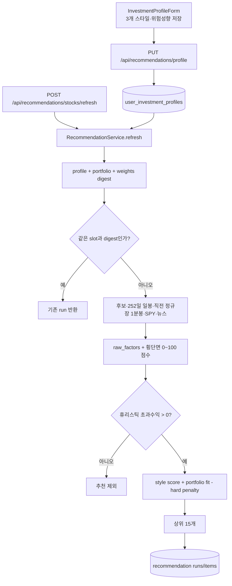
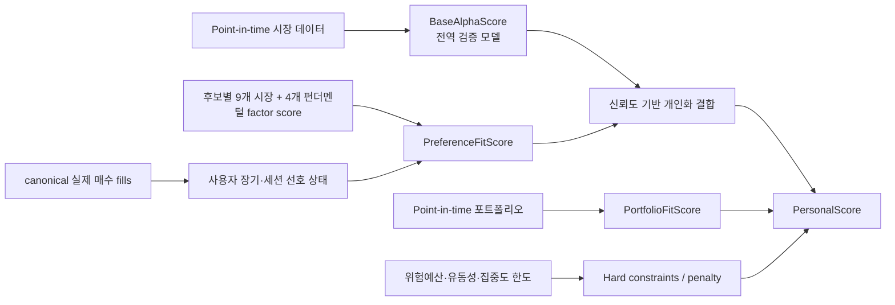
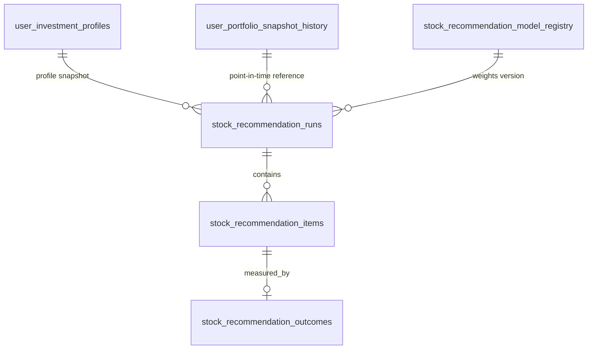
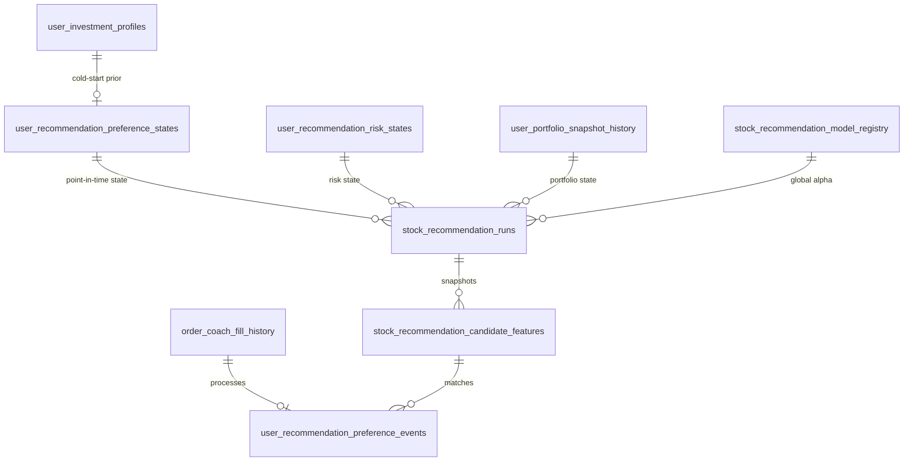

# 전문 개인화 주식 추천 알고리즘 상세 로직

이 문서는 다음 세 범위를 명확히 분리하여 설명한다.

1. 현재 저장소에 구현된 `professional-personalization-v1`의 실제 실행 로직
2. 실제 매수 체결과 포트폴리오 snapshot으로 가중치·위험예산을 연속 갱신하는
   `continuous-personalization-v2`의 현재 구현
3. 운영 검증을 거친 뒤 추가할 수 있는 연구 확장 항목

V2는 `professional_v2.py`, `RecommendationService.refresh()`,
`0012_continuous_recommendation_v2.sql`에 구현되어 있다. 회사 펀더멘털 값 자체를 만드는
provider는 다른 데이터 담당자의 계약이며, provider가 없거나 cutoff 검증에 실패하면
종목을 제외하지 않고 기존 9개 시장 팩터로 계산한다.

추천 알고리즘만 다룬다. 시뮬레이터, 자동 주문, 주문 수량 결정과 체결 로직은 이 문서의
범위가 아니다.

## 1. 한 문장 요약

V1은 전 종목에 동일한 9개 전문 팩터를 계산한 뒤 사용자의 세 가지
`recommendationStyle` 중 하나에 따라 팩터 가중치를 바꾼다. V2는 이 세 값을
초기값으로만 사용하고, 9개 시장 팩터와 4개 펀더멘털 합성 팩터에 대한 사용자별 연속형
선호 벡터와 그 신뢰도를 실제 매수 체결에 따라 갱신한다. V2의 전역 alpha는 cutoff-safe
`FundamentalScore`를 낮은 비중의 overlay로 검증한 뒤 결합한다. 두 버전 모두 유효한
포트폴리오 스냅샷이 있으면 포트폴리오 적합도와 위험 제약을 별도로 반영한다.

핵심 원칙은 다음과 같다.

- 전문 알파, 사용자 선호, 포트폴리오 적합도, 위험 한도는 서로 다른 계층이다.
- Momentum, Balanced, Stable 모두 같은 9개 팩터를 사용한다.
- v1의 스타일은 전문 신호의 가중치를 고정적으로 바꾼다.
- v2의 스타일은 cold-start prior이며, 이후 선호 가중치는 연속적으로 변한다.
- EPS·BPS 원값은 종목 간 비교 점수로 직접 사용하지 않고 가격·시가총액 대비 비율과
  품질·성장 합성 팩터로 변환한다.
- 클릭·체류시간·watchlist·명시적 팩터 조정은 V2 학습 입력으로 사용하지 않는다.
- 실제 매수 체결만 선호를 갱신하고, 매도는 회전율·보유기간 위험 추론에만 사용한다.
- 위험성향과 투자 가능 손실은 선호 로그에서 추정하지 않고 별도 위험예산으로 관리한다.
- 전문 데이터가 부족한 종목은 추천하지 않는다.
- 휴리스틱 예상 초과수익이 0 이하이면 포트폴리오 적합도가 높아도 추천하지 않는다.
- 전문 일봉 팩터는 현재 거래일 일봉을 사용하지 않는다.
- 뉴스와 후보 heatmap의 현재 cutoff는 고정된 전일 종가가 아니라 실제 refresh 시각이다.

## 2. 어디부터 보면 되는지

코드를 직접 읽을 때는 다음 순서가 가장 빠르다.

| 순서 | 파일과 심볼 | 확인할 내용 |
| ---: | --- | --- |
| 1 | `routes.py`의 `InvestmentProfileBody`, `upsert_recommendation_profile()` | 사용자 스타일과 위험성향 입력 계약 |
| 2 | `service.py`의 `RecommendationService.refresh()` | 추천 실행 진입점, feature flag, 데이터 수집, 멱등성 |
| 3 | `service.py`의 `daily_candles()`, `previous_session_candles()` | 252일 일봉과 직전 정규장 1분봉 조회 |
| 4 | `professional.py`의 `STYLE_WEIGHTS`, `RISK_BLEND` | 전문 스타일 prior와 위험성향 결합 비율 |
| 5 | `professional.py`의 `raw_factors()` | 9개 원시 팩터 계산 |
| 6 | `professional.py`의 `apply_professional_personalization()` | 횡단면 점수, alpha gate, 개인화 최종 점수와 순위 |
| 7 | `professional.py`의 `portfolio_fit_score()` | 포트폴리오 적합도 계산과 freshness 정책 |
| 8 | `repository.py`의 `create_or_replace_run()` | run과 item 저장 계약 |
| 9 | `0011_personalized_recommendations.sql` | 프로필, 모델 레지스트리, outcome 테이블 |
| 10 | `professional_v2.py` | 13팩터, 매수 학습, 위험예산, 최종 V2 점수 |
| 11 | `0012_continuous_recommendation_v2.sql` | preference/risk state, event, 후보 feature snapshot |
| 12 | `test_recommendation_professional_v2.py` | cutoff, softmax, 체결 학습, 위험 상한 검증 |

## 3. 전체 실행 흐름



## 4. 현재 v1 사용자 설정: 스타일과 위험성향의 분리

### 4.1 추천 스타일

`recommendationStyle`은 다음 세 값 중 하나다.

| 값 | 사용자 의미 | 알고리즘 영향 |
| --- | --- | --- |
| `momentum` | 급등, 강한 추세, 거래대금 가속 선호 | 상대강도와 비정상 거래대금 비중을 높임 |
| `balanced` | 수익성과 안정성의 균형 | Momentum과 Stable 사이의 중립 prior |
| `stable` | 유동성, 저변동성, 안정적 진입 선호 | 유동성과 저변동성 품질 비중을 높임 |

프로필에 스타일 값이 없는 기존 사용자는 `balanced`로 처리한다.

이는 **현재 구현 계약**이다. 목표 v2에서도 세 스타일은 삭제하지 않고 신규 사용자,
로그가 부족한 사용자, 개인화 초기화 사용자를 위한 설명 가능한 초기 preset으로 유지한다.
다만 충분한 사용자 근거가 쌓인 뒤에도 사용자를 세 구간 중 하나로 계속 고정하지는 않는다.

### 4.2 위험성향

`riskLevel`은 `conservative`, `balanced`, `aggressive` 중 하나다. 위험성향은
팩터 종류를 바꾸지 않고 최종 점수에서 전문 신호와 포트폴리오 적합도를 섞는 비율을
결정한다.

| 위험성향 | 전문 스타일 신호 | 포트폴리오 적합도 |
| --- | ---: | ---: |
| Conservative | 55% | 45% |
| Balanced | 70% | 30% |
| Aggressive | 82% | 18% |

따라서 `stable + aggressive`와 `momentum + conservative`도 유효한 조합이다.
예를 들어 `momentum + conservative`는 모멘텀 종목을 찾지만 포트폴리오 중복과
집중도는 더 강하게 반영한다.

## 5. 실행 기능 플래그

버전 선택 계약은 다음과 같다.

```text
RECOMMENDATION_ALGORITHM_VERSION=legacy|professional-v1|continuous-v2|deterministic-evidence-v3
RECOMMENDATION_PERSONALIZATION_ENABLED=false
RECOMMENDATION_PERSONALIZATION_SHADOW=true
RECOMMENDATION_PROFESSIONAL_WEIGHTS_JSON=
```

`RECOMMENDATION_ALGORITHM_VERSION`이 명시되면 이 값이 우선한다. 값이 없으면 기존 환경과의
호환을 위해 `RECOMMENDATION_PERSONALIZATION_ENABLED=false`는 `legacy`, `true`는
`professional-v1`으로 해석한다.

| 상태 | 실제 동작 |
| --- | --- |
| `legacy` | 기존 `scoring.py` 점수와 순위를 그대로 사용 |
| `professional-v1` | 기존 enable/shadow 플래그에 따라 V1을 실행 |
| `continuous-v2` | V2 `personalScore`로 실제 추천 순위를 결정하며 shadow를 사용하지 않음 |
| `deterministic-evidence-v3` | 예측 없이 현재 evidence block과 적합성으로 `FinalRankScore`를 계산하며 shadow를 사용하지 않음 |

Shadow mode에서 기존 scorer가 후보를 만들지 못하면 전문 후보 skeleton을 사용한다.
이 경우 기존 점수가 모두 0일 수 있으므로 shadow 결과는 전문 순위 검증용 데이터와
실제 노출 순위가 다를 수 있다. 실제 개인화 순위를 적용하려면 `SHADOW=false`가 필요하다.

## 5A. 현재 v2: 연속형 사용자 선호 모델

> 상태: 구현 완료. `professional_v2.py`와 `0012_continuous_recommendation_v2.sql`이
> 실행 코드와 저장 계약이다. 회사 데이터 provider가 없는 환경은 9팩터 fallback이다.

### 5A.1 설계 결정

V2는 사용자를 `momentum`, `balanced`, `stable` 중 하나로 분류하는 것이 아니라,
사용자가 어떤 투자 아이디어를 어느 정도 선호하는지를 현재 9개 시장 팩터와 4개
펀더멘털 합성 팩터의 연속적인 비율로 표현하는 것이다.

예를 들어 사용자는 모멘텀을 강하게 선호하면서도 유동성과 저변동성에 상당한 비중을 둘
수 있다. 이 사용자를 하나의 고정 스타일로 clamp하면 이 혼합 선호가 사라진다. v2에서는
다음 원칙을 사용한다.

- 세 스타일은 초기 가중치만 제공한다.
- 사용자별 가중치는 0~100 범위에서 연속적으로 변하며 합계는 100이다.
- 최근 행동은 빠르게 반영하되 장기 선호와 분리한다.
- 현재 학습 근거는 canonical ledger의 실제 매수 fill로 제한한다.
- 데이터가 적을수록 개인화 강도를 낮추고 검증된 전문 알파를 우선한다.
- 사용자 선호와 투자 적합성·위험 수용능력을 혼동하지 않는다.

### 5A.2 점수 계층 분리



각 계층의 책임은 다음과 같다.

| 계층 | 답하는 질문 | 갱신 근거 |
| --- | --- | --- |
| `BaseAlphaScore` | 다음 세션에 시장 대비 성과 가능성이 있는가 | point-in-time feature/label, OOS 검증 |
| `PreferenceFitScore` | 이 사용자가 이런 성격의 종목을 선호하는가 | 과거 후보 feature와 연결된 canonical 실제 매수 fill |
| `PortfolioFitScore` | 현재 보유자산에 추가할 때 중복·집중을 완화하는가 | 추천 시점 이전 포트폴리오 snapshot |
| 위험 제약 | 이 사용자에게 허용 가능한 노출인가 | portfolio snapshot, 매수·매도 execution, preset 상한 |

V2는 클릭·체류·watchlist를 학습하지 않는다. canonical 실제 매수 fill은
`PreferenceFitScore`만 갱신하며, 추천 outcome은 별도 연구 데이터로 전역 alpha 모델을
검증·재학습하는 데 사용한다.

### 5A.3 사용자 연속 선호 벡터

현재 v1의 사용자 선호 후보축은 아래 9개 시장 팩터다.

```text
F_market = [
  oneDayRelativeStrength,
  previousSessionStrength,
  abnormalDollarVolume,
  closingLocationValue,
  lastHourRelativeStrength,
  high52WeekProximity,
  newsImpact,
  liquidityQuality,
  lowVolatilityQuality
]
```

목표 v2는 원시 EPS·BPS 대신 다음 4개 합성 팩터를 추가한다.

```text
F_fundamental = [
  fundamentalValue,
  fundamentalQuality,
  fundamentalGrowth,
  earningsRevision
]

F_target = F_market + F_fundamental
```

따라서 목표 preference state는 13차원이다. 펀더멘털 데이터가 아직 cutoff-safe로 준비되지
않았거나 후보 coverage가 부족하면 4개 축을 계산에서 제외하고 남은 축의 가중치를 다시
정규화한다. 누락값을 0점으로 간주해 회사를 벌점 처리하지 않는다.

사용자가 선택한 초기 preset의 logit을 `b(u)`로 두고, 행동으로 학습한 장기·세션 편차를
각각 `z_long(u,t)`, `z_session(u,t)`로 저장한다. 유효 logit `h(u,t)`와 실제 가중치는
다음과 같이 만든다.

```text
h(u,t) = b(u) + z_long(u,t) + z_session(u,t)
q_i(u,t) = 100 × exp(h_i(u,t) / T) / Σ_j exp(h_j(u,t) / T)
```

- `q_i >= 0`
- `Σ q_i = 100`
- `T`는 특정 팩터로 가중치가 지나치게 집중되는 정도를 제어하는 temperature다.

이는 사용자를 세 범주로 clamp하지 않으면서도 음수 가중치나 합계 오류를 구조적으로
방지한다. 다만 softmax만으로 운영 안정성이 모두 해결되는 것은 아니므로 1회 갱신 이동량,
개인화 최대 반영률, 최소 유동성 및 집중도 한도는 별도로 제한한다.

### 5A.4 Cold-start 초기값

사용자가 선택한 세 스타일은 다음과 같이 초기 `q(u,0)`를 정하는 prior로만 사용한다.

```text
momentum 선택 → 현재 Momentum 9개 가중치로 초기화
balanced 선택 → 현재 Balanced 9개 가중치로 초기화
stable 선택   → 현재 Stable 9개 가중치로 초기화
미선택         → Balanced prior
```

위 preset은 9개 시장축의 초기값이다. 4개 펀더멘털축은 기본적으로 동일한 작은 양의 prior를
부여하고, 사용자가 가치·품질·성장·실적 catalyst 선호를 명시하면 해당 prior를 조정한다.
세 스타일 이름만으로 사용자의 펀더멘털 선호를 추정하지 않는다.

초기 logit은 작은 `epsilon`을 포함해 다음처럼 역변환할 수 있다.

```text
b_i(u) = T × log(max(q_i(u,0), epsilon) / 100)
```

현재 Momentum prior의 저변동성 가중치는 0이므로 `epsilon` 없이 logit으로 변환하면
정의되지 않는다. 구현 시에는 모든 축에 작은 양의 prior를 부여한 뒤 다시 정규화해야 한다.

### 5A.5 실제 매수와 당시 후보집합의 상대 특성을 학습

V2는 추천 run에서 Top 15뿐 아니라 모든 평가 후보의 point-in-time 13팩터와 횡단면 평균을
저장한다. canonical 실제 매수 fill이 들어오면 의사결정 시각 이전 24시간 이내의 동일 종목
candidate feature를 연결한다. 연결할 feature가 없으면 현재 데이터로 대체하지 않고
`missing_point_in_time_feature`로 건너뛴다.

```text
relativeExposure_t = x(selected) - mean(x(a), a in evaluatedCandidates_t)
eventStrength = clamp((buyNotional / portfolioEquity) / 0.05, 0.25, 1.0)
delta_t = 0.20 × eventStrength × clamp(relativeExposure_t, -1, 1)
z(u,t) = decay(Δt) × z(u,t-1) + clipped(delta_t)
```

당시 신뢰 가능한 equity가 없으면 `eventStrength=0.25`를 사용한다. 동일 주문의 부분 체결은
합산 강도 1.0을 넘지 않는다. 매도는 선호 state를 바꾸지 않고 risk state의 회전율과 FIFO
보유기간에만 사용한다.

### 5A.6 현재 허용된 행동 근거

| 근거 | 선호 학습 | 위험 추론 |
| --- | ---: | ---: |
| canonical 실제 매수 fill | 사용 | 회전율·보유기간에 사용 |
| canonical 실제 매도 fill | 제외 | 회전율·보유기간에 사용 |
| portfolio snapshot | 제외 | 변동성·낙폭·집중도·현금 계산 |
| 클릭·체류·watchlist·feedback | 제외 | 제외 |
| simulator·paper order | 제외 | 제외 |

실현 수익률은 alpha 평가 대상이며 사용자 선호 근거로 재사용하지 않는다.

### 5A.7 장기 선호와 세션 선호

보고서와 사용자 관심은 시간에 따라 변하므로 하나의 영구 벡터만 사용하지 않는다.

```text
z_long(t)    = exp(-Δt / 60 days) × z_long(t-1) + delta
z_session(t) = exp(-Δt / 3 days) × z_session(t-1) + delta
gamma        = min(0.5, n_session / (n_session + 3))
h_effective  = b(u) + z_long + gamma × z_session
q_effective  = 100 × softmax(h_effective / T)
```

- `b(u)`: cold-start preset이며 행동 편차가 감쇠하면 돌아갈 기준점이다.
- `gamma`는 세션 증거량과 freshness가 높을수록 커진다.

보고서 생성·열람·후속 질문은 사용자 선호 증거로 사용하지 않는다.

### 5A.8 증거량에 따른 개인화 강도

사용자 가중치가 계산되더라도 근거가 적으면 최종 추천에 강하게 반영하지 않는다. 시간 감쇠와
이벤트 신뢰도를 반영한 유효 표본 수를 `n_eff`라고 하면 다음처럼 신뢰도를 계산한다.

```text
preferenceConfidence = (5 + n_long) / (25 + n_long)
rho = 0.30 × preferenceConfidence
```

후보 `a`에 대한 선호 적합도와 개인화 신호는 다음과 같다.

```text
PreferenceFitScore(u,a,t) = Σ_i q_i(u,t) × factorScore_i(a,t) / 100

PersonalSignal(u,a,t) =
    (1 - rho) × BaseAlphaScore(a,t)
  + rho × PreferenceFitScore(u,a,t)
```

- 신규 사용자: `n_eff ≈ 0`, `rho ≈ 0`, 전문 알파가 지배한다.
- 근거가 누적된 사용자: 선호 적합도가 점진적으로 더 반영된다.
- `rho_max < 1`: 선호가 강해도 전문 알파를 완전히 제거하지 않는다.

`k`, `rho_max`, decay, event strength, temperature는 제품 감각으로 확정하지 않고
walk-forward replay와 off-policy 평가로 승인한다.

### 5A.9 현재 V2 최종 점수

포트폴리오 snapshot이 유효할 때 목표 식은 다음과 같다.

```text
PersonalScore(u,a,t) = clamp(
    (1 - lambda_portfolio) × PersonalSignal(u,a,t)
  + lambda_portfolio × PortfolioFitScore(u,a,t)
  - SoftRiskPenalty(u,a,t),
  0,
  100
)
```

아래 조건은 점수 차감만으로 처리하지 않고 후보 제외 또는 별도 승인 정책으로 관리한다.

```text
BaseAlphaScore 또는 calibration된 expected excess가 최소 기준 미달
minimumLiquidity 미달
maxSingleStockPct 초과
maxSectorPct 초과
명시적 제외 종목·섹터
critical point-in-time feature 누락
```

따라서 “세 타입 clamp 제거”는 모든 안전 범위를 제거한다는 뜻이 아니다. 선호 표현은
연속화하되 투자 적합성과 데이터 품질 경계는 더 명확하게 유지한다.

### 5A.10 포트폴리오에서 추론하는 연속 위험예산

`riskLevel` 세 값은 V2에서 절대 완화할 수 없는 상한 preset이다. 실제 위험예산은 최근
90일 시장가치 portfolio snapshot과 최근 180일 canonical 실제 fill로 추론하며, 관측값에
25% buffer를 적용한 뒤 preset과 더 보수적인 값을 선택한다.

```text
targetAnnualVolatility
maxDrawdownPct
maxSingleStockPct
maxSectorPct
minimumMedianDollarVolume
maximumTurnoverPct
cashBufferPct
investmentHorizonDays
```

`valuationBasis=cost_basis` snapshot은 변동성·drawdown 계산에서 제외한다. 변동성과
drawdown은 90일 안에서 30일 이상에 걸친 신뢰 가능한 시장가치 관측 20개가 필요하다.
turnover는 같은 equity coverage와 최근 30일 canonical real fill이 모두 있어야 하며,
FIFO 보유기간은 180일 안에 완전히 닫힌 lot 3개가 있어야 한다. 각 metric의 표본이
부족하면 해당 preset으로 fallback하며 추론값은 preset 상한을 완화할 수 없다.

후보는 현재 계좌에 equity의 5%를 추가한다고 가정한다. 최소 유동성과 추가 후 sector
cap 실패는 hard exclude다. 나머지 관측 위험은 다음 bounded additive penalty를 사용한다.

```text
riskPenalty = min(30,
    10 × clamp(volatilityUse - 1, 0, 1)
  +  8 × clamp(turnoverUse - 1, 0, 1)
  +  6 × clamp(singleStockUse - 1, 0, 1)
  +  6 × clamp(sectorUse - 1, 0, 1))
```

### 5A.11 구현된 상태와 이벤트 계약

`0012_continuous_recommendation_v2.sql`은 다음 테이블을 만든다.

#### `user_recommendation_preference_states`

| 필드군 | 내용 |
| --- | --- |
| 식별 | `user_sub`, `state_version`, `as_of` |
| 장기 상태 | 목표 13개 `long_term_logits`, 활성 factor schema, decay 기준시각 |
| 세션 상태 | 목표 13개 `session_logits`, session ID, decay 기준시각 |
| 유효 상태 | 활성축 `effective_weights`, `preference_confidence`, `n_eff` |
| provenance | preference model version, event cutoff, input digest |
| 제어 | cold-start prior style |

#### `user_recommendation_preference_events`

| 필드군 | 내용 |
| --- | --- |
| 식별 | `event_id`, `user_sub`, `event_time`, `processed_at` |
| 추천 참조 | candidate run ID, symbol, decision time |
| 행동 | 실제 execution ID, applied/skipped, skip reason |
| 비교 노출 | 당시 전체 평가 후보의 횡단면 평균과 relative exposure |
| 강도 | buy notional, point-in-time equity, order 누적 cap |
| 재현성 | event schema version, processing version, idempotency key |

추천 run과 item에는 사용한 `preference_state_version`, `preference_input_digest`,
`preferenceConfidence`, `rho`, `effectiveWeights`를 기록해야 한다. 그래야 같은 시장 데이터에
대해 왜 사용자 순위가 달라졌는지 재현할 수 있다.

### 5A.12 향후 연구: 노출편향과 오프라인 평가

사용자는 시스템이 보여준 종목만 클릭할 수 있으므로 단순 클릭률 학습은 기존 순위의
노출편향을 복제한다. 운영 로그에는 추천하지 않은 전체 시장이 아니라 적어도 실제 비교
가능했던 노출 집합, 위치와 당시 선택확률을 남겨야 한다.

배포 전 평가는 다음 단계를 사용한다.

1. 과거 이벤트를 시간순으로 replay해 미래 이벤트 누수를 차단한다.
2. 기본 alpha 성능과 개인화 만족도 지표를 분리한다.
3. IPS, Doubly Robust, SWITCH 계열 off-policy estimator로 정책 변화 효과를 비교한다.
4. 극단 propensity weight, 사용자별 표본 편차와 sector turnover를 함께 보고한다.
5. shadow ranking에서 실제 순위와 목표 순위의 차이를 저장한다.
6. 낮은 `rho_max`로 시작해 사용자 cohort별로 점진 배포한다.

### 5A.13 사용자 보고서 계약

개인화 추천 보고서는 단순히 “당신은 모멘텀형”이라고 쓰지 않는다. 최소한 다음을
설명해야 한다.

- 현재 유효 시장·펀더멘털 선호 가중치와 기준 시각
- 명시적 설정과 행동 기반 추론의 구분
- 개인화 신뢰도, 유효 표본 수 범주 및 사용한 evidence window
- `BaseAlphaScore`, `PreferenceFitScore`, `PortfolioFitScore`, 최종 점수
- 개인화로 인한 순위 변화 또는 `PersonalSignal - BaseAlphaScore`
- 이전 보고서 대비 가중치가 변한 주요 근거
- 적용된 유동성·집중도·제외 조건과 데이터 누락 경고
- preference state와 모델 version 및 사용자가 초기화·비활성화할 방법

### 5A.14 권장 도입 순서

1. 점수는 바꾸지 않고 노출·행동 이벤트와 propensity를 먼저 기록한다.
2. 이벤트 품질, 중복, 시간순서 및 사용자 동의·보존정책을 검증한다.
3. 사용자 선호 state를 offline으로 생성하고 과거 report를 replay한다.
4. 목표 점수를 shadow로 계산해 현재 순위와 비교한다.
5. OOS/OPE 승인 후 낮은 `rho_max`로 제한된 cohort에 적용한다.
6. 사용자에게 팩터 조정, 개인화 reset 및 opt-out을 제공한다.
7. alpha outcome, 사용자 만족도, turnover, 집중도, 불만·숨김률을 공동 모니터링한다.

## 5B. 현재 v3: 결정론적 evidence 추천

> 상태: 구현 완료. `professional_v3.py`와 `0013_deterministic_evidence_v3.sql`이 실행 코드와
> 저장 계약이다. V1/V2 코드는 호환 모드로 유지된다.

V3는 미래 가격, 수익률, SPY 대비 초과수익, 이익 가능성을 예측하지 않으며 미래 수익률
label, 학습 모델, 후행 성과 기반 weight 최적화를 만들지 않는다. 세션 슬롯마다 전체 준비
S&P 500 유니버스를 평가해 하나의 immutable base evidence snapshot을 만들고 모든 사용자가
이를 공유한다. 사용자별 처리는 hard gate 이후의 제외, 스타일 block weight, 실제 매수
체결 기반 선호와 현재 포트폴리오 적합성으로 한정된다.

여섯 block은 `TrendStrength`, `ParticipationConfirmation`, `PriceStructure`,
`CatalystQuality`, `ExecutionQuality`, `QualityStability`이며 0–100 범위다. 연속값은 적격
유니버스의 1/99 percentile winsorization 후 평균 rank percentile로 바꾸고 시장 60%, 섹터
40%를 합성한다. 누락 optional 값은 50으로 중립 처리하지만 evidence coverage를 낮춘다.
critical 입력 누락, stale 시세, 거래정지, 위험 preset의 유동성·spread 한도, 종목·섹터 hard
cap 위반은 점수 계산 전에 탈락한다.

`confidence`는 다음 `EvidenceReliability / 100`이며 이익 또는 성공 확률이 아니다.

```text
EvidenceReliability =
    30% coverage
  + 25% freshness
  + 20% source quality
  + 15% cross-source agreement
  + 10% independent block confirmation
```

70 미만 후보는 추천하지 않는다. 선호는 이미 통과한 후보만 최대 15% 범위에서 재정렬한다.
포트폴리오가 최신이고 증거가 있을 때만 위험성향별 15–35% weight를 적용하며, 완료된 60일
수익률의 `0.70 × SampleCovariance + 0.30 × DiagonalCovariance`는 현재 위험 관계를 기술할
뿐 미래 수익률을 예측하지 않는다. 모든 run에는 style weight, threshold, transform, penalty
cap, cutoff, source digest, evidence snapshot reference와 rule set
`deterministic-evidence-v3.1`을 저장한다.

## 6. 추천 생성 시점과 cutoff

`RecommendationService.refresh()`는 요청된 `pre` 또는 `regular` 세션이 현재 활성
세션일 때만 새 추천을 만든다. 세션이 아니면 `market_closed`를 반환한다.

전문 일봉 입력에는 `completed_daily()`가 적용된다.

1. 일봉을 timestamp 순서로 정렬한다.
2. 미국 동부시간 기준 현재 거래일과 같은 날짜 또는 미래 날짜의 일봉을 제외한다.
3. `isClosed=false` 또는 `is_closed=false`인 일봉을 제외한다.

예를 들어 2026년 7월 15일 추천에서는 7월 15일 일봉을 사용하지 않고 7월 14일까지의
완료 일봉만 사용한다. 뉴스는 추천 refresh 시점보다 늦은 availability timestamp를
가진 기사를 제외한다.

현재 구현의 cutoff는 데이터 종류별로 완전히 같지 않다.

| 데이터 | 현재 cutoff |
| --- | --- |
| 전문 일봉 | 미국 동부시간 기준 현재 거래일 이전의 완료 일봉 |
| 직전 정규장 1분봉 | 코드가 계산한 이전 평일 정규장 window |
| 뉴스 | `availability timestamp <= refresh now` |
| 후보 heatmap | refresh 시점에 조회한 현재 market snapshot |

따라서 7월 15일 장전 refresh에서는 7월 15일 장전 뉴스가 포함될 수 있고, 후보
유니버스도 7월 15일 현재 heatmap의 영향을 받을 수 있다. “7월 14일 16:00 ET까지의
데이터만 사용”하는 엄격한 추천을 만들려면 뉴스 cutoff와 후보 유니버스를 별도의 고정
cutoff snapshot으로 조회해야 한다.

현재 직전 정규장 계산은 주말만 건너뛴다. 미국 공휴일과 반장은 별도 거래소 캘린더로
보정하지 않으므로 운영 전 보완이 필요한 현재 한계다.

## 7. 후보 유니버스와 기본 제외 조건

후보는 기존 `build_candidates()`가 heatmap의 거래대금 상위, 변동률 상위와 사용자
관심 섹터 주변 종목을 합쳐 최대 50개까지 만든다.

다음 종목은 새 추천 아이디어에서 제외한다.

- 사용자의 관심종목
- 현재 보유종목
- 현재 화면에서 보고 있는 `activeSymbol`
- 사용자가 명시적으로 제외한 종목
- 사용자가 제외한 섹터
- SPY

SPY는 후보가 아니라 benchmark로만 사용한다.

## 8. 전문 데이터 적격성 검사

`raw_factors()`는 아래 조건을 모두 만족하지 못하면 `None`을 반환한다. 해당 종목은
전문 개인화 추천에서 제외된다.

| 검사 | 현재 기준 |
| --- | --- |
| 후보 일봉 | 현재 거래일 이전의 완료 일봉 252개 이상 |
| SPY 일봉 | 현재 거래일 이전의 완료 일봉 252개 이상 |
| 후보 직전 정규장 1분봉 | 30개 이상 |
| SPY 직전 정규장 1분봉 | 30개 이상 |
| 가격 조정 | 값이 존재하면 반드시 `split` |
| 세션 분류 | 값이 존재하면 반드시 `regular` |

주의할 점은 `price_adjustment` 또는 `market_session` 필드 자체가 없는 row는 현재 코드가
거절하지 않는다는 것이다. AWS canonical 승인 단계에서 필드 존재와 값의 완전성을 별도로
보증해야 한다.

## 9. 9개 전문 팩터의 실제 계산식

아래에서 다음 기호를 사용한다.

- `D0`: 추천 시점 이전의 가장 최근 완료 거래일. 7월 15일 추천이면 7월 14일
- `D-1`: 그 직전 완료 거래일. 7월 15일 추천이면 7월 13일
- `r(x)`: 해당 구간 수익률을 퍼센트 단위로 표현한 값
- `DV`: `close × volume`으로 계산한 거래대금
- `SPY`: 동일 기간 benchmark

### 9.1 최근 거래일 SPY 대비 상대수익률

```text
stock_D0 = (D0 close / D0 open - 1) × 100
spy_D0   = (SPY D0 close / SPY D0 open - 1) × 100

oneDayRelativeStrength = stock_D0 - spy_D0
```

값이 높을수록 가장 최근 거래일에 시장보다 강했다는 뜻이다.

### 9.2 직전 거래일 시가에서 최근 종가까지의 SPY 대비 강도

```text
stock_2session = (D0 close / D-1 open - 1) × 100
spy_2session   = (SPY D0 close / SPY D-1 open - 1) × 100

previousSessionStrength = stock_2session - spy_2session
```

하루짜리 신호만 보는 문제를 줄이고 직전 이틀에 걸친 가격 지속성을 확인한다.

### 9.3 비정상 거래대금

```text
latestDV = D0 close × D0 volume
baselineDV = median(D0 이전 20개 일봉의 close × volume)

abnormalDollarVolume = ln(latestDV / baselineDV)
```

- `0`: 최근 거래대금이 20일 중앙값과 같음
- 양수: 평소보다 거래대금 증가
- 음수: 평소보다 거래대금 감소

### 9.4 Closing Location Value

```text
CLV = (2 × close - high - low) / (high - low)
```

`high == low`이면 0으로 처리한다.

- `+1`에 가까움: 종가가 당일 고가 부근
- `0` 부근: 종가가 일중 범위 중앙
- `-1`에 가까움: 종가가 당일 저가 부근

### 9.5 마지막 1시간 SPY 대비 상대강도

후보와 SPY의 직전 정규장 1분봉에서 마지막 최대 60개를 사용한다.

```text
stock_last_hour = (마지막 close / 선택 구간 첫 open - 1) × 100
spy_last_hour   = (SPY 마지막 close / SPY 선택 구간 첫 open - 1) × 100

lastHourRelativeStrength = stock_last_hour - spy_last_hour
```

선택 가능한 봉이 30개 미만이면 `last_hour_return()` 자체는 0을 반환하지만,
`raw_factors()`의 사전 검사에서 후보 전체가 제외된다.

### 9.6 52주 고가 근접도

```text
high52 = max(최근 252개 완료 일봉 high)
high52WeekProximity = D0 close / high52
```

1에 가까울수록 52주 고가 부근이다. 현재 계산은 split-adjusted canonical 가격을
전제로 한다.

### 9.7 Cutoff-safe 뉴스 영향

뉴스는 다음 순서로 식별자와 availability 시각을 결정한다.

```text
중복 식별자: articleId → id → url → headline
시각: availableAt → receivedAt → received_at → localizedAt → publishedAt → published_at
```

동일 식별자는 한 번만 사용하고, availability 시각이 없거나 추천 시점보다 늦으면
제외한다.

```text
timeDecay = exp(-기사 나이 시간 / 48)
direction = +1  positive/bullish/up
direction = -1  negative/bearish/down
direction =  0  그 외

newsImpact = clamp(sum(direction × timeDecay), -1, +1)
```

### 9.8 유동성 품질

```text
medianDV = median(D0 이전 20개 일봉의 close × volume)
liquidityQuality = log10(medianDV)
```

예를 들어 중앙 거래대금이 1백만 달러면 값은 6, 1억 달러면 8이다.

### 9.9 저변동성 품질

최근 21개 완료 일봉에서 20개의 close-to-close 수익률을 만들고 모집단 표준편차를
계산한다.

```text
lowVolatilityQuality = -pstdev(최근 20개 close-to-close return)
```

표준편차에 음수를 붙이므로 변동성이 낮을수록 값이 더 크고 횡단면 순위가 높아진다.

## 10. 횡단면 점수 변환

원시 팩터는 단위가 서로 다르므로 후보군 안에서 각 팩터를 0~100 순위 점수로 바꾼다.

```text
factorScore = 정렬된 위치 / (후보 수 - 1) × 100
```

- 가장 낮은 값은 0
- 가장 높은 값은 100
- 후보가 하나뿐이면 50

현재 구현은 동점에 평균 순위를 주지 않는다. `(팩터값, symbol)` tuple을 정렬하므로
팩터값이 같으면 symbol 문자열 순서가 tie-break가 된다. 연구·운영 단계에서는 평균
rank 또는 안정적인 percentile 정책으로 바꾸는 것을 검토해야 한다.

## 11. 현재 v1 스타일별 전문 가중치

가중치 버전은 `professional-personalization-v1`이다.

| 팩터 | Momentum | Balanced | Stable |
| --- | ---: | ---: | ---: |
| 최근 거래일 SPY 대비 상대수익률 | 25 | 20 | 10 |
| D-1 시가 → D0 종가 SPY 대비 강도 | 10 | 10 | 5 |
| 비정상 거래대금 | 20 | 15 | 5 |
| Closing Location Value | 10 | 10 | 10 |
| 마지막 1시간 SPY 대비 강도 | 10 | 10 | 5 |
| 52주 고가 근접도 | 10 | 10 | 10 |
| Cutoff-safe 뉴스 영향 | 10 | 10 | 5 |
| 유동성 품질 | 5 | 5 | 20 |
| 저변동성 품질 | 0 | 10 | 30 |
| 합계 | 100 | 100 | 100 |

각 팩터의 점수 기여도는 다음과 같다.

```text
contribution_i = factorScore_i × weight_i / 100
styleSignalScore = sum(contribution_i)
```

`baseAlphaScore`는 항상 현재 weight set의 Balanced 가중치로 계산하고,
`styleSignalScore`는 사용자가 선택한 스타일의 가중치로 계산한다.

목표 v2에서는 위 표가 사용자별 최종 분류가 아니라 cold-start prior가 된다.
`BaseAlphaScore`용 전역 검증 가중치와 사용자 `PreferenceFitScore`용 연속 가중치는 서로
다른 version·registry·승인 경로로 관리해야 한다.

## 12. 양의 alpha gate

전문 점수가 높아도 다음 휴리스틱 값이 0 이하이면 후보를 제외한다.

```text
predictedExcess =
    0.35 × oneDayRelativeStrength
  + 0.20 × previousSessionStrength
  + 0.15 × lastHourRelativeStrength
  + 0.10 × closingLocationValue
  + 0.08 × abnormalDollarVolume
  + 0.07 × newsImpact
  + 0.05 × (high52WeekProximity - 0.8)
```

```text
predictedExcess <= 0 → 추천 제외
```

중요한 해석상 주의가 있다. 현재 식은 퍼센트 수익률, CLV, 로그 거래대금 비율,
뉴스 점수 등 단위가 다른 원시값을 직접 더한다. 따라서 저장 필드 이름은
`predictedExcessReturnPct`이지만, 현재 값은 통계적으로 calibration된 실제 예상
초과수익률 퍼센트가 아니다. 지금은 “양의 alpha 후보만 통과시키는 결정론적 gate”로
해석해야 한다. 실제 수익률 예측값으로 사용하려면 versioned feature/label dataset과
walk-forward calibration이 추가로 필요하다.

## 12A. V2 회사 펀더멘털 팩터

> 상태: 추천 서비스의 검증된 batch provider boundary, 4개 합성 팩터 overlay, provenance,
> 종목별 9팩터 fallback은 구현되어 있다. 원천 SEC/EPS/BPS 계산과 sector-neutral 합성점수
> 생산은 추천 서비스 밖의 외부 producer 책임이며 이 저장소의 기본 provider는 없다.

### 12A.1 추가 원칙

EPS, BPS, 매출, 순이익처럼 회사 규모와 주식 수에 좌우되는 원값을 횡단면 점수에 직접
넣지 않는다. 다음 네 계층을 구분한다.

| 계층 | 역할 | 예시 |
| --- | --- | --- |
| Source fact | 공시에서 확인된 원천값 | 순이익, 자본, 매출, 주식수 |
| Derived metric | 비교 가능한 비율·성장률 | earnings yield, book-to-market, ROE |
| Fundamental factor | 동종기업 내 정규화된 합성점수 | Value, Quality, Growth, Revision |
| Model contribution | 검증된 최대 반영률로 alpha에 결합 | `fundamentalWeight × FundamentalScore` |

원천값과 합성점수를 분리하면 원본 공시를 재현하면서도 종목 간 규모 차이, 분할, 업종
차이와 결측을 일관되게 처리할 수 있다.

### 12A.2 현재 저장소에서 준비된 것과 미준비 항목

| 항목 | 현재 상태 | 추천 연결 판단 |
| --- | --- | --- |
| SEC actual facts | `sec_financial_facts`에 EPS·자본·자산·부채·매출·현금흐름 저장 경로 존재 | 원천 준비, AWS coverage 별도 검증 |
| Derived metrics | ROE, margin, growth, FCF, 부채·유동성 비율 계산 경로 존재 | 일부 준비 |
| Yahoo EPS·매출 consensus | actual과 분리된 latest estimate 저장 경로 존재 | latest 표시 가능 |
| BPS | 명시적 derived metric 없음 | 계산·quality 계약 필요 |
| TTM metric | 추천용 고정 TTM snapshot 계약 없음 | 미준비 |
| Recommendation batch input | injectable `snapshots_as_of(symbols, cutoff)` boundary | 구현, 기본 provider 없음 |
| 당일 공시 이용 가능 시각 | 주요 SEC fact schema의 `filed_at`이 날짜 정밀도 | 장중/장후 구분 미준비 |
| 과거 consensus revision | latest replacement 구조 | point-in-time 30일 revision 미준비 |
| 펀더멘털 score·provenance | V2 4팩터 score, 최대 15% overlay, batch digest 저장 | 구현 |

### 12A.3 추천 입력 계약

추천 서비스는 화면용 종목별 HTTP endpoint를 반복 호출하지 않고, 전체 후보를 한 번에
조회하는 injectable batch 계약을 사용한다.

```text
snapshots_as_of(
    symbols: list[str],
    cutoff_timestamp: datetime
) -> dict[symbol, FundamentalSnapshot]
```

7월 15일 추천의 고정 입력이 7월 14일 마감이라면 다음 조건을 만족한 row만 허용한다.

```text
available_at <= 2026-07-14 16:00:00 America/New_York
accepted_at  <= cutoff                 # 값이 있을 때
inserted_at  <= immutable_run_cutoff
consensus_collected_at <= cutoff
```

`period_end`는 재무제표가 설명하는 기간이지 시장이 그 정보를 알게 된 시각이 아니다.
`filed_at`도 날짜만 저장하면 같은 날 장중 공시와 장후 공시를 구분하지 못한다. 운영 추천과
과거 replay에는 최초 이용 가능 시각인 `accepted_at` 또는 검증된 `available_at`이 필요하다.
증명할 수 없으면 같은 거래일 공시는 보수적으로 제외한다.

필수 snapshot 필드는 다음과 같다.

```text
symbol
cutoff_timestamp
period_end
fiscal_year
fiscal_period
form
accession
filed_at
accepted_at
available_at
inserted_at
version_filed_at
currency
source
quality

net_income_ttm
eps_ttm_diluted
common_equity
period_end_common_shares
revenue_ttm
operating_income_ttm
operating_cash_flow_ttm
free_cash_flow_ttm
market_cap_at_cutoff

roe_ttm
operating_margin_ttm
revenue_growth_yoy
net_income_growth_yoy
debt_to_equity
interest_coverage
current_ratio

eps_consensus
consensus_collected_at
eps_surprise
eps_revision_30d
analyst_count

loss_making_flag
negative_equity_flag
restatement_flag
synthetic_q4_flag
equity_includes_nci_flag
split_adjustment
```

### 12A.4 EPS와 BPS의 추천용 변환

주당 원값보다 기업 전체값을 cutoff 시점 시가총액으로 나눈 비율을 우선한다.

```text
EarningsYield = NetIncomeAvailableToCommonTTM / MarketCapAtCutoff
BookToMarket  = CommonEquity / MarketCapAtCutoff
FCFYield      = FreeCashFlowTTM / MarketCapAtCutoff
```

이 방식은 다음 표시용 비율과 경제적 의미는 유사하지만 주식분할과 주식수 변화 처리에 덜
민감하다.

```text
BPS = CommonEquity / PeriodEndCommonShares
PER = CutoffPrice / DilutedEPSTTM
PBR = CutoffPrice / BPS
```

- EPS는 가능하면 희석 기준을 사용하고 basic/diluted fallback 여부를 quality에 남긴다.
- BPS 분모는 기간 말 보통주 수다. EPS의 가중평균 희석주식수를 BPS 분모로 재사용하지 않는다.
- `CommonEquity`는 가능하면 비지배지분과 우선주를 제외한다.
- 과거 EPS·BPS를 시계열로 비교할 때 주식수와 per-share 값의 split 기준을 일치시킨다.
- `NetIncomeTTM <= 0`이면 PER 역수를 만들지 않고 `loss_making_flag`를 별도 보존한다.
- `CommonEquity <= 0`이면 PBR/Book-to-Market을 추천 점수에서 제외하고
  `negative_equity_flag`를 위험 설명에 사용한다.

### 12A.5 네 개 합성 팩터

아래 비중은 shadow 연구를 시작하기 위한 prior이며 운영 production 계수가 아니다.

```text
fundamentalValue =
    35% sectorScore(EarningsYield)
  + 30% sectorScore(BookToMarket)
  + 35% sectorScore(FCFYield)

fundamentalQuality =
    30% sectorScore(ROE)
  + 20% sectorScore(OperatingMargin)
  + 20% sectorScore(CashConversion)
  + 15% sectorScore(InterestCoverage)
  + 15% sectorScore(-DebtToEquity)

fundamentalGrowth =
    40% sectorScore(RevenueGrowthYoY)
  + 35% sectorScore(NetIncomeGrowthYoY)
  + 25% sectorScore(EPSGrowthYoY)

earningsRevision =
    60% sectorScore(EPSRevision30D)
  + 40% sectorScore(EPSSurprise)
```

```text
FundamentalScore =
    30% fundamentalValue
  + 35% fundamentalQuality
  + 20% fundamentalGrowth
  + 15% earningsRevision
```

`CashConversion`은 데이터 계약이 승인되면 영업현금흐름/순이익 또는 현금흐름/자산 기반으로
정의한다. 음수 순이익에서 단순 비율이 폭발하지 않도록 별도 loss regime을 적용한다.
`EPSGrowthYoY`와 surprise는 비교 가능한 fiscal period 및 동일한 basic/diluted 기준을
사용해야 한다.

### 12A.6 업종 중립화와 결측 처리

각 derived metric은 다음 순서로 0~100 점수로 변환한다.

1. 통화와 단위를 canonical 기준으로 통일한다.
2. 유효하지 않은 분모와 quality flag를 적용한다.
3. 업종 또는 섹터 안에서 극단값을 winsorize한다.
4. 동종기업 percentile 또는 rank 기반 z-score를 계산한다.
5. peer 수가 최소 기준보다 작으면 승인된 상위 sector 또는 market fallback을 사용한다.
6. 이용 가능한 구성요소만으로 가중치를 재정규화한다.

```text
componentCoverage = availableComponentWeight / configuredComponentWeight
```

- coverage가 승인 임계값보다 낮으면 해당 합성 팩터를 만들지 않는다.
- 누락값을 0점으로 채워 데이터가 없는 회사를 저품질 회사로 오인하지 않는다.
- 금융회사의 부채·current ratio와 비금융회사의 같은 비율을 직접 비교하지 않는다.
- 은행·보험, REIT, pre-revenue 기업은 별도 sector template 또는 제한된 factor set을 쓴다.
- percentile 동점 정책과 peer universe를 feature version에 고정한다.

### 12A.7 단기 추천에 대한 반영률

현재 목표는 다음 세션의 성과이므로 느리게 변하는 재무제표를 가격·거래량 alpha보다 크게
반영하지 않는다. 초기 shadow 상한은 다음과 같이 둔다.

```text
fundamentalWeight =
    0.15
  × dataCoverage
  × dataFreshness
  × sourceQuality

ExtendedBaseAlphaScore =
    (1 - fundamentalWeight) × CurrentBaseAlphaScore
  + fundamentalWeight × FundamentalScore
```

`0.15`는 production 정답이 아니라 초기 최대치다. walk-forward OOS에서 다음 세션 SPY
대비 수익, 거래비용, turnover, sector exposure와 월별 안정성을 검증해 승인한다. 데이터가
없거나 신뢰할 수 없으면 `fundamentalWeight=0`으로 기존 alpha에 안전하게 복귀한다.

실적 surprise와 revision은 단기 catalyst가 될 수 있지만 현재 `newsImpact`와 같은 사건을
중복 반영할 수 있다. feature correlation, incremental information coefficient와 ablation을
검증하고, 동일 earnings event의 뉴스 기여와 구조화 실적 기여를 provenance로 구분한다.

### 12A.8 연속 개인화와의 연결

사용자 선호에는 원시 `epsPreference`, `bpsPreference`를 만들지 않는다. 목표 v2의
`PreferenceFitScore`에 다음 네 factor score를 노출한다.

```text
fundamentalValue
fundamentalQuality
fundamentalGrowth
earningsRevision
```

- 급등·고성장 선호는 시장 모멘텀과 `fundamentalGrowth`, `earningsRevision`의 혼합으로
  표현할 수 있다.
- 안정 선호는 `fundamentalQuality`, 유동성, 저변동성의 혼합으로 표현할 수 있다.
- 가치 선호는 `fundamentalValue`를 명시적으로 높일 수 있다.
- 사용자의 클릭은 위 선호 가중치만 갱신하며 전역 `fundamentalWeight`나 alpha 계수를
  직접 바꾸지 않는다.

전역 alpha가 펀더멘털을 얼마나 신뢰할지는 OOS outcome으로 결정하고, 개인이 어떤 회사
특성을 선호하는지는 명시적 설정과 편향 보정된 행동 로그로 결정한다.

### 12A.9 저장과 재현성

추천 item에는 최소한 다음 값을 저장한다.

```text
fundamentalSnapshotId
fundamentalCutoff
fundamentalFeatureVersion
fundamentalModelVersion
fundamentalDataCoverage
fundamentalWeight
fundamentalScore
fundamentalFactorScores
fundamentalContributions
fundamentalQualityFlags
fundamentalInputDigest
```

run digest에는 후보별 전체 공시 payload가 아니라 immutable snapshot/version과 입력 digest를
포함한다. 공시 정정이나 consensus 갱신으로 같은 시장 slot의 결과가 달라질 때 어떤 정보가
바뀌었는지 설명할 수 있어야 한다.

### 12A.10 최소 검증 항목

- cutoff 이후 공시·정정·컨센서스가 과거 추천에 들어가지 않는지
- 같은 날 장후 공시가 16:00 ET cutoff 이전 정보로 처리되지 않는지
- quarterly/FY/TTM 기간이 혼합되지 않는지
- split 전후 EPS·BPS·시가총액 비율이 연속적인지
- negative EPS/equity가 무한대 또는 반대 방향 점수를 만들지 않는지
- 섹터별 coverage와 peer 수가 충분한지
- `newsImpact`를 제외했을 때 earnings factor의 증분 성과가 남는지
- fundamentals overlay가 turnover와 sector concentration을 악화시키지 않는지
- 데이터 누락 시 기존 9개 팩터 결과로 결정론적으로 복귀하는지

## 13. 포트폴리오 스냅샷 선택

추천 시점보다 미래의 포트폴리오를 사용하는 look-ahead를 막기 위해 repository는
다음 조건으로 history를 조회한다.

```sql
WHERE user_sub = :user
  AND source_as_of <= :recommendation_time
ORDER BY source_as_of DESC, id DESC
LIMIT 1
```

즉 추천 시점에 사용 가능했던 가장 최근 `user_portfolio_snapshot_history` row를 고른다.
history가 없으면 latest snapshot을 확인하되 그 시각이 추천 시점보다 미래면 버린다.

## 14. 포트폴리오 freshness 정책

| 스냅샷 나이 | 상태 | 사용 방식 |
| --- | --- | --- |
| 15분 이내 | `fresh` | 보유, 섹터, 상관, 변동성, 현금 입력을 모두 사용 |
| 15분 초과~24시간 이내 | `limited` | 보유·섹터·상관·변동성 사용, 현금 관련 점수는 50으로 중립 처리 |
| 24시간 초과 | `stale` | 포트폴리오 점수 전체를 50으로 만들고 최종 결합에서 제외 |
| 스냅샷 없음 | `missing` | 포트폴리오 점수 전체를 50으로 만들고 최종 결합에서 제외 |

`stale`과 `missing`은 단순히 50점을 섞는 것이 아니다. 최종 결합 비율을
`alphaWeight=1.0`, `portfolioWeight=0.0`으로 바꾸므로 실제 순위는 스타일 신호만으로
결정된다.

## 15. 포트폴리오 적합도 계산

```text
portfolioFitScore =
    30% × sectorDiversification
  + 25% × correlationBenefit
  + 20% × marginalVolatility
  + 15% × liquidityCashCompatibility
  + 10% × drawdownCashBuffer
```

### 15.1 섹터 분산

```text
sectorWeight = 동일 섹터 보유 평가액 / 전체 보유 평가액
sectorDiversification = clamp(100 × (1 - sectorWeight / 0.5), 0, 100)
```

- 동일 섹터 비중 0%: 100점
- 동일 섹터 비중 25%: 50점
- 동일 섹터 비중 50% 이상: 0점

### 15.2 상관관계 개선

후보와 각 보유종목의 최근 일별 수익률을 실제 거래 날짜로 정렬한다. 공통 날짜만
남긴 뒤 보유 평가액 비중으로 포트폴리오 수익률을 만든다.

```text
correlationBenefit = clamp((1 - correlation) × 50, 0, 100)
```

- 상관계수 `-1`: 100점
- 상관계수 `0`: 50점
- 상관계수 `+1`: 0점

공통 수익률이 10개 미만이면 상관계수는 0으로 처리되어 50점이 된다.

### 15.3 한계 변동성

현재 코드의 실제 식은 다음과 같다.

```text
candidateVol = 후보 일별 수익률 표준편차
portfolioVol = 기존 포트폴리오 일별 수익률 표준편차

marginalVolatility = clamp(50 + (portfolioVol - candidateVol) × 2000, 0, 100)
```

이름은 `marginalVolatility`이지만 현재는 후보를 일정 비중 편입한 뒤의 포트폴리오
변동성 변화를 직접 계산하지 않는다. 후보 단독 변동성과 기존 포트폴리오 변동성을
비교하는 proxy다. 실제 marginal contribution to risk로 발전시키려면 가정 편입비중과
공분산 행렬을 명시해야 한다.

### 15.4 유동성·현금 적합성

```text
liquidityScore = clamp((log10(20일 중앙 거래대금) - 5) / 4 × 100, 0, 100)
fresh cashScore = clamp(cashRatio / 0.15 × 100, 0, 100)
limited cashScore = 50

liquidityCashCompatibility = (liquidityScore + cashScore) / 2
```

중앙 거래대금 10만 달러는 0점, 10억 달러 이상은 100점에 해당한다. 현금비율 15%
이상이면 현금 점수는 100이다.

### 15.5 Drawdown·현금 buffer

현재 코드의 실제 식은 다음과 같다.

```text
fresh drawdownCashBuffer = clamp(35 + cashRatio × 300, 0, 100)
limited drawdownCashBuffer = 50
```

현재는 이름과 달리 실제 drawdown이나 당일 PnL을 읽지 않고 현금비율만 사용한다.
따라서 현 단계에서는 `cash buffer proxy`로 해석해야 한다. 실제 drawdown 방어 점수로
사용하려면 point-in-time portfolio equity curve와 peak-to-trough drawdown이 필요하다.

## 16. Hard penalty

다음 penalty는 스타일 점수와 포트폴리오 점수를 합친 뒤 차감한다.

| 조건 | 차감 | 설명 |
| --- | ---: | --- |
| `liquidityQuality < 6` | 20점 | 20일 중앙 거래대금이 약 1백만 미만 |
| 보수형이고 일별 변동성 표준편차가 8% 초과 | 15점 | `lowVolatilityQuality < -0.08` |
| 동일 섹터 비중이 risk hard cap 이상 | 35점 | 24시간 이내 스냅샷에서만 적용 |

섹터 hard cap은 다음과 같다.

| 위험성향 | Hard cap |
| --- | ---: |
| Conservative | 45% |
| Balanced | 55% |
| Aggressive | 65% |

현재 구현은 hard cap 종목을 완전히 삭제하지 않고 35점을 차감한다. 따라서 이름은
hard cap이지만 기술적으로는 hard exclusion이 아니라 큰 penalty다.

## 17. 현재 v1 최종 개인화 점수

포트폴리오가 `fresh` 또는 `limited`이면 다음 식을 사용한다.

```text
personalScore = clamp(
    styleSignalScore × alphaWeight
  + portfolioFitScore × portfolioWeight
  - hardPenalty,
  0,
  100
)
```

포트폴리오가 `missing` 또는 `stale`이면 다음과 같다.

```text
personalScore = clamp(styleSignalScore - hardPenalty, 0, 100)
```

단, 이 계산 전에 `predictedExcess > 0` gate를 통과해야 한다. 따라서 높은 포트폴리오
적합도가 음의 alpha 후보를 추천 목록으로 되살릴 수 없다.

목표 v2의 식은 5A.8~5A.10과 같이 `styleSignalScore`를 바로 사용하는 대신, 근거량으로
제한된 `BaseAlphaScore`와 `PreferenceFitScore`의 결합을 사용한다. 이 구분은 현재 구현과
목표 설계를 혼동하지 않기 위한 필수 계약이다.

## 18. 순위와 추천 사유

`SHADOW=false`이면 `personalScore` 내림차순, 동점이면 `confidence` 내림차순으로 정렬해
상위 15개를 선택한다.

각 추천에는 스타일 가중 기여도가 큰 전문 팩터 3개를 사유로 추가한다.

```text
예: 최근 거래일 SPY 대비 상대수익률의 횡단면 점수가 92.4/100입니다.
```

기존 사유가 있으면 합친 뒤 최대 5개만 반환한다. Hard penalty가 발생하면 별도의
`riskWarnings`에 한글 경고를 추가한다.

## 19. 저장되는 점수와 재현성 metadata

각 추천 item의 `metrics_snapshot`에는 다음 값이 저장된다.

| 필드 | 의미 |
| --- | --- |
| `baseAlphaScore` | Balanced 가중치 기준 전문 점수 |
| `styleSignalScore` | 선택 스타일 가중치 기준 전문 점수 |
| `portfolioFitScore` | 5개 포트폴리오 구성요소의 가중합 |
| `personalScore` | 실제 개인화 최종 점수 |
| `predictedExcessReturnPct` | 양의 alpha gate용 휴리스틱 값 |
| `professionalFactorRaw` | 9개 원시 팩터 값 |
| `professionalFactorScores` | 9개 횡단면 0~100 점수 |
| `factorContributions.base` | Balanced 팩터별 기여도 |
| `factorContributions.style` | 선택 스타일 팩터별 기여도 |
| `factorContributions.portfolio` | 포트폴리오 5개 구성요소 점수 |
| `personalization` | 스타일, 위험성향, weight version, freshness, blend 비율 |

run에는 전체 포트폴리오 payload를 다시 복제하지 않고 다음 provenance를 저장한다.

- 사용한 `portfolio_snapshot_history_id`
- `weights_version`
- `personalization_input_digest`
- 스타일, 위험성향, shadow 여부의 bounded snapshot
- 추천 생성 시각과 profile snapshot

## 20. 같은 슬롯의 멱등성

run key는 다음 형태다.

```text
{user}:{marketDate}:{sessionMode}:{slotStart}
```

개인화가 켜져 있을 때는 run key뿐 아니라 다음 입력의 SHA-256 digest도 비교한다.

- 추천 스타일과 위험성향
- max drawdown, 선호·제외 섹터, 제외 종목
- 포트폴리오 history ID와 source time
- weight version과 전체 weight 값
- shadow 여부

같은 slot과 같은 digest이고 기존 결과가 retryable이 아니면 기존 run을 반환한다.
스타일, 포트폴리오 snapshot 또는 가중치가 바뀌면 같은 slot에서도 다시 계산한다.

현재 digest에는 `activeSymbol`, 캔들 내용, 뉴스 내용 자체가 포함되지 않는다. 따라서
같은 slot에서 시장 데이터만 수정되어도 profile/portfolio/weights digest가 같으면 기존
run을 재사용한다. canonical 데이터 정정까지 반영하려면 향후 market input digest가
필요하다.

## 21. 빈 결과와 retry 정책

| 상황 | `emptyReason` | DB 저장/재시도 |
| --- | --- | --- |
| 전문 데이터 적격 후보가 0개 | `insufficient_professional_data` | retryable, run을 고정 저장하지 않음 |
| 전문 적격 데이터는 있으나 최종 item이 0개 | `no_positive_excess_candidates` | 비재시도 empty run 저장 |
| 개인화 비활성 상태의 세션 데이터 부족 | `insufficient_session_data` | retryable |

데이터 지연은 다시 계산할 수 있게 하고, 모든 후보의 alpha가 음수인 상황은 해당 slot의
정상적인 “추천 없음” 결과로 보존한다. 다만 현재 `professional_eligible_count`는
`activeSymbol`과 프로필 제외조건을 적용하기 전 후보를 셀 수 있다. 따라서
`no_positive_excess_candidates`에는 양의 alpha 부재뿐 아니라 후속 제외조건으로 모든
item이 사라진 경우도 포함될 수 있다.

## 22. 가중치 레지스트리와 배포 안전조건

가중치 우선순위는 다음과 같다.

1. app에 주입된 `recommendation_weight_provider`
2. `RECOMMENDATION_PROFESSIONAL_WEIGHTS_JSON`
3. PostgreSQL `stock_recommendation_model_registry`의 `status='active'`
4. 아무 것도 없으면 `professional-personalization-v1` 기본 prior

기본 prior가 아닌 weight set은 `resolve_weight_set()`에서 다음을 모두 검증한다.

- version 존재
- training cutoff 존재
- `approved=true`
- `outOfSampleImprovement=true`
- 세 스타일이 모두 동일한 9개 factor key를 포함
- 모든 가중치가 0 이상
- 스타일별 합계가 정확히 100
- 각 가중치가 v1 prior에서 ±10%p 이내

현재 코드는 validation report의 두 boolean과 weight shape를 검증하지만, 실제 OOS
수익률 수치, 거래비용 반영 여부, 월별 재학습 주기를 다시 계산해서 검증하지는 않는다.
그 책임은 model registry 승인 workflow에 있다.

현재 레지스트리는 전역 전문 weight set을 배포하는 계약이다. 목표 v2의 사용자별 선호
state를 이 레지스트리에 덮어쓰면 안 된다.

- 전역 alpha registry: feature/label cutoff, OOS 성과, 비용과 turnover 검증
- 사용자 preference state: 사용자 이벤트 cutoff, decay, confidence, effective weights
- 위험정책 registry: 유동성·집중도·손실 한도와 정책 승인 이력

세 계약은 독립적으로 versioning하되 추천 run에서 사용된 세 version을 함께 참조한다.

## 23. DB 구조

### 23.1 현재 구현 구조



| 테이블 | 역할 |
| --- | --- |
| `user_investment_profiles` | 스타일, 위험성향, 선호·제외 설정 |
| `user_portfolio_snapshot_history` | 추천 시점 이전의 point-in-time 보유·현금 상태 |
| `stock_recommendation_runs` | slot, profile, portfolio reference, weight version, digest |
| `stock_recommendation_items` | 순위, score, 이유, 경고, 전체 metrics snapshot |
| `stock_recommendation_model_registry` | training cutoff, feature 정의, weight, validation report |
| `stock_recommendation_outcomes` | 다음 세션 종목·SPY open-to-close 초과수익 label |

`stock_recommendation_outcomes` 테이블은 준비되어 있지만 현재 저장소에는 이를 자동으로
채우는 label job이 없다. 따라서 outcome 측정은 schema 준비 상태이고 운영 pipeline은
추가로 필요하다.

### 23.2 현재 v2 논리 구조



후보 feature에는 평가 당시 13팩터, 원시 시장 팩터, 횡단면 평균, 펀더멘털 provenance가
저장된다. canonical fill은 이 snapshot과 24시간 이내에 연결될 때만 선호 상태를 갱신한다.
`executions`는 reconciliation audit log이며 V2 학습 ledger가 아니다. stable
`fill_id="kis:{order_id}"`의 누적 체결량이 증가할 때만 새 observation을 추가하고,
부분 체결 후 잔량 취소도 이미 관측된 양수 fill을 보존한다.

## 24. 7월 15일 추천 예시

2026년 7월 15일 추천을 만든다고 가정한다.

1. 프로필에서 `recommendationStyle=momentum`, `riskLevel=balanced`를 읽는다.
2. 현재 시점 이전 portfolio history를 선택한다.
3. 7월 15일 일봉은 제외하고 7월 14일까지 252개 완료 일봉을 읽는다.
4. 후보와 SPY의 7월 14일 직전 정규장 1분봉을 읽는다.
5. 7월 14일 open-to-close 상대수익률을 계산한다.
6. 7월 13일 open에서 7월 14일 close까지의 SPY 대비 강도를 계산한다.
7. 7월 14일 거래대금을 그 이전 20개 일봉 중앙값과 비교한다.
8. CLV, 마지막 1시간 상대강도, 52주 고가 근접도, 뉴스, 유동성, 저변동성을 계산한다.
9. 모든 적격 후보 안에서 각 팩터를 0~100 횡단면 점수로 바꾼다.
10. Momentum 가중치로 `styleSignalScore`를 계산한다.
11. 양의 alpha gate를 통과한 종목만 남긴다.
12. 포트폴리오 freshness에 맞춰 `portfolioFitScore`를 계산한다.
13. Balanced risk 비율인 70%/30%로 결합하고 penalty를 차감한다.
14. `personalScore` 기준 상위 15개를 저장한다.
15. 전문 일봉 팩터에는 7월 15일 일봉이 들어가지 않는다.

마지막 15번은 일봉 팩터에 한정된 설명이다. 추천 API 자체는 활성 `pre` 또는 `regular`
세션에서 실행되고 후보 유니버스는 현재 heatmap에서 만들어진다. 뉴스도 refresh 시각까지
허용한다. 호출 시점의 현재 세션 1분봉은 legacy/shadow 후보 생성에 사용될 수 있다.
`SHADOW=false`의 전문 팩터 계산은 현재 거래일 일봉을 사용하지 않지만, 전체 추천 input이
7월 14일 종가에 완전히 고정되어 있는 것은 아니다.

## 25. 테스트가 보장하는 내용

`systems/api-server/tests/test_recommendation_professional.py`는 다음을 검증한다.

- 세 스타일 가중치가 모두 비음수이고 합계가 100인지
- Momentum에서 강한 추세 종목이 우선되는지
- Stable에서 저변동·고유동성 종목이 우선되는지
- 스타일을 바꿔도 factor set이 변하지 않는지
- 포트폴리오가 없을 때 style-only가 되는지
- profile 또는 portfolio history가 바뀌면 digest가 바뀌는지
- 학습 가중치가 OOS 승인과 ±10%p 제한을 지키는지

route 테스트는 다음을 추가로 검증한다.

- 전문 점수와 weight version이 저장되는지
- 같은 slot에서 스타일이 바뀌면 기존 run을 replay하지 않고 다시 계산하는지
- 저장된 run에 personalization digest가 존재하는지

`test_recommendation_professional_v2.py`와 V2 route 테스트는 다음을 검증한다.

- 펀더멘털 provider의 cutoff 위반 거부와 종목별 9팩터 fallback
- softmax 가중치의 비음수·합계 100 및 실제 매수에 따른 연속 변화
- 매도 제외와 동일 주문 부분 체결 강도 1.0 cap
- cost-basis snapshot 제외와 추론 위험예산의 preset 상한
- `continuous-v2`가 실제 점수·순위를 저장하고 candidate feature를 남기는지

## 26. 현재 구현과 운영 전 보완사항

다음은 코드에 구현되어 있지 않거나 proxy로 구현된 항목이다.

| 항목 | 현재 상태 | 필요한 보완 |
| --- | --- | --- |
| 미국 공휴일·반장 | 주말만 건너뜀 | 공식 거래소 calendar 적용 |
| 예상 초과수익 | 혼합 단위 휴리스틱 gate | point-in-time label로 calibration |
| 진짜 marginal risk | 후보 변동성과 portfolio 변동성 비교 proxy | 가정 편입비중과 공분산 기반 MCTR |
| drawdown buffer | V2는 시장가치 snapshot equity curve 사용 | 외부 현금흐름 조정 수익률 적용 |
| 동점 percentile | symbol 문자열 tie-break | 평균 rank 또는 검증된 tie policy |
| spread·시장충격 | 최종 점수에 직접 미반영 | bid/ask 및 예상 주문규모 기반 비용 penalty |
| outcome 생성 | 테이블만 존재 | 다음 세션 label job 운영 |
| 모델 승인 | boolean과 weight shape 검증 | 실제 OOS·비용·turnover 승인 workflow |
| market-data digest | 멱등 digest에 없음 | canonical input version/digest 추가 |
| 엄격한 전일 종가 cutoff | 일봉만 현재 거래일 제외, 뉴스·heatmap은 refresh 시각 기준 | point-in-time universe와 뉴스 cutoff snapshot 적용 |
| 연속형 사용자 선호 | 13차원 long/session state 구현 | event 계수의 OOS calibration |
| 사용자 행동 로그 | canonical 실제 매수 fill만 사용 | 필요 시 별도 동의·검증 후 다른 행동 확장 |
| 사용자별 state 재현성 | state version·cutoff·digest 저장 | 장기 보존·재처리 운영 검증 |
| 연속 위험예산 | portfolio snapshot과 canonical fill 기반 구현 | 외부 입출금 보정과 공분산 기반 MCTR |
| 노출편향 평가 | 관련 offline estimator pipeline 없음 | IPS/DR/SWITCH replay와 shadow rollout |
| 펀더멘털 추천 입력 | provider 계약·검증·fallback 구현 | 데이터 담당자의 cutoff batch provider 연결 |
| 공시 이용 가능 시각 | 주요 fact의 `filed_at`이 날짜 정밀도 | `accepted_at/available_at` 시각 보존 |
| BPS·TTM | 추천용 고정 derived 계약 없음 | common equity·기간말 주식수·TTM versioning |
| Consensus revision | latest replacement, historical revision 증명 불가 | append-only consensus snapshot |
| 펀더멘털 score | 4개 합성 팩터와 최대 15% overlay 구현 | provider 측 sector-neutral 산출·OOS 검증 |

## 27. 핵심 정리

- 현재 v1 전문성의 중심은 동일한 9개 시장 팩터와 point-in-time cutoff다.
- 현재 v1의 Momentum과 Stable은 다른 알고리즘이 아니라 같은 팩터의 고정 가중치다.
- V2에서는 세 스타일을 cold-start prior로만 사용하고 사용자 선호를 9개 시장축과
  4개 펀더멘털 합성축의 연속 가중치로 갱신한다.
- EPS·BPS 원값 대신 earnings yield, book-to-market, 품질, 성장과 revision을 사용한다.
- 펀더멘털은 최대 반영률·coverage·freshness로 제한된 별도 overlay이며 데이터가 없으면
  현재 alpha로 복귀한다.
- 행동 로그는 선호 적합도를 갱신하며 전문 alpha 계수를 직접 수정하지 않는다.
- 개인화 신뢰도가 낮으면 전문 alpha가 지배하고, 높아져도 `rho_max`가 반영률을 제한한다.
- 위험성향은 선호와 분리하고 portfolio에서 추론한 연속 위험예산을 preset 이하로 적용한다.
- 252일 일봉, 직전 정규장 1분봉, SPY가 없으면 전문 추천을 만들지 않는다.
- 포트폴리오가 없거나 24시간보다 오래되면 style-only로 동작한다.
- 음의 alpha 후보는 포트폴리오 적합도로 구제하지 않는다.
- 모든 원시값, 횡단면 점수, 기여도, 가중치 버전과 snapshot reference를 저장한다.
- 현재 `predictedExcess`, marginal volatility, drawdown buffer는 전문 운영 전 추가 검증이
  필요한 휴리스틱 또는 proxy다.
- 연속 개인화 V2 코드와 DB migration은 구현되어 있다. 운영 적용에는 migration 실행,
  fundamental provider 검증, `RECOMMENDATION_ALGORITHM_VERSION=continuous-v2` 설정이 필요하다.

## 28. 연속 개인화 검증 참고자료

아래 자료는 특정 가중치 숫자를 보증하는 근거가 아니라, 선택적으로 수집된 사용자 로그를
평가하고 투자 추천의 고객 적합성과 설명 책임을 설계할 때 참고할 1차 자료다.

- [Li et al., Unbiased Offline Evaluation of Contextual-bandit-based News Article Recommendation Algorithms](https://proceedings.mlr.press/v26/li12a.html): 무작위 로그를 이용한 추천정책 offline 평가와 replay 방법.
- [Wang, Agarwal and Dudík, Optimal and Adaptive Off-policy Evaluation in Contextual Bandits](https://proceedings.mlr.press/v70/wang17a.html): IPS와 Doubly Robust의 편향·분산 문제를 보완하는 SWITCH estimator.
- [SEC Regulation Best Interest FAQ](https://www.sec.gov/rules-regulations/staff-guidance/trading-markets-frequently-asked-questions/faq-regulation-best): 고객 투자 프로필과 합리적으로 이용 가능한 대안 검토에 관한 미국 규제기관 지침. 실제 적용 의무는 서비스 역할과 법률 검토에 따라 판단한다.
- [FINRA Rule 2111 — Suitability](https://www.finra.org/rules-guidance/rulebooks/finra-rules/2111): 투자 프로필과 적합성 요소에 관한 규정 참고자료. 본 문서는 법률 의견이 아니다.
- [SEC EDGAR Application Programming Interfaces](https://www.sec.gov/search-filings/edgar-application-programming-interfaces): Companyfacts와 XBRL 데이터의 source·갱신 특성 및 bulk archive 공식 설명.
- [Asness, Frazzini and Pedersen, Quality Minus Junk](https://www.aqr.com/-/media/AQR/Documents/Insights/Working-Papers/Quality-Minus-Junk.pdf): profitability, growth, safety, payout을 여러 지표의 횡단면 rank·표준화 점수로 합성하는 연구 설계 참고자료. 이 연구가 본 문서의 단기 추천 계수 15%를 보증하는 것은 아니다.
