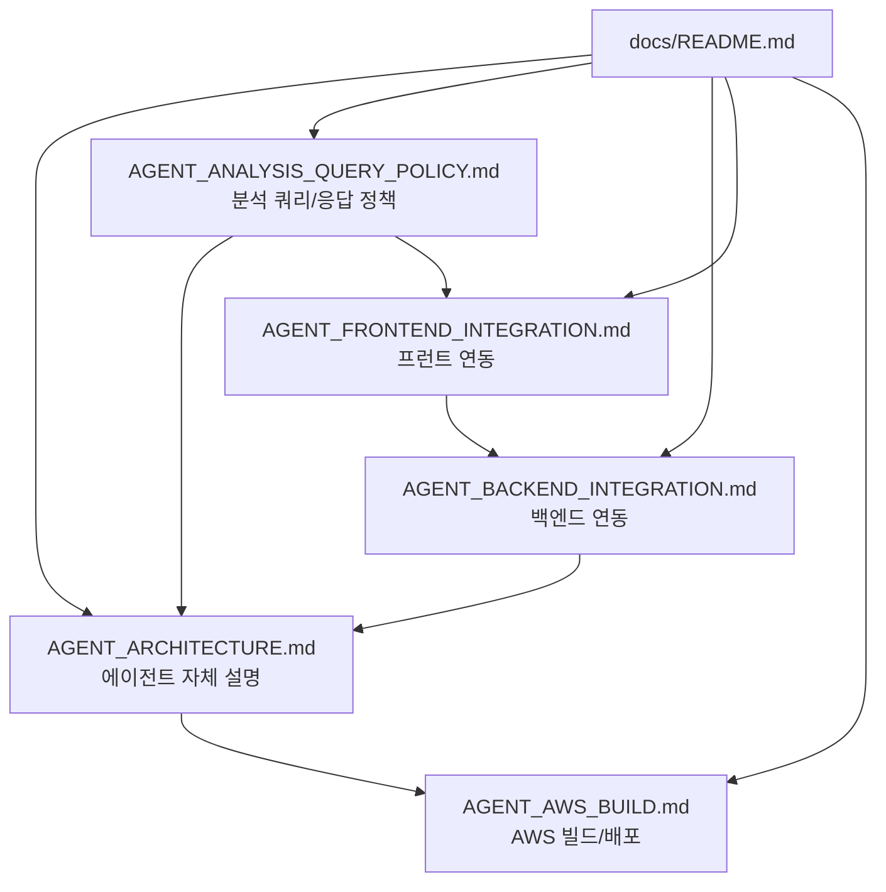

# GOPS Docs

Reference docs for future implementation. The root `README.md` stays short;
repo-wide Codex rules live in root `AGENTS.md`; deeper project docs live here.

| File | Purpose |
| --- | --- |
| `PRODUCT_CONTEXT.md` | Product direction and current/future scope boundary. |
| `CHART_DATA_REBUILD_PLAN.md` | Source-of-truth plan for the on-demand chart data rebuild. This wins over older chart, market-data, preload, S3, Redis, and Kafka notes. |
| `STRUCTURE_GUIDE.md` | Folder placement rules for future code. |
| `ARCHITECTURE.md` | Current system, pod/job, and platform relationships. |
| `IMAGE_STRATEGY.md` | Docker image boundaries and naming rules. |
| `ENVIRONMENT.md` | Env, secret, and platform contracts. |
| `AGENT_ORCHESTRATION_IMPLEMENTATION.md` | Summary of the role-based multi-agent implementation and Docker validation. |
| `AGENT_ARCHITECTURE.md` | `AgentOrchestrator`, role agents, snapshots, synthesis, provider boundary, `EvidenceItem` 계약. |
| `AGENT_ANALYSIS_QUERY_POLICY.md` | 우선 처리할 분석 쿼리 종류, 결론 중심 답변 형식, 신뢰도 표시, 내부 GraphDB 사용 정책. |
| `AGENT_BACKEND_INTEGRATION.md` | Backend API, idempotency, Kafka async path, Redis report store, polling/SSE/WebSocket 계약. |
| `AGENT_FRONTEND_INTEGRATION.md` | 프런트 request shape, `analysisId`, polling/SSE, report rendering, layout/chart proposal 처리. |
| `AGENT_AWS_BUILD.md` | `gops-agent-orchestrator` image, ECR/EKS, Kafka, Redis/Valkey, ClickHouse, GraphDB, S3, secrets, smoke checks. |
| `../AGENTS.md` | Codex/contributor rules for this repo. |

Old long-form specs were removed to avoid stale, conflicting guidance.
If a future long-form spec is needed, add it under `docs/` with a clear owner
and date. Agent-specific handoff content should stay in the `AGENT_*` documents
listed above.

For chart data work, do not follow older notes that require a preset symbol
universe preload, S&P500-wide collection, raw S3 replay as a normal read path,
or a Kafka topic layout that differs from the Mermaid. Use
`CHART_DATA_REBUILD_PLAN.md`.
